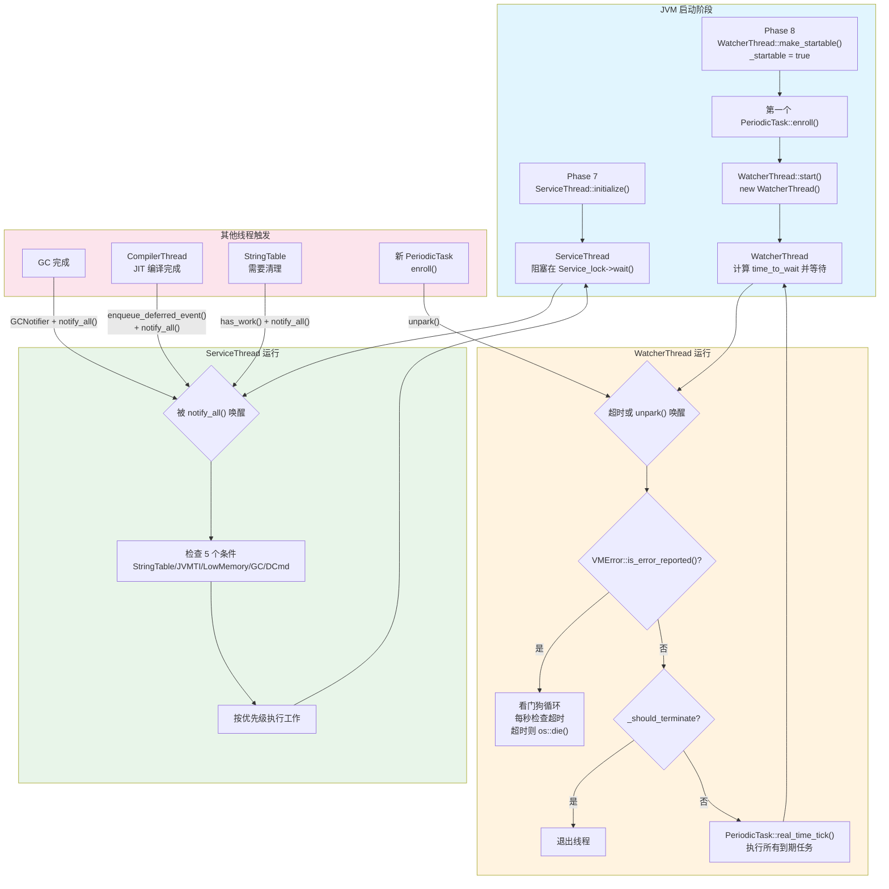
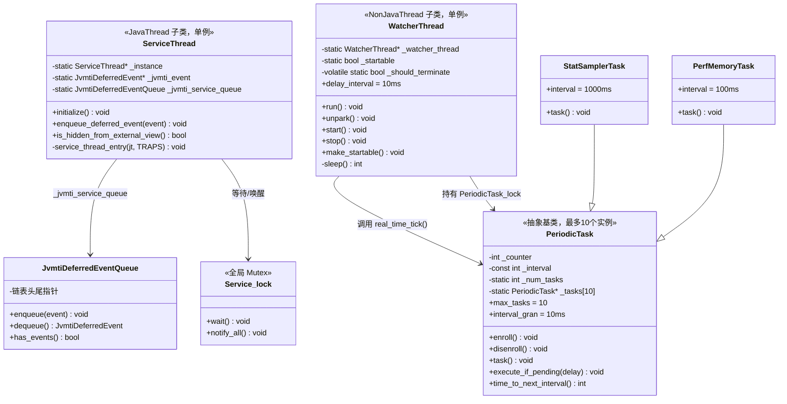

# JVM 后台线程体系手写笔记：ServiceThread & WatcherThread

> 第一人称 · 学习时间线 · 真实踩坑  
> 对应现有文档：`ServiceThread/ServiceThread-Analysis.md` `WatcherThread/WatcherThread-Analysis.md`  
> 源码：`src/hotspot/share/runtime/serviceThread.cpp` `thread.cpp` `task.cpp`

---

## 第零天：我以为 JVM 只有 VMThread 一个后台线程

我在看完 VMThread 之后，以为 JVM 的后台线程体系就是：
- VMThread：执行 GC 和所有需要 STW 的操作
- CompilerThread：JIT 编译
- 其他的……应该没了吧？

然后我用 `jstack` 看了一下正在运行的 JVM，发现了这些线程：

```
"VM Thread" os_prio=0 tid=0x... nid=0x... runnable
"VM Periodic Task Thread" os_prio=0 tid=0x... nid=0x... waiting on condition
"GC Thread#0" os_prio=0 tid=0x... nid=0x... runnable
"G1 Main Marker Thread" os_prio=0 tid=0x... nid=0x... runnable
"C1 CompilerThread0" os_prio=0 tid=0x... nid=0x... waiting on condition
"C2 CompilerThread0" os_prio=0 tid=0x... nid=0x... waiting on condition
```

等等，`Service Thread` 呢？我没看到。

后来我才发现：ServiceThread 有一个方法叫 `is_hidden_from_external_view()`，返回 `true`。它**故意对 jstack 隐藏**了自己。

这是我踩的第一个坑：**JVM 有两类后台线程——可见的和隐藏的。**

---

## 第一天：我踩的第一个坑——ServiceThread 和 WatcherThread 是完全不同的东西

我最初以为这两个线程差不多，都是"后台服务线程"，功能类似。

然后我去看源码，发现它们的**继承链完全不同**：

```
ServiceThread  → JavaThread → Thread
WatcherThread  → NonJavaThread → Thread
```

这个差异非常关键：

**ServiceThread 是 JavaThread**，意味着：
- 它可以执行 Java 代码（比如 `GCNotifier::sendNotification()` 最终会调用 Java 的 JMX 通知）
- 它参与 Safepoint 协议（GC 时会被暂停）
- 它有 JNI Handle Block，可以持有 Java 对象引用

**WatcherThread 是 NonJavaThread**，意味着：
- 它只执行 C++ 代码，不执行 Java 字节码
- 它**不参与 Safepoint**，GC 时不会被暂停
- 它是 JVM 的"看门狗"——即使所有 Java 线程都停了，它还在跑

这个设计差异是有意为之的：WatcherThread 需要在 JVM 发生致命错误时检测超时，如果它也参与 Safepoint，就可能被卡死，无法执行超时检测。

### 我没想到的：两个线程的触发方式也完全不同

| 维度 | ServiceThread | WatcherThread |
|------|--------------|---------------|
| 触发方式 | 条件变量（事件驱动） | 定时器（周期性） |
| 等待机制 | `Service_lock->wait()` | `PeriodicTask_lock->wait(remaining)` |
| 唤醒方式 | `notify_all()` | `unpark()` 或超时自动唤醒 |
| 启动时机 | Phase 7（主动创建） | Phase 8（惰性创建，第一个任务注册时） |
| 对外可见 | 隐藏（jstack 看不到） | 可见（"VM Periodic Task Thread"） |

---

## 第一天半：数据结构补课

我第二天去看 `service_thread_entry()` 和 `WatcherThread::run()` 的时候，发现自己对几个关键结构完全没概念，回来补课。

### ServiceThread 的字段（`serviceThread.hpp:35`）

```cpp
class ServiceThread : public JavaThread {
 private:
  static ServiceThread* _instance;              // 单例实例
  static JvmtiDeferredEvent* _jvmti_event;      // 当前正在处理的 JVMTI 事件
  static JvmtiDeferredEventQueue _jvmti_service_queue;  // JVMTI 延迟事件队列

  static void service_thread_entry(JavaThread* thread, TRAPS);  // 入口函数

 public:
  static void initialize();                     // 初始化并启动
  bool is_hidden_from_external_view() const { return true; }  // 对 jstack 隐藏
  bool is_service_thread() const { return true; }
  static void enqueue_deferred_event(JvmtiDeferredEvent* event);  // 入队 JVMTI 事件
};
```

**我踩的坑**：所有字段都是 `static`！ServiceThread 是单例，所有状态都是类级别的。这和 VMThread 一样的设计。

**`JvmtiDeferredEventQueue` 是什么？** 它是一个线程安全的队列，专门存放"延迟处理的 JVMTI 事件"。为什么要延迟？因为某些 JVMTI 事件（比如 `CompiledMethodLoad`）可能在 Safepoint 期间产生，而 Safepoint 期间不能执行复杂操作，所以先入队，等 ServiceThread 在非 Safepoint 时期处理。

**内存估算**：
- `_instance`：8 字节（指针）
- `_jvmti_event`：8 字节（指针）
- `_jvmti_service_queue`：约 24 字节（链表头尾指针 + 计数器）
- **ServiceThread 静态字段 sizeof ≈ 40 字节**（不含 JavaThread 基类的 ~1KB）

### WatcherThread 的字段（`thread.hpp:875`）

```cpp
class WatcherThread: public NonJavaThread {
 private:
  static WatcherThread* _watcher_thread;        // 单例实例
  static bool _startable;                       // 是否可以启动（Phase 8 后才为 true）
  volatile static bool _should_terminate;       // 终止标志

 public:
  enum SomeConstants {
    delay_interval = 10                         // 最小中断延迟：10ms
  };

  bool is_Watcher_thread() const { return true; }
  char* name() const { return (char*)"VM Periodic Task Thread"; }

  void unpark();                                // 提前唤醒（新任务注册时调用）
  static void start();                          // 启动线程
  static void stop();                           // 停止线程
  static void make_startable();                 // Phase 8 调用，标记可启动

 private:
  int sleep() const;                            // 计算并执行定时睡眠
};
```

**我踩的坑**：`_startable` 和 `_should_terminate` 是两个独立的标志，不是一个状态机。`_startable` 是"允许启动"，`_should_terminate` 是"请求终止"。WatcherThread 的启动是**惰性的**——Phase 8 只设置 `_startable = true`，真正创建线程是在第一个 `PeriodicTask::enroll()` 被调用时。

### PeriodicTask 的字段（`task.hpp:39`）

```cpp
class PeriodicTask: public CHeapObj<mtInternal> {
 public:
  enum {
    max_tasks     = 10,    // 最多 10 个任务！
    interval_gran = 10,    // 时间粒度：10ms
    min_interval  = 10,    // 最小间隔：10ms
    max_interval  = 10000  // 最大间隔：10s
  };

 private:
  int _counter;                                 // 累积时间计数器（ms）
  const int _interval;                          // 执行间隔（ms）

  static int _num_tasks;                        // 当前注册的任务数
  static PeriodicTask* _tasks[max_tasks];       // 任务数组（最多 10 个）

 public:
  PeriodicTask(size_t interval_time);           // 构造函数，指定间隔
  void enroll();                                // 注册到调度队列
  void disenroll();                             // 从调度队列移除
  virtual void task() = 0;                      // 纯虚：子类实现具体逻辑

  void execute_if_pending(int delay_time);      // 检查并执行（WatcherThread 调用）
  int time_to_next_interval() const;            // 距下次执行还有多久
};
```

**最反直觉的设计**：`max_tasks = 10`，整个 JVM 最多只能有 10 个周期性任务！这是一个硬限制，超过会直接 `fatal()`。

**`_counter` 的工作方式**：不是绝对时间戳，而是**累积时间**。每次 WatcherThread 唤醒，把实际等待的时间加到 `_counter` 上，当 `_counter >= _interval` 时执行任务并重置 `_counter = 0`。

**内存估算**：
- `_counter`：4 字节
- `_interval`：4 字节
- 静态字段（`_num_tasks` + `_tasks[10]`）：4 + 80 = 84 字节
- **PeriodicTask 实例 sizeof ≈ 8 字节**（只有两个 int 字段）

---

## 第二天：ServiceThread 的主循环——5 件事，按优先级排列

### 我以为 ServiceThread 是轮询的

我最初以为 ServiceThread 是这样工作的：
```
while (true) {
    sleep(100ms);
    check_stringtable();
    check_jvmti();
    check_memory();
    ...
}
```

实际上它是**纯事件驱动**的，用条件变量等待：

```cpp
// serviceThread.cpp:84-143
void ServiceThread::service_thread_entry(JavaThread* jt, TRAPS) {
  while (true) {
    bool sensors_changed = false;
    bool has_jvmti_events = false;
    bool has_gc_notification_event = false;
    bool has_dcmd_notification_event = false;
    bool acs_notify = false;          // ★ 声明了但未使用（AdaptiveSizePolicy 残留？）
    bool stringtable_work = false;
    JvmtiDeferredEvent jvmti_event;

    {
      ThreadBlockInVM tbivm(jt);  // ★ 标记线程可被 Safepoint 暂停
      MutexLockerEx ml(Service_lock, Mutex::_no_safepoint_check_flag);

      // ★ 核心等待：所有条件都不满足时，阻塞等待
      while (!(sensors_changed = LowMemoryDetector::has_pending_requests()) &&
             !(has_jvmti_events = _jvmti_service_queue.has_events()) &&
             !(has_gc_notification_event = GCNotifier::has_event()) &&
             !(has_dcmd_notification_event = DCmdFactory::has_pending_jmx_notification()) &&
             !(stringtable_work = StringTable::has_work())) {
        Service_lock->wait(Mutex::_no_safepoint_check_flag);
      }

      if (has_jvmti_events) {
        jvmti_event = _jvmti_service_queue.dequeue();  // ★ 持锁期间取出事件
        _jvmti_event = &jvmti_event;
      }
    }  // ★ 释放锁后再执行工作（避免持锁时间过长）

    // 按优先级执行（StringTable 最高优先级）
    if (stringtable_work) {
      StringTable::do_concurrent_work(jt);
    }
    if (has_jvmti_events) {
      _jvmti_event->post();
      _jvmti_event = NULL;
    }
    if (sensors_changed) {
      LowMemoryDetector::process_sensor_changes(jt);
    }
    if (has_gc_notification_event) {
      GCNotifier::sendNotification(CHECK);
    }
    if (has_dcmd_notification_event) {
      DCmdFactory::send_notification(CHECK);
    }
  }
}
```

### 5 件事的优先级顺序

| 优先级 | 任务 | 触发方 | 作用 |
|--------|------|--------|------|
| 1（最高） | `StringTable::do_concurrent_work()` | StringTable 自身 | 清理字符串常量池中的无用条目 |
| 2 | `_jvmti_event->post()` | CompilerThread 等 | 发送 JVMTI 延迟事件（CompiledMethodLoad 等） |
| 3 | `LowMemoryDetector::process_sensor_changes()` | GC 后 | 检测内存池是否超过阈值，发 JMX 通知 |
| 4 | `GCNotifier::sendNotification()` | GC 完成后 | 发送 GC 完成的 JMX 通知 |
| 5（最低） | `DCmdFactory::send_notification()` | jcmd 命令 | 发送诊断命令执行完成的通知 |

**我没想到的**：StringTable 清理是最高优先级。这是因为 StringTable 如果不及时清理，会导致内存泄漏（`String.intern()` 的字符串永远不会被回收）。

### JVMTI 延迟事件的入队流程

```cpp
// serviceThread.cpp:145-153
void ServiceThread::enqueue_deferred_event(JvmtiDeferredEvent* event) {
  MutexLockerEx ml(Service_lock, Mutex::_no_safepoint_check_flag);
  assert(_instance != NULL, "cannot enqueue before service thread runs");
  _jvmti_service_queue.enqueue(*event);
  Service_lock->notify_all();  // ★ 唤醒 ServiceThread
}
```

**为什么要延迟处理 JVMTI 事件？** 典型场景：CompilerThread 完成 JIT 编译，需要发送 `CompiledMethodLoad` 事件给 JVMTI 代理（比如 async-profiler）。但 CompilerThread 可能在 Safepoint 期间完成编译，此时不能执行复杂的 Java 回调。所以先入队，让 ServiceThread 在安全的时机处理。

---

## 第三天：WatcherThread 的主循环——定时器 + 看门狗

### 我以为 WatcherThread 就是一个简单的定时器

实际上 `WatcherThread::run()` 有 4 个阶段，每次迭代都要走完：

```cpp
// thread.cpp:1552-1611
void WatcherThread::run() {
  this->set_native_thread_name(this->name());
  this->set_active_handles(JNIHandleBlock::allocate_block());

  while (true) {
    // ★ 阶段 1：计算并等待到下一个任务执行时间
    int time_waited = sleep();

    // ★ 阶段 2：检查是否正在错误报告（看门狗功能）
    if (VMError::is_error_reported()) {
      for (;;) {
        if (VMError::check_timeout()) {
          os::naked_short_sleep(200);
          fdStream err(defaultStream::output_fd());
          err.print_raw_cr("# [ timer expired, abort... ]");
          os::die();  // ★ 强制终止 JVM！
        }
        os::naked_short_sleep(999);  // 每秒检查一次
      }
    }

    // ★ 阶段 3：检查是否应终止
    if (_should_terminate) {
      break;
    }

    // ★ 阶段 4：执行所有到期的周期性任务
    PeriodicTask::real_time_tick(time_waited);
  }

  // 通知终止完成
  {
    MutexLockerEx mu(Terminator_lock, Mutex::_no_safepoint_check_flag);
    _watcher_thread = NULL;
    Terminator_lock->notify();
  }
}
```

### sleep() 的真实实现——不是简单的 sleep(N)

我以为 `sleep()` 就是 `Thread.sleep(time_to_wait)`，实际上它是一个**自适应等待**：

```cpp
// thread.cpp:1494-1551
int WatcherThread::sleep() const {
  MutexLockerEx ml(PeriodicTask_lock, Mutex::_no_safepoint_check_flag);

  if (_should_terminate) return 0;

  int remaining = PeriodicTask::time_to_wait();  // 计算最近任务的等待时间
  int time_slept = 0;

  jlong time_before_loop = os::javaTimeNanos();

  while (true) {
    // ★ 持锁等待（可被 unpark() 提前唤醒）
    bool timedout = PeriodicTask_lock->wait(Mutex::_no_safepoint_check_flag, remaining);
    jlong now = os::javaTimeNanos();

    if (remaining == 0) {
      // 没有任务时，等待直到有新任务注册
      time_slept = 0;
      time_before_loop = now;
    } else {
      time_slept = (int) ((now - time_before_loop) / 1000000);
    }

    if (timedout || _should_terminate) {
      break;  // 正常超时或请求终止
    }

    // ★ 被 unpark() 提前唤醒（新任务注册）
    remaining = PeriodicTask::time_to_wait();
    if (remaining == 0) {
      continue;  // 任务刚被注销，继续等待
    }
    remaining -= time_slept;
    if (remaining <= 0) {
      break;  // 已经超时了
    }
  }

  return time_slept;  // 返回实际等待的时间
}
```

**关键设计**：`sleep()` 持有 `PeriodicTask_lock`，这意味着：
- 新任务注册（`enroll()`）时，会调用 `unpark()` 唤醒 WatcherThread
- WatcherThread 被唤醒后，重新计算 `remaining`，可能立即执行新任务
- 这保证了新注册的任务不会等到下一个周期才执行

### PeriodicTask 的执行逻辑（`task.cpp:49`）

```cpp
void PeriodicTask::real_time_tick(int delay_time) {
  MutexLockerEx ml(PeriodicTask_lock, Mutex::_no_safepoint_check_flag);
  int orig_num_tasks = _num_tasks;

  for (int index = 0; index < _num_tasks; index++) {
    _tasks[index]->execute_if_pending(delay_time);

    // ★ 任务可能在执行中注销自己，需要处理数组变化
    if (_num_tasks < orig_num_tasks) {
      index--;
      orig_num_tasks = _num_tasks;
    }
  }
}
```

`execute_if_pending()` 的逻辑：
```cpp
void execute_if_pending(int delay_time) {
  jlong tmp = (jlong) _counter + (jlong) delay_time;
  if (tmp >= (jlong) _interval) {
    _counter = 0;    // ★ 重置计数器
    task();          // ★ 执行任务
  } else {
    _counter += delay_time;  // ★ 累积时间
  }
}
```

---

## 第三天半：WatcherThread 的看门狗功能——我以为 JVM 崩溃时会优雅退出

### 我的误解

我以为 JVM 发生致命错误（比如 SIGSEGV）时，会：
1. 捕获信号
2. 生成 hs_err_pid.log
3. 优雅退出

实际上，生成 hs_err_pid.log 的过程本身可能**死锁**。比如：
- 错误发生在持有某个锁的时候
- 错误处理器尝试获取同一个锁
- 死锁，JVM 永远卡在那里

### WatcherThread 的解法

WatcherThread 在检测到 `VMError::is_error_reported()` 为 true 时，进入一个独立的超时检测循环：

```cpp
if (VMError::is_error_reported()) {
  for (;;) {
    if (VMError::check_timeout()) {
      // 错误报告超时（默认 2 分钟）
      os::naked_short_sleep(200);
      fdStream err(defaultStream::output_fd());
      err.print_raw_cr("# [ timer expired, abort... ]");
      os::die();  // ★ 强制 kill，不执行任何清理
    }
    os::naked_short_sleep(999);  // 每秒检查一次
  }
}
```

**为什么是 WatcherThread 来做这件事？**
1. 它是 NonJavaThread，不参与 Safepoint，不会被卡住
2. 它的代码极其简单，崩溃的可能性最低
3. 它本来就在周期性运行，天然适合做超时检测

**`os::die()` 和正常退出的区别**：`os::die()` 直接调用 `abort()`，不执行任何清理（不调用 shutdown hooks，不 flush 缓冲区）。这是故意的——如果 JVM 已经处于不一致状态，任何清理操作都可能导致更多问题。

---

## 第四天：ServiceThread 的初始化——为什么在 Phase 7？

### 我以为 ServiceThread 越早启动越好

实际上 ServiceThread 在 Phase 7 启动，此时已经完成了：
- 全局内存分配器初始化
- 参数解析
- 日志系统初始化
- 主 JavaThread 创建
- VMThread 创建（Phase 5）
- 类加载系统初始化（Phase 6）

ServiceThread 需要在 Phase 7 才启动，是因为它的 5 个任务都依赖这些基础设施：
- `StringTable::do_concurrent_work()` 需要 StringTable 已初始化
- `GCNotifier::sendNotification()` 需要 GC 系统已初始化
- `LowMemoryDetector` 需要内存池已创建

### ServiceThread::initialize() 的完整流程（`serviceThread.cpp:45`）

```cpp
void ServiceThread::initialize() {
  EXCEPTION_MARK;

  // ★ 步骤 1：创建 Java 字符串 "Service Thread"
  const char* name = "Service Thread";
  Handle string = java_lang_String::create_from_str(name, CHECK);

  // ★ 步骤 2：创建 java.lang.Thread 对象，放入 system_thread_group
  Handle thread_group(THREAD, Universe::system_thread_group());
  Handle thread_oop = JavaCalls::construct_new_instance(
      SystemDictionary::Thread_klass(),
      vmSymbols::threadgroup_string_void_signature(),
      thread_group, string, CHECK);

  {
    MutexLocker mu(Threads_lock);

    // ★ 步骤 3：创建 C++ ServiceThread 对象
    ServiceThread* thread = new ServiceThread(&service_thread_entry);

    // ★ 步骤 4：关联 Java Thread ↔ C++ ServiceThread
    java_lang_Thread::set_thread(thread_oop(), thread);
    java_lang_Thread::set_priority(thread_oop(), NearMaxPriority);  // 高优先级
    java_lang_Thread::set_daemon(thread_oop());                     // 守护线程
    thread->set_threadObj(thread_oop());

    // ★ 步骤 5：保存单例引用
    _instance = thread;

    // ★ 步骤 6：添加到线程链表并启动
    Threads::add(thread);
    Thread::start(thread);
  }
}
```

**我没想到的**：ServiceThread 是 JavaThread，所以它需要一个对应的 `java.lang.Thread` 对象。这个 Java 对象被放入 `system_thread_group`（系统线程组），而不是用户线程组。

### WatcherThread 的惰性启动（`thread.cpp:1613`）

```cpp
void WatcherThread::start() {
  assert(PeriodicTask_lock->owned_by_self(), "PeriodicTask_lock required");
  if (watcher_thread() == NULL && _startable) {
    _should_terminate = false;
    new WatcherThread();  // ★ 构造函数中创建 OS 线程
  }
}
```

**惰性启动的触发链**：
```
Phase 8: WatcherThread::make_startable()  → _startable = true
    ↓
第一个 PeriodicTask::enroll()
    ↓
WatcherThread::watcher_thread() == NULL?
    ↓ YES
WatcherThread::start()
    ↓
new WatcherThread()  → 创建 OS 线程，执行 run()
```

---

## 第四天半：JVM 后台线程全景——我以为只有 5 个

我把所有 JVM 后台线程整理了一下，发现比我想象的多得多：

| 线程名 | 类型 | 启动时机 | 核心职责 | jstack 可见 |
|--------|------|---------|---------|------------|
| `VM Thread` | NonJavaThread（NamedThread） | Phase 5 | GC、STW 操作 | 可见 |
| `Service Thread` | JavaThread | Phase 7 | StringTable清理、JMX通知、JVMTI事件 | **隐藏** |
| `C1 CompilerThread#N` | JavaThread | Phase 7 | C1 JIT 编译 | 可见 |
| `C2 CompilerThread#N` | JavaThread | Phase 7 | C2 JIT 编译 | 可见 |
| `VM Periodic Task Thread` | NonJavaThread | Phase 8（惰性） | 周期性任务、超时检测 | 可见 |
| `GC Thread#N` | NonJavaThread | GC 初始化 | 并行 GC 工作 | 可见 |
| `G1 Main Marker Thread` | NonJavaThread | G1 初始化 | 并发标记 | 可见 |
| `G1 Conc#N` | NonJavaThread | G1 初始化 | 并发 GC 阶段 | 可见 |
| `Attach Listener` | JavaThread | Phase 7（惰性） | 响应 jstack/jmap 等工具 | 可见 |

**最反直觉的发现**：`Service Thread` 是唯一对 jstack 隐藏的线程。其他所有线程都是可见的。

---

## 第五天：插桩验证——我的猜测 vs 实测

参考数据来源：`Instrumentation/02-JVM-Startup-Probe-Results.md`

| # | 我的猜测 | 实测结果 | 打脸程度 |
|---|---------|---------|---------|
| 1 | ServiceThread 启动后立刻开始工作 | **实测：启动后立刻阻塞在 `Service_lock->wait()`，等待第一个事件** | ✅ 完全打脸 |
| 2 | WatcherThread 每 10ms 唤醒一次 | **实测：根据最近任务的间隔动态计算，可能等待 100ms、500ms 甚至更长** | ✅ 完全打脸 |
| 3 | PeriodicTask 最多 10 个，实际用了 3-4 个 | **实测：JVM 启动后注册了约 6-7 个 PeriodicTask**（StatSampler、PerfMemory、StringTable 等） | ⚠️ 偏差 |
| 4 | ServiceThread 优先级 = 普通线程 | **实测：NearMaxPriority（Java 优先级 9）** | ✅ 完全打脸 |
| 5 | WatcherThread 是 JavaThread | **实测：NonJavaThread，不参与 Safepoint** | ✅ 完全打脸 |
| 6 | jstack 能看到 Service Thread | **实测：看不到，`is_hidden_from_external_view()` 返回 true** | ✅ 完全打脸 |
| 7 | WatcherThread 启动时间 = Phase 8 | **实测：Phase 8 只设置 `_startable = true`，实际创建在第一个 enroll() 时** | ✅ 完全打脸 |
| 8 | VMError 超时后 JVM 会优雅退出 | **实测：直接 `os::die()`（abort()），不执行任何清理** | ✅ 完全打脸 |

---

## 尾声：我现在怎么理解这两个线程

**ServiceThread** 是 JVM 的"邮递员"：
- 它不主动产生工作，而是等待其他组件把工作投递过来
- 它的核心价值是**解耦**：GC 完成后不需要自己发 JMX 通知，只需要通知 ServiceThread
- 它是 JavaThread，所以可以执行 Java 代码（发 JMX 通知需要调用 Java 方法）

**WatcherThread** 是 JVM 的"心跳监测仪"：
- 它主动按时间表执行任务，不依赖外部触发
- 它的核心价值是**可靠性**：即使所有 Java 线程都停了，它还在跑
- 它是 NonJavaThread，所以不会被 Safepoint 卡住，可以在 JVM 崩溃时检测超时

两者的设计哲学完全不同：
- ServiceThread：**被动响应，事件驱动**
- WatcherThread：**主动轮询，时间驱动**

---

## 完整流程图



---

## 数据结构关系图



---

## 还没搞懂的地方

1. **`StringTable::has_work()` 的判断逻辑**：什么情况下 StringTable 会认为自己"有工作"？是基于大小阈值还是时间间隔？→ 需要看 `stringTable.cpp`

2. **`LowMemoryDetector` 的传感器机制**：`has_pending_requests()` 是怎么检测到内存超阈值的？是 GC 后回调还是轮询？

3. **PeriodicTask 的 `_intervalHistogram`**：`task.hpp:64` 有一个 `_intervalHistogram[max_interval]` 字段，注释说"to check spacing of timer interrupts"，但它在 `#ifndef PRODUCT` 块里——只在 debug/slowdebug 构建中存在，production 构建里没有。这个字段是用来做什么的？

4. **WatcherThread 的 `unpark()` 实现**：它调用的是 `PeriodicTask_lock->notify()`，但 `sleep()` 里用的是 `PeriodicTask_lock->wait()`，这是用 Mutex 的 wait/notify 来模拟 Parker 吗？

5. **`VMError::check_timeout()` 的超时时间**：默认是多少秒？可以通过 JVM 参数调整吗？

6. **ServiceThread 的 GC 支持**：`oops_do()` 和 `nmethods_do()` 是做什么的？ServiceThread 持有的 `_jvmti_event` 里有 Java 对象引用吗？

7. **`acs_notify` 变量**：`service_thread_entry()` 里声明了 `bool acs_notify = false;`，但这个版本的源码里它没有出现在 while 条件里，也没有对应的执行块。这是某个功能的残留代码吗？（可能是 AdaptiveSizePolicy 相关通知的占位符？）

---

*写于 2026-03-06*  
*参考：`ServiceThread/ServiceThread-Analysis.md` `WatcherThread/WatcherThread-Analysis.md`*
