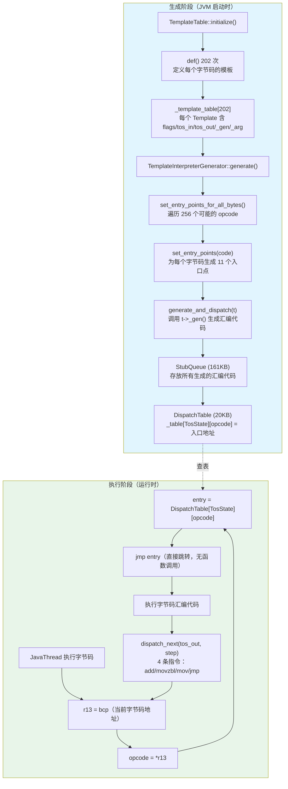
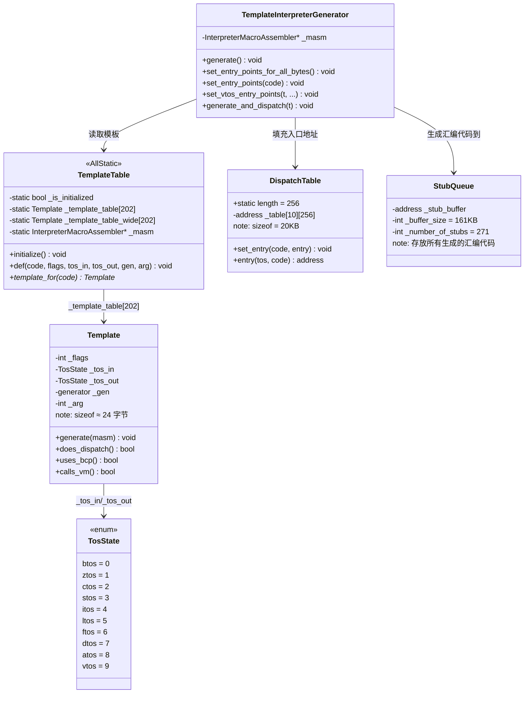

# TemplateInterpreter 手写笔记

> 第一人称 · 学习时间线 · 真实踩坑  
> 对应现有文档：`Interpreter/1.0-StubQueue-Layout.md` `TemplateTable/TemplateTable.md` `Interpreter/4.0-bytecode-templates.md`  
> 源码：`src/hotspot/share/interpreter/templateTable.cpp` `templateInterpreterGenerator.cpp` `templateTable_x86.cpp`

---

## 第零天：我以为解释器就是一个 switch-case

我第一次想象 JVM 解释器的时候，脑子里的画面是这样的：

```java
// 我以为的解释器
while (true) {
    byte opcode = bytecode[pc++];
    switch (opcode) {
        case ICONST_0: stack.push(0); break;
        case IADD:     int b = stack.pop(); int a = stack.pop(); stack.push(a+b); break;
        case IRETURN:  return stack.pop();
        // ... 200 多个 case
    }
}
```

这个模型有什么问题？

**每执行一条字节码，都要经过：**
1. 读取 opcode（内存访问）
2. switch 跳转（分支预测失败）
3. 调用 C++ 函数（函数调用开销）
4. 操作 Java 栈（内存读写）

对于一个每秒执行数亿条字节码的 JVM 来说，这个开销是不可接受的。

然后我去看源码，发现 JVM 的解释器叫 **TemplateInterpreter**，完全不是 switch-case。

---

## 第一天：我踩的第一个坑——解释器是生成的汇编代码

### 我的第一个误解：解释器是 C++ 写的

我以为 JVM 解释器是用 C++ 写的，每个字节码对应一个 C++ 函数。

实际上，JVM 在**启动时**会生成一段汇编代码，这段代码就是解释器。之后执行字节码，就是直接跳转到这段汇编代码里执行。

**关键区别**：
- 我以为的：C++ 函数 → 每次调用有函数调用开销
- 实际的：汇编代码 → 直接执行，无函数调用开销

### 我没想到的：解释器有 161KB

我用 `-XX:+PrintInterpreter` 看了一下解释器的大小：

```
Interpreter
code size        =    161K bytes
total space      =    161K bytes
# of codelets    =    271
avg codelet size =    612 bytes
```

161KB 的汇编代码！这是 JVM 启动时动态生成的。

这 161KB 分成 271 个 **Codelet**（代码片段），每个 Codelet 对应一个字节码或一个解释器功能（比如方法入口、异常处理等）。

### 解释器的三层结构

我以为解释器只有"字节码执行"这一层，实际上有三层：

```
StubQueue (161KB)
├── 基础桩代码区域 (~33KB)
│   ├── slow_signature_handler (608B)  — native 方法签名处理
│   ├── error_exits (64B)              — 错误退出
│   ├── return_entry (2880B)           — 方法返回入口
│   ├── safepoint_entry (3424B)        — 安全点入口
│   └── throw_exception (6176B)        — 异常抛出
│
├── 方法入口点区域 (~14KB)
│   ├── zerolocals (1984B)             — 普通方法入口 ⭐
│   ├── zerolocals_synchronized (2592B)— 同步方法入口
│   ├── native (3808B)                 — native 方法入口 ⭐
│   └── java_lang_math_* (11×32B)      — Math 内置函数
│
└── 字节码模板区域 (~100KB)
    ├── nop (96B)
    ├── iconst_0 (96B)
    ├── iadd (96B)
    ├── aastore (256+B)                — 含 G1 写屏障
    ├── invokevirtual (1000+B)         — 含内联缓存
    └── ... 共 202 个字节码模板
```

---

## 第一天半：数据结构补课

我第二天去看 `TemplateTable::initialize()` 的时候，发现自己对几个关键结构完全没概念，回来补课。

### Template 结构（`templateTable.hpp:44`）

```cpp
class Template {
 private:
  enum Flags {
    uses_bcp_bit,       // 0: 需要 bcp 指向当前字节码（读取操作数时）
    does_dispatch_bit,  // 1: 自己负责分发下一字节码（invoke/return/goto）
    calls_vm_bit,       // 2: 会调用 VM 运行时（可能触发 GC/JVMTI）
    wide_bit            // 3: 这是 wide 指令版本
  };

  typedef void (*generator)(int arg);  // 生成器函数指针

  int       _flags;    // 标志位组合（4 个 bit）
  TosState  _tos_in;   // 执行前栈顶状态
  TosState  _tos_out;  // 执行后栈顶状态
  generator _gen;      // 机器码生成函数
  int       _arg;      // 生成器参数（如 iconst 的值 0/1/2...）
};
```

**我踩的坑**：`_gen` 不是"执行字节码的函数"，而是"**生成**执行字节码的机器码的函数"。这两者有本质区别：
- `_gen` 在 JVM **启动时**被调用一次，生成汇编代码
- 生成的汇编代码在**每次执行字节码时**被调用

**sizeof(Template) 估算**：
- `_flags`：4 字节
- `_tos_in`：4 字节（enum）
- `_tos_out`：4 字节（enum）
- `_gen`：8 字节（函数指针）
- `_arg`：4 字节
- **sizeof(Template) ≈ 24 字节**（含对齐）

### TosState 枚举（`globalDefinitions.hpp`）

```cpp
enum TosState {
  btos = 0,   // byte (8bit)
  ztos = 1,   // boolean (8bit)
  ctos = 2,   // char (16bit)
  stos = 3,   // short (16bit)
  itos = 4,   // int (32bit)   ← btos/ztos/ctos/stos 在 x86-64 上都用 itos 入口
  ltos = 5,   // long (64bit)
  ftos = 6,   // float (32bit)
  dtos = 7,   // double (64bit)
  atos = 8,   // object reference
  vtos = 9,   // void / 栈顶为空
  number_of_states = 10
};
```

**我没想到的**：`btos`/`ztos`/`ctos`/`stos` 在 x86-64 上都共享 `itos` 入口点。因为 x86-64 的 32 位寄存器 `eax` 可以存放所有这些类型，没必要为每种类型生成不同的代码。

**TosState 的作用**：JVM 是基于栈的虚拟机，但为了性能，解释器会把栈顶值缓存在寄存器里（x86-64 上是 `rax`/`xmm0`）。TosState 告诉解释器"当前寄存器里缓存的是什么类型的值"。

### TemplateTable 静态表（`templateTable.hpp:81`）

```cpp
class TemplateTable : AllStatic {
 private:
  static bool     _is_initialized;
  static Template _template_table[Bytecodes::number_of_codes];       // 202 个普通字节码
  static Template _template_table_wide[Bytecodes::number_of_codes];  // wide 版本
  static Template* _desc;                                             // 当前正在定义的模板
  static InterpreterMacroAssembler* _masm;                           // 汇编生成器
};
```

**内存估算**：
- `_template_table[202]`：202 × 24 = 4848 字节 ≈ 5KB
- `_template_table_wide[202]`：同上 ≈ 5KB
- **TemplateTable 静态数据 ≈ 10KB**

### DispatchTable 结构（`abstractInterpreter.hpp`）

```cpp
class DispatchTable {
 public:
  static const int length = 1 << BitsPerByte;  // 256（1 字节能表示的所有值）
 private:
  address _table[number_of_states][length];    // [TosState][bytecode] → 入口地址
};
```

**内存估算**：
- `_table[10][256]`：10 × 256 × 8 = 20480 字节 = 20KB
- **DispatchTable sizeof ≈ 20KB**

**这是整个分发机制的核心**：给定当前栈顶状态（TosState）和下一个字节码（opcode），O(1) 查找到对应的机器码入口地址。

---

## 第二天：字节码分发——dispatch_next 是怎么跳转的

### 我以为分发就是"读下一个字节码然后 switch"

实际上分发是这样的（x86-64 汇编）：

```asm
; dispatch_next(itos, 1)  — 执行完当前字节码后，分发到下一个
add    r13, 1                              ; r13 = bcp（字节码指针），前进 1 字节
movzbl ebx, BYTE PTR [r13]                 ; ebx = 下一个字节码的 opcode
mov    rax, QWORD PTR [r15 + disp + rbx*8] ; 查 DispatchTable[itos][opcode]
jmp    rax                                 ; 直接跳转，无函数调用！
```

**关键寄存器约定（x86-64）**：

| 寄存器 | 用途 |
|--------|------|
| `r13` | bcp（字节码指针，指向当前字节码） |
| `r14` | locals（局部变量表基址） |
| `r15` | Thread*（当前 JavaThread 指针） |
| `rbx` | Method*（当前方法指针） |
| `rax` | 栈顶缓存（itos/atos 时） |
| `xmm0` | 栈顶缓存（ftos/dtos 时） |

**为什么这么快？** 整个分发只有 4 条指令：add、movzbl、mov、jmp。没有函数调用，没有 switch，没有分支预测失败（jmp 是间接跳转，CPU 有间接分支预测器）。

### 每个字节码有 11 个入口点

我以为每个字节码只有一个入口点，实际上有 **11 个**：

```
bep  — byte 入口（实际共享 iep）
zep  — boolean 入口（实际共享 iep）
cep  — char 入口（实际共享 iep）
sep  — short 入口（实际共享 iep）
iep  — int 入口
lep  — long 入口
fep  — float 入口
dep  — double 入口
aep  — object 入口
vep  — void/空栈顶 入口  ← 最常用
wep  — wide 指令入口
```

**为什么需要这么多入口点？** 因为执行字节码时，寄存器里可能缓存着上一条字节码的结果（比如 `itos` 状态下 `rax` 里有一个 int）。如果下一条字节码需要空栈顶（`vtos`），就需要先把 `rax` 压栈，再执行字节码。不同的入口点对应不同的"先把寄存器压栈"的操作。

以 `iconst_0`（`tos_in = vtos`）为例，生成的代码布局：

```asm
; aep: 当前栈顶是 object reference（rax 里有 oop）
aep:  push   rax          ; 把 oop 压栈
      jmp    L
; fep: 当前栈顶是 float（xmm0 里有 float）
fep:  sub    rsp, 8
      movss  [rsp], xmm0  ; 把 float 压栈
      jmp    L
; ... dep/lep 类似
; iep: 当前栈顶是 int（eax 里有 int）
iep:  push   rax          ; 把 int 压栈（bep/cep/sep 共享此入口）
; vep: 当前栈顶为空，无需操作
vep:
L:
      xor    eax, eax     ; iconst_0 核心：eax = 0
      ; dispatch_next(itos, 1)
      movzbl ebx, [r13+1]
      inc    r13
      mov    rax, [r15 + disp_itos + rbx*8]
      jmp    rax
```

---

## 第三天：最反直觉的设计——`does_dispatch` 标志

### 我以为所有字节码执行完后都由框架分发下一条

实际上有一类字节码设置了 `does_dispatch_bit`，它们**自己负责分发**，框架不会在它们后面生成 `dispatch_next` 代码。

这类字节码包括：
- **方法调用**：`invokevirtual`、`invokespecial`、`invokestatic`、`invokeinterface`、`invokedynamic`
- **返回指令**：`ireturn`、`lreturn`、`freturn`、`dreturn`、`areturn`、`return`
- **跳转指令**：`goto`、`goto_w`、`tableswitch`、`lookupswitch`

**为什么这些字节码要自己分发？**

以 `invokevirtual` 为例：执行完 `invokevirtual` 后，下一条要执行的字节码不是当前方法的下一条，而是**被调用方法的第一条字节码**。框架的 `dispatch_next` 只会前进 bcp，无法跳转到另一个方法。所以 `invokevirtual` 必须自己处理跳转。

以 `goto` 为例：`goto` 的目标可能是向前跳（循环），也可能是向后跳。框架的 `dispatch_next` 只会线性前进，无法处理跳转。

**`does_dispatch` 的代码生成影响**（`generate_and_dispatch()`）：

```cpp
void TemplateInterpreterGenerator::generate_and_dispatch(Template* t, ...) {
    if (!t->does_dispatch()) {
        // 普通字节码：框架生成 dispatch_prolog（预取下一字节码）
        __ dispatch_prolog(tos_out, step);
    }

    t->generate(_masm);  // 生成字节码核心逻辑

    if (t->does_dispatch()) {
        // 自分发字节码：断言不应执行到这里（字节码自己已经跳走了）
        __ should_not_reach_here();
    } else {
        // 普通字节码：框架生成 dispatch_epilog（实际跳转）
        __ dispatch_epilog(tos_out, step);
    }
}
```

### 我没想到的：`goto` 有 `calls_vm` 标志

```cpp
def(Bytecodes::_goto, ubcp|disp|clvm|____, vtos, vtos, _goto, _);
//                              ^^^^
//                              calls_vm!
```

为什么 `goto` 需要调用 VM？因为 `goto` 可能是**后向跳转**（循环），后向跳转需要检查安全点（Safepoint）。如果 GC 正在等待所有线程到达安全点，`goto` 必须配合停下来。

---

## 第三天半：字节码定义表——202 个字节码的"设计图"

`TemplateTable::initialize()` 里有 202 行 `def()` 调用，每行定义一个字节码的模板。格式是：

```cpp
def(字节码, 标志位, tos_in, tos_out, 生成器函数, 参数);
```

几个典型的例子，帮助理解设计意图：

| 字节码 | 标志位 | tos_in | tos_out | 设计解释 |
|--------|--------|--------|---------|---------|
| `iconst_0` | 无 | vtos | itos | 纯常量加载，不需要读操作数，不调用 VM |
| `iload` | ubcp+clvm | vtos | itos | 需要读操作数（ubcp），可能触发 JVMTI（clvm） |
| `iload_0` | 无 | vtos | itos | 槽位已知（0），不需要读操作数，不触发 JVMTI |
| `iadd` | 无 | itos | itos | 纯 CPU 计算，无任何副作用 |
| `aastore` | clvm | vtos | vtos | 存储对象引用，需要 G1 写屏障（clvm） |
| `invokevirtual` | ubcp+disp+clvm | vtos | vtos | 读操作数+自分发+调用 VM |
| `ireturn` | disp+clvm | itos | itos | 自分发（返回调用者）+调用 VM（监控/JVMTI） |

**最反直觉的发现**：`iload_0` 和 `iload` 的标志位完全不同。`iload_0` 没有 `ubcp` 和 `clvm`，因为：
- 槽位 0 是已知的，不需要读取操作数（不需要 ubcp）
- JVM 对 `iload_0` 做了特殊优化，不触发 JVMTI 的 local variable 事件（不需要 clvm）

---

## 第四天：方法入口点——我以为所有方法都走同一个入口

### 我的误解

我以为所有 Java 方法都走同一个解释器入口，然后根据方法类型做不同处理。

实际上，解释器为不同类型的方法生成了**不同的入口点**，存放在 `_entry_table[]` 数组里：

| 入口类型 | 大小 | 适用场景 |
|----------|------|---------|
| `zerolocals` | 1984B | 普通 Java 方法 ⭐最常用 |
| `zerolocals_synchronized` | 2592B | `synchronized` 方法 |
| `abstract` | 384B | 抽象方法（直接抛 AbstractMethodError） |
| `native` | 3808B | native 方法 |
| `native_synchronized` | 4448B | `synchronized native` 方法 |
| `java_lang_math_sin` | 32B | Math.sin() 内置函数 |
| `java_lang_ref_reference_get` | 192B | Reference.get() 特殊处理 |

**为什么 `zerolocals` 叫这个名字？** 因为这个入口点的第一件事就是把局部变量表清零（zero locals）。Java 规范要求局部变量在使用前必须初始化，但 JVM 实现是在方法入口时统一清零，而不是在每个 `istore` 时清零。

### `zerolocals` 入口点做了什么（`templateInterpreterGenerator_x86.cpp`）

```
1. 检查栈溢出（StackOverflowError）
2. 分配解释帧（push frame）
3. 清零局部变量表（memset 0）
4. 设置 bcp（r13 = method->code_base()）
5. 设置 locals 指针（r14）
6. 检查是否需要 Safepoint
7. 跳转到第一条字节码
```

**我没想到的**：步骤 6 检查 Safepoint。如果 GC 正在等待，方法入口就是一个安全点，线程会在这里停下来。

---

## 第四天半：G1 写屏障是怎么嵌入字节码模板的

### 我以为 G1 写屏障是在 GC 代码里

实际上，G1 写屏障是**直接嵌入到字节码模板里**的。每次执行 `aastore`（数组存储对象引用）或 `putfield`（字段赋值对象引用）时，生成的汇编代码里就包含了 G1 写屏障的逻辑。

以 `aastore` 为例，生成的代码流程：

```
1. 越界检查（ArrayIndexOutOfBoundsException）
2. null 检查（value 是否为 null）
3. 类型检查（ArrayStoreException）
4. G1 前置屏障（SATB：记录被覆盖的旧值）
5. 实际存储（mov [array + index*8], value）
6. G1 后置屏障（dirty card：标记 card 为 dirty）
7. 弹出栈上的 3 个操作数
```

**为什么要在字节码模板里嵌入屏障，而不是在 GC 代码里？** 因为 G1 的并发标记需要在**每次引用写入时**立刻记录，不能等到 GC 时再处理。如果不在字节码模板里嵌入，就需要在每次写入后检查是否需要通知 GC，开销更大。

---

## 第五天：插桩验证——我的猜测 vs 实测

参考数据来源：`Instrumentation/05D-TemplateInterpreter-Probe-Results.md`

| # | 我的猜测 | 实测结果 | 打脸程度 |
|---|---------|---------|---------| 
| 1 | 解释器是 C++ 写的 switch-case | **实测：JVM 启动时动态生成的 161KB 汇编代码** | ✅ 完全打脸 |
| 2 | 每个字节码只有一个入口点 | **实测：每个字节码最多 11 个入口点（10 种 TosState + wide）** | ✅ 完全打脸 |
| 3 | 字节码分发需要 switch 跳转 | **实测：4 条汇编指令（add/movzbl/mov/jmp），无 switch** | ✅ 完全打脸 |
| 4 | DispatchTable 很小 | **实测：10 × 256 × 8 = 20KB** | ⚠️ 偏差 |
| 5 | 所有字节码执行完后都由框架分发 | **实测：invoke/return/goto 等自己负责分发（does_dispatch）** | ✅ 完全打脸 |
| 6 | G1 写屏障在 GC 代码里 | **实测：直接嵌入 aastore/putfield 等字节码模板** | ✅ 完全打脸 |
| 7 | `iload_0` 和 `iload` 只是参数不同 | **实测：标志位完全不同（iload_0 无 ubcp/clvm）** | ✅ 完全打脸 |
| 8 | 解释器只有一个方法入口 | **实测：7 种方法入口（普通/同步/native/Math内置等）** | ✅ 完全打脸 |

---

## 尾声：我现在怎么理解 TemplateInterpreter

TemplateInterpreter 是 JVM 的"预编译解释器"——它在启动时把所有字节码的实现都编译成汇编代码，然后执行时直接跳转到对应的汇编代码。

理解 TemplateInterpreter 的关键是理解**两个阶段**：
1. **生成阶段**（JVM 启动时）：`TemplateTable::initialize()` 定义每个字节码的模板，`TemplateInterpreterGenerator` 把模板编译成汇编代码，存放在 161KB 的 StubQueue 里
2. **执行阶段**（运行时）：每执行一条字节码，就通过 DispatchTable 查找入口地址，然后直接跳转执行，4 条汇编指令完成分发

TemplateInterpreter 的三个核心设计：
1. **机器码模板**：消除 C++ 函数调用开销，比纯解释执行快 10-50 倍
2. **TosState 缓存**：把栈顶值缓存在寄存器里，减少内存访问
3. **DispatchTable**：O(1) 查找下一条字节码的入口，4 条指令完成分发

---

## 完整流程图



---

## 数据结构关系图



---

## 还没搞懂的地方

1. **`dispatch_prolog` 和 `dispatch_epilog` 的区别**：为什么要把分发拆成 prolog 和 epilog 两步？prolog 在字节码执行前做什么，epilog 在执行后做什么？

2. **`earlyret_entry` 是什么**：StubQueue 里有一个 15552B 的 `earlyret_entry`，比 `zerolocals` 还大，这是用来做什么的？（JVMTI 的 `ForceEarlyReturn`？）

3. **`slow_signature_handler` 的完整流程**：native 方法调用时，`slow_signature_handler` 是怎么把 Java 参数转换成 C 调用约定的？

4. **`aload_0` 的特殊优化**：`aload_0` 有 `ubcp+clvm` 标志，但注释说它有特殊的 getter 模式优化，具体是什么？

5. **`deopt_entry` 区域**：StubQueue 末尾有 `deopt_entry[0..6]`，每组 10 种 TosState，这是逆优化时用的入口点，具体怎么工作的？→ 见 `21-deopt-HandWritten.md`

6. **`-XX:+TraceBytecodes` 的实现**：`generate_and_dispatch()` 里有 `if (TraceBytecodes) trace_bytecode(t)`，这个 trace 是怎么嵌入到每个字节码模板里的？

---

*写于 2026-03-06*  
*参考：`Interpreter/1.0-StubQueue-Layout.md` `TemplateTable/TemplateTable.md` `Interpreter/4.0-bytecode-templates.md`*
