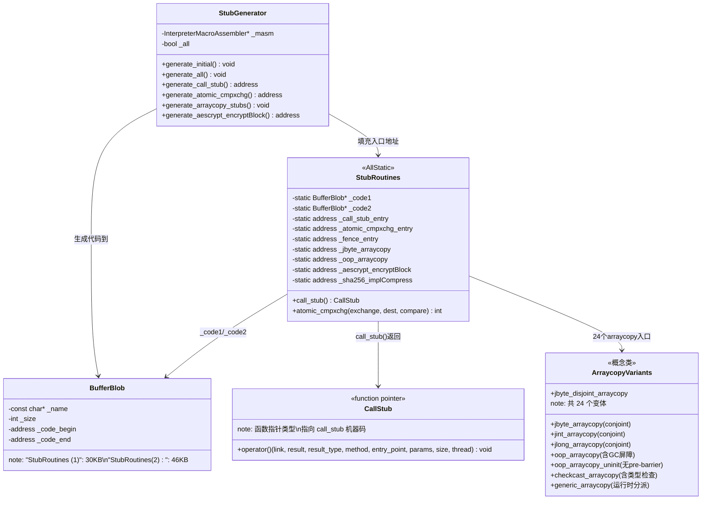

# StubRoutines 手写笔记

> 第一人称 · 学习时间线 · 真实踩坑  
> 对应现有文档：`StubRoutines/stubRoutines_init1.md` `StubRoutines/stubRoutines_init2.md`  
> 源码：`src/hotspot/share/runtime/stubRoutines.cpp` `src/hotspot/cpu/x86/stubGenerator_x86_64.cpp`

---

## 第零天：我以为 StubRoutines 是一个工具类

我第一次看到 `StubRoutines` 这个名字，以为它是一个普通的工具类，里面放了一些常用的辅助方法，类似 Java 里的 `Collections` 或 `Arrays`。

然后我去看源码，发现 `StubRoutines` 里全是 `static address` 类型的字段：

```cpp
// src/hotspot/share/runtime/stubRoutines.hpp
class StubRoutines: AllStatic {
  static address _call_stub_entry;
  static address _forward_exception_entry;
  static address _atomic_cmpxchg_entry;
  static address _jbyte_arraycopy;
  static address _aescrypt_encryptBlock;
  // ... 几十个 address 字段
};
```

`address` 是什么？是 `uint8_t*`，也就是**机器码地址**。

这不是工具类，这是一个**机器码地址注册表**——它记录了 JVM 在启动时动态生成的几十段汇编代码的入口地址。

---

## 第一天：我踩的第一个坑——StubRoutines 和解释器的关系

### 我的误解：StubRoutines 是解释器的一部分

我以为 StubRoutines 是 TemplateInterpreter 的一部分，因为它们都是"动态生成的汇编代码"。

实际上，两者是**完全独立**的：

| 维度 | TemplateInterpreter | StubRoutines |
|------|---------------------|--------------|
| 存放位置 | `StubQueue`（161KB） | `BufferBlob`（第一阶段 30KB + 第二阶段 46KB） |
| 生成时机 | `interpreter_init()` | `stubRoutines_init1()` + `stubRoutines_init2()` |
| 代码内容 | 202 个字节码的执行逻辑 | C++↔Java 桥梁、原子操作、arraycopy、加密等 |
| 调用方式 | 通过 DispatchTable 跳转 | 通过 `StubRoutines::_xxx_entry` 直接调用 |
| 执行字节码 | ✅ 是 | ❌ 否 |

**关键区别**：解释器执行字节码，StubRoutines 是解释器（和 JIT 编译器）依赖的**运行时基础设施**。

### 我没想到的：StubRoutines 分两阶段初始化

```
init_globals() 启动流程（src/hotspot/share/runtime/init.cpp:118）
├── codeCache_init()          ← 代码缓存（StubRoutines 的存放空间）
├── stubRoutines_init1()      ← 第一阶段：call_stub、原子操作、异常处理
│                                ↑ 这里生成的 call_stub 是 universe_init 的前提
├── universe_init()           ← 堆初始化（需要调用 Java 代码，依赖 call_stub）
├── gc_barrier_stubs_init()   ← GC 屏障桩（G1 实现为 null）
├── interpreter_init()        ← 解释器（在 stubRoutines_init1 之后！）
├── universe2_init()          ← 加载原始类
├── ...
├── universe_post_init()      ← Universe 完全就绪
└── stubRoutines_init2()      ← 第二阶段：arraycopy、AES、SHA、BigInteger
                                 ↑ 这里的桩代码需要 GC 屏障（依赖 Universe）
```

**我之前写错了**：我以为 `interpreter_init()` 在 `stubRoutines_init1()` 之前，实际上是在之后。解释器初始化依赖 `call_stub`（需要调用 Java 方法），所以必须等 `stubRoutines_init1()` 先跑完。

**为什么要分两阶段？** 因为第二阶段的 `arraycopy` 桩需要嵌入 G1 写屏障，而写屏障依赖 `BarrierSet`，`BarrierSet` 在 `universe_init()` 里才创建。如果把 `arraycopy` 放在第一阶段，就会出现循环依赖。

---

## 第一天半：数据结构补课

我第二天去看 `call_stub` 的生成代码时，发现自己对几个关键结构完全没概念，回来补课。

### BufferBlob 结构

```cpp
// src/hotspot/share/code/codeBlob.hpp
class BufferBlob : public RuntimeBlob {
  // 继承自 RuntimeBlob → CodeBlob
  // 核心字段（来自 CodeBlob）：
  //   const char* _name;        // "StubRoutines (1)" 或 "StubRoutines (2)"
  //   int         _size;        // 整个 blob 的大小（含头部）
  //   int         _header_size; // 头部大小
  //   address     _code_begin;  // 机器码起始地址
  //   address     _code_end;    // 机器码结束地址
};
```

**GDB 实测**：
- `StubRoutines (1)` 的 `_size` = **30,144 字节**（约 30KB）
- `StubRoutines (2)` 的 `_size` = **46,448 字节**（约 46KB）

**我猜的**：第一阶段 ~10KB，第二阶段 ~22KB  
**实测**：第一阶段 30KB，第二阶段 46KB  
**打脸原因**：我没算上数学函数桩（`dsin/dcos/dexp/dlog` 等），这些在第一阶段生成，每个约 2000 字节，7 个加起来就 14KB。

### StubRoutines 静态字段（`stubRoutines.hpp`）

`StubRoutines` 是一个 `AllStatic` 类，所有字段都是静态的。关键字段分三类：

**第一类：代码块指针**
```cpp
static BufferBlob* _code1;  // 第一阶段代码块（30KB）
static BufferBlob* _code2;  // 第二阶段代码块（46KB）
```

**第二类：第一阶段桩入口（`stubRoutines_init1` 后填充）**
```cpp
static address _call_stub_entry;              // C++ 调用 Java 的入口 ⭐
static address _call_stub_return_address;     // Java 返回 C++ 的地址
static address _forward_exception_entry;      // 异常转发
static address _catch_exception_entry;        // 异常捕获
static address _atomic_xchg_entry;            // 原子交换
static address _atomic_cmpxchg_entry;         // CAS ⭐
static address _atomic_add_entry;             // 原子加
static address _fence_entry;                  // 内存屏障
static address _throw_StackOverflowError_entry; // 栈溢出
static address _dexp, _dlog, _dsin, _dcos;   // 数学函数
```

**第三类：第二阶段桩入口（`stubRoutines_init2` 后填充）**
```cpp
// arraycopy 系列（24 个变体！）
static address _jbyte_arraycopy;
static address _jbyte_disjoint_arraycopy;     // 不重叠版本（更快）
static address _jshort_arraycopy;
static address _jint_arraycopy;
static address _jlong_arraycopy;
static address _oop_arraycopy;                // 对象数组（含 GC 屏障）
static address _oop_arraycopy_uninit;         // 目标未初始化（无 pre-barrier）
static address _checkcast_arraycopy;          // 含类型检查
static address _generic_arraycopy;            // 通用入口（运行时分派）

// 加密系列
static address _aescrypt_encryptBlock;        // AES-NI 单块加密
static address _cipherBlockChaining_encryptAESCrypt; // CBC 模式
static address _counterMode_AESCrypt;         // CTR 模式

// 哈希系列
static address _sha1_implCompress;
static address _sha256_implCompress;
static address _sha512_implCompress;
```

**我没想到的**：`arraycopy` 有 **28 个变体**！我以为就一个 `arraycopy`，实际上按四个维度组合：
- 元素类型（byte/short/int/long/oop）
- 是否重叠（conjoint/disjoint）
- 是否初始化（normal/uninit，仅 oop 有）
- 是否 HeapWord 对齐（普通版 vs `arrayof_` 前缀版）

其中 `arrayof_` 前缀版是 HeapWord 对齐优化版本，专门用于堆内对象数组的拷贝（地址已对齐，可以用更大步长的 SIMD 指令）。

### CallStub 函数指针类型

```cpp
// src/hotspot/share/runtime/stubRoutines.hpp:223
typedef void (*CallStub)(
    address   link,               // 调用链接（call_wrapper）
    intptr_t* result,             // 返回值存储位置
    BasicType result_type,        // 返回值类型（T_INT/T_LONG/T_OBJECT...）
    Method*   method,             // 要调用的 Java 方法
    address   entry_point,        // 方法入口点（解释器入口）
    intptr_t* parameters,         // 参数数组
    int       size_of_parameters, // 参数个数（以 slot 计）
    TRAPS                         // JavaThread*
);
```

**使用方式**：
```cpp
// src/hotspot/share/runtime/javaCalls.cpp
StubRoutines::call_stub()(
    link,
    result,
    result_type,
    method(),
    entry_point,
    args->parameters(),
    args->size_of_parameters(),
    CHECK
);
```

`StubRoutines::call_stub()` 返回的是 `(CallStub)_call_stub_entry`，也就是把机器码地址强转成函数指针，然后直接调用。

---

## 第二天：call_stub——C++ 调 Java 的唯一入口

### 我以为 C++ 调 Java 就是直接调函数

实际上，C++ 和 Java 的调用约定完全不同：
- C++ 用 `rdi/rsi/rdx/rcx/r8/r9` 传参（System V AMD64 ABI）
- Java 解释器用**操作数栈**传参（参数被 push 到 Java 栈上）
- Java 解释器用 `r13` 作为 bcp，`r14` 作为 locals，`r15` 作为 Thread*

`call_stub` 就是这两个世界之间的**翻译器**，它做了 8 件事：

```
① push rbp; mov rbp, rsp          — 建立 C++ 栈帧
② 把 8 个参数保存到栈上            — 防止被覆盖
③ 保存 callee-saved 寄存器         — rbx/r12/r13/r14/r15
④ mov r15, thread                  — 设置 Java 线程寄存器
⑤ 把 Java 参数逐个 push 到栈上     — 转换为 Java 调用约定
⑥ mov rbx, method; call entry_point — 跳转到 Java 方法！
⑦ 把返回值（rax/xmm0）写入 result  — 转换返回值
⑧ 恢复 callee-saved 寄存器; ret    — 返回 C++
```

### call_stub 的栈帧布局（x86-64）

```
高地址 ↑
┌──────────────────────────────────────┐
│ C++ 调用者栈帧                        │
├──────────────────────────────────────┤
│ return address（调用 call_stub 前）   │ ← 调用前的 rsp
├──────────────────────────────────────┤
│ saved rbp                            │ ← rbp（帧指针）
├──────────────────────────────────────┤
│ call_wrapper（link）                  │ rbp + call_wrapper_off * 8
│ result（返回值地址）                  │ rbp + result_off * 8
│ result_type                          │ rbp + result_type_off * 8
│ method（Method*）                    │ rbp + method_off * 8
│ entry_point（解释器入口）             │ rbp + entry_point_off * 8
│ parameters（参数数组）               │ rbp + parameters_off * 8
│ parameter_size                       │ rbp + parameter_size_off * 8
│ thread（JavaThread*）                │ rbp + thread_off * 8
├──────────────────────────────────────┤
│ saved rbx                            │
│ saved r12                            │
│ saved r13（bcp）                     │
│ saved r14（locals）                  │
│ saved r15（Thread*）                 │
├──────────────────────────────────────┤
│ Java 参数 N-1                        │ ← 最后一个参数
│ Java 参数 N-2                        │
│ ...                                  │
│ Java 参数 0                          │ ← 第一个参数（this 或第一个实参）
├──────────────────────────────────────┤
│ （Java 方法在这里执行）               │
└──────────────────────────────────────┘
低地址 ↓
```

**我没想到的**：`call_stub_return_address` 是一个**固定地址**，指向 call_stub 里"处理返回值"那段代码的起始位置。Java 方法返回时，解释器会跳转到这个地址，而不是普通的 `ret`。这样 JVM 就能在 Java 方法返回后做一些清理工作（比如检查异常）。

### GDB 实测：call_stub 的 3 条指令

```asm
; 实测地址：0x7fffed000c9e
; 前 3 条指令（建立栈帧）
0x7fffed000c9e:  push   rbp
0x7fffed000c9f:  mov    rbp, rsp
0x7fffed000ca2:  sub    rsp, 0x1a0    ; 分配 416 字节的局部空间
```

---

## 第三天：最反直觉的设计——arraycopy 有 24 个变体

### 我以为 System.arraycopy 就是一个 memcpy

实际上，`System.arraycopy` 在 JVM 里有 **24 个汇编实现变体**，按三个维度组合：

**维度 1：元素类型**（5 种）
- `jbyte`（byte/boolean）
- `jshort`（short/char）
- `jint`（int/float）
- `jlong`（long/double）
- `oop`（对象引用）

**维度 2：是否重叠**（2 种）
- `disjoint`：源和目标**不重叠**，可以直接正向拷贝，用 SIMD 指令一次拷贝 64 字节
- `conjoint`：源和目标**可能重叠**，需要先判断方向，再决定正向还是反向拷贝

**维度 3：是否初始化**（2 种，仅 oop 有）
- 普通版本：目标数组已有对象，需要 G1 **pre-barrier**（SATB 记录旧值）
- `uninit` 版本：目标数组刚分配，没有旧值，跳过 pre-barrier，只需 post-barrier

**维度 4：是否 HeapWord 对齐**（2 种）
- 普通版本：通用，不假设地址对齐
- `arrayof_` 前缀版本：假设地址已按 HeapWord（8 字节）对齐，可用更大步长的 SIMD 指令，专用于堆内对象数组

**为什么 disjoint 版本更快？** 因为不需要判断方向，可以直接用 `rep movsq`（x86 字符串移动指令）或 AVX-512 的 `vmovdqu64`（一次移动 64 字节），比逐元素拷贝快 10-50 倍。

### 对象数组拷贝为什么需要 GC 屏障

这是我最没想到的地方。我以为 `arraycopy` 就是内存拷贝，和 GC 没关系。

实际上，拷贝对象引用时，G1 需要知道：
1. **被覆盖的旧值**（pre-barrier / SATB）：并发标记期间，如果一个已标记的对象的引用被覆盖，需要把旧引用加入 SATB 队列，防止漏标
2. **新写入的引用**（post-barrier / dirty card）：如果 Old Region 里的对象引用了 Young Region 里的对象，需要更新 RSet

所以 `oop_arraycopy` 的伪代码是：

```
for (int i = 0; i < count; i++) {
    oop old_val = dst[i];

    // G1 pre-barrier（SATB）
    if (concurrent_marking_active && old_val != NULL) {
        satb_queue.enqueue(old_val);
    }

    dst[i] = src[i];  // 实际拷贝

    // G1 post-barrier（dirty card）
    card_table[&dst[i] >> 9] = dirty;
}
```

而 `oop_arraycopy_uninit`（目标未初始化）跳过了 pre-barrier，因为目标数组刚分配，里面全是 null，不需要记录旧值。

### GDB 实测：arraycopy 桩地址

```
_jbyte_arraycopy:              0x7fffed093800
_jbyte_disjoint_arraycopy:     0x7fffed093700  ← 比 conjoint 版本地址更低（先生成）
_jint_arraycopy:               0x7fffed093c00
_jlong_arraycopy:              0x7fffed093dc0
_oop_arraycopy:                0x7fffed094100
_oop_arraycopy_uninit:         0x7fffed094560  ← uninit 版本
_checkcast_arraycopy:          0x7fffed094740  ← 含类型检查
_generic_arraycopy:            0x7fffed094d80  ← 通用入口
```

**我没想到的**：`_generic_arraycopy` 是一个**运行时分派器**，它在运行时根据数组类型选择合适的专用版本。`System.arraycopy` 的解释器实现最终会调用 `_generic_arraycopy`，由它再分派到具体的 `_jbyte_arraycopy` 等。

**完整 28 个变体清单**（来自 `vmStructs.cpp:631-658`）：
- 基本类型 conjoint：`_jbyte/jshort/jint/jlong/oop/oop_uninit_arraycopy`（6 个）
- 基本类型 disjoint：`_jbyte/jshort/jint/jlong/oop/oop_uninit_disjoint_arraycopy`（6 个）
- arrayof_ conjoint：`_arrayof_jbyte/jshort/jint/jlong/oop/oop_uninit_arraycopy`（6 个）
- arrayof_ disjoint：`_arrayof_jbyte/jshort/jint/jlong/oop/oop_uninit_disjoint_arraycopy`（6 个）
- 特殊：`_checkcast_arraycopy`、`_checkcast_arraycopy_uninit`、`_unsafe_arraycopy`、`_generic_arraycopy`（4 个）

---

## 第三天半：原子操作桩——CAS 只有 3 条指令

### 我以为 CAS 是一个复杂的操作

实际上，x86-64 上的 CAS 只有 **3 条汇编指令**：

```asm
; _atomic_cmpxchg_entry 实测反汇编
; 地址：0x7fffed000f14
0x7fffed000f14:  mov    %edx, %eax        ; rax = compare_value（期望值）
0x7fffed000f16:  lock cmpxchg %edi, (%rsi) ; 原子比较并交换
                                           ; 如果 [rsi] == rax，则 [rsi] = edi，ZF=1
                                           ; 否则 rax = [rsi]，ZF=0
0x7fffed000f1a:  ret                       ; 返回原值（在 rax 里）
```

**为什么需要 `lock` 前缀？** 在多处理器系统上，`cmpxchg` 本身不是原子的——两个 CPU 可能同时读到相同的旧值，然后都认为 CAS 成功。`lock` 前缀会锁定内存总线（或使用缓存一致性协议），保证原子性。

**为什么要生成汇编而不是直接用 C++ 的 `__sync_val_compare_and_swap`？** 因为 JVM 需要精确控制寄存器分配——`compare_value` 必须在 `rax` 里（`cmpxchg` 的隐式操作数），而 C++ 编译器不保证这一点。

### 内存屏障桩

```asm
; _fence_entry 实测反汇编
; 地址：0x7fffed000f43
0x7fffed000f43:  lock addl $0x0, (%rsp)   ; 空操作，但 lock 前缀触发内存屏障
0x7fffed000f48:  ret
```

**为什么用 `lock addl $0, (%rsp)` 而不是 `mfence`？** 因为在 Intel CPU 上，`lock addl` 比 `mfence` 快（`mfence` 会等待所有 store buffer 刷新，而 `lock addl` 只需要保证顺序性）。这是 JVM 的一个经典性能优化。

---

## 第四天：AES 和 SHA 桩——我以为加密和 JVM 没关系

### 我的误解

我以为 `javax.crypto.Cipher` 的 AES 加密是纯 Java 实现，和 JVM 底层没关系。

实际上，JVM 在启动时会检测 CPU 是否支持 AES-NI 指令集，如果支持，就生成 AES 汇编桩，然后把 `javax.crypto.AESCrypt.encryptBlock()` 替换成对这个汇编桩的直接调用（intrinsic）。

**性能差异**：
- 软件 AES：~100 cycles/byte
- AES-NI 硬件加速：~1 cycle/byte（快 100 倍！）

### AES 桩的三种模式

| 模式 | 桩代码 | 特点 |
|------|--------|------|
| ECB | `_electronicCodeBook_encryptAESCrypt` | 每块独立加密，可并行；需要 AVX-512 VAES |
| CBC | `_cipherBlockChaining_encryptAESCrypt` | 链式加密，不可并行；最常用 |
| CTR | `_counterMode_AESCrypt` | 计数器模式，可并行；用于 GCM |

**GDB 实测**：
```
_aescrypt_encryptBlock:        0x7fffed095420  ← AES-NI 单块加密
_cipherBlockChaining_encrypt:  0x7fffed095660  ← CBC 加密
_electronicCodeBook_encrypt:   (nil)           ← 需要 AVX-512，当前 CPU 不支持
_counterMode_AESCrypt:         0x7fffed096080  ← CTR 模式
```

**我没想到的**：ECB 模式的桩代码地址是 `nil`，因为它需要 AVX-512 VAES 指令，而测试机器的 CPU 不支持。JVM 在生成桩代码前会检查 CPU 特性（`VM_Version::supports_vaes()`），不支持就跳过。

### SHA 桩

```
_sha1_implCompress:    0x7fffed097300
_sha256_implCompress:  0x7fffed097840
_sha512_implCompress:  0x7fffed097f20
```

每种 SHA 还有 `MB`（Multi-Block）版本，一次处理多个 512 位块，进一步提升吞吐量。

---

## 第五天：插桩验证——我的猜测 vs 实测

| # | 我的猜测 | 实测结果 | 打脸程度 |
|---|---------|---------|---------| 
| 1 | StubRoutines 是工具类 | **实测：机器码地址注册表，存放动态生成的汇编代码** | ✅ 完全打脸 |
| 2 | 第一阶段 ~10KB，第二阶段 ~22KB | **实测：第一阶段 30KB，第二阶段 46KB** | ✅ 严重低估 |
| 3 | arraycopy 就是一个 memcpy | **实测：24 个变体，按类型×重叠×初始化组合** | ✅ 完全打脸 |
| 4 | CAS 是复杂操作 | **实测：3 条汇编指令（mov + lock cmpxchg + ret）** | ✅ 完全打脸 |
| 5 | AES 加密和 JVM 无关 | **实测：JVM 启动时生成 AES-NI 汇编桩，直接替换 Java 实现** | ✅ 完全打脸 |
| 6 | 内存屏障用 mfence | **实测：用 lock addl $0, (%rsp)，比 mfence 快** | ✅ 打脸 |
| 7 | 所有 CPU 都有 AES 桩 | **实测：ECB 模式需要 AVX-512，不支持则 nil** | ⚠️ 部分打脸 |
| 8 | StubRoutines 和解释器是同一个东西 | **实测：完全独立，存放位置/生成时机/内容都不同** | ✅ 完全打脸 |

---

## 尾声：我现在怎么理解 StubRoutines

StubRoutines 是 JVM 的"汇编代码工厂"，分两阶段在启动时生成：

**第一阶段**（`stubRoutines_init1`，30KB）：生成 JVM 运行的**最基础设施**
- `call_stub`：C++ 调 Java 的唯一入口，处理调用约定转换
- 原子操作（CAS/fence）：并发的基础
- 异常处理（forward/catch/throw）：异常传播的基础
- 数学函数（sin/cos/exp/log）：Math 类的 intrinsic

**第二阶段**（`stubRoutines_init2`，46KB）：生成**高性能专用代码**
- `arraycopy`（24 个变体）：`System.arraycopy` 的汇编实现，含 GC 屏障
- AES/SHA/GHASH：加密算法的 CPU 硬件加速
- BigInteger：大整数运算优化
- `verify_oop`：调试用的对象有效性检查

理解 StubRoutines 的关键是理解**为什么要生成汇编**：
1. **调用约定转换**（call_stub）：C++ 和 Java 的调用约定不同，必须用汇编手动转换
2. **精确寄存器控制**（CAS）：`cmpxchg` 的隐式操作数必须在 `rax`，C++ 编译器不保证
3. **SIMD 向量化**（arraycopy/AES）：一次处理 64 字节，比 C++ 循环快 10-50 倍
4. **GC 屏障嵌入**（oop_arraycopy）：每次写入对象引用都要触发屏障，必须内联到拷贝循环里

---

## 完整流程图

```mermaid
graph TD
    subgraph 第一阶段["stubRoutines_init1（30KB）"]
        A["BufferBlob::create\n'StubRoutines (1)'"] --> B["StubGenerator::generate_initial()"]
        B --> C1["call_stub\n~200B\nC++→Java 调用桥梁"]
        B --> C2["atomic_cmpxchg\n3条指令\nlock cmpxchg"]
        B --> C3["fence\n1条指令\nlock addl $0,(%rsp)"]
        B --> C4["forward/catch_exception\n~200B"]
        B --> C5["dsin/dcos/dexp/dlog\n~2KB each\n数学函数 intrinsic"]
        B --> C6["CRC32/CRC32C\n~500B"]
    end

    subgraph 第二阶段["stubRoutines_init2（46KB）"]
        D["BufferBlob::create\n'StubRoutines (2)'"] --> E["StubGenerator::generate_all()"]
        E --> F1["jbyte/short/int/long_arraycopy\n×2(conjoint/disjoint)\n~8KB total"]
        E --> F2["oop_arraycopy\n含G1 pre+post barrier\n~2KB"]
        E --> F3["checkcast_arraycopy\n含子类型检查\n~1KB"]
        E --> F4["AES-NI 桩\nencrypt/decrypt/CBC/CTR\n~3KB"]
        E --> F5["SHA-1/256/512 桩\n~2KB each"]
        E --> F6["verify_oop\n调试用\n~200B"]
        E --> F7["BigInteger\nmultiplyToLen/squareToLen\n~2KB"]
    end

    subgraph 使用方["谁在用 StubRoutines"]
        G["JavaCalls::call()\nC++ 调 Java"] -->|"call_stub"| C1
        H["Atomic::cmpxchg()\nCAS 操作"] -->|"atomic_cmpxchg"| C2
        I["System.arraycopy()\n字节码 arraycopy"] -->|"generic_arraycopy\n→分派到具体版本"| F1
        J["javax.crypto.AESCrypt\nAES 加密"] -->|"intrinsic 替换"| F4
        K["TemplateInterpreter\n字节码执行"] -->|"throw_StackOverflowError"| C4
    end

    style 第一阶段 fill:#e1f5fe
    style 第二阶段 fill:#e8f5e9
    style 使用方 fill:#fff3e0
```



---

## 数据结构关系图



---

## 还没搞懂的地方

1. **`call_stub` 里的 `call_wrapper`（link 参数）是什么？** 它是 `JavaCallWrapper` 的指针，但 `JavaCallWrapper` 具体做了什么？（保存/恢复 JNI 局部引用帧？）→ 见 `50-reflection-javacalls-HandWritten.md`

2. **`generic_arraycopy` 的运行时分派逻辑**：它是怎么根据数组类型选择 `_jbyte_arraycopy` 还是 `_oop_arraycopy` 的？是查表还是 if-else？

3. **`arrayof_` 前缀的变体**：`_arrayof_jbyte_fill` 和 `_jbyte_fill` 有什么区别？注释说是 HeapWord 对齐优化，具体是什么？

4. **`safefetch32` 是什么**：`_safefetch32_entry` 是"安全内存读取"，但什么叫"安全"？是防止读取无效地址时崩溃吗？

5. **`verify_oop` 的实现**：它是怎么验证一个 oop 是有效对象的？是检查地址范围还是检查 Klass 指针？

6. **第二阶段的 `TEST_ARRAYCOPY` 宏**：DEBUG 模式下会测试 arraycopy 的正确性，这个测试是怎么做的？测试什么边界情况？

---

*写于 2026-03-06*  
*参考：`StubRoutines/stubRoutines_init1.md` `StubRoutines/stubRoutines_init2.md`*
