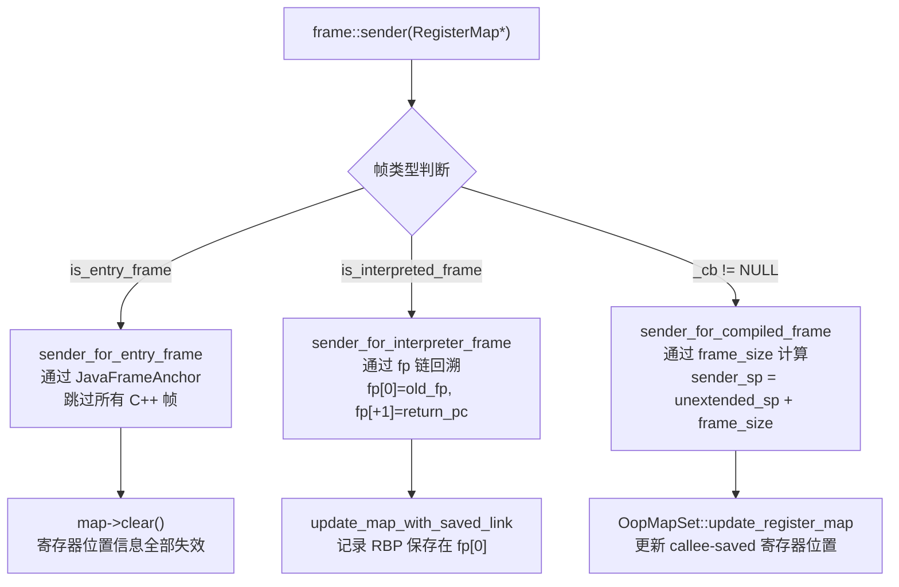
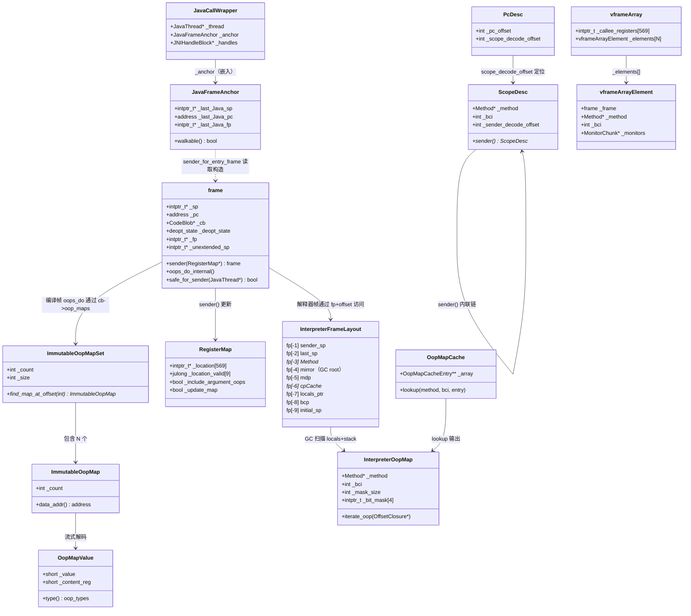

# 16 · 栈帧 / 解释帧 / 编译帧 · 手写笔记

> 对应参考文档：`StackFrame/1-Stack-Frame-And-Stack-Walking-Deep-Dive.md`（1157行）  
> `StackFrame/2-Stack-Frame-Supplement-Deep-Dive.md`（1389行）  
> `StackFrame/3-Stack-Frame-Supplement-2-Deep-Dive.md`（1062行）  
> `JVM-Core-Objects/03-StackFrame-Layout.md`（506行）  
> 插桩数据：`JVM-Core-Objects/03-StackFrame-Layout.md` 第3部分

---

## 第零天：我以为栈帧就是"一块内存，存局部变量"

我最开始对栈帧的理解极其简单：方法调用 → 分配一块内存 → 存局部变量 → 方法返回 → 释放。

然后我去看 JVM 源码，发现解释器帧光**固定区**就有 9 个槽位，还没算局部变量表和操作数栈。我数了一下：

```
fp[-1]  sender_sp
fp[-2]  last_sp
fp[-3]  Method*
fp[-4]  mirror
fp[-5]  mdp
fp[-6]  cpCache*
fp[-7]  locals_ptr
fp[-8]  bcp
fp[-9]  initial_sp
```

9 个槽位，每个 8 字节，光固定区就 72 字节。我以为一个空方法的帧就几十字节，结果光固定区就 72 字节，还没算局部变量和操作数栈。

更让我没想到的是：**解释器帧和编译帧的结构完全不同**。解释器帧有这 9 个固定槽，编译帧没有——编译帧靠 OopMap 记录哪些位置有 oop，靠 `frame_size` 字段记录帧大小。两种帧的回溯方式也完全不同。

---

## 第一天：我踩的第一个坑——`frame` 对象不是帧本身

我以为 `frame` 类就是栈帧，帧的内存就在 `frame` 对象里。

**实际上**：`frame` 是一个 **48 字节的值对象**，它只是描述栈帧的"指针集合"，帧的实际内存在线程栈上。

```cpp
// share/runtime/frame.hpp:50-63
class frame {
  intptr_t* _sp;          // 栈指针（帧的最低地址）
  address   _pc;          // 程序计数器（返回后执行的下一条指令）
  CodeBlob* _cb;          // 拥有此 PC 的 CodeBlob（NULL = 解释器帧）
  deopt_state _deopt_state; // 去优化状态（not_deoptimized/is_deoptimized/unknown）
  // x86-64 额外字段：
  intptr_t* _fp;          // 帧指针（RBP 寄存器的值）
  intptr_t* _unextended_sp; // 调用者扩展前的原始 SP（OopMap 定位用）
};
```

`frame` 对象在 C++ 栈上传递，不通过 `new` 分配。每次调用 `sender()` 都会构造一个新的 `frame` 值对象，描述调用者帧。

**`_unextended_sp` 是什么？** 这是我第一天最没搞懂的字段。解释器和 adapter 会扩展调用者的帧（向下推栈，为传参腾空间），但 OopMap 是基于扩展前的 SP 编码栈槽偏移的。所以必须记录扩展前的原始 SP，否则 `oopmapreg_to_location()` 算出来的地址是错的。

---

## 第一天半：数据结构补课

我第二天看 `sender()` 的三路派发时，发现自己对 `RegisterMap`、`OopMap`、`JavaFrameAnchor` 完全没概念，回来补课。

### RegisterMap（4664 字节）

**我以为**：RegisterMap 就是一个 `Map<寄存器, 值>`，很小。

**实际上**：4664 字节！因为 x86-64 有 569 个 VMReg（通用寄存器 + XMM/YMM + 它们的 H half），每个需要一个 `intptr_t*`（8 字节）记录保存位置，光 `_location` 数组就 4552 字节。

```cpp
// share/runtime/registerMap.hpp:63-78
class RegisterMap {
  intptr_t*         _location[569];       // 4552B：每个 VMReg 的保存地址
  julong            _location_valid[9];   // 72B：位图，标记哪些条目有效
  bool              _include_argument_oops; // 是否扫描调用参数中的 oop
  JavaThread*       _thread;
  bool              _update_map;          // 是否需要更新（false = 只遍历不扫描）
};
```

**为什么需要 RegisterMap？** 编译代码调用其他方法时，callee-saved 寄存器（rbx/rbp/r12-r15）被溢出到栈上。GC 扫描时需要知道这些寄存器当前保存在栈的哪个地址，才能更新其中的 oop 引用。RegisterMap 就是这个"寄存器→栈地址"的映射表。

**`update=false` 的优化**：`vframeStreamCommon` 只需要遍历栈获取 method/bci，不需要 GC 扫描，所以用 `update=false` 构造 RegisterMap，跳过每帧的 OopMap 处理，大幅加速遍历。

### JavaFrameAnchor（24 字节）

**我以为**：Java 和 C++ 之间的调用边界很简单，直接用 fp 链就能回溯。

**实际上**：Java 调用 C++（JNI/runtime call）时，中间会有一堆 C++ 帧，这些帧没有 JVM 的帧格式，不能用 fp 链回溯。`JavaFrameAnchor` 就是解决这个问题的——它保存了"最后一个 Java 帧"的 sp/fp/pc，让 `sender_for_entry_frame()` 能直接跳过所有 C++ 帧。

```cpp
// share/runtime/javaFrameAnchor.hpp
class JavaFrameAnchor {
  intptr_t* volatile _last_Java_sp;  // 兼做有效性标志：非 NULL = anchor 有效
  volatile address   _last_Java_pc;
  intptr_t* volatile _last_Java_fp;  // x86-64 特有
};
// sizeof = 24B（3 × 8B）
```

**`_last_Java_sp` 兼做有效性标志的设计**：`clear()` 时最先置 NULL，`copy()` 时最后写入。这保证并发读者（profiler）在读到非 NULL 的 sp 时，fp 和 pc 已经是新值。一个字段 + 操作顺序替代了锁。

### OopMap 体系（编译帧专用）

解释器帧不需要 OopMap——它有固定的帧格式，GC 通过 `InterpreterOopMap`（按 bci 的 2-bit 位图）知道哪些局部变量和栈槽是 oop。

编译帧没有固定格式，所以编译器在每个 safepoint/call site 生成一个 OopMap，记录该 PC 处哪些寄存器/栈槽包含 oop。

```
OopMapValue（4B release / 16B debug）
  → 低 2 位 = type（oop/narrowoop/callee_saved/derived_oop）
  → 高 14 位 = VMReg 编号

ImmutableOopMap（4B header + 变长数据）
  → _count + 压缩的 OopMapValue 流

ImmutableOopMapSet（8B header + pairs + data）
  → 按 PC 偏移排序的索引数组 + OopMap 数据
  → 支持二分查找：cb->oop_map_for_return_address(pc)
```

**derived oop 是什么？** C2 优化可能产生指向对象内部的指针（如 `array_base + index * scale`）。GC 移动 base 对象时，必须同时调整这些 derived 指针。`DerivedPointerTable` 在 GC 前记录 `derived - base` 偏移，GC 后用 `new_base + offset` 修复。

---

## 第二天：三种帧，三种回溯方式

`frame::sender()` 是整个栈遍历的核心，它根据帧类型走三条完全不同的路径：



### 路径 1：entry 帧 → 跳过 C++ 帧

```cpp
// frame_x86.cpp:344-362
frame frame::sender_for_entry_frame(RegisterMap* map) const {
  JavaFrameAnchor* jfa = entry_frame_call_wrapper()->anchor();
  if (!jfa->walkable()) {
    jfa->capture_last_Java_pc();  // 补全 pc
  }
  map->clear();  // ★ 跨过 C++ 帧，寄存器位置信息全部失效
  frame fr(jfa->last_Java_sp(), jfa->last_Java_fp(), jfa->last_Java_pc());
  return fr;  // 直接跳到上一个 Java 帧
}
```

**我没想到的**：`map->clear()` 之后 `include_argument_oops` 会被设为 true（clear 的副作用）。这是因为跨过 C++ 帧后，下一个 Java 帧的参数可能还没被扫描过，需要补扫。

### 路径 2：解释器帧 → fp 链回溯

```cpp
// frame_x86.cpp:431-446
frame frame::sender_for_interpreter_frame(RegisterMap* map) const {
  intptr_t* sender_sp = this->sender_sp();           // fp + 2（fp[+2]）
  intptr_t* unextended_sp = interpreter_frame_sender_sp(); // fp[-1] 的值

  if (map->update_map()) {
    // ★ 记录 RBP 保存在 fp[0]，供后续编译帧的 OopMap 使用
    update_map_with_saved_link(map, (intptr_t**) addr_at(link_offset));
  }
  return frame(sender_sp, unextended_sp, link(), sender_pc());
  //           ^调用者sp   ^未扩展sp      ^fp[0]  ^fp[+1]
}
```

### 路径 3：编译帧 → frame_size 计算

```cpp
// frame_x86.cpp:451-483
frame frame::sender_for_compiled_frame(RegisterMap* map) const {
  // ★ 关键公式：sender_sp = unextended_sp + frame_size
  intptr_t* sender_sp = unextended_sp() + _cb->frame_size();
  address sender_pc = (address) *(sender_sp - 1);  // return pc 在 sender_sp - 1
  intptr_t** saved_fp_addr = (intptr_t**) (sender_sp - frame::sender_sp_offset);

  if (map->update_map()) {
    if (_cb->oop_maps() != NULL) {
      // ★ 用 OopMap 中的 callee_saved 条目更新 RegisterMap
      OopMapSet::update_register_map(this, map);
    }
    update_map_with_saved_link(map, saved_fp_addr);
  }
  return frame(sender_sp, sender_sp, *saved_fp_addr, sender_pc);
}
```

**我没想到的**：编译帧不一定有 fp 链！C2 可以把 RBP 当普通寄存器用（`-fomit-frame-pointer`）。但 JVM 的编译帧仍然在 `enter` 时保存 RBP（即使不用它做帧指针），这样 `update_map_with_saved_link` 就不需要 OopMap 记录 RBP 的保存位置，节省 OopMap 空间。

---

## 第三天：GC 扫描——三种帧，三种策略

`frame::oops_do_internal()` 是 GC 扫描栈帧的统一入口，同样三路派发：

```cpp
// frame.cpp:1106-1126
void frame::oops_do_internal(OopClosure* f, CodeBlobClosure* cf,
                             RegisterMap* map, bool use_interpreter_oop_map_cache) {
  if (is_interpreted_frame()) {
    oops_interpreted_do(f, map, use_interpreter_oop_map_cache);  // 解释器帧
  } else if (is_entry_frame()) {
    oops_entry_do(f, map);                                        // entry 帧
  } else if (CodeCache::contains(pc())) {
    oops_code_blob_do(f, cf, map);                               // 编译帧
  }
}
```

### 解释器帧的 GC 扫描：5 步

`oops_interpreted_do()` 按固定顺序扫描 5 个区域：

```
Step 1: for(monitor_end → monitor_begin) → current->oops_do(f)
        遍历所有 BasicObjectLock 的 _obj 字段（被锁定的对象）

Step 2: if(native) → f->do_oop(fp[+2])
        native 方法的 oop_temp（临时存放 JNI 返回值）

Step 3: f->do_oop(fp[-4])
        mirror（java.lang.Class）—— 保活方法所属的 Klass

Step 4: if(at invoke && include_argument_oops)
        → oops_interpreted_arguments_do()
        扫描被调方法的参数（已在表达式栈上）

Step 5: mask_for(bci) → mask.iterate_oop(&blk)
        通过 InterpreterOopMap 2-bit 位图扫描 locals + expression stack
```

**InterpreterOopMap 的 2-bit 编码**：每个槽位用 2 bit 表示：
- `01` = live oop（GC 需要扫描）
- `00` = live value（非引用）
- `10` = dead value（已死亡）

**OopMapCache 的设计**：GC 扫描时频繁查询同一个 (method, bci) 的位图，所以每个 InstanceKlass 有一个 32 槽的哈希缓存（`OopMapCache`）。命中则直接拷贝，未命中则通过 `OopMapForCacheEntry`（继承 GenerateOopMap）对整个方法做完整的数据流分析。

**我没想到的**：即使只需要一个 bci 的结果，也必须对整个方法做完整的定点数据流分析。因为每个基本块的结果依赖所有前驱块，不能只分析到目标 bci 就停止。

### 编译帧的 GC 扫描：两阶段

`OopMapSet::all_do()` 必须两阶段扫描，不能一遍搞定：

```
Phase 1：先处理 derived oop
  → 记录 derived - base 偏移到 DerivedPointerTable
  → 必须在 base 被移动之前！

Phase 2：处理 oop 和 narrowoop
  → 调用 oop_fn->do_oop(loc)
  → GC 移动对象，更新引用
```

**为什么必须两阶段？** derived oop 指向对象内部（如 `array_base + 16`）。如果 Phase 1 和 Phase 2 混在一起，可能先处理了 base（移动了对象），再遇到 derived 时就无法计算正确的偏移了。

---

## 第三天半：建帧过程——11 次 push

解释器进入一个新方法时，`generate_fixed_frame()` 通过 11 次 push 建立帧：

```cpp
// cpu/x86/templateInterpreterGenerator_x86.cpp:658-694
void TemplateInterpreterGenerator::generate_fixed_frame(bool native_call) {
  __ push(rax);        // ① return address → fp[+1]
  __ enter();          // ② push rbp + mov rbp,rsp → fp[0] = old rbp
  __ push(rbcp);       // ③ sender_sp（此时 rbcp=r13=sender_sp）→ fp[-1]
  __ push(NULL_WORD);  // ④ last_sp = NULL → fp[-2]
  
  // 重新计算 rbcp = bytecode pointer
  __ movptr(rbcp, Address(rbx, Method::const_offset()));
  __ lea(rbcp, Address(rbcp, ConstMethod::codes_offset()));
  
  __ push(rbx);        // ⑤ Method* → fp[-3]
  __ load_mirror(rdx, rbx);
  __ push(rdx);        // ⑥ mirror → fp[-4]
  __ push(mdp);        // ⑦ mdp → fp[-5]（ProfileInterpreter 时有值，否则 0）
  __ push(cpCache);    // ⑧ CP cache → fp[-6]
  __ push(rlocals);    // ⑨ locals pointer → fp[-7]
  __ push(rbcp);       // ⑩ bcp → fp[-8]
  __ push(0);          // ⑪ 占位 → fp[-9]
  __ movptr(Address(rsp, 0), rsp);  // initial_sp = rsp（指向自己）
}
```

**三个反直觉的设计**：

1. **rbcp 复用**：进入时 `rbcp(r13)` 保存的是 sender_sp，push 后重新加载为 bytecode pointer。一个寄存器两种用途，节省寄存器。

2. **mirror 入帧**：`Method*` 不是 oop，GC 不追踪它。但方法执行期间其所属 Klass 不能被卸载，所以把 `mirror`（java.lang.Class 对象）存入帧中作为 GC root。

3. **initial_sp 自指**：`movptr([rsp], rsp)` 使 initial_sp 指向自己（即表达式栈底）。monitor 分配时从这里向低地址增长。

---

## 第四天：虚拟帧——一个物理帧对应多个 Java 方法

这是我最没想到的设计。C2 编译器会把多个 Java 方法内联到一个物理帧里。从 GC 的角度看，只有一个物理帧；但从 Java 调用栈的角度看，有多个方法激活。

**vframe 体系**解决了这个问题：

```
vframe（抽象基类）
├── javaVFrame（抽象：method/bci/locals/expressions/monitors）
│   ├── interpretedVFrame（直接读物理帧的固定槽位）
│   └── compiledVFrame（通过 ScopeDesc 读调试信息）
└── entryVFrame
```

**ScopeDesc** 是编译帧的调试信息描述符，通过 `_sender_decode_offset` 形成内联链：

```
PcDesc（16B）
  _pc_offset → 物理 PC 偏移
  _scope_decode_offset → ScopeDesc 在调试信息流中的位置

ScopeDesc（80B）
  _method, _bci → 当前方法和字节码位置
  _sender_decode_offset → 父帧（调用者）的 ScopeDesc 位置
  → sender() 方法沿链向外展开
```

**vframeStreamCommon 的二级推进**：

```cpp
inline void vframeStreamCommon::next() {
  // 第一级：内联展开（不切换物理帧）
  if (_mode == compiled_mode && fill_in_compiled_inlined_sender()) return;
  // 第二级：物理帧推进
  do {
    _frame = _frame.sender(&_reg_map);
  } while (!fill_from_frame());
}
```

先沿 ScopeDesc 链展开内联帧，耗尽后再 `sender()` 推进物理帧。

---

## 第四天半：去优化时的帧重建

去优化（deoptimization）是最复杂的场景：把一个编译帧（可能内联了 N 个方法）还原为 N 个解释器帧。

整个过程分两步，中间通过 `UnrollBlock`（88B）通信：


**vframeArray**（5408B）是去优化的暂存容器，保存所有内联帧的状态：

```
vframeArray（5408B）
  _callee_registers[569]  4552B  ← 这就是为什么这么大！
  _valid[569]              569B
  _elements[N]             96B × N  ← 每个内联帧的快照
```

**为什么 vframeArray 不需要 GC 扫描？** 因为它不跨越 safepoint——去优化在 safepoint 开始，在 safepoint 结束前完成，所以内部的 oop 不会被 GC 移动。

---

## 第五天：插桩验证——我用数据打脸了自己的猜测

### 猜测 vs 实测对比表

| # | 我的猜测 | 实测结果 | 结论 |
|---|---------|---------|------|
| 1 | 空方法的帧很小，可能 16-32 字节 | **固定区就 72 字节**（9 slots × 8B） | ✅ 完全打脸 |
| 2 | `frame` 对象就是帧本身，很大 | **frame 对象只有 48B**，帧在线程栈上 | ✅ 完全打脸 |
| 3 | RegisterMap 就是个小 Map | **4664 字节**，因为 569 个 VMReg | ✅ 完全打脸 |
| 4 | 解释器帧和编译帧结构差不多 | **完全不同**：解释器帧有 9 个固定槽，编译帧靠 OopMap | ✅ 完全打脸 |
| 5 | GC 扫描栈帧就是遍历局部变量 | **5 步扫描**：monitor + oop_temp + mirror + 参数 + 位图 | ✅ 完全打脸 |
| 6 | 一个物理帧对应一个 Java 方法 | **C2 内联**：一个物理帧可能对应 N 个 Java 方法 | ✅ 完全打脸 |
| 7 | `frame_gap = fp - sp` 就是帧大小 | **frame_gap 包含操作数栈已用部分**，是动态大小 | ✅ 新发现 |
| 8 | 去优化很简单，直接切换执行模式 | **需要 vframeArray（5408B）暂存所有内联帧状态** | ✅ 完全打脸 |

### 插桩验证数据（来自 `JVM-Core-Objects/03-StackFrame-Layout.md`）

在 `InterpreterRuntime::resolve_invoke()` 插桩，捕获到 5 个解释器帧：

```
[PROBE][StackFrame] #1 method=java.lang.Object::<clinit>
  fp=0x7ff8f7ffe1e0  sp=0x7ff8f7ffe198  frame_gap=72 bytes
  max_locals=0  total_slots=9  total_bytes=72
  [fp-3] Method* = 0x7ff8d12fa010  (期望=0x7ff8d12fa010) ✅
  [fp-8] bcp     = 0x7ff8d12fa000  bci=0 ✅

[PROBE][StackFrame] #3 method=java.lang.String$CaseInsensitiveComparator::<init>
  fp=0x7fd53f80a418  sp=0x7fd53f80a3c8  frame_gap=80 bytes
  max_locals=1  total_slots=10  total_bytes=80
  → 有 1 个局部变量，帧大小增加 8 字节 ✅

[PROBE][StackFrame] #2 method=java.lang.String::<clinit>
  frame_gap=88 bytes  total_bytes=72  差值=16 bytes
  → bci=15 时操作数栈上已有 2 个值，sp 比 initial_sp 低 16 字节
  → frame_gap 是动态大小，total_bytes 是静态大小 ✅（新发现！）
```

**关键验证结论**：
- `fp[-3]` 存储的 Method* 与 `lfa.method()` 完全一致（5/5 帧全部验证）
- `fp[-8]` 存储的 bcp 与 `interpreter_frame_bcp()` 完全一致
- 帧链通过 `fp[0] = old_fp` 完整串联
- JVM 启动时第一个 Java 方法（`Object::<clinit>`）的调用栈只有 2 帧：1 个解释器帧 + 1 个 entry 帧

### sizeof 验证（GDB 实测）

```
sizeof(frame)                = 48B    ✓（6 字段，含 4B enum + padding）
sizeof(RegisterMap)          = 4664B  ✓（4552 + 72 + 其他）
sizeof(JavaFrameAnchor)      = 24B    ✓（3 × 8B）
sizeof(BasicObjectLock)      = 16B    ✓（BasicLock 8B + oop 8B）
sizeof(OopMapValue)          = 16B    ✓（debug 构建，release 为 4B）
sizeof(ImmutableOopMapSet)   = 8B     ✓（_count + _size）
sizeof(StackFrameStream)     = 4728B  ✓（frame + RegisterMap + bool）
sizeof(vframeArray)          = 5408B  ✓（含 1 个 element）
sizeof(vframeArrayElement)   = 96B    ✓
sizeof(JavaCallWrapper)      = 72B    ✓
sizeof(UnrollBlock)          = 88B    ✓
sizeof(InterpreterOopMap)    = 88B    ✓（2-bit 位图，内联 4 个 word）
sizeof(OopMapCache)          = 16B    ✓（32 槽固定哈希）
sizeof(ScopeDesc)            = 80B    ✓
sizeof(PcDesc)               = 16B    ✓
```

---

## 尾声：我现在怎么理解栈帧

栈帧不是"一块存局部变量的内存"，而是**方法执行的完整上下文快照**，包含三层：

1. **固定元数据层**（解释器帧的 9 个固定槽）：Method*、bcp、mirror、cpCache* 等，让解释器能快速访问执行所需的一切。

2. **数据层**：局部变量表（静态大小）+ 操作数栈（动态大小）+ monitor 区（动态大小）。

3. **链接层**：fp[0]=old_fp（帧链）、fp[+1]=return_pc（返回地址）、fp[-1]=sender_sp（调用者 SP）。

三种帧（解释器/编译/entry）的回溯方式完全不同，GC 扫描策略也完全不同。这种差异化设计是为了在不同场景下取得最优的性能：解释器帧用固定格式换取简单性，编译帧用 OopMap 换取灵活性，entry 帧用 JavaFrameAnchor 换取跨越 C++ 帧的能力。

---

## 还没搞懂的地方

1. **`_unextended_sp` 的具体扩展场景**：我知道解释器和 adapter 会扩展 SP，但具体在哪些字节码/调用场景下会扩展？扩展多少？还没追清楚。

2. **`InterpreterOopMap` 的 `dead` 位**：`10` 表示 dead value，但什么时候一个局部变量会被标记为 dead？是编译器的活跃变量分析结果吗？

3. **`OopMapCache` 的 32 槽够用吗？** 一个方法可能在很多不同的 bci 处被 GC 扫描，32 槽的缓存命中率是多少？驱逐频率高吗？

4. **`safe_for_sender()` 的 6 层防御**：我看了源码，但还没完全理解为什么 adapter blob 要直接 reject，而不是尝试解析？

5. **`describe_scope()` 的共享优化**：如果刚写的字节和之前某段相同，会复用旧偏移。这个共享优化在实际中能节省多少空间？

6. **`vframeArray` 的 `_callee_registers[569]`**：去优化时为什么需要保存所有 569 个 VMReg 的位置？不是只有 callee-saved 寄存器才需要保存吗？

---

## 数据结构关系图


