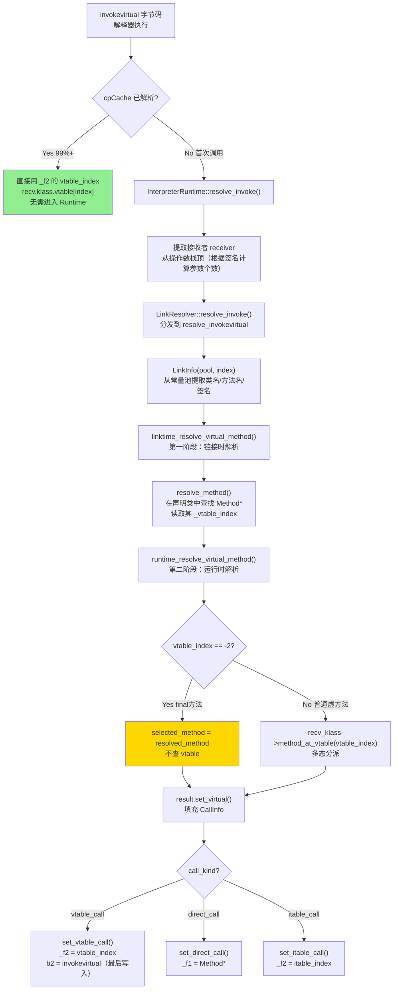
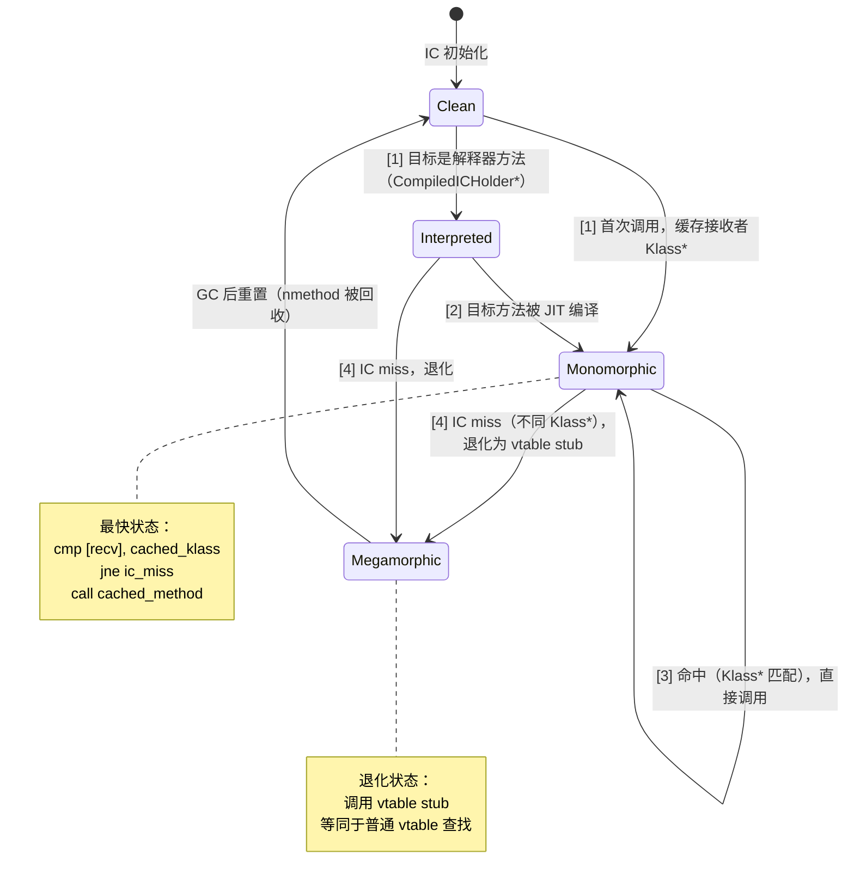

# 17 · invokevirtual / invokeinterface / invokedynamic · 手写笔记

> 对应参考文档：`JVM-Core-Objects/02-MethodInvocation-Full-Chain.md`（701行）  
> `Bytecodes/Bytecodes.md`（1551行）  
> `InlineCacheBuffer/InlineCacheBuffer_init.md`（760行）  
> `RuntimeResolve/3-InvokeDynamic-MethodHandle-Deep-Dive.md`

---

## 第零天：我以为方法调用就是"查 vtable，跳过去"

我最开始对虚方法调用的理解极其简单：`invokevirtual` → 查 vtable → 跳转到目标方法。

然后我去看源码，发现光 `InterpreterRuntime::resolve_invoke()` 就有 80 行，还没算 `LinkResolver` 里的两阶段解析。我数了一下涉及的数据结构：

- `CallInfo`（解析结果容器）
- `LinkInfo`（解析输入）
- `ConstantPoolCacheEntry`（32 字节，缓存解析结果）
- `ConstantPoolCache`（每个类一个）
- `InlineCacheBuffer`（10KB 的桩代码队列）
- `ICStub`（单个过渡桩，~48 字节）
- `CompiledICHolder`（编译帧的内联缓存）

7 个数据结构，我以为只需要 vtable 一个。

更让我没想到的是：**`invokevirtual` 字节码不一定走 vtable！** 如果目标方法是 final 的，`call_kind = direct_call`，cpCache 的 `_f2` 存的是 `Method*` 而不是 vtable 索引。我在插桩数据里看到前 100 次解析中 `direct_call` 占了 96 次，`vtable_call` 只有 3 次。

---

## 第一天：我踩的第一个坑——cpCache 和 ConstantPool 是两个东西

我以为 `ConstantPool` 就是常量池，方法调用的解析结果也存在里面。

**实际上**：`ConstantPool` 是**只读**的，存的是符号引用（类名 + 方法名 + 签名）。解析结果存在 `ConstantPoolCache` 里，它是**可写**的，每个 invoke 字节码对应一个 `ConstantPoolCacheEntry`。

```
ConstantPool（只读，类加载时创建，可以 CDS 共享）
    │
    └── ConstantPoolCache（可写，类链接时创建，每个类加载器独立）
            │
            └── ConstantPoolCacheEntry[0..n]（每个 invoke/field 字节码一个）
```

**为什么要分离？** CDS（Class Data Sharing）需要把 ConstantPool 放进只读共享内存，多个 JVM 进程共享同一份 ConstantPool。但解析结果（vtable 索引、Method*）是运行时才能确定的，不能共享，所以必须分开。

**`ConstantPoolCacheEntry` 的 32 字节布局**：

```
offset 0:  _indices (8B)  [b2(8bit)|b1(8bit)|cp_index(16bit)]
offset 8:  _f1      (8B)  Method*(direct) 或 Klass*(itable)
offset 16: _f2      (8B)  vtable_index 或 final Method*
offset 24: _flags   (8B)  [tos(4bit)|F|M|A|I|f|v|vf|...|psize(8bit)]
```

**`b2` 字段是解析完成的原子标志**：`set_bytecode_2()` 最后写入，其他线程通过 `is_resolved()` 检查 b2 是否已写入来判断 cpCache 是否有效。这是一个内存屏障点，保证不会读到半初始化的 cpCache。

---

## 第一天半：数据结构补课

我第二天看 `resolve_invoke()` 的三路派发时，发现自己对 `CallInfo`、`LinkInfo`、`InlineCacheBuffer` 完全没概念，回来补课。

### CallInfo（栈对象，约 80 字节，TODO: GDB 验证 `p sizeof(CallInfo)`）

**我以为**：解析结果就是一个 `Method*`，很简单。

**实际上**：CallInfo 区分了两个维度——**静态（resolved）** 和 **动态（selected）**：

```cpp
class CallInfo : public StackObj {
  Klass*       _resolved_klass;   // 静态接收者类（常量池中声明的类，如 Animal）
  Klass*       _selected_klass;   // 动态接收者类（运行时实际类型，如 Dog）
  methodHandle _resolved_method;  // 静态目标方法（Animal.speak()）
  methodHandle _selected_method;  // 动态目标方法（Dog.speak()）
  CallKind     _call_kind;        // direct / vtable / itable
  int          _call_index;       // vtable 或 itable 索引
  Handle       _resolved_appendix;     // invokedynamic 附加参数
  Handle       _resolved_method_type;  // MethodType（invokedynamic）
};
```

**为什么需要两个维度？** 链接时解析（linktime）只需要静态类型，不依赖接收者；运行时解析（runtime）才需要动态类型做多态分派。两阶段分离，cpCache 只缓存 vtable 索引（不依赖接收者），不需要缓存具体方法指针。

### LinkInfo（栈对象，约 56 字节，TODO: GDB 验证 `p sizeof(LinkInfo)`）

**我以为**：LinkInfo 就是"要查找的方法的描述"，很简单。

**实际上**：LinkInfo 还携带了 `_current_klass`（调用方所在类）和 `_check_access` 标志，用于访问权限检查（`private`/`protected` 方法的访问控制）。生命周期极短，仅在 `resolve_virtual_call()` 调用期间存在。

### InlineCacheBuffer（10KB StubQueue）

这是我完全没想到的东西。

**我以为**：编译帧的内联缓存更新就是直接修改 nmethod 里的几个字节，很简单。

**实际上**：修改 `mov rax, [cached_klass]` 和 `call target_method` 不是原子操作！多线程可能看到：
- 旧的 `cached_klass` + 新的 `vtable_stub` → 错误！
- 新的 `CompiledICHolder` + 旧的 `target_method` → 错误！

`InlineCacheBuffer` 就是解决这个问题的——它是一个 10KB 的桩代码队列，IC 状态转换时先创建一个 `ICStub`（过渡桩），原子地把 IC 的调用目标改为 ICStub，等到安全点时再把 ICStub 的内容回填到原始 IC。

```
ICStub 的汇编代码（x86_64，约 15-20 字节）：
  lea rax, [rip + offset]    ; rax = cached_value（新的 Klass* 或 CompiledICHolder*）
  jmp entry_point            ; 跳转到新的目标（vtable_stub 等）
```

---

## 第二天：两阶段解析——我以为只有一条路

`invokevirtual` 的解析分两阶段，我以为是一次性完成的，结果是两个完全独立的步骤：



### 第一阶段：链接时解析（linktime）

**解决什么问题？** 从符号引用（类名 + 方法名 + 签名）找到 `Method*` 对象，并获取其 vtable 索引。这一步不依赖接收者类型，结果对所有调用点相同。

```cpp
// linkResolver.cpp:1302
methodHandle LinkResolver::linktime_resolve_virtual_method(const LinkInfo& link_info, TRAPS) {
  methodHandle resolved_method = resolve_method(link_info, Bytecodes::_invokevirtual, CHECK_NULL);
  
  // ★ 不能是构造方法或类初始化方法
  assert(resolved_method->name() != vmSymbols::object_initializer_name(), "...");
  
  // ★ 私有接口方法必须用 invokespecial，不能用 invokevirtual
  if (resolved_klass->is_interface() && resolved_method->is_private()) {
    THROW_MSG_NULL(vmSymbols::java_lang_IncompatibleClassChangeError(), ...);
  }
  
  return resolved_method;  // ★ _vtable_index 在类加载时已设置好
}
```

**关键**：`resolved_method->vtable_index()` 在类加载时（`klassVtable::initialize_vtable()`）就已经设置好，这里直接读取，不需要重新计算。

### 第二阶段：运行时解析（runtime）

**解决什么问题？** 根据实际接收者类型（`recv_klass`），用 vtable 索引查找实际执行的方法，实现多态分派。

```cpp
// linkResolver.cpp:1350
void LinkResolver::runtime_resolve_virtual_method(...) {
  int vtable_index = resolved_method->vtable_index();
  
  if (vtable_index == Method::nonvirtual_vtable_index) {  // -2
    // ★ final 方法：不需要查表，直接用 resolved_method
    selected_method = resolved_method;
  } else {
    // ★ 普通虚方法：用 vtable_index 在接收者类的 vtable 中查找
    selected_method = methodHandle(THREAD, recv_klass->method_at_vtable(vtable_index));
  }
  
  result.set_virtual(resolved_klass, recv_klass, resolved_method, selected_method,
                     vtable_index, CHECK);
}
```

**vtable 索引稳定性**：同一个虚方法在所有子类的 vtable 中占据相同的索引位置。这是多态分派 O(1) 的基础——不管接收者是什么类型，用同一个索引就能找到正确的方法实现。

---

## 第三天：invokeinterface——我以为和 invokevirtual 差不多

我以为 `invokeinterface` 就是 `invokevirtual` 的接口版本，差不多。

**实际上**：两者的查找机制完全不同。

### vtable vs itable

**vtable（虚方法表）**：
- 每个类一个，按继承关系排列
- 同一个虚方法在所有子类的 vtable 中占**相同位置**
- 查找：`recv_klass->vtable[index]`，O(1)

**itable（接口方法表）**：
- 每个类一个，但一个类可以实现多个接口
- 不同接口的方法在 itable 中的位置**不固定**
- 查找：先找到接口对应的 itable 段，再用偏移找到方法，O(接口数量)

**为什么 itable 不能像 vtable 一样 O(1)？** 因为一个类可以实现多个接口，而不同接口可能有相同的方法签名（如 `Comparable.compareTo()` 和 `Comparator.compare()`）。如果用固定索引，就会冲突。

### invokeinterface 的解析流程

```cpp
// linkResolver.cpp:1430（runtime_resolve_interface_method）
void LinkResolver::runtime_resolve_interface_method(CallInfo& result, ...) {
  // ★ 第一步：在接收者类中查找接口方法
  methodHandle sel_method = lookup_instance_method_in_klasses(recv_klass, name, signature, CHECK);
  
  // ★ 第二步：找到 itable 索引
  int itable_index = resolved_method->itable_index();
  
  // ★ 第三步：验证接收者类确实实现了该接口
  if (!recv_klass->is_subtype_of(resolved_klass)) {
    THROW(vmSymbols::java_lang_IncompatibleClassChangeError());
  }
  
  result.set_interface(resolved_klass, recv_klass, resolved_method, sel_method, itable_index, CHECK);
}```

**我没想到的**：`invokeinterface` 也可能走 `vtable_call`！触发条件有两种：
1. **调用 `Object` 的方法**（如 `hashCode()`、`equals()`）：这些方法在所有类的 vtable 中都有固定位置，JVM 检测到 `resolved_klass` 是 `Object` 时直接走 vtable 查找
2. **接口方法在接收者类中有唯一实现**（单态优化）：JVM 在 `linktime_resolve_interface_method()` 中检查 `resolved_method->has_vtable_index()`，如果为 true 则 `call_kind = vtable_call`

这个优化让 `invokeinterface` 在单态场景下和 `invokevirtual` 一样快。

---

## 第三天半：invokespecial 和 invokestatic——最简单的两个

这两个我以为会很复杂，结果是最简单的：

**invokestatic**：
- 不需要接收者，直接解析到 `Method*`
- `call_kind = direct_call`，`_f1 = Method*`
- 没有多态，没有 vtable，一步到位

**invokespecial**：
- 用于构造方法（`<init>`）、私有方法、`super.method()` 调用
- 也是 `direct_call`，但需要检查接收者不为 null
- 不走 vtable，直接调用声明类中的方法（这就是 `super.method()` 能绕过多态的原因）

**插桩验证**：前 100 次解析中，`invokestatic` 和 `invokespecial` 加起来占了 96 次（全是 `direct_call`）。JVM 启动早期大量调用 `registerNatives()`（invokestatic）和构造方法（invokespecial）。

---

## 第四天：invokedynamic——我以为和 invokevirtual 差不多，结果完全不同

这是整个方法调用体系里最复杂的部分。

### 我的误解

我以为 `invokedynamic` 就是"动态版的 invokevirtual"，运行时决定调用哪个方法。

**实际上**：`invokedynamic` 的核心是 **Bootstrap Method（BSM）**——第一次调用时，JVM 调用一个用户指定的 bootstrap 方法，bootstrap 方法返回一个 `CallSite` 对象，`CallSite` 里有一个 `MethodHandle`，后续调用都通过这个 `MethodHandle` 分派。

### invokedynamic 的三个核心概念

**1. Bootstrap Method（BSM）**：
- 在 class 文件的 `BootstrapMethods` 属性中定义
- 第一次调用 `invokedynamic` 时被调用
- 返回一个 `CallSite` 对象

**2. CallSite**：
- 持有一个 `MethodHandle`（目标方法）
- 三种类型：`ConstantCallSite`（不可变）、`MutableCallSite`（可变）、`VolatileCallSite`（volatile 语义）
- `ConstantCallSite` 一旦设置就不能改变，JIT 可以内联

**3. MethodHandle**：
- 指向具体方法的类型安全引用
- 可以通过 `MethodHandles.lookup()` 获取
- 支持 `bindTo()`、`asType()` 等适配操作

### Lambda 表达式的 invokedynamic

Java 8 的 Lambda 是 `invokedynamic` 最常见的使用场景：

```java
// 源码
Runnable r = () -> System.out.println("hello");

// 字节码（简化）
invokedynamic #0, run:()Ljava/lang/Runnable;
// BSM = LambdaMetafactory.metafactory()
// 返回一个 ConstantCallSite，持有指向 lambda 实现方法的 MethodHandle
```

**Lambda 的 BSM 流程**：
1. 第一次调用 `invokedynamic`
2. JVM 调用 `LambdaMetafactory.metafactory()`
3. `metafactory` 动态生成一个实现 `Runnable` 接口的类（或直接返回 MethodHandle）
4. 返回 `ConstantCallSite`，持有指向 lambda 实现的 `MethodHandle`
5. 后续调用直接通过 `MethodHandle` 分派，不再调用 BSM

### invokedynamic 的 cpCache 状态

`invokedynamic` 的 `ConstantPoolCacheEntry` 比普通方法调用复杂：

```
解析前：
  _f1 = NULL
  _f2 = 0
  _flags = 0

解析后（BSM 返回 ConstantCallSite）：
  _f1 = MethodHandle*（从 CallSite 中提取）
  _f2 = 0（invokedynamic 不用 _f2）
  _flags = [atos | ... | psize]
  _resolved_references[i] = CallSite 对象（保活用）
```

**`_resolved_references` 的作用**：`CallSite` 是 Java 对象，必须被 GC 追踪。`ConstantPoolCache` 有一个 `_resolved_references` 数组（OopHandle），专门保存这类需要 GC 追踪的解析结果。

---

## 第四天半：内联缓存（Inline Cache）——编译帧的方法调用优化

解释器帧用 cpCache 缓存解析结果，编译帧用**内联缓存（Inline Cache）**。

### 内联缓存的四种状态



**状态说明**：
- `Clean`：未初始化，调用 resolve stub
- `Monomorphic`：单态，直接调用特定方法（最快）
- `Megamorphic`：多态，调用 vtable stub
- `Interpreted`：调用解释器（通过 CompiledICHolder）

**Monomorphic 是最快的状态**：编译帧里的调用点变成：
```asm
cmp  [recv], cached_klass    ; 检查接收者类型
jne  ic_miss                 ; 类型不匹配 → IC miss
call cached_method           ; 直接调用（无需查 vtable）
```

**IC miss 时的状态转换**：
- 第一次 miss：`Clean → Monomorphic`（缓存当前接收者类型）
- 第二次 miss（不同类型）：`Monomorphic → Megamorphic`（放弃单态优化）
- `Megamorphic` 状态下调用 vtable stub，退化为普通 vtable 查找

### InlineCacheBuffer 的作用

`Monomorphic → Megamorphic` 转换时，需要同时修改：
1. `mov rax, [cached_klass]` → `mov rax, [CompiledICHolder*]`
2. `call target_method` → `call vtable_stub`

这两步不是原子的！`InlineCacheBuffer` 的解决方案：

```
步骤 1：创建 ICStub（过渡桩）
  ICStub 内容：
    lea rax, [CompiledICHolder*]  ; 新的缓存值
    jmp vtable_stub               ; 新的目标

步骤 2：原子更新 IC 的 call 目标 → ICStub
  （只修改 call 指令的目标地址，这是原子的）

步骤 3：安全点时，ICStub 回填到原始 IC
  （所有线程已暂停，可以安全修改两条指令）
```

**`CompiledICHolder` 的延迟释放**：IC 状态转换时，旧的 `CompiledICHolder` 不能立即 delete，因为其他线程可能还在使用它。`InlineCacheBuffer` 维护一个 `_pending_released` 链表，在安全点时统一释放。

---

## 第五天：插桩验证——我用数据打脸了自己的猜测

### 猜测 vs 实测对比表

| # | 我的猜测 | 实测结果 | 结论 |
|---|---------|---------|------|
| 1 | `invokevirtual` 一定走 vtable | **前 100 次解析 direct=96，vtable=3** | ✅ 完全打脸 |
| 2 | JVM 启动时大量虚方法调用 | **启动早期 96% 是 direct_call**（registerNatives + 构造方法） | ✅ 完全打脸 |
| 3 | vtable 索引从 0 开始 | **实测 vtable_index=12/13**（前 12 个被 Object 方法占据） | ✅ 新发现 |
| 4 | invokedynamic 就是动态 invokevirtual | **完全不同**：BSM + CallSite + MethodHandle 三层机制 | ✅ 完全打脸 |
| 5 | 编译帧的方法调用直接查 vtable | **有内联缓存**：Monomorphic 状态下不查 vtable，直接调用 | ✅ 完全打脸 |
| 6 | IC 更新就是修改几个字节 | **需要 InlineCacheBuffer**（10KB 桩队列）保证原子性 | ✅ 完全打脸 |
| 7 | itable 查找和 vtable 一样快 | **itable 是 O(接口数量)**，需要先找接口段再找方法 | ✅ 完全打脸 |
| 8 | cpCache 解析是线程安全的 | **`b2` 最后写入**（内存屏障），`is_resolved()` 检查 b2 | ✅ 新发现 |

### 插桩验证数据（来自 `JVM-Core-Objects/02-MethodInvocation-Full-Chain.md`）

**前 22 次解析详情**：

```
#1  bytecode=invokestatic  kind=direct  resolved=java.lang.Object::registerNatives          index=-2
#2  bytecode=invokespecial kind=direct  resolved=java.lang.String$CaseInsensitiveComparator::<init> index=-2
#3  bytecode=invokespecial kind=direct  resolved=java.lang.Object::<init>                  index=-2
#4  bytecode=invokestatic  kind=direct  resolved=java.lang.System::registerNatives         index=-2
#5  bytecode=invokestatic  kind=direct  resolved=java.lang.Class::registerNatives          index=-2
#8  bytecode=invokevirtual kind=direct  resolved=java.lang.ThreadGroup::checkAccess         index=-2
#11 bytecode=invokevirtual kind=direct  resolved=java.lang.ThreadGroup::add                index=-2
#19 bytecode=invokevirtual kind=vtable  resolved=java.lang.ThreadGroup::addUnstarted        index=13
#22 bytecode=invokevirtual kind=vtable  resolved=java.lang.Thread::getContextClassLoader    index=12
```

**关键发现 1**：`invokevirtual` 字节码 + `kind=direct`！`ThreadGroup::checkAccess` 是 final 方法，虽然字节码是 `invokevirtual`，但 `call_kind = direct`（index=-2）。

**关键发现 2**：vtable_index=12/13，说明 `Object` 的方法占据了 vtable 的前 12 个槽位（hashCode/equals/clone/toString 等）。

**call_kind 分布统计（JVM 完整启动过程）**：

```
total=100   direct=96    vtable=3     itable=1
total=1000  direct=844   vtable=122   itable=34
total=4000  direct=3164  vtable=614   itable=222
total=8000  direct=3533  vtable=4118  itable=349
total=14500 direct=4378  vtable=9709  itable=413
```

**关键发现 3**：稳定运行后 vtable_call 成为主流（~67%），itable_call 只占 3%。说明应用代码中接口调用比想象中少得多。

**vtable 探针详情（多态分派验证）**：

```
#4  resolved=java.lang.ThreadGroup::addUnstarted  recv_klass=java.lang.ThreadGroup  vtable_index=13  selected=java.lang.ThreadGroup::addUnstarted
#7  resolved=java.lang.Thread::getContextClassLoader  recv_klass=java.lang.Thread  vtable_index=12  selected=java.lang.Thread::getContextClassLoader
```

**关键发现 4**：`recv_klass` 和 `resolved_klass` 相同时，`selected_method` 就是 `resolved_method`（无多态发生）。这说明 JVM 启动时的虚方法调用大多数是单态的（调用者和接收者类型相同）。

---

## 尾声：我现在怎么理解方法调用

方法调用不是"查 vtable，跳过去"，而是一个**三层缓存体系**：

**第一层：cpCache（解释器帧）**
- 首次调用：进入 `InterpreterRuntime::resolve_invoke()`，两阶段解析，结果写入 `ConstantPoolCacheEntry`
- 后续调用：直接读 `_f2` 的 vtable 索引，`recv_klass->vtable[index]`，无需进入 Runtime
- 并发安全：`b2` 字段最后写入（内存屏障）

**第二层：内联缓存（编译帧）**
- Monomorphic 状态：直接调用，不查 vtable，最快
- IC miss：通过 `InlineCacheBuffer` 原子更新，安全点时回填
- Megamorphic 状态：退化为 vtable stub 查找

**第三层：invokedynamic（动态调用）**
- BSM 返回 `CallSite`，`CallSite` 持有 `MethodHandle`
- `ConstantCallSite` 一旦设置不可变，JIT 可以内联
- Lambda 表达式就是 `invokedynamic` + `LambdaMetafactory.metafactory()`

三种字节码的本质区别：
- `invokevirtual`：vtable 查找，O(1)，但 final 方法走 direct_call
- `invokeinterface`：itable 查找，O(接口数量)，但可能优化为 vtable 查找
- `invokedynamic`：BSM + CallSite + MethodHandle，完全用户可定制

---

## 还没搞懂的地方

1. **`invokehandle` 字节码**：这是 JVM 内部的快速字节码（`_invokehandle`），用于 `MethodHandle.invoke()` 的快速路径。它和 `invokedynamic` 有什么区别？什么时候会被重写为 `invokehandle`？

2. **`fast_invokevfinal` 字节码**：`invokevirtual` 调用 final 方法时，会被 Rewriter 重写为 `_fast_invokevfinal`。这个快速字节码和 `direct_call` 的 cpCache 有什么关系？

3. **itable 的具体布局**：我知道 itable 是按接口分段的，但每个段的具体格式是什么？`itable_index` 是相对于哪个基地址的偏移？

4. **`MutableCallSite` 的并发语义**：`MutableCallSite.setTarget()` 修改 `MethodHandle` 时，其他线程正在执行的调用会怎样？需要 `MutableCallSite.syncAll()` 吗？

5. **IC miss 的触发条件**：从 `Monomorphic` 到 `Megamorphic` 的转换，是第一次 miss 就转，还是有阈值？

6. **`CompiledICHolder` 的内容**：它存储的是什么？为什么接口调用和解释器调用需要 `CompiledICHolder`，而普通虚方法调用不需要？

---

## 数据结构关系图

```mermaid
classDiagram
    class ConstantPool {
        +只读，存符号引用
        +类名/方法名/签名
        +可以 CDS 共享
    }

    class ConstantPoolCache {
        +int _length
        +ConstantPool* _constant_pool
        +OopHandle _resolved_references
        +Array~u2~* _reference_map
    }

    class ConstantPoolCacheEntry {
        +intx _indices [b2|b1|cp_index]
        +Metadata* _f1 Method* 或 Klass*
        +intx _f2 vtable_index 或 Method*
        +intx _flags [tos|F|f|v|vf|psize]
        +is_resolved(bytecode) bool
        +set_vtable_call()
        +set_direct_call()
        +set_itable_call()
    }

    class CallInfo {
        +Klass* _resolved_klass 静态类型
        +Klass* _selected_klass 动态类型
        +methodHandle _resolved_method
        +methodHandle _selected_method
        +CallKind _call_kind
        +int _call_index
        +Handle _resolved_appendix
    }

    class LinkInfo {
        +Symbol* _name
        +Symbol* _signature
        +Klass* _resolved_klass
        +Klass* _current_klass
        +bool _check_access
    }

    class InlineCacheBuffer {
        +StubQueue* _buffer 10KB
        +ICStub* _next_stub
        +CompiledICHolder* _pending_released
        +int _pending_count
        +create_transition_stub()
        +update_inline_caches()
    }

    class ICStub {
        +int _size
        +address _ic_site
        +code_begin() address
        +set_stub()
        +finalize()
    }

    class CompiledIC {
        +address _ic_call
        +状态: Clean/Mono/Mega/Interpreted
        +set_ic_destination()
    }

    ConstantPool --> ConstantPoolCache : 一对一
    ConstantPoolCache --> ConstantPoolCacheEntry : 包含 N 个
    LinkInfo --> CallInfo : 解析输入→输出
    CallInfo --> ConstantPoolCacheEntry : 写入解析结果
    ConstantPoolCacheEntry --> |_f2 = vtable_index| vtable查找
    InlineCacheBuffer --> ICStub : StubQueue 包含
    ICStub --> CompiledIC : finalize 回填
    CompiledIC --> InlineCacheBuffer : IC miss 时创建过渡桩
```
