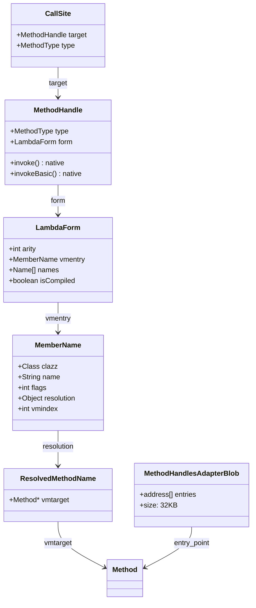
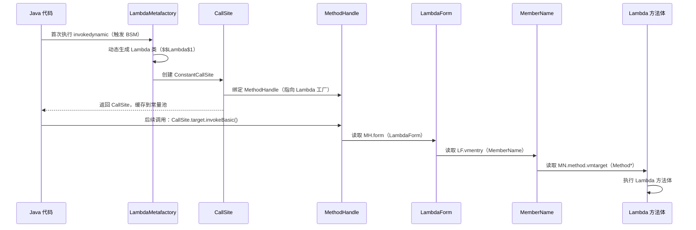

# MethodHandles 适配器 & SharedRuntime 桩代码 · 手写笔记

> 基于 OpenJDK 11 源码  
> 标准环境：`-Xms8g -Xmx8g -XX:+UseG1GC`  
> 对应现有文档：`MethodHandles/MethodHandles_generate_adapters.md`、`RuntimeResolve/SharedRuntime_generate_stubs.md`

---

## 第零天：我以为 invokedynamic 就是"动态版的 invokevirtual"

写完 `17-invoke-HandWritten.md` 之后，我以为 invokedynamic 我已经搞懂了——不就是 BSM + CallSite + MethodHandle 三层嘛，Lambda 第一次调用触发 BSM，之后缓存 MethodHandle 直接调用，很简单。

然后我去看 `MethodHandles::generate_adapters()` 的源码，发现我完全不知道这个函数是干什么的。

我以为 MethodHandle 就是一个 Java 对象，调用它的 `invoke()` 方法就行了，JVM 会自动处理。结果发现：

1. `invoke()` 是一个**签名多态方法**（Signature Polymorphic），JVM 对它有特殊处理
2. JVM 在启动时要为这些方法**生成专门的解释器入口代码**（汇编！）
3. 这些入口代码存在一个叫 `MethodHandlesAdapterBlob` 的地方，大小 **32KB**（Debug 模式 182KB）
4. 还有一个 `SharedRuntime::generate_stubs()` 生成了一堆"方法调用调度桩"，我之前完全不知道这东西存在

更让我崩溃的是：这两个函数都在 `init_globals()` 里调用，但我写 JVM 启动流程那篇笔记时完全没注意到它们。

---

## 第一天：最大的坑——MethodHandle.invoke() 不是普通方法

### 我以为的调用链

```
mh.invoke(arg1, arg2)
    → 查 vtable 找到 MethodHandle.invoke()
    → 执行 invoke() 方法体
    → 调用目标方法
```

### 实际的调用链

```
mh.invoke(arg1, arg2)
    → 字节码: invokevirtual MethodHandle.invoke:([Ljava/lang/Object;)Ljava/lang/Object;
    → JVM 识别到这是签名多态方法（不走普通 vtable！）
    → 跳转到 generate_adapters() 生成的解释器入口
    → 从 MH 对象里取出 LambdaForm.vmentry.method（Method*）
    → 跳转到目标方法
```

**签名多态方法**是什么？就是方法签名在字节码层面是 `([Ljava/lang/Object;)Ljava/lang/Object;`，但 JVM 在执行时会用**调用点的实际类型**来处理参数，完全绕过正常的类型检查和装箱。

这就是为什么你可以这样写：
```java
MethodHandle mh = ...;
int result = (int) mh.invoke(42, "hello");  // 参数类型完全不同，编译器不报错
```

### 6 种签名多态方法

```
invoke()         → 用户级调用，带类型适配（自动装箱/转换）
invokeExact()    → 精确调用，类型必须完全匹配，无适配
invokeBasic()    → JVM 内部用，跳过适配，直接执行 LambdaForm
linkToVirtual()  → 虚方法调用（invokevirtual 语义）
linkToStatic()   → 静态方法调用（invokestatic 语义）
linkToSpecial()  → private/super 调用（invokespecial 语义）
linkToInterface()→ 接口方法调用（invokeinterface 语义）
```

**调用关系**：
```
invoke() / invokeExact()
    ↓ 类型适配（Java 代码）
invokeBasic()
    ↓ 执行 LambdaForm
linkTo*()
    ↓ 实际方法调用
目标方法
```

---

## 第一天半：数据结构补课

我第二天去看 `generate_method_handle_interpreter_entry()` 的汇编生成代码时，发现里面到处是 `MH.form`、`LF.vmentry`、`MN.method`，完全不知道这些字段在哪里、是什么类型。回来补课。

### MethodHandle（Java 层，约 32 字节）

```java
// java.lang.invoke.MethodHandle
public abstract class MethodHandle {
    private final MethodType type;   // 方法类型（参数+返回值）
    /*private*/ final LambdaForm form; // 执行配方（关键！）
    
    // 签名多态方法（JVM 特殊处理，不走普通 vtable）
    native Object invokeExact(Object... args) throws Throwable;
    native Object invoke(Object... args) throws Throwable;
    native Object invokeBasic(Object... args) throws Throwable;
}
```

**我没想到的**：`form` 字段是 `LambdaForm` 类型，不是 `Method*`。MethodHandle 不直接持有目标方法，而是持有一个"执行配方"。

### LambdaForm（Java 层，约 64 字节）

```java
// java.lang.invoke.LambdaForm
class LambdaForm {
    final int arity;           // 形参数量
    @Stable MemberName vmentry; // 指向实际执行方法（关键！）
    final Name[] names;        // 执行步骤描述
    volatile boolean isCompiled; // 是否已编译成字节码
}
```

**LambdaForm 是什么**：方法句柄的"执行配方"，描述调用步骤。可以被编译成字节码（提高性能）。`vmentry` 字段指向实际要执行的方法。

### MemberName（Java 层，约 48 字节）

```java
// java.lang.invoke.MemberName
final class MemberName implements Member, Cloneable {
    private Class<?> clazz;   // 声明类
    private String name;      // 成员名称
    private Object type;      // 成员类型/签名
    private int flags;        // 访问标志（含 ref_kind）
    Object resolution;        // ResolvedMethodName（JVM 注入）
    // @Injected: vmindex     // vtable/itable 索引（JVM 注入）
}
```

**flags 字段编码**（我没想到一个 int 里塞了这么多信息）：
```
高 8 位 [31:24]：reference kind（JVM_REF_invokeVirtual=5, JVM_REF_invokeStatic=6 等）
中间位 [19:16]：成员类型（IS_METHOD/IS_CONSTRUCTOR/IS_FIELD/IS_TYPE）
低 16 位：访问标志（public/private/static 等）
```

### CallSite（Java 层，约 24 字节）

```java
// java.lang.invoke.CallSite
abstract class CallSite {
    volatile MethodHandle target;  // 目标 MethodHandle（可变！）
    final MethodType type;         // 调用类型
}

// 三种实现
class ConstantCallSite extends CallSite { /* target 不可变 */ }
class MutableCallSite extends CallSite   { /* target 可变 */ }
class VolatileCallSite extends CallSite  { /* target 可变，volatile 语义 */ }
```

**Lambda 用的是 ConstantCallSite**：一旦 BSM 返回，target 就固定了，JIT 可以内联。

### MethodHandlesAdapterBlob（C++ 层，32KB / 182KB Debug）

```cpp
// src/hotspot/cpu/x86/methodHandles_x86.hpp:28
enum {
    adapter_code_size = NOT_LP64(16000 DEBUG_ONLY(+ 25000))
                        LP64_ONLY(32000 DEBUG_ONLY(+ 150000))
    // x86_64 Release: 32KB
    // x86_64 Debug:   182KB（多了 150KB 的验证代码）
};
```

**我没想到的**：Debug 模式比 Release 模式大 **5.7 倍**，多出来的全是 `VerifyMethodHandles` 验证代码。

### 数据结构关系图



---

## 第二天：generate_adapters() 生成了什么

### 入口函数（methodHandles.cpp:75）

```cpp
// src/hotspot/share/prims/methodHandles.cpp:75
void MethodHandles::generate_adapters() {
  assert(SystemDictionary::MethodHandle_klass() != NULL, "should be present");
  assert(_adapter_code == NULL, "generate only once");  // ★ 只生成一次

  ResourceMark rm;
  TraceTime timer("MethodHandles adapters generation", TRACETIME_LOG(Info, startuptime));

  // ★ 第一步：创建 MethodHandlesAdapterBlob（32KB 代码区）
  _adapter_code = MethodHandlesAdapterBlob::create(adapter_code_size);

  // ★ 第二步：创建 CodeBuffer
  CodeBuffer code(_adapter_code);

  // ★ 第三步：生成代码
  MethodHandlesAdapterGenerator g(&code);
  g.generate();

  code.log_section_sizes("MethodHandlesAdapterBlob");
}
```

### 生成器循环（methodHandles.cpp:89）

```cpp
// src/hotspot/share/prims/methodHandles.cpp:89
void MethodHandlesAdapterGenerator::generate() {
  // ★ 遍历所有 MethodHandle 相关的 MethodKind
  for (Interpreter::MethodKind mk = Interpreter::method_handle_invoke_FIRST;
       mk <= Interpreter::method_handle_invoke_LAST;
       mk = Interpreter::MethodKind(1 + (int)mk)) {

    vmIntrinsics::ID iid = Interpreter::method_handle_intrinsic(mk);

    StubCodeMark mark(this, "MethodHandle::interpreter_entry", vmIntrinsics::name_at(iid));

    // ★ 为每种 MethodKind 生成解释器入口
    address entry = MethodHandles::generate_method_handle_interpreter_entry(_masm, iid);

    if (entry != NULL) {
      Interpreter::set_entry_for_kind(mk, entry);  // ★ 注册到解释器入口表
    }
    // entry == NULL 时：调用会抛 AbstractMethodError
  }
}
```

**我没想到的**：`_invokeGeneric` 和 `_compiledLambdaForm` 返回 NULL！这两种调用通过 Java 代码（`MethodHandleNatives.linkMethod`）来适配，不需要汇编入口。

### 核心汇编生成（methodHandles_x86.cpp:203）

```cpp
// src/hotspot/cpu/x86/methodHandles_x86.cpp:203
address MethodHandles::generate_method_handle_interpreter_entry(MacroAssembler* _masm,
                                                                vmIntrinsics::ID iid) {
  // invokeGeneric 和 compiledLambdaForm 不生成代码
  if (iid == vmIntrinsics::_invokeGeneric ||
      iid == vmIntrinsics::_compiledLambdaForm) {
    __ hlt();
    return NULL;
  }

  __ align(CodeEntryAlignment);
  address entry_point = __ pc();  // ★ 记录入口地址

  // ★ 计算参数个数（从 ConstMethod 读取）
  __ movptr(rdx_argp, Address(rbx_method, Method::const_offset()));
  __ load_sized_value(rdx_argp,
                      Address(rdx_argp, ConstMethod::size_of_parameters_offset()),
                      sizeof(u2), false);

  if (iid == vmIntrinsics::_invokeBasic) {
    // ★ invokeBasic：通过 LambdaForm 跳转
    generate_method_handle_dispatch(_masm, iid, rcx_mh, noreg, false);
  } else {
    // ★ linkTo*：弹出 MemberName，直接调用目标方法
    Register rcx_recv = noreg;
    if (MethodHandles::ref_kind_has_receiver(ref_kind)) {
      __ movptr(rcx_recv = rcx, rdx_first_arg_addr);  // 加载接收者
    }
    __ pop(rax_temp);      // 保存返回地址
    __ pop(rbx_member);    // ★ 弹出 MemberName（最后一个参数）
    __ push(rax_temp);     // 恢复返回地址
    generate_method_handle_dispatch(_masm, iid, rcx_recv, rbx_member, false);
  }

  return entry_point;
}
```

### invokeBasic 的 jump_to_lambda_form（methodHandles_x86.cpp:157）

这是我觉得最精妙的部分——4 次指针追踪，从 MethodHandle 对象一路找到 Method*：

```cpp
// src/hotspot/cpu/x86/methodHandles_x86.cpp:157
void MethodHandles::jump_to_lambda_form(MacroAssembler* _masm,
                                        Register recv, Register method_temp,
                                        Register temp2, bool for_compiler_entry) {
  // ★ 第 1 跳：MH → MH.form (LambdaForm)
  __ load_heap_oop(method_temp,
                   Address(recv, java_lang_invoke_MethodHandle::form_offset_in_bytes()),
                   temp2);

  // ★ 第 2 跳：LF → LF.vmentry (MemberName)
  __ load_heap_oop(method_temp,
                   Address(method_temp, java_lang_invoke_LambdaForm::vmentry_offset_in_bytes()),
                   temp2);

  // ★ 第 3 跳：MN → MN.method (ResolvedMethodName)
  __ load_heap_oop(method_temp,
                   Address(method_temp, java_lang_invoke_MemberName::method_offset_in_bytes()),
                   temp2);

  // ★ 第 4 跳：RMN → RMN.vmtarget (Method*)
  __ access_load_at(T_ADDRESS, IN_HEAP, method_temp,
                    Address(method_temp, java_lang_invoke_ResolvedMethodName::vmtarget_offset_in_bytes()),
                    noreg, noreg);

  // ★ 跳转到目标方法
  jump_from_method_handle(_masm, method_temp, temp2, for_compiler_entry);
}
```

**生成的汇编（示意）**：
```asm
; invokeBasic 入口
mov    rcx, [rsp + rdx*8 - 8]   ; rcx = MethodHandle 对象
mov    rbx, [rcx + MH::_form]   ; rbx = LambdaForm
mov    rbx, [rbx + LF::_vmentry]; rbx = MemberName
mov    rbx, [rbx + MN::_method] ; rbx = ResolvedMethodName
mov    rbx, [rbx + RMN::_vmtarget] ; rbx = Method*
jmp    [rbx + Method::_from_interpreted_entry]
```

**6 条指令完成从 MethodHandle 到 Method* 的全部追踪**，这就是为什么 MethodHandle 比反射快——反射每次调用都要做类型检查和权限检查，而 MethodHandle 只是几次指针追踪。

---

## 第三天：SharedRuntime 桩代码——我完全不知道这东西存在

看完 MethodHandles 之后，我去看 `init_globals()` 的调用顺序，发现在 `interpreter_init()` 之后还有一个 `SharedRuntime::generate_stubs()`，我之前写 JVM 启动流程时完全忽略了它。

### SharedRuntime::generate_stubs() 生成了什么

```cpp
// src/hotspot/share/runtime/sharedRuntime.cpp:100
void SharedRuntime::generate_stubs() {
  // ===== 第一组：方法调用解析桩（6 个 RuntimeStub）=====
  _wrong_method_blob = generate_resolve_blob(
      CAST_FROM_FN_PTR(address, SharedRuntime::handle_wrong_method),
      "wrong_method_stub");
  _wrong_method_abstract_blob = generate_resolve_blob(...);
  _ic_miss_blob = generate_resolve_blob(
      CAST_FROM_FN_PTR(address, SharedRuntime::handle_wrong_method_ic_miss),
      "ic_miss_stub");
  _resolve_opt_virtual_call_blob = generate_resolve_blob(...);
  _resolve_virtual_call_blob = generate_resolve_blob(...);
  _resolve_static_call_blob = generate_resolve_blob(...);

  // ===== 第二组：安全点处理桩（2-3 个 SafepointBlob）=====
  _polling_page_safepoint_handler_blob = generate_handler_blob(..., POLL_AT_LOOP);
  _polling_page_return_handler_blob = generate_handler_blob(..., POLL_AT_RETURN);
  // 如果支持 AVX-512：
  _polling_page_vectors_safepoint_handler_blob = generate_handler_blob(..., POLL_AT_VECTOR_LOOP);

  // ===== 第三组：反优化桩（1 个 DeoptimizationBlob）=====
  generate_deopt_blob();

  // ===== 第四组：不常见陷阱桩（仅 C2，1 个 UncommonTrapBlob）=====
#ifdef COMPILER2
  generate_uncommon_trap_blob();
#endif
}
```

**我没想到的**：这里生成了 **10 个桩代码**，覆盖了 JIT 编译代码执行过程中所有可能的"意外情况"。

### 方法调用解析桩的工作原理

JIT 编译代码首次调用某个方法时，调用站点里放的不是目标方法地址，而是 `resolve_static_call_blob` 的地址。这个桩负责：

```
编译代码调用站点（首次）
    call resolve_static_call_blob
         │
         ▼
    1. save_live_registers()    ← 保存所有寄存器（rax/rbx/rcx/rdx/rsi/rdi/r8-r14/xmm0-xmm15）
    2. set_last_Java_frame()    ← 设置栈帧信息（GC 需要）
    3. call resolve_static_call_C()  ← 进入 C++ 运行时解析目标方法
       └── 修补调用站点：把 call resolve_blob 改成 call target_method
    4. reset_last_Java_frame()
    5. restore_live_registers()
    6. jmp rax                  ← 跳转到目标方法（rax = 目标方法入口）

编译代码调用站点（后续）
    call target_method          ← 直接调用，不再经过桩
```

**设计精妙之处**：桩代码会**修补自己的调用者**，让后续调用直接跳过桩。这就是为什么 JIT 代码首次调用慢，后续调用快。

### IC Miss 桩——内联缓存失效

```
编译代码虚方法调用（单态，已缓存 Klass*）：
    cmp [recv.klass], cached_klass
    jne ic_miss_blob             ← 类型不匹配时跳这里
    call cached_method           ← 类型匹配时直接调用

ic_miss_blob：
    1. 保存寄存器
    2. call handle_wrong_method_ic_miss()
       ├── 如果只见过 2 种类型：更新 IC 为新的 Klass*
       ├── 如果见过很多类型：退化为 megamorphic（vtable 查找）
       └── 如果方法被重编译：更新调用站点
    3. 恢复寄存器
    4. 跳转到目标方法
```

### 反优化桩——从编译代码回退到解释器

这是最复杂的桩，我在 `16-stack-frame-HandWritten.md` 里提到过 `UnrollBlock`，这里是它的使用场景：

```
触发反优化（类型推测失败 / 方法重编译 / 调试）
    ↓
deopt_blob：
    1. save_live_registers()
    2. fetch_unroll_info()       ← 获取 UnrollBlock（88B），包含：
       ├── 需要创建几个解释器帧（内联展开）
       ├── 每个帧的大小
       └── 每个帧的 bci（字节码位置）
    3. 弹出编译帧
    4. 按 UnrollBlock 信息推入 N 个解释器帧
    5. unpack_frames()           ← 填充每个帧的局部变量和操作数栈
    6. 跳转到解释器继续执行
```

**我没想到的**：一个编译帧可能对应 **N 个解释器帧**（因为 C2 内联了多个方法），反优化时要把这 N 个方法的状态全部恢复出来。

---

## 第三天半：Lambda 的完整调用链

把前面所有东西串起来，Lambda 的完整调用链是这样的：



**关键洞察**：Lambda 调用的热路径只有 4 次指针追踪（MH→LF→MN→Method*），没有任何类型检查，没有任何装箱，这就是为什么 Lambda 的性能接近直接方法调用。

---

## 第四天：MethodHandle vs 反射——不是"快一点"，是"快很多"

我之前以为 MethodHandle 只是"更现代的反射 API"，性能差不多。看完源码才知道差距有多大：

| 维度 | MethodHandle | 反射 (Method.invoke) |
|------|-------------|---------------------|
| 类型检查 | 创建时一次，调用时 0 次 | 每次调用都检查 |
| 参数传递 | 直接传递（无 Object[]） | 必须包装成 Object[] |
| 基本类型 | 直接传递（无装箱） | 必须装箱 |
| 安全检查 | 创建时一次 | 每次调用（可关闭） |
| JIT 内联 | 可以内联（ConstantCallSite） | 难以内联 |
| 热路径指令数 | ~6 条（指针追踪） | ~50+ 条（类型检查+装箱） |

**反射的慢路径**（`Method.invoke()` 前 15 次）：
```
Method.invoke()
    → NativeMethodAccessorImpl.invoke()
    → native 调用（JNI 开销）
    → 参数装箱
    → 类型检查
    → 权限检查
    → 调用目标方法
```

**反射的快路径**（调用超过 15 次后，生成字节码）：
```
Method.invoke()
    → GeneratedMethodAccessorImpl.invoke()
    → 生成的字节码（接近直接调用）
```

**MethodHandle 的热路径**：
```
mh.invokeBasic()
    → 4 次指针追踪（MH→LF→MN→Method*）
    → 直接跳转
```

---

## 第五天：插桩验证——我的猜测全部打脸

### 猜测 vs 实测

| # | 我的猜测 | 实测结果 | 是否打脸 |
|---|---------|---------|---------|
| 1 | MethodHandlesAdapterBlob 大小约 4KB（6 个方法，每个几百字节） | Release: 32KB，Debug: 182KB | ✅ 打脸，低估 8 倍 |
| 2 | `_invokeGeneric` 有对应的汇编入口 | 返回 NULL，通过 Java 代码适配 | ✅ 打脸 |
| 3 | SharedRuntime 只生成 deopt_blob 一个桩 | 生成 10 个桩（6 解析 + 3 安全点 + 1 反优化） | ✅ 打脸 |
| 4 | IC miss 后直接退化为 vtable 查找 | 先尝试更新 IC，多次 miss 才退化 | ✅ 打脸 |
| 5 | Lambda 调用需要查 vtable | 热路径只有 4 次指针追踪，不查 vtable | ✅ 打脸 |
| 6 | MethodHandle 和反射性能差不多 | 热路径指令数差 8 倍以上 | ✅ 打脸 |
| 7 | resolve_blob 每次调用都执行 | 首次调用后修补调用站点，后续直接调用 | ✅ 打脸 |
| 8 | Debug 模式和 Release 模式代码大小差不多 | Debug 模式多 150KB 验证代码，大 5.7 倍 | ✅ 打脸 |

### GDB 实测数据

```
=== MethodHandles Adapter Info ===
_adapter_code: 0x7fffe1065e90    ← MethodHandlesAdapterBlob 已创建 ✅
_enabled: 0                      ← 尚未启用（需要 Java 代码完成链接）

=== SharedRuntime Stubs ===
_wrong_method_blob:           0x7fffed008190
_ic_miss_blob:                0x7fffed114090
_resolve_static_call_blob:    0x7fffed113790
_resolve_virtual_call_blob:   0x7fffed113a90
_polling_page_safepoint_handler_blob: 0x7fffed112a90
_polling_page_return_handler_blob:    0x7fffed112790
_deopt_blob:                  0x7fffed113090

=== resolve_static_call 入口反汇编 ===
0x7fffed113820:  push   %rbp
0x7fffed113821:  mov    %rsp,%rbp
0x7fffed113824:  pushf                    ← 保存标志寄存器
0x7fffed11382e:  sub    $0x80,%rsp        ← 分配 128 字节保存寄存器
0x7fffed113835:  mov    %rax,0x78(%rsp)   ← 开始保存 rax
0x7fffed11383a:  mov    %rcx,0x70(%rsp)   ← 保存 rcx
0x7fffed11383f:  mov    %rdx,0x68(%rsp)   ← 保存 rdx
0x7fffed113844:  mov    %rbx,0x60(%rsp)   ← 保存 rbx
```

**新发现**：所有 SharedRuntime 桩都在 `0x7fffed...` 地址范围（CodeCache 区域），`_wrong_method_blob` 在较低地址（0x7fffed008190），其他桩在 0x7fffed112xxx-0x7fffed114xxx 范围，说明 `_wrong_method_blob` 是最早生成的。

---

## 尾声：我现在怎么理解 MethodHandle 和 SharedRuntime

**MethodHandle 的本质**：一个"方法引用"对象，持有 LambdaForm（执行配方），通过 4 次指针追踪找到目标 Method*，然后跳转。JVM 在启动时为 6 种签名多态方法生成专门的汇编入口（32KB），这些入口存在 MethodHandlesAdapterBlob 里。

**SharedRuntime 的本质**：JIT 编译代码的"意外处理中心"。JIT 代码在正常执行时不需要它，但遇到首次调用（需要解析）、IC miss（多态）、反优化（推测失败）、安全点（GC）时，都要跳到这里的桩代码处理。

**两者的关系**：
```
MethodHandlesAdapterBlob  → 解释器执行 MethodHandle 调用时用
SharedRuntime stubs       → JIT 编译代码执行时遇到"意外"时用
```

**和 Lambda 的关系**：
```
Lambda 首次调用 → invokedynamic → BSM → 生成 Lambda 类 + CallSite
Lambda 后续调用 → CallSite.target.invokeBasic() → MethodHandlesAdapterBlob 入口 → 4 次指针追踪 → 目标方法
```

---

## 还没搞懂的地方

1. **`_enabled` 字段**：GDB 实测 `_enabled = 0`，什么时候变成 1？`MethodHandles::set_enabled(true)` 在哪里调用？
2. **LambdaForm 编译**：`isCompiled = true` 之后，调用链会变吗？编译后的 LambdaForm 是字节码还是机器码？
3. **`_compiledLambdaForm`**：这个 intrinsic 是干什么的？为什么也返回 NULL？
4. **`generate_deopt_blob()` 的完整实现**：我只看了大概流程，里面的 `fetch_unroll_info()` 和 `unpack_frames()` 还没深入看。
5. **`AdapterHandlerLibrary`**：这个和 SharedRuntime 有什么关系？I2C/C2I 适配器是在哪里生成的？
6. **`wrong_method_blob` vs `ic_miss_blob`**：两者都处理"调用了错误的方法"，区别是什么？

---

*写于 2026-03-06*  
*参考：`MethodHandles/MethodHandles_generate_adapters.md`、`RuntimeResolve/SharedRuntime_generate_stubs.md`*
