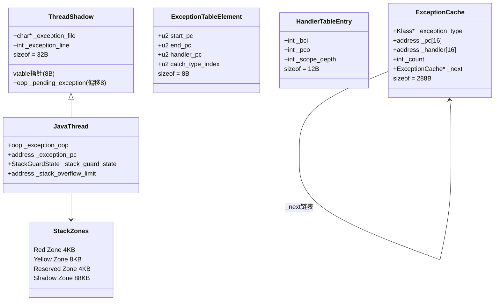

# 44 · JVM 异常处理 — 从零推导，一步一步

> 基于 OpenJDK 11 源码，`-Xms8g -Xmx8g -XX:+UseG1GC -Xint`

---

## 写在前面：我要怎么讲这篇文章

我不会上来就给你看源码。

我会先问你一个问题，让你自己想一想答案，然后告诉你 JVM 的真实答案。你会发现：JVM 的答案和你想的差不多——只是多了一些你没想到的细节。

这些"没想到的细节"，才是真正值得学的东西。

---

## 第一件事：`throw e` 之后，JVM 要做什么？

先不管 JVM，想象你是一个快递员。

你手里有一个包裹（异常对象），你需要找到能签收这个包裹的人（catch 块）。

你的策略是：
1. 先问当前这栋楼（当前方法）有没有人能签收
2. 有 → 送过去，完事
3. 没有 → 去上一栋楼（调用者方法）问

就这么简单。JVM 做的事情，和这个快递员一模一样。

**现在问题来了：JVM 怎么知道"当前方法有没有 catch 块"？**

---

## 第二件事：异常表 — JVM 的"签收名单"

Java 编译器在编译时，会给每个方法生成一张表，记录"哪些异常可以在哪里被接收"。

你用 `javap -verbose` 就能看到：

```
Exception table:
   from    to  target type
       2     5       8   Class java/lang/RuntimeException
```

翻译成人话：**"如果在字节码位置 2 到 5 之间抛出了 RuntimeException，就跳到位置 8 处理。"**

这张表就是 JVM 的"签收名单"。

**JVM 查这张表的方式极其简单：从头到尾扫一遍，找第一个匹配的。**

```
当前位置 = 3，抛出 RuntimeException

扫描：
  第 1 条：位置 3 在 [2,5) 内？✅  RuntimeException 匹配？✅  → 找到了，跳到位置 8
```

就这样。没有什么复杂的算法，就是线性扫描。

---

## 第三件事：`athrow` 字节码 — 只是一个"信号枪"

`throw new RuntimeException("oops")` 编译后是三条字节码：

```
new           → 在堆上创建 RuntimeException 对象
invokespecial → 调用构造函数，填充 message 等字段
athrow        → 触发异常处理
```

`athrow` 的实现只有两行：

```cpp
void TemplateTable::athrow() {
  __ null_check(rax);   // 异常对象不能是 null
  __ jump(throw_exception_entry);  // 跳到统一处理入口
}
```

**为什么这么短？**

想象一下：你的 Java 程序里有 1000 个 `throw` 语句。如果每个 `throw` 都把"查异常表、找 handler、跳转"的逻辑内联进去，代码会膨胀 1000 倍。

更好的做法：所有 `throw` 都跳到同一个地方（`throw_exception_entry`），在那里统一处理。

**`athrow` 只是一把信号枪——"砰"的一声，告诉 JVM"我要抛异常了"，然后所有事情交给 `throw_exception_entry` 处理。**

---

## 第四件事：`throw_exception_entry` — 真正干活的地方

它做三件事，按顺序：

**① 清空操作数栈**

为什么要清空？

想象你在计算 `a + b`，算到一半突然抛异常了。操作数栈上还有 `a` 的值。但 `catch` 块期望栈上只有一个东西：异常对象本身。所以必须先清空，再把异常对象压进去。

**② 查异常表**

就是上面说的线性扫描。找到 handler 的字节码位置（bci）。

**③ 跳过去**

找到 handler 后，直接 `jmp` 过去。

用伪代码表示：

```
throw_exception_entry:
  清空操作数栈
  handler_bci = 查异常表(当前方法, 当前位置, 异常类型)
  if 找到了:
    跳到 handler_bci
  else:
    去"弹出当前帧"的入口
```

---

## 第五件事：没找到 handler — 帧展开

当前方法没有 `catch` 块，需要把异常"往上传"。

**为什么不能直接跳到调用者的 handler？**

因为当前方法可能有"收尾工作"：
- 如果是 `synchronized` 方法，必须先释放锁，否则锁永远不会被释放
- 调试器需要收到"方法退出"的通知

所以必须**正常地退出当前方法**，然后在调用者的上下文里重新查异常表。

这个过程叫**帧展开（frame unwinding）**。

```
当前方法没有 catch 块
    ↓
正常退出当前方法（释放锁、通知调试器）
    ↓
回到调用者
    ↓
在调用者的上下文里重新查异常表
    ↓
找到了 → 跳到 catch 块
没找到 → 继续往上传
```

---

## 现在你有了完整的地图

```
throw new XxxException()
    ↓
athrow（信号枪：null 检查 + 跳转）
    ↓
throw_exception_entry（真正干活）
    ↓
① 清空操作数栈
② 查异常表（线性扫描）
    ├── 找到 → 跳到 catch 块 ✅
    └── 没找到 → 帧展开
                  ↓
              正常退出当前方法（释放锁）
                  ↓
              在调用者里重新查
```

**这就是 JVM 异常处理的核心。** 后面的内容都是在这个基础上加细节。

---

---

## 插曲：一个让我困惑了很久的问题

查异常表时，需要知道 `catch (RuntimeException e)` 里的 `RuntimeException` 是哪个类。

这个类可能**还没被加载**！

```
pool->klass_at(klass_index, ...)  // 这一步可能触发类加载
```

类加载可能失败（比如 classpath 里找不到这个类），失败时会产生一个新的异常（`ClassNotFoundException`）。

这时候：
- 原来的异常（比如 `RuntimeException`）还在
- 新的异常（`ClassNotFoundException`）也来了

**JVM 的选择：用新异常替换旧异常，然后从刚才那个位置重新查一遍。**

这就是为什么查异常表的代码里有一个 `do-while` 循环——处理"查表过程中产生新异常"的情况。

```
do {
  handler_bci = 查异常表(...)
  if (查表过程中产生了新异常) {
    用新异常替换旧异常
    从 handler_bci 位置重新查
    should_repeat = true
  }
} while (should_repeat)
```

**这个 `do-while` 不是为了性能，是为了正确性。** 极少触发，但必须有。

---

---

## 第二部分：JVM 为什么不用 C++ 异常？

### 先问你一个问题

JVM 是 C++ 写的。C++ 有 `throw`/`catch`。

最自然的做法不就是：Java 代码抛异常时，JVM 内部直接 `throw` 一个 C++ 异常？

**为什么不这样做？**

想一想，再往下看。

---

### 答案：和 GC 冲突

C++ 异常的栈展开过程中，JVM 可能需要触发 GC。

GC 会**移动堆上的对象**。移动之后，所有指向这些对象的指针都失效了。

但 C++ 异常机制完全不知道 JVM 的 GC——它不会更新那些失效的指针。

结果：GC 之后，C++ 异常对象里保存的 Java 异常对象指针已经是野指针了。程序崩溃。

**这是根本原因。** 还有两个次要原因：
- C++ 异常的性能在不同编译器下差异巨大，JVM 需要精确控制开销
- GCC/MSVC/Clang 的异常实现各不相同，JVM 要跨平台

---

### JVM 的方案：每个线程挂一个"待处理异常"变量

方案极其朴素：

```
每个线程有一个变量：_pending_exception

抛异常时：thread->_pending_exception = 异常对象
每个函数返回后：if (_pending_exception != null) 立即返回
最终到达解释器：检测到 _pending_exception → 跳到 throw_exception_entry
```

就这样。不用 C++ 异常，用手动检查。

这个变量放在 `ThreadShadow` 类里：

```cpp
class ThreadShadow {
  oop  _pending_exception;   // 当前挂起的异常对象
  // ...
};
```

---

### 最反直觉的细节：为什么 ThreadShadow 有一个空虚函数？

```cpp
class ThreadShadow {
  oop  _pending_exception;
  const char* _exception_file;
  int  _exception_line;
  virtual void unused_initial_virtual() { }  // ← 这是什么？！
};
```

**一个什么都不做的空虚函数，为什么存在？**

原因是：汇编代码需要用**硬编码偏移**访问 `_pending_exception`：

```asm
mov rax, [r15 + 8]   ; r15 = 当前线程，偏移 8 = _pending_exception
```

这里的 `8` 是写死的。如果 `_pending_exception` 的偏移变了，汇编代码就读错位置了。

**偏移为什么会变？**

C++ 类如果有虚函数，内存布局的第一个位置是 vtable 指针（8 字节）。`Thread` 类有虚函数，所以有 vtable 指针。

如果 `ThreadShadow` 没有虚函数，某些编译器会把 `ThreadShadow` 的字段放到 `Thread` 的 vtable 指针**之后**，导致 `_pending_exception` 的偏移不固定。

**解法：给 `ThreadShadow` 加一个空虚函数，强制它也有 vtable 指针。**

这样内存布局就固定了：

```
ThreadShadow 内存布局：
┌──────────────────────────────┐
│ vtable 指针 (8B)             │ ← 偏移 0
├──────────────────────────────┤
│ _pending_exception (8B)      │ ← 偏移 8（永远是 8！）
├──────────────────────────────┤
│ _exception_file (8B)         │ ← 偏移 16
├──────────────────────────────┤
│ _exception_line (4B)         │ ← 偏移 24
│ padding (4B)                 │ ← 偏移 28
└──────────────────────────────┘
总大小：32 字节
```

JVM 甚至有运行时检查来验证这一点：

```cpp
void check_ThreadShadow() {
  if (offset_of(_pending_exception) != Thread::pending_exception_offset())
    fatal("偏移不对！");
}
```

**一个空虚函数，存在的唯一理由是固定内存布局，让汇编代码可以硬编码偏移。** 这种设计在 JVM 里随处可见。

---

---

## 第三部分：栈溢出 — 四层保护区

### 先问你一个问题

栈溢出怎么检测？

最朴素的方案：每次方法调用前检查一下 `if (sp < stack_end) throw StackOverflowError`。

**这个方案有什么问题？**

想一想，再往下看。

---

### 问题：正常路径有额外开销

每次方法调用都要执行这个检查，哪怕 99.99% 的情况下栈根本不会溢出。

**更好的方案：用硬件保护代替软件检查。**

在栈底部放一个不可访问的"保护页"（`mprotect(PROT_NONE)`）。栈增长到那里时，CPU 自动报 SIGSEGV，JVM 信号处理器接住，抛 StackOverflowError。

**正常路径零开销！** 只有真的溢出时才有代价。

---

### 但是：抛 StackOverflowError 本身需要栈空间

这是一个鸡生蛋的问题。

栈已经用完了，但抛 StackOverflowError 需要：
- 创建异常对象（需要调用 Java 方法）
- 填充堆栈跟踪（需要遍历栈帧）
- 展开栈帧（需要执行代码）

这些都需要栈空间。但栈已经用完了！

**解法：Yellow Zone**

不是只放一个保护页，而是放两层：

```
栈底部
  │  Red Zone（4KB）← 最后防线，触及 = JVM 直接崩溃
  │  Yellow Zone（8KB）← 第一道防线
  │  正常栈空间
栈顶部
```

当栈增长到 Yellow Zone 时触发 SIGSEGV。JVM 做的第一件事：**把 Yellow Zone 改回可读写**。

这样 Yellow Zone 就变成了可用的栈空间，异常处理代码可以用这 8KB 完成工作（创建异常对象、填充堆栈跟踪等）。

如果异常处理代码又递归过深，踩到 Red Zone，那就真的没救了，JVM 直接 fatal。

---

### 但是：大栈帧可能直接跳过 Yellow Zone

如果一个方法的栈帧是 10KB，Yellow Zone 只有 8KB，栈指针可能**一步跳过整个 Yellow Zone**，直接踩到 Red Zone 下面。

Yellow Zone 的 SIGSEGV 根本不会触发！

**解法：stack banging（栈探测）**

每个方法入口处，逐页向下"touch"内存：

```asm
mov [rsp - 4096*1], 0    ; touch 第 1 页
mov [rsp - 4096*2], 0    ; touch 第 2 页
mov [rsp - 4096*3], 0    ; touch 第 3 页
...                       ; 某次 touch 碰到 Yellow Zone → SIGSEGV → 正常处理
```

这样无论栈帧多大，都不可能"跳过" Yellow Zone——因为方法入口处已经逐页探测过了。

探测的范围叫 **Shadow Zone（88KB）**，这是 stack banging 的探测深度。

---

### 但是：`ReentrantLock.lock()` 这类方法怎么办？

`ReentrantLock.lock()` 内部用 CAS + 链表操作。

如果在 CAS 成功但链表还没更新完时栈溢出，锁的内部数据结构就损坏了——其他线程永远获取不到这个锁。

**解法：Reserved Zone（JDK 9 新增）**

```
栈底部
  │  Red Zone（4KB）← 最后防线
  │  Yellow Zone（8KB）← 正常栈溢出检测
  │  Reserved Zone（4KB）← 关键代码专用
  │  Shadow Zone（88KB，逻辑区域，无硬件保护）
  │  正常栈空间
栈顶部
```

正常栈溢出只 disable Yellow Zone，不动 Reserved Zone。

当 JVM 检测到当前正在执行 `@ReservedStackAccess` 注解的方法时，额外 disable Reserved Zone，让关键代码有足够空间完成。

---

### 四层保护区总结

| Zone | 大小 | 作用 | 触发后做什么 |
|------|------|------|------------|
| **Red Zone** | 4KB | 最后防线 | JVM fatal，不可恢复 |
| **Yellow Zone** | 8KB | 正常栈溢出检测 | disable 自身，用这 8KB 处理异常 |
| **Reserved Zone** | 4KB | `@ReservedStackAccess` 方法专用 | 关键代码完成后 re-enable |
| **Shadow Zone** | 88KB | stack banging 探测范围 | 逻辑区域，无硬件保护 |

**实测栈布局（GDB 验证）：**

```
stack_end             = 0x7ffff770c000
  Red Zone (4KB)
red_zone_base         = 0x7ffff770d000
  Yellow Zone (8KB)
yellow_zone_base      = 0x7ffff770f000
  Reserved Zone (4KB)
reserved_zone_base    = 0x7ffff7710000
  ↑ _stack_overflow_limit = stack_end + 88KB = 0x7ffff7722000
  Shadow Zone (88KB，逻辑区域)
  正常栈空间
stack_base            = 0x7ffff780c000
```

---

### 插曲：StackOverflowError 为什么不调构造函数？

```cpp
// 创建 StackOverflowError 的代码
oop exception_oop = InstanceKlass::cast(k)->allocate_instance(CHECK);  // 直接分配，不调 <init>
java_lang_Throwable::fill_in_stack_trace(exception);  // 直接填充堆栈跟踪
```

**为什么不调构造函数？**

构造函数是 Java 方法，调用 Java 方法需要压一个新的栈帧。

但此时栈空间只剩 Yellow Zone 的 8KB，可能不够再压一个 Java 方法的栈帧。

所以 JVM 走捷径：直接 `allocate_instance()` 分配对象（零初始化），然后直接 `fill_in_stack_trace()`，绕过 Java 构造函数。

---

---

## 第四部分：隐式 null 检查 — 一个 SIGSEGV 怎么变成 NPE

### 先问你一个问题

JIT 编译后，`obj.field` 的 null 检查在哪里？

你可能以为是这样：

```asm
test rdi, rdi          ; 检查 obj 是否为 null
jz throw_npe           ; 是 null → 抛 NPE
movl eax, [rdi + 12]   ; 不是 null → 读字段
```

**实际上 C2 编译后根本没有 null 检查指令：**

```asm
movl eax, [rdi + 12]   ; 直接读，没有 null 检查
```

**为什么可以这样？**

---

### 答案：利用操作系统的 zero page 保护

操作系统保证虚拟地址 0 所在的页（地址 `[0, 4096)`）不可访问。

如果 `obj == null`（rdi = 0），那么 `[rdi + 12]` = 访问地址 `0x0C`，落在 zero page 内，CPU 报 page fault → 内核发 SIGSEGV → JVM 信号处理器接住 → 创建 NPE 对象 → 正常异常分派。

**正常路径零额外指令。** 代价是：如果真的是 null，要走一趟 OS 信号处理（几千个 cycle），但 null 访问是异常路径，极少发生。

**完整链路：**

```
C2 编译代码：movl eax, [rdi + 12]（rdi=null）
    ↓
CPU：Page Fault（地址 0x0C 在 zero page）
    ↓
Linux 内核：发送 SIGSEGV
    ↓
JVM 信号处理器：判断是隐式 null 检查（地址 < 4096）
    ↓
修改 CPU 的 PC 寄存器，指向 throw_NPE_entry
    ↓
sigreturn：CPU 从 throw_NPE_entry 继续执行
    ↓
创建 NPE 对象 → 正常异常分派
```

**整个过程对 Java 代码透明——它只知道拿到了一个 NullPointerException。**

---

### 什么时候必须显式检查？

```cpp
bool needs_explicit_null_check(intptr_t offset) {
  return offset < 0 || os::vm_page_size() <= offset;
}
```

- `offset ∈ [0, 4096)` → 不需要显式检查（隐式即可）
- `offset >= 4096` → **必须**显式检查

**什么时候 offset >= 4096？**

一个有几百个 int 字段的超大类，后面的字段 offset 可能超过 4096。或者数组的大索引访问：`array[1000]` 的 offset 可以远大于 4096。

这些情况下 `null + offset` 可能越过 zero page，落到合法的映射区域，不会触发 SIGSEGV，所以必须用显式检查。

---

---

## 第五部分：编译代码的异常处理 — 内联让一切变复杂

### 先问你一个问题

解释器模式下，每个方法有自己的栈帧，查异常表很简单。

JIT 编译后，C2 会把 A→B→C 三个方法**内联**进一个 nmethod（一段机器码）。

**问题：如果 C 的代码抛异常，JVM 怎么查异常表？**

---

### 答案：scope_depth — 内联深度

C2 编译后，A、B、C 三个方法的代码都在同一个 nmethod 里。但 C2 保留了"这段代码属于哪个方法"的信息，叫 **scope（作用域）**。

查异常表时，从最内层 scope（C）开始，逐层向外扩展：

```
C 的异常表里找 → 没找到
    ↓
B 的异常表里找 → 没找到
    ↓
A 的异常表里找 → 找到了！
```

这就是为什么编译代码的异常表（`HandlerTableEntry`）比解释器的（`ExceptionTableElement`）多一个字段 `_scope_depth`：

```cpp
class HandlerTableEntry {
  int _bci;          // handler 的字节码位置
  int _pco;          // handler 的机器码位置（编译后用这个）
  int _scope_depth;  // 内联深度：0 = 最内层方法（C），1 = B，2 = A
};
```

**解释器不需要 `_scope_depth`，因为每个方法有自己的栈帧，不存在"内联"的问题。**

---

### ExceptionCache — 缓存查找结果

编译代码的异常表查找比解释器重（需要遍历 scope 链）。

同一个位置反复抛的通常是同一类型异常，可以缓存结果：

```
第一次：PC=0x1234，抛 RuntimeException → 查表 → handler=0x5678
缓存：(PC=0x1234, RuntimeException) → handler=0x5678

第二次：PC=0x1234，抛 RuntimeException → 命中缓存 → 直接返回 0x5678
```

这个缓存叫 `ExceptionCache`，每个 nmethod 有一个，最多缓存 16 个 PC 位置。

---

---

## 总结：JVM 异常处理的四层协作

```
Java 代码层：throw new XxxException()
    ↓
解释器层：athrow → throw_exception_entry → 查异常表 → 帧展开
    ↓
编译代码层：隐式 null 检查（SIGSEGV）+ scope 遍历 + ExceptionCache
    ↓
OS 层：SIGSEGV 信号处理 + 四层栈保护区
```

**最让我印象深刻的三个设计：**

**1. `unused_initial_virtual()`**

一个什么都不做的空虚函数，存在的唯一理由是固定 `_pending_exception` 的内存偏移，让汇编代码可以硬编码 `[r15 + 8]`。

这告诉我：JVM 的很多"奇怪"设计，背后都是"汇编代码需要硬编码偏移"这个约束。

**2. 隐式 null 检查**

利用 OS zero page 保护，正常路径零额外指令。把"异常路径的开销"转移到 OS 信号处理，让正常路径极致快。

这告诉我：JVM 的优化思路是"正常路径必须极致快，异常路径可以慢"。

**3. StackOverflowError 不调构造函数**

在没有栈空间的情况下创建异常对象，只能绕过 Java 构造函数，直接分配内存 + 填充堆栈跟踪。

这告诉我：JVM 在极端情况下会"降级处理"——绕过正常的 Java 语义，直接操作内存。

---

## 数据结构速查

| 结构 | 大小 | 用途 | 在哪里 |
|------|------|------|--------|
| `ExceptionTableElement` | 8B | 解释器异常表条目 | ConstMethod 末尾 |
| `HandlerTableEntry` | 12B | 编译代码异常表条目 | nmethod 内 |
| `ExceptionCache` | 288B | 编译代码异常查找缓存 | nmethod 关联 |
| `ThreadShadow` | 32B | 存放 `_pending_exception` | Thread 基类 |



---

## 还没搞懂的地方（留给下次）

1. `rethrow_exception_entry` 和 `throw_exception_entry` 的区别是什么？
2. `@ReservedStackAccess` 的完整实现：JVM 怎么检测到当前在执行这个注解的方法？
3. C1 和 C2 的异常处理路径有什么不同？
4. `fill_in_stack_trace` 的开销有多大？关掉 `-XX:-StackTraceInThrowable` 能快多少？

---

## 继续深入

上面有三个知识点我故意跳过了（怕打断节奏）：

- **TRAPS/CHECK/THROW 宏体系** — JVM 内部 C++ 代码怎么"抛异常"？
- **ImplicitExceptionTable** — SIGSEGV 发生后，JVM 怎么知道跳到哪里？
- **`forward_exception_entry`** — VM 函数返回后，`_pending_exception` 怎么"回到"解释器？

这三个故事在这里：**[44b-exception-handling-advanced-HandWritten.md](./44b-exception-handling-advanced-HandWritten.md)**

---

## 深入阅读（源码级）

如果你想看完整的源码分析（所有字段、sizeof、GDB 验证）：

- **[完整源码分析](../ExceptionHandling/1-Exception-Handling-Deep-Dive.md)** — 所有数据结构的完整字段分析、算法流程的真实源码+逐行注释
- **[GDB 验证](../ExceptionHandling/2-Exception-Handling-GDB-Verification.md)** — 用 GDB 实际验证 ThreadShadow 偏移、栈保护区布局、异常表内容

---

*写于 2026-03-06*