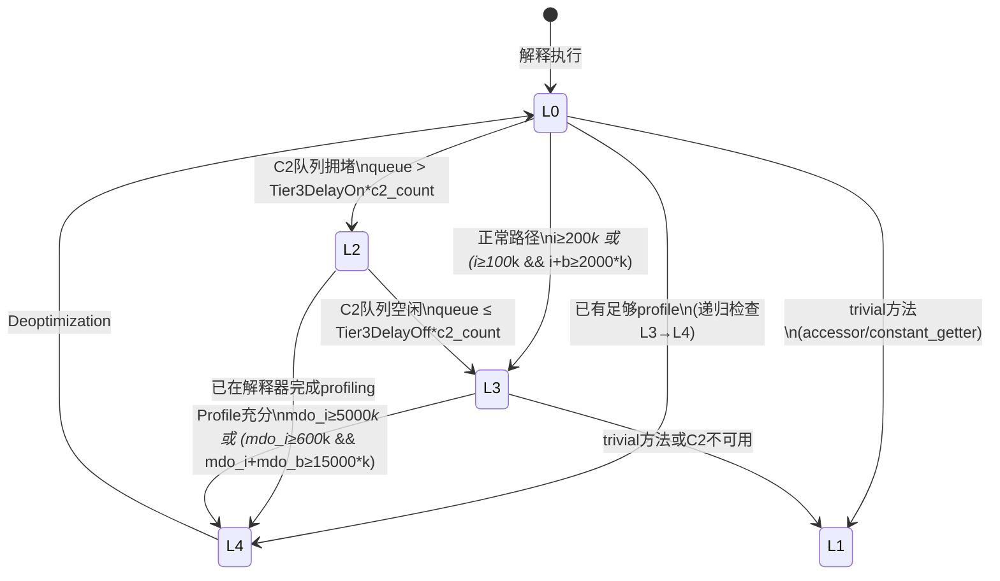
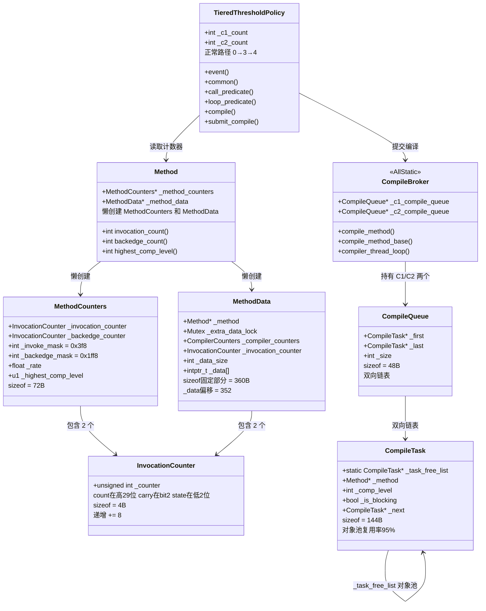

# 18 · 编译触发 — 热点探测 / 方法计数器 / CompileBroker / MethodData

> 基于 OpenJDK 11 源码，`-Xms8g -Xmx8g -XX:+UseG1GC -Xint`  
> 风格：第一人称 · 学习时间线 · 真实踩坑  
> 参考文档：`../Compiler/1-Compilation-Trigger-Hot-Method-Detection.md`  
>           `../Compiler/2-CompileBroker-Compilation-Dispatch.md`  
>           `../MethodData/MethodData.md`  
> 插桩数据：`../Instrumentation/05-JIT-Probe-Results.md`

---

## 第零天：我以为 JIT 就是"把热点方法编译成机器码"

我以为 JIT 的工作原理很简单：

1. 每次方法调用，计数器 +1
2. 计数器超过阈值（比如 10000）
3. JVM 把这个方法编译成机器码
4. 下次调用直接走机器码

感觉就是个计数器 + 阈值判断，能有多复杂？

然后我去看 `InvocationCounter` 的定义：

```cpp
// src/hotspot/share/interpreter/invocationCounter.hpp
class InvocationCounter {
  unsigned int _counter;   // 格式: [count|carry|state]
                           //        [31..3| 2  | 1..0]
};
```

等等，一个 `unsigned int` 里面塞了三个东西？count 在高 29 位，carry 在 bit 2，state 在低 2 位？

然后我去看计数器递增的代码，发现每次递增不是 `+1` 而是 `+8`（`count_increment = 1 << 3 = 8`）……

然后我去看触发条件，发现不是 `counter >= threshold`，而是 `counter & mask == 0`……

然后我去看分层编译，发现不是一个阈值，而是 5 个执行级别、12 个阈值参数、一个动态缩放系数 k……

然后我去看 CompileBroker，发现编译不是同步的，而是异步的，有 C1/C2 两个独立队列，有优先级调度，有对象池……

然后我去看 MethodData，发现 JIT 编译器不只看计数器，还有一个 360 字节的"方法画像"，记录每个分支的走向、每个虚调用的实际类型……

好，我承认，JIT 编译触发一点都不简单。

---

## 第一天：最大的坑 — 计数器不是"计数器"

### 我以为计数器就是一个整数

最朴素的想法：`int invocation_count = 0; invocation_count++;`

然后我看到了 `InvocationCounter` 的位布局：

```
bit 31 ─────────── bit 3 │ bit 2 │ bit 1..0
┌──────────────────────────┬───────┬──────────┐
│      count (29 bits)     │ carry │  state   │
└──────────────────────────┴───────┴──────────┘
```

**为什么要把三个东西塞进一个 int？**

因为解释器的热路径上，每次方法调用都要递增计数器。如果用两个独立的字段（count + state），就需要两次内存访问。把它们塞进一个 int，一次原子操作搞定。

**为什么递增是 `+8` 而不是 `+1`？**

因为低 3 位（carry + state）不是计数位，count 从 bit 3 开始。所以递增 count 需要 `+= 1 << 3 = +8`。读取 count 时右移 3 位：`count = _counter >> 3`。

**为什么触发条件是 `counter & mask == 0` 而不是 `counter >= threshold`？**

这是热路径性能优化的极致。`AND + JZ` 比 `CMP + JGE` 快，而且 mask 是 `(2^N - 1) << 3` 的形式，每 `2^N` 次递增才触发一次，大幅减少进入 Runtime 的频率。

**mask 是怎么算出来的？**

```cpp
// MethodCounters 构造函数
_invoke_mask = right_n_bits(Tier0InvokeNotifyFreqLog) << InvocationCounter::count_shift;
// = right_n_bits(7) << 3
// = 0x7f << 3
// = 0x3f8
```

`Tier0InvokeNotifyFreqLog = 7`，所以每 `2^7 = 128` 次调用通知一次 Runtime。

**最反直觉的地方：通知频率和编译阈值是两个独立的参数！**

- `Tier0InvokeNotifyFreqLog = 7` → 每 128 次调用**通知一次** Runtime
- `Tier3InvocationThreshold = 200` → 通知时检查是否**超过** 200

所以 L0→L3 的实际触发在 **256 次**（第 2 次通知时），而不是精确的 200 次。这种设计牺牲了精度换取了性能。

### carry 位是干什么的？

carry 是一个"粘性标记位"——一旦设置就不会清除。它表示"这个计数器曾经达到过很大的值"。

**为什么需要这个？** 防止重复触发。当计数器溢出（达到 29 位最大值）时，设置 carry 位，之后即使计数器回绕，也不会再次触发编译请求。

---

## 第一天半：数据结构补课

我第二天去看分层编译的状态转换时，发现自己对几个数据结构完全没概念，回来补课。

### InvocationCounter（4 字节）

```cpp
// src/hotspot/share/interpreter/invocationCounter.hpp
class InvocationCounter {
  unsigned int _counter;  // [count:29 | carry:1 | state:2]
};
```

- **sizeof**: **4 字节**（GDB 验证 ✅）
- **count_increment**: `1 << 3 = 8`（每次递增加 8，跳过低 3 位）
- **count_shift**: `3`（右移 3 位得到真实计数）
- **创建位置**: `MethodCounters` 构造函数中作为成员变量内联创建
- **关键字段生命周期**:
  - 初始值：`0`（`MethodCounters` 构造时 `init()` 设置）
  - 解释器每次方法调用：`_counter += 8`
  - 触发通知：`_counter & mask == 0`
  - 逆优化后：`reset_counters()` 重置为 0
  - carry 位：`handle_counter_overflow()` 中设置，一旦设置不清除

### MethodCounters（72 字节）

```cpp
// src/hotspot/share/oops/methodCounters.hpp
class MethodCounters : public Metadata {
  int               _interpreter_invocation_count; // 解释器调用计数（分层编译中复用为 prev_event_count）
  u2                _interpreter_throwout_count;   // 方法异常退出计数
  InvocationCounter _invocation_counter;           // 方法调用计数器（4B）
  InvocationCounter _backedge_counter;             // 回边计数器（4B）
  int               _nmethod_age;                  // nmethod 热度（CodeCache sweeper 用）
  int               _interpreter_invocation_limit; // 编译阈值（非分层）
  int               _interpreter_backward_branch_limit; // OSR 阈值（非分层）
  int               _interpreter_profile_limit;    // profiling 阈值（非分层）
  int               _invoke_mask;                  // 调用通知频率掩码（分层）
  int               _backedge_mask;                // 回边通知频率掩码（分层）
  float             _rate;                         // 事件速率（events/ms）
  jlong             _prev_time;                    // 上次速率采样时间
  u1                _highest_comp_level;           // 该方法曾达到的最高编译级别
  u1                _highest_osr_comp_level;       // 同上，OSR 版本
};
```

- **sizeof**: **72 字节**（GDB 验证 ✅）
- **创建位置**: `Method::build_interpreter_method_data()` 中懒创建（首次需要计数时才创建）
- **关键字段生命周期**:
  - `_invoke_mask`：构造时计算 `right_n_bits(7) << 3 = 0x3f8`；不变
  - `_backedge_mask`：构造时计算 `right_n_bits(10) << 3 = 0x1ff8`；不变
  - `_rate`：每次通知时更新（`events / elapsed_ms`）；用于判断方法是否"正在变热"
  - `_highest_comp_level`：编译完成后更新；`select_task()` 中用于优先级排序

**实测 mask 值**（GDB 验证 ✅）：
```
invoke_mask   = 0x3f8   → 右移3位 = 0x7f = 127 = 2^7 - 1 → 每 128 次通知
backedge_mask = 0x1ff8  → 右移3位 = 0x3ff = 1023 = 2^10 - 1 → 每 1024 次通知
```

### CompileQueue（48 字节）

```cpp
// src/hotspot/share/compiler/compileBroker.hpp:80
class CompileQueue : public CHeapObj<mtCompiler> {
  const char* _name;         // 队列名称（"C1 compile queue" / "C2 compile queue"）
  CompileTask* _first;       // 链表头（最早入队的任务）
  CompileTask* _last;        // 链表尾（最新入队的任务）
  CompileTask* _first_stale; // 过期任务链表（方法已卸载的任务）
  int _size;                 // 队列大小（当前任务数）
};
```

- **sizeof**: **48 字节**（GDB 验证 ✅）
- **创建位置**: `init_compiler_sweeper_threads()` 中 `new CompileQueue("C1 compile queue")` 和 `new CompileQueue("C2 compile queue")`
- **关键字段生命周期**:
  - `_size`：`add()` 时 `++_size`；`remove()` 时 `--_size`；`TieredThresholdPolicy` 读取计算动态缩放系数 k
  - `_first_stale`：方法已卸载的任务移入此链表；下次 `get()` 时 `purge_stale_tasks()` 清理

### CompileTask（144 字节）

```cpp
// src/hotspot/share/compiler/compileTask.hpp:39
class CompileTask : public CHeapObj<mtCompiler> {
  static CompileTask* _task_free_list;  // 全局 freelist 头指针（对象池）
  Monitor*     _lock;                   // 阻塞编译时用于等待的锁
  uint         _compile_id;             // 全局唯一编译 ID（原子递增）
  Method*      _method;                 // 要编译的方法
  jobject      _method_holder;          // 方法持有者的弱引用（防 GC 回收类）
  int          _osr_bci;                // OSR 编译的 BCI（-1 表示标准编译）
  bool         _is_complete;            // 编译是否完成（编译线程设置）
  bool         _is_success;             // 编译是否成功
  bool         _is_blocking;            // 是否阻塞等待（-Xbatch 时为 true）
  int          _comp_level;             // 目标编译级别（1-4）
  CompileTask* _next, *_prev;           // 双向链表指针（CompileQueue 中）
  jlong        _time_queued;            // 入队时间戳（性能统计）
  CompileReason _compile_reason;        // 编译原因（Reason_Tiered 最常见）
};
```

- **sizeof**: **144 字节**（GDB 验证 ✅）
- **创建位置**: `CompileBroker::create_compile_task()` 中，优先从 `_task_free_list` 复用，否则 `new CompileTask()`
- **对象池复用率**: 实测 725 次分配中只有 36 次 new，**复用率 95%**（GDB 验证 ✅）
- **关键字段生命周期**:
  - `_comp_level`：`TieredThresholdPolicy::submit_compile()` 中由编译策略决定；编译线程读取以选择 C1/C2
  - `_is_complete`：编译线程完成后设置为 true；阻塞调用者通过 `_lock->wait()` 等待此标志
  - `_is_blocking`：`BackgroundCompilation=false` 或 `-Xbatch` 时为 true；`select_task()` 中阻塞任务优先处理

### MethodData（360 字节 + 变长数据区）

这是最让我震惊的数据结构。我以为 JIT 只看计数器，结果还有一个"方法画像"。

```cpp
// src/hotspot/share/oops/methodData.hpp:1956
class MethodData : public Metadata {
  Method* _method;                     // 关联的 Method 对象
  int _size;                           // MDO 总大小（字节）
  int _hint_di;                        // BCI 查找缓存（上次查找的 data index）
  Mutex _extra_data_lock;              // extra_data 区的互斥锁（152B！）
  CompilerCounters _compiler_counters; // 编译器计数器（trap 历史等，80B）
  intx _eflags, _arg_local, _arg_stack, _arg_returned;  // 逃逸分析标志
  InvocationCounter _invocation_counter;  // 调用计数器（4B）
  InvocationCounter _backedge_counter;    // 回边计数器（4B）
  int _invoke_mask, _backedge_mask;       // 通知频率掩码
  short _num_loops, _num_blocks;          // 循环数、基本块数（C1 编译时设置）
  WouldProfile _would_profile;            // 是否值得 profiling
  int _data_size;                         // 主数据区大小（字节）
  int _parameters_type_data_di;           // 参数类型数据的 data index（-2=无参数）
  intptr_t _data[1];                      // 主数据区起始（柔性数组）
};
```

- **sizeof（固定部分）**: **360 字节**（GDB 验证 ✅）
- **`_data` 偏移**: **352**（GDB 验证 ✅）
- **`_extra_data_lock` 偏移**: **32**（GDB 验证 ✅）
- **创建位置**: `Method::build_interpreter_method_data()` 中，调用计数达到 `InterpreterProfileLimit` 时懒创建
- **分配位置**: Metaspace（不在堆上！）
- **实测 MDO 大小**: 568 字节（header 352B + 主数据区 136B + extra_data + ArgInfoData）

**MDO 内存布局**：

```
偏移 0x000: vtable ptr (8B)
偏移 0x010: _method (8B)
偏移 0x020: _extra_data_lock (Mutex, 152B!)  ← 这个大得出乎意料
偏移 0x0B8: _compiler_counters (80B)
偏移 0x108: _eflags/_arg_local/_arg_stack/_arg_returned (32B)
偏移 0x128: _invocation_counter + _backedge_counter (8B)
偏移 0x13C: _invoke_mask + _backedge_mask (8B)
偏移 0x148: _num_loops + _num_blocks + _would_profile (8B)
偏移 0x154: _data_size + _parameters_type_data_di (8B)
偏移 0x160: _data[0] ← 主数据区起始
```

**为什么 `_extra_data_lock` 有 152 字节？** 因为 `Mutex` 本身就是 152 字节（包含 pthread_mutex_t + 调试信息）。这是 MDO 固定部分最大的字段。

---

## 第二天：核心流程 — 从计数器溢出到编译任务入队

### 我以为触发编译就是"计数器超阈值然后编译"

实际上从计数器溢出到编译任务入队，要经过 7 层调用：

```
解释器汇编代码：increment_mask_and_jump()
    ↓ counter & mask == 0
InterpreterRuntime::frequency_counter_overflow()
    ↓
frequency_counter_overflow_inner()
    ↓
CompilationPolicy::policy()->event()
    ↓
TieredThresholdPolicy::event()
    ↓ bci == InvocationEntryBci ? method_invocation_event : method_back_branch_event
TieredThresholdPolicy::common()  ← 核心状态转换
    ↓ 确定 next_level
TieredThresholdPolicy::compile()
    ↓
CompileBroker::compile_method()  ← 编译任务入队
```

### increment_mask_and_jump 的汇编实现

```cpp
// src/hotspot/cpu/x86/interp_masm_x86.cpp
void InterpreterMacroAssembler::increment_mask_and_jump(
    Address counter_addr, int increment, Address mask,
    Register scratch, bool preloaded, Condition cond, Label* where)
{
  movl(scratch, counter_addr);    // scratch = *counter
  incrementl(scratch, increment); // scratch += 8
  movl(counter_addr, scratch);    // *counter = scratch
  andl(scratch, mask);            // scratch &= mask
  jcc(cond, *where);              // if (scratch == 0) goto overflow
}
```

**4 条指令完成计数器递增 + 溢出检测。** 这就是为什么用 mask 而不是比较阈值——AND + JZ 比 CMP + JGE 更快，而且每 2^N 次才进入 Runtime 一次。

### 分层编译的 5 个执行级别

| 级别 | 编译器 | 特点 | 执行速度 |
|------|--------|------|----------|
| L0 | 解释器 | 无编译，可收集部分 profile | 最慢 |
| L1 | C1 | 简单优化，无 profiling | 快 |
| L2 | C1 | 带调用/回边计数器 | 快（比 L3 快 ~30%）|
| L3 | C1 | 完整 profiling（类型信息、分支概率）| 较快 |
| L4 | C2 | 深度优化（逃逸分析、标量替换等）| 最快 |

**默认路径：0 → 3 → 4**（解释器 → C1 full profiling → C2 优化）

**为什么不直接 0 → 4？** C2 需要类型信息（虚调用接收者类型、分支概率）才能做激进内联和逃逸分析。L3（C1 full profiling）负责收集这些信息。没有 L3 的 profile，C2 只能保守编译，优化效果大打折扣。

### common() — 状态转换核心

```
case CompLevel_none (L0):
  // 先检查：如果当前 profile 已经足够触发 L4，直接跳到 L4
  if (common(p, method, L3) == L4) → next = L4

  // 否则，检查 call_predicate 是否满足
  elif predicate(i, b) 满足:
    if C2队列 > Tier3DelayOn * c2_count:
      next = L2        // C2 拥堵，先到 L2 快速运行
    else:
      next = L3        // 正常路径，到 L3 做完整 profiling

case CompLevel_full_profile (L3):
  if MDO.would_profile():
    if predicate(mdo_i, mdo_b) 满足:
      next = L4        // Profile 充分，升级到 C2
```

**判定谓词（L0→L3）**：
```
i >= Tier3InvocationThreshold * k
  || (i >= Tier3MinInvocationThreshold * k && i + b >= Tier3CompileThreshold * k)
// 默认：i >= 200*k || (i >= 100*k && i+b >= 2000*k)
```

**动态缩放系数 k**：
```
k = queue_size / (LoadFeedback * compiler_count) + 1
```

**k 的作用**：防止编译队列拥堵。队列越长，k 越大，阈值越高，减少新任务提交速度，实现自适应背压。

---

## 第三天：最反直觉的设计 — MethodData 是 JIT 的"眼睛"

### 我以为 JIT 只看计数器

我以为 JIT 编译器的决策很简单：调用次数超过阈值 → 编译。

然后我看到了 MethodData（MDO）。这是一个为每个方法维护的"运行时画像"，记录了：

- **每个虚调用的实际接收者类型**（VirtualCallData）
- **每个条件分支的走向**（BranchData：taken/not_taken 次数）
- **每个类型检查的实际类型**（ReceiverTypeData）
- **每个 switch 语句的 case 分布**（MultiBranchData）
- **deoptimization 历史**（CompilerCounters 中的 trap 直方图）

**为什么需要这些？** 举个例子：

```java
void process(Animal animal) {
    animal.speak();  // invokevirtual
}
```

如果 MDO 记录了"99% 的调用 `animal` 是 `Dog` 类型"，C2 就可以做**去虚化**：

```asm
; C2 生成的代码（伪汇编）
cmp [animal.klass], Dog.klass  ; 类型守卫
jne uncommon_trap              ; 不是 Dog → 去优化
call Dog.speak()               ; 直接调用，不走 vtable
```

这比走 vtable 快得多。但如果没有 MDO 的类型信息，C2 根本不知道可以这样优化。

### DataLayout — MDO 的最小存储单元

MDO 的主数据区是一个 DataLayout 数组，每个 DataLayout 对应一个"值得 profiling 的字节码"：

```
DataLayout 内存布局（8 字节 header + 变长 cell 数组）：

偏移:  0      1      2    3    4    5    6    7
      ┌──────┬──────┬─────────┬───────────────────┐
      │ tag  │flags │   bci   │      traps         │
      │ (u1) │ (u1) │  (u2)   │      (u4)          │
      └──────┴──────┴─────────┴───────────────────┘
      [cell 0: 8B][cell 1: 8B]...[cell N: 8B]
```

**tag 决定数据含义**：

| tag | 类型 | 大小 | 对应字节码 |
|-----|------|------|-----------|
| 1 | BitData | 8B（0 cell）| checkcast（无类型 profiling）|
| 2 | CounterData | 16B（1 cell）| invokestatic/invokespecial |
| 3 | JumpData | 24B（2 cell）| goto/jsr |
| 4 | ReceiverTypeData | 144B（17 cell）| checkcast（有类型 profiling）|
| 5 | VirtualCallData | 144B（17 cell）| invokevirtual/invokeinterface |
| 7 | BranchData | 32B（3 cell）| ifeq/ifne 等 16 种条件分支 |
| 8 | MultiBranchData | 变长 | tableswitch/lookupswitch |

**VirtualCallData 的 17 个 cell 是什么？**

```
cell[0]: count（总调用次数/溢出次数）
cell[1]: receiver0 (Klass*)    cell[2]: count0
cell[3]: receiver1 (Klass*)    cell[4]: count1
...
cell[15]: receiver7 (Klass*)   cell[16]: count7
```

`TypeProfileWidth = 8`（Server 模式默认值），所以最多记录 8 种不同的接收者类型。超出后 count 递增但不记录具体类型（"多态溢出"）。

### MDO 什么时候创建？

**不是方法第一次被调用时创建，而是调用次数达到 `InterpreterProfileLimit` 时懒创建。**

```
InterpreterProfileLimit = CompileThreshold * InterpreterProfilePercentage / 100
// 非分层模式：10000 * 33 / 100 = 3300
// 分层模式：由 Tier0ProfilingStartPercentage 控制
```

**为什么懒创建？** 大多数方法只被调用几次，不值得 profiling。懒创建避免了为冷方法分配 MDO 的内存开销。

### MDO 的 trap 历史

`CompilerCounters` 中有一个 trap 直方图：

```cpp
u1 _array[_trap_hist_limit];  // 每种 deoptimization reason 一个 u1 计数器（最大 255）
```

当某个 reason 的 trap 次数超过阈值，编译器放弃对应的推测性优化。当 `_nof_decompiles > PerMethodRecompilationCutoff`（默认 400）时，方法被标记为不可编译。

**这就是为什么有些方法"越来越慢"**：频繁 deoptimization → trap 计数增加 → 编译器放弃激进优化 → 生成保守代码 → 性能下降。

---

## 第三天半：CompileBroker — 生产者-消费者调度中心

### 我以为编译是同步的

我以为触发编译后，当前线程会等待编译完成，然后走编译后的代码。

实际上 `BackgroundCompilation` 默认为 `true`，编译是**完全异步**的：

```
Java 应用线程（生产者）：
  frequency_counter_overflow()
    → CompileBroker::compile_method()
      → compile_method_base()
        → create_compile_task()
          → queue->add(task)
            → notify_all()  ← 唤醒编译线程
  → 立即返回，继续在解释器中执行  ← 不等待编译完成！

CompilerThread（消费者）：
  compiler_thread_loop()
    → queue->get()  ← 等待任务
      → select_task()  ← 优先级选择
    → invoke_compiler_on_method(task)  ← 执行编译
    → 安装 nmethod
```

**为什么异步？** 编译耗时 1-100ms，如果同步等待会严重影响应用响应时间。异步编译让应用线程继续在解释器中执行，编译在后台进行，编译完成后下次调用自动走编译后的代码。

### 去重机制

同一个方法可能被多个线程同时触发编译，必须保证只入队一次：

```
提交线程（持有 MethodCompileQueue_lock）：
  1. 无锁检查 queued_for_compilation → false
  2. 加锁
  3. 二次检查 queued_for_compilation → false（双重检查锁）
  4. create_compile_task() → queue->add() → method->set_queued_for_compilation()
  5. 释放锁

编译线程（编译完成后）：
  method->clear_queued_for_compilation()
```

### 优先级调度

`select_task()` 不是简单的 FIFO，而是按热度优先：

```cpp
double weight(Method* method) {
    return (rate + 1) * (invocation_count + 1) * (backedge_count + 1);
}

bool compare_methods(Method* x, Method* y) {
    // 1. 更高 comp_level 的优先（反优化后重编译）
    if (x->highest_comp_level() > y->highest_comp_level()) return true;
    // 2. 同级别比 weight
    return weight(x) > weight(y);
}
```

**反优化重编译优先**：曾经被 C2 编译又回退到解释器的方法（`highest_comp_level` 高）优先重编译，因为这些方法对性能影响最大。

---

## 第四天：分层编译的完整状态转换图

### 正常路径：0 → 3 → 4



### 关键阈值汇总

| 参数 | 默认值 | 含义 |
|------|--------|------|
| Tier0InvokeNotifyFreqLog | 7 | L0 每 128 次调用通知 |
| Tier0BackedgeNotifyFreqLog | 10 | L0 每 1024 次回边通知 |
| Tier3InvocationThreshold | 200 | L0→L3：调用次数阈值 |
| Tier3MinInvocationThreshold | 100 | L0→L3：最小调用次数 |
| Tier3CompileThreshold | 2000 | L0→L3：调用+回边总量阈值 |
| Tier4InvocationThreshold | 5000 | L3→L4：调用次数阈值 |
| Tier4MinInvocationThreshold | 600 | L3→L4：最小调用次数 |
| Tier4CompileThreshold | 15000 | L3→L4：调用+回边总量阈值 |
| Tier3DelayOn | 5 | C2 队列/线程 > 5 → 走 0→2 |
| Tier3DelayOff | 2 | C2 队列/线程 ≤ 2 → 恢复 0→3 |

### Tier3Delay 机制：C2 拥堵时的降级

**问题**：C2 编译耗时长（~50ms），队列积压时，方法在 L3 等待 C2 编译的时间很长。L3 比 L2 慢 30%（因为 L3 要做完整 profiling），这段时间的性能损失不必要。

**解法**：当 C2 队列 > `Tier3DelayOn(5) * c2_count` 时，改走 0→2 路径（L2 比 L3 快 30%）。当 C2 队列 ≤ `Tier3DelayOff(2) * c2_count` 时，恢复 0→3 路径。使用滞后（hysteresis）避免抖动。

---

## 第五天：插桩验证 — 我用数据打脸了自己的猜测

### 猜测 vs 实测对比表

| # | 我的猜测 | 实测结果 | 打脸了吗？ |
|---|---------|---------|----------|
| 1 | L0→L3 在精确 200 次调用时触发 | **256 次**（第 2 次通知，每 128 次通知一次）| ✅ 打脸 |
| 2 | L3→L4 在精确 5000 次调用时触发 | **6505 次**（通知频率 1024 次一次）| ✅ 打脸 |
| 3 | InvocationCounter sizeof = 4（猜对了）| **4 字节** ✅ | 猜对了 |
| 4 | MethodCounters sizeof ≈ 20（两个计数器 + 几个 int）| **72 字节**（还有 rate/prev_time/mask 等）| ✅ 打脸 |
| 5 | MethodData sizeof ≈ 50（几个计数器 + 数据区）| **360 字节**（光 Mutex 就 152 字节！）| ✅ 打脸 |
| 6 | CompileTask sizeof ≈ 40（几个字段）| **144 字节** | ✅ 打脸 |
| 7 | 编译是同步的（触发后等待完成）| **完全异步**（BackgroundCompilation=true）| ✅ 打脸 |
| 8 | CompileTask 每次 new 一个 | **对象池复用率 95%**（725 次分配只有 36 次 new）| ✅ 打脸 |

### 关键 GDB 验证数据

```
# MethodCounters 字段值（hotMethod 首次触发 L3 编译时）
invoke_mask     = 0x3f8    ← 每 128 次通知
backedge_mask   = 0x1ff8   ← 每 1024 次通知
invocation_count = 256     ← 第 2 次通知时触发（256 > 200*k）
highest_comp_level = 0     ← 首次编译

# L3→L4 转换
invocation_count = 6505    ← 第 7 次通知时触发（6505 > 5000*k）
highest_comp = 3           ← 之前已到达 L3

# MethodData 字段偏移
offset _extra_data_lock = 32
offset _compiler_counters = 184
offset _invocation_counter = 296
offset _data = 352
sizeof(MethodData) = 360

# CompileTask 对象池
Total allocate: 725 (from_free=689, new=36)
复用率: 95%

# PrintTieredEvents 输出（关键行）
1.275: [call level=0 [CompileTest.hotMethod(I)I] @-1 queues=11,0 total=256,0]
1.275: [compile level=3 [CompileTest.hotMethod(I)I] @-1]    ← 触发 L3 编译
1.276: [compile level=4 [CompileTest.hotMethod(I)I] @-1]    ← 触发 L4 编译
1277  583   3   CompileTest::hotMethod (6 bytes)              ← L3 编译完成
1277  584   4   CompileTest::hotMethod (6 bytes)              ← L4 编译完成
1277  583   3   CompileTest::hotMethod (6 bytes) made not entrant  ← L3 废弃
```

### 最让我意外的发现

**MethodData 里有一个 152 字节的 Mutex！**

`_extra_data_lock` 是一个 `Mutex` 对象，用于保护 extra_data 区的并发分配。`Mutex` 本身就是 152 字节（包含 pthread_mutex_t + 调试信息）。这导致 MDO 的固定部分就有 360 字节，比我预期的大了 7 倍。

**为什么 extra_data 区需要锁？** 因为 extra_data 区是运行时动态分配的（当没有主数据区条目的 BCI 发生 trap 时），多个线程可能同时触发 trap，需要锁保护。

---

## 尾声：我现在怎么理解编译触发

JIT 编译触发的本质是**四层协作**：

```
计数层（解释器汇编）：
  increment_mask_and_jump → counter & mask == 0 → 进入 Runtime
    ↓ 每 128 次调用 / 1024 次回边通知一次
决策层（TieredThresholdPolicy）：
  common() → 根据计数器值 + 队列长度 + profile 充分性 → 确定 next_level
    ↓ 正常路径：0→3→4
提交层（CompileBroker）：
  compile_method() → compile_method_base() → create_compile_task() → queue->add()
    ↓ 异步，Java 线程立即返回
执行层（CompilerThread）：
  compiler_thread_loop() → select_task() → invoke_compiler_on_method()
    ↓ C1 编译（~2ms）或 C2 编译（~50ms）
```

最让我印象深刻的三个设计：

1. **`counter & mask` 而不是 `counter >= threshold`**：热路径上 4 条指令完成计数器递增 + 溢出检测，每 2^N 次才进入 Runtime 一次。牺牲精度换取性能。

2. **MethodData 是 JIT 的"眼睛"**：没有 MDO 的类型信息，C2 无法做去虚化、分支预测、逃逸分析等激进优化。MDO 是分层编译的数据基础：C1 收集 profile，C2 根据 profile 做激进优化。

3. **CompileTask 对象池复用率 95%**：编译任务频繁创建/销毁，对象池避免了频繁 malloc/free。725 次分配只有 36 次 new，其余全部复用。

---

## 数据结构关系图



---

## 还没搞懂的地方

1. **`_rate` 字段的完整计算逻辑**：`TieredThresholdPolicy::event()` 中每次通知时更新 `_rate = events / elapsed_ms`，但这个速率具体怎么影响编译决策？`call_predicate` 里有没有用到 `_rate`？

2. **`WouldProfile` 枚举的三种状态**：`_would_profile` 有 `no_profile`、`profile_wait`、`profile_inlined` 三种状态，分别在什么时候设置？`profile_inlined` 是什么意思？

3. **`_hint_di` 的缓存效果**：MDO 的 `_hint_di` 记录上次查找的 data index，下次从该位置开始查找。这个缓存在多线程环境下是否有竞争问题？

4. **`Tier0ProfilingStartPercentage` 的作用**：分层模式下，L0 什么时候开始 profiling？这个参数是怎么控制的？

5. **`PerMethodRecompilationCutoff` 触发后的完整流程**：当 `_nof_decompiles > 400` 时，方法被标记为不可编译，之后永远在解释器中执行？还是有其他处理？

6. **`select_task()` 中的 `update_rate()` 逻辑**：每次 `select_task()` 都会更新所有队列中任务的 `_rate`，这个操作的开销有多大？队列很长时会不会成为瓶颈？

---

*写于 2026-03-06*  
*参考：`../Compiler/1-Compilation-Trigger-Hot-Method-Detection.md`*  
*参考：`../Compiler/2-CompileBroker-Compilation-Dispatch.md`*  
*参考：`../MethodData/MethodData.md`*  
*GDB 验证数据：`../Instrumentation/05-JIT-Probe-Results.md`*
