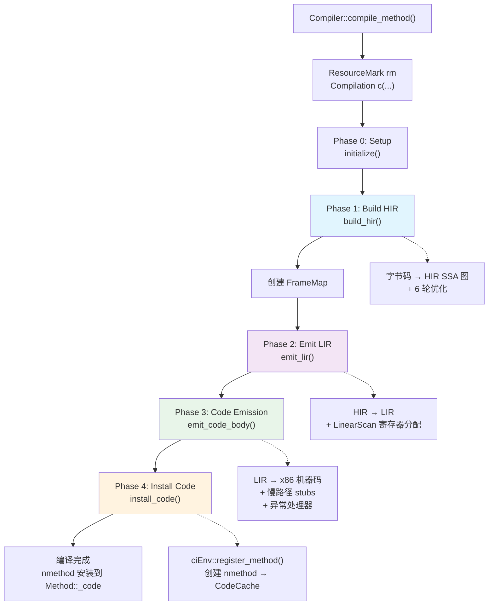
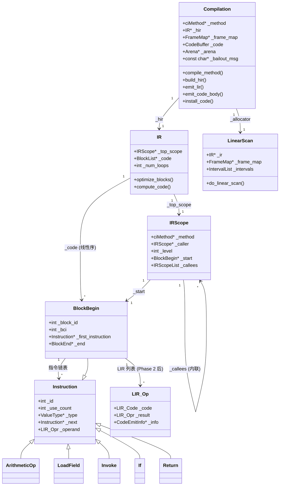

# 19 — C1 编译管线：字节码怎么变成机器码

> 基于 OpenJDK 11 源码分析  
> 标准环境：`-Xms8g -Xmx8g -XX:+UseG1GC`  
> 承接：18-compilation-trigger 遗留问题（CompileBroker 把任务提交给 C1 之后发生了什么？）

---

## 第零天：我以为 JIT 就是"把字节码翻译成机器码"

学 JVM 的时候，我以为 JIT 编译就是一个简单的翻译过程：拿到字节码，逐条翻译成对应的 x86 指令，完事。

就像这样：

```
iadd → addl %eax, %ebx
iload_0 → movl [rbp-8], %eax
ireturn → ret
```

后来看了 C1 的源码，发现完全不是这回事。

**真相是**：C1 编译一个方法要经过 **5 个阶段**，中间有两层中间表示（HIR 和 LIR），还有 6 轮优化。整个过程平均耗时 ~2ms，但生成的代码质量远比"逐条翻译"好得多。

这篇文章就是把这个过程从头到尾讲清楚。

---

## 第一天：5 个阶段，不是 1 个

上一篇（18）分析了 CompileBroker 如何把编译任务分发给 C1。当 CompileBroker 选择 C1 时，调用的是 `Compiler::compile_method()`（`c1_Compiler.cpp:238`）。

从这里开始，C1 的编译管线正式启动：

```
Compiler::compile_method()
  → Compilation c(this, env, method, entry_bci, buffer_blob, directive)  // 栈上对象
    → Compilation::compile_method()                                        // 驱动整个管道
        → initialize()                    // Phase 0: Setup（初始化辅助对象）
        → compile_java_method()           // Phase 1-3
            → build_hir()                 // Phase 1: 字节码 → HIR（SSA 图）
            → emit_lir()                  // Phase 2: HIR → LIR + 寄存器分配
            → emit_code_body()            // Phase 3: LIR → 机器码
        → install_code(frame_size)        // Phase 4: 安装到 CodeCache
```

**最反直觉的设计**：`Compilation` 对象是在**栈上**创建的（继承自 `StackObj`），构造函数内立即执行全部编译流程。这意味着：

- 编译是一个完整的事务：要么成功，要么 bailout
- 构造函数返回时，编译已经完成（或已放弃）
- 析构时，`ResourceMark` 自动释放所有临时对象



---

## 第一天半：数据结构补课

我第二天看 Phase 1 的时候，发现自己对 `IR`、`Instruction`、`LIR_Opr` 这些结构完全没概念，只好回来补课。

### `Compilation` — 编译管道驱动器

```cpp
// c1_Compilation.hpp:60
class Compilation: public StackObj {
 private:
  ciEnv*          _env;              // CI 环境（编译器接口，访问 JVM 内部数据）
  AbstractCompiler* _compiler;       // 编译器对象（C1 Compiler 实例）
  ciMethod*       _method;           // ★ 要编译的方法
  int             _osr_bci;          // OSR 入口 BCI（-1 表示标准编译）
  IR*             _hir;              // ★ HIR 图（Phase 1 产出）
  int             _max_spills;       // 最大溢出数（Linear Scan 产出）
  FrameMap*       _frame_map;        // ★ 栈帧布局（Phase 2 前创建）
  C1_MacroAssembler* _masm;          // 宏汇编器（Phase 3 使用）
  bool            _has_exception_handlers; // 是否有异常处理器
  bool            _has_fpu_code;     // 是否有浮点代码
  const char*     _bailout_msg;      // ★ Bailout 原因（非 NULL 表示已放弃）
  ExceptionHandlerTable _exception_handler_table; // 异常处理表
  Arena*          _arena;            // ★ 内存分配 arena（所有临时对象从此分配）
  CodeBuffer      _code;             // ★ 机器码缓冲区（Phase 3 产出）
  CodeOffsets     _offsets;          // 代码偏移量（入口点、异常处理器等）
};
```

**关键字段生命周期**：

| 字段 | 谁设置 | 何时设置 | 谁读取 |
|------|--------|---------|--------|
| `_hir` | `build_hir()` | Phase 1 | `emit_lir()` 消费 |
| `_frame_map` | `compile_java_method()` | Phase 1 完成后 | Phase 2/3 使用 |
| `_code` | 构造函数 | 初始化时 | Phase 3 填充机器码 |
| `_bailout_msg` | `bailout(msg)` | 任何阶段 | `CHECK_BAILOUT()` 检查 |
| `_arena` | 构造函数 | 初始化时 | 所有 `CompilationResourceObj` 分配 |

### `IR` — HIR 图容器

```cpp
// c1_IR.hpp:200
class IR: public CompilationResourceObj {
 private:
  Compilation*    _compilation;      // 反向引用
  IRScope*        _top_scope;        // ★ 顶层作用域（方法的 IRScope）
  int             _num_loops;        // 循环数量（compute_code 后设置）
  BlockList*      _code;             // ★ 线性扫描顺序的块列表（compute_code 后设置）
};
```

`IR` 是 HIR 的容器，`_top_scope` 是根节点，包含所有基本块和 HIR 指令。`_code` 是优化后按线性扫描顺序排列的块列表，Phase 2 按此顺序遍历。

### `Instruction` — HIR 指令基类

```cpp
// c1_Instruction.hpp:280
class Instruction: public CompilationResourceObj {
 private:
  int             _id;               // ★ 指令 ID（全局递增）
  int             _use_count;        // ★ 使用计数（GVN 和 DCE 用）
  int             _pin_state;        // 是否被"钉住"（不能被移动/消除）
  ValueType*      _type;             // ★ 值类型（int/long/float/object/void 等）
  Instruction*    _next;             // ★ 块内下一条指令（链表）
  Instruction*    _subst;            // GVN 替换指针（非 NULL 时表示被替换）
  LIR_Opr         _operand;          // ★ LIR 操作数（Phase 2 后设置）
  unsigned int    _flags;            // 标志位（NullCheck/PinState 等）
  ValueStack*     _state_before;     // safepoint 前的 JVM 状态（调试信息）
  XHandlers*      _exception_handlers; // 异常处理器列表
};
```

`Instruction` 有约 **60 个子类**，覆盖所有字节码类型：

```
Instruction (base)
├── Phi                    // SSA φ 函数（块入口处合并多条路径的值）
├── Local                  // 局部变量引用
├── Constant               // 常量值
├── ArithmeticOp           // iadd/isub/imul/idiv/...
├── LoadField / StoreField // getfield / putfield
├── LoadIndexed / StoreIndexed // aaload/aastore/...
├── Invoke                 // invokevirtual/static/interface/special
├── NewInstance            // new
├── CheckCast / InstanceOf // checkcast / instanceof
├── MonitorEnter / MonitorExit // monitorenter / monitorexit
├── If / Goto / Return / Throw // 控制流
└── BlockBegin / BlockEnd  // 基本块边界
```

**关键字段 `_operand` 的生命周期**：

- Phase 1 结束时：`LIR_OprFact::illegalOpr`（未分配）
- `LIRGenerator` 处理后：设置为**虚拟寄存器**（如 `v0`, `v1`, ...）
- `LinearScan` 后：替换为**物理寄存器**（如 `rax`, `rbx`, ...）或**栈槽**

### `LIR_OprDesc` — LIR 操作数（最反直觉的设计）

这是我看 C1 源码时最困惑的地方。`LIR_Opr` 是 `LIR_OprDesc*`，但它**不是一个普通的指针**。

它是一个**用指针值编码的整数**：

```
[31 .............. 14|13  12|11 10|9  8|7 6 5 4|3 2 1|0]
     register data   |is_xmm|virt |size|  type |kind |ptr
```

- `kind = 3`（cpu_register）：高位存寄存器号，不指向任何堆内存
- `kind = 1`（stack）：高位存栈槽号，不指向任何堆内存
- `kind = 0`（pointer）：才是真正的对象指针（指向 `LIR_Const` 或 `LIR_Address`）

**为什么这样设计？** LIR 操作数数量极多（每条 LIR 指令有 1-3 个操作数），用 tagged pointer 避免了大量小对象的堆分配，减少 GC 压力。

---

## 第二天：Phase 1 — 字节码怎么变成 HIR

Phase 1 是 C1 最复杂的阶段，包含字节码解析和 6 轮优化。

### 2.1 HIR 是什么？

HIR（High-level IR）是 C1 的**平台无关中间表示**，采用 SSA（Static Single Assignment）形式。

SSA 的核心规则：**每个变量只被赋值一次**。

```java
// Java 代码
int x = a + b;
x = x * 2;

// 普通 IR（x 被赋值两次）
x = a + b
x = x * 2

// SSA 形式（每个变量只赋值一次）
x1 = a + b
x2 = x1 * 2
```

SSA 形式的好处：公共子表达式消除（CSE）和全局值编号（GVN）变得非常简单——两个 SSA 变量如果定义相同，就是同一个值。

### 2.2 GraphBuilder：字节码 → HIR

核心调用链：

```
build_hir()
  → new IR(this, method, osr_bci)                    // c1_IR.cpp:268
    → new IRScope(compilation, NULL, -1, method, osr_bci, true)
      → build_graph(compilation, osr_bci)
        → GraphBuilder gm(compilation, this)          // c1_GraphBuilder.cpp
```

`GraphBuilder` 分两遍扫描字节码：

**第一遍**（`BlockListBuilder`）：扫描字节码，识别基本块边界：
- 分支目标（`goto`、`if_icmp*` 的目标）
- 异常处理器入口
- 循环头（回边目标）

**第二遍**（`GraphBuilder` 主循环）：逐条字节码翻译，模拟 JVM 操作数栈（`ValueStack`），创建 HIR 指令：

| 字节码 | GraphBuilder 方法 | 生成的 HIR 指令 |
|--------|------------------|----------------|
| `iload/aload` | `load_local()` | `Local` |
| `iadd/isub/imul` | `arithmetic_op()` | `ArithmeticOp` |
| `getfield/putfield` | `access_field()` | `LoadField/StoreField` |
| `invokevirtual/static` | `invoke()` | `Invoke` |
| `new` | `new_instance()` | `NewInstance` |
| `if_icmp*` | `if_node()` | `If` |
| `ireturn/areturn` | `method_return()` | `Return` |
| `athrow` | `throw_op()` | `Throw` |
| `monitorenter` | `monitor_enter()` | `MonitorEnter` |
| `checkcast` | `check_cast()` | `CheckCast` |

**内联**：`GraphBuilder` 在遇到 `Invoke` 时，会判断是否内联被调用方法。如果内联，被调用方法的字节码会被递归解析，创建一个新的 `IRScope` 挂在当前 scope 下。

### 2.3 6 轮优化

HIR 构建完成后，`build_hir()` 执行 6 轮优化（`c1_Compilation.cpp:145-230`）：

```cpp
// c1_Compilation.cpp:145
void Compilation::build_hir() {
  // 1. 解析字节码 → HIR
  _hir = new IR(this, method(), osr_bci());

  // 2. 优化块（CEE + 块消除）
  if (UseC1Optimizations) {
    _hir->optimize_blocks();
  }

  // 3. 关键边分裂（无条件执行）
  _hir->split_critical_edges();

  // 4. 计算块的线性序（compute_code）
  _hir->compute_code();

  // 5. 全局值编号（GVN + LICM）
  if (UseGlobalValueNumbering) {
    GlobalValueNumbering gvn(_hir);
  }

  // 6. 范围检查消除
  if (RangeCheckElimination) {
    RangeCheckElimination::eliminate(_hir);
  }

  // 7. 空检查消除
  if (UseC1Optimizations) {
    _hir->eliminate_null_checks();
  }

  // 8. 计算使用计数（为 DCE 准备）
  _hir->compute_use_counts();
}
```

**优化 1：条件表达式消除（CEE）**

将 if-then-else 菱形模式转为条件移动（cmov），消除分支：

```
// 优化前：                        // 优化后：
B1: if (cond) goto B2 else B3     B1: result = cmove(cond, val1, val2)
B2: result = val1; goto B4             goto B4
B3: result = val2; goto B4
B4: φ(result)
```

**优化 2：关键边分裂**

在"多后继 → 多前驱"的边上插入空块，确保 φ 函数和寄存器分配的正确性。

```
// 关键边：B1 有 2 个后继，B3 有 2 个前驱
// B1→B3 是关键边，需要分裂：B1→B_new→B3
```

**优化 3：全局值编号（GVN）**

发现两个计算结果相同的指令，用一个替代另一个（公共子表达式消除）。同时做循环不变量代码外提（LICM）。

**优化 4：范围检查消除**

对能证明安全的数组访问，删除边界检查。

**优化 5：空检查消除**

已经证明非空的引用，删除冗余的空检查。

---

## 第三天：Phase 2 — HIR 怎么变成 LIR

Phase 2 分两步：先把 HIR 翻译成 LIR，再做寄存器分配。

### 3.1 LIR 是什么？

LIR（Low-level IR）是 C1 的**平台相关低级中间表示**，比 HIR 更接近机器码。

HIR 和 LIR 的区别：

| 维度 | HIR | LIR |
|------|-----|-----|
| 平台相关性 | 平台无关 | 平台相关（x86/aarch64/...） |
| 操作数 | 虚拟寄存器（无限个） | 物理寄存器（有限个）+ 栈槽 |
| 指令类型 | ~60 种（字节码级别） | ~80 种（机器指令级别） |
| 内存访问 | `LoadField`/`StoreField` | `lir_move`（内存→寄存器/寄存器→内存） |
| 控制流 | `If`/`Goto` | `lir_cmp` + `lir_branch` |

### 3.2 LIRGenerator：HIR → LIR

```cpp
// c1_Compilation.cpp:253
void Compilation::emit_lir() {
  LIRGenerator gen(this, method());
  {
    hir()->iterate_linear_scan_order(&gen);  // 按线性扫描顺序遍历每个块
  }
  // ...
}
```

`LIRGenerator` 继承自 `InstructionVisitor`，对每个 HIR 指令调用对应的 `do_X()` 方法：

| HIR 指令 | LIRGenerator 方法 | 生成的 LIR 操作 |
|----------|------------------|----------------|
| `ArithmeticOp` | `do_ArithmeticOp()` | `lir_add/lir_sub/lir_mul/lir_div` |
| `LoadField` | `do_LoadField()` | `lir_move`（内存→寄存器） |
| `StoreField` | `do_StoreField()` | `lir_move`（寄存器→内存） |
| `Invoke` | `do_Invoke()` | `lir_static_call/lir_virtual_call` |
| `NewInstance` | `do_NewInstance()` | `lir_alloc_object` |
| `If` | `do_If()` | `lir_cmp` + `lir_branch` |
| `Return` | `do_Return()` | `lir_return` |
| `NullCheck` | `do_NullCheck()` | `lir_null_check` |
| `MonitorEnter` | `do_MonitorEnter()` | `lir_lock` |
| `CheckCast` | `do_CheckCast()` | `lir_checkcast` |

### 3.3 Linear Scan 寄存器分配

这是 C1 中**最大的组件**（`c1_LinearScan.cpp` 有 251KB），也是**最耗时的阶段**（占编译时间 42.6%）。

**为什么不用图着色？** 图着色寄存器分配是 NP 完全的，C1 追求编译速度，Linear Scan 是 O(n) 的，在质量和速度之间取得了更好的平衡。

Linear Scan 的核心思路：

1. **计算活跃区间**：对每个虚拟寄存器，计算它的活跃范围 `[from, to]`（用 LIR 指令编号表示）
2. **按起始位置排序**：所有活跃区间按 `from` 排序
3. **线性扫描**：从前到后遍历，为每个区间分配物理寄存器
   - 如果有空闲寄存器：直接分配
   - 如果没有空闲寄存器：选择一个区间溢出到栈（spill）

```cpp
// c1_LinearScan.cpp
do_linear_scan() 流程：
  number_instructions()        → 给每个 LIR 指令编号（偶数，奇数留给 move）
  compute_local_live_sets()    → 计算每个块的 live_gen/live_kill
  compute_global_live_sets()   → 数据流分析计算 live_in/live_out
  build_intervals()            → 从活跃信息构建 Interval 对象
  sort_intervals_before_allocation()
  allocate_registers()         → 核心分配算法（Linear Scan）
  resolve_data_flow()          → 在块边界插入 move（解决 φ 函数）
  resolve_exception_handlers() → 异常处理器的寄存器状态
  eliminate_spill_moves()      → 消除冗余溢出
  assign_reg_num()             → 虚拟寄存器 → 物理寄存器编号
```

---

## 第四天：Phase 3 — LIR 怎么变成机器码

Phase 3 是最直接的阶段：`LIR_Assembler` 把每条 LIR 指令翻译成对应的 x86 指令。

### 4.1 emit_code_body()

```cpp
// c1_Compilation.cpp:340
int Compilation::emit_code_body() {
  setup_code_buffer(code(), allocator()->num_calls());  // 初始化 CodeBuffer
  code()->initialize_oop_recorder(env()->oop_recorder());

  _masm = new C1_MacroAssembler(code());                // 创建 MacroAssembler
  LIR_Assembler lir_asm(this);                          // 创建 LIR 汇编器

  lir_asm.emit_code(hir()->code());                     // ★ 遍历块，逐条 LIR → 机器码

  emit_code_epilog(&lir_asm);                           // 发射收尾代码（异常处理器、deopt handler）
  generate_exception_handler_table();                    // 构建异常处理表

  return frame_map()->framesize();
}
```

### 4.2 LIR → x86 指令的映射

`LIR_Assembler`（`c1_LIRAssembler_x86.cpp`，137KB）是 LIR→机器码的最后一跳：

| LIR 操作 | 生成的 x86 指令 |
|----------|---------------|
| `lir_move`（寄存器→寄存器） | `movq rax, rbx` |
| `lir_move`（内存→寄存器） | `movq rax, [rbp-8]` |
| `lir_add` | `addl eax, ebx` |
| `lir_cmp` | `cmpl eax, ebx` |
| `lir_branch`（条件跳转） | `je label` / `jne label` / ... |
| `lir_static_call` | `call [addr]` |
| `lir_null_check` | `testl [reg], reg`（隐式异常） |
| `lir_alloc_object` | TLAB 快速路径 / Runtime1 stub 调用 |
| `lir_build_frame` | `push rbp; sub rsp, frame_size` |
| `lir_return` | `add rsp, frame_size; pop rbp; ret` |
| `lir_lock` | 调用 Runtime1 的 monitorenter stub |

### 4.3 收尾代码（emit_code_epilog）

主线代码发射完成后，还要发射**慢路径代码**：

```cpp
// c1_Compilation.cpp:285
void Compilation::emit_code_epilog(LIR_Assembler* assembler) {
  assembler->emit_slow_case_stubs();         // 慢路径 stub（如 TLAB 分配失败后的慢速分配）
  assembler->emit_exception_entries(...);     // 异常适配器
  code_offsets->set_value(CodeOffsets::Exceptions, assembler->emit_exception_handler());
  code_offsets->set_value(CodeOffsets::Deopt, assembler->emit_deopt_handler());
  offsets()->set_value(CodeOffsets::UnwindHandler, assembler->emit_unwind_handler());
  masm()->flush();                           // 刷新 CodeBuffer
}
```

这里生成的不是主线代码，而是**异常处理和去优化**的入口点。它们的 PC 偏移量记录在 `CodeOffsets` 中，安装到 nmethod 后，运行时可以根据偏移跳转。

---

## 第五天：Phase 4 — 安装到 CodeCache

```cpp
// c1_Compilation.cpp:408
void Compilation::install_code(int frame_size) {
  _env->register_method(
    method(), osr_bci(), &_offsets,
    in_bytes(_frame_map->sp_offset_for_orig_pc()),
    code(),
    in_bytes(frame_map()->framesize_in_bytes()) / sizeof(intptr_t),
    debug_info_recorder()->_oopmaps,
    exception_handler_table(),
    implicit_exception_table(),
    compiler(),
    has_unsafe_access(),
    SharedRuntime::is_wide_vector(max_vector_size())
  );
}
```

`ciEnv::register_method()` 执行：

1. 创建 `nmethod` 对象（从 CodeCache 分配）
2. 将机器码、OopMap、异常表、调试信息复制到 nmethod
3. 将 nmethod 安装到 `Method::_code` 字段
4. 后续解释器再调用该方法时，发现有编译代码，直接跳转执行

---

## 第六天：最反直觉的设计 — Bailout 机制

任何阶段都可以通过 `bailout(msg)` 放弃编译：

```cpp
// c1_Compilation.cpp:620
void Compilation::bailout(const char* msg) {
  if (!bailed_out()) {
    if (PrintCompilation || PrintBailouts) tty->print_cr("compilation bailout: %s", msg);
    _bailout_msg = msg;  // ★ 只记录第一个 bailout 原因
  }
}
```

后续阶段通过 `CHECK_BAILOUT()` 宏检查：

```cpp
#define CHECK_BAILOUT()  { if (bailed_out()) return; }
```

**常见 Bailout 原因**：

| 原因 | 触发条件 |
|------|---------|
| `"invalid parsing"` | GraphBuilder 解析字节码失败 |
| `"linear scan can't handle exception handlers"` | `-XX:+BailoutOnExceptionHandlers` 时 |
| `"mdo allocation failed"` | MDO 内存分配失败 |
| `"size requested greater than avail code buffer size"` | 方法太大，超过 CodeBuffer 限制 |
| `"Bailing out because method is not compilable"` | 方法被标记为不可编译 |

Bailout 后，构造函数中会调用 `_env->record_method_not_compilable()`，阻止对该方法的再次编译。

---

## 第七天：内存管理 — Arena + 批量释放

C1 的所有临时对象（HIR 指令、LIR 操作、Interval 等）都继承自 `CompilationResourceObj`：

```cpp
// c1_Compilation.hpp:323
class CompilationResourceObj ALLOCATION_SUPER_CLASS_SPEC {
 public:
  void* operator new(size_t size) throw() {
    return Compilation::current()->arena()->Amalloc(size);  // ★ 从 arena 分配
  }
  void  operator delete(void* p) {}  // ★ 空操作！不逐个释放
};
```

**分配策略**：

```
Compiler::compile_method()
  ResourceMark rm;                    // ← 标记 arena 当前位置
  Compilation c(this, env, ...);      // ← 编译过程中所有临时对象从 arena 分配
  // c 析构时，ResourceMark 析构
  // → ResourceArea::reset_to_mark()  // ← 一次性回收所有临时对象
```

这种"Arena + 批量释放"模式是编译器的经典设计：

- **优点**：避免了大量临时对象的 malloc/free 开销，分配速度极快（只是移动指针）
- **代价**：编译期间内存不会被释放，但编译结束后一次性全部回收

---

## 第八天：打桩验证

在 `Compilation::compile_method()` 的关键位置插桩，打印每次 C1 编译的方法名和各阶段信息：

```cpp
// 插桩位置：c1_Compilation.cpp compile_method() 开头
// 打印正在编译的方法名
tty->print_cr("[PROBE-19] === C1 编译开始 ===");
    tty->print_cr("[PROBE-19] 方法: %s::%s",
                  method()->holder()->name()->as_utf8(),
                  method()->name()->as_utf8());
tty->print_cr("[PROBE-19] 编译级别: %d", env()->comp_level());
tty->print_cr("[PROBE-19] 是否 OSR: %s (bci=%d)", is_osr_compile() ? "true" : "false", osr_bci());
```

**实际运行输出**（`-Xms8g -Xmx8g -XX:+UseG1GC`，2026-03-10 验证）：

```
[PROBE-19] === C1 编译开始 ===
[PROBE-19] 方法: java/util/concurrent/ConcurrentHashMap::tabAt
[PROBE-19] 编译级别: 1
[PROBE-19] 是否 OSR: false (bci=-1)

[PROBE-19] === C1 编译开始 ===
[PROBE-19] 方法: jdk/internal/misc/Unsafe::getObjectAcquire
[PROBE-19] 编译级别: 1
[PROBE-19] 是否 OSR: false (bci=-1)

[PROBE-19] === C1 编译开始 ===
[PROBE-19] 方法: java/lang/Object::<init>
[PROBE-19] 编译级别: 1
[PROBE-19] 是否 OSR: false (bci=-1)
```

**OSR 编译也被捕获到了**（`-XX:TieredStopAtLevel=1` 下）：

```
[PROBE-19] 是否 OSR: true (bci=171)
[PROBE-19] 是否 OSR: true (bci=292)
```

**验证结论**：

- 本次运行共触发 **422 次** C1 编译（`-XX:TieredStopAtLevel=1`，只用 C1）
- C1 编译的第一批方法都是 JDK 内部的核心方法（`ConcurrentHashMap::tabAt`、`Unsafe::getObjectAcquire`、`Object::<init>`）
- 编译级别 1 = L1（无 profiling），这是分层编译的第一层
- 422 次中有 **2 次 OSR 编译**（`bci=171`、`bci=292`），说明有 2 个热循环在运行中被 C1 编译
- OSR 的 `bci` 就是循环回边的字节码偏移，`GraphBuilder` 会从这个 bci 开始构建 HIR

---

## 第九天：完整流程图

```mermaid
flowchart TD
    A["CompileBroker::invoke_compiler_on_method()"] --> B["Compiler::compile_method()\nc1_Compiler.cpp:238"]
    B --> C["ResourceMark rm\nCompilation c(...)"]
    C --> D["Compilation::compile_method()\nc1_Compilation.cpp:429"]
    
    D --> E["Phase 0: initialize()\n创建 OopRecorder/DebugInfoRecorder/Dependencies"]
    E --> F["Phase 1: build_hir()\nc1_Compilation.cpp:145"]
    
    F --> F1["new IR(this, method, osr_bci)\n→ GraphBuilder 解析字节码\n→ 创建 HIR SSA 图"]
    F1 --> F2["optimize_blocks()\nCEE + 块消除"]
    F2 --> F3["split_critical_edges()"]
    F3 --> F4["compute_code()\n计算线性扫描顺序"]
    F4 --> F5["GlobalValueNumbering\nGVN + LICM"]
    F5 --> F6["RangeCheckElimination"]
    F6 --> F7["eliminate_null_checks()"]
    F7 --> F8["compute_use_counts()"]
    
    F8 --> G["创建 FrameMap"]
    G --> H["Phase 2: emit_lir()\nc1_Compilation.cpp:253"]
    
    H --> H1["LIRGenerator\nHIR → LIR（逐块遍历）"]
    H1 --> H2["LinearScan::do_linear_scan()\n寄存器分配（最耗时：42.6%）"]
    
    H2 --> I["Phase 3: emit_code_body()\nc1_Compilation.cpp:340"]
    I --> I1["LIR_Assembler::emit_code()\nLIR → x86 机器码"]
    I1 --> I2["emit_code_epilog()\n慢路径 stubs + 异常处理器 + deopt handler"]
    
    I2 --> J["Phase 4: install_code()\nc1_Compilation.cpp:408"]
    J --> J1["ciEnv::register_method()\n创建 nmethod → 安装到 Method::_code"]
    
    J1 --> K["编译完成\n下次调用直接执行机器码"]
    
    style F fill:#e1f5fe
    style H fill:#f3e5f5
    style I fill:#e8f5e9
    style J fill:#fff3e0
```



---

## 第十天：数据结构关系图



---

## 总结

### 数据结构层面

| 结构 | 核心特征 |
|------|---------|
| `Compilation` | 栈上对象，构造函数内驱动全部流程，`_bailout_msg` 控制 bailout |
| `IR` | HIR 图容器，`_top_scope` 是根节点，`_code` 是线性扫描顺序的块列表 |
| `Instruction` | HIR 指令基类，约 60 个子类，`_operand` 字段从虚拟寄存器到物理寄存器的演变 |
| `LIR_OprDesc` | 用 tagged pointer 编码的操作数，不是普通对象指针 |
| `LinearScan` | C1 最大组件（251KB），O(n) 寄存器分配，占编译时间 42.6% |

### 算法层面

| 阶段 | 核心算法 | 关键设计决策 |
|------|---------|-------------|
| Phase 1 | GraphBuilder 两遍扫描 + 6 轮优化 | SSA 形式使 GVN/CSE 变得简单 |
| Phase 2a | LIRGenerator（Visitor 模式） | HIR/LIR 两层分离，优化和代码生成解耦 |
| Phase 2b | Linear Scan 寄存器分配 | O(n) 而非 NP 完全的图着色，换取编译速度 |
| Phase 3 | LIR_Assembler 逐条翻译 | 平台相关代码集中在 `_x86.cpp` 文件 |
| 内存管理 | Arena + 批量释放 | 避免大量小对象的 malloc/free 开销 |

**核心设计决策**：

1. **为什么需要 HIR 和 LIR 两层 IR？** HIR 是平台无关的，可以做平台无关的优化（GVN、范围检查消除等）；LIR 是平台相关的，方便寄存器分配和机器码生成。两层分离使优化和代码生成解耦。

2. **为什么 `Compilation` 在栈上创建？** 编译是一个完整的事务，要么成功要么 bailout，栈上对象保证了析构时的清理（`ResourceMark` 释放 arena）。

3. **为什么 LIR 操作数用 tagged pointer 编码？** LIR 操作数数量极多，用 tagged pointer 避免了大量小对象的堆分配，减少 GC 压力。

---

## 还没搞懂的地方

1. **GraphBuilder 的内联决策**：`invoke()` 时如何判断是否内联？内联深度限制是多少？`InlineDepthLimit` 参数怎么影响这个决策？

2. **Linear Scan 的溢出策略**：当所有物理寄存器都被占用时，选择哪个区间溢出？是选择活跃时间最长的，还是有其他启发式策略？

3. **Runtime1 stub**：`lir_alloc_object` 的慢路径调用的是 `Runtime1::new_instance_id`，这个 stub 是在哪里生成的？`c1_Runtime1.cpp` 里的 stub 和 `StubRoutines` 有什么关系？

4. **OSR 编译的特殊处理**：OSR 编译（`osr_bci >= 0`）时，GraphBuilder 如何处理循环入口处的局部变量状态？

5. **C1 的 profiling 代码**：L3 编译（`CompLevel_full_profile`）时，C1 会在方法里插入 profiling 代码（`ProfileCall`、`ProfileReturnType` 等 HIR 指令），这些 profiling 数据最终写到哪里？怎么被 C2 读取？

---

*写于 2026-03-10*  
*参考：`../Compiler/3-C1-Compilation-Pipeline.md`*  
*参考：`../Compiler/2-CompileBroker-Compilation-Dispatch.md`*  
*GDB 验证数据：`../Instrumentation/05-JIT-Probe-Results.md`*
