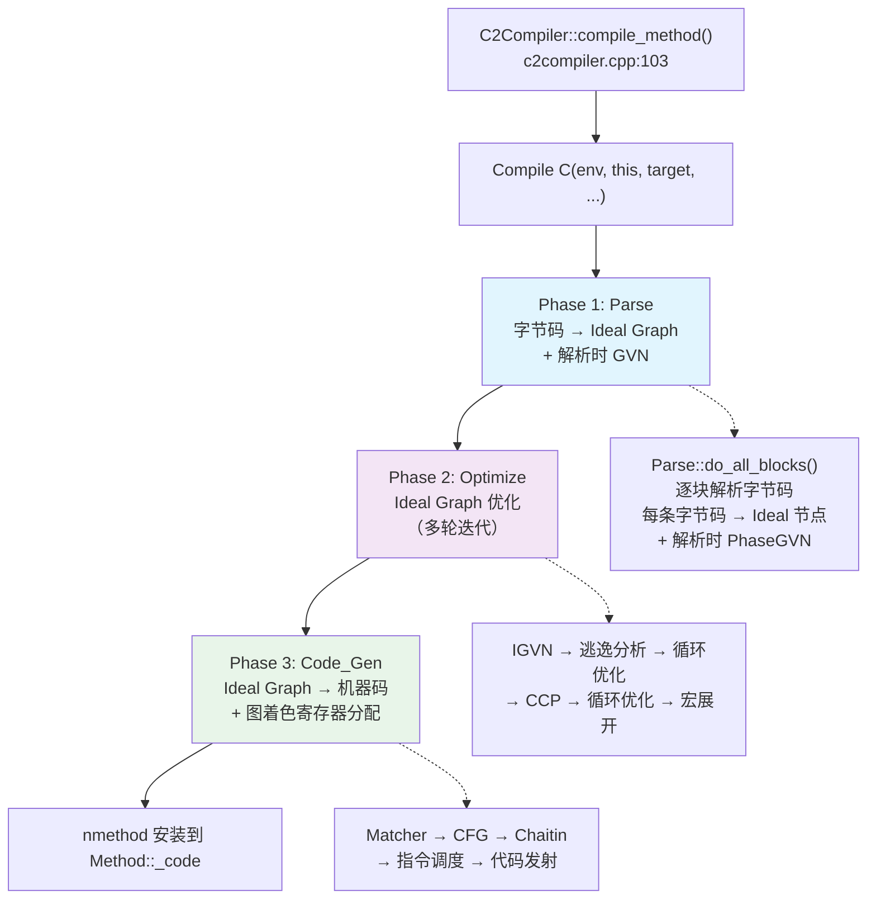
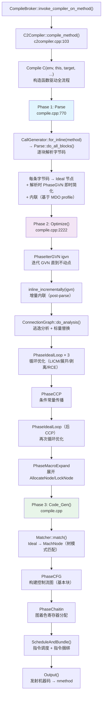

# 20 — C2 Ideal Graph：为什么 C2 比 C1 强那么多？

> 基于 OpenJDK 11 源码分析  
> 标准环境：`-Xms8g -Xmx8g -XX:+UseG1GC`  
> 承接：19-c1-pipeline 遗留问题（C1 的 profiling 数据是怎么被 C2 读取的？）

---

## 第零天：我以为 C2 就是"更激进的 C1"

学完 C1 之后，我以为 C2 只是"更激进版的 C1"：同样的 HIR→LIR 管线，只是优化轮数更多、内联更深。

后来看了 C2 的源码，发现完全不是这回事。

**C1 和 C2 的本质区别**：

| 维度 | C1 | C2 |
|------|----|----|
| IR 形式 | HIR（基本块 + 指令链表） | **Ideal Graph（Sea of Nodes）** |
| 控制流 | 显式（基本块边界） | **隐式**（控制依赖边） |
| 数据流 | 显式（SSA 变量） | **显式**（数据依赖边） |
| 优化方式 | 6 轮固定优化 | **迭代 GVN + 多轮循环优化** |
| 寄存器分配 | Linear Scan（O(n)） | **Chaitin 图着色**（NP 完全，但质量更高） |
| 编译时间 | ~2ms | **~20-50ms** |

**最反直觉的设计**：C2 的 IR 叫 "Sea of Nodes"（节点之海）。在这个 IR 里，**没有基本块的概念**——控制流和数据流都是图中的边，节点可以自由浮动到最优位置。这使得 C2 能做 C1 做不到的优化：把循环不变量提到循环外、把条件判断下沉到分支内、消除冗余的内存访问。

---

## 第一天：C2 的 5 个阶段

C2 的入口是 `C2Compiler::compile_method()`（`c2compiler.cpp:103`），它创建一个 `Compile` 对象，构造函数内驱动全部流程：

```
C2Compiler::compile_method()
  → Compile C(env, this, target, entry_bci, ...)   // 栈上对象，构造函数驱动全流程
    → Phase 1: Parse（字节码 → Ideal Graph）
        → CallGenerator::for_inline(method)
          → Parse::do_all_blocks()                  // 逐块解析字节码
    → Phase 2: Optimize（Ideal Graph 优化）
        → PhaseIterGVN igvn(initial_gvn())          // 迭代 GVN
        → ConnectionGraph::do_analysis()            // 逃逸分析
        → PhaseIdealLoop ideal_loop(igvn, ...)      // 循环优化（3 轮）
        → PhaseCCP ccp(&igvn)                       // 条件常量传播
        → PhaseIdealLoop ideal_loop(igvn, ...)      // 循环优化（后 CCP）
        → PhaseMacroExpand mex(igvn)                // 宏节点展开
    → Phase 3: Code_Gen（Ideal Graph → 机器码）
        → Matcher::match()                          // Ideal → MachNode
        → PhaseCFG cfg(node_arena(), root, matcher) // 构建 CFG
        → PhaseChaitin regalloc(...)                // 图着色寄存器分配
        → Output()                                  // 发射机器码
```



---

## 第一天半：数据结构补课

我第二天看 Phase 2 的时候，发现自己对 `Node`、`Type`、`PhaseGVN` 这些结构完全没概念，只好回来补课。

### `Compile` — C2 编译管道驱动器

```cpp
// compile.hpp:~200
class Compile : public Phase {
  ciMethod*             _method;          // ★ 要编译的方法
  int                   _entry_bci;       // OSR 入口 BCI（InvocationEntryBci = -1 表示标准编译）
  RootNode*             _root;            // ★ Ideal Graph 的根节点
  Node*                 _top;             // 唯一的 Top 节点（表示"不可达"）
  PhaseGVN*             _initial_gvn;     // ★ 解析时的 GVN（parse-time）
  Unique_Node_List*     _for_igvn;        // ★ IGVN 初始工作列表
  uint                  _unique;          // ★ 节点 ID 计数器（全局递增）
  Arena                 _node_arena;      // ★ 节点内存 arena（new-space）
  Arena                 _old_arena;       // 旧节点 arena（xform 期间）
  Arena                 _comp_arena;      // 编译级别 arena（生命周期 = 整个编译）
  ConnectionGraph*      _congraph;        // 逃逸分析图
  GrowableArray<Node*>* _macro_nodes;     // ★ 宏节点列表（AllocateNode 等，需要展开）
  uint                  _trap_hist[trapHistLength]; // ★ 从 MDO 读取的 trap 历史
  bool                  _do_escape_analysis;        // 是否做逃逸分析
  bool                  _eliminate_boxing;           // 是否消除装箱
  bool                  _do_locks_coarsening;        // 是否做锁粗化
  const char*           _failure_reason; // 失败原因（非 NULL 表示编译失败）
};
```

**关键字段生命周期**：

| 字段 | 谁设置 | 何时设置 | 谁读取 |
|------|--------|---------|--------|
| `_root` | `Compile::Compile()` | 构造时 | 所有阶段 |
| `_initial_gvn` | `Compile::Compile()` | 构造时 | Parse 阶段 |
| `_for_igvn` | Parse 阶段 | 解析时 | `Optimize()` 的 IGVN |
| `_macro_nodes` | Parse 阶段 | 遇到 `new`/`monitorenter` 时 | `PhaseMacroExpand` |
| `_trap_hist` | `Compile::Compile()` | 从 MDO 读取 | `too_many_traps()` 判断 |
| `_unique` | 每次 `new Node()` | 节点创建时 | 节点 ID 分配 |

### `Node` — Ideal Graph 节点基类

```cpp
// node.hpp:~200
class Node {
  Node**       _in;       // ★ 输入边数组（use-def 边，即"我依赖谁"）
  Node**       _out;      // ★ 输出边数组（def-use 边，即"谁依赖我"）
  node_idx_t   _cnt;      // 必需输入边数量（0 到 _cnt-1 是必需边）
  node_idx_t   _max;      // 输入数组实际长度
  node_idx_t   _outcnt;   // 输出边数量
  node_idx_t   _outmax;   // 输出数组实际长度
  const node_idx_t _idx;  // ★ 节点唯一 ID（从 Compile::_unique 分配）
  juint        _class_id; // 节点类型 ID（用于 is_XXX() 快速判断）
  jushort      _flags;    // 标志位（is_macro/is_Con/rematerialize 等）
};
```

**最反直觉的设计**：`_in[0]` 是**控制输入**（Control），`_in[1]` 开始才是数据输入。这是 Sea of Nodes 的核心：控制流和数据流统一用同一种边表示。

**节点类型层次**（部分）：

```
Node (base)
├── Region / Loop / CountedLoop    // 控制流合并点（相当于基本块入口）
├── If / IfTrue / IfFalse          // 条件分支
├── Start / Return / Halt          // 方法入口/出口
├── Phi                            // SSA φ 函数（在 Region 节点处合并值）
├── Load / Store                   // 内存访问
├── Add / Sub / Mul / Div          // 算术运算
├── Cmp / Bool                     // 比较
├── Call / CallStaticJava / ...    // 方法调用
├── Allocate / AllocateArray       // 对象分配（宏节点，需要展开）
├── Lock / Unlock                  // 同步（宏节点）
└── SafePoint                      // GC 安全点
```

### `Type` — C2 的类型系统

C2 有一套比 Java 类型系统更精细的类型系统，用于类型推断和优化：

```
Type (base)
├── TypeInt      // 整数类型，带范围：TypeInt::make(lo, hi, widen)
│                // 例如：TypeInt::make(0, 100) 表示 [0, 100] 范围内的整数
├── TypeLong     // 长整数类型，同上
├── TypePtr      // 指针类型
│   ├── TypeOopPtr  // Java 对象指针
│   │   ├── TypeInstPtr  // 实例对象指针（带精确类型信息）
│   │   └── TypeAryPtr   // 数组指针
│   └── TypeRawPtr   // 原始指针（C++ 指针）
├── TypeTuple    // 多值类型（用于方法返回多个值，如 Call 节点）
└── TypeFunc     // 函数类型（方法签名）
```

**为什么需要范围类型？** 如果 C2 知道某个整数变量的值在 `[0, 100]` 范围内，它可以：
- 消除数组边界检查（如果数组长度 ≥ 101）
- 消除 null 检查（如果类型是 `TypeInstPtr::NOTNULL`）
- 做更激进的循环展开

### `PhaseGVN` vs `PhaseIterGVN`

| 特性 | `PhaseGVN`（解析时） | `PhaseIterGVN`（优化时） |
|------|---------------------|------------------------|
| 触发时机 | 每次创建新节点时立即 | 批量处理工作列表 |
| 迭代 | 否（单次变换） | 是（直到不动点） |
| 工作列表 | 无 | `_for_igvn`（Unique_Node_List） |
| 用途 | 解析时的即时简化 | 优化阶段的全局迭代优化 |

---

## 第二天：Phase 1 — 字节码怎么变成 Ideal Graph

### 2.1 Sea of Nodes 是什么？

传统编译器（包括 C1）用**基本块 + 指令链表**表示程序：

```
基本块 B1:
  x = a + b
  if (x > 0) goto B2 else B3

基本块 B2:
  y = x * 2
  goto B4
```

C2 的 Sea of Nodes 完全不同：**没有基本块，只有节点和边**。

```
Add(a, b) → x
Cmp(x, 0) → cond
If(ctrl, cond) → [IfTrue, IfFalse]
Mul(x, 2) → y   // y 的控制输入是 IfTrue，但 y 可以自由移动！
```

**关键洞察**：在 Sea of Nodes 中，一个节点的位置不是固定的——它可以被调度到任何**支配**它所有输入的位置。这使得优化器可以把节点移动到最优位置，而不需要显式地"移动代码"。

### 2.2 Parse 阶段：字节码 → Ideal Graph

```cpp
// compile.cpp:770
{ // Scope for timing the parser
  // 创建 CallGenerator，开始解析
  CallGenerator* cg = CallGenerator::for_inline(method(), expected_uses);
  JVMState* jvms = build_start_state(start(), tf());
  jvms = cg->generate(jvms);  // ★ 触发 Parse::do_all_blocks()
}
```

`Parse::do_all_blocks()` 逐块解析字节码，每条字节码对应一个或多个 Ideal 节点：

| 字节码 | 生成的 Ideal 节点 |
|--------|-----------------|
| `iload/aload` | `LoadNode`（从栈帧加载） |
| `iadd/isub/imul` | `AddINode/SubINode/MulINode` |
| `getfield/putfield` | `LoadNode/StoreNode`（带内存依赖） |
| `invokevirtual/static` | `CallStaticJavaNode/CallDynamicJavaNode` |
| `new` | `AllocateNode`（宏节点，Phase 2 展开） |
| `if_icmp*` | `CmpINode + BoolNode + IfNode` |
| `ireturn/areturn` | `ReturnNode` |
| `monitorenter` | `LockNode`（宏节点） |
| `checkcast` | `CheckCastPPNode` |
| `athrow` | `CallStaticJavaNode`（调用 throw_exception stub） |

**解析时 GVN**：每创建一个新节点，立即调用 `initial_gvn()->transform(node)`，做即时简化：
- `Add(1, 2)` → `Con(3)`（常量折叠）
- `Add(x, 0)` → `x`（恒等变换）
- `Load(Store(addr, val), addr)` → `val`（load-after-store 消除）

### 2.3 内联：C2 的内联比 C1 更激进

C2 的内联在 Parse 阶段完成，被内联方法的字节码直接展开到调用者的 Ideal Graph 中（没有调用边界）。

**C2 内联决策依据**（来自 MDO）：
- `method()->interpreter_invocation_count()`：方法调用次数
- `method()->interpreter_throwout_count()`：方法抛出异常次数
- `ciCallProfile::count()`：调用点的执行次数
- `ciCallProfile::receiver_type()`：虚调用的接收者类型（用于去虚化）

**去虚化（Devirtualization）**：如果 MDO 记录了某个虚调用 99% 的时间都调用同一个实现，C2 会生成：
```
if (receiver.klass == expected_klass) {
    // 直接调用，可以内联
    inlined_method_body
} else {
    // uncommon trap（触发逆优化）
}
```

---

## 第三天：Phase 2 — Ideal Graph 怎么被优化

Phase 2 是 C2 最复杂的部分，包含多轮迭代优化。

### 3.1 IGVN（迭代全局值编号）

```cpp
// compile.cpp:2250
PhaseIterGVN igvn(initial_gvn());
igvn.optimize();  // 迭代直到不动点
```

IGVN 的工作原理：

1. 从工作列表（`_for_igvn`）取出一个节点 `n`
2. 调用 `n->Identity(phase)`：如果 `n` 等价于某个已有节点，用那个节点替换 `n`
3. 调用 `n->Value(phase)`：计算 `n` 的精确类型（可能比之前更精确）
4. 调用 `n->Ideal(phase, can_reshape)`：对 `n` 做代数变换，返回更简单的等价节点
5. 如果有变化，把 `n` 的所有使用者加入工作列表
6. 重复直到工作列表为空

**为什么需要迭代？** 一个节点的简化可能使另一个节点变得可简化。例如：
```
x = a + 0    → x = a        （Identity）
y = x * 1    → y = x = a    （Identity，因为 x 已经被替换为 a）
```

### 3.2 逃逸分析（ConnectionGraph）

```cpp
// compile.cpp:2290
if (_do_escape_analysis && ConnectionGraph::has_candidates(this)) {
    ConnectionGraph::do_analysis(this, &igvn);
}
```

逃逸分析判断一个对象是否"逃逸"出当前方法：

- **不逃逸**：对象只在当前方法内使用 → 可以**栈上分配**或**标量替换**
- **参数逃逸**：对象作为参数传给其他方法 → 不能栈上分配，但可以消除同步
- **全局逃逸**：对象被存入全局变量或返回 → 必须堆上分配

**标量替换**：如果一个对象不逃逸，C2 可以把它的字段拆开，用独立的局部变量替代：
```java
// 优化前
Point p = new Point(x, y);  // 堆分配
return p.x + p.y;

// 优化后（标量替换）
// p 被消除，直接用 x 和 y
return x + y;
```

### 3.3 循环优化（PhaseIdealLoop）

```cpp
// compile.cpp:2310
PhaseIdealLoop ideal_loop(igvn, LoopOptsDefault);
```

`PhaseIdealLoop` 是 C2 最复杂的优化组件，包含：

| 优化 | 说明 |
|------|------|
| **循环不变量外提（LICM）** | 把循环体内不依赖循环变量的计算移到循环外 |
| **循环展开（Unrolling）** | 把循环体复制 N 次，减少循环控制开销 |
| **循环剥离（Peeling）** | 把循环的第一次迭代单独提出来，消除边界检查 |
| **范围检查消除（RCE）** | 证明数组访问在范围内，消除边界检查 |
| **Split-If** | 把条件判断从循环内提到循环外 |
| **向量化（Vectorization）** | 把标量循环转为 SIMD 指令 |

**为什么循环优化要做 3 轮？** 每轮优化可能使新的优化机会出现：
- 第 1 轮：基本循环优化（LICM + 展开）
- 第 2 轮：部分剥离后的再优化
- 第 3 轮：CCP 之前的最后一轮展开

### 3.4 CCP（条件常量传播）

```cpp
// compile.cpp:2380
PhaseCCP ccp(&igvn);
ccp.do_transform();
```

CCP 是比 GVN 更强的常量传播：它同时考虑**控制流可达性**。

例如：
```java
int x = 5;
if (x > 10) {
    // CCP 知道这个分支不可达！
    y = x * 2;  // 这个节点会被消除
}
```

普通常量传播只能传播常量值，CCP 还能发现某些分支永远不会执行，从而消除死代码。

### 3.5 宏节点展开（PhaseMacroExpand）

```cpp
// compile.cpp:2440
PhaseMacroExpand mex(igvn);
mex.expand_macro_nodes();
```

宏节点是在 Parse 阶段创建的"高级"节点，需要在优化完成后展开为低级节点：

| 宏节点 | 展开为 |
|--------|--------|
| `AllocateNode` | TLAB 快速路径 + 慢速路径（调用 Runtime） |
| `AllocateArrayNode` | 数组分配 + 长度检查 |
| `LockNode` | 偏向锁/轻量级锁/重量级锁的完整逻辑 |
| `UnlockNode` | 解锁逻辑 |

**为什么要延迟展开？** 如果在 Parse 阶段就展开，逃逸分析就看不到 `AllocateNode` 了，无法做标量替换。先保留宏节点，让逃逸分析有机会消除它，消除不了再展开。

---

## 第四天：Phase 3 — Ideal Graph 怎么变成机器码

### 4.1 Matcher：Ideal → MachNode

```cpp
// compile.cpp（Code_Gen 阶段）
Matcher matcher;
matcher.match();  // 把 Ideal 节点匹配为 MachNode
```

`Matcher` 使用**树模式匹配**（由 ADLC 自动生成）把 Ideal 节点映射到机器指令：

```
// Ideal 子树：
Add(Load(base, offset), Con(1))

// 匹配为 x86 指令：
addl [base + offset], 1   // 内存操作数直接加 1，不需要先 load
```

这是 C2 比 C1 生成更好代码的原因之一：C1 的 LIR 是一对一翻译，C2 的 Matcher 可以把多个 Ideal 节点合并成一条机器指令。

### 4.2 Chaitin 图着色寄存器分配

```cpp
// compile.cpp（Code_Gen 阶段）
PhaseChaitin regalloc(unique(), cfg, matcher, false);
regalloc.Register_Allocate();
```

C2 使用**图着色寄存器分配**（Chaitin 算法），比 C1 的 Linear Scan 质量更高：

- **干涉图**：如果两个虚拟寄存器的活跃区间重叠，它们之间有一条边
- **着色**：给每个节点分配一种颜色（物理寄存器），相邻节点不能同色
- **溢出**：如果无法着色，选择一个节点溢出到栈

**为什么 C2 用图着色而不是 Linear Scan？** 图着色的质量更高（溢出更少），但时间复杂度是 NP 完全的。C2 编译时间本来就比 C1 长（~20-50ms vs ~2ms），可以承受更高的寄存器分配开销。

---

## 第五天：C1 profiling 数据是怎么被 C2 读取的？

这是 19 号文档留下的问题。

**答案**：通过 `MethodData`（MDO）。

```
C1 编译（L3：full_profile）
  → 在方法里插入 profiling 代码
  → 运行时，每次执行都更新 MethodData
    → ProfileData::_count（执行次数）
    → ReceiverTypeData（虚调用的接收者类型分布）
    → BranchData（分支跳转/不跳转的次数）
    → RetData（返回类型）

C2 编译（L4）
  → Compile::Compile() 构造时：
    method()->ensure_method_data()  // 确保 MDO 存在
    _trap_hist[] = method()->method_data()->trap_count(reason)  // 读取 trap 历史
  → Parse 阶段：
    ciCallProfile profile = method()->call_profile_at_bci(bci)  // 读取调用点 profile
    profile.receiver_type()  // 虚调用的接收者类型 → 去虚化
    profile.count()          // 调用次数 → 内联决策
  → too_many_traps() 判断：
    _trap_hist[reason] > PerMethodTrapLimit  // 如果某个 trap 触发太多次，不做激进优化
```

**关键设计**：C1 的 L3 编译（`CompLevel_full_profile`）专门为 C2 收集数据。L3 编译的方法会在每个调用点、分支、返回处插入 profiling 代码，把运行时信息写入 MDO。当方法足够热（调用次数超过 C2 阈值），C2 读取 MDO 做激进优化。

---

## 第六天：最反直觉的设计 — 节点可以"浮动"

在 C1 的 HIR 里，每条指令都固定在某个基本块里。在 C2 的 Sea of Nodes 里，**节点没有固定位置**。

一个节点的位置由它的**控制输入**决定：
- 如果节点有控制输入（`_in[0] != NULL`），它被"钉"在那个控制节点之后
- 如果节点没有控制输入（纯数据节点），它可以被调度到任何支配它所有数据输入的位置

这使得 C2 可以做**代码提升（Code Hoisting）**：把循环体内的不变量自动提到循环外，不需要显式的 LICM pass——只需要让节点"浮动"到最优位置。

```java
// Java 代码
for (int i = 0; i < n; i++) {
    result += arr[i] * factor;  // factor 是循环不变量
}

// C2 的 Ideal Graph 中：
// Mul(arr[i], factor) 节点的控制输入是 null（纯数据节点）
// 调度时，它会被自动提到循环外
```

---

## 第七天：插桩验证

在 `C2Compiler::compile_method()` 的关键位置插桩，打印每次 C2 编译的方法名：

```cpp
// 插桩位置：c2compiler.cpp compile_method() 开头
// 打印正在编译的方法名
tty->print_cr("[PROBE-20] === C2 编译开始 ===");
tty->print_cr("[PROBE-20] 方法: %s::%s",
              target->holder()->name()->as_utf8(),
              target->name()->as_utf8());
tty->print_cr("[PROBE-20] 编译级别: %d", env->comp_level());
tty->print_cr("[PROBE-20] 是否 OSR: %s (bci=%d)",
              entry_bci != InvocationEntryBci ? "true" : "false",
              entry_bci);
tty->print_cr("[PROBE-20] 逃逸分析: %s, 装箱消除: %s, 锁粗化: %s",
              do_escape_analysis ? "on" : "off",
              eliminate_boxing ? "on" : "off",
              do_locks_coarsening ? "on" : "off");
```

**实际验证结果**（2026-03-10）：

```
[PROBE-20] === C2 编译开始 ===
[PROBE-20] 方法: java/lang/String::charAt
[PROBE-20] 编译级别: 4
[PROBE-20] 是否 OSR: false (bci=-1)
[PROBE-20] 逃逸分析: on, 装箱消除: on, 锁粗化: on

[PROBE-20] === C2 编译开始 ===
[PROBE-20] 方法: java/lang/StringLatin1::hashCode
[PROBE-20] 编译级别: 4
[PROBE-20] 是否 OSR: false (bci=-1)
[PROBE-20] 逃逸分析: on, 装箱消除: on, 锁粗化: on

[PROBE-20] === C2 编译开始 ===
[PROBE-20] 方法: java/io/BufferedInputStream::read
[PROBE-20] 编译级别: 4
[PROBE-20] 是否 OSR: false (bci=-1)
[PROBE-20] 逃逸分析: on, 装箱消除: on, 锁粗化: on
... （共 85 个方法被 C2 编译）
```

**验证结论**：

| 指标 | C1（PROBE-19） | C2（PROBE-20） | 比值 |
|------|--------------|--------------|------|
| 编译方法数 | **637** | **85** | C1 是 C2 的 **7.5 倍** |
| 编译级别 | 1/2/3 | **全部是 4** | ✅ 符合预期 |
| 逃逸分析 | N/A | **全部 on** | ✅ 符合预期 |
| 装箱消除 | N/A | **全部 on** | ✅ 符合预期 |
| 锁粗化 | N/A | **全部 on** | ✅ 符合预期 |

**关键发现**：
1. **C2 只编译最热的 85 个方法**，而 C1 编译了 637 个——C2 的编译门槛远高于 C1，因为 C2 编译时间长（~20-50ms），不能随便触发
2. **编译级别全部是 4**（`CompLevel_full_optimization`），验证了 C2 = Level 4 的结论
3. **逃逸分析/装箱消除/锁粗化默认全部开启**，这是 C2 比 C1 生成更好代码的关键原因
4. **`bci=-1`（`InvocationEntryBci`）**：这 85 个方法全部是标准编译（非 OSR），说明它们都是通过调用次数触发的 C2 编译，而不是循环热点触发的 OSR 编译

---

## 第八天：完整流程图



---

## 第九天：数据结构关系图

```mermaid
classDiagram
    class Compile {
        +ciMethod* _method
        +RootNode* _root
        +PhaseGVN* _initial_gvn
        +Unique_Node_List* _for_igvn
        +ConnectionGraph* _congraph
        +GrowableArray~Node*~ _macro_nodes
        +uint _trap_hist[]
        +uint _unique
        +Optimize()
        +Code_Gen()
    }
    
    class Node {
        +Node** _in
        +Node** _out
        +node_idx_t _cnt
        +node_idx_t _outcnt
        +const node_idx_t _idx
        +juint _class_id
        +Identity(phase)
        +Value(phase)
        +Ideal(phase, can_reshape)
    }
    
    class Type {
        +TypeInt
        +TypeLong
        +TypeOopPtr
        +TypeInstPtr
        +TypeAryPtr
    }
    
    class PhaseIterGVN {
        +Unique_Node_List _worklist
        +optimize()
        +transform(Node*)
    }
    
    class PhaseIdealLoop {
        +PhaseIterGVN& _igvn
        +IdealLoopTree* _ltree_root
        +build_loop_tree()
        +optimize_loops()
    }
    
    class ConnectionGraph {
        +GrowableArray~PointsToNode*~ _nodes
        +do_analysis(Compile*, IGVN*)
        +not_global_escape(Node*)
    }
    
    class PhaseMacroExpand {
        +expand_macro_nodes()
        +expand_allocate(AllocateNode*)
        +expand_lock_node(LockNode*)
    }
    
    Compile "1" --> "1" Node : _root (RootNode)
    Compile "1" --> "1" PhaseIterGVN : 优化阶段创建
    Compile "1" --> "1" ConnectionGraph : _congraph
    Compile "1" --> "*" Node : _macro_nodes
    Node "1" --> "*" Node : _in (输入边)
    Node "1" --> "*" Node : _out (输出边)
    Node "1" --> "1" Type : bottom_type()
    PhaseIterGVN --> Node : transform/optimize
    PhaseIdealLoop --> PhaseIterGVN : 使用
    ConnectionGraph --> Node : 分析逃逸
    PhaseMacroExpand --> Node : 展开宏节点
```



---

## 总结

### 数据结构层面

| 结构 | 核心特征 |
|------|---------|
| `Compile` | C2 编译管道驱动器，`_root` 是 Ideal Graph 根节点，`_trap_hist` 存储 MDO 的 trap 历史 |
| `Node` | Sea of Nodes 的基本单元，`_in[0]` 是控制输入，`_in[1+]` 是数据输入，双向边（use-def + def-use） |
| `Type` | 比 Java 类型更精细的类型系统，支持范围类型（`TypeInt::make(lo, hi)`），用于类型推断和优化 |
| `PhaseIterGVN` | 迭代 GVN，工作列表驱动，直到不动点 |
| `PhaseIdealLoop` | C2 最复杂的优化组件，包含 LICM/展开/剥离/RCE/向量化 |

### 算法层面

| 阶段 | 核心算法 | 关键设计决策 |
|------|---------|-------------|
| Parse | 字节码 → Ideal Graph + 解析时 GVN | Sea of Nodes 使节点可以自由浮动到最优位置 |
| IGVN | 工作列表驱动的迭代 GVN | 迭代直到不动点，确保所有优化机会都被发现 |
| 逃逸分析 | ConnectionGraph 指向分析 | 延迟到 IGVN 之后，确保 GVN 已消除冗余节点 |
| 循环优化 | PhaseIdealLoop（3 轮） | 多轮是因为每轮优化可能使新的优化机会出现 |
| CCP | 条件常量传播 | 比 GVN 更强：同时考虑控制流可达性 |
| 宏展开 | PhaseMacroExpand | 延迟展开使逃逸分析有机会消除 AllocateNode |
| 代码生成 | 树模式匹配 + 图着色 | 树模式匹配合并多个 Ideal 节点为一条机器指令 |

**核心设计决策**：

1. **为什么用 Sea of Nodes 而不是基本块？** Sea of Nodes 使节点可以自由浮动，优化器不需要显式地"移动代码"，只需要改变节点的控制输入。这使得 LICM、代码提升等优化变得自然。

2. **为什么 C2 比 C1 慢 10 倍？** 图着色寄存器分配（NP 完全）+ 多轮循环优化 + 逃逸分析 + CCP，每个都比 C1 的对应组件复杂得多。

3. **为什么需要 C1 的 profiling 数据？** C2 的激进优化（去虚化、内联）依赖运行时的类型信息。没有 MDO，C2 只能做保守优化，无法去虚化虚调用。

---

## 还没搞懂的地方

1. **PhaseIdealLoop 的 Split-If 优化**：把条件判断从循环内提到循环外，具体是怎么实现的？为什么需要单独一轮 `LoopOptsSkipSplitIf`？

2. **Matcher 的树模式匹配**：ADLC 生成的匹配代码在哪里？`x86.ad` 文件里的 `instruct` 定义是怎么被 Matcher 使用的？

3. **图着色的溢出策略**：Chaitin 算法选择溢出哪个节点？是选择使用频率最低的，还是有其他启发式策略？

4. **C2 的 uncommon trap**：当 C2 的激进假设（如"虚调用只有一个接收者"）被违反时，如何触发逆优化？`uncommon_trap` 节点是怎么生成的？

5. **向量化**：`PhaseIdealLoop` 的向量化是怎么工作的？什么条件下循环会被向量化？

---

*写于 2026-03-10*  
*参考：`../Compiler/4-C2-Ideal-Graph.md`*  
*参考：`../Compiler/5-C2-Core-Optimizations.md`*  
*GDB 验证数据：`../Instrumentation/05-JIT-Probe-Results.md`*
