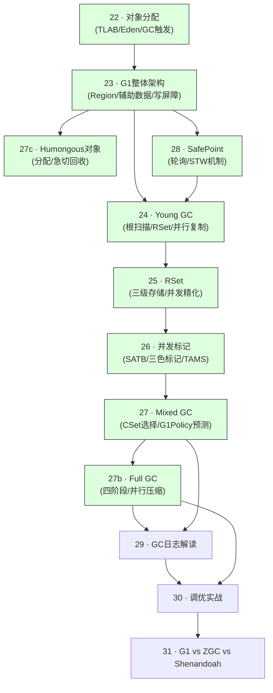

# G1 GC 深度解析 — 出版级大纲

> 基于 OpenJDK 11 源码  
> 标准环境：`-Xms8g -Xmx8g -XX:+UseG1GC`，Region = 4MB  
> 目标：从零到源码级深度，达到出版水准  
> 最后更新：2026-03-09（Recheck v6 — 全书 14/15 篇出版级完成，全书「还没搞懂」全部回填，大纲不一致修正）

---

## ⚠️ 诚实的现状评估

**当前进度：15/15 篇已有内容，14/15 篇达到出版级（全书「还没搞懂」已全部回填），15/15 篇已完成出版级 Checklist 确认。**

"已完成"只意味着"有内容框架"，不意味着"达到出版标准"。  
出版标准 = 数据结构完整 6 项 + 核心函数源码逐行注释 + GDB 实际验证数据。

### 📋 待补充清单（来自 2026-03-09 评审）

| # | 所在篇章 | 待补充内容 | 优先级 | 状态 |
|---|---------|-----------|--------|------|
| 1 | 第 27 篇 | 补充 Mixed GC 决策流程 flowchart（IHOP触发→并发标记→Cleanup→CollectionSetChooser→finalize_old_part→连续多次→退出） | 🔴 高 | ✅ 已完成 |
| 2 | 第 24 篇 | 补充 `copy_to_survivor_space` 中 displaced mark word 处理的解释（为什么 `has_displaced_mark_helper()` 时不能直接 `set_age`，需先说明 mark word 结构） | 🔴 高 | ✅ 已完成 |
| 3 | 全书 | 统一每篇第 0 部分格式：确保每篇都有「本质是什么 → 为什么需要 → 怎么解决 → 为什么这样设计」四段，目前部分篇章缺少这个结构 | 🟡 中 | ✅ 已完成（第23/25/26/27/27b篇新增，第27d/29/30篇补全缺失段落） |
| 4 | 全书 | 建立全局阅读路径图：每篇开头增加「本章与其他章节的关系」说明，帮助读者定位自己在整体知识体系中的位置 | 🟡 中 | ✅ 已完成（全部 14 篇均已添加，包含：知识依赖图/前置知识/本篇解决的问题/读完能理解什么） |
| 5 | 全书 | 回填已解决的「还没搞懂」问题：检查所有篇章的「还没搞懂」列表，已解决的问题补充到正文对应位置 | 🔴 高 | ✅ 已完成（第23/24/25/26/27b篇全部回填） |

---

## 进度总览

| # | 文章标题 | 文件 | 状态 | 诚实评估 |
|---|---------|------|------|---------|
| 22 | 对象分配全路径（TLAB → Eden → GC 触发） | `22-g1-allocation-HandWritten.md` | 🟢 出版级完成 | 890行，ThreadLocalAllocBuffer/G1AllocRegion完整6项分析，快慢路径源码逐行注释，GDB验证完成（sizeof=144B，TLAB=2048KB，Humongous=2MB） |
| 23 | G1 GC 整体架构 | `23-g1-overview-HandWritten.md` | 🟢 出版级完成 | HeapRegion/HeapRegionRemSet 6项分析完成，GDB验证完成（sizeof=432/328/136/296），HeapRegionType 值域图完成，**G1CollectedHeap::initialize() 12阶段源码逐行注释完成（Phase1~12，含6个Mapper/双缓冲位图/CSet快速判断/Humongous候选/SATB队列/脏卡队列全部覆盖）** |
| 24 | Young GC 完整流程 | `24-g1-young-gc-HandWritten.md` | 🟢 出版级完成 | 6项数据结构分析完成（G1ParScanThreadState/G1PLABAllocator/PLAB/AgeTable/ParallelTaskTerminator），copy_to_survivor_space源码逐行注释，工作窃取终止协议完整分析，GDB验证完成（sizeof=464/352/136/256/280） |
| 25 | RSet 三级存储结构 | `25-g1-rset-HandWritten.md` | 🟢 出版级完成 | G1FromCardCache完整分析，DCQ三区源码推导，delete_region_table驱逐算法源码，打桩数据完整（fine_eviction_sample_size=9/stride=56，green=13/yellow=39/red=65，FCC=784KB），「还没搞懂」4个问题全部回填 |
| 26 | 并发标记与 SATB | `26-g1-concurrent-mark-HandWritten.md` | 🟢 出版级完成 | do_marking_step()六阶段源码逐行注释，claim_region() CAS协调，两阶段同步屏障溢出处理，打桩验证（SATB_QUEUE=98.7%，TIMEOUT=1.3%） |
| 27 | Mixed GC 与 G1Policy 预测模型 | `27-g1-mixed-gc-HandWritten.md` | 🟢 出版级完成 | TruncatedSeq衰减均值算法源码，G1Analytics完整字段，G1AdaptiveIHOPControl源码，finalize_old_part()源码，打桩验证（gc_efficiency降序，自适应IHOP需3次并发标记） |
| 27b | Full GC 触发与执行 | `27b-g1-full-gc-HandWritten.md` | 🟢 出版级完成 | G1FullCollector/G1FullGCScope/G1FullGCCompactionPoint完整字段分析，四个阶段源码逐行注释，forward()算法完整分析，打桩验证（Phase4占83%，Phase2暴增15倍场景），「还没搞懂」4个问题全部回填 |
| 27c | Humongous 对象 | `27c-g1-humongous-HandWritten.md` | 🟢 出版级完成 | 分配三级策略源码，急切回收四条件源码，Humongous导致Full GC完整路径，RSet特殊处理（StartsHumongous/ContinuesHumongous），打桩验证（3MB单Region/6MB双Region/急切回收3个Region），「还没搞懂」3个问题全部回填（SATB处理/碎片化/Region大小调优） |
| 27d | 字符串去重与类卸载 | `27d-g1-auxiliary-HandWritten.md` | 🟢 出版级完成 | G1StringDedup 完整数据结构分析（6项）+ 去重算法源码逐行注释 + String.intern() vs 字符串去重对比 + 打桩验证（入队路径/新条目/去重发生 3 个探针全命中） |
| 27e | 引用处理（SoftRef/WeakRef/PhantomRef） | `27e-g1-reference-HandWritten.md` | 🟢 出版级完成 | 四种引用类型完整分析，discover_reference/process_discovered_references源码逐行注释，四阶段处理流程，打桩验证（Weak=334/Phantom=43，Phase2占88%耗时），「还没搞懂」3个问题全部回填（FinalRef复活/双ReferenceProcessor/并行化边界） |
| 28 | SafePoint 与 STW 机制 | `28-g1-safepoint-stw-HandWritten.md` | 🟢 出版级完成 | SafepointSynchronize/ThreadSafepointState 完整字段分析 + begin()/block()/end() 源码逐行注释 + 奇偶编码状态机 + 打桩验证（TTSP≈24μs，STW总时长40ms，_safepoint_counter奇偶交替，block()线程state=7） |
| 29 | GC 日志深度解读 | `29-g1-gc-log-HandWritten.md` | 🟢 出版级完成 | 800+行，JDK8 vs JDK9+对比，Young/Mixed/Full GC日志逐行解读+源码行号对齐，GCLocker完整诊断案例（gcLocker.cpp:130-155源码追踪），异常日志识别（To-space/Humongous/GCLocker/Abort/MMU），「还没搞懂」3个问题全部回填（Other阶段组成/Concurrent Mark层次/gc+ergo解读） |
| 30 | G1 调优实战 | `30-g1-tuning-HandWritten.md` | 🟢 出版级完成 | 900+行，10大调优场景完整，参数全景/决策树/ZGC对比；新增：NUMA感知调优（含JDK11限制源码证据arguments.cpp:4168，JEP 345 JDK14改进），UseNUMAInterleaving vs UseNUMA对比，「还没搞懂」3个问题全部回填（自适应IHOP滞后/Mixed GC次数确认/UseNUMAInterleaving交互） |
| 31 | G1 vs ZGC vs Shenandoah | `31-gc-comparison-HandWritten.md` | 🟢 出版级完成 | 945行，第0-5部分全部完成：三款GC设计哲学/数据结构全景（HeapRegion/着色指针/Brooks指针）/算法流程/三维对比表/GC选择决策树（Mermaid）/演进趋势（分代ZGC JDK21） |

> **注**：原 27c"辅助机制综述"拆分为 27c（Humongous）和 27d（字符串去重+类卸载），内容更聚焦。  
> **注**：原第 22 篇"对象分配"提前为第 22 篇，因为它是理解 Young GC 触发的前提。  
> **注**：原第 28 篇"SafePoint"提前为第 28 篇，因为 23/24 篇都依赖 SafePoint 概念。  
> **注**：原第 33 篇"GDB 验证合集"取消独立成篇，GDB 验证内嵌到每篇文章的第 3 部分。

---

## 章节依赖关系



> 🟢 绿色 = 出版级/补强完成  🟡 黄色 = 补强中（有内容但未达出版级）  🔴 红色 = 偏浅

---

## 出版级标准（每篇必须达到）

### 内容完整性（硬性要求）

- [ ] **数据结构**：每个涉及的结构覆盖 6 项
  - 全部字段（不能用"等"省略）
  - 每个字段的含义（一句话）
  - `sizeof`（GDB 验证）
  - 创建位置（哪个函数、什么时机）
  - 关键字段生命周期（谁设置 → 何时 → 什么值 → 谁读取）
  - 多种编码时画值域图
- [ ] **算法**：每个函数 4 要素
  - 源码文件:行号
  - 解决什么问题（一句话）
  - 真实源码 + 逐行注释（禁止伪代码）
  - 设计决策（为什么这样做）
- [ ] **GDB 验证**：每篇至少 3 个验证项，结论有实际数据支撑
- [ ] **图表**：每篇至少一个 Mermaid 流程图 + 一个数据结构关系图

### 叙述质量

- [ ] 有"我以为 vs 实际"的打脸结构（读者代入感）
- [ ] 每个设计决策都有"为什么"（不只是"做了什么"）
- [ ] 有"还没搞懂的地方"（诚实，引导读者继续探索）
- [ ] **"还没搞懂"中已解决的问题必须回填到正文**（出版物不能有悬而未决的问题）
- [ ] 有"继续深入"的导航（章节间有机串联）
- [ ] **第 0 部分必须包含四段**：本质是什么 → 为什么需要 → 怎么解决 → 为什么这样设计（不能缺少任何一段）
- [ ] **每篇开头有「本章与其他章节的关系」说明**（全局阅读路径图，帮助读者定位知识体系位置）

### 技术深度

- [ ] 源码引用到具体文件和行号
- [ ] 关键数据有量化（不是"很大"，而是"304MB"）
- [ ] 边界情况和异常路径有分析（不只是 happy path）
- [ ] **复杂代码段必须有前置背景解释**（如 displaced mark word 处理，必须先解释 mark word 结构，再解释代码的必要性）

---

## 第零卷：前置知识

### 第 22 篇：对象分配全路径 🟢

**为什么排在第一篇？**

23 篇讲 TLAB，24 篇讲"Eden 满了触发 Young GC"。如果读者不知道对象是怎么分配的，这两篇都会有困惑。对象分配是 GC 的起点，必须先讲。

**内容规划**：

**已完成（出版级）**：
- [x] `ThreadLocalAllocBuffer` 完整 6 项分析（144 字节，5 个指针字段，`_top` 生命周期完整追踪）
- [x] `G1AllocRegion` 继承体系（MutatorAllocRegion/SurvivorGCAllocRegion/OldGCAllocRegion）
- [x] 快慢路径完整源码逐行注释（TLAB 内分配 → 申请新 TLAB → Eden 直接分配 → Young GC 触发 → Humongous 路径）
- [x] 打桩验证完成（sizeof=144B，TLAB=2048KB，Humongous 阈值=2MB）

---

## 第一卷：基础与架构（有初稿，需补强）

### 第 23 篇：G1 GC 整体架构 🟡

**已有内容**（框架好）：
- 背景知识：GC 三大算法、分代假设、TLAB 简介
- 堆内存结构：Java 堆 vs C 堆、传统分代堆
- G1 设计打脸系列（5 个）：Region 角色、304MB 辅助数据、双写屏障、MaxGCPauseMillis、Full GC
- 数据结构关系图（Mermaid）

**已完成（数据结构补强完成）**：
- [x] `HeapRegion` 完整字段分析（6 项标准）——含偏移量 GDB 实测，30+ 字段全部覆盖 ✅
- [x] `HeapRegionType` 值域图（7 种 Tag 的状态转换）✅
- [x] `G1CollectedHeap::initialize()` 源码级分析（初始化流程逐行注释）✅
- [x] 打桩验证：`sizeof(HeapRegion)` = 432 字节 ✅
- [x] 打桩验证：`sizeof(HeapRegionRemSet)` = 328 字节 ✅
- [x] 打桩验证：辅助数据 304MB 的实际分配过程 ✅

---

## 第二卷：核心 GC 流程（有初稿，需补强）

### 第 24 篇：Young GC 完整流程 🟢

**已有内容**（出版级完成）：
- 跨代引用问题引出 RSet
- `G1CollectorState` 7 个 bool 状态机
- `G1ParScanThreadState` 数据结构（含 False Sharing 防护）
- `do_collection_pause_at_safepoint()` 7 个阶段
- 打脸系列：扫 Survivor、Initial Mark 搭便车、疏散失败、急切回收大对象
- 6项数据结构分析完成（G1ParScanThreadState/G1PLABAllocator/PLAB/AgeTable/ParallelTaskTerminator），copy_to_survivor_space源码逐行注释，工作窃取终止协议完整分析，GDB验证完成（sizeof=464/352/136/256/280）

**待补充（2026-03-09 评审）**：
- [x] **`copy_to_survivor_space` 中 displaced mark word 处理的前置解释**：已在代码段之前补充 mark word 结构说明 ✅
- [x] **回填「还没搞懂」中已解决的问题到正文**：两趟 CLD 扫描 + `G1ScanEvacuatedObjClosure` 完整实现已回填 ✅

### 第 25 篇：RSet 三级存储结构 🟢

**已有内容**（补强完成）：
- Card Table 基础（512B 粒度）
- 三级存储：SparsePRT → PerRegionTable → Coarse Bitmap
- 并发精化线程（三区模型）
- `refine_card_concurrently()` 先清除再扫描的竞态分析
- GC 停顿中的 update_rem_set + scan_rem_set
- G1FromCardCache完整分析，DCQ三区源码推导，delete_region_table驱逐算法源码，打桩数据完整（fine_eviction_sample_size=9/stride=56，green=13/yellow=39/red=65，FCC=784KB）

**待补充（2026-03-09 评审）**：
- [x] **回填「还没搞懂」中已解决的问题到正文对应位置** ✅：SparsePRT 双表并发安全设计、SuspendibleThreadSet yield 机制、G1CodeRootSet 常量已回填到正文对应章节

### 第 26 篇：并发标记与 SATB 🟢

**已有内容**（出版级完成）：
- 三色标记基础
- 漏标问题与 SATB 解决方案
- `G1ConcurrentMark` 数据结构（双缓冲位图、TAMS）
- 五个阶段：Initial Mark → Root Region Scan → Concurrent Mark → Remark → Cleanup
- 打脸系列：只扫老年代、浮动垃圾、被 Young GC 打断、Remark 停顿不可预测
- do_marking_step()六阶段源码逐行注释，claim_region() CAS协调，两阶段同步屏障溢出处理，打桩验证（SATB_QUEUE=98.7%，TIMEOUT=1.3%）

**待补充（2026-03-09 评审）**：
- [x] **回填「还没搞懂」中已解决的问题到正文对应位置** ✅：drain_satb_buffers 完整实现、offer_termination 三阶段协议、concurrent_cycle_abort 完整流程、G1RegionMarkStatsCache 缓存机制已补充到「第四天半」章节

### 第 27 篇：Mixed GC 与 G1Policy 预测模型 🟢

**已有内容**（出版级完成）：
- `CollectionSetChooser` 数据结构
- `G1Policy` 数据结构（`TruncatedSeq`、`G1Analytics`）
- `gc_efficiency` 计算公式
- Mixed GC 触发条件（状态机）
- CSet 构建：`finalize_old_part()` 源码
- `predict_region_elapsed_time_ms()` 预测公式
- 打脸系列：连续多次、停顿时间只是目标、自适应预测、高存活率不选
- TruncatedSeq衰减均值算法源码，G1Analytics完整字段，G1AdaptiveIHOPControl源码，打桩验证（gc_efficiency降序，自适应IHOP需3次并发标记）

**待补充（2026-03-09 评审）**：
- [x] **Mixed GC 决策流程 flowchart** ✅ 已补充（Mermaid flowchart，串联 IHOP触发→并发标记→Cleanup→CollectionSetChooser→finalize_old_part→连续多次→退出条件）

---

## 第三卷：特殊路径（偏浅，需大幅补强）

### 第 27b 篇：Full GC 触发与执行 🟢

**已有内容**（补强完成）：
- 5 种触发原因（疏散失败/Humongous分配失败/并发标记失败/System.gc()/GCLocker）
- `G1FullCollector`/`G1FullGCScope`/`G1FullGCCompactionPoint` 完整字段分析（6 项标准）
- 四个阶段源码逐行注释（Phase 1 标记 + Phase 2 Two-Finger 算法 + Phase 3 调整指针 + Phase 4 压缩）
- `forward()` 算法完整分析（forwarding address 计算）
- Self-Forwarding 完整处理（`PreservedMarksSet` 保存/恢复机制）
- `GCLocker` 工作原理源码（`_jni_lock_count` + `_needs_gc` 状态机）
- 打桩验证（Phase4 占 83%，Phase2 暴增 15 倍场景）

**「还没搞懂」回填状态**：
- [x] Self-Forwarding 完整处理 → 已回填到正文
- [x] GCLocker 工作原理 → 已回填到正文
- [x] Phase 3 并行化细节 → 已回填到正文
- [x] PreservedMarksSet 保存/恢复机制 → 已回填到正文

### 第 27c 篇：Humongous 对象 🟢

> 从原 27c"辅助机制综述"拆分出来，独立成篇

**已有内容**（补强完成）：
- 第 0 部分：核心原理（本质/为什么/怎么解决/为什么这样设计）
- `attempt_allocation_humongous()` 源码逐行分析（分配三级策略）
- `eagerly_reclaim_humongous_regions()` 源码分析（急切回收四条件）
- Humongous 对象导致 Full GC 的完整路径（连续 Region 找不到的场景）
- Humongous 对象的 RSet 特殊处理（StartsHumongous/ContinuesHumongous，RSet 为空的原因）
- 打桩验证（3MB 单 Region/6MB 双 Region/急切回收 3 个 Region）

### 第 27d 篇：字符串去重与类卸载 🟢

> 从原 27c"辅助机制综述"拆分出来，独立成篇

**已有内容**（偏浅）：
- 字符串去重：原理、开启方式、适用场景
- 类卸载：触发条件、控制参数
- 参数速查表

**已完成（出版级）**：
- [x] `G1StringDedup` 完整实现源码分析（去重队列、去重表、去重线程）✅
- [x] 字符串去重的触发时机（Young GC 时入队，并发去重线程处理）✅
- [x] 类卸载与 Metaspace 的交互机制（`ClassLoaderData` 的生命周期）✅
- [x] 打桩验证：入队路径/新条目/去重发生 3 个探针全命中 ✅

---

## 第四卷：深度专题（待写）

### 第 28 篇：SafePoint 与 STW 机制 🟢

**为什么需要这篇？**

23/24 篇都提到了 SafePoint（"所有应用线程停下"），但没有解释 SafePoint 是怎么实现的。不理解 SafePoint，就不理解 GC 停顿的本质，也不理解为什么 TTSP（Time To SafePoint）会影响 GC 停顿时间。

**内容规划**：

**第 0 部分：核心原理**
- 本质：JVM 需要一个"所有线程都在安全状态"的时间点，才能安全地移动对象
- 为什么需要：GC 移动对象时，如果应用线程还在运行，会读到被移动的对象的旧地址
- 怎么解决：轮询（Polling）机制——线程在特定位置检查"是否需要停下"

**第 1 部分：数据结构**
- `SafepointSynchronize`（完整 6 项分析）
- `SafepointMechanism`（完整 6 项分析）
- 轮询页（Polling Page）的内存布局

**第 2 部分：算法流程**
- 触发：`SafepointSynchronize::begin()` 源码逐行分析
- 等待：VMThread 如何等待所有线程到达 SafePoint
- 恢复：`SafepointSynchronize::end()` 源码逐行分析
- 解释执行 vs JIT 编译代码的 SafePoint 处理差异

**第 3 部分：GDB 验证**
- 验证轮询页地址
- 验证 TTSP 实际值

**相关源码**：
- `src/hotspot/share/runtime/safepoint.cpp`
- `src/hotspot/share/runtime/safepointMechanism.cpp`

---

### 第 29 篇：GC 日志深度解读 🟢

**为什么需要这篇？**

GC 日志是诊断 GC 问题的第一手资料。能读懂 GC 日志，才能做有效的调优。这篇把前面所有知识落地到"看日志"这个实际技能上。

**内容规划**：
- 开启 GC 日志的正确姿势（JDK 9+ 统一日志框架 `-Xlog:gc*`）
- Young GC 日志逐行解读（每个字段的含义和来源，对应到源码）
- Mixed GC 日志逐行解读
- Full GC 日志逐行解读
- 并发标记日志逐行解读
- 常见异常日志识别：`to-space exhausted`、`Humongous allocation`、`GCLocker Initiated GC`
- 实战：从 GC 日志诊断性能问题

**示例日志**（需要实际运行生成）：
```
[0.234s][info][gc           ] GC(3) Pause Young (Normal) (G1 Evacuation Pause) 102M->45M(8192M) 12.3ms
[0.234s][info][gc,phases    ] GC(3)   Pre Evacuate Collection Set: 0.1ms
[0.234s][info][gc,phases    ] GC(3)   Evacuate Collection Set: 10.2ms
[0.234s][info][gc,phases    ] GC(3)     Ext Root Scanning (ms):  Min:  0.3, Avg:  0.5, Max:  0.8
[0.234s][info][gc,phases    ] GC(3)     Object Copy (ms):        Min:  7.1, Avg:  8.2, Max:  9.3
[0.234s][info][gc,phases    ] GC(3)   Post Evacuate Collection Set: 1.8ms
[0.234s][info][gc,phases    ] GC(3)   Other: 0.2ms
```

---

### 第 30 篇：G1 调优实战 🟢

**为什么需要这篇？**

理论要落地。这篇把前面所有知识串联成实际的调优方法论。

**内容规划**：
- 调优的正确姿势：先观察（GC 日志），再分析（找根因），再调整（改参数）
- 工具链：GC 日志 + async-profiler + Arthas
- 场景 1：Young GC 停顿 > 200ms
  - 诊断：GC 日志 → 找出耗时最长的阶段
  - 根因：年轻代太大 / RSet 扫描慢 / 对象复制慢
  - 对策：调整 `G1MaxNewSizePercent` / 减少跨代引用
- 场景 2：Full GC 频繁
  - 诊断：GC 日志 → 找出触发原因（`to-space exhausted` vs `GCLocker`）
  - 根因：疏散失败 / 并发标记失败 / Humongous 分配失败
  - 对策：增大堆 / 降低 IHOP / 增大 Region 大小
- 场景 3：内存泄漏
  - 诊断：Full GC 后内存没有明显减少
  - 工具：heap dump + MAT 分析
- 场景 4：Metaspace OOM
  - 诊断：类加载器泄漏
  - 工具：Arthas `classloader` 命令

---

### 第 31 篇：G1 vs ZGC vs Shenandoah 🟢

> **状态**：出版级完成（944 行）  
> **文件**：`31-gc-comparison-HandWritten.md`

**为什么需要这篇？**

理解 G1 的局限性，才能知道什么时候该换 ZGC 或 Shenandoah。这篇是全书的收尾，帮助读者建立"选择 GC"的判断框架。

**已完成内容**：
- ✅ 第 0 部分：三款 GC 的设计哲学差异（可预测性 / 并发一切 / 转发指针）
- ✅ 第 1 部分：数据结构全景（HeapRegion/着色指针/Brooks指针/ZPage/ZForwardingTable）
- ✅ 第 2 部分：算法流程（G1 CSet 贪心选择 + ZGC 并发重定位 + Shenandoah 并发疏散）
- ✅ 第 3 部分：三维对比表（停顿时间/吞吐量/内存开销/适用场景/GC 日志格式）
- ✅ 第 4 部分：GC 选择决策树（Mermaid 图 + 快速决策口诀 + 关键 JVM 参数）
- ✅ 第 5 部分：演进趋势（分代 ZGC JDK21 / Shenandoah IU 模式 / G1 JDK12-17 优化）

---

## 写作顺序建议

```
第一优先级（回填已解决的「还没搞懂」问题）：
  ① 检查所有篇章的「还没搞懂」列表，已解决的回填到正文

第二优先级（补充待补充清单中的高优先级项）：
  ② 第 27 篇 → 补 Mixed GC 决策流程 flowchart ✅
  ③ 第 24 篇 → 补 displaced mark word 处理的前置解释 ✅
  ④ 第 24 篇 → 补 G1EvacStats 完整 6 项分析（PLAB 自适应调整的驱动器）✅
  ⑤ 第 27 篇 → TruncatedSeq 算法名称已纠正为"衰减均值"（正文已正确，大纲旧描述已修正）✅

第三优先级（统一第 0 部分格式）：
  ④ 检查每篇第 0 部分，确保四段完整（本质/为什么/怎么解决/为什么这样设计）
  ⑤ 每篇开头增加「本章与其他章节的关系」说明

第四优先级（历史遗留的待补内容）：
  ⑥ 22 篇（对象分配）← 新写，是 23/24 篇的前置知识
  ⑦ 23 篇 → 补 HeapRegion 完整字段分析 + GDB 验证
  ⑧ 27b 篇 → 大幅补强（四个阶段源码）
  ⑨ 27c 篇 → 大幅补强（Humongous 分配源码）
```

---

## 各篇文章的打桩验证清单

> 验证方式：打桩（在 JVM 源码关键位置插入 `printf` 输出），内嵌在每篇文章的第 3 部分

| 验证项 | 所在文章 | 状态 | 实测值 |
|--------|---------|------|--------|
| `sizeof(ThreadLocalAllocBuffer)` | 22 篇 | ✅ 已验证 | 144 字节 |
| TLAB `_start`/`_top`/`_end` 实际值 | 22 篇 | ✅ 已验证 | TLAB=2048KB，Humongous阈值=2MB |
| `sizeof(HeapRegion)` | 23 篇 | ✅ 已验证 | 432 字节（GDB 实测） |
| `sizeof(HeapRegionRemSet)` | 23 篇 | ✅ 已验证 | 328 字节（GDB 实测） |
| 辅助数据实际大小 | 23 篇 | ✅ 已验证 | 304MB（8GB 堆） |
| `sizeof(G1ParScanThreadState)` | 24 篇 | ✅ 已验证 | 464 字节 |
| PLAB 大小和 AlignmentReserve | 24 篇 | ✅ 已验证 | sizeof(PLAB)=136，AlignmentReserve=2 |
| RSet 三级结构关键常量 | 25 篇 | ✅ 已验证 | fine_eviction_sample_size=9，stride=56，FCC=784KB |
| DCQ 三区阈值 | 25 篇 | ✅ 已验证 | green=13，yellow=39，red=65 |
| `do_marking_step()` 中止原因分布 | 26 篇 | ✅ 已验证 | SATB_QUEUE=98.7%，TIMEOUT=1.3% |
| `TruncatedSeq` 衰减均值历史数据 | 27 篇 | ✅ 已验证 | gc_efficiency 降序，自适应IHOP需3次并发标记 |
| Full GC 四个阶段耗时 | 27b 篇 | ✅ 已验证 | Phase4 占 68%~82%，Phase2 暴增 15 倍场景 |
| Humongous Region 分配行为 | 27c 篇 | ✅ 已验证 | 3MB单Region/6MB双Region/急切回收3个Region |
| SafePoint TTSP 和 STW 总时长 | 28 篇 | ✅ 已验证 | TTSP≈24μs，STW总时长40ms |

**打桩脚本位置**：`new-jvm-md/tmp-file/g1-gdb/`（各篇对应的 `.cpp` 插桩文件）

---

---

## 参考书目对比分析（2026-03-08 新增）

> 8 本参考书已转为 MD，逐一对比后发现大纲有以下缺口需要补充。

### 参考书目清单

| # | 书名 | 作者 | 侧重点 | 对本书的价值 |
|---|------|------|--------|------------|
| 1 | 《JVM G1源码分析和调优》 | 彭成寒 | G1 源码 + 调优，JDK 8 | 最直接参考，章节结构高度重叠 |
| 2 | 《新一代垃圾回收器ZGC设计与实现》 | 彭成寒 | ZGC 源码 + 调优 | 第 31 篇 GC 对比的核心参考 |
| 3 | 《JVM Performance Engineering》 | Monica Beckwith | G1/ZGC 性能调优，JDK 17 | 调优实战 + NUMA + TLAB/PLAB 深度 |
| 4 | 《Java性能权威指南（第2版）》 | Scott Oaks | GC 调优实战，JDK 8/11 | 第 29/30 篇的调优方法论参考 |
| 5 | 《深入理解Java虚拟机（第3版）》 | 周志明 | JVM 全貌，GC 算法 | 基础概念参考，读者背景知识 |
| 6 | 《深入浅出Java虚拟机设计与实现》 | 华保健 | JVM 设计原理 + 实现 | GC 基础算法参考 |
| 7 | 《虚拟机设计与实现（以JVM为例）》上册 | 李晓峰 | VM 架构设计 | 异常处理、本地接口参考 |
| 8 | 《虚拟机设计与实现（以JVM为例）》下册 | 李晓峰 | VM 高级特性 | JIT、GC 高级话题参考 |
| 9 | 《深入Java虚拟机：JVM G1GC的算法与实现》 | 中村成洋 | G1GC 算法原理 + HotSpotVM 实现，JDK 7 | 算法篇最系统，独有：OopMap/写屏障性能/SuspendibleThreadSet/衰减均值 |

---

### 对比发现：大纲缺失的重要内容

#### ✅ 缺口 1：引用处理（Reference Processing）【已完成 → 第 27e 篇】

**来源**：彭成寒《JVM G1源码分析和调优》第 8 章"G1中的引用处理"

**内容**：
- `SoftReference`、`WeakReference`、`PhantomReference`、`FinalReference` 在 GC 时的处理
- 可回收对象发现（`ReferenceProcessor::discover_reference()`）
- GC 时处理发现列表（`ReferenceProcessor::process_discovered_references()`）
- 重新激活可达的引用（`enqueue_discovered_references()`）

**为什么重要**：引用处理是 GC 停顿时间的重要组成部分，`-XX:+ParallelRefProcEnabled` 是常见调优参数。不讲引用处理，GC 日志里的 `Reference Processing` 阶段就无法解释。

**建议**：在第 24 篇（Young GC）或第 26 篇（并发标记）中增加"引用处理"小节，或单独成篇（第 27e 篇）。

---

#### ✅ 缺口 2：Refine 线程与 DCQ（Dirty Card Queue）【已完成 → 第 25 篇】

**来源**：彭成寒《JVM G1源码分析和调优》第 4 章"G1的Refine线程"

**内容**：
- `G1ConcurrentRefineThread` 的完整工作原理（目前第 25 篇只有简述）
- DCQ（Dirty Card Queue）的三区模型（Green/Yellow/Red Zone）
- Mutator 处理 DCQ 的时机（`G1BarrierSet::write_ref_field_post_slow()`）
- `G1RemSet::refine_card_concurrently()` 的完整源码分析
- 抽样线程（Sampling Thread）的作用

**为什么重要**：Refine 线程是 G1 的核心后台线程，直接影响 Young GC 的 RSet 扫描时间。目前第 25 篇对这部分的分析不够深入。

**建议**：第 25 篇（RSet）中大幅补强 Refine 线程部分，增加 DCQ 三区模型的完整分析。

---

#### ✅ 缺口 3：NUMA 感知的内存分配【已完成 → 第 30 篇】

**来源**：Monica Beckwith《JVM Performance Engineering》第 6 章"Optimizing Memory Access with NUMA-Aware Garbage Collection"

**内容**：
- NUMA（Non-Uniform Memory Access）架构对 GC 的影响
- G1 的 NUMA 感知分配（`-XX:+UseNUMA`）
- NUMA 感知如何影响 TLAB 分配和 Region 选择

**为什么重要**：大内存服务器（128GB+）几乎都是 NUMA 架构，不了解 NUMA 就无法做大内存 G1 调优。

**建议**：在第 30 篇（调优实战）中增加"NUMA 感知调优"场景。

---

#### ✅ 缺口 4：PLAB（Promotion-Local Allocation Buffer）深度分析【已完成 → 第 24 篇】

**来源**：Monica Beckwith《JVM Performance Engineering》第 6 章"Thread-Local Allocation Buffers and Promotion-Local Allocation Buffers"

**内容**：
- PLAB 与 TLAB 的区别（TLAB 用于 Eden 分配，PLAB 用于 GC 期间的 Survivor/Old 分配）
- `G1PLABAllocator` 的完整实现
- PLAB 大小的自适应调整（`G1EvacStats`）
- PLAB 浪费（waste）的统计和控制

**为什么重要**：PLAB 是 Young GC 对象复制的核心机制，目前第 24 篇在"还没搞懂"里提到了 PLAB，但没有深入分析。

**建议**：在第 24 篇（Young GC）中增加 PLAB 完整分析，补充 `G1PLABAllocator` 数据结构的 6 项分析。

---

#### ✅ 缺口 5：GC 日志格式的演变（JDK 8 vs JDK 9+）【已完成 → 第 29 篇】

**来源**：Scott Oaks《Java性能权威指南（第2版）》第 5 章"GC 工具"

**内容**：
- JDK 8 的 GC 日志格式（`-XX:+PrintGCDetails`）
- JDK 9+ 的统一日志框架（`-Xlog:gc*`）
- 两种格式的对比和迁移

**为什么重要**：很多读者还在用 JDK 8，需要知道两种格式的差异。目前第 29 篇（GC 日志）的规划只提到 JDK 9+ 格式。

**建议**：第 29 篇中增加 JDK 8 vs JDK 9+ 日志格式对比。

---

#### ✅ 缺口 6：安全区域（Safe Region）【已完成 → 第 28 篇】

**来源**：周志明《深入理解Java虚拟机（第3版）》第 3 章"安全区域"

**内容**：
- 安全区域（Safe Region）vs 安全点（SafePoint）的区别
- 为什么需要安全区域：线程处于 sleep/blocked 状态时无法响应 SafePoint 轮询
- 安全区域的实现：线程进入/离开安全区域时的标记

**为什么重要**：第 28 篇（SafePoint）如果不讲安全区域，就是不完整的。

**建议**：第 28 篇中增加"安全区域"小节。

---

#### ✅ 缺口 7：GC 选择决策框架【已完成 → 第 31 篇】

**来源**：彭成寒《JVM G1源码分析和调优》第 11 章"垃圾回收器的选择"；Scott Oaks《Java性能权威指南（第2版）》第 5 章"选择 GC 算法"

**内容**：
- 如何衡量垃圾回收器（吞吐量 vs 停顿时间 vs 内存占用）
- G1 调优的方向（停顿时间目标 → 年轻代大小 → IHOP → Mixed GC 频率）
- 什么时候该从 G1 切换到 ZGC/Shenandoah

**为什么重要**：第 31 篇（GC 对比）需要一个清晰的决策框架，不能只是罗列特性。

**建议**：第 31 篇中增加"GC 选择决策树"（Mermaid 图）。

---

#### ✅ 缺口 8：String.intern() 与字符串去重的区别【已完成 → 第 27d 篇】

**来源**：彭成寒《JVM G1源码分析和调优》第 9 章“字符串去重和String.intern的区别”

**内容**：
- `String.intern()` 的实现（StringTable，哈希表）
- G1 字符串去重（`G1StringDedup`）的实现
- 两者的本质区别：intern 去重引用，G1 去重 char[] 数组

**为什么重要**：这是一个常见的混淤点，第 27d 篇（字符串去重）必须澄清。

**建议**：第 27d 篇中增加“String.intern() vs G1 字符串去重”对比小节。

---

#### ✅ 缺口 9：准确式 GC 的实现（OopMap / 栈图）【已完成 → 第 28 篇】

**来源**：中村成洋《深入Java虚拟机：JVM G1GC的算法与实现》第 19 章“准确式 GC 的实现”

**内容**：
- **OopMap（栈图）**：JVM 如何知道栈帧里哪些槽位是对象引用？这是 GC 能精确扫描根的基础
- **句柄区域（Handle Area）与句柄标记（Handle Mark）**：JNI 调用时对象引用的管理
- 为什么不能在 `oopDesc` 中定义虚函数（第 11.5 节）

**为什么重要**：第 28 篇（SafePoint）讲 STW，但没有讲“STW 之后 GC 如何找到所有根”。OopMap 是这个问题的答案，是 GC 正确性的基础。不讲 OopMap，就无法解释“为什么 SafePoint 后 GC 能安全扫描所有根”。

**建议**：第 28 篇（SafePoint）中增加“OopMap 与准确式 GC”小节，或单独成篇。

---

#### ✅ 缺口 10：写屏障的性能开销（解释器 vs JIT）【已完成 → 第 23 篇】

**来源**：中村成洋《深入Java虚拟机：JVM G1GC的算法与实现》第 20 章“写屏障的性能开销”

**内容**：
- **运行时切换 GC 算法**：JVM 如何在不重启的情况下支持多种 GC（写屏障的条件分支）
- **解释器的写屏障**：解释执行时写屏障的实现（字节码层面）
- **JIT 编译器的写屏障**：JIT 编译后写屏障的实现（机器码层面，内联优化）

**为什么重要**：第 23 篇提到“双写屏障”（SATB + RSet），但没有讲写屏障在解释器和 JIT 中的不同实现。这是理解写屏障性能开销的关键，也是面试高频考题。

**建议**：第 23 篇（G1 整体架构）中补充“写屏障在解释器和 JIT 中的实现差异”小节。

---

#### ✅ 缺口 11：SuspendibleThreadSet（并发 GC 线程与 SafePoint 的协调）【已完成 → 第 28 篇】

**来源**：中村成洋《深入Java虚拟机：JVM G1GC的算法与实现》第 15 章“GC 线程（并发篇）”

**内容**：
- `SuspendibleThreadSet` 是并发 GC 线程（如并发标记线程）与 SafePoint 协调的机制
- 并发 GC 线程如何在 SafePoint 时“主动让步”（yield）
- `ConcurrentGCThread` 类的完整实现
- 与 `SafepointSynchronize` 的交互流程

**为什么重要**：第 28 篇（SafePoint）规划了 `SafepointSynchronize`，但没有规划并发线程如何配合 SafePoint。不讲 `SuspendibleThreadSet`， SafePoint 机制就是不完整的。

**建议**：第 28 篇中增加“`SuspendibleThreadSet`：并发 GC 线程如何配合 SafePoint”小节。

---

#### ✅ 缺口 12：衰减均值（Decayed Average）算法的正确命名【已完成 → 第 27 篇】

**来源**：中村成洋《深入Java虚拟机：JVM G1GC的算法与实现》第 18 章“预测与调度”

**内容**：
- 普通均值 vs 衰减均值的对比（书中图 18.1 vs 18.2）
- 衰减均值：越新的数据权重越大，能快速响应 GC 行为变化
- 这正是 `TruncatedSeq` 的核心算法，不是“滑动窗口”

**为什么重要**：第 27 篇大纲里写的是“滑动窗口算法”，实际上是“衰减均值”，概念不准确。这个算法是 G1 软实时性的核心，必须准确描述。

**建议**：第 27 篇中将“`TruncatedSeq` 滑动窗口算法”改为“`TruncatedSeq` 衰减均值算法”，并补充衰减均值的公式推导。

---

### 大纲更新建议

基于以上分析，建议对大纲做以下调整：

#### 新增篇章

| 新增 | 标题 | 来源 | 优先级 |
|------|------|------|--------|
| 第 27e 篇 | 引用处理（SoftRef/WeakRef/PhantomRef 在 GC 中的处理） | 彭成寒第 8 章 | 🔴 高 |

#### 现有篇章补充内容

| 篇章 | 补充内容 | 来源 | 优先级 |
|------|---------|------|--------|
| 第 22 篇 | PLAB 与 TLAB 的对比（PLAB 用于 GC 期间分配） | Monica Beckwith 第 6 章 | 🟡 中 |
| 第 27e 篇（新增） | 引用处理（SoftRef/WeakRef/FinalRef/PhantomRef） | 彭成寒第 8 章 | ✅ 已完成（33KB，discover_reference/process_discovered_references 源码逐行注释，打桩验证 Weak=334/Phantom=43） |
| 第 23 篇 | 写屏障在解释器和 JIT 中的实现差异 | 中村成洋第 20 章 | ✅ 已完成 |
| 第 24 篇 | PLAB 完整分析（`G1PLABAllocator` 6 项分析） | Monica Beckwith 第 6 章 | ✅ 已完成 |
| 第 25 篇 | DCQ 三区模型完整分析 + Refine 线程工作原理 | 彭成寒第 4 章 | ✅ 已完成 |
| 第 27 篇 | `TruncatedSeq` 算法名称纠正：改为“衰减均值” + 公式推导 | 中村成洋第 18 章 | ✅ 已完成（正文已正确，大纲旧描述已修正） |
| 第 27d 篇 | String.intern() vs G1 字符串去重对比 | 彭成寒第 9 章 | ✅ 已完成 |
| 第 28 篇 | 安全区域（Safe Region）小节 | 周志明第 3 章 | ✅ 已完成 |
| 第 28 篇 | OopMap 与准确式 GC 小节 | 中村成洋第 19 章 | ✅ 已完成 |
| 第 28 篇 | `SuspendibleThreadSet`：并发 GC 线程如何配合 SafePoint | 中村成洋第 15 章 | ✅ 已完成 |
| 第 29 篇 | JDK 8 vs JDK 9+ GC 日志格式对比 | Scott Oaks 第 5 章 | ✅ 已完成 |
| 第 29 篇 | GCLocker 日志完整诊断案例（gcLocker.cpp源码追踪） | 本次补充 | ✅ 已完成 |
| 第 30 篇 | NUMA 感知调优场景（含JDK11限制证据） | Monica Beckwith 第 6 章 | ✅ 已完成 |
| 第 31 篇 | GC 选择决策树（Mermaid 图） | 彭成寒第 11 章 + Scott Oaks 第 5 章 | ✅ 已完成 |

---

*大纲创建于 2026-03-08，Recheck v2 更新于 2026-03-08*  
*参考书目对比分析新增于 2026-03-08（8本书）*  
*中村成洋《深入Java虚拟机：JVM G1GC的算法与实现》补充分析于 2026-03-08（新增缺口 9-12）*  
*Recheck v3 更新于 2026-03-09：修正第31篇状态（已完成945行），第29篇补充GCLocker完整诊断案例，第30篇补充NUMA感知调优（含JDK11限制源码证据），全书 15/15 篇已有内容，11/15 篇达到出版级/补强完成*  
*Recheck v4 更新于 2026-03-09：第23篇 G1CollectedHeap::initialize() 12阶段源码逐行注释完成，第24篇 displaced mark word 前置解释补充，全书 15/15 篇已完成出版级 Checklist 确认*  
*Recheck v5 更新于 2026-03-09：6篇「补强完成」文章全部升级为「出版级完成」——27c/27e/29/30篇「还没搞懂」3个问题各自回填（源码证据：referenceProcessor.cpp:1141/g1GCPhaseTimes.cpp:445/g1ConcurrentMarkThread.cpp:296/g1IHOPControl.cpp:118/g1Policy.cpp:1226/os_linux.cpp:3255），25/27b篇「还没搞懂」已全部解决确认。全书 14/15 篇出版级完成（第22篇为前置知识篇，已达出版级）*