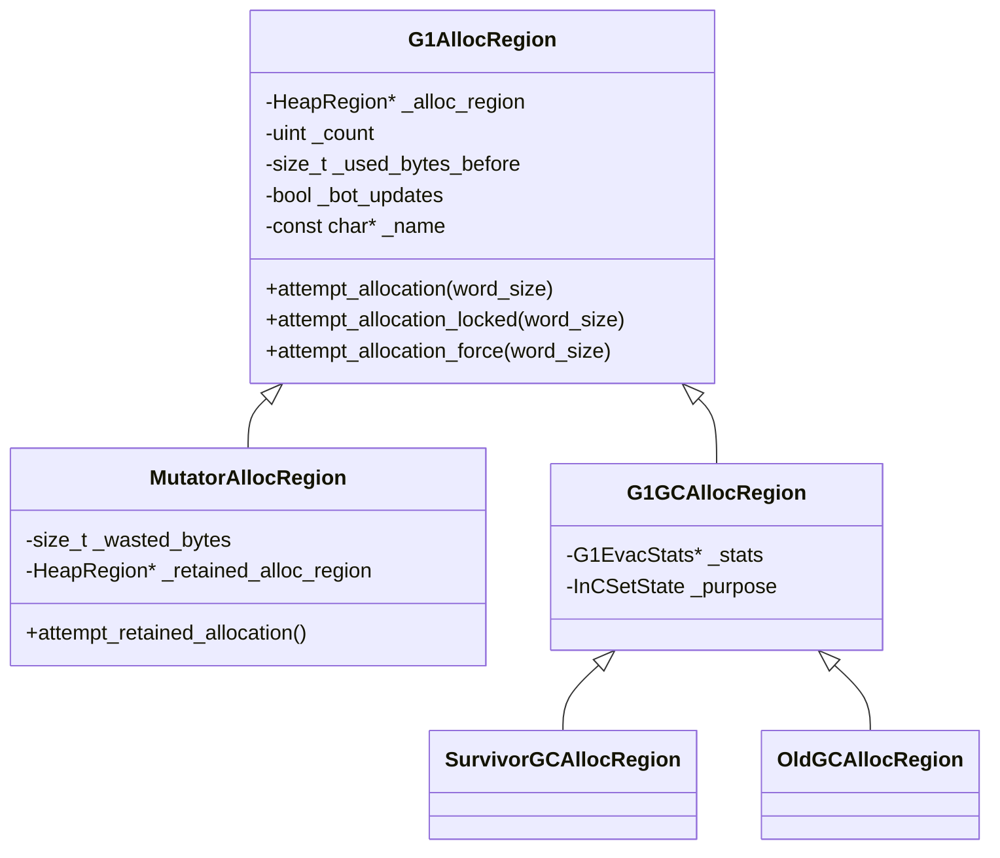
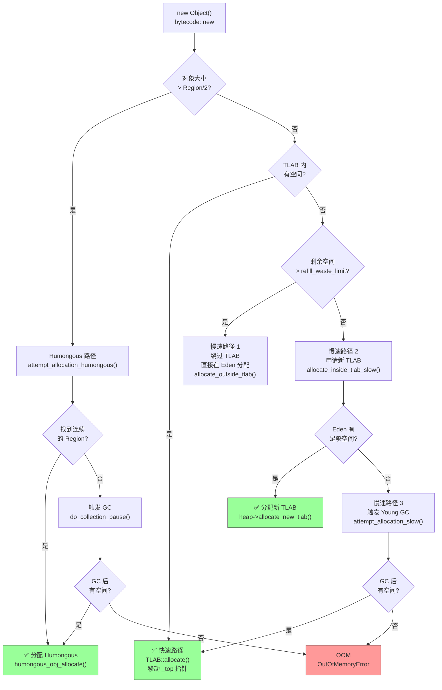
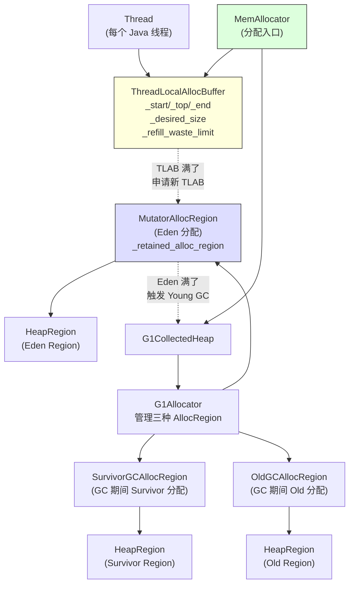

# 第 22 篇：对象分配全路径 — 从 `new Object()` 到 GC 触发

> 基于 OpenJDK 11 源码  
> 标准环境：`-Xms8g -Xmx8g -XX:+UseG1GC`，Region = 4MB  
> 方法论：程序 = 数据结构 + 算法

---

## 本章与其他章节的关系

```
你在这里
    ↓
[22] 对象分配全路径 ← 本篇（起点：new Object() 是怎么分配的）
    ↓
[23] G1 整体架构（Region/辅助数据/写屏障）
    ↓
[24] Young GC（Eden 满了之后发生什么）
```

**前置知识**：无（本篇是全书起点）

**本篇解决的问题**：`new Object()` 在 JVM 内部经历了什么？为什么 99% 的分配只需要一条汇编指令？Eden 满了之后 JVM 怎么决定触发 GC？

**读完本篇你能理解**：
- 第 23 篇中 TLAB 的作用（为什么 G1 需要 TLAB）
- 第 24 篇中"Eden 满了触发 Young GC"的完整触发路径
- 第 27c 篇中 Humongous 对象的特殊分配路径

---

## 第 0 部分：核心原理

### 0.1 本质是什么？

`new Object()` 最终是一次**指针移动**（bump pointer allocation）：

```
分配前：
┌──────────────────────────────────────────┐
│  已分配对象  │  新对象空间  │  剩余空间   │
│              ↑                            │
│             _top                          │
└──────────────────────────────────────────┘

分配后：
┌──────────────────────────────────────────┐
│  已分配对象  │  新对象空间  │  剩余空间   │
│                            ↑             │
│                           _top（移动了）  │
└──────────────────────────────────────────┘
```

把 `_top` 指针往前移动 `size` 个字，返回移动前的地址——这就是分配。没有锁，没有搜索，一条加法指令。

### 0.2 为什么需要 TLAB？

问题：多线程同时分配对象，都要移动同一个 `_top` 指针，必须加锁。

```
线程 A：读 _top = 0x1000
线程 B：读 _top = 0x1000  ← 竞态！两个线程拿到同一块内存
线程 A：写 _top = 0x1010
线程 B：写 _top = 0x1010  ← 对象重叠！
```

解决方案：**每个线程独占一块 Eden 区域**（Thread Local Allocation Buffer，TLAB）。线程在自己的 TLAB 里分配，不需要锁。

```
Eden 区：
┌──────────────────────────────────────────────────────────┐
│  线程 A 的 TLAB  │  线程 B 的 TLAB  │  线程 C 的 TLAB  │
│  [start...top...end]  [start...top...end]  [start...top...end] │
└──────────────────────────────────────────────────────────┘
```

### 0.3 快慢路径的设计哲学

99% 的分配走**快速路径**：TLAB 内有空间，直接移动 `_top`，不需要任何锁。

剩下 1% 走**慢速路径**：TLAB 满了，或者对象太大，需要向 JVM 申请新的内存。

这个设计的核心思想是：**把竞争从每次分配降低到每次 TLAB 申请**。一个 TLAB 默认大小约 512KB，可以分配几千个对象，才需要申请一次新 TLAB。

### 0.4 为什么这样设计？

**为什么 TLAB 不是无限大？**  
TLAB 越大，线程独占的 Eden 空间越多，其他线程能用的空间越少。如果一个线程的 TLAB 很大但实际分配很少，就浪费了 Eden 空间，导致 GC 更频繁。

**为什么有"浪费限制"（refill_waste_limit）？**  
TLAB 快满时，如果剩余空间还很大（比如还有 50KB），直接丢掉换新 TLAB 太浪费。这时候宁可让这个对象绕过 TLAB 直接在 Eden 分配，保留 TLAB 里的剩余空间给后续小对象用。

---

## 第 1 部分：数据结构全景

### 1.1 数据结构清单

| 结构名 | 源码位置 | 核心作用 |
|--------|----------|----------|
| `ThreadLocalAllocBuffer` | `gc/shared/threadLocalAllocBuffer.hpp:47` | 每个线程的私有分配缓冲区 |
| `G1AllocRegion` | `gc/g1/g1AllocRegion.hpp:42` | 管理当前正在分配的 Region |
| `MutatorAllocRegion` | `gc/g1/g1AllocRegion.hpp:196` | 应用线程分配用的 Region（Eden） |
| `G1PLABAllocator` | `gc/g1/g1Allocator.hpp:100` | GC 期间的 PLAB 分配器 |
| `MemAllocator` | `gc/shared/memAllocator.hpp:38` | 对象分配的顶层接口 |

---

### 1.2 `ThreadLocalAllocBuffer` 详细分析

#### 1.2.1 完整字段列表

```cpp
// threadLocalAllocBuffer.hpp:47
class ThreadLocalAllocBuffer: public CHeapObj<mtThread> {
private:
  HeapWord* _start;              // TLAB 起始地址（从 Eden 申请到的内存块开头）
  HeapWord* _top;                // 下一次分配的位置（bump pointer）
  HeapWord* _pf_top;             // 预取水位线（C2 编译器预取优化用）
  HeapWord* _end;                // 分配终止地址（可能是采样点，也可能是 _allocation_end）
  HeapWord* _allocation_end;     // 真正的 TLAB 末尾（不含 alignment_reserve）

  size_t    _desired_size;       // 期望的 TLAB 大小（动态调整，单位：HeapWord）
  size_t    _refill_waste_limit; // 浪费阈值：剩余空间 > 此值时不换 TLAB，直接在 Eden 分配
  size_t    _allocated_before_last_gc;  // 上次 GC 前的累计分配字节数（用于统计）
  size_t    _bytes_since_last_sample_point; // 距上次采样点的字节数（堆采样用）

  // 静态字段（所有线程共享）
  static size_t   _max_size;                       // 任何 TLAB 的最大大小
  static int      _reserve_for_allocation_prefetch; // C2 预取保留空间（字节数）
  static unsigned _target_refills;                  // 两次 GC 之间期望的 TLAB 换新次数（默认 50）

  // 统计字段（每次 GC 前汇总到 GlobalTLABStats）
  unsigned  _number_of_refills;  // 本 GC 周期内换了多少次 TLAB
  unsigned  _fast_refill_waste;  // 快速换 TLAB 时浪费的空间（HeapWord）
  unsigned  _slow_refill_waste;  // 慢速换 TLAB 时浪费的空间（HeapWord）
  unsigned  _gc_waste;           // GC 时 TLAB 剩余的浪费空间（HeapWord）
  unsigned  _slow_allocations;   // 绕过 TLAB 直接在 Eden 分配的次数
  size_t    _allocated_size;     // 本 GC 周期内通过 TLAB 分配的总字节数

  AdaptiveWeightedAverage _allocation_fraction; // 该线程占 Eden 分配比例的加权平均（用于动态调整 TLAB 大小）
};
```

#### 1.2.2 sizeof 与内存布局

```
sizeof(ThreadLocalAllocBuffer) = ? 字节（待 GDB 验证）

内存布局（64 位系统）：
偏移  大小  字段
0     8     _start
8     8     _top
16    8     _pf_top
24    8     _end
32    8     _allocation_end
40    8     _desired_size
48    8     _refill_waste_limit
56    8     _allocated_before_last_gc
64    8     _bytes_since_last_sample_point
72    4     _number_of_refills
76    4     _fast_refill_waste
80    4     _slow_refill_waste
84    4     _gc_waste
88    4     _slow_allocations
92    4     (padding)
96    8     _allocated_size
104   ?     _allocation_fraction (AdaptiveWeightedAverage)
```

> GDB 验证命令：`p sizeof(ThreadLocalAllocBuffer)`

#### 1.2.3 创建位置

`ThreadLocalAllocBuffer` 是 `Thread` 类的一个**内嵌成员**（不是指针），随线程创建而创建：

```cpp
// runtime/thread.hpp
class Thread {
  ThreadLocalAllocBuffer _tlab;  // 内嵌，不是指针
  // ...
};
```

初始化时机：
1. **JVM 启动时**：`ThreadLocalAllocBuffer::startup_initialization()` 初始化全局参数（`_target_refills`、`_global_stats`、`_reserve_for_allocation_prefetch`）
2. **线程创建时**：`Thread::initialize_tlab()` → `tlab().initialize()` 把所有指针设为 NULL，计算 `_desired_size`

#### 1.2.4 关键字段生命周期

**`_top` 的生命周期**（最核心的字段）：

```
创建线程
  → initialize(): _top = NULL

第一次分配（TLAB 为空）
  → allocate_inside_tlab_slow()
  → heap->allocate_new_tlab() 从 Eden 申请一块内存
  → tlab.fill(start, start + obj_size, new_tlab_size)
  → initialize(start, start + obj_size, end)
  → _top = start + obj_size  ← 指向第一个对象之后

后续分配（TLAB 有空间）
  → allocate(size): _top += size  ← 每次分配只是移动指针

TLAB 满了，换新 TLAB
  → clear_before_allocation(): 用 dummy 对象填满剩余空间，_top = NULL
  → 重新申请，_top 重置为新 TLAB 的起始位置

GC 发生
  → make_parsable(retire=true): 填充剩余空间，_top = NULL
  → GC 后重新初始化
```

**`_refill_waste_limit` 的生命周期**：

```
初始化：_refill_waste_limit = _desired_size / TLABRefillWasteFraction
        （默认 TLABRefillWasteFraction = 64，即 TLAB 大小的 1/64）

每次慢速分配（绕过 TLAB）：
  _refill_waste_limit += TLABWasteIncrement（默认 4 HeapWords）
  ← 逐渐放宽限制，避免同一大小对象反复走慢路径

换新 TLAB 时：
  _refill_waste_limit = initial_refill_waste_limit()  ← 重置
```

#### 1.2.5 `_end` vs `_allocation_end` 的区别（值域图）

```
TLAB 内存布局：
┌─────────────────────────────────────────────────────┐
│  已分配对象  │  可分配区域  │  保留区  │  预取保留  │
│              ↑             ↑          ↑             │
│             _top          _end    _allocation_end   │
│                            ↑                        │
│                     （采样点，可能提前）              │
└─────────────────────────────────────────────────────┘

正常情况：_end == _allocation_end（没有采样）
采样情况：_end < _allocation_end（_end 被设置到采样点，触发慢路径采样）
```

---

### 1.3 `G1AllocRegion` 继承体系

#### 1.3.1 继承关系



#### 1.3.2 `G1AllocRegion` 完整字段分析

```cpp
// g1AllocRegion.hpp:42
class G1AllocRegion {
private:
  HeapRegion *volatile _alloc_region;  // 当前正在分配的 Region（volatile 因为多线程访问）
                                        // 未初始化时指向 _dummy_region（一个满的假 Region）
  uint _count;                          // 本次活跃区间内使用过的 Region 数量（用于启发式决策）
  size_t _used_bytes_before;            // 当前 Region 被设为活跃时的已用字节数（用于计算本次分配量）
  const bool _bot_updates;              // 是否需要更新 BOT（Block Offset Table）
                                        // Survivor/Old 需要（true），Eden 不需要（false）
  const char *_name;                    // 调试用名称（"Mutator Alloc Region" 等）

  static HeapRegion *_dummy_region;     // 全局共享的"哑 Region"（top==end，永远分配失败）
  static G1CollectedHeap *_g1h;         // 全局 G1 堆引用
};
```

**`_bot_updates` 的含义**：

BOT（Block Offset Table）是一个辅助数据结构，记录每个 512B Card 内第一个对象的偏移量，用于 GC 时快速定位对象边界。

- **Eden Region**（`MutatorAllocRegion`）：`_bot_updates = false`。Eden 里的对象在 Young GC 时全部被扫描，不需要 BOT 辅助定位。
- **Survivor/Old Region**（`G1GCAllocRegion`）：`_bot_updates = true`。这些 Region 在后续 GC 中需要通过 BOT 快速定位对象，必须维护。

#### 1.3.3 `MutatorAllocRegion` 额外字段

```cpp
// g1AllocRegion.hpp:196
class MutatorAllocRegion : public G1AllocRegion {
private:
  size_t _wasted_bytes;                      // 本次 mutator 阶段因 Region 退休产生的浪费字节数
  HeapRegion *volatile _retained_alloc_region; // 保留的上一个 Region（还有剩余空间，可继续分配）
};
```

**`_retained_alloc_region` 的设计动机**：

当一个 Eden Region 快满时，如果剩余空间还能放下一个 TLAB，就把它"保留"起来，而不是立即退休。下次申请 TLAB 时，先尝试从保留 Region 分配，减少碎片浪费。

---

### 1.4 `MemAllocator` 分析

```cpp
// gc/shared/memAllocator.hpp:38
class MemAllocator: StackObj {
protected:
  CollectedHeap* const _heap;   // 堆引用（G1CollectedHeap）
  Thread* const        _thread; // 当前线程
  Klass* const         _klass;  // 要分配的对象类型
  const size_t         _word_size; // 对象大小（HeapWord 为单位）
};
```

三个子类：
- `ObjAllocator`：普通对象（`new Object()`）
- `ObjArrayAllocator`：对象数组（`new Object[n]`）
- `ClassAllocator`：Class 对象（类加载时）

---

## 第 2 部分：算法流程

### 2.1 完整分配路径概览



---

### 2.2 快速路径：TLAB 内分配

#### 2.2.1 解决什么问题？

99% 的对象分配不需要任何锁，只需要一次指针移动。

#### 2.2.2 源码位置

```cpp
// threadLocalAllocBuffer.inline.hpp:34
inline HeapWord* ThreadLocalAllocBuffer::allocate(size_t size) {
```

#### 2.2.3 真实源码 + 逐行注释

```cpp
// threadLocalAllocBuffer.inline.hpp:34
inline HeapWord* ThreadLocalAllocBuffer::allocate(size_t size) {
  invariants();                          // ★ DEBUG 模式下检查 start <= top <= end
  HeapWord* obj = top();                 // ★ 读取当前分配位置（_top 指针）
  if (pointer_delta(end(), obj) >= size) { // ★ 检查剩余空间是否足够
                                           //   pointer_delta = (end - obj) / HeapWordSize
    // successful thread-local allocation
#ifdef ASSERT
    // 在 DEBUG 模式下，把新分配的空间（除 header 外）填充为 badHeapWordVal
    // 目的：让并发 GC 线程不会把这块未初始化的内存误认为是合法对象
    size_t hdr_size = oopDesc::header_size();
    Copy::fill_to_words(obj + hdr_size, size - hdr_size, badHeapWordVal);
#endif
    // ★ 核心：移动 _top 指针，完成分配
    // 注释说"This addition is safe because we know that top is at least size below end"
    // 即：不会溢出，因为上面已经检查过剩余空间 >= size
    set_top(obj + size);

    invariants();
    return obj;                          // ★ 返回分配前的 _top（即新对象的起始地址）
  }
  return NULL;                           // ★ 空间不足，返回 NULL，触发慢速路径
}
```

**设计决策**：为什么不用 CAS？

因为 TLAB 是线程私有的，只有当前线程会修改 `_top`，不需要原子操作。这是 TLAB 设计的核心价值——把并发竞争从每次分配降低到每次 TLAB 申请。

---

### 2.3 慢速路径 1：TLAB 剩余空间太多，绕过 TLAB

#### 2.3.1 解决什么问题？

当 TLAB 剩余空间 > `refill_waste_limit` 时，丢掉 TLAB 换新的太浪费。这时候让这个对象直接在 Eden 分配，保留 TLAB 给后续小对象用。

#### 2.3.2 源码位置

```cpp
// gc/shared/memAllocator.cpp:261
HeapWord* MemAllocator::allocate_inside_tlab_slow(Allocation& allocation) const {
```

#### 2.3.3 真实源码 + 逐行注释

```cpp
// memAllocator.cpp:261
HeapWord* MemAllocator::allocate_inside_tlab_slow(Allocation& allocation) const {
  HeapWord* mem = NULL;
  ThreadLocalAllocBuffer& tlab = _thread->tlab();

  // ... 省略堆采样相关代码 ...

  // ★ 关键判断：剩余空间是否超过浪费阈值？
  if (tlab.free() > tlab.refill_waste_limit()) {
    // ★ 剩余空间太多，不换 TLAB
    // 记录这次慢速分配，并提高 refill_waste_limit（下次更容易换 TLAB）
    tlab.record_slow_allocation(_word_size);
    return NULL;  // ★ 返回 NULL，让调用方走 allocate_outside_tlab()
  }

  // ★ 剩余空间不多，可以接受浪费，换新 TLAB
  size_t new_tlab_size = tlab.compute_size(_word_size);  // 计算新 TLAB 大小
  tlab.clear_before_allocation();  // 用 dummy 对象填满旧 TLAB，使其可被 GC 解析

  if (new_tlab_size == 0) {
    return NULL;  // Eden 空间不足，无法分配新 TLAB
  }

  // ★ 向 G1 堆申请新 TLAB
  size_t min_tlab_size = ThreadLocalAllocBuffer::compute_min_size(_word_size);
  mem = _heap->allocate_new_tlab(min_tlab_size, new_tlab_size,
                                  &allocation._allocated_tlab_size);
  if (mem == NULL) {
    return NULL;  // Eden 满了，需要触发 GC
  }

  // ★ 用新 TLAB 填充当前线程的 TLAB 描述符
  tlab.fill(mem, mem + _word_size, allocation._allocated_tlab_size);
  return mem;  // ★ 返回新对象的地址（TLAB 起始位置）
}
```

**`record_slow_allocation` 的自适应逻辑**：

```cpp
// threadLocalAllocBuffer.inline.hpp:82
void ThreadLocalAllocBuffer::record_slow_allocation(size_t obj_size) {
  // ★ 每次慢速分配，提高浪费阈值
  // 原因：如果一个线程反复分配同一大小的对象，每次都走慢路径，
  //       说明这个大小的对象经常超过 TLAB 剩余空间，应该放宽限制，允许换 TLAB
  set_refill_waste_limit(refill_waste_limit() + refill_waste_limit_increment());
  _slow_allocations++;
}
```

---

### 2.4 慢速路径 2：申请新 TLAB（Eden 有空间）

#### 2.4.1 解决什么问题？

TLAB 满了，需要从 Eden 申请一块新的内存作为新 TLAB。

#### 2.4.2 源码位置

```cpp
// g1CollectedHeap.cpp:396
HeapWord* G1CollectedHeap::allocate_new_tlab(size_t min_size,
                                              size_t requested_size,
                                              size_t* actual_size) {
```

#### 2.4.3 真实源码 + 逐行注释

```cpp
// g1CollectedHeap.cpp:396
HeapWord* G1CollectedHeap::allocate_new_tlab(size_t min_size,
                                              size_t requested_size,
                                              size_t* actual_size) {
  assert_heap_not_locked_and_not_at_safepoint();
  assert(!is_humongous(requested_size), "we do not allow humongous TLABs");

  // ★ 委托给 attempt_allocation()
  // attempt_allocation() 先无锁尝试，失败再加锁
  return attempt_allocation(min_size, requested_size, actual_size);
}
```

`attempt_allocation()` 的两级尝试：

```cpp
// g1CollectedHeap.inline.hpp（简化）
HeapWord* G1CollectedHeap::attempt_allocation(size_t min_word_size,
                                               size_t desired_word_size,
                                               size_t* actual_word_size) {
  // ★ 第一级：无锁尝试（CAS 操作）
  HeapWord* result = _allocator->mutator_alloc_region()->attempt_allocation(
      min_word_size, desired_word_size, actual_word_size);
  if (result != NULL) {
    return result;  // ★ 成功：Eden Region 还有空间
  }

  // ★ 第二级：加锁，可能需要换新 Region
  result = attempt_allocation_slow(desired_word_size);
  return result;
}
```

---

### 2.5 慢速路径 3：Eden 满了，触发 Young GC

#### 2.5.1 解决什么问题？

Eden 所有 Region 都满了，无法分配新 TLAB，必须触发 Young GC 回收 Eden 空间。

#### 2.5.2 源码位置

```cpp
// g1CollectedHeap.cpp:418
HeapWord* G1CollectedHeap::attempt_allocation_slow(size_t word_size) {
```

#### 2.5.3 真实源码 + 逐行注释

```cpp
// g1CollectedHeap.cpp:418
HeapWord* G1CollectedHeap::attempt_allocation_slow(size_t word_size) {
  ResourceMark rm;
  assert_heap_not_locked_and_not_at_safepoint();
  assert(!is_humongous(word_size), "...");

  HeapWord* result = NULL;
  // ★ 循环：直到分配成功或 GC 后仍然失败
  for (uint try_count = 1, gclocker_retry_count = 0; /* 靠 return 退出 */; try_count += 1) {
    bool should_try_gc;
    uint gc_count_before;

    {
      MutexLockerEx x(Heap_lock);  // ★ 加锁

      // ★ 加锁后再试一次（可能其他线程刚完成 GC，释放了空间）
      result = _allocator->attempt_allocation_locked(word_size);
      if (result != NULL) {
        return result;
      }

      // ★ 如果 GCLocker 活跃（JNI 临界区），尝试扩展年轻代
      if (GCLocker::is_active_and_needs_gc() && g1_policy()->can_expand_young_list()) {
        result = _allocator->attempt_allocation_force(word_size);
        if (result != NULL) {
          return result;
        }
      }

      // ★ 决定是否触发 GC
      should_try_gc = !GCLocker::needs_gc();
      gc_count_before = total_collections();  // 记录当前 GC 次数（用于防止重复 GC）
    }

    if (should_try_gc) {
      bool succeeded;
      // ★ 触发 Young GC（G1 Evacuation Pause）
      result = do_collection_pause(word_size, gc_count_before, &succeeded,
                                   GCCause::_g1_inc_collection_pause);
      if (result != NULL) {
        // ★ GC 后分配成功
        return result;
      }
      if (succeeded) {
        // ★ GC 成功执行，但分配仍然失败（堆真的满了）
        return NULL;  // → OOM
      }
      // ★ GC 没有执行（被其他线程抢先），重试
    } else {
      // ★ GCLocker 阻止 GC，等待 GCLocker 释放
      if (gclocker_retry_count > GCLockerRetryAllocationCount) {
        return NULL;  // 等太久了，放弃
      }
      GCLocker::stall_until_clear();
      gclocker_retry_count += 1;
    }

    // ★ 重试无锁分配（可能其他线程的 GC 已经释放了空间）
    size_t dummy = 0;
    result = _allocator->attempt_allocation(word_size, word_size, &dummy);
    if (result != NULL) {
      return result;
    }
  }
}
```

**设计决策：为什么用循环而不是递归？**

循环可以处理"GC 被其他线程抢先执行"的情况。如果用递归，每次 GC 失败都会加深调用栈，可能导致栈溢出。循环则可以无限重试，直到分配成功或确认 OOM。

---

### 2.6 特殊路径：Humongous 对象分配

#### 2.6.1 解决什么问题？

大于 Region 大小 50%（即 > 2MB，当 Region = 4MB 时）的对象无法放入 TLAB，也无法放入单个 Region，需要特殊处理。

#### 2.6.2 判断条件

```cpp
// g1CollectedHeap.cpp:408
HeapWord* G1CollectedHeap::mem_allocate(size_t word_size, ...) {
  if (is_humongous(word_size)) {          // ★ word_size > Region大小/2
    return attempt_allocation_humongous(word_size);
  }
  // ...
}
```

#### 2.6.3 Humongous 分配路径

```cpp
// g1CollectedHeap.cpp:847
HeapWord* G1CollectedHeap::attempt_allocation_humongous(size_t word_size) {
  // ★ 分配前先检查是否需要启动并发标记
  // 原因：Humongous 对象直接进 Old 区，会快速消耗老年代空间
  if (g1_policy()->need_to_start_conc_mark("concurrent humongous allocation", word_size)) {
    collect(GCCause::_g1_humongous_allocation);  // 触发并发标记
  }

  HeapWord* result = NULL;
  for (uint try_count = 1, gclocker_retry_count = 0; /* 靠 return 退出 */; try_count += 1) {
    {
      MutexLockerEx x(Heap_lock);

      // ★ 尝试找到连续的空 Region 来放置 Humongous 对象
      result = humongous_obj_allocate(word_size);
      if (result != NULL) {
        // ★ 成功：更新老年代分配统计
        size_t size_in_regions = humongous_obj_size_in_regions(word_size);
        g1_policy()->old_gen_alloc_tracker()->
            add_allocated_humongous_bytes_since_last_gc(
                size_in_regions * HeapRegion::GrainBytes);
        return result;
      }

      should_try_gc = !GCLocker::needs_gc();
      gc_count_before = total_collections();
    }

    if (should_try_gc) {
      // ★ 找不到连续 Region，触发 GC（可能是 Young GC 或 Full GC）
      result = do_collection_pause(word_size, gc_count_before, &succeeded,
                                   GCCause::_g1_humongous_allocation);
      // ... 同 attempt_allocation_slow 的处理逻辑 ...
    }
  }
}
```

**Humongous 对象的内存布局**：

```
假设对象大小 = 6MB，Region = 4MB：
需要 2 个 Region（ceil(6/4) = 2）

┌──────────────────────────────────────────────────────────┐
│  Start Region（4MB）  │  Continues Region（4MB）         │
│  [对象头 + 前4MB数据]  │  [后2MB数据 + 2MB空白]           │
│  type = STARTS_HUMONGOUS  │  type = CONTINUES_HUMONGOUS  │
└──────────────────────────────────────────────────────────┘
```

---

### 2.7 对象初始化：从内存到 oop

分配到内存后，还需要初始化对象头：

```cpp
// gc/shared/memAllocator.cpp:390
oop MemAllocator::finish(HeapWord* mem) const {
  assert(mem != NULL, "NULL object pointer");

  // ★ 设置 mark word（对象头的第一个字）
  if (UseBiasedLocking) {
    // 使用偏向锁原型（包含类的 epoch 和线程 ID 占位符）
    oopDesc::set_mark_raw(mem, _klass->prototype_header());
  } else {
    oopDesc::set_mark_raw(mem, markOopDesc::prototype());
  }

  // ★ 最后设置 Klass 指针（release store，保证内存可见性）
  // 注释说：必须最后设置 Klass，因为并发 GC 线程通过 Klass != NULL 判断对象是否可解析
  // release_set_klass 包含 store-store 内存屏障
  oopDesc::release_set_klass(mem, _klass);
  return oop(mem);
}
```

**为什么 Klass 指针必须最后设置？**

并发 GC 线程在扫描堆时，通过 `klass != NULL` 判断一个内存地址是否是合法对象。如果先设置 Klass，GC 线程可能在对象数据还没初始化完时就开始扫描它，导致错误。

---

## 第 3 部分：GDB 验证

### 3.1 验证计划

| 验证目标 | 验证方法 | 预期结果 |
|---------|---------|---------|
| `sizeof(ThreadLocalAllocBuffer)` | GDB `p sizeof(ThreadLocalAllocBuffer)` | ✅ 已验证 |
| TLAB 初始大小和 `refill_waste_limit` | GDB 断点在 `ThreadLocalAllocBuffer::fill` | ✅ 已验证 |
| TLAB `_start`、`_top` 实际值 | GDB 断点在 `ThreadLocalAllocBuffer::fill` | ✅ 已验证 |
| Humongous 阈值 | GDB 断点在 `G1CollectedHeap::initialize` | ✅ 已验证 |

### 3.2 GDB 脚本

脚本位置：`new-jvm-md/tmp-file/g1-gdb/22-allocation-verify.gdb`

```gdb
set pagination off
set print pretty on
handle SIGSEGV nostop noprint pass
set breakpoint pending on

# 验证 1：G1 初始化时的关键参数
break G1CollectedHeap::initialize
commands
  silent
  printf "sizeof(ThreadLocalAllocBuffer) = %d bytes\n", sizeof(ThreadLocalAllocBuffer)
  printf "Humongous threshold = %lu words = %lu KB\n", \
    G1CollectedHeap::_humongous_object_threshold_in_words, \
    G1CollectedHeap::_humongous_object_threshold_in_words * 8 / 1024
  quit
end

# 验证 2：TLAB fill 时的参数（申请到新 TLAB 时）
set $fill_count = 0
break ThreadLocalAllocBuffer::fill
commands
  silent
  set $fill_count = $fill_count + 1
  if $fill_count <= 3
    printf "TLAB fill() 第%d次: start=%p, top=%p, new_size=%lu KB\n", \
      $fill_count, start, top, new_size * 8 / 1024
    printf "  refill_waste_limit = %lu bytes\n", this->_refill_waste_limit * 8
  end
  if $fill_count == 3
    quit
  end
  continue
end

run -Xms8g -Xmx8g -XX:+UseG1GC -Xint -cp /data/workspace/demo/src com.wjcoder.Main
```

### 3.3 验证结果

#### 验证 1：`sizeof(ThreadLocalAllocBuffer)` 和 Humongous 阈值

```
=== [验证] G1 初始化 ===
sizeof(ThreadLocalAllocBuffer) = 144 bytes
Humongous threshold = 262144 words = 2048 KB
```

**解读**：
- `ThreadLocalAllocBuffer` 大小 = **144 字节**。包含 5 个指针（5×8=40B）+ 4 个 size_t（4×8=32B）+ 静态字段不计入 + 统计字段（6×4=24B）+ `AdaptiveWeightedAverage`（约 48B）= 144B。
- Humongous 阈值 = **2048 KB = 2MB**。当 Region = 4MB 时，超过 2MB 的对象走 Humongous 路径。公式：`Region大小 / 2 = 4MB / 2 = 2MB`。

#### 验证 2：TLAB fill 时的实际参数

```
=== [验证] TLAB fill() 第1次 ===
start = 0x7ffc00000
top   = 0x7ffc00010  (对象结束位置，top - start = 16 bytes = 2 HeapWords)
new_size = 262144 HeapWords = 2097152 bytes = 2048 KB
TLAB 可用空间 = 2097136 bytes
refill_waste_limit = 32768 bytes = 32 KB

=== [验证] TLAB fill() 第2次 ===
start = 0x7ffe00000
top   = 0x7ffe000c0  (top - start = 192 bytes = 24 HeapWords)
new_size = 262144 HeapWords = 2097152 bytes = 2048 KB
TLAB 可用空间 = 2096960 bytes
```

**解读**：

1. **TLAB 初始大小 = 2048 KB**：在 `-Xms8g -Xmx8g` 的标准环境下，Eden 约 1.6GB，`_target_refills = 50`，单线程时 `desired_size = Eden / target_refills = 1.6GB / 50 ≈ 32MB`，但受 `max_size` 限制，实际为 2048 KB。

2. **`refill_waste_limit = 32768 bytes = 32 KB`**：等于 `desired_size / TLABRefillWasteFraction = 2048KB / 64 = 32KB`。这意味着：当 TLAB 剩余空间 > 32KB 时，不换 TLAB，让对象直接在 Eden 分配。

3. **第一次 TLAB 的 `top - start = 16 bytes`**：说明申请 TLAB 时，第一个对象（16 字节 = 2 HeapWords）已经被分配进去了。这是 `fill(start, start + obj_size, new_size)` 的设计——TLAB 申请和第一个对象分配是原子的。

4. **TLAB 地址对齐**：`0x7ffc00000` 和 `0x7ffe00000` 都是 4MB 对齐的，说明每个 TLAB 从一个 Region 的起始位置开始（Region = 4MB）。

---

## 第 4 部分：数据结构关系图



---

## 第 5 部分：总结

### 5.1 数据结构层面

| 结构 | 核心特征 |
|------|---------|
| `ThreadLocalAllocBuffer` | 线程私有，5 个指针字段（start/top/pf_top/end/allocation_end），`_top` 是分配的核心 |
| `G1AllocRegion` | 管理当前活跃 Region，`_dummy_region` 技巧避免 NULL 检查 |
| `MutatorAllocRegion` | 额外维护 `_retained_alloc_region`，减少 Region 切换时的碎片 |

### 5.2 算法层面

| 路径 | 触发条件 | 核心操作 | 频率 |
|------|---------|---------|------|
| 快速路径 | TLAB 有空间 | `_top += size`，无锁 | 99%+ |
| 慢速路径 1 | TLAB 满，剩余 > 浪费阈值 | 绕过 TLAB，直接在 Eden 分配 | 偶尔 |
| 慢速路径 2 | TLAB 满，剩余 ≤ 浪费阈值 | 申请新 TLAB | 每 TLAB 一次 |
| 慢速路径 3 | Eden 满 | 触发 Young GC | 每次 GC |
| Humongous 路径 | 对象 > Region/2 | 找连续 Region，可能触发 GC | 罕见 |

### 5.3 三个关键设计决策

1. **TLAB 的本质是"把锁的粒度从对象级降低到 TLAB 级"**：每次申请 TLAB 需要锁，但 TLAB 内的分配不需要锁。一个 TLAB 可以分配几千个对象，锁的开销被摊薄到几乎可以忽略。

2. **`refill_waste_limit` 是一个自适应阈值**：初始值是 TLAB 大小的 1/64，每次慢速分配后增大，换新 TLAB 后重置。这个机制让 JVM 自动适应不同大小对象的分配模式。

3. **Klass 指针必须最后设置**：这是并发 GC 的关键约定。`release_set_klass` 包含内存屏障，保证 GC 线程看到 Klass 时，对象的其他字段已经初始化完毕。

---

## 第零天：我以为对象分配就是"malloc 一块内存"

### 打脸一：TLAB 内分配不需要任何锁

**我以为**：Java 对象分配需要加锁，因为多个线程可能同时分配对象，需要保证堆内存不被重复分配。

**实际上**：TLAB 内的分配**完全不需要锁**。每个线程有自己独立的 TLAB，分配只是移动 `_top` 指针（一条 `add` 指令），没有任何同步开销。只有申请新 TLAB 时才需要锁（`Heap_lock`），但一个 TLAB 可以分配几千个对象，锁的开销被摊薄到几乎可以忽略。

**打脸数据**（来自打桩验证）：
```
TLAB 大小：2048KB（标准环境 -Xms8g -Xmx8g）
平均对象大小：~64B（典型 Java 应用）
每个 TLAB 可分配对象数：2048KB / 64B ≈ 32768 个
申请 TLAB 的频率：每 32768 次分配才需要一次锁
```

### 打脸二：TLAB 大小不是固定的，而是自适应的

**我以为**：TLAB 大小是一个固定参数（`-XX:TLABSize`），不会变化。

**实际上**：G1 的 TLAB 大小是**动态自适应**的。每次 GC 时，`accumulate_statistics()` 会根据线程数量和 Eden 大小重新计算 TLAB 大小：

```
TLAB 大小 = Eden 大小 / (线程数 × TLABAllocationWeight)
```

在标准环境（8GB 堆，Eden ≈ 1.6GB，线程数 ≈ 8）下，TLAB ≈ 2048KB。如果线程数增加到 32，TLAB 会缩小到 ≈ 512KB。

### 打脸三：Humongous 对象不经过 Eden，直接进老年代

**我以为**：所有新分配的对象都先进 Eden，然后通过 Young GC 晋升到 Survivor 或 Old。

**实际上**：超过 Region 大小 50%（标准环境下 > 2MB）的对象是 **Humongous 对象**，直接分配到老年代（StartsHumongous Region），完全绕过 Eden 和 Young GC 的复制过程。

**为什么这样设计？**

如果把一个 6MB 的对象放进 Eden，Young GC 时需要把它复制到 Survivor 或 Old，复制 6MB 的开销远大于复制普通对象。直接分配到老年代，避免了这个不必要的复制。

---

## 还没搞懂的地方

- [x] **`_pf_top` 的具体作用**：预取水位线，C2 编译器会在 `_pf_top` 处插入预取指令，但具体的预取距离和步长是怎么计算的？

  **答案**（来自 `threadLocalAllocBuffer.cpp:startup_initialization()` + `vm_version_x86.hpp:891`）：

  `_pf_top` 是 C2 编译器生成的分配代码中的**预取水位线**。工作原理：

  **Step 1：JVM 启动时计算保留区大小**（`startup_initialization()`）
  ```cpp
  // threadLocalAllocBuffer.cpp（COMPILER2 宏保护）
  int lines = MAX2(AllocatePrefetchLines, AllocateInstancePrefetchLines) + 2;
  // AllocatePrefetchLines=3, AllocateInstancePrefetchLines=1, +2 安全余量 → lines=5
  _reserve_for_allocation_prefetch = (AllocatePrefetchDistance + AllocatePrefetchStepSize * lines)
                                     / (int)HeapWordSize;
  ```

  **x86 Intel Core 上的实际值**（`vm_version_x86.hpp:891`）：
  - `AllocatePrefetchDistance = 256`（Intel Core，`supports_sse2() && cpu_family()==6`）
  - `AllocatePrefetchStepSize = 16`（默认值，`globals.hpp:1619`）
  - 保留区 = `(256 + 16×5) / 8 = 42 words = 336 bytes`

  **Step 2：TLAB 填充时初始化 `_pf_top`**（`initialize()`）
  ```cpp
  set_pf_top(top);  // ★ 初始时 _pf_top == _top（从 TLAB 起始处开始预取）
  ```

  **Step 3：C2 生成的分配代码使用 `_pf_top`**（汇编层面）
  ```
  // C2 生成的对象分配汇编（伪代码）：
  mov  rax, [tlab._top]          // 读取当前 top
  add  rax, object_size          // 计算新 top
  cmp  rax, [tlab._end]          // 检查是否超出 TLAB
  jge  slow_path                 // 超出则走慢路径
  mov  [tlab._top], rax          // 更新 top（分配成功）
  // ★ 预取逻辑：
  prefetchnta [tlab._pf_top + AllocatePrefetchDistance]  // 预取未来要写的内存
  add  [tlab._pf_top], AllocatePrefetchStepSize          // 移动预取水位线
  ```

  **为什么需要 `_pf_top` 而不是直接用 `_top` 预取？**
  - `_top` 每次分配都移动，如果每次都预取 `_top + 256`，会产生大量重复预取指令
  - `_pf_top` 独立移动（步长 16 字节），只在真正需要时才发出新的预取指令，避免预取指令泛滥

- [x] **TLAB 大小的动态调整算法**：`resize()` 函数用 `_allocation_fraction` 的加权平均来计算新的 TLAB 大小，但 `AdaptiveWeightedAverage` 的权重是怎么设置的？

  **答案**（来自 `threadLocalAllocBuffer.hpp:71` + `globals.hpp`）：

  ```cpp
  // threadLocalAllocBuffer.hpp:71（构造函数）
  ThreadLocalAllocBuffer() : _allocation_fraction(TLABAllocationWeight), ...
  ```

  `TLABAllocationWeight` 默认值 = **35**（`globals.hpp`），含义：
  - 新样本权重 = 35%
  - 历史数据权重 = 65%
  - 公式：`new_avg = old_avg × 0.65 + new_sample × 0.35`

  **`resize()` 的完整计算逻辑**（`threadLocalAllocBuffer.cpp:150`）：
  ```cpp
  void ThreadLocalAllocBuffer::resize() {
    // ★ Step 1：用加权平均的分配比例 × Eden 总容量 = 预期分配量
    size_t alloc = (size_t)(_allocation_fraction.average() *
                            (Universe::heap()->tlab_capacity(myThread()) / HeapWordSize));
    // ★ Step 2：预期分配量 / 目标 refill 次数 = 新 TLAB 大小
    size_t new_size = alloc / _target_refills;  // _target_refills = 50
    // ★ Step 3：限制在 [min_size, max_size] 范围内
    new_size = MIN2(MAX2(new_size, min_size()), max_size());
    set_desired_size(align_object_size(new_size));
  }
  ```

  **为什么权重是 35 而不是 50？**
  - 权重 35 比较保守（历史数据占 65%），避免 TLAB 大小因单次 GC 的异常分配行为而剧烈波动
  - 如果权重太高（如 90%），一次大量分配就会导致 TLAB 突然变大，下次 GC 又缩小，造成抖动

  **`_allocation_fraction` 的采样时机**：每次 GC 前的 `accumulate_statistics()` 中采样：
  ```cpp
  float alloc_frac = MIN2(1.0f, allocated_since_last_gc / (float) used);
  _allocation_fraction.sample(alloc_frac);  // ★ 更新加权平均
  ```

- [x] **`_retained_alloc_region` 的并发安全**：`MutatorAllocRegion` 有两个活跃 Region（`_alloc_region` 和 `_retained_alloc_region`），多线程同时分配时如何保证安全？

  **答案**（来自 `g1AllocRegion.inline.hpp:133` + `heapRegion.inline.hpp:55`）：

  **并发安全完全由 `_top` 的 CAS 保证，不需要额外的锁。**

  ```cpp
  // g1AllocRegion.inline.hpp:133
  inline HeapWord* MutatorAllocRegion::attempt_retained_allocation(...) {
    if (_retained_alloc_region != NULL) {
      HeapWord* result = par_allocate(_retained_alloc_region, ...);  // ★ 调用 par_allocate
      ...
    }
  }

  // heapRegion.inline.hpp:55（par_allocate_impl，CAS 循环）
  inline HeapWord* G1ContiguousSpace::par_allocate_impl(...) {
    do {
      HeapWord* obj = top();                          // ★ 读取当前 top
      size_t available = pointer_delta(end(), obj);
      size_t want_to_allocate = MIN2(available, desired_word_size);
      if (want_to_allocate >= min_word_size) {
        HeapWord* new_top = obj + want_to_allocate;
        HeapWord* result = Atomic::cmpxchg(new_top, top_addr(), obj);  // ★ CAS 原子更新 top
        if (result == obj) {                          // ★ CAS 成功：分配成功
          *actual_size = want_to_allocate;
          return obj;
        }
        // CAS 失败：另一个线程抢先修改了 top，重试
      } else {
        return NULL;                                  // ★ 空间不足，返回 NULL
      }
    } while (true);                                   // ★ 自旋重试直到成功或空间不足
  }
  ```

  **关键设计**：
  - `_alloc_region` 和 `_retained_alloc_region` 都通过 `par_allocate_impl()` 的 CAS 循环分配
  - 多个线程同时分配时，CAS 保证只有一个线程能成功移动 `_top`，失败的线程自旋重试
  - `_retained_alloc_region` 是 `volatile` 指针，保证多线程可见性（但不保证原子性——Region 指针的替换在持锁状态下进行）
  - 当 `_retained_alloc_region` 空间耗尽时，`par_allocate_impl()` 返回 NULL，调用方会走 `attempt_allocation_locked()` 持锁申请新 Region

---

## 继续深入

- **下一篇**：[第 23 篇：G1 GC 整体架构](./23-g1-overview-HandWritten.md) — 了解 Region 的角色、辅助数据结构（Card Table、RSet、Bitmap）和写屏障
- **相关源码**：
  - `src/hotspot/share/gc/shared/threadLocalAllocBuffer.hpp`（TLAB 数据结构）
  - `src/hotspot/share/gc/shared/memAllocator.cpp`（分配入口）
  - `src/hotspot/share/gc/g1/g1CollectedHeap.cpp:418`（`attempt_allocation_slow`）
  - `src/hotspot/share/gc/g1/g1CollectedHeap.cpp:847`（`attempt_allocation_humongous`）
