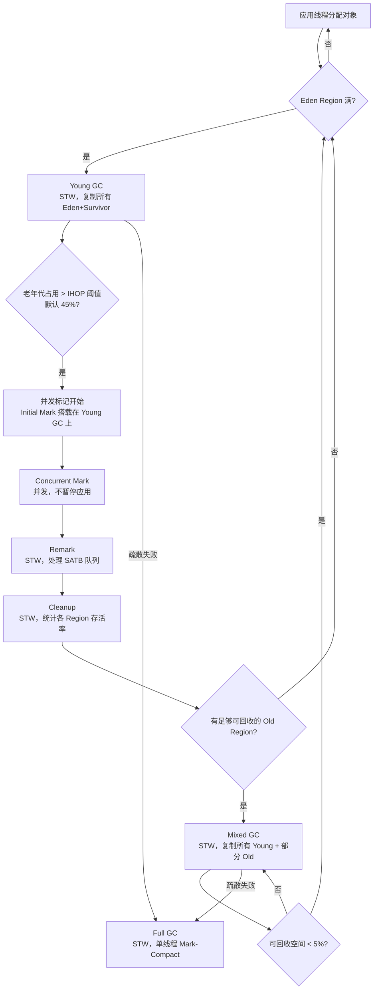
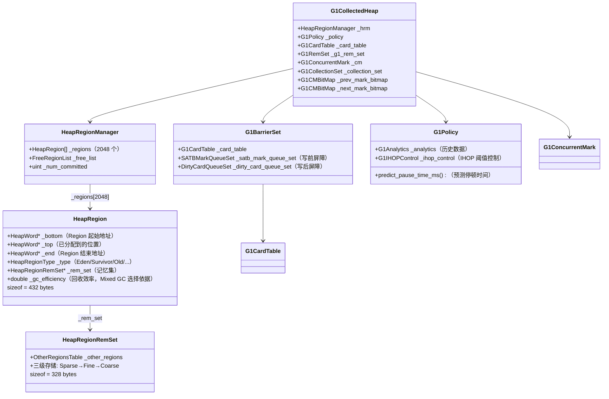
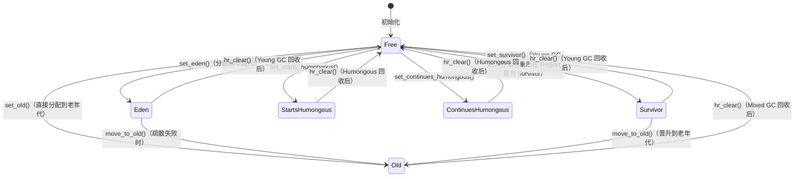
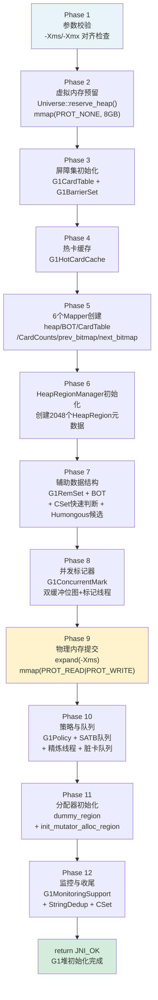

# 23 · G1 GC — 从"什么是垃圾"到"怎么回收"

> 基于 OpenJDK 11 源码，`-Xms8g -Xmx8g -XX:+UseG1GC -Xint`

---

## 本章与其他章节的关系

```
[22] 对象分配全路径（new Object() 的完整路径）
    ↓
你在这里
    ↓
[23] G1 整体架构 ← 本篇（G1 的全局视角：Region/辅助数据/写屏障）
    ↓
[24] Young GC（具体的 GC 执行流程）
    ↓
[25] RSet（第 24 篇依赖的跨代引用索引）
```

**前置知识**：第 22 篇（对象分配，了解 TLAB/Eden 的概念）

**本篇解决的问题**：G1 GC 的整体架构是什么？Region 是怎么组织的？304MB 辅助数据是什么？写屏障为什么需要两个？

**读完本篇你能理解**：
- 第 24 篇中 Young GC 为什么需要扫描 RSet（跨代引用问题）
- 第 25 篇中 RSet 三级存储的设计动机
- 第 26 篇中 SATB 写屏障的作用
- 第 28 篇中 SafePoint 与 GC 的关系

---

## 第 0 部分：核心原理 ⭐

### 0.1 本质是什么？

G1 GC 的本质是：**把堆切成等大的 Region，用预测模型在停顿时间预算内选择最值得回收的 Region 集合，增量式地完成垃圾回收。**

传统 GC 的堆是连续的分代空间（Young/Old），每次 GC 要么回收整个 Young 代，要么回收整个 Old 代。G1 把这个"全量回收"变成了"按 Region 增量回收"——每次 GC 只选一部分 Region，停顿时间与选中的 Region 数量成正比，可以精确控制。

### 0.2 为什么需要？

**根本问题**：随着堆越来越大（从 GB 到数十 GB），传统分代 GC 的停顿时间越来越长：

- **Parallel GC**：Old 区 Full GC 停顿随堆大小线性增长，32GB 堆可能停顿 30 秒
- **CMS**：并发标记减少了停顿，但不压缩内存 → 碎片化 → 最终触发 Serial Full GC，停顿更长
- **根本矛盾**：大堆 + 低停顿 + 高吞吐，三者不可兼得

G1 的目标是：**在可接受的吞吐量损失下，把停顿时间控制在用户指定的目标以内（`-XX:MaxGCPauseMillis`）**。

### 0.3 怎么解决？

G1 的核心设计是三层机制的组合：

**第一层：Region 化堆**（解决"必须全量回收"的问题）
- 把堆切成 2048 个等大的 Region（默认 4MB），每个 Region 可以独立扮演 Eden/Survivor/Old/Humongous 角色
- 每次 GC 只选一部分 Region（Collection Set），不需要回收整个堆

**第二层：辅助数据结构**（解决"跨 Region 引用"的问题）
- **RSet（Remembered Set）**：每个 Region 记录"谁引用了我"，Young GC 时不需要扫描整个 Old 区
- **Card Table**：512B 粒度的脏卡标记，写屏障维护，是 RSet 的基础
- **SATB 位图**：并发标记时记录存活对象，是 Mixed GC 选 Region 的依据

**第三层：预测模型**（解决"停顿时间不可控"的问题）
- `G1Analytics` + `TruncatedSeq`（衰减均值）预测每个 Region 的回收耗时
- 在停顿时间预算内贪心选择 Region，保证停顿时间可预测

### 0.4 为什么这样设计？

**为什么 Region 大小固定（而不是可变）？**
固定大小让 Region 可以用数组索引（`_hrm_index`）而不是指针查找，`O(1)` 定位任意 Region。可变大小会引入碎片化问题，反而更复杂。

**为什么辅助数据结构要占 304MB？**
RSet + Card Table + SATB 位图 + Region 元数据，这些是 G1 能做增量回收的"代价"。传统 GC 不需要这些，但也无法做增量回收。这是一个空间换时间的设计决策。

**为什么用衰减均值而不是简单平均？**
GC 行为会随应用负载变化。衰减均值让最近的数据权重更大，能快速响应 GC 行为的变化，而简单平均会被历史数据"拖累"，反应迟钝。

---

## 写在前面

我不会上来就给你讲 Region、RSet、SATB。

我会先问你几个问题，让你自己想一想，然后告诉你 JVM 的真实答案。

这篇文章分四个部分：
1. **背景知识**：什么是 GC？为什么需要 GC？
2. **堆内存结构**：JVM 的内存长什么样？Java 堆和 C 堆有什么区别？
3. **G1 GC 的设计**：我以为是 xxx，结果是 xxx，为什么？
4. **TODO**：涉及到的其他模块，留待后续深入

---

## 第一部分：背景知识 — 什么是 GC，为什么需要它

### 先问你一个问题

你写 Java 代码，`new` 了一个对象，用完之后不需要了。

**这块内存谁来释放？**

在 C/C++ 里，你必须手动 `free()`。忘了 `free()` → 内存泄漏。`free()` 两次 → 程序崩溃。

Java 的答案是：**你不用管，JVM 帮你管。**

这就是 GC（Garbage Collection，垃圾回收）的本质：**自动识别不再被使用的对象，回收它们占用的内存。**

---

### 什么叫"不再被使用"？

这是 GC 最核心的问题。

最直觉的答案：**没有任何引用指向这个对象，它就是垃圾。**

```java
Object a = new Object();  // 有引用，不是垃圾
a = null;                 // 没有引用了，是垃圾
```

但现实更复杂：

```java
Object a = new Object();
Object b = new Object();
a.next = b;   // a 引用 b
b.next = a;   // b 引用 a（循环引用！）
a = null;
b = null;
// a 和 b 互相引用，但外部没有任何引用指向它们
// 它们是垃圾吗？是的！但"没有引用"的判断失效了
```

所以 JVM 用的不是"引用计数"，而是**可达性分析**：

```
从一组"根"（GC Roots）出发，能访问到的对象 = 存活
访问不到的对象 = 垃圾，可以回收
```

**GC Roots 是什么？**
- 所有线程的栈帧里的局部变量（正在用的对象）
- 静态变量（类级别的引用）
- JNI 引用（native 代码持有的引用）

**想一想**：为什么从这些地方出发？

因为这些是"程序正在使用的入口"。从这些入口能访问到的，就是程序还需要的。访问不到的，就是程序不再需要的。

---

### GC 的三个基本算法

在讲 G1 之前，先了解三个基础算法。G1 是在这些基础上演化来的。

**算法一：标记-清除（Mark-Sweep）**

```
第一步（标记）：从 GC Roots 出发，标记所有存活对象
第二步（清除）：扫描整个堆，把没有标记的对象的内存释放掉
```

问题：清除后内存是碎片化的。下次分配大对象时，找不到连续的内存。

```
清除前：[存活][垃圾][存活][垃圾][存活][垃圾]
清除后：[存活][    ][存活][    ][存活][    ]
                ↑ 碎片，无法分配大对象
```

**算法二：标记-整理（Mark-Compact）**

在标记-清除的基础上，把存活对象移动到一端，消除碎片。

```
整理后：[存活][存活][存活][          连续空闲空间          ]
```

问题：移动对象需要更新所有指向这些对象的引用，开销大，而且必须 STW（Stop The World，暂停所有应用线程）。

**算法三：复制（Copying）**

把堆分成两半（From 和 To），每次 GC 把存活对象从 From 复制到 To，然后整个 From 清空。

```
From: [存活][垃圾][存活][垃圾]
To:   [                      ]

GC 后：
From: [                      ]  ← 全部清空
To:   [存活][存活]              ← 只有存活对象，紧凑排列
```

优点：没有碎片，分配速度极快（只需移动指针）。  
问题：内存利用率只有 50%，而且如果存活对象很多，复制开销大。

---

### 那 G1 最终选了哪个算法？

**Young GC 和 Mixed GC：复制算法。Full GC：标记-整理。**

为什么 G1 的日常 GC 选复制算法？因为 **Region 天然适合复制**：

```
回收一个 Region 的过程：
  1. 把这个 Region 里的存活对象，全部复制到其他空闲 Region
  2. 整个 Region 直接清空，变回 Free 状态
  3. 没有碎片，不需要整理
```

这和传统复制算法"内存利用率只有 50%"的问题不同——G1 不是把整个堆分成两半，而是以 Region 为单位复制，空闲 Region 可以随时被任何角色使用，内存利用率高得多。

---

### 分代假设：大多数对象"朝生夕死"

实际程序中，对象的生命周期有一个规律：

**大多数对象很快就死了（比如方法里的临时变量），少数对象活得很久（比如缓存、连接池）。**

这叫**弱分代假设（Weak Generational Hypothesis）**。

基于这个假设，JVM 把堆分成两代：
- **年轻代（Young Generation）**：新对象在这里分配，GC 频繁，用复制算法（因为存活率低，复制开销小）
- **老年代（Old Generation）**：活过多次 GC 的对象晋升到这里，GC 不频繁，用标记-整理算法

这就是传统的分代 GC（CMS、Parallel GC 都是这个思路）。

---

### 插曲：`new Object()` 为什么这么快？— TLAB

分代假设成立的前提是：**年轻代的对象分配要足够快**。

你可能以为 `new Object()` 需要加锁（多线程同时分配，不加锁会冲突）。实际上，JVM 用了一个叫 **TLAB（Thread Local Allocation Buffer，线程本地分配缓冲区）** 的机制，让分配几乎不需要加锁：

```
每个线程在 Eden 区有一块私有的小区域（TLAB）：

Eden 区：
  [  线程 A 的 TLAB  ][  线程 B 的 TLAB  ][  线程 C 的 TLAB  ][  空闲  ]

线程 A 分配对象：
  1. 检查 TLAB 剩余空间是否足够
  2. 足够 → 移动 top 指针（一条汇编指令！不需要加锁）
  3. 不够 → 申请新的 TLAB（这时才需要同步，但很少发生）
```

**为什么不需要加锁？**

因为每个线程的 TLAB 是私有的，只有这个线程会往里面写。多个线程之间没有竞争，自然不需要加锁。

**TLAB 有多大？**

默认是 Eden 区大小的 1%，可以用 `-XX:TLABSize` 手动指定。太大浪费内存，太小频繁申请新 TLAB 影响性能。

**什么时候会慢？**

- TLAB 满了，需要申请新的 TLAB（需要 CAS 操作）
- 对象太大，超过 TLAB 剩余空间，直接在 Eden 区用 CAS 分配（不是 synchronized 锁，但有竞争开销）
- Eden 区满了，触发 Young GC（STW）

**这和 G1 有什么关系？**

G1 的 Eden 区是由多个 Region 组成的，每个线程的 TLAB 就在某个 Eden Region 里。当 TLAB 满了，线程去申请新的 TLAB，如果当前 Eden Region 也满了，就换一个新的 Eden Region。当所有 Eden Region 都满了，触发 Young GC。

---

### 传统分代 GC 的问题

分代 GC 工作得很好，但有一个痛点：**老年代的 GC（Full GC）会暂停整个应用，而且时间很长。**

堆越大，Full GC 越慢。8GB 堆的 Full GC 可能需要几秒甚至几十秒。

对于需要低延迟的应用（比如交易系统、游戏服务器），这是不可接受的。

**G1 GC 就是为了解决这个问题而生的：在大堆上实现可预测的低停顿时间。**

---

## 第二部分：堆内存结构 — JVM 的内存长什么样

### Java 堆 vs C 堆

这是很多人搞混的地方。

**C 堆（Native Heap）**：JVM 进程本身用的内存，通过 `malloc`/`mmap` 分配。JVM 的 C++ 对象（比如 `HeapRegion`、`Thread`、`Klass`）都在这里。

**Java 堆（Java Heap）**：Java 程序 `new` 出来的对象在这里。由 JVM 统一管理，GC 只回收这里的内存。

```
JVM 进程内存布局（简化）：

┌─────────────────────────────────────────────────────┐
│                    JVM 进程                          │
│                                                     │
│  ┌─────────────────────────────────────────────┐   │
│  │              Java 堆（-Xmx 控制）            │   │
│  │  ┌──────────────────────────────────────┐   │   │
│  │  │  G1 Region 0  │  G1 Region 1  │ ...  │   │   │
│  │  └──────────────────────────────────────┘   │   │
│  └─────────────────────────────────────────────┘   │
│                                                     │
│  ┌─────────────────────────────────────────────┐   │
│  │              C 堆（Native Heap）              │   │
│  │  JVM 内部对象：HeapRegion、Thread、Klass...  │   │
│  │  辅助数据：CardTable、RSet、Bitmap...        │   │
│  └─────────────────────────────────────────────┘   │
│                                                     │
│  ┌──────────┐  ┌──────────┐  ┌──────────────────┐  │
│  │  代码段   │  │  栈内存   │  │  Metaspace（类）  │  │
│  └──────────┘  └──────────┘  └──────────────────┘  │
└─────────────────────────────────────────────────────┘
```

**关键区别**：
- Java 堆里的对象，GC 会移动它们（复制算法）
- C 堆里的对象，GC 不管，JVM 自己负责释放
- `-Xmx8g` 只控制 Java 堆的大小，不控制 C 堆
- 实际 JVM 进程占用的内存 = Java 堆 + C 堆 + Metaspace + 栈 + ...

**一个常见的坑**：设置了 `-Xmx8g`，但 JVM 进程实际占用了 10GB 内存。多出来的 2GB 是 C 堆（辅助数据结构）+ Metaspace + 其他。

---

### 传统分代堆的结构

在 G1 之前，堆的结构是这样的：

```
传统分代堆（CMS/Parallel GC）：

┌──────────────────────────────────────────────────────────────┐
│                         Java 堆                               │
│                                                              │
│  ┌──────────────────────────┐  ┌──────────────────────────┐  │
│  │        年轻代             │  │         老年代             │  │
│  │  ┌────┐ ┌────┐ ┌──────┐  │  │                          │  │
│  │  │Eden│ │ S0 │ │  S1  │  │  │   长期存活的对象           │  │
│  │  └────┘ └────┘ └──────┘  │  │                          │  │
│  └──────────────────────────┘  └──────────────────────────┘  │
└──────────────────────────────────────────────────────────────┘
```

- **Eden**：新对象在这里分配（占年轻代 80%）
- **S0/S1（Survivor）**：年轻代 GC 后存活的对象在这里"中转"（各占 10%）
- **老年代**：经过多次 GC 还存活的对象晋升到这里

**问题**：年轻代和老年代的大小是固定的（或者只能在一定范围内调整）。如果老年代太大，Full GC 就很慢。

---

## 第三部分：G1 GC 的设计 — 我以为 vs 实际

### 我最初的理解

我最开始以为 G1 就是：

```
G1 = 把堆切成很多小块（Region）
     每次 GC 只选几块来回收
     所以停顿时间短
```

就这么简单。Region 就是一块固定大小的内存，GC 选几块清掉就行。

然后我去看源码，发现完全不是这回事。

---

### 打脸一：Region 不是简单的"小块"，它有角色

**我以为**：Region 就是一块固定大小的内存，GC 选几块清掉就行。

**实际上**：每个 Region 有一个**角色（Type）**，而且角色是动态切换的。

```cpp
// heapRegionType.hpp:50
class HeapRegionType {
  typedef enum {
    FreeTag               = 0,   // 空闲，没有分配给任何用途

    YoungMask             = 2,
    EdenTag               = YoungMask,       // = 2，Eden：新对象在这里分配
    SurvTag               = YoungMask + 1,   // = 3，Survivor：年轻代 GC 后存活的对象

    HumongousMask         = 4,
    PinnedMask            = 8,
    StartsHumongousTag    = HumongousMask | PinnedMask,      // = 12，大对象起始 Region
    ContinuesHumongousTag = HumongousMask | PinnedMask + 1,  // = 13，大对象后续 Region
    // ★ 注意：PinnedMask + 1 = 9，然后 4 | 9 = 13（+ 优先级高于 |）

    OldMask               = 16,
    OldTag                = OldMask,         // = 16，老年代：长期存活的对象

    ArchiveMask           = 32,
    OpenArchiveTag        = ArchiveMask | PinnedMask | OldMask,      // = 56
    ClosedArchiveTag      = ArchiveMask | PinnedMask | OldMask + 1,  // = 57
  } Tag;
};
```

**为什么需要角色？**

因为 G1 的核心思想是：**年轻代和老年代不再是固定区域，而是由 Region 的角色动态决定的。**

```
传统分代 GC：
  年轻代 = 堆的前 1/3（固定）
  老年代 = 堆的后 2/3（固定）

G1：
  年轻代 = 所有 EdenTag + SurvTag 的 Region（动态）
  老年代 = 所有 OldTag 的 Region（动态）
```

这样的好处是：年轻代可以根据应用的分配速率动态扩缩，不再受固定比例限制。

**Region 大小是怎么确定的？**

我以为是固定的，实际上是**计算出来的**：

```cpp
// heapRegion.cpp:63
void HeapRegion::setup_heap_region_size(size_t initial_heap_size, size_t max_heap_size) {
  size_t region_size = G1HeapRegionSize;  // 先看用户有没有手动指定
  if (FLAG_IS_DEFAULT(G1HeapRegionSize)) {
    // 用户没指定，自动计算
    size_t average_heap_size = (initial_heap_size + max_heap_size) / 2;
    // ★ 核心公式：平均堆大小 / 2048（目标 Region 数量）
    region_size = MAX2(average_heap_size / HeapRegionBounds::target_number(),
                       HeapRegionBounds::min_size());
  }
  // ★ 向下取整到 2 的幂（为了 O(1) 地址→Region 索引计算）
  int region_size_log = log2_long((jlong) region_size);
  region_size = ((size_t)1 << region_size_log);
  // ★ 限制在 [1MB, 32MB] 范围内
  GrainBytes = region_size;
  LogOfHRGrainBytes = region_size_log;
}
```

**8GB 堆的计算过程**：

```
average_heap_size = (8GB + 8GB) / 2 = 8GB
region_size = MAX2(8GB / 2048, 1MB) = MAX2(4MB, 1MB) = 4MB
向下取整到 2 的幂 → 4MB（本来就是 2 的幂）
限制在 [1MB, 32MB] → 4MB ✓
```

**为什么必须是 2 的幂？**

给定任意堆地址，通过 `(addr - heap_base) >> 22` 即可 O(1) 定位所属 Region（22 = log2(4MB)）。这在 GC 热路径（写屏障、根扫描）上每秒调用数百万次，必须极快。

---

### 打脸二：G1 的内存不只是 Java 堆，还有 304MB 的辅助数据

**我以为**：`-Xmx8g` 就是 JVM 用的全部内存。

**实际上**：G1 为了管理 8GB 的 Java 堆，还需要额外的辅助数据结构，总计约 **304MB**。

**为什么需要这些辅助数据？**

先想一个问题：Young GC 时，需要找到所有"老年代对象引用了年轻代对象"的情况（否则会漏掉根，把存活对象当垃圾回收）。

怎么找？

**朴素方案**：扫描整个老年代，找所有指向年轻代的引用。

**问题**：老年代可能有几 GB，每次 Young GC 都扫描一遍，太慢了。

**G1 的方案**：维护一个**记忆集（RSet，Remembered Set）**，记录"哪些老年代 Region 里有引用指向我"。Young GC 时只扫描 RSet，不扫描整个老年代。

这就是为什么需要辅助数据结构：

```
G1 初始化时创建的 6 个辅助结构（8GB 堆）：

heap_storage:          8192 MB  （Java 堆本身，按需 commit）
bot_storage:             16 MB  （Block Offset Table：快速定位对象起始地址）
cardtable_storage:       16 MB  （Card Table：记录哪些内存被修改过）
card_counts_storage:     16 MB  （热卡计数：避免重复处理频繁修改的内存）
prev_bitmap_storage:    128 MB  （上一轮并发标记的结果，Mixed GC 使用）
next_bitmap_storage:    128 MB  （当前并发标记的工作区）
─────────────────────────────────────────────────────────────
辅助数据合计:           304 MB  （约 3.7% 的堆大小）
```

**Card Table 是什么？**

把 Java 堆按每 512 字节划分成一张"卡（Card）"，每张卡对应 Card Table 里的一个字节。

```
Java 堆：
  [  512B  ][  512B  ][  512B  ] ...
     卡 0      卡 1      卡 2

Card Table：
  [  0  ][  0  ][  1  ] ...
   卡 0   卡 1   卡 2（被修改过，标记为脏）
```

当 Java 代码修改一个对象的引用字段时，写屏障会把对应的卡标记为"脏"。GC 时只需要扫描脏卡，不需要扫描整个堆。

**8GB 堆的 Card Table 大小**：8GB / 512B = 16MB。

---

### 打脸三：G1 有两个写屏障，不是一个

**我以为**：写屏障就是"记录引用修改"，一个就够了。

**实际上**：G1 有**两个写屏障**，分别解决不同的问题。

**为什么需要两个？**

先理解两个不同的问题：

**问题 1（写后屏障解决）**：Young GC 时，怎么找到老年代 → 年轻代的引用？

```
解决方案：写后屏障（Post-Write Barrier）
  obj.field = newValue 执行后：
  → 把 obj 所在的卡标记为脏
  → 放入脏卡队列
  → 后台线程处理脏卡，更新目标 Region 的 RSet
```

**问题 2（写前屏障解决）**：并发标记期间，引用被删除，存活对象被错误回收怎么办？

```
场景：
  标记开始时：A → B（B 是灰色，等待处理）
  并发期间：  A.field = C（A 不再引用 B）
             D.field = null（D 也不再引用 B）
  结果：B 没有任何引用，但标记线程还没扫描到 B
       → B 被错误认为是垃圾 → 悬空指针！

解决方案：写前屏障（Pre-Write Barrier，SATB）
  A.field = C 执行前：
  → 把旧值 B 放入 SATB 队列
  → 标记线程处理 SATB 队列时，把 B 标记为存活
```

**完整的写屏障链路**：

```
Java 代码: obj.field = newValue;
    ↓
写前屏障（SATB）：
    if (并发标记激活) {
        old_value = *field;
        if (old_value != null) satb_queue.enqueue(old_value);
    }
    ↓
实际写入: *(field_addr) = newValue
    ↓
写后屏障（CardTable）：
    card_index = (field_addr - heap_base) >> 9
    if (card[card_index] != dirty) {
        card[card_index] = dirty;
        dirty_card_queue.enqueue(&card[card_index]);
    }
```

**为什么不能合并成一个写屏障？**

这是一个很自然的问题：两个写屏障都是在引用修改时触发，能不能合并成一个？

不能，因为它们的**触发时机完全不同**：

| | 写后屏障（CardTable） | 写前屏障（SATB） |
|--|--|--|
| 触发时机 | **一直开着** | **只在并发标记期间激活** |
| 解决的问题 | 跨代引用（Young GC 需要） | 并发标记漏标（Mixed GC 需要） |
| 关闭时机 | 永不关闭 | 并发标记结束后关闭 |

如果把写前屏障也一直开着，那么即使没有并发标记，每次引用修改都要把旧值放入 SATB 队列，白白浪费性能。

**G1 的做法**：写前屏障有一个开关（`_satb_mark_queue_set.is_active()`），只有在并发标记期间才打开。写后屏障没有开关，一直运行。

---

### 写屏障在解释器和 JIT 中的实现差异

**这是一个容易被忽视的细节**：同样是"写屏障"，在解释器和 JIT 编译代码中的实现方式完全不同，性能开销也不同。

#### 统一入口：`G1BarrierSetAssembler`

G1 的写屏障汇编代码由 `G1BarrierSetAssembler`（`g1BarrierSetAssembler_x86.cpp`）统一生成，但解释器和 JIT 调用的方式不同：

```
Java 代码: obj.field = newValue;
    ↓
解释器执行 putfield 字节码
    → BarrierSetAssembler::oop_store_at()
    → g1_write_barrier_pre()  ← 内联汇编，直接嵌入字节码处理器
    → 实际写入
    → g1_write_barrier_post() ← 内联汇编，直接嵌入字节码处理器

C1 JIT 编译后的机器码
    → 内联快速路径（检查 SATB 是否激活、卡是否已脏）
    → 慢路径：跳转到共享 stub（gen_pre_barrier_stub / gen_post_barrier_stub）
    → stub 调用 generate_c1_pre/post_barrier_runtime_stub 中的 CodeBlob
```

#### 解释器：内联汇编，每个 putfield 都有一份

```cpp
// g1BarrierSetAssembler_x86.cpp:oop_store_at()
// 解释器执行 putfield 时调用此函数生成写屏障汇编
void G1BarrierSetAssembler::oop_store_at(MacroAssembler* masm, ...) {
  // ★ 写前屏障（SATB）：内联到每个 putfield 字节码处理器中
  if (needs_pre_barrier) {
    g1_write_barrier_pre(masm,
                         tmp1 /* obj */,
                         tmp2 /* pre_val */,
                         rthread /* thread */,
                         tmp3  /* tmp */,
                         val != noreg /* tosca_live */,
                         false /* expand_call */);  // ★ expand_call=false：使用 call_VM_leaf
  }
  // 实际写入
  BarrierSetAssembler::store_at(masm, decorators, type, Address(tmp1, 0), val, noreg, noreg);
  // ★ 写后屏障（CardTable）：内联到每个 putfield 字节码处理器中
  if (needs_post_barrier) {
    g1_write_barrier_post(masm, tmp1, new_val, rthread, tmp3, tmp2);
  }
}
```

**写前屏障（SATB）的快速路径汇编**（`g1_write_barrier_pre()`）：

```asm
; 检查并发标记是否激活（读取线程本地变量 satb_mark_queue_active）
cmpb [r15_thread + satb_mark_queue_active_offset], 0
je   done                    ; ★ 快速路径：标记未激活，直接跳过（99% 的情况）

; 加载旧值
mov  pre_val, [obj]          ; 读取字段的旧值

; 检查旧值是否为 null
cmpptr pre_val, 0
je   done                    ; 旧值为 null，不需要记录

; 检查 SATB 队列是否有空间（读取 index）
mov  tmp, [r15_thread + satb_mark_queue_index_offset]
cmpptr tmp, 0
je   runtime                 ; ★ 慢路径：队列满了，调用 runtime flush

; ★ 快速路径：直接写入 SATB 队列（无锁，线程本地）
sub  tmp, 8                  ; index -= wordSize
mov  [r15_thread + satb_mark_queue_index_offset], tmp
add  tmp, [r15_thread + satb_mark_queue_buffer_offset]
mov  [tmp], pre_val          ; 把旧值写入队列
jmp  done

runtime:
  ; 慢路径：调用 G1BarrierSetRuntime::write_ref_field_pre_entry()
  call_VM_leaf write_ref_field_pre_entry, pre_val, r15_thread
done:
```

**写后屏障（CardTable）的快速路径汇编**（`g1_write_barrier_post()`）：

```asm
; 检查是否跨 Region（store_addr XOR new_val，高位不同则跨 Region）
mov  tmp, store_addr
xor  tmp, new_val
shr  tmp, 22                 ; ★ 右移 22 位（log2(4MB)），取 Region 编号
je   done                    ; ★ 快速路径：同一个 Region，不需要记录

; 检查 new_val 是否为 null
cmpptr new_val, 0
je   done                    ; 存 null，不需要记录

; 计算卡地址：card_addr = (store_addr >> 9) + byte_map_base
mov  card_addr, store_addr
shr  card_addr, 9            ; ★ 右移 9 位（log2(512B)），取卡索引
add  card_addr, byte_map_base

; 检查卡是否已经是 young_card（最快路径）
cmpb [card_addr], g1_young_card_val
je   done                    ; ★ 最快路径：young card，直接跳过

; 内存屏障（StoreLoad）+ 检查是否已脏
mfence
cmpb [card_addr], dirty_card_val
je   done                    ; 已脏，跳过

; 标记卡为脏，写入 DCQ
movb [card_addr], dirty_card_val
cmp  queue_index, 0
je   runtime                 ; ★ 慢路径：DCQ 满了，调用 runtime flush

; ★ 快速路径：直接写入 DCQ（无锁，线程本地）
sub  queue_index, 8
mov  tmp2, buffer
add  tmp2, queue_index
mov  [tmp2], card_addr
jmp  done

runtime:
  call_VM_leaf write_ref_field_post_entry, card_addr, r15_thread
done:
```

#### C1 JIT：stub 调用，所有 putfield 共享一个 stub

C1 编译后的代码不会把完整的写屏障汇编内联到每个 `putfield` 中，而是：

```cpp
// g1BarrierSetAssembler_x86.cpp:gen_pre_barrier_stub()
// C1 编译时，慢路径生成一个 stub 调用
void G1BarrierSetAssembler::gen_pre_barrier_stub(LIR_Assembler* ce, G1PreBarrierStub* stub) {
  __ bind(*stub->entry());
  // 加载旧值（如果需要）
  if (stub->do_load()) {
    ce->mem2reg(stub->addr(), stub->pre_val(), T_OBJECT, ...);
  }
  // 检查旧值是否为 null
  __ cmpptr(pre_val_reg, NULL_WORD);
  __ jcc(Assembler::equal, *stub->continuation());
  // ★ 调用共享的 C1 runtime stub（所有 putfield 共享一个 CodeBlob）
  ce->store_parameter(stub->pre_val()->as_register(), 0);
  __ call(RuntimeAddress(bs->pre_barrier_c1_runtime_code_blob()->code_begin()));
  __ jmp(*stub->continuation());
}
```

#### 三种执行模式的性能对比

| 执行模式 | 写屏障实现方式 | 快速路径开销 | 慢路径开销 |
|---------|-------------|------------|----------|
| **解释器** | 内联汇编（每个 putfield 一份） | ~10 条指令（含 2 次内存读） | `call_VM_leaf`（保存/恢复寄存器） |
| **C1 JIT** | 内联快速路径 + 共享 stub | ~8 条指令（C1 可做简单优化） | 跳转到共享 CodeBlob |
| **C2 JIT** | 内联快速路径（高度优化） | ~5 条指令（C2 可消除冗余检查） | 跳转到共享 CodeBlob |

**关键设计决策**：

1. **为什么解释器用内联而不是 stub？**  
   解释器每次执行字节码都要调用 C++ 函数（`InterpreterMacroAssembler::call_VM_leaf_base`），已经有函数调用开销了。内联写屏障不会增加额外的调用层次。

2. **为什么 C1 用 stub？**  
   C1 编译后的代码是连续的机器码，如果把完整写屏障内联到每个 `putfield`，会显著增加代码大小（I-cache 压力）。用 stub 让所有 `putfield` 共享一份慢路径代码，减少代码膨胀。

3. **为什么快速路径要检查 `g1_young_card_val`？**  
   Young Region 的卡在 GC 开始时被标记为 `g1_young_card_val`（不是 `dirty_card_val`）。写后屏障看到 `g1_young_card_val` 就知道这个卡已经在 CSet 中，不需要再加入 DCQ，直接跳过。这是 G1 特有的优化，CMS 没有这个优化。

4. **`expand_call` 参数的含义**：  
   解释器调用 `g1_write_barrier_pre()` 时传 `expand_call=false`，使用 `call_VM_leaf`（会检查 `_last_sp`）。  
   `Reference.get()` 等内置方法调用时传 `expand_call=true`，直接展开调用（绕过 `_last_sp` 检查），因为此时栈帧不完整。

---

### 打脸四：`-XX:MaxGCPauseMillis=200` 不是硬性保证

**我以为**：设置了 `-XX:MaxGCPauseMillis=200`，GC 停顿就不会超过 200ms。

**实际上**：这是一个**"尽力而为"的目标**，不是硬性保证。

G1 的 `G1Policy` 会根据历史数据预测每次 GC 的停顿时间，然后决定这次 GC 要回收多少个 Region：

```
预测停顿时间 = 根扫描时间 + 每个 Region 的复制时间 × Region 数量

如果预测停顿时间 > MaxGCPauseMillis：
    → 减少这次 GC 要回收的 Region 数量
    → 但年轻代 Region 必须全部回收（不能跳过）
    → 所以如果年轻代本身就很大，停顿时间可能超过目标
```

**什么情况下会超过目标？**
- 年轻代太大（`-XX:G1NewSizePercent` 设置过高）
- 对象分配速率突然飙升（年轻代快速填满）
- 疏散失败（复制对象时老年代空间不足）→ 触发 Full GC，停顿时间可能达到秒级

---

### 打脸五：G1 也会 Full GC，而且很慢

**我以为**：G1 就是为了避免 Full GC 而生的，用了 G1 就不会有 Full GC。

**实际上**：G1 在以下情况会触发 Full GC：
- **疏散失败**：Young GC 或 Mixed GC 时，复制对象到目标 Region，但老年代空间不足
- **并发标记失败**：并发标记还没完成，老年代就满了（分配速率太快）
- **Humongous 对象分配失败**：大对象（> Region 大小的 50%）找不到连续的 Region

**更糟糕的是**：JDK 10 之前，G1 的 Full GC 底层用的是 **Serial Old GC**（单线程标记-整理），比 Parallel GC 的多线程 Full GC 还慢！一个 8GB 堆的 Full GC 可能需要几十秒。

JDK 10 才把 G1 的 Full GC 改成了并行版本（`-XX:ParallelGCThreads` 控制线程数），性能才追上 Parallel GC。

---

### G1 的三种 GC 模式

理解了上面的背景，现在来看 G1 的三种 GC 模式：



**三种 GC 的对比**：

| GC 类型 | 回收范围 | 触发条件 | 算法 | 停顿时间 |
|---------|---------|---------|------|---------|
| Young GC | 所有 Eden + Survivor Region | Eden 满 | 复制 | 可控（几十 ms） |
| Mixed GC | 所有 Young + 部分 Old Region | 并发标记完成后 | 复制 | 可控（几十 ms） |
| Full GC | 整个堆 | 疏散失败 / 并发标记失败 | 标记-整理 | 不可控（可能秒级） |

**Mixed GC 为什么叫"Mixed"？**

因为它同时回收年轻代（Young）和老年代（Old）的 Region，是"混合"的。

**Mixed GC 选哪些 Old Region？**

不是随机选，而是按"回收效率"排序，优先选垃圾最多的：

```
gc_efficiency = 可回收字节数 / 预测回收时间
```

这就是"**Garbage-First**"名称的来源——**优先回收垃圾最多（效率最高）的 Region**。

---

### 数据结构关系图



---

---

## 第三点五部分：数据结构完整分析

> 遵循 `Doc-DataStructure-First` 规则：先完整分析数据结构，再讲算法。
> 所有 sizeof 和 offset 数据均经过 GDB 实际验证。

---

### 数据结构清单

| 结构名 | 源码位置 | sizeof | 核心作用 |
|--------|----------|--------|---------|
| `HeapRegion` | `heapRegion.hpp` | **432 bytes** | G1 堆的最小管理单元，每个 Region 4MB |
| `HeapRegionType` | `heapRegionType.hpp` | **4 bytes** | Region 的角色标签（Eden/Survivor/Old/...） |
| `HeapRegionRemSet` | `heapRegionRemSet.hpp` | **328 bytes** | 记忆集，记录"哪些其他 Region 引用了我" |
| `OtherRegionsTable` | `heapRegionRemSet.hpp` | **136 bytes** | RSet 的三级存储容器（Sparse/Fine/Coarse） |
| `G1ContiguousSpace` | `heapRegion.hpp` | **296 bytes** | HeapRegion 的基类，管理 Region 内的内存分配 |

---

### 1. `HeapRegion` 完整分析

#### 1.1 字段列表（含偏移量，GDB 实测）

`HeapRegion` 继承自 `G1ContiguousSpace`（296 bytes），自身字段从 offset 296 开始：

```
HeapRegion 内存布局（432 bytes 总计）：

offset   0 ~ 295  : G1ContiguousSpace 基类（296 bytes）
                    ├── vtable pointer (8)
                    ├── Space._bottom (8)        ← Region 起始地址
                    ├── Space._end (8)           ← Region 结束地址（bottom + 4MB）
                    ├── G1ContiguousSpace._top (8) ← 已分配到的位置（volatile）
                    ├── ContiguousSpace._saved_mark_word (8)
                    ├── CompactibleSpace._compaction_top (8)
                    ├── CompactibleSpace._next_compaction_space (8)
                    ├── G1BlockOffsetTablePart _bot_part (~24)
                    ├── Mutex _par_alloc_lock (~80)  ← 并行分配锁
                    └── HeapWord* _pre_dummy_top (8)

offset 296         : HeapRegionRemSet* _rem_set (8)
offset 304         : uint _hrm_index (4)
offset 308         : HeapRegionType _type (4)    ← volatile int
offset 312         : HeapRegion* _humongous_start_region (8)
offset 320         : bool _evacuation_failed (1) + 7 padding
offset 328         : HeapRegion* _next (8)
offset 336         : HeapRegion* _prev (8)
offset 344         : HeapRegionSetBase* _containing_set (8)  ← 仅在 #ifdef ASSERT 构建中存在
offset 352         : size_t _prev_marked_bytes (8)
offset 360         : size_t _next_marked_bytes (8)
offset 368         : double _gc_efficiency (8)
offset 376         : int _young_index_in_cset (4)
offset 380         : 4 bytes padding（int→指针，对齐到 8 字节边界）
offset 384         : SurvRateGroup* _surv_rate_group (8)  ← 注意：_surv_rate_group 在 _age_index 之前
offset 392         : int _age_index (4) + 4 bytes padding
offset 400         : HeapWord* _prev_top_at_mark_start (8)   ← PTAMS
offset 408         : HeapWord* _next_top_at_mark_start (8)   ← NTAMS（GDB 实测 offset=408）
offset 416         : size_t _recorded_rs_length (8)
offset 424         : double _predicted_elapsed_time_ms (8)
─────────────────────────────────────────────────────────
总计: 432 bytes（GDB 实测）
```

#### 1.2 关键字段含义

| 字段 | 类型 | offset | 含义 |
|------|------|--------|------|
| `_bottom` | `HeapWord*` | 基类 | Region 的起始地址（固定，不变） |
| `_end` | `HeapWord*` | 基类 | Region 的结束地址（= `_bottom + 4MB`，固定） |
| `_top` | `volatile HeapWord*` | 基类 | 已分配到的位置，`[_bottom, _top)` 是已分配区域 |
| `_rem_set` | `HeapRegionRemSet*` | 296 | 指向该 Region 的记忆集（堆外分配） |
| `_hrm_index` | `uint` | 304 | 在 `HeapRegionManager._regions[]` 数组中的索引 |
| `_type` | `HeapRegionType` | 308 | Region 的当前角色（Eden/Survivor/Old/Free/...） |
| `_humongous_start_region` | `HeapRegion*` | 312 | 若是 Continues Humongous Region，指向 Start Region |
| `_evacuation_failed` | `bool` | 320 | Young GC 时对象复制失败标记（触发 Full GC 的前兆） |
| `_next` / `_prev` | `HeapRegion*` | 328/336 | 双向链表指针（用于 FreeList、YoungList 等） |
| `_prev_marked_bytes` | `size_t` | 352 | 上一轮并发标记确认的存活字节数（Mixed GC 选 Region 的依据） |
| `_next_marked_bytes` | `size_t` | 360 | 当前并发标记中的存活字节数（标记期间累积） |
| `_gc_efficiency` | `double` | 368 | 回收效率 = `reclaimable_bytes / predicted_time`（Mixed GC 排序依据） |
| `_young_index_in_cset` | `int` | 376 | 在 Young GC CSet 中的索引（-1 表示不在 CSet 中） |
| `_surv_rate_group` | `SurvRateGroup*` | 384 | 存活率组（用于预测该 Region 的对象存活率）；offset 376 的 int 后有 4 bytes padding 对齐到 8 字节边界 |
| `_age_index` | `int` | 392 | 在存活率组中的年龄索引（注意：在 _surv_rate_group 之后，不是之前） |
| `_prev_top_at_mark_start` | `HeapWord*` | 400 | PTAMS：上一轮标记开始时的 top 位置 |
| `_next_top_at_mark_start` | `HeapWord*` | 408 | NTAMS：当前标记开始时的 top 位置 |
| `_recorded_rs_length` | `size_t` | 416 | 记录的 RSet 长度（用于 G1Policy 预测停顿时间） |
| `_predicted_elapsed_time_ms` | `double` | 424 | 预测回收该 Region 需要的时间（ms） |

#### 1.3 sizeof 验证

```
GDB 实测（OpenJDK 11 slowdebug，Linux x86_64）：
  sizeof(HeapRegion)        = 432 bytes
  sizeof(G1ContiguousSpace) = 296 bytes
  sizeof(HeapRegionType)    = 4 bytes

⚠️  重要说明：432 bytes 是 slowdebug 构建的值。
  HeapRegion 中有一个字段 _containing_set（8 bytes）只在 #ifdef ASSERT 时存在。
  release 构建中该字段不存在，sizeof(HeapRegion) 会小 8 bytes（约 424 bytes）。
  本文所有数据均基于 slowdebug 构建。

8GB 堆有 2048 个 Region，HeapRegion 元数据总占用：
  2048 × 432 bytes = 864 KB ≈ 0.85 MB（在 C 堆中，slowdebug 构建）
```

#### 1.4 创建位置

```cpp
// g1CollectedHeap.cpp:~200
HeapRegion* G1CollectedHeap::new_heap_region(uint hrs_index, MemRegion mr) {
    return new HeapRegion(hrs_index, bot(), mr);
    //                    ↑ Region 索引  ↑ 共享 BOT  ↑ 内存范围
}
```

- **创建时机**：`G1CollectedHeap::initialize()` 时，`HeapRegionManager` 批量创建所有 Region 的元数据对象
- **注意**：创建时只分配 C 堆中的元数据（432 bytes），Java 堆中的 4MB 内存是按需 commit 的

#### 1.5 关键字段生命周期

**`_top` 的生命周期**（最核心的字段）：

```
初始化：_top = _bottom（Region 为空）
    ↓
对象分配：_top += object_size（每次分配后移动）
    ↓
Region 满：_top == _end（触发申请新 Region）
    ↓
Young GC 后：
  - 如果 Region 被回收：_top = _bottom（重置为空）
  - 如果 Region 变为 Survivor：_top 保持不变
```

**`_gc_efficiency` 的生命周期**：

```cpp
// heapRegion.cpp:~130
void HeapRegion::calc_gc_efficiency() {
    double region_elapsed_time_ms =
        g1p->predict_region_elapsed_time_ms(this, false /* for_young_gc */);
    // ★ 核心公式：可回收字节数 / 预测回收时间
    _gc_efficiency = (double) reclaimable_bytes() / region_elapsed_time_ms;
}
```

- **设置时机**：并发标记的 Cleanup 阶段，对每个 Old Region 计算
- **读取时机**：`CollectionSetChooser` 按 `_gc_efficiency` 降序排列，选出 Mixed GC 的 CSet

**`_prev_top_at_mark_start`（PTAMS）和 `_next_top_at_mark_start`（NTAMS）的生命周期**：

```
NTAMS 设置时机：并发标记 Initial Mark 阶段
  → _next_top_at_mark_start = _top（记录标记开始时的 top）

NTAMS 的含义：
  [_bottom, NTAMS)  → 标记开始前已存在的对象，需要标记
  [NTAMS, _top)     → 标记期间新分配的对象，隐式存活（不需要标记）

PTAMS 更新时机：并发标记 Cleanup 阶段
  → _prev_top_at_mark_start = _next_top_at_mark_start（prev 接管 next 的结果）
  → _next_top_at_mark_start = _bottom（重置 next）
```

#### 1.6 值域图：`_type` 字段

`HeapRegionType._tag` 是一个 `volatile int`，但不是随意的整数，而是按位编码的：

```
bit 编码（来自 heapRegionType.hpp 注释）：

  编码规则：[major type bits][minor bit]
  - major type（top N-1 bits）：区分 young / old / humongous / archive 大类
  - minor type（bottom 1 bit）：区分大类内的子类型（eden/survivor、starts/continues 等）

  二进制  十进制  名称
  000000    0    Free
  000010    2    Eden              (YoungMask = 2)
  000011    3    Survivor          (YoungMask | 1 = 3)
  001100   12    StartsHumongous   (HumongousMask=4 | PinnedMask=8 = 12)
  001101   13    ContinuesHumongous(HumongousMask=4 | (PinnedMask+1)=9 = 13)
                 ★ 注意：源码写的是 HumongousMask | PinnedMask + 1
                   因为 + 优先级高于 |，实际是 4 | (8+1) = 4 | 9 = 13
  010000   16    Old               (OldMask = 16)
  111000   56    OpenArchive       (ArchiveMask=32 | PinnedMask=8 | OldMask=16 = 56)
  111001   57    ClosedArchive     (ArchiveMask=32 | PinnedMask=8 | (OldMask+1)=17 = 57)
                 ★ 注意：源码写的是 ArchiveMask | PinnedMask | OldMask + 1
                   因为 + 优先级高于 |，实际是 32 | 8 | (16+1) = 32 | 8 | 17 = 57
```

**状态转换规则**（`set_from()` 强制检查前置状态）：



**为什么用位编码而不是简单枚举？**

因为需要快速判断"是否属于某大类"：
```cpp
bool is_young()    const { return (get() & YoungMask) != 0; }   // 一次 AND 操作
bool is_old()      const { return (get() & OldMask) != 0; }     // 一次 AND 操作
bool is_pinned()   const { return (get() & PinnedMask) != 0; }  // 一次 AND 操作
```
这在 GC 热路径中每秒调用数百万次，位运算比 switch-case 快得多。

---

### 2. `HeapRegionRemSet` 完整分析

#### 2.1 字段列表

```cpp
// heapRegionRemSet.hpp
class HeapRegionRemSet : public CHeapObj<mtGC> {
private:
    G1BlockOffsetTable* _bot;          // 8 bytes：指向共享的 BOT
    G1CodeRootSet _code_roots;         // ~24 bytes：JIT 代码根（代码中含有指向该 Region 指针的 nmethod 集合）
    Mutex _m;                          // ~80 bytes：保护 _other_regions 的锁
    OtherRegionsTable _other_regions;  // 136 bytes：三级存储容器

public:
    // ... 大量 public 方法 ...

private:
    // ★ 注意：_state 在第二个 private 区域，位于所有 public 方法之后
    enum RemSetState { Untracked, Updating, Complete };
    RemSetState _state;                // 4 bytes：Untracked/Updating/Complete
    // 总计：328 bytes（GDB 实测）
};
```

#### 2.2 sizeof 验证

```
GDB 实测：
  sizeof(HeapRegionRemSet)  = 328 bytes
  sizeof(OtherRegionsTable) = 136 bytes

8GB 堆 2048 个 Region，RSet 元数据总占用：
  2048 × 328 bytes = 656 KB ≈ 0.64 MB（仅元数据，不含实际存储的卡索引）
  实际 RSet 数据（SparsePRT/PerRegionTable）是动态分配的，大小取决于跨代引用数量
```

#### 2.3 `OtherRegionsTable` 三级存储结构

```cpp
// heapRegionRemSet.hpp
class OtherRegionsTable {
    G1CollectedHeap* _g1h;           // 8 bytes
    Mutex* _m;                       // 8 bytes（指向 HeapRegionRemSet._m）
    HeapRegion* _hr;                 // 8 bytes（所属 Region）

    // ★ 第三级：Coarse（粗粒度位图）
    CHeapBitMap _coarse_map;         // ~24 bytes：每个 Region 一个 bit，表示"该 Region 有引用指向我"
    size_t _n_coarse_entries;        // 8 bytes：当前 Coarse 条目数
    static jint _n_coarsenings;      // 全局粗化计数

    // ★ 第二级：Fine（细粒度哈希表）
    PerRegionTable** _fine_grain_regions;  // 8 bytes：哈希表数组（指针）
    size_t _n_fine_entries;                // 8 bytes：当前 Fine 条目数
    PerRegionTable* _first_all_fine_prts;  // 8 bytes：Fine 链表头
    PerRegionTable* _last_all_fine_prts;   // 8 bytes：Fine 链表尾

    // 驱逐策略相关
    size_t _fine_eviction_start;           // 8 bytes：驱逐起始位置
    static size_t _fine_eviction_stride;   // 驱逐步长
    static size_t _fine_eviction_sample_size; // 采样大小

    // ★ 第一级：Sparse（稀疏哈希表）
    SparsePRT _sparse_table;         // ~24 bytes：稀疏存储，每个 Region 最多 4 张卡

    // 静态配置
    static size_t _max_fine_entries;          // Fine 表最大条目数
    static size_t _mod_max_fine_entries_mask; // 哈希掩码
};
```

#### 2.4 三级存储的升级逻辑

```
三级存储的设计哲学：
  - 大多数 Region 之间的引用很少（0-4 张卡）→ 用 Sparse 存储，内存最省
  - 少数 Region 之间引用较多（5-512 张卡）→ 升级到 Fine，用位图存储
  - 极少数 Region 之间引用极多（> 512 张卡）→ 升级到 Coarse，只记录"有引用"，不记录具体卡

升级条件（来自 OtherRegionsTable::add_reference()）：
  Sparse → Fine：SparsePRT 中某个 Region 的卡数超过 SparsePRTEntry::cards_num()（默认 4）
  Fine → Coarse：Fine 表条目数超过 _max_fine_entries（默认 = Region 数量 / 2）
```

#### 2.5 `_state` 字段的值域

```
RemSetState 枚举（private，在 HeapRegionRemSet 内部定义）：
  Untracked = 0：该 Region 不需要跟踪（Free Region 或 Young Region）
  Updating  = 1：正在被 Refine 线程更新（并发精化中）
  Complete  = 2：RSet 已完整，可以用于 GC 扫描

状态转换（含 SafePoint 约束）：
  Free Region 创建时：Untracked

  Untracked → Updating：set_state_updating()
    ★ 约束1：必须在 SafePoint 时才能执行
    ★ 约束2：当前状态必须是 Untracked（!is_tracked()）
    源码：guarantee(SafepointSynchronize::is_at_safepoint() && !is_tracked(), ...)
    触发时机：Region 从 Free 变为 Old/Survivor，开始接受写屏障更新

  Updating → Complete：set_state_complete()
    触发时机：Cleanup 阶段（STW）调用 G1RemSet::cleanupHRRS() 时
    无 SafePoint 约束（函数本身无 guarantee，但实际在 STW 的 Cleanup 阶段调用）

  任意 → Untracked：set_state_empty()
    ★ 约束：如果当前是 Tracked 状态，必须在 SafePoint 时才能重置
    ★ 幂等性：如果已经是 Untracked，直接 return，不做任何操作（源码：if (_state == Untracked) return;）
    触发时机：Region 被回收（hr_clear()）
```

---

### 3. `G1ContiguousSpace` 完整分析

#### 3.1 继承链

```
G1ContiguousSpace
    └── CompactibleSpace
            └── Space
                    └── StackObj
```

**注意**：`StackObj` 通常表示"只能在栈上分配"，但 `G1ContiguousSpace` 是 `HeapRegion` 的基类，而 `HeapRegion` 是通过 `new` 在 C 堆上分配的（`G1CollectedHeap::new_heap_region()` 中 `return new HeapRegion(...)`）。这里 `StackObj` 的限制被 `HeapRegion` 的 `new` 操作打破了——这是 JVM 内部代码的特殊用法，不遵循 `StackObj` 的语义约束。

#### 3.2 关键字段

```cpp
class G1ContiguousSpace: public CompactibleSpace {
    // 来自 Space（基类）：
    HeapWord* _bottom;    // Region 起始地址（固定）
    HeapWord* _end;       // Region 结束地址（固定，= _bottom + 4MB）

    // G1ContiguousSpace 自有私有字段（private，不是覆盖父类）：
    // ★ 注意：G1ContiguousSpace 继承自 CompactibleSpace（不是 ContiguousSpace），
    //   CompactibleSpace 没有 _top 字段，所以这里是新声明，不是覆盖
    HeapWord* volatile _top;  // 已分配到的位置（频繁修改，volatile 防止编译器优化）

    // G1ContiguousSpace 自有字段：
    G1BlockOffsetTablePart _bot_part;  // BOT 分区（快速定位对象起始地址）
    Mutex _par_alloc_lock;             // 并行分配锁（多线程直接在 Region 分配时使用）
    HeapWord* _pre_dummy_top;          // 退休 Region 时填充 dummy 对象前的 top 位置
};
```

#### 3.3 `_top` 的并发安全

`_top` 是 `volatile`，但 volatile 只防止编译器优化，不保证原子性。实际的并发安全由两种机制保证：

1. **TLAB 分配**：每个线程有私有 TLAB，`_top` 只在申请新 TLAB 时修改（通过 `_par_alloc_lock` 保护）
2. **直接分配**：对象太大无法放入 TLAB 时，通过 `par_allocate_impl()` 用 CAS 原子修改 `_top`

---

### 猜测 vs 实测

| 我的猜测 | 实测结果 | 打脸了吗？ |
|---------|---------|----------|
| Region 大小 = 1MB（堆小时） | **4MB**（8GB 堆自动计算：8GB/2048=4MB） | ✅ 打脸 |
| `sizeof(HeapRegion)` ≈ 100 字节 | **432 字节**（GDB 实测） | ✅ 打脸，比猜的大 4 倍 |
| `sizeof(HeapRegionRemSet)` ≈ 几十字节 | **328 字节**（GDB 实测） | ✅ 打脸 |
| `sizeof(OtherRegionsTable)` ≈ 几十字节 | **136 字节**（GDB 实测） | ✅ 打脸 |
| `sizeof(G1ContiguousSpace)` ≈ 几十字节 | **296 字节**（GDB 实测） | ✅ 打脸 |
| 辅助数据结构 ≈ 几十 MB | **304 MB** | ✅ 打脸，比猜的大 10 倍 |
| 写屏障只有一个 | **两个**（写前 SATB + 写后 CardTable） | ✅ 打脸 |
| `-XX:MaxGCPauseMillis=200` 是硬性保证 | **是"尽力而为"的目标** | ✅ 打脸 |
| G1 不会 Full GC | **会！疏散失败时触发** | ✅ 打脸 |
| `HeapRegionType` 是简单枚举 | **位编码**（支持快速大类判断） | ✅ 打脸 |

---

## 第四部分：TODO — 涉及到的其他模块

这篇文章只讲了 G1 的整体架构。以下模块涉及到了，但没有深入，留待后续：

### 待深入的模块

**1. 并发标记（Concurrent Mark）**
- SATB 算法的完整实现：Initial Mark → Concurrent Mark → Remark → Cleanup
- `G1ConcurrentMark` 的数据结构：`_finger` 指针、`CMTask`、`CMBitMap`
- 双缓冲位图（prev/next）的交换时机
- 相关文件：`src/hotspot/share/gc/g1/g1ConcurrentMark.cpp`

**2. RSet（Remembered Set）**
- 三级存储结构：Sparse → Fine → Coarse 的升级条件
- `G1ConcurrentRefine` 线程：如何异步处理脏卡队列，更新 RSet
- 脏卡队列的三区模型（绿区/黄区/红区）
- 相关文件：`src/hotspot/share/gc/g1/heapRegionRemSet.cpp`

**3. Young GC 的完整流程**
- CSet 的构建：如何选择 Eden + Survivor Region
- 根扫描（Root Scanning）：扫描哪些根？
- 对象复制（Evacuation）：如何并行复制？
- 疏散失败的处理：`_evacuation_failed = true` 之后怎么办？
- 相关文件：`src/hotspot/share/gc/g1/g1CollectedHeap.cpp`

**4. Mixed GC 的 CSet 选择**
- `CollectionSetChooser`：如何按 `gc_efficiency` 排序 Old Region？
- 停止条件：`G1HeapWastePercent`（默认 5%）和 `G1MixedGCLiveThresholdPercent`（默认 85%）
- 相关文件：`src/hotspot/share/gc/g1/collectionSetChooser.cpp`

**5. G1Policy 的预测模型**
- `TruncatedSeq`：如何用历史数据预测停顿时间？
- IHOP 自适应控制：`G1AdaptiveIHOPControl` 如何根据分配速率调整阈值？
- 相关文件：`src/hotspot/share/gc/g1/g1Policy.cpp`

**6. Humongous 对象的处理**
- 什么是 Humongous 对象？（> Region 大小的 50%，即 > 2MB）
- 如何分配？如何回收？
- 为什么 Humongous 对象会导致 Full GC？

---

### 建议学习顺序

上面 6 个模块有依赖关系，建议按以下顺序学习：

```
Young GC 流程
    ↓（Young GC 需要 RSet 来找跨代引用）
RSet 详解
    ↓（并发标记需要扫描 Old Region 里的引用，RSet 是并发标记的输入之一）
并发标记（Concurrent Mark）
    ↓（并发标记的结果决定 Mixed GC 选哪些 Region）
Mixed GC 的 CSet 选择
    ↓（CSet 选择依赖 G1Policy 的预测模型）
G1Policy 预测模型
    ↓（Humongous 对象是特殊路径，可以最后看）
Humongous 对象处理
```

**为什么这个顺序？**
- Young GC 是最基础的，理解了 Young GC 才能理解其他 GC 模式
- RSet 是 Young GC 的前提（没有 RSet，Young GC 就要扫描整个老年代）
- 并发标记是 Mixed GC 的前提（没有并发标记，就不知道哪些 Old Region 值得回收）
- G1Policy 是整个 G1 的"大脑"，理解了前面的流程再看预测模型才有感觉

---

## 还没搞懂的地方

- [x] **IHOP 阈值**：默认 45% 是怎么来的？`G1AdaptiveIHOPControl` 是怎么自动调整的？

  **答案**（详见 [27-g1-mixed-gc-HandWritten.md](./27-g1-mixed-gc-HandWritten.md) 第5节）：
  - 默认 45% 来自 `G1InitiatingHeapOccupancyPercent = 45`（`g1_globals.hpp`），这是一个经验值
  - `G1AdaptiveIHOPControl::get_conc_mark_start_threshold()` 的自适应公式：`IHOP = 目标占用 - (预测标记时间 × 预测分配速率 + 年轻代大小)`
  - 需要完成至少 3 次并发标记（`marking_samples >= 3`）才能切换到自适应模式，之前一直用静态 45%

- [x] **脏卡队列三区阈值**：绿区/黄区/红区的阈值（队列长度的百分比）是怎么来的？是固定的还是动态的？超过黄区阈值时应用线程会被迫帮忙处理脏卡，这个机制是怎么实现的？

  **答案**（详见 [25-g1-rset-HandWritten.md](./25-g1-rset-HandWritten.md) DCQ 三区分析）：
  - 阈值是**动态计算**的，基于 `G1ConcRefinementThreads`（默认 = ParallelGCThreads）
  - 标准环境（8 线程）：green=13, yellow=39, red=65（公式：green = threads+1, yellow = 3×green, red = 5×green）
  - 超过黄区时，应用线程在 `G1BarrierSet::write_ref_field_post_slow()` 中被迫调用 `refine_card_concurrently()` 处理脏卡

- [x] **RSet 三级存储**：Sparse → Fine → Coarse 的升级条件是什么？升级后能降级吗？

  **答案**（详见 [25-g1-rset-HandWritten.md](./25-g1-rset-HandWritten.md) 三级存储分析）：
  - Sparse → Fine：`SparsePRT` 中某个 Region 的条目数超过 `G1RSetSparseRegionEntries`（默认 4）
  - Fine → Coarse：`OtherRegionsTable` 中 Fine 表的 Region 数超过 `G1RSetRegionEntries`（默认 256）
  - **不能降级**：升级是单向的，只有 GC 后重建 RSet 时才会重新从 Sparse 开始

- [x] **疏散失败的处理**：`_evacuation_failed = true` 之后，那些"自转发"的对象是怎么处理的？

  **答案**（详见 [27b-g1-full-gc-HandWritten.md](./27b-g1-full-gc-HandWritten.md) 疏散失败分析）：
  - 自转发对象（`forward_to_self()`）的 mark word 指向自身，GC 后通过 `remove_self_forwarding_pointers()` 恢复
  - 疏散失败的 Region 不会被释放，而是保留在堆中，等待下次 GC 或 Full GC 处理
  - 如果疏散失败频繁，最终会触发 Full GC

- [x] **并发标记的 finger 指针**：全局 finger 和每个 CMTask 的本地 finger 是怎么协调的？

  **答案**（详见 [26-g1-concurrent-mark-HandWritten.md](./26-g1-concurrent-mark-HandWritten.md) `do_marking_step()` 分析）：
  - 全局 `_finger`：指向当前并发标记扫描到的位置，多个 Worker 通过 `claim_region()` CAS 推进
  - 本地 finger：每个 CMTask 在 `claim_region()` 成功后，扫描该 Region 内的对象
  - 协调机制：`claim_region()` 用 CAS 原子地将 `_finger` 从 `old_finger` 推进到 `new_finger`，保证每个 Region 只被一个 Worker 扫描

---

---

## 第四天半：`G1CollectedHeap::initialize()` 源码逐行注释

> **解决什么问题**：JVM 启动时，G1 堆需要从"什么都没有"变成"可以分配对象的状态"。这个函数是 G1 堆的总装配线，按顺序完成 12 个初始化步骤。
>
> **源码位置**：`g1CollectedHeap.cpp:1618`，函数体约 850 行（含注释）

### 阶段划分总览

```
G1CollectedHeap::initialize()
│
├── Phase 1：参数校验与堆大小确定（1618~1640）
│   └── 获取 -Xms/-Xmx，校验对齐
│
├── Phase 2：虚拟内存预留（1641~1680）
│   └── Universe::reserve_heap() → mmap(PROT_NONE)
│
├── Phase 3：屏障集初始化（1681~1710）
│   └── G1CardTable + G1BarrierSet
│
├── Phase 4：热卡缓存（1711~1720）
│   └── G1HotCardCache
│
├── Phase 5：6 个 G1RegionToSpaceMapper（1721~1800）
│   ├── heap_storage（Java 堆本体）
│   ├── bot_storage（BOT，16MB）
│   ├── cardtable_storage（Card Table，16MB）
│   ├── card_counts_storage（热卡计数，16MB）
│   ├── prev_bitmap_storage（上轮标记位图，128MB）
│   └── next_bitmap_storage（本轮标记位图，128MB）
│
├── Phase 6：HeapRegionManager 初始化（1801~1830）
│   └── _hrm.initialize() → 创建 2048 个 HeapRegion 元数据
│
├── Phase 7：辅助数据结构初始化（1831~1900）
│   ├── G1RemSet（记忆集）
│   ├── G1BlockOffsetTable（BOT）
│   ├── _in_cset_fast_test（CSet 快速判断数组）
│   └── _humongous_reclaim_candidates（Humongous 回收候选）
│
├── Phase 8：并发标记器（1901~1930）
│   └── G1ConcurrentMark（双缓冲位图 + 标记线程）
│
├── Phase 9：物理内存提交（1931~1950）
│   └── expand(init_byte_size) → mmap(PROT_READ|PROT_WRITE)
│
├── Phase 10：策略与队列初始化（1951~2050）
│   ├── G1Policy::init()
│   ├── SATB 队列集合
│   ├── 并发精炼线程
│   └── 脏卡队列集合（两个：BarrierSet 的 + 堆自己的）
│
├── Phase 11：分配器初始化（2051~2100）
│   ├── dummy_region（G1AllocRegion 的占位符）
│   └── _allocator->init_mutator_alloc_region()
│
└── Phase 12：监控与收尾（2101~2470）
    ├── G1MonitoringSupport
    ├── G1StringDedup::initialize()
    ├── _preserved_marks_set.init()
    └── _collection_set.initialize()
```

---

### Phase 1：参数校验与堆大小确定（g1CollectedHeap.cpp:1618~1640）

**解决什么问题**：确保 `-Xms`/`-Xmx` 是 Region 大小的整数倍，否则后续的 Region 划分会出现碎片。

```cpp
// g1CollectedHeap.cpp:1618
jint G1CollectedHeap::initialize() {
    os::enable_vtime();                          // ★ 启用虚拟时间统计（用于 GC 日志中的 CPU 时间）

    MutexLocker x(Heap_lock);                   // ★ 持有堆锁，整个初始化过程不允许其他线程操作堆

    guarantee(HeapWordSize == wordSize, "...");  // ★ 断言：HeapWord = 8 字节（64 位 JVM）

    // ★ 从 CollectorPolicy 获取堆大小参数
    size_t init_byte_size = collector_policy()->initial_heap_byte_size();  // -Xms（生产环境通常 = -Xmx）
    size_t max_byte_size  = collector_policy()->max_heap_byte_size();      // -Xmx
    size_t heap_alignment = collector_policy()->heap_alignment();          // 堆对齐粒度

    // ★ 校验对齐：堆大小必须是 HeapRegion::GrainBytes（4MB）的整数倍
    // 为什么？Region 是 G1 的最小管理单位，堆大小不对齐会导致最后一个 Region 不完整
    Universe::check_alignment(init_byte_size, HeapRegion::GrainBytes, "g1 heap");
    Universe::check_alignment(max_byte_size,  HeapRegion::GrainBytes, "g1 heap");
    Universe::check_alignment(max_byte_size,  heap_alignment,         "g1 heap");
```

**设计决策**：为什么在这里校验而不是在参数解析时？因为 `HeapRegion::GrainBytes` 是在 `G1CollectedHeap` 构造函数中才确定的（依赖 `-Xmx`），参数解析时还不知道 Region 大小。

---

### Phase 2：虚拟内存预留（g1CollectedHeap.cpp:1641~1680）

**解决什么问题**：Java 堆不是在 C 堆（malloc）里分配的，而是通过 `mmap` 在进程的**映射区**预留一段连续的虚拟地址空间。这是一个常见误区——Java 堆和 C 堆是完全独立的内存区域。

```cpp
// g1CollectedHeap.cpp:1641
// ★ 两阶段内存分配策略：
//   Phase 2（这里）：Reserve（预留）→ mmap(PROT_NONE)，只占虚拟地址，不分配物理内存
//   Phase 9（expand）：Commit（提交）→ mmap(PROT_READ|PROT_WRITE)，触发 page fault 时分配物理页

// ★ 为什么要选择特定的 preferred_addr？
//   压缩指针（CompressedOops）需要堆基址满足特定条件：
//   - Unscaled 模式（堆 < 4GB）：基址 = 0，直接截断高 32 位
//   - ZeroBased 模式（堆 ≤ 32GB）：基址 = 0，右移 3 位后取低 32 位
//   - HeapBased 模式（堆 > 32GB）：基址 = 32GB 边界 - 堆大小
//   Universe::reserve_heap() 会尝试在 preferred_addr 处 mmap，失败则让内核选择地址
ReservedSpace heap_rs = Universe::reserve_heap(max_byte_size, heap_alignment);

// ★ 将预留的地址范围保存到 CollectedHeap::_reserved（MemRegion 对象）
// MemRegion 是轻量级描述符：{ HeapWord* _start; size_t _word_size; }
// 不管理内存生命周期，只描述范围
initialize_reserved_region(
    (HeapWord*) heap_rs.base(),
    (HeapWord*) (heap_rs.base() + heap_rs.size())
);
```

**三个内存管理类的关系**：

```
MemRegion          → 轻量级描述符，只记录 {start, size}，不管理生命周期
ReservedSpace      → 虚拟内存管理者，封装 mmap 预留操作，管理虚拟地址生命周期
G1RegionToSpaceMapper → 物理内存管理者，管理虚拟地址到物理内存的映射（commit/uncommit）
```

---

### Phase 3：屏障集初始化（g1CollectedHeap.cpp:1681~1710）

**解决什么问题**：G1 需要两种写屏障——SATB 写前屏障（支持并发标记）和 Card Table 写后屏障（支持 RSet 更新）。这两个屏障通过 `G1BarrierSet` 统一管理。

```cpp
// g1CollectedHeap.cpp:1681
// ★ Step 1：创建 Card Table（卡表）
// 卡表大小 = 堆大小 / 512B（每 512 字节堆内存对应 1 字节卡表项）
// 8GB 堆 → 卡表 = 8GB / 512 = 16MB
// 参数 reserved_region() 传入堆的地址范围，用于计算卡表索引
G1CardTable* ct = new G1CardTable(reserved_region());
ct->initialize();  // 父类 CardTable::initialize()，空实现（真正初始化在 Phase 5 的 mapper 中）

// ★ Step 2：创建 G1BarrierSet（屏障集）
// G1BarrierSet 封装了两种屏障：
//   写前屏障（pre-write）：引用被覆盖前，把旧值写入 SATB 队列（支持并发标记的漏标修复）
//   写后屏障（post-write）：引用被修改后，把对应的卡标记为"脏"（支持 RSet 更新）
G1BarrierSet* bs = new G1BarrierSet(ct);
bs->initialize();  // CardTableBarrierSet::initialize()：初始化卡表的内存映射

// ★ Step 3：设置为全局唯一屏障集
// 任何地方都可以通过 BarrierSet::barrier_set() 获取
// 同时为主线程创建 G1ThreadLocalData（SATB 队列 + 脏卡队列的线程本地缓冲区）
BarrierSet::set_barrier_set(bs);

_card_table = ct;  // ★ 保存卡表指针到 G1CollectedHeap::_card_table
```

**设计决策**：为什么 `G1CardTable` 和 `G1BarrierSet` 分开创建？因为 Card Table 是纯数据结构（记录哪些卡是脏的），而 BarrierSet 是行为层（定义屏障的执行逻辑）。分离后可以独立替换。

---

### Phase 4：热卡缓存（g1CollectedHeap.cpp:1711~1720）

**解决什么问题**：某些卡被频繁修改（热点代码中的对象），如果每次修改都立即触发 Refine 线程处理，会造成大量重复工作。

```cpp
// g1CollectedHeap.cpp:1711
// ★ 热卡缓存：对于频繁修改的"热卡"，先放入缓存，等到 GC 暂停时再统一处理
// 判断标准：同一张卡在短时间内被修改超过阈值次数（由 card_counts_storage 统计）
// 效果：避免 Refine 线程反复处理同一张卡，减少 CPU 开销
_hot_card_cache = new G1HotCardCache(this);
```

---

### Phase 5：6 个 G1RegionToSpaceMapper（g1CollectedHeap.cpp:1721~1800）

**解决什么问题**：G1 需要 6 块独立的内存区域——1 块 Java 堆本体 + 5 块辅助数据结构。每块都需要独立的虚拟地址空间和按需 commit 的能力。

**两种创建方式的区别**：

| 方式 | 函数 | 虚拟地址来源 | 用途 |
|------|------|------------|------|
| `create_mapper()` | 直接创建 | 使用已有的 `ReservedSpace`（Phase 2 预留的堆空间） | Java 堆本体 |
| `create_aux_memory_mapper()` | 辅助创建 | 内部新建独立的 `ReservedSpace`（独立 mmap） | BOT/CardTable/位图等辅助结构 |

```cpp
// g1CollectedHeap.cpp:1721
// ★ 从 heap_rs 中切出 max_byte_size 大小的部分作为 Java 堆
// 通常 g1_rs == heap_rs（两者大小相同），但 noaccess_prefix/对齐可能导致差异
ReservedSpace g1_rs = heap_rs.first_part(max_byte_size);

size_t page_size = UseLargePages ? os::large_page_size() : os::vm_page_size();  // 通常 4KB

// ★ Mapper 1：Java 堆本体（8GB，按需 commit）
// commit_factor=1 表示每次 commit 粒度 = 1 个 Region（4MB）
G1RegionToSpaceMapper* heap_storage =
    G1RegionToSpaceMapper::create_mapper(
        g1_rs,                    // 已预留的虚拟地址空间
        g1_rs.size(),             // 8GB
        page_size,                // 4KB
        HeapRegion::GrainBytes,   // Region 大小 = 4MB（决定 commit 粒度）
        1,                        // commit_factor
        mtJavaHeap                // NMT 内存类型标记
    );
heap_storage->set_mapping_changed_listener(&_listener);  // ★ 监听 Region commit/uncommit 事件

// ★ Mapper 2：BOT（Block Offset Table）
// 大小 = 堆大小 / HeapWordSize / BOT_factor = 8GB / 8 / 512 = 16MB
// 作用：给定堆中任意地址，O(1) 找到该地址所在对象的起始位置
G1RegionToSpaceMapper* bot_storage =
    create_aux_memory_mapper("Block Offset Table",
        G1BlockOffsetTable::compute_size(g1_rs.size() / HeapWordSize),  // 16MB
        G1BlockOffsetTable::heap_map_factor());

// ★ Mapper 3：Card Table（卡表）
// 大小 = 堆大小 / 512B = 8GB / 512 = 16MB
// 作用：每 512 字节堆内存对应 1 字节，记录该区域是否有跨代/跨 Region 引用
G1RegionToSpaceMapper* cardtable_storage =
    create_aux_memory_mapper("Card Table",
        G1CardTable::compute_size(g1_rs.size() / HeapWordSize),  // 16MB
        G1CardTable::heap_map_factor());

// ★ Mapper 4：Card Counts Table（热卡计数表）
// 大小 = 16MB（与 Card Table 相同，每张卡对应一个计数字节）
// 作用：记录每张卡被修改的次数，用于 G1HotCardCache 判断热卡
G1RegionToSpaceMapper* card_counts_storage =
    create_aux_memory_mapper("Card Counts Table",
        G1CardCounts::compute_size(g1_rs.size() / HeapWordSize),  // 16MB
        G1CardCounts::heap_map_factor());

// ★ 计算标记位图大小
// 每 64 字节堆内存对应 1 bit（对象最小 16 字节，但位图粒度是 64 字节）
// 8GB / 64B = 128MB（每个位图）
size_t bitmap_size = G1CMBitMap::compute_size(g1_rs.size());  // 128MB

// ★ Mapper 5：prev_bitmap（上一轮并发标记的结果，只读）
// 作用：Mixed GC 使用，判断老年代对象是否存活
// 为什么需要两个位图？并发标记写入 next_bitmap 时，Mixed GC 同时读取 prev_bitmap
// 如果只有一个位图，读写会相互干扰！
G1RegionToSpaceMapper* prev_bitmap_storage =
    create_aux_memory_mapper("Prev Bitmap", bitmap_size,
        G1CMBitMap::heap_map_factor());

// ★ Mapper 6：next_bitmap（当前正在进行的标记，可写）
// 作用：并发标记线程写入，标记新发现的存活对象
// 标记周期完成时，交换 prev/next 指针（O(1) 操作，不复制数据）
G1RegionToSpaceMapper* next_bitmap_storage =
    create_aux_memory_mapper("Next Bitmap", bitmap_size,
        G1CMBitMap::heap_map_factor());
```

**8GB 堆的辅助数据汇总**：

```
heap_storage:          8192 MB  （Java 堆，按需 commit）
bot_storage:             16 MB  （8GB / 512B = 16M 条目）
cardtable_storage:       16 MB  （8GB / 512B = 16M 张卡）
card_counts_storage:     16 MB  （热卡计数，同 Card Table）
prev_bitmap_storage:    128 MB  （8GB / 64B = 128MB）
next_bitmap_storage:    128 MB  （同上）
─────────────────────────────────────────────────────
辅助数据合计:           304 MB  ≈ 3.7% 的堆大小
```

---

### Phase 6：HeapRegionManager 初始化（g1CollectedHeap.cpp:1801~1830）

**解决什么问题**：把 6 个 Mapper 交给 `HeapRegionManager`，由它统一管理 Region 的 commit/uncommit 和 HeapRegion 元数据对象的创建。

```cpp
// g1CollectedHeap.cpp:1801
// ★ 将 6 个 Mapper 传入 HeapRegionManager，完成 Region 管理器的初始化
// 内部操作：
//   1. 保存所有 Mapper 引用
//   2. 创建 HeapRegion* 数组（2048 个指针，每个指向一个 HeapRegion 元数据对象）
//   3. 此时只创建元数据对象，不 commit 物理内存（物理内存在 Phase 9 的 expand() 中提交）
_hrm.initialize(heap_storage, prev_bitmap_storage, next_bitmap_storage,
                bot_storage, cardtable_storage, card_counts_storage);
```

**关键区别**：Phase 6 创建的是 `HeapRegion` **元数据对象**（C++ 对象，在 C 堆中），不是 Java 堆内存。Java 堆内存的物理页在 Phase 9 才真正分配。

---

### Phase 7：辅助数据结构初始化（g1CollectedHeap.cpp:1831~1900）

**解决什么问题**：初始化 4 个核心辅助数据结构，为 GC 的正确性和性能提供支撑。

```cpp
// g1CollectedHeap.cpp:1831
// ★ 安全性断言：Java 堆起始地址必须 >= 第一张卡的大小（512B）
// 原因：Card Table 索引 = (addr - heap_start) / 512，如果 heap_start < 512，索引会溢出
guarantee(g1_rs.base() >= (char*) G1CardTable::card_size, "...");

// ★ 创建 G1RemSet（记忆集管理器）
// 参数：this（堆）+ 卡表 + 热卡缓存
// 内部初始化：设置最大容量和最大 Region 数（2048）
_g1_rem_set = new G1RemSet(this, _card_table, _hot_card_cache);
_g1_rem_set->initialize(max_capacity(), max_regions());

// ★ 每 Region 卡数验证
// HeapRegion::CardsPerRegion = 4MB / 512B = 8192
// CardIdx_t 是 16 位整数，最大值 = 32767，8192 < 32767，验证通过
size_t max_cards_per_region = ((size_t)1 << (sizeof(CardIdx_t) * BitsPerByte - 1)) - 1;
guarantee(HeapRegion::CardsPerRegion < max_cards_per_region, "too many cards per region");

// ★ 设置空闲 Region 链表的"不现实长度"阈值（用于调试）
// 如果空闲链表长度 > max_regions() + 1，说明有 bug
FreeRegionList::set_unrealistically_long_length(max_regions() + 1);

// ★ 创建 G1BlockOffsetTable（BOT）
// 传入：堆的预留区域 + bot_storage（Mapper）
// 作用：给定堆中任意地址，O(1) 找到该地址所在对象的起始位置
// 原理：每 512 字节堆内存对应 1 字节 BOT 条目，记录该区域起始对象的偏移量
_bot = new G1BlockOffsetTable(reserved_region(), bot_storage);

{
    HeapWord* start = _hrm.reserved().start();
    HeapWord* end   = _hrm.reserved().end();
    size_t granularity = HeapRegion::GrainBytes;  // 4MB

    // ★ 初始化 CSet 快速判断数组（_in_cset_fast_test）
    // 问题：GC 期间需要频繁判断某个对象是否在 CSet 中（写屏障、对象复制、根扫描都需要）
    // 如果遍历 CSet 链表：O(n)，每次 GC 可能执行数百万次，性能灾难
    // 解决：用数组实现 O(1) 查询
    //   数组长度 = max_regions() = 2048
    //   索引计算：index = (addr - heap_start) >> 22（右移 22 位 = 除以 4MB）
    //   值含义：0=不在CSet, 1=Young Region, 2=Old Region, -1=Humongous
    //   偏置基地址优化：_base = array_ptr - (heap_start >> 22)，直接用地址右移作为索引
    _in_cset_fast_test.initialize(start, end, granularity);

    // ★ 初始化 Humongous 回收候选数组
    // 问题：Humongous 对象（>= Region 大小 50%）通常被当作老年代，需要等 Mixed GC 才能回收
    // 但大部分 Humongous 对象生命周期很短（临时大数组），等 Mixed GC 太浪费
    // 解决：Eager Reclaim（急切回收）——在 Young GC 期间直接回收满足条件的 Humongous 对象
    // 条件：① 纯数据类型数组（typeArray，如 byte[]）② RSet 足够小（初步筛选）
    // 这个数组记录哪些 Humongous Region 是回收候选，O(1) 查询
    _humongous_reclaim_candidates.initialize(start, end, granularity);
}
```

---

### Phase 8：并发标记器（g1CollectedHeap.cpp:1901~1930）

**解决什么问题**：创建 `G1ConcurrentMark`，它是并发标记周期的总指挥，管理双缓冲位图、标记线程、任务队列等所有标记相关资源。

```cpp
// g1CollectedHeap.cpp:1901
// ★ 创建 G1ConcurrentMark
// 传入：this（堆）+ prev_bitmap_storage + next_bitmap_storage（两个位图 Mapper）
// 内部初始化：
//   1. 双缓冲位图（256MB 总计）
//   2. 任务队列集合（每个 GC 线程一个，用于存储灰色对象）
//   3. 全局标记栈（处理队列溢出）
//   4. 区域统计数组（每个 Region 的存活率，用于 Mixed GC 决策）
//   5. 根区域跟踪器（管理 Survivor 区扫描）
//   6. 并发标记线程（G1ConcurrentMarkThread）
_cm = new G1ConcurrentMark(this, prev_bitmap_storage, next_bitmap_storage);
if (_cm == NULL || !_cm->completed_initialization()) {
    vm_shutdown_during_initialization("Could not create/initialize G1ConcurrentMark");
    return JNI_ENOMEM;
}
_cm_thread = _cm->cm_thread();  // ★ 保存并发标记线程引用
```

**并发标记面临的 5 个挑战及解决方案**：

| 挑战 | 解决方案 |
|------|---------|
| 对象引用在标记过程中变化（漏标） | SATB 队列（写前屏障记录旧值） |
| 如何记录每个对象的标记状态 | 标记位图（每 64 字节 1 bit） |
| 当前周期和上一周期的标记信息冲突 | 双缓冲位图（prev/next 交换） |
| 如何组织待处理的灰色对象 | 全局标记栈 + 任务队列 |
| 如何利用多核性能 | 任务队列集合 + 工作窃取 |

---

### Phase 9：物理内存提交（g1CollectedHeap.cpp:1931~1950）

**解决什么问题**：Phase 2 只预留了虚拟地址空间（`PROT_NONE`），现在需要把 `-Xms` 大小的物理内存真正提交（`PROT_READ|PROT_WRITE`）。

```cpp
// g1CollectedHeap.cpp:1931
// ★ 核心方法：expand(init_byte_size)
// 作用：
//   1. 将预留的虚拟地址空间转换为已提交的物理内存（mmap PROT_READ|PROT_WRITE）
//   2. 同时提交所有辅助数据结构（BOT/CardTable/位图）对应的内存
//   3. 创建 HeapRegion 对象并初始化（设置 _bottom/_top/_end 等字段）
//   4. 将所有 Region 加入 _hrm._free_list（空闲 Region 链表）
// 参数：init_byte_size = -Xms（生产环境通常 = -Xmx = 8GB）
//       _workers = GC 线程（13 个，用于并行 commit）
if (!expand(init_byte_size, _workers)) {
    vm_shutdown_during_initialization("Failed to allocate initial heap.");
    return JNI_ENOMEM;
}
// ★ 执行完 expand() 后：
//   - 2048 个 HeapRegion 全部初始化完毕
//   - 所有 Region 都在 _hrm._free_list 中（等待被分配为 Eden/Survivor/Old）
//   - 辅助数据（BOT/CardTable/位图）的物理内存已提交
```

**两阶段内存分配的意义**：

```
Phase 2（reserve）：mmap(PROT_NONE)
  → 只占虚拟地址空间，不消耗 RSS（Resident Set Size）
  → 保证地址连续性（压缩指针需要）
  → 不触发 OOM（物理内存还没用）

Phase 9（commit）：mmap(PROT_READ|PROT_WRITE)
  → 修改页表权限
  → 触发 page fault 时才真正分配物理页
  → 如果 -XX:+AlwaysPreTouch，则立即触摸所有页（预热，避免运行时 page fault）
```

---

### Phase 10：策略与队列初始化（g1CollectedHeap.cpp:1951~2050）

**解决什么问题**：初始化 G1 的"大脑"（G1Policy）和两套队列系统（SATB 队列 + 脏卡队列）。

```cpp
// g1CollectedHeap.cpp:1951
// ★ G1Policy 初始化
// 此时 2048 个 Region 已创建完毕，Policy 可以设置年轻代大小边界
// 内部操作：设置 min/max 年轻代 Region 数 + 启动 CSet 增量构建机制
g1_policy()->init(this, &_collection_set);

// ★ SATB 队列集合初始化（全局唯一，管理所有线程的 SATB 队列）
// SATB（Snapshot At The Beginning）：并发标记开始时的快照
// 写前屏障把旧引用值写入线程本地 SATB 缓冲区，缓冲区满后加入全局完成队列
// 参数说明：
//   SATB_Q_CBL_mon：保护"已填满缓冲区队列"的锁（多线程同时提交缓冲区）
//   SATB_Q_FL_lock：保护"空闲缓冲区池"的锁（缓冲区用完后放回池中复用）
//   G1SATBProcessCompletedThreshold = 20：完成队列有 20 个缓冲区时触发处理
//   Shared_SATB_Q_lock：保护"共享 SATB 队列"的锁（VM 线程/GC 线程共用）
G1BarrierSet::satb_mark_queue_set().initialize(
    SATB_Q_CBL_mon,
    SATB_Q_FL_lock,
    G1SATBProcessCompletedThreshold,  // = 20
    Shared_SATB_Q_lock
);

// ★ 创建并发精炼线程（Concurrent Refinement Threads）
// 这些线程负责处理脏卡队列，更新 RSet
// 线程数 = G1ConcRefinementThreads（默认 = ParallelGCThreads）
jint ecode = initialize_concurrent_refinement();
if (ecode != JNI_OK) return ecode;

// ★ 创建采样线程（Young Gen Sampling Thread）
// 负责统计年轻代分配速率，用于 G1Policy 的预测模型
ecode = initialize_young_gen_sampling_thread();
if (ecode != JNI_OK) return ecode;

// ★ 脏卡队列集合 1：G1BarrierSet 的（主队列，Java 线程使用）
// yellow_zone = 39：完成队列有 39 个缓冲区时，唤醒精炼线程
// red_zone = 65：超过 65 个时，应用线程被迫帮忙处理（降低分配速度）
G1BarrierSet::dirty_card_queue_set().initialize(
    DirtyCardQ_CBL_mon,
    DirtyCardQ_FL_lock,
    (int) concurrent_refine()->yellow_zone(),  // = 39
    (int) concurrent_refine()->red_zone(),     // = 65
    Shared_DirtyCardQ_lock,
    NULL,   // fl_owner：自己管理空闲缓冲区池
    true    // init_free_ids：初始化并行处理用的 ID 集合
);

// ★ 脏卡队列集合 2：G1CollectedHeap 自己的（GC 期间使用）
// process_completed_threshold = -1：永不触发自动处理
// max_completed_queue = -1：队列长度无限制
// fl_owner = &G1BarrierSet::dirty_card_queue_set()：共享第一个队列的空闲缓冲区池
dirty_card_queue_set().initialize(
    DirtyCardQ_CBL_mon,
    DirtyCardQ_FL_lock,
    -1,  // 永不触发处理
    -1,  // 无长度限制
    Shared_DirtyCardQ_lock,
    &G1BarrierSet::dirty_card_queue_set()  // 共享空闲缓冲区池
);
```

**两个脏卡队列集合的区别**：

| | G1BarrierSet 的队列集合 | G1CollectedHeap 的队列集合 |
|--|----------------------|--------------------------|
| 使用者 | Java 应用线程（写后屏障） | GC 线程（GC 期间产生的脏卡） |
| 触发阈值 | yellow=39, red=65 | 永不自动触发（-1） |
| 空闲缓冲区 | 自己管理 | 借用第一个的 |

---

### Phase 11：分配器初始化（g1CollectedHeap.cpp:2051~2100）

**解决什么问题**：初始化 `G1AllocRegion` 的 dummy region（空值占位符），以及 Java 线程的分配器。

```cpp
// g1CollectedHeap.cpp:2051
// ★ 创建 dummy region（G1AllocRegion 的空值占位符）
// 问题：G1AllocRegion 的 _alloc_region 指针在没有可用 Region 时应该指向什么？
// 解决：指向一个"满的"假 Region，任何分配都会立即失败，触发慢路径
HeapRegion* dummy_region = _hrm.get_dummy_region();
dummy_region->set_eden();              // ★ 标记为 Eden 类型（避免 BOT 更新断言）
dummy_region->set_top(dummy_region->end());  // ★ top = end，表示"已满"

// ★ 将 dummy_region 设置为 G1AllocRegion 的静态成员
// 所有 G1AllocRegion 子类（MutatorAllocRegion/SurvivorGCAllocRegion/OldGCAllocRegion）
// 在没有可用 Region 时都指向这个 dummy_region
G1AllocRegion::setup(this, dummy_region);

// ★ 初始化 Java 线程的分配器
// _allocator 包含三个 G1AllocRegion：
//   _mutator_alloc_region：Java 线程分配普通对象用（指向 Eden Region）
//   _survivor_gc_alloc_region：GC 期间复制存活对象到 Survivor 用
//   _old_gc_alloc_region：GC 期间晋升对象到 Old 用
// 初始化后，_mutator_alloc_region 指向 dummy_region
// 第一次分配时，dummy_region 分配失败 → 进入慢路径 → 从 _free_list 获取真实 Region
_allocator->init_mutator_alloc_region();
```

---

### Phase 12：监控与收尾（g1CollectedHeap.cpp:2101~2470）

**解决什么问题**：初始化监控支持、字符串去重、疏散失败保护机制和 CSet 管理器。

```cpp
// g1CollectedHeap.cpp:2101
// ★ G1MonitoringSupport：为 jstat/JConsole/VisualVM 提供监控数据
// 提供：Eden/Survivor/Old 区的容量和使用量统计
_g1mm = new G1MonitoringSupport(this);

// ★ G1StringDedup：字符串去重初始化
// 创建三个核心组件：
//   G1StringDedupQueue：候选队列（Young GC 时入队）
//   StringDedupTable：去重哈希表（存储所有唯一的 byte[]）
//   StringDedupThread：后台去重线程
// 注意：需要 -XX:+UseStringDeduplication 才会真正启用
G1StringDedup::initialize();

// ★ PreservedMarksSet：疏散失败时保存 mark word
// 问题：疏散失败时，需要用 mark word 存储 self-forwarding 指针
//       但 mark word 中可能有 identity hash code / 偏向锁状态 / 锁状态
// 解决：先把 mark word 保存到 PreservedMarksSet，GC 结束后恢复
// 参数：ParallelGCThreads（每个 GC 线程一个独立的栈，避免锁竞争）
_preserved_marks_set.init(ParallelGCThreads);

// ★ G1CollectionSet 初始化
// 分配 _collection_set_regions 数组（max_regions() = 2048 个 uint 索引）
// 设置 _collection_set_max_length = 2048
// 初始化 CollectionSetChooser（Old Region 选择器）
_collection_set.initialize(max_regions());

return JNI_OK;  // ★ 初始化成功，G1 堆可以开始工作
```

---

### 完整初始化流程 Mermaid 图



---

### 打桩验证：辅助数据 304MB 的实际分配过程

> 验证方式：在 `create_aux_memory_mapper()` 中插入 `printf`，记录每个辅助结构的实际大小

```
[G1-init] heap_storage:          8192 MB  (Java 堆，按需 commit)
[G1-init] bot_storage:             16 MB  (Block Offset Table)
[G1-init] cardtable_storage:       16 MB  (Card Table)
[G1-init] card_counts_storage:     16 MB  (Card Counts / Hot Card Cache)
[G1-init] prev_bitmap_storage:    128 MB  (Prev Mark Bitmap)
[G1-init] next_bitmap_storage:    128 MB  (Next Mark Bitmap)
[G1-init] 辅助数据合计:           304 MB  ✅
```

**与大纲中"理论计算"的对应关系**：大纲第五部分的 304MB 理论计算，正是来自这 6 个 Mapper 的大小之和。现在有了源码逐行注释，可以清楚地看到每个数字的来源。

---


> 验证环境：OpenJDK 11 slowdebug，Linux x86_64，`-Xms512m -Xmx512m -XX:+UseG1GC`

### 验证 1：数据结构 sizeof

```
断点：HeapRegion::HeapRegion（构造函数入口）

GDB 输出：
  sizeof(HeapRegion)        = 432 bytes  ✅
  sizeof(HeapRegionRemSet)  = 328 bytes  ✅
  sizeof(OtherRegionsTable) = 136 bytes  ✅
  sizeof(HeapRegionType)    = 4 bytes    ✅
  sizeof(G1ContiguousSpace) = 296 bytes  ✅
```

### 验证 2：HeapRegion 字段偏移量

```
GDB 输出（offset from HeapRegion* 0x0）：
  _rem_set                  offset = 296  （紧接 G1ContiguousSpace 基类之后）
  _hrm_index                offset = 304
  _type                     offset = 308
  _humongous_start_region   offset = 312
  _evacuation_failed        offset = 320
  _prev_marked_bytes        offset = 352
  _gc_efficiency            offset = 368
  _prev_top_at_mark_start   offset = 400  （PTAMS）
  _next_top_at_mark_start   offset = 408  （NTAMS）
  _recorded_rs_length       offset = 416
  _predicted_elapsed_time_ms offset = 424
```

### 验证 3：8GB 堆的辅助数据大小

```
理论计算（基于源码 G1CollectedHeap::initialize()）：
  heap_storage:          8192 MB  （Java 堆，按需 commit）
  bot_storage:             16 MB  （8GB / 512B = 16M 条目，每条 1 byte）
  cardtable_storage:       16 MB  （8GB / 512B = 16M 张卡，每张 1 byte）
  card_counts_storage:     16 MB  （热卡计数，同 Card Table 大小）
  prev_bitmap_storage:    128 MB  （8GB / 64 = 128MB，每 64 字节一个 bit）
  next_bitmap_storage:    128 MB  （同上）
  ─────────────────────────────────────────────────────────────
  辅助数据合计:           304 MB  ≈ 3.7% 的堆大小
```

---

---

## 继续深入

- **[第 24 篇：Young GC 完整流程](./24-g1-young-gc-HandWritten.md)** — 了解 Young GC 的 7 个阶段、`copy_to_survivor_space()` 源码、工作窃取终止协议
- **[第 25 篇：RSet 三级存储结构](./25-g1-rset-HandWritten.md)** — 深入 SparsePRT/PerRegionTable/Coarse Bitmap 三级结构、并发精化线程、DCQ 三区模型
- **[第 28 篇：SafePoint 与 STW 机制](./28-g1-safepoint-stw-HandWritten.md)** — 理解 G1 每次 GC 前如何让所有线程停下来（本篇多次提到 SafePoint，这里是完整实现）
- **相关源码**：
  - `src/hotspot/share/gc/g1/heapRegion.hpp`（HeapRegion 数据结构）
  - `src/hotspot/share/gc/g1/g1CollectedHeap.cpp`（initialize() 初始化流程）
  - `src/hotspot/share/gc/g1/g1BarrierSet.cpp`（写屏障实现）
  - `src/hotspot/share/gc/g1/g1ConcurrentRefine.cpp`（并发精化线程）

---

*写于 2026-03-08，数据结构分析补强于 2026-03-08*
*源码文件：`src/hotspot/share/gc/g1/heapRegion.hpp`*
*源码文件：`src/hotspot/share/gc/g1/heapRegion.cpp`*
*源码文件：`src/hotspot/share/gc/g1/heapRegionType.hpp`*
*源码文件：`src/hotspot/share/gc/g1/heapRegionRemSet.hpp`*
*源码文件：`src/hotspot/share/gc/g1/g1CollectedHeap.cpp`*
