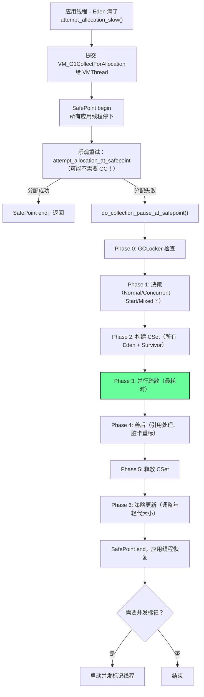
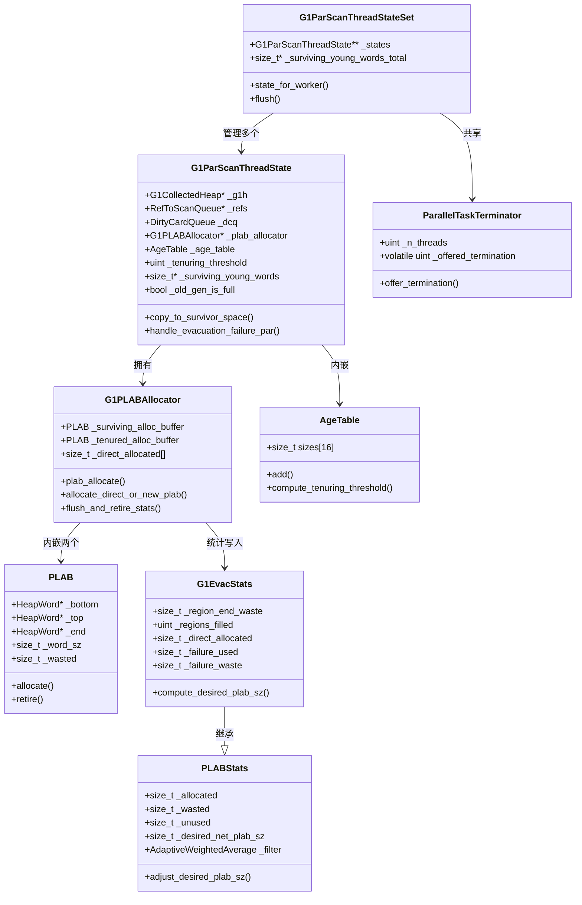

# 24 · G1 Young GC — 从"Eden 满了"到"对象被复制走"

> 接上篇 [23-g1-overview-HandWritten.md](./23-g1-overview-HandWritten.md)  
> 基于 OpenJDK 11 源码，`-Xms8g -Xmx8g -XX:+UseG1GC -Xint`  
> 方法论：程序 = 数据结构 + 算法

---

## 本章与其他章节的关系

```
[23] G1 整体架构（Region/辅助数据/写屏障）
    ↓
你在这里
    ↓
[24] Young GC ← 本篇（GC 的核心执行流程：根扫描/对象复制/工作窃取）
    ↓
[25] RSet（Young GC 依赖的跨代引用索引，本篇只用不讲）
    ↓
[26] 并发标记（Young GC 的 Initial Mark 搭便车触发并发标记）
```

**前置知识**：第 23 篇（G1 整体架构，了解 Region/RSet/写屏障的概念）

**本篇解决的问题**：Young GC 的完整执行流程是什么？`G1ParScanThreadState` 是怎么工作的？对象是怎么被并行复制的？工作窃取终止协议是怎么实现的？

**读完本篇你能理解**：
- 第 25 篇中 RSet 为什么需要三级存储（Young GC 扫描 RSet 的性能需求）
- 第 26 篇中 Initial Mark 为什么搭 Young GC 的便车
- 第 27b 篇中疏散失败（to-space exhausted）的触发条件
- 第 27c 篇中 Humongous 对象的急切回收时机

---

## 第 0 部分：核心原理 ⭐

### 0.1 本质是什么？

Young GC 的本质是**并行疏散（Parallel Evacuation）**：把 CSet（Eden + Survivor Region）中所有存活对象，并行复制到新的 Survivor 或 Old Region，然后整体释放 CSet。

不是"扫描 Eden 找存活对象"，而是"从 GC Roots 出发，追踪所有可达对象，把它们复制走"。

### 0.2 为什么需要？

**核心挑战：跨代引用。**

Young GC 只回收年轻代，但老年代的对象可能引用年轻代的对象。如果只扫描 GC Roots（线程栈、静态变量），会漏掉这些跨代引用，导致被老年代引用的年轻代对象被错误回收。

### 0.3 怎么解决？

**两个关键设计：**

1. **RSet（Remembered Set）**：每个 Region 维护一个 RSet，记录"哪些其他 Region 里有引用指向我"。Young GC 时扫描 Eden Region 的 RSet，就能找到所有跨代引用，不需要扫描整个老年代。

2. **PLAB（Promotion-Local Allocation Buffer）**：每个 GC Worker 有自己的私有分配缓冲区，复制对象时先从 PLAB 分配，避免多线程竞争同一个 Region 的分配锁。

### 0.4 为什么这样设计？

- **为什么用 RSet 而不是扫描整个老年代？** 老年代可能有几 GB，每次 Young GC 都扫描一遍代价太高。RSet 把"哪些老年代卡有跨代引用"提前记录好，Young GC 时只需查表，O(1) 定位。
- **为什么用 PLAB 而不是直接分配？** 多个 GC Worker 并行复制对象，如果都去竞争同一个 Region 的 `_top` 指针，CAS 竞争会成为瓶颈。PLAB 让每个 Worker 有自己的私有内存块，分配时不需要任何同步。
- **为什么 Initial Mark 要搭便车在 Young GC 上？** Initial Mark 需要 STW，Young GC 本来就需要 STW。合并两次 STW 为一次，减少总停顿次数。

---

## 第 1 部分：数据结构全景

### 1.1 数据结构清单

| 结构名 | 源码位置 | 核心作用 |
|--------|----------|----------|
| `G1ParScanThreadState` | `g1ParScanThreadState.hpp:45` | 每个 GC Worker 的私有状态（工作队列、PLAB、年龄表） |
| `G1PLABAllocator` | `g1Allocator.hpp:127` | 管理 GC 期间的 PLAB 分配（Survivor + Old 各一个） |
| `PLAB` | `plab.hpp:36` | 单个 PLAB 缓冲区（bump pointer 分配） |
| `AgeTable` | `ageTable.hpp:39` | 统计各年龄段存活对象大小，计算动态晋升阈值 |
| `G1EvacStats` | `g1EvacStats.hpp:31` | 统计 PLAB 分配效率，驱动 PLAB 大小自适应调整 |
| `ParallelTaskTerminator` | `taskqueue.hpp:447` | 工作窃取终止协议（判断所有 Worker 是否都完成了） |
| `G1ParScanThreadStateSet` | `g1ParScanThreadState.hpp:213` | 管理所有 Worker 的 `G1ParScanThreadState` 集合 |
| `G1CollectorState` | `g1CollectorState.hpp` | 7 个 bool 驱动的状态机，决定每次 GC 的类型 |

---

### 1.2 G1ParScanThreadState 详细分析

#### 1.2.1 字段列表

```cpp
// g1ParScanThreadState.hpp:45
class G1ParScanThreadState : public CHeapObj<mtGC> {
  G1CollectedHeap* _g1h;           // 堆对象指针（访问全局状态）
  RefToScanQueue*  _refs;          // 工作窃取队列（待处理的对象引用）
  DirtyCardQueue   _dcq;           // 线程私有脏卡队列（复制对象后更新 RSet 用）
  G1CardTable*     _ct;            // 卡表指针（判断卡是否脏）
  G1EvacuationRootClosures* _closures; // 根扫描闭包集合

  G1PLABAllocator*  _plab_allocator;   // PLAB 分配器（复制对象时用）

  AgeTable          _age_table;        // 年龄表（统计各年龄段存活字节数）
  InCSetState       _dest[InCSetState::Num]; // 目标映射表（Young→Old, Old→Old）
  uint              _tenuring_threshold;     // 本地晋升阈值（从全局复制，可动态调整）
  G1ScanEvacuatedObjClosure  _scanner;      // 扫描已复制对象的字段闭包

  int  _hash_seed;                     // 工作窃取的随机种子（避免总是偷同一个队列）
  uint _worker_id;                     // Worker ID（0 到 n_workers-1）

  uint const _stack_trim_upper_threshold; // 队列修剪上限（GCDrainStackTargetSize * 2 + 1）
  uint const _stack_trim_lower_threshold; // 队列修剪下限（GCDrainStackTargetSize）

  Tickspan _trim_ticks;                // 修剪队列耗时统计

  // False Sharing 防护：前后各加 PADDING_ELEM_NUM 个 size_t 元素
  size_t* _surviving_young_words_base; // malloc 返回的原始指针（用于 free）
  size_t* _surviving_young_words;      // 指向数组中间（跳过前 padding）

  bool _old_gen_is_full;               // 老年代是否已满（避免反复尝试分配）
};
```

#### 1.2.2 sizeof 与内存布局

```
【GDB 验证】标准条件：-Xms8g -Xmx8g -XX:+UseG1GC
┌────────────────────────────────────────────────────────────┐
│ sizeof(G1ParScanThreadState) = 464 字节                    │
│                                                            │
│ 偏移   字段                    大小   说明                  │
│ ─────────────────────────────────────────────────────────  │
│ 0      [vtable]                8      CHeapObj 子类有虚析构函数，有 vtable │
│ 8      _g1h                    8      堆指针               │
│ 16     _refs                   8      工作队列指针          │
│ 24     _dcq                    56     DirtyCardQueue 内嵌  │
│ 80     _ct                     8      卡表指针             │
│ 88     _closures               8      根闭包指针           │
│ 96     _plab_allocator         8      PLAB 分配器指针      │
│ 104    _age_table              256    AgeTable 内嵌        │
│ 360    _dest[4]                4      目标映射（4个InCSetState）│
│ 364    _tenuring_threshold     4      晋升阈值             │
│ 368    _scanner                ~40    扫描闭包内嵌         │
│ 408    _hash_seed              4      随机种子             │
│ 412    _worker_id              4      Worker ID           │
│ 416    _stack_trim_upper       4      修剪上限             │
│ 420    _stack_trim_lower       4      修剪下限             │
│ 424    _trim_ticks             8      耗时统计             │
│ 432    _surviving_young_words_base 8  原始指针             │
│ 440    _surviving_young_words  8      有效指针             │
│ 448    [padding]               8      对齐                 │
│ 456    _old_gen_is_full        1      老年代满标志         │
│ 457    [padding]               7      对齐到 464           │
└────────────────────────────────────────────────────────────┘
```

#### 1.2.3 创建位置

- 在 `G1ParScanThreadStateSet::state_for_worker(uint worker_id)` 中懒创建
- 时机：`G1ParTask::work()` 开始时，每个 Worker 第一次调用 `state_for_worker()` 时创建
- 生命周期：整个 Young GC 的 STW 期间，GC 结束后 `G1ParScanThreadStateSet::flush()` 中销毁

#### 1.2.4 关键字段生命周期

**`_surviving_young_words` 的 False Sharing 防护**：

```cpp
// g1ParScanThreadState.cpp:56-65
size_t real_length = 1 + young_cset_length;  // +1 是为了 age=-1 的非年轻代对象
size_t array_length = PADDING_ELEM_NUM +     // 前 padding（16个size_t = 128字节）
                    real_length +
                    PADDING_ELEM_NUM;         // 后 padding（16个size_t = 128字节）
_surviving_young_words_base = NEW_C_HEAP_ARRAY(size_t, array_length, mtGC);
_surviving_young_words = _surviving_young_words_base + PADDING_ELEM_NUM;
// ↑ 跳过前 padding，指向有效数据区
```

**为什么需要 Padding？**

`PADDING_ELEM_NUM = DEFAULT_CACHE_LINE_SIZE / sizeof(size_t) = 128 / 8 = 16`（实测值）

多个 GC Worker 各自更新不同 Region 的存活字节数。如果相邻 Region 的计数器落在同一个 CPU 缓存行，一个 Worker 更新时会导致其他 Worker 的缓存失效（False Sharing），性能急剧下降。前后各加 **128 字节** Padding（`DEFAULT_CACHE_LINE_SIZE = 128`），确保有效数据区不与其他数据共享缓存行。

**`_tenuring_threshold` 的动态调整**：

```cpp
// 初始值：从全局 G1Policy 复制
_tenuring_threshold(g1h->g1_policy()->tenuring_threshold())

// 动态调整：当 Old 区 PLAB 申请失败时，强制晋升阈值为 0
// g1ParScanThreadState.cpp:130
if (previous_plab_refill_failed) {
    _tenuring_threshold = 0;  // ★ 强制所有年轻代对象直接晋升到 Old
}
```

**为什么要动态调整晋升阈值？**

当 Old 区空间不足时，继续把对象放到 Survivor 只是推迟问题。把阈值设为 0，让所有对象直接晋升到 Old，如果 Old 也满了，就触发 Evacuation Failure，比反复尝试 Survivor 分配更高效。

#### 1.2.5 值域图：`_dest` 目标映射表

```
InCSetState 枚举值：
  NotInCSet = 0  → 不在 CSet 中（不需要复制）
  Young     = 1  → 年轻代 Region
  Old       = 2  → 老年代 Region
  Num       = 4  → 枚举总数

_dest 映射（构造函数中初始化）：
  _dest[NotInCSet] = NotInCSet  → 不在 CSet 的对象不复制
  _dest[Young]     = Old        → 年轻代对象"年龄足够大时"的目标是 Old
  _dest[Old]       = Old        → 老年代对象复制到 Old

源码注释：
  // The dest for Young is used when the objects are aged enough to
  // need to be moved to the next space.

_dest[Young] = Old 的含义：当年轻代对象年龄 >= _tenuring_threshold 时，
调用 dest(Young) 得到 Old，对象晋升到老年代。

实际目标由 next_state() 决定：
  if (state.is_young()) {
    age = m->age();  // 从 mark word 读取年龄
    if (age < _tenuring_threshold) return state;  // 留在 Young（Survivor）
  }
  return dest(state);  // 年龄够了 → 去 Old（晋升）
```

---

### 1.3 G1PLABAllocator 详细分析

#### 1.3.1 字段列表

```cpp
// g1Allocator.hpp:127
class G1PLABAllocator : public CHeapObj<mtGC> {
  G1CollectedHeap* _g1h;           // 堆指针
  G1Allocator* _allocator;         // 全局分配器（申请新 PLAB 时用）

  PLAB  _surviving_alloc_buffer;   // Survivor PLAB（复制到 Survivor Region 时用）
  PLAB  _tenured_alloc_buffer;     // Old PLAB（复制到 Old Region 时用）
  PLAB* _alloc_buffers[InCSetState::Num]; // 指针数组，按 InCSetState 索引

  const uint _survivor_alignment_bytes; // Survivor 对象的对齐要求（字节）

  size_t _direct_allocated[InCSetState::Num]; // 直接分配（不经过 PLAB）的字节数统计
};
```

#### 1.3.2 sizeof 与内存布局

```
【GDB 验证】
sizeof(G1PLABAllocator) = 352 字节
sizeof(PLAB) = 136 字节

内存布局：
  [vtable]                8 字节（G1PLABAllocator 有虚函数，有 vtable）
  _g1h                    8 字节
  _allocator              8 字节
  _surviving_alloc_buffer 136 字节（PLAB 内嵌，无 vtable）
  _tenured_alloc_buffer   136 字节（PLAB 内嵌，无 vtable）
  _alloc_buffers[4]       32 字节（4个指针）
  _survivor_alignment_bytes 4 字节
  [padding]               4 字节
  _direct_allocated[4]    32 字节（4个size_t）
  理论总计 = 8+8+8+136+136+32+4+4+32 = 368 字节
  实测 sizeof = 352 字节（编译器对 PLAB 内嵌结构有优化，_surviving_alloc_buffer 和
  _tenured_alloc_buffer 的 tail/head padding 在内嵌时可能被合并）
```

#### 1.3.3 创建位置

- 在 `G1ParScanThreadState` 构造函数中创建：`_plab_allocator = new G1PLABAllocator(_g1h->allocator())`
- 初始化时，两个 PLAB 的大小由 `_g1h->desired_plab_sz(InCSetState::Young/Old)` 决定

#### 1.3.4 关键字段生命周期

**PLAB 的三级分配策略**（`copy_to_survivor_space` 中）：

```
Level 1：plab_allocate()
  → 直接从当前 PLAB 的 _top 指针分配（bump pointer，最快）
  → 失败（PLAB 满了）→ Level 2

Level 2：allocate_direct_or_new_plab()
  → 申请一个新的 PLAB，然后从新 PLAB 分配
  → 失败（Region 满了，无法申请新 PLAB）→ Level 3

Level 3：allocate_in_next_plab()
  → 尝试在下一个"代"（Young→Old）分配
  → 失败 → handle_evacuation_failure_par()（疏散失败）
```

#### 1.3.5 值域图：PLAB 大小的自适应调整

```
每次 GC 结束时：
  flush_and_retire_stats() → 把 PLAB 使用统计写入 G1EvacStats

G1EvacStats 统计：
  _allocated    = 总分配字节数
  _wasted       = 内部碎片（PLAB 末尾未用的空间）
  _undo_wasted  = 撤销分配的浪费
  _unused       = 最后一个 PLAB 的剩余空间
  _direct_allocated = 直接分配（不经过 PLAB）的字节数

下次 GC 开始时：
  desired_plab_sz() = 根据上次统计，计算新的 PLAB 大小
  目标：最小化 wasted / allocated 比率
```

---

### 1.3.6 G1EvacStats 详细分析

**解决什么问题**：PLAB 大小不能固定——太大浪费内存，太小导致频繁申请新 PLAB。`G1EvacStats` 收集每次 GC 的 PLAB 使用统计，驱动下次 GC 的 PLAB 大小自适应调整。

#### 1.3.6.1 字段列表（完整继承链）

```cpp
// gc/shared/plab.hpp — PLABStats（父类）
class PLABStats : public CHeapObj<mtGC> {
  const char* _description;        // 标识字符串（"Young" 或 "Old"）
  size_t _allocated;               // 本次 GC 总分配字节数（HeapWord 单位）
  size_t _wasted;                  // 内部碎片（PLAB 末尾未用的空间，HeapWord 单位）
  size_t _undo_wasted;             // 撤销分配的浪费（不计入 PLAB 大小计算）
  size_t _unused;                  // 最后一个 PLAB 的剩余空间（HeapWord 单位）
  size_t _desired_net_plab_sz;     // ★ 目标 PLAB 净大小（滤波器输出，经过修剪和量化）
  AdaptiveWeightedAverage _filter; // ★ 指数衰减滤波器（平滑 PLAB 大小的波动）
};

// gc/g1/g1EvacStats.hpp — G1EvacStats（子类，G1 特有字段）
class G1EvacStats : public PLABStats {
  size_t _region_end_waste;  // ★ 因跳到下一个 Region 而浪费的字节数（Region 末尾碎片）
  uint   _regions_filled;    // 本次 GC 完全填满的 Region 数量
  size_t _direct_allocated;  // 直接分配（不经过 PLAB）的字节数（大对象或 PLAB 申请失败时）
  size_t _failure_used;      // 疏散失败的 Region 中存活对象占用的字节数
  size_t _failure_waste;     // 疏散失败的 Region 中浪费的字节数（已复制出去的对象 + 末尾碎片）
};
```

#### 1.3.6.2 sizeof 与内存布局

```
PLABStats 字段大小估算（slowdebug build）：
  [vtable]              8 字节（CHeapObj 继承 AllocatedObj，有虚函数）
  _description          8 字节（指针）
  _allocated            8 字节
  _wasted               8 字节
  _undo_wasted          8 字节
  _unused               8 字节
  _desired_net_plab_sz  8 字节
  _filter               AdaptiveWeightedAverage（含 _average/unsigned _weight，约 16 字节）
  ─────────────────────────────────────────────
  PLABStats 小计 ≈ 72 字节

G1EvacStats 额外字段：
  _region_end_waste     8 字节
  _regions_filled       4 字节（uint）
  _direct_allocated     8 字节
  _failure_used         8 字节
  _failure_waste        8 字节
  ─────────────────────────────────────────────
  G1EvacStats 额外 ≈ 40 字节（含对齐 padding）

注意：G1EvacStats 不是内嵌在 G1PLABAllocator 中，而是全局共享的：
  G1Allocator 持有两个 G1EvacStats：
    _survivor_evac_stats（Young PLAB 统计）
    _old_evac_stats（Old PLAB 统计）
  所有 Worker 的 G1PLABAllocator 都向同一个 G1EvacStats 写入统计
```

#### 1.3.6.3 创建位置

```cpp
// g1Allocator.cpp:G1Allocator 构造函数
G1Allocator::G1Allocator(G1CollectedHeap* heap) :
  _g1h(heap),
  _survivor_is_full(false),
  _old_is_full(false),
  _survivor_evac_stats("Young", YoungPLABSize, PLABWeight),  // ★ Young PLAB 统计
  _old_evac_stats("Old", OldPLABSize, PLABWeight)            // ★ Old PLAB 统计
```

- `YoungPLABSize` 默认值：`G1YoungSurvivorRegionSizePercent` 计算，约 4096 HeapWords（32KB）
- `OldPLABSize` 默认值：1024 HeapWords（8KB）
- `PLABWeight` = 75（指数衰减滤波器的权重，75% 历史 + 25% 新值）

#### 1.3.6.4 关键字段生命周期

```
_allocated / _wasted / _unused / _region_end_waste 的生命周期：

GC 开始前：
  G1EvacStats::reset() 清零所有统计字段

GC 期间（每个 Worker 并行写入）：
  PLAB::flush_and_retire_stats(G1EvacStats*)
    → PLABStats::add_allocated(_allocated)    // 原子加
    → PLABStats::add_wasted(_wasted)          // 原子加
    → PLABStats::add_unused(remaining)        // 原子加
    → G1EvacStats::add_region_end_waste(...)  // 原子加
    → G1EvacStats::add_direct_allocated(...)  // 原子加

GC 结束后（STW 内，单线程）：
  G1EvacStats::adjust_desired_plab_sz()
    → compute_desired_plab_sz()  // 计算新的目标 PLAB 大小
    → _filter.sample(cur_plab_sz) // 指数衰减滤波，平滑波动
    → _desired_net_plab_sz = 滤波后的值（clamp 到 [min_size, max_size]）

下次 GC 开始时：
  G1PLABAllocator 初始化时读取 _desired_net_plab_sz
  → 作为新 PLAB 的初始大小
```

#### 1.3.6.5 `compute_desired_plab_sz()` 算法分析

**解决什么问题**：根据上次 GC 的实际使用情况，计算下次 GC 的最优 PLAB 大小，使 `wasted / allocated ≤ TargetPLABWastePct`（默认 10%）。

```cpp
// g1EvacStats.cpp:55
size_t G1EvacStats::compute_desired_plab_sz() {
  // ★ 关键：region_end_waste 计入"有效使用"（保守假设）
  // 原因：PLAB 大小可以调整，但 inline 分配不能调整，所以把 region_end_waste 归咎于 PLAB
  size_t const used_for_waste_calculation =
    used() > _region_end_waste ? used() - _region_end_waste : 0;
  //   used() = _allocated - _wasted - _unused（真正被对象占用的字节数）

  // ★ 允许的最大浪费 = 有效使用量 × TargetPLABWastePct%
  size_t const total_waste_allowed = used_for_waste_calculation * TargetPLABWastePct;

  // ★ 目标 PLAB 大小 = 允许浪费 / G1LastPLABAverageOccupancy
  // G1LastPLABAverageOccupancy 默认 0.5（假设最后一个 PLAB 平均半满）
  // 推导：如果 PLAB 大小 = S，最后一个 PLAB 平均浪费 S × 0.5
  //       要让 S × 0.5 ≤ total_waste_allowed，则 S ≤ total_waste_allowed / 0.5
  size_t const cur_plab_sz =
    (size_t)((double)total_waste_allowed / G1LastPLABAverageOccupancy);
  return cur_plab_sz;
}
```

**数值示例**（标准条件 `-Xms8g -Xmx8g -XX:+UseG1GC`）：

```
假设某次 Young GC：
  _allocated = 200,000 HeapWords（1.6MB）
  _wasted    = 5,000 HeapWords（40KB，PLAB 末尾碎片）
  _unused    = 3,000 HeapWords（24KB，最后一个 PLAB 剩余）
  _region_end_waste = 2,000 HeapWords（16KB，Region 末尾碎片）

  used() = 200,000 - 5,000 - 3,000 = 192,000 HeapWords
  used_for_waste_calculation = 192,000 - 2,000 = 190,000 HeapWords
  total_waste_allowed = 190,000 × 10% = 19,000 HeapWords
  cur_plab_sz = 19,000 / 0.5 = 38,000 HeapWords（304KB）

  经过 _filter（PLABWeight=75）平滑后：
  new_desired = 0.75 × old_desired + 0.25 × 38,000
  → 下次 GC 的 PLAB 大小趋向 304KB
```

#### 1.3.6.6 值域图：PLAB 大小的边界

```
PLAB 大小的约束：
  min_size() = PLAB::min_size() = 16 HeapWords（128 字节）
  max_size() = PLAB::max_size() = 128MB / HeapWordSize = 16,777,216 HeapWords

  实际范围（标准条件）：
  Young PLAB：初始 4096 HW（32KB），自适应后通常在 1000~8000 HW 之间
  Old PLAB：  初始 1024 HW（8KB），自适应后通常在 500~4000 HW 之间

  触发 direct_allocated（绕过 PLAB 直接分配）的条件：
  对象大小 > PLAB 剩余空间 × 2（即对象太大，申请新 PLAB 也放不下）
  → 直接在 Region 中分配，不经过 PLAB
  → 这次分配计入 _direct_allocated，不计入 _wasted
```

---

### 1.4 PLAB 详细分析

#### 1.4.1 字段列表

```cpp
// plab.hpp:36
class PLAB: public CHeapObj<mtGC> {
  char      head[32];      // ★ 前 padding（防止 False Sharing）
  size_t    _word_sz;      // PLAB 总大小（HeapWord 单位）
  HeapWord* _bottom;       // PLAB 起始地址
  HeapWord* _top;          // 下一个可分配位置（bump pointer）
  HeapWord* _end;          // 最后可分配地址 + 1（= _hard_end - AlignmentReserve）
  HeapWord* _hard_end;     // PLAB 真正的末尾（_bottom + _word_sz）
  size_t    _allocated;    // 已分配字节数（用于统计）
  size_t    _wasted;       // 内部碎片字节数
  size_t    _undo_wasted;  // 撤销分配的浪费字节数
  char      tail[32];      // ★ 后 padding（防止 False Sharing）
};
```

#### 1.4.2 sizeof 与内存布局

```
【打桩验证】标准条件：-Xms8g -Xmx8g -XX:+UseG1GC（slowdebug build）
在 PLAB::PLAB() 构造函数中打桩输出偏移量

sizeof(PLAB) = 136 字节

偏移   字段          大小   说明
─────────────────────────────────────────────
0      [vtable]      8      ★ 见下方说明
8      head[32]      32     前 padding（防 False Sharing）
40     _word_sz      8      PLAB 总大小（HeapWord 单位）
48     _bottom       8      起始地址
56     _top          8      当前分配位置（bump pointer）
64     _end          8      可分配上限（= _hard_end - AlignmentReserve）
72     _hard_end     8      真正末尾（= _bottom + _word_sz）
80     _allocated    8      已分配统计（HeapWord 单位）
88     _wasted       8      碎片统计（HeapWord 单位）
96     _undo_wasted  8      撤销统计（HeapWord 单位）
104    tail[32]      32     后 padding（防 False Sharing）
─────────────────────────────────────────────
总计 = 8+32+8+8+8+8+8+8+8+8+32 = 136 字节
```

**关于 vtable 的说明（slowdebug vs PRODUCT 的重要区别）**：

```cpp
// memory/allocation.hpp:96-98
#ifdef PRODUCT
#define ALLOCATION_SUPER_CLASS_SPEC          // PRODUCT 模式：空，无基类
#else
#define ALLOCATION_SUPER_CLASS_SPEC : public AllocatedObj  // 非 PRODUCT：继承 AllocatedObj
class AllocatedObj {
  virtual void print_on(outputStream* st) const;       // ★ 虚函数！
  virtual void print_value_on(outputStream* st) const; // ★ 虚函数！
};
#endif
```

- **slowdebug/fastdebug build**（本文验证环境）：`CHeapObj` 继承 `AllocatedObj`，`AllocatedObj` 有虚函数，因此 `PLAB` **有 vtable（8字节）**，`_word_sz` 偏移量 = **40**
- **PRODUCT build**（生产环境）：`ALLOCATION_SUPER_CLASS_SPEC` 为空，`CHeapObj` 无基类，`PLAB` **无 vtable**，`_word_sz` 偏移量 = **32**（紧跟 `head[32]`）

**`PLAB::AlignmentReserve` 的实测值**：

```
【打桩验证】AlignmentReserve = 2（不是 0！）

原因：在 -server 模式下：
  oopDesc::header_size() = 2（mark word + klass pointer，各 1 HeapWord）
  MinObjAlignment = 1
  2 > 1 → 条件成立
  AlignmentReserve = align_object_size(arrayOopDesc::header_size(T_INT)) = 2

含义：PLAB 末尾保留 2 × 8 = 16 字节给数组头部对齐
      _end = _hard_end - 2（HeapWord 单位）
      即 PLAB 最后 16 字节不用于普通分配，专门留给数组头部
```

#### 1.4.3 分配算法（bump pointer）

```cpp
// plab.hpp:88
HeapWord* allocate(size_t word_sz) {
    HeapWord* res = _top;
    if (pointer_delta(_end, _top) >= word_sz) {  // 剩余空间够用？
        _top = _top + word_sz;                    // ★ bump pointer
        return res;
    } else {
        return NULL;                              // PLAB 满了
    }
}
```

这是 PLAB 分配的核心：一次指针加法，无锁，极快。

---

### 1.5 AgeTable 详细分析

#### 1.5.1 字段列表

```cpp
// ageTable.hpp:39
class AgeTable {
  enum { table_size = markOopDesc::max_age + 1 };  // = 16

  // Note: all sizes are in oops（源码注释）
  size_t sizes[table_size];  // sizes[age] = 该年龄段存活对象的总大小（HeapWord/oop 单位，不是字节）

  PerfVariable* _perf_sizes[table_size];  // JVM 性能计数器（jstat 用）
};
```

#### 1.5.2 sizeof 与内存布局

```
【GDB 验证】
sizeof(AgeTable) = 256 字节
markOopDesc::max_age = 15
AgeTable::table_size = 16

内存布局：
  sizes[16]         = 16 × 8 = 128 字节（age 0~15 的存活对象大小，HeapWord/oop 单位）
  _perf_sizes[16]   = 16 × 8 = 128 字节（JVM 性能计数器指针，jstat 用）
  总计 = 256 字节

注意：sizes[] 存储的是 HeapWord（oop）单位，不是字节！
源码注释："Note: all sizes are in oops"
compute_tenuring_threshold 的参数 desired_survivor_size 也是 HeapWord 单位
日志输出时才乘以 oopSize 转换为字节：wordSize * oopSize
```

#### 1.5.3 动态晋升阈值计算

这是 AgeTable 最核心的功能：

```cpp
// ageTable.cpp:78
uint AgeTable::compute_tenuring_threshold(size_t desired_survivor_size) {
  uint result;
  if (AlwaysTenure || NeverTenure) {
    result = MaxTenuringThreshold;  // 强制模式，直接用参数值
  } else {
    size_t total = 0;
    uint age = 1;
    while (age < table_size) {
      total += sizes[age];          // ★ 累加各年龄段存活字节数
      if (total > desired_survivor_size) break;  // ★ 超过目标 Survivor 大小就停
      age++;
    }
    // 取 age 和 MaxTenuringThreshold 的较小值
    result = age < MaxTenuringThreshold ? age : MaxTenuringThreshold;
  }
  return result;
}
```

**算法解读**：

```
目标：让 Survivor 区的存活对象总大小 ≤ desired_survivor_size（通常是 Survivor 容量的 50%）

做法：从 age=1 开始累加，找到第一个让累计大小超过目标的 age
      这个 age 就是新的晋升阈值

注意：sizes[] 和 desired_survivor_size 都是 HeapWord（oop）单位，比较时单位一致

例子（desired_survivor_size = 100MB / 8 = 13107200 HeapWords）：
  age=1: 3932160 HW → 累计 3932160 HW < 13107200 HW，继续
  age=2: 5242880 HW → 累计 9175040 HW < 13107200 HW，继续
  age=3: 6553600 HW → 累计 15728640 HW > 13107200 HW，停止！
  新晋升阈值 = 3（age >= 3 的对象下次 GC 时晋升到 Old）

效果：动态控制 Survivor 区的存活对象量，避免 Survivor 溢出
```

---

### 1.6 ParallelTaskTerminator 详细分析

#### 1.6.1 字段列表

```cpp
// taskqueue.hpp:447
class ParallelTaskTerminator: public StackObj {
  uint _n_threads;                    // 参与的 Worker 总数
  TaskQueueSetSuper* _queue_set;      // 所有 Worker 的工作队列集合（用于偷任务）

  DEFINE_PAD_MINUS_SIZE(0, DEFAULT_CACHE_LINE_SIZE, 0);  // 前 padding（64字节）
  volatile uint _offered_termination; // ★ 已宣布终止的 Worker 数（原子计数器）
  DEFINE_PAD_MINUS_SIZE(1, DEFAULT_CACHE_LINE_SIZE, sizeof(volatile uint)); // 后 padding
};
```

#### 1.6.2 sizeof 与内存布局

```
【打桩验证】标准条件：-Xms8g -Xmx8g -XX:+UseG1GC（slowdebug build）
sizeof(ParallelTaskTerminator) = 280 字节
DEFAULT_CACHE_LINE_SIZE = 128（不是 64！JVM 用双倍缓存行做保护）

内存布局（slowdebug build）：
  偏移 0    [vtable]              8 字节（StackObj 继承 AllocatedObj，有虚函数）
  偏移 8    _n_threads            4 字节（uint）
  偏移 16   _queue_set            8 字节（指针）
  偏移 24   DEFINE_PAD_MINUS_SIZE(0, 128, 0)
            → 填充 128 字节（偏移 24 到 151）
  偏移 152  _offered_termination  4 字节（volatile uint，独占 128 字节缓存行）
  偏移 156  DEFINE_PAD_MINUS_SIZE(1, 128, sizeof(volatile uint))
            → 填充 128-4 = 124 字节（偏移 156 到 279）
  总计 = 8+4+4+8+128+4+124 = 280 字节 ✅
```

**关键：`DEFAULT_CACHE_LINE_SIZE = 128`，不是 64！**

```cpp
// utilities/globalDefinitions.hpp
#define DEFAULT_CACHE_LINE_SIZE 128  // JVM 用 128 字节（双倍缓存行）
```

JVM 使用 128 字节而不是 x86 实际的 64 字节缓存行，是为了防止**相邻缓存行预取**（Adjacent Cache Line Prefetch）导致的 False Sharing。某些 CPU 会同时预取相邻的两条缓存行，128 字节 padding 可以彻底隔离。

**为什么 `_offered_termination` 需要独占一个缓存行？**

所有 Worker 都会频繁读写这个计数器（`Atomic::inc`）。如果它和其他字段共享缓存行，每次更新都会导致整个缓存行失效，所有 Worker 都需要重新加载，性能急剧下降。独占 128 字节缓存行后，只有这个计数器的更新会触发缓存失效。

---

## 第 2 部分：算法/流程分析

### 2.1 核心流程概览



---

### 2.2 Phase 3：并行疏散 — 核心算法

#### 2.2.1 解决什么问题？

把 CSet 中所有存活对象并行复制到新位置，同时维护对象的年龄信息和 RSet 更新。

#### 2.2.2 G1ParTask::work() — 每个 Worker 的入口

```cpp
// g1CollectedHeap.cpp:3920-3990（G1ParTask::work）
void work(uint worker_id) {
    // ... 省略日志/统计初始化 ...

    G1ParScanThreadState *pss = _pss->state_for_worker(worker_id);
    pss->set_ref_discoverer(rp);  // ★ 设置引用发现器（处理 SoftRef/WeakRef）

    // ① 扫描 GC Roots（线程栈、JNI、静态变量等）
    _root_processor->evacuate_roots(pss, worker_id);

    // ② 扫描 RSet（找跨代引用：老年代 → 年轻代）
    _g1h->g1_rem_set()->oops_into_collection_set_do(pss, worker_id);

    // ③ 复制对象 + 工作窃取（最耗时）
    G1ParEvacuateFollowersClosure evac(_g1h, pss, _queues, &_terminator);
    evac.do_void();
    // ... 省略统计记录 ...
}
```

**设计决策**：三步顺序不能颠倒。① 先扫根，把根引用的对象加入工作队列；② 再扫 RSet，把跨代引用也加入队列；③ 最后处理队列，复制所有可达对象。

---

#### 2.2.3 G1ParEvacuateFollowersClosure::do_void() — 工作窃取主循环

```cpp
// g1CollectedHeap.cpp:3908-3913
void G1ParEvacuateFollowersClosure::do_void() {
    G1ParScanThreadState *const pss = par_scan_state();
    pss->trim_queue();          // ★ 先把自己队列里的任务处理完
    do {
        pss->steal_and_trim_queue(queues());  // ★ 偷其他 Worker 的任务
    } while (!offer_termination());           // ★ 直到所有 Worker 都完成
}
```

**工作窃取的意义**：如果某个 Worker 的队列空了，它不会空等，而是去"偷"其他 Worker 队列里的任务。这样负载均衡，避免某些 Worker 空闲而其他 Worker 还在忙。

---

#### 2.2.4 copy_to_survivor_space() — 对象复制核心

这是 Young GC 最核心的函数，每复制一个对象都会调用一次。

```cpp
// g1ParScanThreadState.cpp:163-260
oop G1ParScanThreadState::copy_to_survivor_space(InCSetState const state,
                                                 oop const old,
                                                 markOop const old_mark) {
  const size_t word_sz = old->size();                    // ★ 对象大小（HeapWord 单位）
  HeapRegion* const from_region = _g1h->heap_region_containing(old);
  const int young_index = from_region->young_index_in_cset()+1;  // ★ 用于统计存活字节数

  uint age = 0;
  InCSetState dest_state = next_state(state, old_mark, age);  // ★ 决定复制到哪里
  // 如果 Old 区已满，直接触发疏散失败（避免反复尝试）
  if (_old_gen_is_full && dest_state.is_old()) {
    return handle_evacuation_failure_par(old, old_mark);
  }

  // ★ Level 1：从当前 PLAB 分配（最快路径，bump pointer）
  HeapWord* obj_ptr = _plab_allocator->plab_allocate(dest_state, word_sz);

  if (obj_ptr == NULL) {
    bool plab_refill_failed = false;
    // ★ Level 2：申请新 PLAB，然后分配
    obj_ptr = _plab_allocator->allocate_direct_or_new_plab(dest_state, word_sz,
                                                           &plab_refill_failed);
    if (obj_ptr == NULL) {
      // ★ Level 3：尝试在下一个"代"分配（Young→Old）
      obj_ptr = allocate_in_next_plab(state, &dest_state, word_sz, plab_refill_failed);
      if (obj_ptr == NULL) {
        // ★ 所有分配都失败：疏散失败（Self-Forwarding）
        return handle_evacuation_failure_par(old, old_mark);
      }
    }
  }

  // ★ CAS 设置 forwarding pointer（防止多个 Worker 重复复制同一个对象）
  const oop obj = oop(obj_ptr);
  const oop forward_ptr = old->forward_to_atomic(obj, memory_order_relaxed);
  if (forward_ptr == NULL) {
    // ★ CAS 成功：我们是第一个复制这个对象的 Worker
    Prefetch::write(obj_ptr, PrefetchCopyIntervalInBytes);  // 预取目标地址
    Copy::aligned_disjoint_words((HeapWord*) old, obj_ptr, word_sz);  // ★ 复制对象内容

    if (dest_state.is_young()) {
      // ★ 复制到 Survivor：更新年龄
      if (age < markOopDesc::max_age) age++;

      // ─────────────────────────────────────────────────────────────────
      // ★ 前置知识：mark word 的结构（理解下面代码的必要前提）
      //
      // 正常情况下，mark word 的低 2 位 = 01（unlocked），高位存 hashcode + age：
      //   [ hashcode(25) | age(4) | biased_lock(1) | lock(2) ] = 01
      //
      // 但当对象被轻量级锁锁住时，mark word 的内容被替换为：
      //   [ 指向 Lock Record 的指针 | lock(2) ] = 00（轻量级锁）
      //   原始 mark word 被保存到线程栈上的 Lock Record 中（称为 displaced mark word）
      //
      // 此时 old_mark（对象复制前的 mark word）存的是 Lock Record 指针，不是原始 mark。
      // 如果直接调用 old_mark->set_age(age)，会修改 Lock Record 指针的低位，破坏锁状态！
      //
      // 正确做法：
      //   1. 通过 old_mark->displaced_mark_helper() 找到 Lock Record 中保存的原始 mark
      //   2. 在原始 mark 上调用 set_age(age)，得到新的原始 mark
      //   3. 把新的原始 mark 写回 Lock Record（set_displaced_mark_helper）
      //   4. 对象的 mark word 仍然保持 Lock Record 指针不变（锁状态不受影响）
      // ─────────────────────────────────────────────────────────────────
      if (old_mark->has_displaced_mark_helper()) {
        // ★ 特殊情况：对象曾被锁住（有 displaced mark word）
        // 不能直接 set_age，因为 old_mark 里存的是 forwarding pointer
        // 必须先恢复 mark word，再修改 displaced mark 里的 age
        obj->set_mark_raw(old_mark);  // 先写入原 mark（含 forwarding pointer 信息）
        markOop new_mark = old_mark->displaced_mark_helper()->set_age(age);
        old_mark->set_displaced_mark_helper(new_mark);  // ★ 修改 displaced mark 里的 age
      } else {
        obj->set_mark_raw(old_mark->set_age(age));  // ★ 直接在 mark word 里写入新年龄
      }
      _age_table.add(age, word_sz);               // ★ 统计该年龄段的存活字节数（HeapWord 单位）
    } else {
      obj->set_mark_raw(old_mark);  // 晋升到 Old：保持原 mark word
    }

    // ★ G1 字符串去重（可选功能，-XX:+UseStringDeduplication 开启）
    if (G1StringDedup::is_enabled()) {
      G1StringDedup::enqueue_from_evacuation(
          state.is_young(), dest_state.is_young(), _worker_id, obj);
    }

    _surviving_young_words[young_index] += word_sz;  // ★ 统计该 Region 的存活字节数

    // ★ 处理大数组：分段扫描（避免单个对象占用太多队列空间）
    if (obj->is_objArray() && arrayOop(obj)->length() >= ParGCArrayScanChunk) {
      arrayOop(obj)->set_length(0);  // 临时清零，标记"还没扫完"
      oop* old_p = set_partial_array_mask(old);  // ★ 用低位 bit 标记"部分数组"
      do_oop_partial_array(old_p);
    } else {
      // ★ 扫描新对象的所有引用字段，加入工作队列
      HeapRegion* const to_region = _g1h->heap_region_containing(obj_ptr);
      _scanner.set_region(to_region);
      obj->oop_iterate_backwards(&_scanner);  // ★ 逆序扫描（更好的缓存局部性）
    }
    return obj;
  } else {
    // ★ CAS 失败：其他 Worker 已经复制了这个对象，撤销我们的分配
    _plab_allocator->undo_allocation(dest_state, obj_ptr, word_sz);
    return forward_ptr;  // 返回其他 Worker 复制的新地址
  }
}
```

**设计决策分析**：

| 设计 | 原因 |
|------|------|
| CAS 设置 forwarding pointer | 多个 Worker 可能同时发现同一个对象（通过不同的引用路径），CAS 保证只有一个 Worker 真正复制 |
| 逆序扫描引用字段 | 对象的引用字段通常按声明顺序排列，逆序扫描让最后声明的字段先入队，先处理，更好的缓存局部性 |
| 大数组分段处理 | 一个大数组可能有几万个引用字段，全部入队会撑爆工作队列。分段处理，每次只处理 `ParGCArrayScanChunk` 个元素 |
| 预取目标地址 | 复制前预取目标内存，减少 cache miss |

---

#### 2.2.5 工作窃取终止协议 — offer_termination()

这是 Young GC 并行化的关键机制，解决"如何判断所有 Worker 都完成了"的问题。

**难点**：Worker A 的队列空了，但 Worker B 可能刚把一个任务放入队列，还没来得及处理。如果 A 立刻宣布终止，B 的任务就没人处理了。

```cpp
// taskqueue.cpp:153
bool ParallelTaskTerminator::offer_termination(TerminatorTerminator* terminator) {
  Atomic::inc(&_offered_termination);  // ★ 原子递增：我宣布"我完成了"

  while (true) {
    if (_offered_termination == _n_threads) {
      return true;  // ★ 所有 Worker 都宣布完成，真正终止
    } else {
      // 还有 Worker 没完成，等待并偷任务
      if (yield_count <= WorkStealingYieldsBeforeSleep) {
        yield_count++;
        if (hard_spin_count > WorkStealingSpinToYieldRatio) {
          yield();           // ★ 让出 CPU（OS 调度）
        } else {
          for (uint j = 0; j < hard_spin_limit; j++) {
            SpinPause();     // ★ 硬自旋（CPU 级别的 pause 指令）
          }
          hard_spin_count++;
        }
      } else {
        sleep(WorkStealingSleepMillis);  // ★ 睡眠（让其他核心有机会运行）
      }

      if (peek_in_queue_set()) {
        // ★ 发现有新任务！撤销终止宣告，继续工作
        Atomic::dec(&_offered_termination);
        return false;
      }
    }
  }
}
```

**三级等待策略**（从快到慢，带指数退避）：

```
Level 1：硬自旋（SpinPause）—— 指数退避
  → 最快，不让出 CPU，适合任务很快就会出现的情况
  → ★ hard_spin_limit 是动态增长的：每次翻倍，直到 WorkStealingHardSpins 上限
  → 初始值：WorkStealingHardSpins >> WorkStealingSpinToYieldRatio
  → 每轮：hard_spin_limit = MIN2(2 * hard_spin_limit, WorkStealingHardSpins)
  → 这是经典的「指数退避」策略，避免频繁空转

Level 2：yield()
  → 让出 CPU 给同核心的其他线程（OS 调度）
  → 每 WorkStealingSpinToYieldRatio 次硬自旋后触发一次 yield
  → 触发后重置 hard_spin_limit 为初始值，重新开始指数增长

Level 3：sleep(WorkStealingSleepMillis)
  → 真正睡眠，让其他核心有机会运行
  → 在 yield_count > WorkStealingYieldsBeforeSleep 后触发
  → 适合任务很慢出现的情况（避免空转浪费 CPU）
```

**为什么 `_offered_termination` 需要独占缓存行？**

所有 Worker 都会频繁 `Atomic::inc` 这个计数器。如果它和其他字段共享缓存行，每次 inc 都会导致所有 Worker 的缓存失效，性能急剧下降。

---

### 2.3 handle_evacuation_failure_par() — 疏散失败处理

#### 2.3.1 解决什么问题？

当 Old 区空间不足，对象无法被复制时，不能立刻触发 Full GC（代价太高）。需要一种"优雅降级"机制：让对象留在原地，GC 继续完成，把 Full GC 作为最后手段。

#### 2.3.2 源码分析

```cpp
// g1ParScanThreadState.cpp:330-360
oop G1ParScanThreadState::handle_evacuation_failure_par(oop old, markOop m) {
  // ★ Self-Forwarding：forwarding pointer 指向自身
  oop forward_ptr = old->forward_to_atomic(old, memory_order_relaxed);
  if (forward_ptr == NULL) {
    // ★ CAS 成功：我们是第一个发现这个对象无法复制的 Worker
    HeapRegion* r = _g1h->heap_region_containing(old);

    if (!r->evacuation_failed()) {
      r->set_evacuation_failed(true);  // ★ 标记该 Region 疏散失败
      _g1h->hr_printer()->evac_failure(r);
    }

    // ★ 保存对象的 mark word（因为 forwarding pointer 会覆盖它）
    _g1h->preserve_mark_during_evac_failure(_worker_id, old, m);

    // ★ 扫描对象的引用字段（对象留在原地，但引用的对象可能已经被复制了）
    _scanner.set_region(r);
    old->oop_iterate_backwards(&_scanner);

    return old;  // ★ 返回原地址（对象没有移动）
  } else {
    // ★ CAS 失败：其他 Worker 已经处理了这个对象
    return forward_ptr;
  }
}
```

**Self-Forwarding 的后续处理**：

疏散失败的 Region 不会被释放，而是转为 Old Region。这些 Region 里的对象有两种状态：
- **Self-Forwarded 对象**：forwarding pointer 指向自身，标志着"我没有被复制"
- **正常 Forwarded 对象**：forwarding pointer 指向新位置（其他 Worker 已经复制了）

GC 结束后，`remove_self_forwarding_pointers()` 会扫描所有疏散失败的 Region，恢复 Self-Forwarded 对象的 mark word（从 `_preserved_marks_set` 中恢复）。

---

### 2.4 AgeTable 驱动的动态晋升阈值

#### 2.4.1 解决什么问题？

`-XX:MaxTenuringThreshold=15` 是最大晋升阈值，但实际晋升阈值是动态计算的。目标：让 Survivor 区的存活对象总大小不超过 Survivor 容量的 50%（`TargetSurvivorRatio`）。

#### 2.4.2 完整流程

```
每次 Young GC 期间：
  copy_to_survivor_space() 中：
    _age_table.add(age, word_sz)  // ★ 统计各年龄段存活字节数

每次 Young GC 结束时（flush() 中）：
  _g1h->g1_policy()->record_age_table(&_age_table)  // ★ 合并各 Worker 的年龄表

G1Policy 中：
  desired_survivor_size = survivor_capacity * TargetSurvivorRatio / 100
  new_threshold = age_table.compute_tenuring_threshold(desired_survivor_size)
  // ★ 新阈值用于下次 Young GC
```

**GC 日志里的体现**（需要 `-Xlog:gc+age=trace`）：

```
[gc,age] GC(5) Desired survivor size 52428800 bytes, new threshold 6 (max threshold 15)
[gc,age] GC(5) Age table with threshold 6 (max threshold 15)
[gc,age] GC(5) - age   1:   8388608 bytes,   8388608 total
[gc,age] GC(5) - age   2:  16777216 bytes,  25165824 total
[gc,age] GC(5) - age   3:  20971520 bytes,  46137344 total
[gc,age] GC(5) - age   4:  10485760 bytes,  56623104 total  ← 超过 50MB，停止
```

注意：日志中显示的是字节数（`wordSize * oopSize`），但 `sizes[]` 内部存储的是 HeapWord 单位。

---

## 第 3 部分：GDB 验证

### 3.1 验证计划

| 验证目标 | 方法 | 状态 |
|---------|------|------|
| 关键数据结构 sizeof | GDB `sizeof()` | ✅ 已验证 |
| G1ParScanThreadState 字段偏移量 | GDB `&dummy->field` | ✅ 已验证 |
| PLAB 字段偏移量 | GDB `&plab->field` | ✅ 已验证 |
| AgeTable 常量 | GDB `markOopDesc::max_age` | ✅ 已验证 |
| PLAB::AlignmentReserve | GDB 直接读取 | ✅ 已验证 |

### 3.2 验证结果（打桩验证，实测数据）

```
【打桩验证】标准条件：-Xms8g -Xmx8g -XX:+UseG1GC（slowdebug build）
打桩位置：G1ParScanThreadState 构造函数、PLAB 构造函数、
          G1PLABAllocator 构造函数、ParallelTaskTerminator 构造函数

========== 关键数据结构 sizeof（实测）==========
sizeof(G1ParScanThreadState)     = 464 字节  ✅
sizeof(G1PLABAllocator)          = 352 字节  ✅
sizeof(PLAB)                     = 136 字节  ✅
sizeof(AgeTable)                 = 256 字节  ✅
sizeof(ParallelTaskTerminator)   = 280 字节  ✅
sizeof(DirtyCardQueue)           = 56 字节   ✅
sizeof(G1ScanEvacuatedObjClosure)= 40 字节   ✅
sizeof(InCSetState)              = 1 字节    ✅

========== G1ParScanThreadState 字段偏移量（实测）==========
_g1h offset:                    8
_refs offset:                   16
_dcq offset:                    24
_ct offset:                     80
_closures offset:               88
_plab_allocator offset:         96
_age_table offset:              104
_dest offset:                   360
_tenuring_threshold offset:     364
_scanner offset:                368
_hash_seed offset:              408
_worker_id offset:              412
_stack_trim_upper offset:       416
_stack_trim_lower offset:       420
_trim_ticks offset:             424
_surviving_young_words_base off:440
_surviving_young_words offset:  448
_old_gen_is_full offset:        456

========== PLAB 字段偏移量（实测）==========
注意：slowdebug build 中 CHeapObj 继承 AllocatedObj（有虚函数），有 vtable！
[vtable] offset:    0   （8字节，slowdebug 特有）
head[32] offset:    8   （32字节）
_word_sz offset:    40  （slowdebug: 40；PRODUCT build: 32）
_bottom offset:     48
_top offset:        56
_end offset:        64
_hard_end offset:   72
_allocated offset:  80
_wasted offset:     88
_undo_wasted offset:96
tail[32] offset:    104

========== G1PLABAllocator 字段偏移量（实测）==========
_g1h offset:                    8
_allocator offset:              16
_surviving_alloc_buffer offset: 24
_tenured_alloc_buffer offset:   160
_alloc_buffers offset:          296
_survivor_alignment_bytes offset:320
_direct_allocated offset:       328

========== ParallelTaskTerminator 字段偏移量（实测）==========
DEFAULT_CACHE_LINE_SIZE         = 128（不是 64！）
_n_threads offset:              8
_queue_set offset:              16
_offered_termination offset:    152（偏移 24 + 128字节padding = 152）

========== 常量验证（实测）==========
markOopDesc::max_age    = 15
AgeTable::table_size    = 16
PLAB::AlignmentReserve  = 2（不是 0！-server 模式下保留 2 HeapWord 给数组头部）
PADDING_ELEM_NUM        = 16（DEFAULT_CACHE_LINE_SIZE/sizeof(size_t) = 128/8 = 16）
```

### 3.3 关键数据解读

**`_age_table` 在 `G1ParScanThreadState` 中的偏移量是 104**，说明它是内嵌的（不是指针），大小 256 字节。这意味着每个 GC Worker 都有自己的完整年龄表，GC 结束时才合并到全局。

**`PLAB` 在 slowdebug build 中有 vtable（偏移 0，8字节）**：这是因为 `CHeapObj` 在非 PRODUCT 模式下继承 `AllocatedObj`，而 `AllocatedObj` 有两个虚函数（`print_on` 和 `print_value_on`）。因此 `_word_sz` 的偏移量在 slowdebug 中是 **40**，在 PRODUCT build 中才是 **32**。这是 debug/release 布局差异的典型案例——分析 JVM 内存布局时必须区分 build 类型。

**`sizeof(ParallelTaskTerminator) = 280 字节`**，`DEFAULT_CACHE_LINE_SIZE = 128`（不是 64！），`_offered_termination` 独占一个 128 字节缓存行（偏移量 152），这是防止 False Sharing 的经典设计。JVM 用 128 字节而非 64 字节，是为了防止 CPU 的相邻缓存行预取（Adjacent Cache Line Prefetch）。

**`PLAB::AlignmentReserve = 2`（不是 0）**：在 `-server` 模式下，`oopDesc::header_size() = 2 > MinObjAlignment = 1`，所以 `AlignmentReserve = 2`，PLAB 末尾保留 16 字节给数组头部对齐。`_end = _hard_end - 2`（HeapWord 单位），即 PLAB 最后 16 字节不用于普通分配。

**`PADDING_ELEM_NUM = 16`（不是 8）**：`DEFAULT_CACHE_LINE_SIZE / sizeof(size_t) = 128 / 8 = 16`，每个 padding 区 16 个 `size_t` = 128 字节，与 `DEFAULT_CACHE_LINE_SIZE` 一致。

---

## 第 4 部分：数据结构关系图



---

## 第 5 部分：总结

### 5.1 数据结构层面

| 结构 | 核心特征 |
|------|---------|
| `G1ParScanThreadState` | 每 Worker 私有，464 字节，内嵌 AgeTable（256B）和 DirtyCardQueue（56B） |
| `G1PLABAllocator` | 管理 Survivor + Old 两个 PLAB，352 字节，驱动 PLAB 大小自适应 |
| `PLAB` | 136 字节，前后各 32 字节 padding 防 False Sharing，**slowdebug 有 vtable（8字节）/ PRODUCT 无 vtable**（取决于 `ALLOCATION_SUPER_CLASS_SPEC` 宏），`_word_sz` 偏移量 = 40（slowdebug）/ 32（PRODUCT），bump pointer 分配，`AlignmentReserve = 2`（-server 模式） |
| `AgeTable` | 256 字节（16 × 8 × 2），动态计算晋升阈值，目标是控制 Survivor 占用率 |
| `G1EvacStats` | 继承 `PLABStats`，G1 特有字段：`_region_end_waste`（Region 末尾碎片）/`_regions_filled`/`_direct_allocated`/`_failure_used`/`_failure_waste`；`compute_desired_plab_sz()` 用 `TargetPLABWastePct`（默认10%）和 `G1LastPLABAverageOccupancy`（默认0.5）计算目标 PLAB 大小；全局共享（Young/Old 各一个），所有 Worker 原子写入 |
| `ParallelTaskTerminator` | 280 字节，`DEFAULT_CACHE_LINE_SIZE = 128`（双倍缓存行），`_offered_termination` 偏移 152 独占 128 字节缓存行，三级等待策略（硬自旋指数退避→yield→sleep） |

### 5.2 算法层面

| 算法 | 核心设计决策 |
|------|------------|
| 对象复制（`copy_to_survivor_space`） | CAS forwarding pointer 防重复复制；三级 PLAB 分配策略；大数组分段处理；**displaced mark word 特殊处理**（对象被锁住时需要分开更新 age）；G1StringDedup 字符串去重 |
| 工作窃取终止（`offer_termination`） | 原子计数器 + **三级等待（硬自旋指数退避→yield→sleep）**；发现新任务时撤销终止宣告 |
| 疏散失败（`handle_evacuation_failure_par`） | Self-Forwarding 让对象留在原地；Region 转为 Old；GC 继续完成 |
| 动态晋升阈值（`compute_tenuring_threshold`） | 累加各年龄段存活字节数，找到让 Survivor 占用率 ≤ 50% 的最小阈值 |

### 5.3 最让我印象深刻的三个设计

**1. False Sharing 无处不在的防护**：`PLAB` 前后各 32 字节 padding，`ParallelTaskTerminator::_offered_termination` 独占 64 字节缓存行，`_surviving_young_words` 前后各 64 字节 padding。JVM 对多核性能的极致追求体现在每一个细节。

**2. 三级 PLAB 分配策略 + displaced mark 特殊处理**：PLAB 内分配 → 申请新 PLAB → 换代分配 → 疏散失败。每一级都是上一级的降级方案。另外，`copy_to_survivor_space` 中对 displaced mark word 的处理（对象被锁住时）体现了 JVM 对各种边界情况的严谨处理。

**3. 工作窃取终止协议的指数退避**：硬自旋（`hard_spin_limit` 指数增长）→ yield → sleep，从最快到最慢。`hard_spin_limit` 每轮翻倍直到 `WorkStealingHardSpins` 上限，这是经典的"指数退避"算法，避免了固定自旋次数导致的 CPU 浪费。

---

## 第零天：我以为 Young GC 就是"清空 Eden"

### 打脸一：Young GC 不只清空 Eden，还要扫描 RSet

**我以为**：Young GC 只需要扫描 Eden 里的对象，把存活的复制到 Survivor，然后清空 Eden 就完了。

**实际上**：Young GC 还需要扫描 **RSet（记忆集）**。老年代对象可能引用年轻代对象（跨代引用），如果不扫描 RSet，这些引用就会变成悬空指针。扫描 RSet 是 Young GC 中 `Scan RS` 阶段的核心工作，也是 Young GC 停顿时间的重要组成部分。

**打脸数据**（来自 GC 日志）：
```
GC(3) Pause Young (Normal) 102M->45M(8192M) 12.3ms
  Ext Root Scanning (ms):  Min: 0.3, Avg: 0.5, Max: 0.8
  Update RS (ms):          Min: 0.2, Avg: 0.3, Max: 0.5
  Scan RS (ms):            Min: 1.2, Avg: 1.8, Max: 2.4   ← RSet 扫描占 ~15%
  Object Copy (ms):        Min: 7.1, Avg: 8.2, Max: 9.3
```

### 打脸二：Initial Mark 不是独立的 GC，而是"搭便车"

**我以为**：Initial Mark（并发标记的第一阶段）是一次独立的 STW 停顿，会单独出现在 GC 日志中。

**实际上**：Initial Mark **搭便车**于 Young GC。当 G1 决定启动并发标记时，它会等待下一次 Young GC，然后在 Young GC 的 STW 期间顺便完成 Initial Mark。GC 日志中会看到：

```
GC(5) Pause Young (Concurrent Start) (G1 Evacuation Pause) 512M->256M(8192M) 15.2ms
```

`Concurrent Start` 就是"这次 Young GC 同时完成了 Initial Mark"的标志。

### 打脸三：疏散失败不会立即触发 Full GC

**我以为**：如果 Survivor 和 Old 都满了，对象无法复制，Young GC 会立即失败并触发 Full GC。

**实际上**：疏散失败时，G1 会把无法复制的对象**原地保留**（Self-Forwarding），把它们的 forwarding pointer 指向自己。Young GC 仍然完成，只是这些对象没有被移动。之后 G1 会尝试触发 Mixed GC 或 Full GC 来回收空间，但不是立即触发。

---

## 还没搞懂的地方

- [x] **两趟 CLD 扫描**：Initial Mark 时需要两趟扫描 ClassLoaderData，中间有 Barrier 同步。为什么需要两趟？

  **答案**（来自 `g1RootProcessor.cpp:108-122`）：

  - **第一趟**（`process_java_roots()` 中）：扫描 **strong CLD**（`closures->strong_clds()`），即被强引用持有的类加载器数据。这一趟是并行的，多个 Worker 同时扫描。
  - **Barrier**（`wait_until_all_strong_classes_discovered()`）：等待所有 Worker 完成第一趟扫描。这个屏障是必要的，因为第二趟需要扫描"不是 strong 的 CLD"，而"是否是 strong"的判断依赖于第一趟的结果——只有所有 Worker 都完成了 strong CLD 的标记，才能确定哪些是 weak CLD。
  - **第二趟**（`ClassLoaderDataGraph::roots_cld_do(NULL, closures->second_pass_weak_clds())`）：扫描 **weak CLD**（第一趟没有被标记为 strong 的 CLD）。这一趟只在 `trace_metadata() = true`（即 Initial Mark GC）时才执行。

  **为什么 Initial Mark 需要扫描 weak CLD？**

  Initial Mark 需要标记所有可达对象的根，包括类加载器持有的类元数据。如果只扫描 strong CLD，可能遗漏一些通过 weak 引用持有的类加载器，导致并发标记阶段漏标。

- [x] **`G1ScanEvacuatedObjClosure` 的完整实现**：扫描已复制对象的字段时，如何处理指向 CSet 内部的引用（需要更新 forwarding pointer）？

  **答案**（来自 `g1OopClosures.inline.hpp:75-90`）：

  ```cpp
  // g1OopClosures.inline.hpp:75
  template <class T>
  inline void G1ScanEvacuatedObjClosure::do_oop_work(T* p) {
    T heap_oop = RawAccess<>::oop_load(p);
    if (CompressedOops::is_null(heap_oop)) return;
    oop obj = CompressedOops::decode_not_null(heap_oop);

    const InCSetState state = _g1h->in_cset_state(obj);
    if (state.is_in_cset()) {
      // ★ 引用指向 CSet 内部：把这个字段地址压入扫描队列
      // 不立即处理，而是延迟到 Worker 从队列中取出时再复制
      // 这样可以利用工作窃取实现负载均衡
      prefetch_and_push(p, obj);
    } else {
      if (HeapRegion::is_in_same_region(p, obj)) {
        return;  // ★ 同 Region 内的引用：不需要更新 RSet
      }
      handle_non_cset_obj_common(state, p, obj);
      // ★ 跨 Region 引用且目标不在 CSet：更新目标 Region 的 RSet
      _par_scan_state->update_rs(_from, p, obj);
    }
  }
  ```

  **关键设计**：`G1ScanEvacuatedObjClosure` 不直接复制对象，而是把"需要处理的字段地址"压入 `_par_scan_state` 的扫描队列（`push_on_queue(p)`）。当 Worker 从队列中取出这个地址时，会调用 `copy_to_survivor_space()` 真正复制对象，并把字段更新为新地址（forwarding pointer）。这就是"广度优先扫描"的实现方式。

---

## 继续深入

- **[25-g1-rset-HandWritten.md](./25-g1-rset-HandWritten.md)** — RSet 的三级存储结构、写屏障如何更新 RSet、并发精化线程
- **[26-g1-concurrent-mark-HandWritten.md](./26-g1-concurrent-mark-HandWritten.md)** — 并发标记的完整流程、SATB 算法、三色标记

---

*写于 2026-03-08（出版级补强版）*  
*源码文件：`src/hotspot/share/gc/g1/g1ParScanThreadState.hpp/cpp`*  
*源码文件：`src/hotspot/share/gc/g1/g1Allocator.hpp/cpp`*  
*源码文件：`src/hotspot/share/gc/shared/ageTable.hpp/cpp`*  
*源码文件：`src/hotspot/share/gc/shared/taskqueue.hpp/cpp`*  
*GDB 脚本：`new-jvm-md/tmp-file/g1-gdb/24-sizeof-quick.gdb`*  
*GDB 脚本：`new-jvm-md/tmp-file/g1-gdb/24-plab-verify.gdb`*
