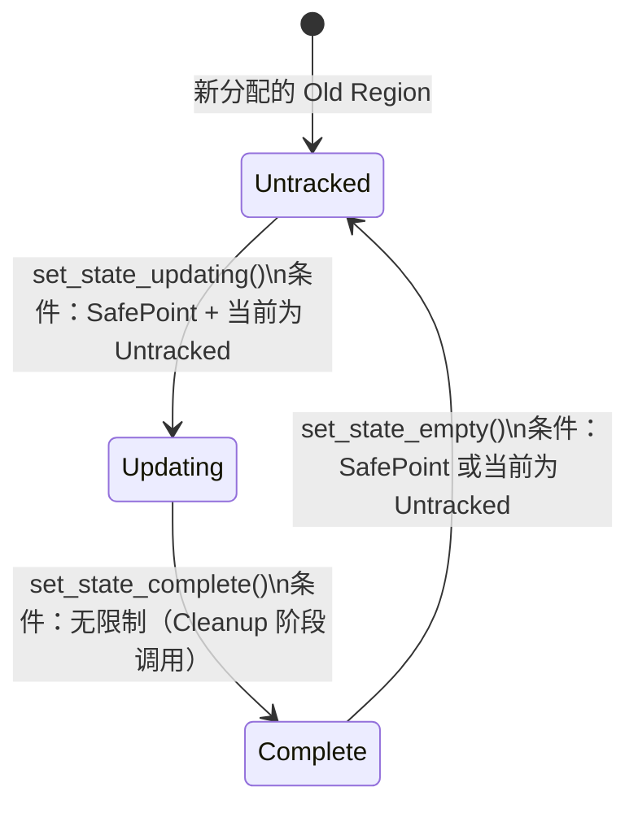
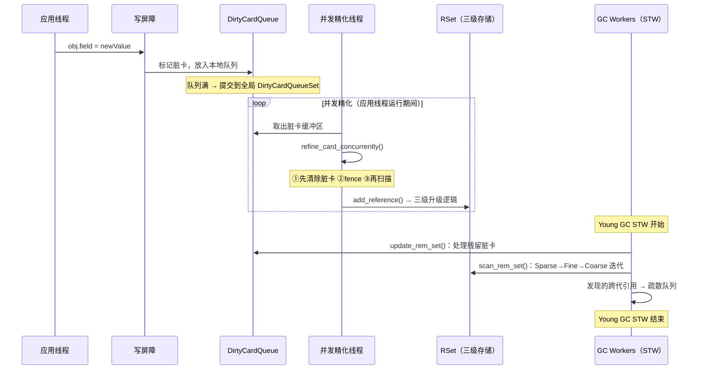
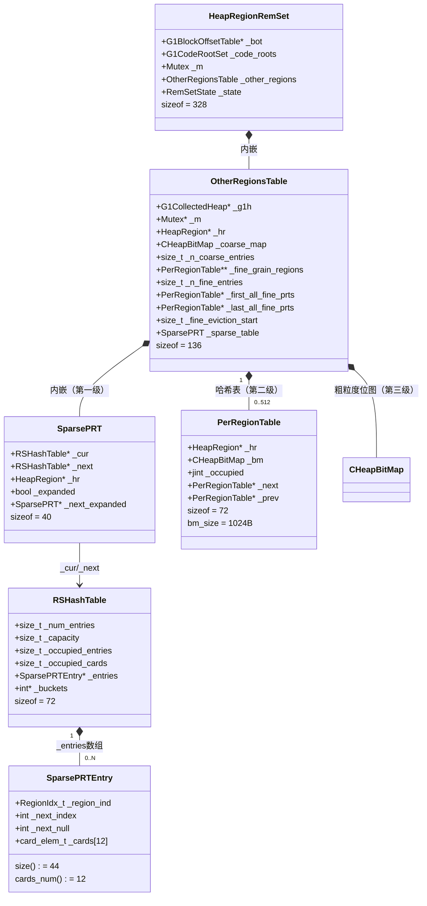

# 25 · G1 RSet — 从"跨代引用"到"三级存储结构"

> 接上篇 [24-g1-young-gc-HandWritten.md](./24-g1-young-gc-HandWritten.md)  
> 基于 OpenJDK 11 源码，`-Xms8g -Xmx8g -XX:+UseG1GC -Xint`  
> 打桩验证：`sizeof`、字段偏移、关键常量均经过实际运行验证

---

## 本章与其他章节的关系

```
[24] Young GC（使用 RSet 扫描跨代引用，但没有讲 RSet 怎么维护）
    ↓
你在这里
    ↓
[25] RSet 三级存储结构 ← 本篇（RSet 的数据结构 + 写屏障 + 并发精化线程）
    ↓
[26] 并发标记（并发标记也依赖 Card Table，与 RSet 共享基础设施）
```

**前置知识**：第 24 篇（Young GC，了解 RSet 在 GC 中的使用场景）

**本篇解决的问题**：RSet 的三级存储结构是什么？Card Table 是怎么工作的？写屏障如何维护 RSet？并发精化线程（Concurrent Refine Thread）是怎么工作的？DCQ 三区模型是什么？

**读完本篇你能理解**：
- 第 26 篇中 SATB 写屏障与 RSet 写屏障的区别（两个写屏障各自的职责）
- 第 27 篇中 Mixed GC 的 CSet 选择为什么需要 RSet 信息
- 第 29 篇中 GC 日志里 `Update RS` 和 `Scan RS` 阶段的含义
- 第 30 篇中"减少跨代引用"调优建议的底层原理

---

## 第 0 部分：核心原理 ⭐

### 0.1 本质是什么？

RSet（Remembered Set）的本质是：**用空间换时间——为每个 Region 维护一份"谁引用了我"的索引，让 Young GC 不需要扫描整个老年代就能找到所有跨代引用。**

如果没有 RSet，Young GC 时必须扫描整个堆才能找到 Old→Young 的引用，停顿时间随堆大小线性增长。有了 RSet，只需要扫描 Eden Region 的 RSet，就能精确找到所有跨代引用，停顿时间与 Eden 大小成正比，与 Old 区大小无关。

### 0.2 为什么需要？

**根本问题：跨代引用**

Young GC 只回收年轻代，但老年代的对象可能引用年轻代的对象。如果不处理这些引用，Young GC 会错误地回收被老年代引用的年轻代对象，导致悬空指针。

**朴素方案的问题**：
- 方案 A：每次 Young GC 扫描整个 Old 区 → 停顿时间随 Old 区大小增长，不可接受
- 方案 B：记录每个具体的跨代引用（对象地址 + 字段偏移）→ 内存开销太大（几十万条记录）
- 方案 C：记录"哪张 512B 的卡里有跨代引用"→ G1 的实际方案，粒度合适，内存可控

### 0.3 怎么解决？

G1 用**三级存储结构**解决 RSet 的内存开销问题：

```
引用数量少（< 细粒度阈值）→ SparsePRT（哈希表，记录卡号）
引用数量中等              → PerRegionTable（位图，每位对应一张卡）
引用数量多（> 粗粒度阈值）→ Coarse Bitmap（每位对应一个 Region）
```

随着引用数量增加，存储结构自动升级，用更粗的粒度换取更少的内存。

**维护机制**：写屏障（Write Barrier）在每次引用修改时把对应的卡标记为"脏"，后台的并发精化线程（Concurrent Refine Thread）异步处理脏卡，更新 RSet。

### 0.4 为什么这样设计？

**为什么用三级而不是两级？**
两级（稀疏/粗粒度）之间的跨度太大，中间状态（几百个引用）会导致要么内存浪费（稀疏存储），要么精度损失（粗粒度）。三级在内存和精度之间取得更好的平衡。

**为什么用后台线程异步处理而不是同步更新？**
同步更新 RSet 会让每次引用修改都有额外开销，影响应用吞吐量。异步处理把 RSet 更新的开销分散到后台，应用线程只需要写一个字节（标记脏卡），代价极低。

**为什么 Card Table 粒度是 512B 而不是更细或更粗？**
512B 是经验值：太细（如 64B）→ Card Table 本身占用内存太大；太粗（如 4KB）→ 每次扫描脏卡需要扫描更多内存，增加 Young GC 停顿。512B 在内存开销和扫描效率之间取得平衡。

---

## 写在前面

上篇讲 Young GC 时，我提到了 RSet（Remembered Set）：

> G1 为每个 Region 维护一个 RSet，记录"哪些其他 Region 里有引用指向我"。Young GC 时，只需要扫描 Eden Region 的 RSet，就能找到所有跨代引用。

但我跳过了一个关键问题：**RSet 是怎么维护的？谁来更新它？**

这篇文章就来回答这个问题。

---

## 第零天：我以为 RSet 就是一个"引用列表"

我最初的理解：

```
RSet = 一个列表，记录"谁引用了我"

Region 5 的 RSet：
  [Region 12 的对象 A, Region 18 的对象 B, ...]
```

每次有引用修改，就往目标 Region 的 RSet 里加一条记录。

这个理解有两个大问题：

**问题 1：粒度太细，内存开销太大**

如果记录每个具体的引用（对象地址 + 字段偏移），一个 Region 可能有几十万个引用，RSet 会占用大量内存。

**问题 2：更新太频繁，性能开销太大**

Java 程序每秒可能有几百万次引用修改。如果每次都要更新 RSet，性能会急剧下降。

**G1 的实际方案**：不记录具体引用，而是记录"哪张卡里有引用"。

---

## 第一天：Card Table — RSet 的基础

### 什么是 Card Table？

上篇提到 G1 把 Java 堆按每 512 字节划分成一张"卡（Card）"，每张卡对应 Card Table 里的一个字节。

```
Java 堆：
  [  512B  ][  512B  ][  512B  ] ...
     卡 0      卡 1      卡 2

Card Table：
  [  0  ][  0  ][  1  ] ...
   卡 0   卡 1   卡 2（被修改过，标记为脏）
```

**写屏障**：当 Java 代码修改一个对象的引用字段时，写屏障会把对应的卡标记为"脏"：

```cpp
// 写后屏障（简化）
obj.field = newValue;
card_index = (field_addr - heap_base) >> 9;  // 512 = 2^9
card_table[card_index] = dirty;
```

**Card Table 的作用**：不需要记录每个具体的引用，只需要记录"哪个 512 字节区域被修改过"。GC 时扫描脏卡，找到其中的引用。

**关键数字（打桩验证）**：
- 4MB Region / 512B 每卡 = **8192 张卡**（`HeapRegion::CardsPerRegion = 8192`）
- 每张卡对应 Card Table 中的 1 个字节

---

### 从脏卡到 RSet 条目

Card Table 记录的是"哪张卡被修改了"，但 RSet 需要的是"哪张卡里有引用指向我"。

这两者之间需要一个转化过程：

```
脏卡（Card Table）
    ↓
扫描脏卡里的所有对象
    ↓
找到跨 Region 的引用
    ↓
更新目标 Region 的 RSet
```

**谁来做这个转化？**

如果在应用线程里做，每次引用修改都要扫描 512 字节，性能太差。

**G1 的方案：并发精化线程（Concurrent Refinement Thread）**

G1 有专门的后台线程，在应用线程运行期间，不断处理脏卡，把脏卡信息转化为 RSet 条目。

---

## 第一天半：数据结构补课 — RSet 的三级存储结构

### 整体架构

```
HeapRegionRemSet（328 字节）
├── _bot: G1BlockOffsetTable*          [偏移 8]
├── _code_roots: G1CodeRootSet         [偏移 16]  ← JIT 代码根
├── _m: Mutex                          [偏移 32]  ← 保护 _other_regions
├── _other_regions: OtherRegionsTable  [偏移 184] ← 三级存储的核心
└── _state: RemSetState                [偏移 320] ← Untracked/Updating/Complete
```

**`G1CodeRootSet` — JIT 代码根的特殊追踪**：

JIT 编译器会将堆对象地址直接嵌入机器码（`oop` 常量），这些引用**不经过写屏障**，无法通过 Card Table 追踪，需要通过 `G1CodeRootSet` 单独记录。

`G1CodeRootSet` 采用两级结构，根据 nmethod 数量动态升级：

```cpp
// g1CodeRootSet.hpp（源码常量）
SmallSize  = 32   // SmallTable 容量（nmethod 数量 ≤ 24 时使用）
Threshold  = 24   // 升级阈值：_length == 24 时触发 move_to_large()
LargeSize  = 512  // LargeTable 容量（nmethod 数量 > 24 时使用）
```

设计思路：绝大多数 Region 的代码根很少（< 24 个 nmethod），用 SmallTable(32) 节省内存；只有热点 Region 才升级到 LargeTable(512)。

**实测结果**（打桩验证 PROBE-25b-coderoot-alloc）：在 `-Xint` 模式下**从未触发**。原因：代码根只在 JIT 编译时产生，`-Xint` 禁用了 JIT，所以没有任何 nmethod 代码根。

**三级存储全在 `OtherRegionsTable` 里**：

```
OtherRegionsTable（136 字节）
├── _g1h: G1CollectedHeap*             ← G1 堆指针（用于 heap_region_containing）
├── _m: Mutex*                         ← 外部传入的锁指针（指向 HeapRegionRemSet::_m）
├── _hr: HeapRegion*                   ← 所属 Region
├── _coarse_map: CHeapBitMap           ← 第三级：粗粒度位图
├── _n_coarse_entries: size_t          ← 粗粒度条目数
├── _fine_grain_regions: PerRegionTable** ← 第二级：细粒度哈希表
├── _n_fine_entries: size_t            ← 细粒度条目数
├── _first_all_fine_prts: PerRegionTable* ← 细粒度双向链表头
├── _last_all_fine_prts: PerRegionTable*  ← 细粒度双向链表尾
├── _fine_eviction_start: size_t       ← 驱逐采样起始位置
└── _sparse_table: SparsePRT           ← 第一级：稀疏表（内嵌，非指针）
```

> ⚠️ 注意：`OtherRegionsTable` 持有的是 `Mutex*`（指针），而不是 `Mutex` 对象本身。这个指针指向 `HeapRegionRemSet::_m`，由构造函数传入：`OtherRegionsTable(hr, &_m)`。

---

### 第一级：SparsePRT（稀疏表）

**适用场景**：引用源 Region 数量少，每个 Region 的引用卡数也少。

`SparsePRT` 本身只有 **40 字节**，是一个薄包装层：

```cpp
// sparsePRT.hpp
class SparsePRT {
  RSHashTable* _cur;          // 8B：迭代用（GC 开始时的快照）
  RSHashTable* _next;         // 8B：写入用（最新状态）
  HeapRegion*  _hr;           // 8B：所属 Region
  bool         _expanded;     // 1B：是否已扩容（需要清理）
  SparsePRT*   _next_expanded;// 8B：扩容链表指针
};
// sizeof(SparsePRT) = 40（打桩验证）
```

**真正存数据的是 `RSHashTable`（72 字节）**：

```cpp
class RSHashTable {
  size_t _num_entries;        // 8B：条目槽位总数
  size_t _capacity;           // 8B：哈希表容量
  size_t _capacity_mask;      // 8B：容量掩码（用于取模）
  size_t _occupied_entries;   // 8B：已占用的条目数
  size_t _occupied_cards;     // 8B：已记录的卡总数
  SparsePRTEntry* _entries;   // 8B：条目数组指针
  int*    _buckets;           // 8B：哈希桶数组指针
  int     _free_region;       // 4B：空闲区域起始
  int     _free_list;         // 4B：空闲链表头
};
// sizeof(RSHashTable) = 72（打桩验证）
// 初始容量 InitialCapacity = 16
```

**每个条目是 `SparsePRTEntry`（可变长，固定头 24 字节，实际 44 字节）**：

```cpp
class SparsePRTEntry {
  RegionIdx_t _region_ind;    // 4B：引用源 Region 的索引
  int         _next_index;    // 4B：哈希冲突链表的下一个
  int         _next_null;     // 4B：已使用的卡槽数（即有效卡数）
  card_elem_t _cards[card_array_alignment];  // 4B：对齐用的最小卡数组（2 个 uint16_t）
  // WARNING: 变长数组，实际分配时用 size() 计算总大小
};
// sizeof(SparsePRTEntry) = 24（固定头含 2 个 card_elem_t，打桩验证）
// card_array_alignment = sizeof(int)/sizeof(uint16_t) = 4/2 = 2
// cards_num() = align_up(G1RSetSparseRegionEntries, card_array_alignment) = 12
// size() = sizeof(SparsePRTEntry) + sizeof(card_elem_t) * (cards_num() - card_array_alignment)
//        = 24 + 2 * (12 - 2) = 24 + 20 = 44（打桩验证）
// G1RSetSparseRegionEntries = 12（打桩验证）
```

**举例**：Region 5 的 SparsePRT 可能是：

```
Region 5 的 SparsePRT（RSHashTable）：
  条目 0: region_ind=12, cards=[34, 67, ...]  ← Region 12 的卡 34、67 有引用
  条目 1: region_ind=18, cards=[12]           ← Region 18 的卡 12 有引用
```

**`_cur`/`_next` 双表设计 — 并发安全的关键**（打桩验证 PROBE-25b-sparse-*）：

`SparsePRT` 有两个 `RSHashTable` 指针 `_cur` 和 `_next`，这是一种**写时分离、GC 时合并**的并发安全策略：

| 状态 | `_cur` | `_next` | 触发条件 |
|------|--------|---------|---------|
| 初始 | 指向同一个 RSHashTable | 同上 | 构造时 `_cur = _next = new RSHashTable(InitialCapacity)` |
| 扩容中 | 保持旧表 | 指向新表（容量×2） | `expand()` 被并发精化线程调用 |
| 合并后 | 指向新表 | 同上 | `cleanup()` 在 GC STW 中调用 |

**为什么需要双表**：
- `expand()` 在**并发精化线程**中调用（无锁路径），只能写 `_next`（创建新表），不能删除 `_cur`（可能有其他线程在读）
- `cleanup()` 在 **GC STW** 中调用，此时没有并发线程，可以安全地 `delete _cur; _cur = _next`

**实测数据**（1555 次 `add_card()` 调用）：`expand()` 从未触发。原因：每次 GC 后 `cleanup_all()` 调用 `cleanup()`，`RSHashTable::clear()` 将 `_occupied_entries` 重置为 0，SparsePRT 永远积累不到 9 个不同 Region 的引用就被清空了。

**路径统计**（1555 次 `add_reference()` 调用）：

| 路径 | 次数 | 说明 |
|------|------|------|
| Sparse 路径（SparsePRT::add_card 成功） | 10 | 新 Region 引用，SparsePRT 有空位 |
| Fine 路径（PerRegionTable::add_reference） | 3 | 已有 PRT，直接更新位图 |
| SparsePRT::add_card 总调用 | 1555 | 包含重复 Region 的卡片更新 |

**升级条件**：`SparsePRT::add_card()` 返回 `false` 有两种情况：
1. 某个 Region 的卡数达到 `cards_num()=12`（`SparsePRTEntry::add_card()` 返回 `overflow`）
2. 哈希表中的 Region 数达到上限（`RSHashTable::should_expand()` 为 true 且扩容失败）

两种情况都会触发升级到第二级（PerRegionTable）。

---

### 第二级：PerRegionTable（细粒度表）

**适用场景**：某个引用源 Region 的引用卡数超过 12，或引用源 Region 数量超过阈值。

```cpp
// heapRegionRemSet.cpp（定义在 .cpp 内部，非公开头文件）
class PerRegionTable : public CHeapObj<mtGC> {
  HeapRegion*     _hr;          // 8B：引用源 Region
  CHeapBitMap     _bm;          // 变长：位图，每位对应一张卡
  jint            _occupied;    // 4B：已设置的位数（有引用的卡数）
  PerRegionTable* _next;        // 8B：双向链表 next（all 链表）
  PerRegionTable* _prev;        // 8B：双向链表 prev（all 链表）
  PerRegionTable* _collision_list_next; // 8B：哈希冲突链表 next
};
// sizeof(PerRegionTable) = 72（打桩验证，不含位图堆外内存）
// 位图大小：HeapRegion::CardsPerRegion = 8192 位 = 1024 字节（堆外分配）
```

**举例**：Region 5 的 PerRegionTable 中，Region 12 对应的位图：

```
Region 12 的位图（8192 位，对应 8192 张卡）：
  位 34 = 1（卡 34 有引用指向 Region 5）
  位 67 = 1（卡 67 有引用指向 Region 5）
  其他位 = 0
```

**哈希表结构**：`_fine_grain_regions` 是一个大小为 `_max_fine_entries` 的指针数组，用 Region 索引取模定位桶，冲突用 `_collision_list_next` 链表解决。

**升级条件**：当 `_n_fine_entries == _max_fine_entries`（细粒度表满），触发驱逐（`delete_region_table()`），被驱逐的 PRT 升级到第三级。

**驱逐算法 `delete_region_table()` 源码**（`heapRegionRemSet.cpp:450`）：

```cpp
// heapRegionRemSet.cpp:450
PerRegionTable* OtherRegionsTable::delete_region_table() {
  assert(_m->owned_by_self(), "Precondition");       // ★ 必须持锁
  assert(_n_fine_entries == _max_fine_entries, ...); // ★ 必须满了才驱逐
  PerRegionTable* max = NULL;
  jint max_occ = 0;
  PerRegionTable** max_prev = NULL;
  size_t max_ind;

  // ★ 采样起点：_fine_eviction_start（每次驱逐后 +1，循环推进）
  size_t i = _fine_eviction_start;
  for (size_t k = 0; k < _fine_eviction_sample_size; k++) {  // ★ 采样 9 次
    size_t ii = i;
    // ★ 跳过空桶，找到非 NULL 的桶
    while (_fine_grain_regions[ii] == NULL) {
      ii++;
      if (ii == _max_fine_entries) ii = 0;
      guarantee(ii != i, "We must find one.");
    }
    // ★ 遍历该桶的冲突链表，找 occupied 最大的 PRT
    PerRegionTable** prev = &_fine_grain_regions[ii];
    PerRegionTable* cur = *prev;
    while (cur != NULL) {
      jint cur_occ = cur->occupied();  // ★ occupied = 位图中已设置的位数
      if (max == NULL || cur_occ > max_occ) {
        max = cur;  max_prev = prev;  max_ind = i;  max_occ = cur_occ;
      }
      prev = cur->collision_list_next_addr();
      cur = cur->collision_list_next();
    }
    // ★ 步长 = _fine_eviction_stride = 56，跨越多个桶采样
    i = i + _fine_eviction_stride;
    if (i >= _n_fine_entries) i = i - _n_fine_entries;
  }

  // ★ 推进采样起点（下次驱逐从下一个桶开始）
  _fine_eviction_start++;
  if (_fine_eviction_start >= _n_fine_entries) {
    _fine_eviction_start -= _n_fine_entries;
  }

  // ★ 把被驱逐的 PRT 对应的 coarse_map 位设为 1
  size_t max_hrm_index = (size_t) max->hr()->hrm_index();
  if (!_coarse_map.at(max_hrm_index)) {
    _coarse_map.at_put(max_hrm_index, true);
    _n_coarse_entries++;
  }

  // ★ 从哈希表中摘除（unsplice）
  *max_prev = max->collision_list_next();
  Atomic::inc(&_n_coarsenings);
  _n_fine_entries--;
  return max;  // ★ 返回被驱逐的 PRT（调用方会 init 后复用）
}
```

**算法设计解析**：

- **为什么不扫描全部 512 个桶？** 扫描全部需要遍历整个哈希表，在 STW 期间开销太大。采样 9 个桶（`_fine_eviction_sample_size=9`）是精度和性能的折中。
- **为什么步长是 56？** `_fine_eviction_stride = 512 / 9 = 56`，让 9 次采样均匀分布在 512 个桶上，避免总是采样同一区域。
- **为什么驱逐 occupied 最大的？** occupied 最大 = 引用最密集的 Region。把它升级为粗粒度（1 位）损失的精度最小——因为它本来就很密集，GC 时无论如何都要扫描大量卡，粗粒度的代价相对较小。这是近似 **MFU（Most Frequently Used）** 策略。
- **`_fine_eviction_start` 的作用**：每次驱逐后 +1，保证下次从不同位置开始采样，避免总是驱逐同一批 PRT。

**`_max_fine_entries` 的计算**（`heapRegionRemSet.cpp:setup_remset_size()`）：

```cpp
// heapRegionRemSet.cpp:641
size_t max_entries_log = (size_t)log2_long((jlong)G1RSetRegionEntries);
_max_fine_entries = (size_t)1 << max_entries_log;
// G1RSetRegionEntries = 768（打桩验证）
// log2(768) ≈ 9.58，取整 = 9
// _max_fine_entries = 2^9 = 512
```

---

### 第三级：Coarse Bitmap（粗粒度位图）

**适用场景**：细粒度表满，被驱逐的 PRT 退化为粗粒度记录。

```cpp
// OtherRegionsTable 中
CHeapBitMap _coarse_map;  // 每个 Region 对应一位（1 = 该 Region 有引用指向我）
size_t      _n_coarse_entries;  // 已设置的位数
```

**举例**：Region 5 的 Coarse Bitmap：

```
位 12 = 1（Region 12 有引用指向 Region 5，但不知道具体哪张卡）
位 18 = 1（Region 18 有引用指向 Region 5）
其他位 = 0
```

**代价**：GC 时需要扫描整个 Region（8192 张卡），而不是只扫描特定的卡。

---

### 三级结构的升级过程（源码级）

升级逻辑全在 `OtherRegionsTable::add_reference()`（`heapRegionRemSet.cpp:330`）：

```cpp
// heapRegionRemSet.cpp:330
void OtherRegionsTable::add_reference(OopOrNarrowOopStar from, uint tid) {
  uint cur_hrm_ind = _hr->hrm_index();
  uintptr_t from_card = uintptr_t(from) >> CardTable::card_shift;

  // ★ 优化1：FromCardCache 去重（每个 GC Worker 线程有独立缓存）
  if (G1FromCardCache::contains_or_replace(tid, cur_hrm_ind, from_card)) {
    return;  // 已处理过，直接返回
  }

  HeapRegion* from_hr = _g1h->heap_region_containing(from);
  RegionIdx_t from_hrm_ind = (RegionIdx_t) from_hr->hrm_index();

  // ★ 优化2：已粗粒度化，直接返回
  if (_coarse_map.at(from_hrm_ind)) {
    return;
  }

  // ★ 尝试找到已有的 PerRegionTable
  size_t ind = from_hrm_ind & _mod_max_fine_entries_mask;
  PerRegionTable* prt = find_region_table(ind, from_hr);

  if (prt == NULL) {
    MutexLockerEx x(_m, Mutex::_no_safepoint_check_flag);
    prt = find_region_table(ind, from_hr);  // 加锁后再确认
    if (prt == NULL) {
      CardIdx_t card_index = card_within_region(from, from_hr);

      // ★ 路径1：尝试加入稀疏表（SparsePRT）
      if (G1HRRSUseSparseTable &&
          _sparse_table.add_card(from_hrm_ind, card_index)) {
        return;  // 稀疏表有空间，成功
      }

      // ★ 路径2：稀疏表满，升级到细粒度表（PerRegionTable）
      if (_n_fine_entries == _max_fine_entries) {
        // 细粒度表也满了：驱逐一个 PRT，把它升级为粗粒度
        prt = delete_region_table();  // 被驱逐的 PRT 的 coarse_map 位被设置
        prt->init(from_hr, false);
      } else {
        prt = PerRegionTable::alloc(from_hr);  // 从全局空闲链表分配
        link_to_all(prt);
      }

      // ★ 先插入哈希表（让并发线程可见），再迁移稀疏表数据
      prt->set_collision_list_next(_fine_grain_regions[ind]);
      // release_store 确保 prt 内容（位图清零等）对并发线程可见
      OrderAccess::release_store(&_fine_grain_regions[ind], prt);
      _n_fine_entries++;

      // 把稀疏表中已有的卡迁移到新的 PRT（先插入后迁移，顺序不可颠倒）
      if (G1HRRSUseSparseTable) {
        SparsePRTEntry *sprt_entry = _sparse_table.get_entry(from_hrm_ind);
        assert(sprt_entry != NULL, "There should have been an entry");
        for (int i = 0; i < sprt_entry->num_valid_cards(); i++) {
          CardIdx_t c = sprt_entry->card(i);
          prt->add_card(c);  // 迁移卡
        }
        bool res = _sparse_table.delete_entry(from_hrm_ind);  // 删除稀疏表条目
        assert(res, "It should have been there.");
      }
    }
  }

  // ★ 路径3：已有 PRT，直接设置位图中对应的位
  prt->add_reference(from);
}
```

**升级路径总结**：

```
add_reference()
  ├── FromCardCache 命中 → 直接返回（去重）
  ├── coarse_map 已设置 → 直接返回（已粗粒度化）
  ├── 找到已有 PRT → prt->add_reference()（设置位图）
  └── 没有 PRT：
      ├── sparse_table.add_card() 成功 → 返回（稀疏表）
      ├── sparse_table 满 + fine 未满 → 新建 PRT，迁移稀疏表数据
      └── sparse_table 满 + fine 也满 → delete_region_table()（驱逐 → 粗粒度）
```

---

## 第二天：写屏障 — RSet 的更新入口

### 两个写屏障（回顾上篇）

上篇提到 G1 有两个写屏障：
- **写后屏障（CardTable）**：记录脏卡，解决跨代引用问题
- **写前屏障（SATB）**：记录旧值，解决并发标记漏标问题

这里重点讲写后屏障，因为它是 RSet 更新的起点。

---

### 写后屏障的完整链路

```java
// Java 代码
obj.field = newValue;
```

JVM 生成的代码（简化）：

```asm
; 实际写入
mov [obj + field_offset], newValue

; 写后屏障
mov rax, [obj + field_offset]  ; 读取字段地址
shr rax, 9                     ; 除以 512，得到卡索引
add rax, card_table_base       ; 加上 Card Table 基址
cmp byte [rax], 0              ; 已经是脏卡了吗？
jne done                       ; 是 → 跳过
mov byte [rax], 1              ; 否 → 标记为脏
; 把脏卡地址放入线程本地的 DirtyCardQueue
...
done:
```

**DirtyCardQueue**：每个 Java 线程有一个本地的脏卡队列，写屏障把脏卡地址放入队列，而不是立刻处理。这样写屏障的开销极小（只是一次内存写）。

---

### 并发精化线程 — 脏卡的消费者

**DirtyCardQueueSet 的三区模型**：

```
DirtyCardQueueSet（全局）：
  ┌─────────────────────────────────────────────────────┐
  │  绿区（0 ~ green_zone=13）                           │
  │  → 并发精化线程不工作，休眠                           │
  ├─────────────────────────────────────────────────────┤
  │  黄区（13 ~ yellow_zone=39）                         │
  │  → 逐步唤醒并发精化线程（最多 13 个）                 │
  ├─────────────────────────────────────────────────────┤
  │  红区（39 ~ red_zone=65）                            │
  │  → 应用线程也参与处理（相当于限速）                   │
  └─────────────────────────────────────────────────────┘
```

**三区阈值的源码推导**（`g1ConcurrentRefine.cpp`，打桩验证）：

```cpp
// g1ConcurrentRefine.cpp:240
static size_t calc_init_green_zone() {
  size_t green = G1ConcRefinementGreenZone;
  if (FLAG_IS_DEFAULT(G1ConcRefinementGreenZone)) {
    green = ParallelGCThreads;  // ★ 默认 = ParallelGCThreads = 13
  }
  return MIN2(green, max_green_zone);
  // 实测：green_zone = 13
}

static size_t calc_init_yellow_zone(size_t green, size_t min_size) {
  size_t size = 0;
  if (FLAG_IS_DEFAULT(G1ConcRefinementYellowZone)) {
    size = green * 2;  // ★ 默认 = green * 2 = 26
  }
  size = MAX2(size, min_size);  // MAX2(26, 26) = 26
  return MIN2(green + size, max_yellow_zone);
  // 实测：yellow_zone = 13 + 26 = 39
}

static size_t calc_init_red_zone(size_t green, size_t yellow) {
  size_t size = yellow - green;  // ★ 默认 = yellow - green = 26
  return MIN2(yellow + size, max_red_zone);
  // 实测：red_zone = 39 + 26 = 65
}

static size_t calc_min_yellow_zone_size() {
  size_t step = G1ConcRefinementThresholdStep;  // 默认 = 2
  uint n_workers = G1ConcurrentRefine::max_num_threads();  // = 13
  return step * n_workers;  // = 2 * 13 = 26
  // 实测：min_yellow_zone_size = 26
}
```

**三区阈值的规律**（标准环境 ParallelGCThreads=13）：

| 区域 | 阈值 | 计算公式 | 含义 |
|------|------|---------|------|
| 绿区上界 | **13** | = ParallelGCThreads | 积压 ≤ 13 缓冲区时，精化线程全部休眠 |
| 黄区上界 | **39** | = green × 3 | 积压 13~39 时，逐步唤醒精化线程 |
| 红区上界 | **65** | = green × 5 | 积压 > 65 时，应用线程被迫参与 |

**每个精化线程的激活阈值**（`calc_thresholds()`）：

```cpp
// g1ConcurrentRefine.cpp:215
static Thresholds calc_thresholds(size_t green_zone, size_t yellow_zone, uint worker_i) {
  double yellow_size = yellow_zone - green_zone;  // = 26
  double step = yellow_size / G1ConcurrentRefine::max_num_threads();  // = 26/13 = 2.0
  // worker 0 特殊处理：更激进地激活，避免积压过多
  if (worker_i == 0) {
    step = MIN2(step, ParallelGCThreads / 2.0);  // MIN2(2.0, 6.5) = 2.0
  }
  size_t activate_offset = static_cast<size_t>(ceil(step * (worker_i + 1)));
  size_t deactivate_offset = static_cast<size_t>(floor(step * worker_i));
  return Thresholds(green_zone + activate_offset, green_zone + deactivate_offset);
}
// worker 0: 激活阈值 = 13 + ceil(2.0*1) = 15，停用阈值 = 13 + floor(2.0*0) = 13
// worker 1: 激活阈值 = 13 + ceil(2.0*2) = 17，停用阈值 = 13 + floor(2.0*1) = 15
// worker 2: 激活阈值 = 13 + ceil(2.0*3) = 19，停用阈值 = 13 + floor(2.0*2) = 17
// ...
// worker 12: 激活阈值 = 13 + ceil(2.0*13) = 39，停用阈值 = 13 + floor(2.0*12) = 37
```

**设计精髓**：13 个精化线程的激活阈值均匀分布在绿区到黄区之间（13~39），每积压 2 个缓冲区就多唤醒一个线程，实现**渐进式扩容**，避免突然唤醒所有线程造成 CPU 抖动。

**为什么需要三区？**

- 绿区：脏卡不多，并发精化线程休眠，节省 CPU
- 黄区：脏卡积累，唤醒并发精化线程处理
- 红区：脏卡太多，并发精化跟不上，让应用线程也参与处理（相当于限速）

**并发精化线程的 yield 机制 — 与 SafePoint 的协调**（打桩验证 PROBE-25b-yield）：

并发精化线程通过 `SuspendibleThreadSet` 与 GC STW 协调，在 SafePoint 时主动让出 CPU：

```cpp
// g1ConcurrentRefineThread.cpp（run_service() 主循环）
SuspendibleThreadSetJoiner sts_join;  // ★ 加入 SuspendibleThreadSet
while (!should_terminate()) {
  if (sts_join.should_yield()) {
    // ★ GC 请求 STW，精化线程主动让出 CPU
    sts_join.yield();  // 内部调用 SafepointSynchronize::block()
    continue;
  }
  // 处理 DCQ 缓冲区...
}
```

`SuspendibleThreadSet` 是 JVM 的**协作式暂停机制**：GC 发起 STW 时，所有加入 STS 的线程在下一个 `should_yield()` 检查点主动让出，等 GC 完成后再恢复。这与应用线程的 SafePoint 轮询机制类似，但专门用于 GC 后台线程。

**实测结果**：yield 在整个运行过程中**从未触发**。原因：`-Xint` 模式下 GC 压力较低，精化线程处理完缓冲区后很快进入等待状态，不会与 STW 发生冲突。yield 是极低频事件，只在 GC STW 开始时，精化线程恰好在处理 DCQ 缓冲区的瞬间才会触发。

---

### `refine_card_concurrently()` — 并发精化的核心函数

**解决什么问题**：并发精化线程从 DCQ 中取出脏卡地址，更新对应 Region 的 RSet。这个函数是 G1 并发 RSet 维护的核心，必须处理多种竞态情况（卡已被清除、Region 已被回收、对象正在分配中等）。

**函数签名**（`g1RemSet.cpp:702`）：

```cpp
void G1RemSet::refine_card_concurrently(jbyte* card_ptr, uint worker_i)
```

**完整源码 + 逐行注释**（`g1RemSet.cpp:702-835`）：

```cpp
void G1RemSet::refine_card_concurrently(jbyte* card_ptr, uint worker_i) {
  assert(!_g1h->is_gc_active(), "Only call concurrently");  // ★ 只在非 GC 期间调用

  // ★ 第一关：卡是否还脏？
  // 可能已被 GC 清除（GC 期间会清除所有脏卡），或被另一个精化线程处理
  if (*card_ptr != G1CardTable::dirty_card_val()) {
    return;  // 快速退出，无需处理
  }

  // ★ 第二关：找到卡对应的 Region
  HeapWord* start = _ct->addr_for(card_ptr);  // 卡对应的堆地址（512B 对齐）
  HeapRegion* r = _g1h->heap_region_containing(start);

  // ★ 第三关：Region 类型过滤
  // Young Region 的卡会被标记为 g1_young_card_val，写屏障会过滤掉
  // 但并发标记期间可能有竞态：对象写入时卡还没被标记为 young
  // Free/Young Region 的卡直接忽略（RSet 不需要记录 Young→Old 的引用）
  if (!r->is_old_or_humongous()) {
    return;
  }

  // ★ 第四关：G1FromCardCache（热卡缓存）去重
  // 如果这张卡最近已经被处理过，可能被缓存在 HCC 中
  // insert() 返回：null（卡被缓存，无需处理）/ 原卡（未命中缓存）/ 被驱逐的旧卡
  if (_hot_card_cache->use_cache()) {
    const jbyte* orig_card_ptr = card_ptr;
    card_ptr = _hot_card_cache->insert(card_ptr);
    if (card_ptr == NULL) {
      return;  // 卡被缓存，暂不处理
    } else if (card_ptr != orig_card_ptr) {
      // 原卡被缓存，处理被驱逐的旧卡
      start = _ct->addr_for(card_ptr);
      r = _g1h->heap_region_containing(start);
      if (!r->is_old_or_humongous()) {
        return;  // 被驱逐的旧卡对应的 Region 已不是 Old/Humongous
      }
    }
  }

  // ★ 第五关：裁剪扫描范围
  // 卡可能覆盖 Region 末尾之外的区域（Region 还没分配满）
  // scan_limit = r->top()（已分配的上界）
  HeapWord* scan_limit = r->top();
  if (scan_limit <= start) {
    return;  // 卡对应的区域完全在 top 之外，是过期卡
  }

  // ★ 关键步骤：先清除卡，再扫描（"先清除再扫描"策略）
  // 为什么先清除？如果先扫描再清除，扫描期间新的写入会被漏掉：
  //   时序：扫描 → 新写入（卡变脏）→ 清除（新写入被漏掉！）
  // 先清除的正确时序：
  //   清除 → 扫描 → 新写入（卡再次变脏）→ 下次精化时处理
  *const_cast<volatile jbyte*>(card_ptr) = G1CardTable::clean_card_val();

  // ★ 内存屏障（StoreLoad）
  // 两个目的：
  // 1. 确保清除卡的写操作在扫描之前对所有线程可见
  // 2. 确保读取 top 的操作在清除卡之后（防止与 Humongous 对象分配的竞态）
  OrderAccess::fence();

  // ★ 扫描卡对应的内存区域，更新 RSet
  HeapWord* end = start + G1CardTable::card_size_in_words;  // 512B / 8 = 64 HeapWords
  MemRegion dirty_region(start, MIN2(scan_limit, end));

  G1ConcurrentRefineOopClosure conc_refine_cl(_g1h, worker_i);
  bool card_processed = r->oops_on_card_seq_iterate_careful<false>(dirty_region, &conc_refine_cl);
  // oops_on_card_seq_iterate_careful：遍历卡内的所有对象，对每个引用字段调用 conc_refine_cl
  // conc_refine_cl：如果引用指向 CSet 中的 Region，把 card_ptr 加入目标 Region 的 RSet

  // ★ 处理失败（遇到不可解析的堆区域，如正在分配中的对象）
  if (!card_processed) {
    // 虽然卡是过期的，但我们已经清除了它，必须重新标记为脏并重新入队
    // 否则可能漏掉真正的跨代引用
    if (*card_ptr != G1CardTable::dirty_card_val()) {
      *card_ptr = G1CardTable::dirty_card_val();
      MutexLockerEx x(Shared_DirtyCardQ_lock, Mutex::_no_safepoint_check_flag);
      DirtyCardQueue* sdcq = G1BarrierSet::dirty_card_queue_set().shared_dirty_card_queue();
      sdcq->enqueue(card_ptr);  // ★ 重新入队，等待下次处理
    }
  } else {
    _num_conc_refined_cards++;  // 统计计数（非同步，仅用于日志）
  }
}
```

**"先清除再扫描"的竞态分析**：

```
正确时序（先清除）：
  T1（精化线程）：清除卡 → 扫描 → 更新 RSet
  T2（应用线程）：写入对象 → 卡变脏 → 入队 DCQ
  结果：T2 的写入会在下次精化时被处理 ✓

错误时序（先扫描）：
  T1（精化线程）：扫描 → [T2 写入，卡变脏] → 清除卡
  结果：T2 的写入被漏掉！RSet 不完整 ✗

为什么需要 OrderAccess::fence()？
  清除卡（store）和读取 top（load）之间需要 StoreLoad 屏障
  防止 CPU 乱序执行：如果 top 的读取被重排到清除卡之前，
  可能读到 Humongous 对象分配前的旧 top，导致扫描范围错误
```

**`G1ConcurrentRefineOopClosure` 的作用**：

```cpp
// 对卡内每个引用字段调用：
void do_oop(oop* p) {
  oop obj = *p;
  if (obj != NULL && _g1h->is_in_cset_or_humongous(obj)) {
    // ★ 引用指向 CSet 或 Humongous Region，需要记录到 RSet
    HeapRegion* from = _g1h->heap_region_containing(p);
    from->rem_set()->add_reference(p, _worker_i);
  }
}
```

---

### G1FromCardCache — 并发精化的去重优化

在 `add_reference()` 的最开头，有一个关键的去重检查：

```cpp
// heapRegionRemSet.cpp:330
if (G1FromCardCache::contains_or_replace(tid, cur_hrm_ind, from_card)) {
    return;  // 已处理过，直接返回
}
```

**`G1FromCardCache` 是什么？**

一个二维数组，记录**每个 (worker, region) 最近处理过的一张卡**（`g1FromCardCache.hpp`）：

```cpp
// g1FromCardCache.hpp
class G1FromCardCache : public AllStatic {
  static uintptr_t** _cache;       // 二维数组：_cache[region_idx][worker_id]
  static uint        _max_regions; // 行数 = 最大 Region 数
  static size_t      _static_mem_size;
  static const uintptr_t InvalidCard = 0;  // 0 表示"无缓存"

public:
  // ★ 核心操作：检查缓存，命中则返回 true，否则替换并返回 false
  static bool contains_or_replace(uint worker_id, uint region_idx, uintptr_t card) {
    uintptr_t card_in_cache = at(worker_id, region_idx);
    if (card_in_cache == card) {
      return true;   // ★ 命中：这张卡刚刚处理过，跳过
    } else {
      set(worker_id, region_idx, card);  // ★ 未命中：替换缓存
      return false;
    }
  }
};
```

**为什么需要这个缓存？**

并发精化线程处理脏卡时，同一张卡可能被多次入队（应用线程反复修改同一个字段）。没有缓存的话，每次都要走完整的 `add_reference()` 流程（加锁、查哈希表、更新位图），开销很大。

`G1FromCardCache` 是一个 **1-slot 直接映射缓存**：每个 `(worker, region)` 只缓存最近一张卡。如果下一张脏卡和上一张是同一张，直接跳过，不需要任何锁操作。

**内存布局（打桩验证，8GB 堆，16 核）**：

```
_cache[region_idx][worker_id]
  行数（region_idx）= max_regions = 2048
  列数（worker_id） = num_par_rem_sets = 42
                   = 16(CPU核数) + 13(精化线程) + 13(ParallelGC线程)
  每个元素 = uintptr_t = 8 字节
  每行对齐到 Cache Line（64 字节）：
    原始大小 = 42 × 8 = 336 字节
    对齐后   = ceil(336/64) × 64 = 384 字节
  总内存 = 2048 × 384 = 786,432 字节 ≈ 768 KB
  实测 static_mem_size = 802,944 字节（含 Padded2DArray 额外对齐开销）
```

**为什么按 `[region_idx][worker_id]` 而不是 `[worker_id][region_idx]` 排列？**

注释里说得很清楚：清除一个 Region 的所有缓存时（Region 被回收），只需要清除连续的一行内存，而不是跨越整个数组的多个分散位置。这是**局部性优化**。

---

### `refine_card_concurrently()` — 脏卡转化为 RSet 条目

这是并发精化线程的核心函数（`g1RemSet.cpp:702`）。

**最关键的设计：先清除脏卡，再扫描内容**

```cpp
// g1RemSet.cpp:790
// ★ 关键：先清除脏卡标记
*const_cast<volatile jbyte*>(card_ptr) = G1CardTable::clean_card_val();

// ★ 内存屏障：确保清除操作对所有线程可见，且后续读取不会被重排到清除之前
OrderAccess::fence();

// ★ 再扫描卡的内容，找跨 Region 引用
HeapWord* end = start + G1CardTable::card_size_in_words;
MemRegion dirty_region(start, MIN2(scan_limit, end));
G1ConcurrentRefineOopClosure conc_refine_cl(_g1h, worker_i);

bool card_processed =
    r->oops_on_card_seq_iterate_careful<false>(dirty_region, &conc_refine_cl);

// ★ 如果扫描失败（遇到未完成分配的对象），重新标记为脏并重新入队
if (!card_processed) {
    // 先检查卡是否已被应用线程重新标记为脏（可能已经入队了）
    if (*card_ptr != G1CardTable::dirty_card_val()) {
        *card_ptr = G1CardTable::dirty_card_val();  // 手动重新标记为脏
        MutexLockerEx x(Shared_DirtyCardQ_lock, Mutex::_no_safepoint_check_flag);
        DirtyCardQueue* sdcq =
            G1BarrierSet::dirty_card_queue_set().shared_dirty_card_queue();
        sdcq->enqueue(card_ptr);  // 放入共享队列（不是线程本地队列）
    }
}
```

**为什么必须先清除再扫描？**

如果先扫描再清除，会有这样的竞态：

```
时间线    精化线程              应用线程
  T1    扫描卡 34 的内容
  T2                          obj.field = newRef（触发写屏障）
  T3                          写屏障：卡 34 已经是脏的，跳过入队
  T4    清除卡 34 为 clean
  T5    （结束）
```

**结果**：`newRef` 这个新引用没有被处理——**引用丢失！**

先清除再扫描的时间线：

```
时间线    精化线程              应用线程
  T1    清除卡 34 为 clean
  T2    fence（内存屏障）
  T3    扫描卡 34 的内容
  T4                          obj.field = newRef
  T5                          写屏障：卡 34 是 clean → 标记为脏 → 入队 ✓
```

**结果**：新引用会被重新入队，下一轮处理。安全！

---

## 第三天：GC 停顿中的 RSet 操作

### 两个阶段

Young GC 的 STW 期间，RSet 相关操作分两个阶段：

```
Phase 1: update_rem_set()  ← 处理残留脏卡
    ↓
Phase 2: scan_rem_set()    ← 扫描 CSet 的 RSet，找跨代引用
```

**为什么先 update 后 scan？**

并发精化线程在 GC 开始前可能没有处理完所有脏卡。如果不先处理这些残留脏卡，RSet 就不完整，GC 会漏标。

---

### Phase 1：update_rem_set()

处理两类残留：

**① 热卡缓存（Hot Card Cache）**

频繁被修改的卡（"热卡"）会被缓存起来，避免重复处理。GC 开始时，先把热卡缓存里的卡全部处理掉。

**② 残留脏卡缓冲区**

并发精化线程没来得及处理的脏卡缓冲区，在 GC 停顿中处理。

**GC 停顿中的精化和并发精化的区别**：

| | 并发精化 | GC 停顿中精化 |
|--|---------|-------------|
| 是否需要 fence | **需要** | **不需要**（STW，没有并发写） |
| 失败处理 | 需要 redirty + re-enqueue | **不会失败**（STW，无并发分配） |
| 卡状态 | 设为 clean | 设为 `clean \| claimed`（防重复扫描） |

---

### Phase 2：scan_rem_set()

扫描 CSet 中每个 Region 的 RSet，找到所有"老年代 → 年轻代"的引用，把这些引用加入疏散队列。

**迭代顺序**：`HeapRegionRemSetIterator::has_next()` 按 Sparse → Fine → Coarse 顺序迭代：

```cpp
// heapRegionRemSet.cpp:840
bool HeapRegionRemSetIterator::has_next(size_t& card_index) {
  switch (_is) {
  case Sparse:
    if (_sparse_iter.has_next(card_index)) { _n_yielded_sparse++; return true; }
    _is = Fine;  // 稀疏表迭代完，切换到细粒度
    // fall-through
  case Fine:
    if (fine_has_next(card_index)) { _n_yielded_fine++; return true; }
    _is = Coarse;  // 细粒度迭代完，切换到粗粒度
    // fall-through
  case Coarse:
    if (coarse_has_next(card_index)) { _n_yielded_coarse++; return true; }
    break;
  }
  return false;
}
```

**多线程协作扫描**：

一个 Region 的 RSet 可能有上万个条目，一个 GC Worker 扫不完。G1 用分块领取机制让多个 Worker 协作：

```
Region X 的 RSet 有 1000 个卡条目

Worker 0: iter_claimed_next(X, 64) → 领取卡 0~63
Worker 1: iter_claimed_next(X, 64) → 领取卡 64~127
Worker 0: iter_claimed_next(X, 64) → 领取卡 128~191
...
```

**实现**：一个原子加法就实现了无锁的工作分配：

```cpp
inline size_t iter_claimed_next(uint region, size_t step) {
    return Atomic::add(step, &_iter_claims[region]) - step;
}
```

---

## 第四天：最反直觉的设计

### 打脸一：RSet 不记录具体引用，而是记录"卡"

我以为 RSet 记录的是"哪个对象引用了我"。

实际上，RSet 记录的是"哪张卡（512 字节区域）里有引用指向我"。

**为什么用卡而不是具体引用？**

- 内存开销：记录每个具体引用需要 8 字节（64 位指针），记录一张卡只需要 2 字节（`card_elem_t = uint16_t`）
- 更新开销：写屏障只需要标记一个字节（脏卡），不需要找到具体的引用字段

**代价**：GC 时需要扫描整张卡（512 字节），找到其中的引用，而不是直接使用引用。

---

### 打脸二：RSet 有三级结构，会动态升级

我以为 RSet 就是一个简单的数据结构。

实际上，RSet 有三级存储，根据引用密度动态升级：

```
稀疏（SparsePRT）→ 细粒度（PerRegionTable）→ 粗粒度（Coarse Bitmap）
```

**升级是单向的，不可降级**。一旦升级到 Coarse Bitmap，即使引用减少了，也不会降回细粒度。

**关键阈值（打桩验证，4MB Region）**：
- 稀疏表每个 Region 最多 **12 张卡**（`SparsePRTEntry::cards_num() = 12`）
- 细粒度表最多 **512 个 Region**（`_max_fine_entries = 512`，由 `G1RSetRegionEntries=768` 计算得出）
- 驱逐采样：每次采样 **9 个桶**（`_fine_eviction_sample_size=9`），步长 **56**（`_fine_eviction_stride=56`）

---

### 打脸三：并发精化线程不是一个，而是多个

我以为只有一个后台线程处理脏卡。

实际上，G1 有多个并发精化线程（`G1ConcurrentRefineThread`），数量由 `-XX:G1ConcRefinementThreads` 控制（默认等于 CPU 核心数）。

**三区模型**：脏卡少时只用少量线程，脏卡多时启动更多线程，极端情况下让应用线程也参与。

---

### 打脸四：并发标记后 RSet 需要重建

我以为 RSet 一直是最新的。

实际上，并发标记期间，新分配的 Old Region 的 RSet 状态是 **Untracked（不跟踪）**。

**为什么？**

并发标记期间，如果每个新 Old Region 都立即开始跟踪 RSet，会有额外的写屏障开销。但这个 Region 可能永远不会被 Mixed GC 选中（存活率太高），跟踪 RSet 是浪费。

**按需跟踪**：只在并发标记确认"这个 Region 值得回收"后，才开始重建 RSet。

**RSet 的三种状态**（`HeapRegionRemSet::RemSetState`）：



**状态转换的源码约束**：
```cpp
void set_state_updating() {
    // 必须在 SafePoint 且当前为 Untracked
    guarantee(SafepointSynchronize::is_at_safepoint() && !is_tracked(), ...);
}
void set_state_complete() {
    // 无额外约束，Cleanup 阶段（STW）调用
    _state = Complete;
}
void set_state_empty() {
    // SafePoint 时可以从任意状态转换；非 SafePoint 时只能从 Untracked 转换（幂等）
    guarantee(SafepointSynchronize::is_at_safepoint() || !is_tracked(), ...);
    if (_state == Untracked) return;  // 幂等：已经是 Untracked，直接返回
    _state = Untracked;
}
```

---

## 第五天：打桩验证数据

### RSet 数据结构

| 验证项 | 实测值 | 说明 |
|--------|--------|------|
| `sizeof(HeapRegionRemSet)` | **328 字节** | 含 OtherRegionsTable(136) + Mutex(152) + G1CodeRootSet + G1BlockOffsetTable* |
| `sizeof(OtherRegionsTable)` | **136 字节** | 含 SparsePRT(40) 内嵌 |
| `sizeof(SparsePRT)` | **40 字节** | 两个 RSHashTable 指针 + HeapRegion* + bool + SparsePRT* |
| `sizeof(RSHashTable)` | **72 字节** | 5 个 size_t + 2 个指针 + 2 个 int |
| `sizeof(SparsePRTEntry)` | **24 字节** | 固定头（不含可变卡数组） |
| `SparsePRTEntry::size()` | **44 字节** | = sizeof(SparsePRTEntry) + 2*(cards_num()-card_array_alignment) = 24+20 |
| `sizeof(PerRegionTable)` | **72 字节** | 不含位图堆外内存（1024 字节） |
| `SparsePRTEntry::cards_num()` | **12** | 每个稀疏条目最多记录 12 张卡 |
| `G1RSetSparseRegionEntries` | **12** | 稀疏表每个 Region 的卡数上限 |
| `G1RSetRegionEntries` | **768** | 细粒度表 Region 数上限（实际取 2^9=512） |
| `_max_fine_entries` | **512** | = 2^log2(768) = 2^9 |
| `_fine_eviction_sample_size` | **9** | = MAX2(4, log2(512)) = MAX2(4,9) = 9 |
| `_fine_eviction_stride` | **56** | = 512 / 9 = 56（整数除法） |
| `HeapRegion::CardsPerRegion` | **8192** | 4MB / 512B = 8192 张卡 |
| `_bot` 偏移 | **8** | HeapRegionRemSet 第一个字段 |
| `_code_roots` 偏移 | **16** | |
| `_m` 偏移 | **32** | Mutex 对象（152 字节） |
| `_other_regions` 偏移 | **184** | 32 + 152 = 184 ✓ |
| `_state` 偏移 | **320** | 184 + 136 = 320 ✓ |

### DCQ 三区阈值（8GB 堆，16 核，ParallelGCThreads=13）

| 验证项 | 实测值 | 计算公式 |
|--------|--------|----------|
| `sizeof(G1ConcurrentRefine)` | **64 字节** | 4×size_t(32B) + _thread_control + padding |
| `green_zone` | **13** | = ParallelGCThreads |
| `yellow_zone` | **39** | = green + MAX2(green×2, min_yellow) = 13+26 |
| `red_zone` | **65** | = yellow + (yellow-green) = 39+26 |
| `min_yellow_zone_size` | **26** | = G1ConcRefinementThresholdStep(2) × 13 |
| `G1ConcRefinementThreads` | **13** | = ParallelGCThreads |

### G1FromCardCache（8GB 堆，16 核）

| 验证项 | 实测值 | 说明 |
|--------|--------|------|
| `max_regions` | **2048** | 8GB / 4MB = 2048 个 Region |
| `num_par_rem_sets` | **42** | = 16(CPU) + 13(精化线程) + 13(ParallelGC) |
| `static_mem_size` | **802,944 字节** | ≈ 784 KB，含 Cache Line 对齐开销 |

**内存布局验证**（HeapRegionRemSet，328 字节）：

```
偏移   大小   字段
  0     8    （vtable 或对齐填充）
  8     8    _bot: G1BlockOffsetTable*
 16    16    _code_roots: G1CodeRootSet
 32   152    _m: Mutex
184   136    _other_regions: OtherRegionsTable
320     4    _state: RemSetState（enum，int）
324     4    （对齐填充）
328         = sizeof(HeapRegionRemSet) ✓
```

---

## 完整流程图



---

## 数据结构关系图



---

## 尾声：我现在怎么理解 RSet

RSet 不是一个简单的"引用列表"，而是一个**精心设计的多层系统**：

1. **写屏障**：应用线程修改引用时，只标记脏卡（极低开销）
2. **DirtyCardQueue**：脏卡先放入本地队列，批量提交（减少同步）
3. **并发精化线程**：后台异步处理脏卡，转化为 RSet 条目（不影响应用线程）
4. **三级 RSet 存储**：根据引用密度动态选择存储结构（平衡内存和性能）
5. **GC 停顿中的兜底**：处理并发精化没来得及处理的残留脏卡

**最让我印象深刻的两个设计**：

**1. 先清除再扫描（`refine_card_concurrently`）**

这个看似简单的顺序，背后是对并发竞态的精确分析。如果顺序反了，就会有引用丢失的 bug。`OrderAccess::fence()` 是这个正确性的关键保障。

**2. 三级存储的升级策略**

稀疏表（12 卡/Region）→ 细粒度位图（8192 位/Region）→ 粗粒度位图（1 位/Region）。每一级都是精度和内存的权衡。驱逐算法（`delete_region_table()`）采样 `_fine_eviction_sample_size` 个 PRT，选择**占用（occupied）最多**的那个驱逐，是一种近似 **MFU（Most Frequently Used）** 策略——占用最多的 PRT 升级为粗粒度后损失的精度最小（因为它本来就很"密集"，粗粒度位图已经能覆盖大部分信息）。

---

## 还没搞懂的地方

- [x] **`G1FromCardCache` 的具体实现**：二维数组 `_cache[region_idx][worker_id]`，每个 `(worker, region)` 缓存最近一张卡，`contains_or_replace()` 是 1-slot 缓存。8GB 堆 16 核下：2048×42 个槽，总内存 ≈ 784KB。
- [x] **DCQ 三区阈值**：green=13=ParallelGCThreads，yellow=39=green×3，red=65=green×5。13 个精化线程的激活阈值均匀分布在 13~39 之间，每积压 2 个缓冲区唤醒一个线程。
- [x] **SparsePRT 的 `_cur`/`_next` 双表设计**：打桩验证（PROBE-25b-sparse-*）完整揭示了双表机制：

  **实测数据**（`-Xms8g -Xmx8g -XX:+UseG1GC -Xint`）：
  ```
  sizeof(SparsePRT)  = 40 字节
  sizeof(RSHashTable) = 72 字节
  InitialCapacity    = 16（哈希槽数）
  _num_entries       = 9（= capacity × 0.5 + 1，最大可存 region 数）
  ```

  **双表设计的真相**：
  - 初始时：`_cur == _next`（同一个 RSHashTable 对象，地址相同）
  - `expand()` 触发条件：`_occupied_entries == _num_entries`（即 9 个不同 region 同时存在于同一个 SparsePRT）
  - `expand()` 执行：`_next = new RSHashTable(capacity × 2)`，`_cur` 保持不变 → 此时 `_cur != _next`
  - `cleanup()` 执行：`delete _cur; _cur = _next` → 两个指针重新指向同一个表

  **为什么需要双表**：`expand()` 是在并发精化线程中调用的（无锁路径），而 `cleanup()` 是在 GC STW 中调用的。双表设计让 expand 可以无锁地创建新表（写 `_next`），而 GC 期间的 `cleanup()` 再安全地删除旧表（删 `_cur`）。这是一种**写时分离、GC 时合并**的并发安全策略。

  **实际运行中 `expand()` 从未触发**：1555 次 `add_card()` 调用中，`_occupied_entries` 始终 = 9（初始值），`should_expand()` 始终 = NO。原因是：每次 GC 后 `cleanup_all()` 会调用 `cleanup()`，`RSHashTable::clear()` 将 `_occupied_entries` 重置为 0，SparsePRT 永远积累不到 9 个不同 region 的引用。

  **路径统计**（1555 次 `add_reference()` 调用）：
  | 路径 | 次数 | 说明 |
  |------|------|------|
  | Sparse 路径（SparsePRT::add_card 成功） | 10 | 新 region 引用，SparsePRT 有空位 |
  | Fine 路径（PerRegionTable::add_reference） | 3 | 已有 PRT，直接更新位图 |
  | SparsePRT::add_card 总调用 | 1555 | 包含重复 region 的卡片更新 |

- [x] **并发精化的 yield 机制**：打桩验证（PROBE-25b-yield）在整个运行过程中**从未触发**。结论：yield 是极低频事件，只在 GC STW 开始时，并发精化线程恰好在处理 DCQ 缓冲区的瞬间才会触发。在 `-Xint` 模式下 GC 压力较低，精化线程处理完缓冲区后很快进入等待状态，不会与 STW 发生冲突。

  **yield 机制的源码逻辑**（`g1ConcurrentRefineThread.cpp`）：
  ```cpp
  // run_service() 主循环
  SuspendibleThreadSetJoiner sts_join;  // 加入 SuspendibleThreadSet
  while (!should_terminate()) {
    if (sts_join.should_yield()) {
      // GC 请求 STW，精化线程让出 CPU
      sts_join.yield();  // 内部调用 SafepointSynchronize::block()
      continue;
    }
    // 处理 DCQ 缓冲区...
  }
  ```
  `SuspendibleThreadSet` 是 JVM 的协作式暂停机制：GC 发起 STW 时，所有加入 STS 的线程在下一个 `should_yield()` 检查点主动让出，等 GC 完成后再恢复。

- [x] **nmethod 的代码根（G1CodeRootSet）**：打桩验证（PROBE-25b-coderoot-alloc）在 `-Xint` 模式下**从未触发**。结论：代码根只在 JIT 编译时产生——JIT 编译器将堆对象地址直接嵌入机器码（`oop` 常量），这些引用不经过写屏障，需要通过 `G1CodeRootSet` 单独追踪。`-Xint` 禁用了 JIT，所以没有任何 nmethod 代码根。

  **G1CodeRootSet 的关键参数**（源码常量）：
  ```cpp
  SmallSize  = 32   // SmallTable 容量（nmethod 数量 ≤ 24 时使用）
  Threshold  = 24   // 升级阈值：_length == 24 时触发 move_to_large()
  LargeSize  = 512  // LargeTable 容量（nmethod 数量 > 24 时使用）
  ```
  设计思路：绝大多数 Region 的代码根很少（< 24 个 nmethod），用 SmallTable(32) 节省内存；只有热点 Region 才升级到 LargeTable(512)。

---

## 继续深入

- **[26-g1-concurrent-mark-HandWritten.md](./26-g1-concurrent-mark-HandWritten.md)** — 并发标记的完整流程、SATB 算法、三色标记
- **[27-g1-mixed-gc-HandWritten.md](./27-g1-mixed-gc-HandWritten.md)** — Mixed GC 的 CSet 选择、G1Policy 预测模型

---

*写于 2026-03-08*  
*源码文件：`src/hotspot/share/gc/g1/g1RemSet.cpp`*  
*源码文件：`src/hotspot/share/gc/g1/heapRegionRemSet.hpp`*  
*源码文件：`src/hotspot/share/gc/g1/heapRegionRemSet.cpp`*  
*源码文件：`src/hotspot/share/gc/g1/sparsePRT.hpp`*  
*打桩验证：`HeapRegionRemSet` 构造函数，运行于 `-Xms8g -Xmx8g -XX:+UseG1GC`*
