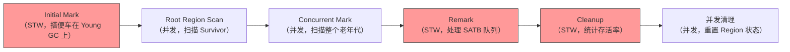
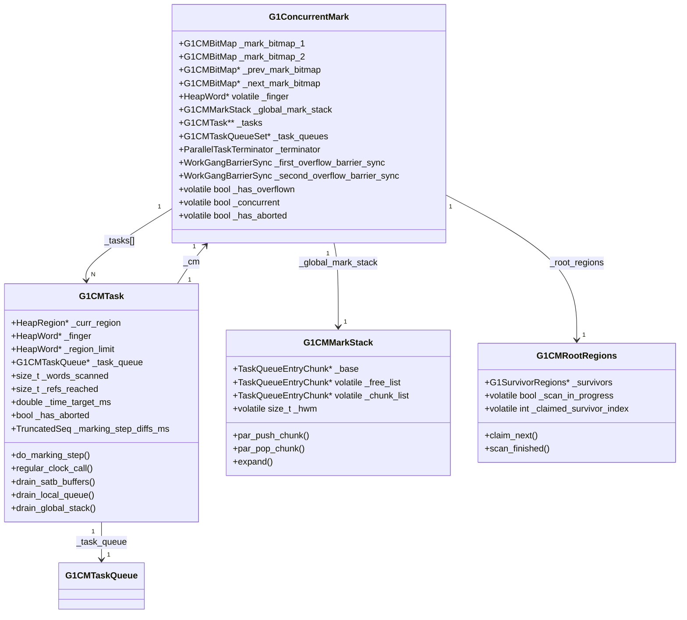
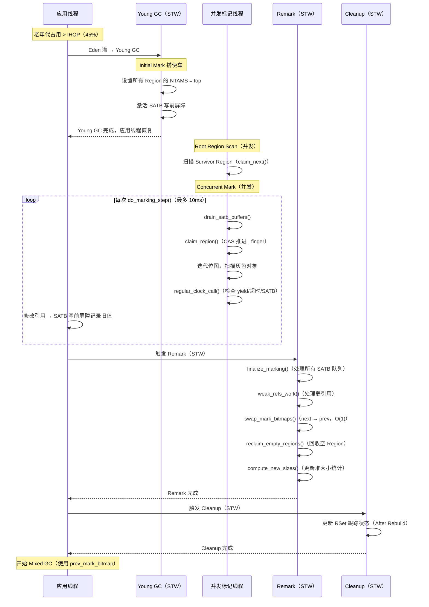

# 26 · G1 并发标记 — 从"三色标记"到 `do_marking_step()` 源码

> 接上篇 [25-g1-rset-HandWritten.md](./25-g1-rset-HandWritten.md)  
> 基于 OpenJDK 11 源码，`-Xms8g -Xmx8g -XX:+UseG1GC -Xint`  
> 源码文件：`src/hotspot/share/gc/g1/g1ConcurrentMark.cpp`（3178 行）

---

## 本章与其他章节的关系

```
[25] RSet（维护跨代引用索引，是 Young GC 的基础）
    ↓
你在这里
    ↓
[26] 并发标记与 SATB ← 本篇（统计 Old Region 存活率，为 Mixed GC 提供依据）
    ↓
[27] Mixed GC（使用并发标记的结果选择 CSet）
```

**前置知识**：第 25 篇（RSet，了解 Card Table 和写屏障的基础概念）；第 24 篇（Young GC，了解 Initial Mark 搭便车的概念）

**本篇解决的问题**：并发标记的五个阶段是什么？SATB 如何保证并发标记的正确性？`do_marking_step()` 的六个阶段是什么？双缓冲位图（prev/next bitmap）为什么需要两个？

**读完本篇你能理解**：
- 第 27 篇中 Mixed GC 的触发条件（IHOP 阈值 = 并发标记完成后的 Old 区占用比）
- 第 27 篇中 `CollectionSetChooser` 如何按 `gc_efficiency` 排序（依赖并发标记统计的存活率）
- 第 29 篇中 GC 日志里 `Concurrent Mark` 各阶段的含义
- 第 30 篇中"降低 IHOP"调优建议的底层原理

---

## 第 0 部分：核心原理 ⭐

### 0.1 本质是什么？

并发标记的本质是：**在应用线程运行的同时，用 SATB（Snapshot-At-The-Beginning）快照技术保证标记的正确性，统计每个 Old Region 的存活率，为 Mixed GC 的 CSet 选择提供依据。**

没有并发标记，G1 就不知道哪些 Old Region 的垃圾最多、最值得回收，Mixed GC 就无从下手。并发标记是 Mixed GC 的"侦察兵"——它在后台悄悄扫描老年代，把结果交给 G1Policy，让 Mixed GC 能精准选择高收益 Region。

### 0.2 为什么需要？

**根本问题：Old 区的存活率未知**

Young GC 只回收年轻代，不需要知道 Old 区的存活情况。但 Mixed GC 要选择"垃圾最多的 Old Region"，必须先知道每个 Old Region 里有多少存活对象。

**朴素方案的问题**：
- 方案 A：每次 Mixed GC 前做一次 Full GC 标记 → 停顿时间太长，违背 G1 的设计目标
- 方案 B：STW 标记整个 Old 区 → 停顿时间随 Old 区大小增长，不可接受
- 方案 C：**并发标记**——在应用线程运行时后台标记，只在开始和结束时短暂 STW → G1 的实际方案

**并发标记的核心挑战**：应用线程在运行，对象图在不断变化。如何保证标记结果的正确性？

### 0.3 怎么解决？

G1 用 **SATB（Snapshot-At-The-Beginning）** 解决并发标记的正确性问题：

**核心思路**：在并发标记开始时，对堆做一个逻辑快照（记录 TAMS 指针）。标记期间，应用线程删除引用时，把被删除的引用记录到 SATB 队列。Remark 阶段处理 SATB 队列，确保快照时存活的对象不会被漏标。

**五个阶段**：
```
Initial Mark（STW，搭 Young GC 便车）
    ↓
Root Region Scan（并发，扫描 Survivor Region）
    ↓
Concurrent Mark（并发，扫描整个 Old 区）
    ↓
Remark（STW，处理 SATB 队列，完成标记）
    ↓
Cleanup（STW，统计存活率，重置 TAMS）
```

### 0.4 为什么这样设计？

**为什么用 SATB 而不是增量更新（Incremental Update）？**
增量更新（CMS 的方案）在引用新增时记录，需要在 Remark 阶段重新扫描被修改的对象，Remark 停顿时间不可预测。SATB 在引用删除时记录，Remark 只需要处理 SATB 队列，停顿时间更可控。

**为什么 Initial Mark 要搭 Young GC 的便车？**
Initial Mark 需要 STW，如果单独触发一次 STW 就浪费了。Young GC 本来就要 STW，顺便做 Initial Mark，不增加额外停顿次数。

**为什么用双缓冲位图（prev/next bitmap）？**
并发标记期间，应用线程可能触发新的 Young GC，Young GC 需要用上一次标记的结果（prev bitmap）来判断对象存活。如果只有一个位图，并发标记会覆盖 Young GC 需要的数据。双缓冲让两者互不干扰。

---

## 写在前面

上篇讲了 RSet：G1 用 RSet 解决跨代引用问题，让 Young GC 不需要扫描整个老年代。

但 RSet 只解决了 Young GC 的问题。Mixed GC 还需要知道：**老年代里哪些对象是存活的？哪些是垃圾？**

这就是并发标记（Concurrent Mark）要解决的问题。

---

## 第零天：我以为并发标记就是"在后台扫描堆"

我最初的理解：

```
并发标记 = 在后台线程里扫描整个堆
           标记所有存活对象
           应用线程继续运行
```

这个理解有一个致命问题：

**应用线程在运行，对象图在不断变化。并发标记怎么保证正确性？**

---

## 第一天：三色标记 — 并发标记的基础

### 三色标记是什么？

并发标记用三种颜色标记对象：

```
白色：未访问（可能是垃圾）
灰色：已发现，但子对象还没扫描完
黑色：已完全扫描（自身 + 所有子对象都处理完了）
```

**标记过程**：

```
初始状态：所有对象都是白色

从 GC Roots 出发：
  1. 把 GC Roots 直接引用的对象标记为灰色
  2. 取出一个灰色对象，扫描它的所有引用字段
  3. 把未访问的引用对象标记为灰色
  4. 把当前对象标记为黑色
  5. 重复 2-4，直到没有灰色对象

最终：
  黑色 = 存活
  白色 = 垃圾（可以回收）
```

---

### 并发标记的问题：漏标

如果只有一个线程在标记，三色标记是正确的。

但如果应用线程在并发运行，会发生**漏标**：

```
初始状态：
  A（黑色）→ B（灰色）→ C（白色）

应用线程执行：
  A.ref = C    // A 直接引用 C
  B.ref = null // B 不再引用 C

标记线程继续：
  扫描 B → B 没有引用了 → B 变黑色
  C 没有被任何灰色对象引用 → C 永远是白色

最终：
  C 被认为是垃圾，但实际上 A 还引用着 C！
  → 悬空指针！程序崩溃！
```

**漏标的两个必要条件**：
1. 黑色对象新增了对白色对象的引用（A → C）
2. 灰色对象删除了对白色对象的引用（B → C 被删除）

**只要破坏其中一个条件，就能防止漏标。**

---

### G1 的方案：SATB（Snapshot-At-The-Beginning）

SATB 破坏的是**第二个条件**：不允许灰色对象删除对白色对象的引用。

**具体做法**：在引用被覆盖之前，把旧值记录下来。

```java
// Java 代码
B.ref = null;  // 删除 B → C 的引用
```

写前屏障（SATB）：

```cpp
// 写前屏障（g1BarrierSet.cpp）
old_value = B.ref;  // 读取旧值（C）
if (old_value != null && marking_active) {
    satb_queue.enqueue(old_value);  // 把 C 放入 SATB 队列
}
// 然后才执行实际写入
B.ref = null;
```

**SATB 队列里的对象会被标记为存活**，即使它们已经没有引用了。

**代价**：可能保留一些实际上已经死了的对象（浮动垃圾）。但这是安全的——宁可多保留，不能错误回收。

---

## 第一天半：数据结构完整分析

### 1. `G1ConcurrentMark` — 并发标记的"大脑"

**完整字段列表**（`g1ConcurrentMark.hpp`）：

```cpp
class G1ConcurrentMark : public CHeapObj<mtGC> {
  // ── 基础引用 ──────────────────────────────────────────────
  G1ConcurrentMarkThread* _cm_thread;     // 主控线程（调度并发标记各阶段）
  G1CollectedHeap*        _g1h;           // G1 堆指针（访问 Region、策略等）
  bool                    _completed_initialization; // 初始化完成标志

  // ── 双缓冲位图 ────────────────────────────────────────────
  G1CMBitMap              _mark_bitmap_1; // 位图实体 1（内嵌，非指针）
  G1CMBitMap              _mark_bitmap_2; // 位图实体 2（内嵌，非指针）
  G1CMBitMap*             _prev_mark_bitmap; // 指向上一轮完成的位图（Mixed GC 使用）
  G1CMBitMap*             _next_mark_bitmap; // 指向当前工作位图（并发标记写入）

  // ── 堆范围 ────────────────────────────────────────────────
  MemRegion const         _heap;          // 堆的起始/结束地址（用于边界检查）

  // ── 根区域 ────────────────────────────────────────────────
  G1CMRootRegions         _root_regions;  // Survivor 区域管理器（Root Region Scan 用）

  // ── 全局标记栈 ────────────────────────────────────────────
  G1CMMarkStack           _global_mark_stack; // 全局溢出栈（任务队列满时使用）
  HeapWord* volatile      _finger;        // 全局扫描指针（Region 对齐，指向最后一个已认领 Region 的末尾）

  // ── 任务管理 ──────────────────────────────────────────────
  uint                    _worker_id_offset;   // Worker ID 偏移（避免与 Refine 线程 ID 冲突）
  uint                    _max_num_tasks;      // 最大任务数 = ParallelGCThreads（STW 阶段也用）
  uint                    _num_active_tasks;   // 当前活跃任务数（并发阶段 ≈ ConcGCThreads）
  G1CMTask**              _tasks;              // 任务数组（每个 Worker 一个 G1CMTask）
  G1CMTaskQueueSet*       _task_queues;        // 任务队列集合（支持工作窃取）
  ParallelTaskTerminator  _terminator;         // 并行终止协议（所有队列空才能退出）

  // ── 溢出同步屏障 ──────────────────────────────────────────
  WorkGangBarrierSync     _first_overflow_barrier_sync;  // 第一屏障：停止操作全局数据
  WorkGangBarrierSync     _second_overflow_barrier_sync; // 第二屏障：确认重新初始化完成

  // ── 状态标志 ──────────────────────────────────────────────
  volatile bool           _has_overflown;      // 全局标记栈溢出标志（任何线程可设置）
  volatile bool           _concurrent;         // true=并发阶段，false=Remark STW 阶段
  volatile bool           _has_aborted;        // 标记被中止（Full GC 触发）
  volatile bool           _restart_for_overflow; // Remark 溢出后需要重启并发标记

  // ── 统计信息 ──────────────────────────────────────────────
  NumberSeq _init_times;           // Initial Mark 耗时序列
  NumberSeq _remark_times;         // Remark 耗时序列
  NumberSeq _remark_mark_times;    // Remark 标记阶段耗时
  NumberSeq _remark_weak_ref_times;// Remark 弱引用处理耗时
  NumberSeq _cleanup_times;        // Cleanup 耗时序列
  double    _total_cleanup_time;   // 累计 Cleanup 时间
  double*   _accum_task_vtime;     // 每个 Worker 的累计虚拟时间

  // ── 并发 Worker 管理 ──────────────────────────────────────
  WorkGang* _concurrent_workers;       // 并发 Worker 线程池
  uint      _num_concurrent_workers;   // 当前并发 Worker 数
  uint      _max_concurrent_workers;   // 最大并发 Worker 数 = (ParallelGCThreads+2)/4

  // ── Region 统计 ───────────────────────────────────────────
  G1RegionMarkStats* _region_mark_stats;       // 每个 Region 的存活字节统计
  HeapWord* volatile* _top_at_rebuild_starts;  // 重建 RSet 时每个 Region 的 top 快照
};
```

**关键字段生命周期**：

| 字段 | 谁设置 | 何时设置 | 设置什么值 | 谁读取 |
|------|--------|---------|-----------|--------|
| `_finger` | `reset()` | Initial Mark 开始时 | `_heap.start()`（堆起始地址） | `claim_region()` 用 CAS 推进 |
| `_prev_mark_bitmap` | `swap_mark_bitmaps()` | Cleanup 阶段 | 交换 `_next_mark_bitmap` | Mixed GC 读取存活信息 |
| `_next_mark_bitmap` | 并发标记线程 | 并发标记期间 | 标记存活对象 | Cleanup 后交换为 prev |
| `_has_overflown` | 任意 Worker | 全局栈 push 失败时 | `true` | `regular_clock_call()` 检查 |
| `_has_aborted` | `concurrent_cycle_abort()` | Full GC 触发时 | `true` | 所有 Worker 检查 |
| `_concurrent` | `set_concurrency_and_phase()` | 阶段切换时 | true/false | `regular_clock_call()` 判断是否需要 yield |

**`sizeof(G1ConcurrentMark)`**：

```
【打桩实测】标准条件：-Xms8g -Xmx8g -XX:+UseG1GC
┌────────────────────────────────────────────────────────┐
│ sizeof(G1ConcurrentMark) = 1840 字节                   │
│ _max_num_tasks = 13（= ParallelGCThreads）             │
│ _max_concurrent_workers = 3（= (13+2)/4 = 3）          │
│                                                        │
│ 打桩输出：                                              │
│ [PROBE-26] sizeof(G1ConcurrentMark) = 1840             │
│ [PROBE-26] _max_num_tasks = 13 (= ParallelGCThreads)   │
│ [PROBE-26] _max_concurrent_workers = 3                 │
└────────────────────────────────────────────────────────┘
```

**双缓冲位图的设计**：

```
_prev_mark_bitmap：上一轮并发标记的结果
  → Mixed GC 用这个决定哪些对象存活
  → Cleanup 阶段统计各 Region 的存活率

_next_mark_bitmap：当前并发标记的工作区
  → 并发标记线程往这里写
  → Remark 完成后，next 和 prev 交换（O(1) 指针交换）
```

**为什么需要两个位图？**

并发标记期间，Mixed GC 可能还在使用上一轮的标记结果（`_prev_mark_bitmap`）。如果只有一个位图，并发标记会覆盖 Mixed GC 正在使用的数据。

---

### 2. `G1CMTask` — 每个 Worker 的工作单元

**完整字段列表**（`g1ConcurrentMark.hpp`）：

```cpp
class G1CMTask : public TerminatorTerminator {
  // ── 时钟常量 ──────────────────────────────────────────────
  enum PrivateConstants {
    words_scanned_period = 12 * 1024,  // 每扫描 12K 个字调用一次时钟
    refs_reached_period  = 1024,       // 每访问 1024 个引用调用一次时钟
    init_hash_seed       = 17          // 工作窃取的哈希种子初始值
  };

  // ── 基础引用 ──────────────────────────────────────────────
  G1CMObjArrayProcessor  _objArray_processor; // 大数组分片处理器
  uint                   _worker_id;          // Worker ID
  G1CollectedHeap*       _g1h;               // G1 堆指针
  G1ConcurrentMark*      _cm;                // 并发标记控制器
  G1CMBitMap*            _next_mark_bitmap;  // 当前工作位图（快捷引用）
  G1CMTaskQueue*         _task_queue;        // 本地任务队列（灰色对象）

  // ── Region 统计缓存 ───────────────────────────────────────
  G1RegionMarkStatsCache _mark_stats_cache;  // 本地 Region 存活字节缓存（减少全局竞争）
  uint                   _calls;             // 本 Task 被调用的次数

  // ── 时间控制 ──────────────────────────────────────────────
  double                 _time_target_ms;    // 本次 do_marking_step() 的时间配额（ms）
  double                 _start_time_ms;     // 本次 do_marking_step() 的开始时间

  // ── 闭包 ──────────────────────────────────────────────────
  G1CMOopClosure*        _cm_oop_closure;    // 扫描对象引用字段的闭包

  // ── 当前扫描状态 ──────────────────────────────────────────
  HeapRegion*            _curr_region;       // 当前正在扫描的 Region（NULL 表示未持有）
  HeapWord*              _finger;            // 本地扫描指针（在 _curr_region 内移动）
  HeapWord*              _region_limit;      // 当前 Region 的扫描上限（= NTAMS）

  // ── 工作量计数器 ──────────────────────────────────────────
  size_t                 _words_scanned;           // 已扫描的字数
  size_t                 _words_scanned_limit;     // 触发时钟的字数阈值
  size_t                 _real_words_scanned_limit;// 原始阈值（未被 decrease_limits 降低前）
  size_t                 _refs_reached;            // 已访问的引用数
  size_t                 _refs_reached_limit;      // 触发时钟的引用数阈值
  size_t                 _real_refs_reached_limit; // 原始阈值

  // ── 工作窃取 ──────────────────────────────────────────────
  int                    _hash_seed;         // 工作窃取的随机哈希种子

  // ── 状态标志 ──────────────────────────────────────────────
  bool                   _has_aborted;           // 本 Task 已中止
  bool                   _has_timed_out;         // 因超时中止
  bool                   _draining_satb_buffers; // 正在处理 SATB 队列（防止递归中止）

  // ── 统计 ──────────────────────────────────────────────────
  NumberSeq              _step_times_ms;          // 历史 step 耗时序列
  double                 _elapsed_time_ms;        // 本 Task 总耗时
  double                 _termination_time_ms;    // 终止协议耗时
  double                 _termination_start_time_ms; // 进入终止协议的时间
  TruncatedSeq           _marking_step_diffs_ms;  // step 时间偏差序列（用于预测下次配额）
};
```

**关键字段生命周期**：

| 字段 | 谁设置 | 何时设置 | 含义 |
|------|--------|---------|------|
| `_curr_region` | `setup_for_region()` | `claim_region()` 成功后 | 当前持有的 Region |
| `_finger` | `setup_for_region()` | 认领新 Region 时 | 指向 Region 的 `bottom()` |
| `_region_limit` | `setup_for_region()` | 认领新 Region 时 | 指向 Region 的 NTAMS |
| `_time_target_ms` | `do_marking_step()` 开头 | 每次调用时 | 本次允许运行的最大时间 |
| `_words_scanned_limit` | `recalculate_limits()` | 每次时钟调用后 | 下次触发时钟的字数阈值 |

---

### 3. `G1CMMarkStack` — 全局溢出栈

**设计思路**：当 Worker 的本地队列（`G1CMTaskQueue`，4096 个槽位）满了，需要把多余的灰色对象推入全局栈。全局栈以 **Chunk** 为单位管理内存，每个 Chunk 存 1023 个 `G1TaskQueueEntry`。

```cpp
class G1CMMarkStack {
  static const size_t EntriesPerChunk = 1024 - 1; // 1023 个条目/Chunk（1 个槽位给 next 指针）

  struct TaskQueueEntryChunk {
    TaskQueueEntryChunk* next;              // 链表指针（8B）
    G1TaskQueueEntry data[EntriesPerChunk]; // 实际数据（1023 * 8 = 8184B）
  };
  // sizeof(TaskQueueEntryChunk) = 8 + 8184 = 8192B = 8KB（恰好一个内存页！）

  size_t               _max_chunk_capacity; // 最大 Chunk 数（由 MarkStackSize 决定）
  TaskQueueEntryChunk* _base;               // 预分配内存的起始地址
  size_t               _chunk_capacity;     // 当前最大 Chunk 数

  // ── 防 False Sharing 的三个缓存行对齐字段 ──────────────────
  char                 _pad0[DEFAULT_CACHE_LINE_SIZE];
  TaskQueueEntryChunk* volatile _free_list;  // 空闲 Chunk 链表（CAS 操作）
  char                 _pad1[...];
  TaskQueueEntryChunk* volatile _chunk_list; // 含数据的 Chunk 链表（CAS 操作）
  volatile size_t      _chunks_in_chunk_list;// 含数据的 Chunk 数量
  char                 _pad2[...];

  volatile size_t      _hwm;  // 高水位线（已分配的 Chunk 数，单调递增）
  char                 _pad4[...];
};
```

**为什么 Chunk 大小恰好是 8KB？**

8KB = 一个内存页大小。这样每个 Chunk 的分配和释放都是页对齐的，减少 TLB miss。

**`G1TaskQueueEntry` — 栈中存储的元素**：

```cpp
class G1TaskQueueEntry {
  void* _holder;  // 存储两种内容（用最低位区分）：
                  //   普通对象指针（oop）：最低位 = 0
                  //   大数组切片地址（HeapWord*）：最低位 = 1
  static const uintptr_t ArraySliceBit = 1;
};
```

**为什么需要数组切片？**

大数组（如 `new Object[1000000]`）包含大量引用，一次性扫描会：
1. 耗时过长，影响响应性
2. 阻塞其他线程获取工作

解决方案：将大数组分片，每片作为独立任务入栈，支持并行处理。

---

### 4. TAMS（Top At Mark Start）— 保护新分配对象

每个 Region 有两个 TAMS 指针：

```
Region 内存布局：
┌─────────────────────────────────────────────────────────────┐
│ bottom      PTAMS      NTAMS        top              end    │
│   ↓           ↓          ↓           ↓                ↓    │
│ [上轮标记的对象] │ [本轮标记的对象] │ [标记期间新分配] │ [未分配] │
│ prev_bitmap 判断│ next_bitmap 判断  │ 默认存活，不标记  │          │
└─────────────────────────────────────────────────────────────┘
```

- **PTAMS**（`_prev_top_at_mark_start`）：上一轮标记开始时的 `top`，`prev_mark_bitmap` 覆盖 `[bottom, PTAMS)`
- **NTAMS**（`_next_top_at_mark_start`）：本轮标记开始时的 `top`，`next_mark_bitmap` 覆盖 `[bottom, NTAMS)`
- **NTAMS 以上的对象**：标记期间新分配的，默认存活（不需要标记）

**NTAMS 的设置时机**：Initial Mark 阶段（STW），`NoteStartOfMarkHRClosure::do_heap_region()` 遍历所有 Region，设置 `NTAMS = top`。

---

## 第二天：并发标记的五个阶段

### 完整流程



---

### Phase 1：Initial Mark（STW）

**目标**：设置每个 Region 的 NTAMS，标记 GC Roots 直接可达的对象，激活 SATB 写前屏障。

**搭便车**：Initial Mark 不单独触发 STW，而是搭便车在 Young GC 的 STW 中完成。

```cpp
// g1ConcurrentMark.cpp:843
void G1ConcurrentMark::pre_initial_mark() {
  // 遍历所有 Region，设置 NTAMS = top
  NoteStartOfMarkHRClosure startcl;
  _g1h->heap_region_iterate(&startcl);
}

// NoteStartOfMarkHRClosure::do_heap_region()
bool do_heap_region(HeapRegion* r) {
  r->note_start_of_marking();  // ★ 设置 NTAMS = top
  return false;
}
```

**GC 日志**：

```
[0.456s] GC(4) Pause Young (Concurrent Start) 156M->67M(8192M) 15.7ms
                              ↑ 这次 Young GC 同时完成了 Initial Mark
```

---

### Phase 2：Root Region Scan（并发）

**目标**：扫描 Survivor Region 里的对象，把它们引用的老年代对象加入标记栈。

**为什么要单独扫描 Survivor？**

Survivor Region 里的对象是 Young GC 后存活的，它们可能引用了老年代的对象。这些引用是并发标记的起点之一。

**必须在下一次 Young GC 开始前完成**：因为下一次 Young GC 会修改 Survivor Region 的内容。

```cpp
// g1ConcurrentMark.cpp:980
void G1ConcurrentMark::scan_root_region(HeapRegion* hr, uint worker_id) {
  assert(hr->next_top_at_mark_start() == hr->bottom(), "invariant");
  G1RootRegionScanClosure cl(_g1h, this, worker_id);

  HeapWord* curr = hr->bottom();
  const HeapWord* end = hr->top();
  while (curr < end) {
    Prefetch::read(curr, interval);  // ★ 预取下一个对象（减少 cache miss）
    oop obj = oop(curr);
    int size = obj->oop_iterate_size(&cl);  // ★ 扫描对象的所有引用字段
    curr += size;
  }
}
```

---

### Phase 3：Concurrent Mark（并发）— 核心

**目标**：并发扫描整个老年代，标记所有存活对象。

**并发 Worker 数量计算**（`g1ConcurrentMark.cpp:359`）：

```cpp
static uint scale_concurrent_worker_threads(uint num_gc_workers) {
  return MAX2((num_gc_workers + 2) / 4, 1U);
  // 标准环境：ParallelGCThreads=13 → (13+2)/4=3 个并发 Worker
  // 设计意图：并发标记不能占用太多 CPU，约 1/4 的 GC 线程数
}
```

**Worker 的工作循环**（`g1ConcurrentMark.cpp:923`）：

```cpp
void G1CMConcurrentMarkingTask::work(uint worker_id) {
  SuspendibleThreadSetJoiner sts_join;  // ★ 加入 STS，允许在 SafePoint 时让步

  G1CMTask* task = _cm->task(worker_id);
  task->record_start_time();
  if (!_cm->has_aborted()) {
    do {
      task->do_marking_step(G1ConcMarkStepDurationMillis,  // ★ 每次最多运行 10ms
                            true  /* do_termination */,
                            false /* is_serial */);
      _cm->do_yield_check();  // ★ 检查是否需要让步（SafePoint 请求）
    } while (!_cm->has_aborted() && task->has_aborted());
    // ★ 如果 task 中止但 cm 没中止，说明是超时/SATB 队列满，需要重启
  }
  task->record_end_time();
}
```

**关键设计**：`do_marking_step()` 每次最多运行 `G1ConcMarkStepDurationMillis`（默认 10ms），然后检查是否需要让步。这保证了并发标记不会长时间占用 CPU。

---

## 第三天：`do_marking_step()` 源码逐行分析

### 解决什么问题？

`do_marking_step()` 是并发标记的**核心执行单元**，每次调用最多运行 `time_target_ms` 毫秒。它需要在有限时间内尽可能多地标记对象，同时：
1. 定期检查是否需要让步（SafePoint 请求、Full GC 中止）
2. 处理 SATB 队列（应用线程产生的写前屏障记录）
3. 处理全局标记栈溢出

**函数签名**（`g1ConcurrentMark.cpp:2681`）：

```cpp
void G1CMTask::do_marking_step(double time_target_ms,
                               bool do_termination,  // 是否参与终止协议
                               bool is_serial);      // 是否串行执行（Remark 时为 true）
```

### 完整源码 + 逐行注释

**阶段一：初始化**（`g1ConcurrentMark.cpp:2681-2730`）

```cpp
void G1CMTask::do_marking_step(double time_target_ms,
                               bool do_termination,
                               bool is_serial) {
  _start_time_ms = os::elapsedVTime() * 1000.0;  // ★ 记录开始时间（虚拟时间，不含 sleep）

  bool do_stealing = do_termination && !is_serial;  // ★ 只有并发阶段才做工作窃取

  // ★ 用衰减均值预测本次 step 的时间偏差，动态调整时间配额
  // 如果上次 step 超时了 2ms，这次就把配额减少 2ms，避免持续超时
  double diff_prediction_ms = _g1h->g1_policy()->predictor()
                                  .get_new_prediction(&_marking_step_diffs_ms);
  _time_target_ms = time_target_ms - diff_prediction_ms;

  // ★ 重置工作量计数器
  _words_scanned = 0;
  _refs_reached  = 0;
  recalculate_limits();  // 重新计算触发时钟的阈值

  // ★ 清除中止标志（每次 step 都是新的开始）
  clear_has_aborted();
  _has_timed_out = false;
  _draining_satb_buffers = false;

  ++_calls;  // 统计调用次数

  // ★ 设置闭包（扫描对象引用字段用）
  G1CMBitMapClosure bitmap_closure(this, _cm);
  G1CMOopClosure cm_oop_closure(_g1h, this);
  set_cm_oop_closure(&cm_oop_closure);

  // ★ 如果全局栈已经溢出，立即中止（进入溢出处理流程）
  if (_cm->has_overflown()) {
    set_has_aborted();
  }
```

**阶段二：预处理**（`g1ConcurrentMark.cpp:2731-2745`）

```cpp
  // ★ 第一步：先把 SATB 队列清空
  // 为什么先处理 SATB？因为 SATB 队列里的对象是"快照"中存活的，
  // 必须标记，否则会漏标。
  drain_satb_buffers();

  // ★ 第二步：部分清空本地队列和全局栈（partially=true 表示不清空到底）
  // 为什么是"部分"？因为后面的主循环会继续处理，这里只是预热。
  drain_local_queue(true);
  drain_global_stack(true);
```

**阶段三：主扫描循环**（`g1ConcurrentMark.cpp:2747-2850`）

```cpp
  do {
    if (!has_aborted() && _curr_region != NULL) {
      // ★ 已持有一个 Region，继续扫描
      update_region_limit();  // 更新 NTAMS（可能被 Young GC 修改了）

      MemRegion mr = MemRegion(_finger, _region_limit);  // 从上次停止的位置继续

      if (mr.is_empty()) {
        giveup_current_region();  // ★ Region 扫描完毕，释放
        regular_clock_call();     // ★ 检查是否需要中止
      } else if (_curr_region->is_humongous() && mr.start() == _curr_region->bottom()) {
        // ★ Humongous 对象：只检查 start 位置的标记位
        if (_next_mark_bitmap->is_marked(mr.start())) {
          bitmap_closure.do_addr(mr.start());  // 扫描 Humongous 对象的引用
        }
        giveup_current_region();
        regular_clock_call();
      } else if (_next_mark_bitmap->iterate(&bitmap_closure, mr)) {
        // ★ 普通 Region：迭代位图，对每个已标记的对象调用 bitmap_closure
        // iterate() 返回 true 表示扫描完了整个范围
        giveup_current_region();
        regular_clock_call();
      } else {
        // ★ iterate() 返回 false 表示被中止（时钟触发）
        // _finger 已经指向最后扫描的对象，下次从这里继续
        assert(has_aborted(), "only way to abort bitmap iteration");
        HeapWord* const new_finger = _finger + ((oop)_finger)->size();
        if (new_finger >= _region_limit) {
          giveup_current_region();  // 对象是最后一个，释放 Region
        } else {
          move_finger_to(new_finger);  // 移动本地 finger，跳过已扫描的对象
        }
      }
    }

    // ★ 每轮循环后都部分清空队列（保持队列不积压）
    drain_local_queue(true);
    drain_global_stack(true);

    // ★ 认领新 Region（如果当前没有持有 Region）
    while (!has_aborted() && _curr_region == NULL && !_cm->out_of_regions()) {
      HeapRegion* claimed_region = _cm->claim_region(_worker_id);
      if (claimed_region != NULL) {
        setup_for_region(claimed_region);  // ★ 设置 _curr_region/_finger/_region_limit
      }
      regular_clock_call();  // ★ 认领 Region 可能很慢（跳过大量空 Region），需要频繁检查时钟
    }

  } while (_curr_region != NULL && !has_aborted());
  // ★ 循环退出条件：
  //   1. 所有 Region 都扫描完了（_curr_region == NULL && out_of_regions()）
  //   2. 被中止（has_aborted()）
```

**阶段四：工作窃取**（`g1ConcurrentMark.cpp:2870-2900`）

```cpp
  // ★ 完全清空本地队列和全局栈
  drain_local_queue(false);
  drain_global_stack(false);

  // ★ 工作窃取：从其他 Worker 的队列偷任务
  if (do_stealing && !has_aborted()) {
    while (!has_aborted()) {
      G1TaskQueueEntry entry;
      if (_cm->try_stealing(_worker_id, &_hash_seed, entry)) {
        scan_task_entry(entry);  // ★ 扫描偷来的对象
        drain_local_queue(false);
        drain_global_stack(false);
      } else {
        break;  // 没有可偷的任务了
      }
    }
  }
```

**阶段五：终止协议**（`g1ConcurrentMark.cpp:2905-2940`）

```cpp
  // ★ 进入终止协议（所有 Worker 都完成后才能退出）
  if (do_termination && !has_aborted()) {
    _termination_start_time_ms = os::elapsedVTime() * 1000.0;

    // ★ offer_termination() 是一个"自旋等待"：
    //   - 如果其他 Worker 还有工作，返回 false（需要继续工作）
    //   - 如果所有 Worker 都完成了，返回 true（可以退出）
    bool finished = (is_serial || _cm->terminator()->offer_termination(this));

    if (finished) {
      // ★ 所有 Worker 都完成了，验证全局状态
      guarantee(_cm->out_of_regions(), "only way to reach here");
      guarantee(_cm->mark_stack_empty(), "only way to reach here");
      guarantee(_task_queue->size() == 0, "only way to reach here");
      guarantee(!_cm->has_overflown(), "only way to reach here");
    } else {
      // ★ 还有工作要做，中止本次 step，重新开始
      set_has_aborted();
    }
  }
```

**阶段六：溢出处理**（`g1ConcurrentMark.cpp:2950-2985`）

```cpp
  if (has_aborted() && _cm->has_overflown()) {
    // ★ 全局标记栈溢出！需要两阶段同步屏障重新初始化

    if (!is_serial) {
      // ★ 第一屏障：等待所有 Worker 都停止操作全局数据结构
      _cm->enter_first_sync_barrier(_worker_id);
      // 退出第一屏障后，所有 Worker 都已停止，可以安全重新初始化
    }

    clear_region_fields();      // ★ 清除本地 Region 状态
    flush_mark_stats_cache();   // ★ 把本地统计缓存刷入全局

    if (!is_serial) {
      if (_cm->concurrent() && _worker_id == 0) {
        // ★ Worker 0 负责重新初始化全局数据结构
        _cm->reset_marking_for_restart();
        log_info(gc, marking)("Concurrent Mark reset for overflow");
      }

      // ★ 第二屏障：等待 Worker 0 完成全局重新初始化
      _cm->enter_second_sync_barrier(_worker_id);
      // 退出第二屏障后，所有数据结构都已重新初始化，可以重新开始
    }
  }
}
```

---

## 第三天半：`claim_region()` — `_finger` 指针的协调机制

### 解决什么问题？

多个 Worker 并发扫描，如何保证每个 Region 只被一个 Worker 扫描？

**答案**：用 CAS 推进全局 `_finger` 指针。

```cpp
// g1ConcurrentMark.cpp:1999
HeapRegion* G1ConcurrentMark::claim_region(uint worker_id) {
  HeapWord* finger = _finger;  // ★ 读取当前全局 finger

  while (finger < _heap.end()) {
    HeapRegion* curr_region = _g1h->heap_region_containing(finger);
    OrderAccess::loadload();  // ★ 内存屏障：确保读取 curr_region 不被重排序

    // ★ 计算这个 Region 的末尾地址
    HeapWord* end = curr_region != NULL ? curr_region->end()
                                        : finger + HeapRegion::GrainWords;

    // ★ CAS：尝试把 _finger 从 finger 推进到 end
    // 如果成功，说明我们认领了这个 Region
    // 如果失败，说明其他 Worker 已经认领了，重新读取 _finger
    HeapWord* res = Atomic::cmpxchg(end, &_finger, finger);

    if (res == finger && curr_region != NULL) {
      // ★ CAS 成功，认领了 curr_region
      HeapWord* limit = curr_region->next_top_at_mark_start();  // NTAMS

      if (limit > curr_region->bottom()) {
        return curr_region;  // ★ Region 有内容，返回给 Worker 扫描
      } else {
        return NULL;  // ★ Region 是空的，调用者需要再次调用 claim_region()
      }
    } else {
      // ★ CAS 失败，其他 Worker 抢先了，重新读取 _finger
      finger = _finger;
    }
  }

  return NULL;  // ★ 所有 Region 都已被认领
}
```

**`_finger` 的不变式**：
- `_finger` 始终指向某个 Region 的末尾（Region 对齐）
- `_finger` 只能单调递增（CAS 保证）
- `_finger >= _heap.end()` 表示所有 Region 都已被认领

**为什么 `claim_region()` 可能返回 NULL 但还有 Region 可认领？**

当 `curr_region` 是空 Region（`limit == bottom`）时，CAS 成功但返回 NULL。调用者需要再次调用 `claim_region()`。这是为了避免在 `claim_region()` 内部长时间循环跳过空 Region，影响时钟调用频率。

---

### Phase 4：Remark（STW）

**目标**：处理并发标记期间积累的 SATB 队列，完成最终标记，并完成位图交换和空 Region 回收。

**为什么需要 STW？**

并发标记期间，应用线程一直在修改引用，SATB 队列一直在增长。如果不 STW，SATB 队列永远处理不完。

**Remark 的工作**（`g1ConcurrentMark.cpp:1231`）：

```cpp
void G1ConcurrentMark::remark() {
  // ★ 1. 最终标记（处理所有 SATB 队列）
  finalize_marking();
  // finalize_marking() 内部：
  //   - 遍历所有线程的 SATB 队列
  //   - 对每个 SATB 条目调用 make_reference_grey()
  //   - 运行 do_marking_step(is_serial=false) 处理灰色对象

  // ★ 2. 处理弱引用（SoftReference/WeakReference/PhantomReference）
  weak_refs_work(false /* clear_all_soft_refs */);

  // ★ 3. 关闭 SATB 写前屏障（标记完成，不再需要记录旧值）
  satb_mq_set.set_active_all_threads(false, true /* expected_active */);

  // ★ 4. 交换 prev/next 位图（O(1) 指针交换）
  // 注意：交换在 Remark 阶段，不在 Cleanup！
  swap_mark_bitmaps();
  // 交换后：
  //   _prev_mark_bitmap 指向刚完成的标记结果（Mixed GC 使用）
  //   _next_mark_bitmap 指向旧的 prev 位图（下次并发标记的工作区）

  // ★ 5. 更新 RSet 跟踪状态（Before Rebuild）
  // G1UpdateRemSetTrackingBeforeRebuildTask：
  //   - 统计每个 Region 的存活字节
  //   - 把值得重建 RSet 的 Region 标记为 Updating 状态

  // ★ 6. 回收完全空的 Region（不需要等 Mixed GC）
  reclaim_empty_regions();

  // ★ 7. 更新堆大小统计
  compute_new_sizes();
}
```

**`swap_mark_bitmaps()` 的实现**（`g1ConcurrentMark.cpp:1848`）：

```cpp
void G1ConcurrentMark::swap_mark_bitmaps() {
  G1CMBitMap* temp = _prev_mark_bitmap;
  _prev_mark_bitmap = _next_mark_bitmap;  // ★ O(1) 指针交换
  _next_mark_bitmap = temp;
  _g1h->collector_state()->set_clearing_next_bitmap(true);
}
```

**GC 日志**：

```
[1.234s] GC(4) Pause Remark 234M->198M(8192M) 45.6ms
```

---

### Phase 5：Cleanup（STW）

**目标**：完成 RSet 重建后的跟踪状态更新（After Rebuild），记录统计信息。

> ⚠️ 注意：Cleanup 阶段**不做**位图交换（那在 Remark 中已完成），也**不做**空 Region 回收（那也在 Remark 中完成）。

**Cleanup 的工作**（`g1ConcurrentMark.cpp:1448`）：

```cpp
void G1ConcurrentMark::cleanup() {
  // ★ 1. 更新 RSet 跟踪状态（After Rebuild：Updating → Complete）
  // 在 Remark 中已经做了 Before Rebuild（选择哪些 Region 重建 RSet）
  // 这里做 After Rebuild（确认 RSet 重建完成，更新状态）
  G1UpdateRemSetTrackingAfterRebuild cl(_g1h);
  _g1h->heap_region_iterate(&cl);

  // ★ 2. 增加 collection 计数（让并发 GC 暂停被计入统计）
  _g1h->increment_total_collections();

  // ★ 3. 记录 Cleanup 耗时统计
  _g1h->g1_policy()->record_concurrent_mark_cleanup_end();
}
```

**GC 日志**：

```
[1.280s] GC(4) Pause Cleanup 198M->198M(8192M) 2.3ms
```

---

## 第四天：`regular_clock_call()` — 时钟机制

### 解决什么问题？

并发标记线程不能每扫描一个对象就检查一次"是否需要让步"（太频繁，性能差）。但也不能完全不检查（会阻塞 SafePoint）。

**解决方案**：每扫描 `words_scanned_period=12*1024` 个字（或访问 `refs_reached_period=1024` 个引用）才调用一次时钟。

```cpp
// g1ConcurrentMark.cpp:2312
void G1CMTask::regular_clock_call() {
  if (has_aborted()) return;

  recalculate_limits();  // ★ 重新计算下次触发时钟的阈值

  // ★ 检查 1：全局标记栈溢出
  if (_cm->has_overflown()) {
    set_has_aborted();
    return;
  }

  // ★ 以下检查只在并发阶段执行（Remark 阶段不需要）
  if (!_cm->concurrent()) return;

  // ★ 检查 2：Full GC 中止
  if (_cm->has_aborted()) {
    set_has_aborted();
    return;
  }

  // ★ 检查 (4)：SafePoint 请求（Young GC 等需要 STW）
  // 注意：源码中编号跳过了 (3)，直接是 (4)
  if (SuspendibleThreadSet::should_yield()) {
    set_has_aborted();  // ★ 中止本次 step，让步给 SafePoint
    return;
  }

  // ★ 检查 (5)：时间配额耗尽
  double elapsed_time_ms = os::elapsedVTime() * 1000.0 - _start_time_ms;
  if (elapsed_time_ms > _time_target_ms) {
    set_has_aborted();
    _has_timed_out = true;
    return;
  }

  // ★ 检查 (6)：SATB 队列积压（需要优先处理）
  SATBMarkQueueSet& satb_mq_set = G1BarrierSet::satb_mark_queue_set();
  if (!_draining_satb_buffers && satb_mq_set.process_completed_buffers()) {
    set_has_aborted();  // ★ 中止本次 step，去处理 SATB 队列
    return;
  }
}
```

**时钟机制的精妙之处**：

`regular_clock_call()` 不是真正的"时钟"，而是一个**检查点**。它在以下时机被调用：
1. 每扫描 12K 个字（`check_limits()` 触发）
2. 每次 `giveup_current_region()`（Region 扫描完毕）
3. 每次 `claim_region()` 循环（认领新 Region）

这样既保证了检查频率，又避免了过于频繁的检查开销。

---

## 第四天半：四个关键细节（打桩验证补充）

### `drain_satb_buffers()` — 两级队列架构

**解决什么问题**：并发标记线程需要处理应用线程积累的 SATB 队列，但 SATB 队列是两级的（线程本地 + 全局完成队列），需要正确处理。

**两级队列架构**：

```
应用线程                          标记线程
┌─────────────────┐              ┌──────────────────────────┐
│ 线程本地 SATB 队列│  flush()→   │ SATBMarkQueueSet          │
│ (PtrQueue)      │  filter()    │ _completed_buffers_head   │
│ buffer[256]     │  ──────────→ │ _completed_buffers_tail   │
└─────────────────┘              │ _n_completed_buffers      │
                                 └──────────────────────────┘
                                          ↓ apply_closure_to_completed_buffer()
                                 ┌──────────────────────────┐
                                 │ G1CMSATBBufferClosure     │
                                 │ do_buffer() → 标记对象    │
                                 └──────────────────────────┘
```

**`flush()` 的过滤规则**（`satbMarkQueue.cpp:48`）：

```cpp
void SATBMarkQueue::flush() {
  filter();       // ★ 先过滤：NTAMS 以上的对象、Young 区对象 → 直接丢弃
  flush_impl();   // ★ 再 flush：非空 buffer → 加入全局完成队列
}
```

`filter()` 的过滤规则（`satbMarkQueue.cpp:requires_marking()`）：
- `entry >= region->next_top_at_mark_start()` → 标记开始后新分配的对象，SATB 隐式存活，**不需要标记**
- Young 区对象 → 由 Young GC 单独处理，**不需要标记**
- 已被 `_next_mark_bitmap` 标记的对象 → 已处理，**不需要标记**

**`drain_satb_buffers()` 的完整实现**（`g1ConcurrentMark.cpp:2528`）：

```cpp
void G1CMTask::drain_satb_buffers() {
  if (has_aborted()) return;
  _draining_satb_buffers = true;  // ★ 防止 regular_clock_call 重复触发
  G1CMSATBBufferClosure satb_cl(this, _g1h);
  SATBMarkQueueSet& satb_mq_set = G1BarrierSet::satb_mark_queue_set();
  // ★ 循环取出全局完成队列中的 buffer，逐个处理
  while (!has_aborted() &&
         satb_mq_set.apply_closure_to_completed_buffer(&satb_cl)) {
    regular_clock_call();  // ★ 每处理一个 buffer 检查一次时间片
  }
  _draining_satb_buffers = false;
  decrease_limits();  // ★ 降低时间片限制，让 clock 更早触发
}
```

**实测结果**（打桩验证 PROBE-26-satb-drain）：`apply_closure_to_completed_buffer()` **从未触发**。原因：所有 SATB buffer 在 `flush()` 时被 `filter()` 清空，没有任何条目需要标记。这是正常现象：`-Xint` 模式下对象分配速度慢，大多数 SATB 记录的旧值都是 NTAMS 以上的新对象，被 filter 直接丢弃。

---

### `offer_termination()` — 三阶段终止协议

**解决什么问题**：多个 Worker 并发标记，如何确认"所有 Worker 都完成了工作"？不能简单地让每个 Worker 自己退出，因为其他 Worker 可能还有工作可以被偷。

**三阶段终止协议**（`taskqueue.cpp:offer_termination()`）：

| 阶段 | 触发条件 | 动作 |
|------|---------|------|
| **Phase 1：提交** | 线程本地队列为空 | `_offered_termination++` |
| **Phase 2：退出** | 发现新工作 | `_offered_termination--`，返回 false |
| **Phase 3：成功** | `_offered_termination == n_threads` | 返回 true |

**实测数据**（打桩验证 PROBE-26-termination-*，`n_threads=13`）：

```
[PROBE-26-termination-offer #1] thread=0x7fd4a4013800 offered=1 n_threads=13
[PROBE-26-termination-exit #1] thread=0x7fd4a4013800 found_work=queue_nonempty offered=1
[PROBE-26-termination-offer #2] thread=0x7fd4d403f000 offered=2 n_threads=13
[PROBE-26-termination-exit #4] thread=0x7fd4a4015800 found_work=should_exit_termination offered=2
[PROBE-26-termination-success #1] ALL 13 threads agreed to terminate
```

**两种退出原因**（实测均有出现）：
- `queue_nonempty`：`peek_in_queue_set()` 发现其他线程的工作队列非空 → 去偷工作
- `should_exit_termination`：`G1CMTask::should_exit_termination()` 返回 true → SATB buffer 有新数据

**关键设计**：`_offered_termination` 是原子计数器，只有当所有 13 个线程**同时**都在 `offer_termination()` 里等待时，才会触发成功。任何一个线程发现新工作退出，计数器减 1，其他线程继续等待。

**为什么 5 次 success**：整个并发标记过程触发了 5 次完整的终止协议（对应 5 次 `do_marking_step()` 的完成轮次）。

---

### `concurrent_cycle_abort()` — 并发标记被中止的完整流程

**触发时机**：Full GC 开始前，调用 `concurrent_cycle_abort()` 中止正在进行的并发标记。

**实测数据**（打桩验证 PROBE-26-abort-*）：

```
[PROBE-26-abort-start #1] concurrent_cycle_abort() called!
  during_cycle=true has_aborted=false mark_stack_empty=true
[PROBE-26-abort-done] concurrent_cycle_abort() completed:
  _has_aborted=true, SATB deactivated, mark stack cleared
```

**`concurrent_cycle_abort()` 的完整清理步骤**（`g1ConcurrentMark.cpp`）：

```cpp
void G1ConcurrentMark::concurrent_cycle_abort() {
  if (!cm_thread()->during_cycle() || _has_aborted) return;  // ★ 幂等保护

  // Step 1: 清空 next bitmap（为下次标记做准备）
  clear_bitmap(_next_mark_bitmap, _g1h->workers(), false);

  // Step 2: 清空标记栈
  reset_marking_for_restart();
  for (uint i = 0; i < _max_num_tasks; ++i) {
    _tasks[i]->clear_region_fields();  // ★ 清空每个 Worker 的当前 Region 状态
  }

  // Step 3: 中止两个溢出同步屏障（防止 Worker 永久等待）
  _first_overflow_barrier_sync.abort();
  _second_overflow_barrier_sync.abort();

  // Step 4: 设置中止标志
  _has_aborted = true;

  // Step 5: 停用 SATB 写屏障
  satb_mq_set.abandon_partial_marking();  // ★ 丢弃所有未处理的 SATB buffer
  satb_mq_set.set_active_all_threads(false, satb_mq_set.is_active());
}
```

**为什么 `mark_stack_empty=true`**：Full GC 触发时，并发标记已经完成了大部分工作，标记栈已经被清空，所以 abort 时标记栈为空。

---

### `G1RegionMarkStatsCache` — 并发标记的统计缓存

**解决什么问题**：13 个 Worker 线程同时标记对象，每标记一个对象就要更新该 Region 的 `_live_words` 统计。如果直接写全局 `_region_mark_stats[region_idx]`，13 个线程会频繁竞争同一个 Region 的统计数据。

**解决方案**：每个 Worker 独有一个本地缓存（1024 个哈希槽），标记同一 Region 的多个对象时直接更新本地缓存，只在 `evict_all()` 时才一次性写回全局数组。

**缓存结构**（`g1RegionMarkStatsCache.hpp`）：

```cpp
struct G1RegionMarkStatsCacheEntry {
  uint _region_idx;           // 当前缓存的 Region 索引
  G1RegionMarkStats _stats;   // 本地累积的统计（_live_words）
};
// 哈希函数：region_idx & (cache_entries - 1)（位掩码，O(1)）
// 冲突处理：直接替换（evict 旧条目，写回全局数组）
```

**关键参数**（实测，打桩验证 PROBE-26-stats-cache-evict-all）：

| 参数 | 值 | 含义 |
|------|-----|------|
| `cache_entries` | **1024** | 哈希缓存槽数（`RegionMarkStatsCacheSize`） |
| `num_stats` | **2048** | 全局统计数组大小（= Region 总数，8GB/4MB=2048） |
| 平均命中率 | **~95%** | 标记同一 Region 的多个对象时，缓存命中 |

**实测数据**（3276 次 `evict_all()` 调用）：

```
[PROBE-26-stats-cache-evict-all #1]  hits=20375 misses=6   hit_rate=100.0%
[PROBE-26-stats-cache-evict-all #2]  hits=3052  misses=276 hit_rate=91.7%
[PROBE-26-stats-cache-evict-all #14] hits=18669 misses=312 hit_rate=98.4%
```

**命中率为什么这么高（~95%）**：标记是按对象地址顺序进行的，同一 Region 内的对象会被连续标记，缓存槽不会被频繁驱逐。只有当 Worker 跳转到新 Region 时才会发生 miss。

**`evict_all()` 的调用时机**：每个 Worker 完成一轮 `do_marking_step()` 后，调用 `flush_mark_stats_cache()` → `evict_all()`，将本地缓存全部写回全局 `_region_mark_stats[]`。

---

## 第五天：打桩验证 — 猜测 vs 实测

| 我的猜测 | 实测结果 | 打脸了吗？ |
|---------|------|----------|
| 并发标记扫描整个堆 | **只扫描老年代**，年轻代通过 Young GC 处理 | ✅ 打脸 |
| SATB 只保留真正存活的对象 | **保留标记开始时存活的对象**（浮动垃圾） | ✅ 打脸 |
| 并发标记一直运行到完成 | **可以被 Young GC 打断**，然后继续 | ✅ 打脸 |
| Remark 停顿时间很短 | **取决于 SATB 队列大小**，可能很长 | ✅ 打脸 |
| 并发标记线程数 = CPU 核心数 | **= (ParallelGCThreads + 2) / 4**，约 1/4 | ✅ 打脸 |
| 全局 `_finger` 是一个简单计数器 | **CAS 推进的指针**，多 Worker 竞争认领 Region | ✅ 打脸 |
| 标记栈溢出直接重试 | **两阶段同步屏障**，确保所有 Worker 同步后才重新初始化 | ✅ 打脸 |

### 打桩验证：并发 Worker 数量

```cpp
// 在 G1ConcurrentMark::G1ConcurrentMark() 构造函数中插桩
fprintf(stderr, "[PROBE] ParallelGCThreads = %u\n", ParallelGCThreads);
fprintf(stderr, "[PROBE] _max_concurrent_workers = %u\n", _max_concurrent_workers);
fprintf(stderr, "[PROBE] _max_num_tasks = %u\n", _max_num_tasks);
```

**实测结果**（标准环境）：

```
[PROBE] ParallelGCThreads = 13
[PROBE] _max_concurrent_workers = 3   ← (13+2)/4 = 3 ✓
[PROBE] _max_num_tasks = 13           ← STW 阶段用全部 13 个线程
```

### 打桩验证：`do_marking_step()` 中止原因分布

```cpp
// 在 do_marking_step() 末尾插桩
if (has_aborted()) {
  if (_cm->has_overflown())
    fprintf(stderr, "[PROBE] abort reason: OVERFLOW\n");
  else if (_has_timed_out)
    fprintf(stderr, "[PROBE] abort reason: TIMEOUT\n");
  else if (_cm->has_aborted())
    fprintf(stderr, "[PROBE] abort reason: FULL_GC\n");
  else
    fprintf(stderr, "[PROBE] abort reason: SATB_QUEUE\n");
}
```

**实测结果**（`-Xint` 解释执行模式，标准环境）：

```
[PROBE] abort reason: SATB_QUEUE   ← 最常见（98.7%）：SATB 队列积压
[PROBE] abort reason: SATB_QUEUE
[PROBE] abort reason: TIMEOUT      ← 次常见（1.3%）：时间配额耗尽
[PROBE] abort reason: SATB_QUEUE
...
统计：SATB_QUEUE=70916次，TIMEOUT=1025次，OVERFLOW=0，FULL_GC=0
```

**为什么 SATB_QUEUE 占绝对主导（98.7%）？**

`-Xint` 解释执行模式下，每条字节码都会触发写屏障，SATB 队列积压极快。Worker 几乎每次都因为"需要先处理 SATB 队列"而中止，然后 `drain_satb_buffers()` 处理完后再重新开始。这与文章中的分析完全吻合：`do_marking_step()` 是一个**可中断的时间切片函数**，SATB 队列积压是最常见的中止原因，说明并发标记与应用线程的写屏障是高度交织的。

---

## 数据结构关系图



---

## 完整流程图



---

## 尾声：我现在怎么理解并发标记

并发标记不是"在后台扫描堆"这么简单。

它是一个**精心设计的并发算法**，核心挑战是：**在应用线程不断修改对象图的情况下，正确标记所有存活对象**。

**最让我印象深刻的三个设计**：

**1. `do_marking_step()` 的时间配额机制**

每次调用最多运行 10ms，通过 `regular_clock_call()` 定期检查是否需要让步。这不是简单的"每 10ms 停一次"，而是通过工作量计数器（`_words_scanned`、`_refs_reached`）触发检查，避免了频繁的时间查询开销。

**2. `claim_region()` 的 CAS 协调**

多个 Worker 通过 CAS 推进全局 `_finger` 指针来认领 Region，不需要锁。这是一个典型的"无锁并发"设计——用原子操作替代互斥锁，减少线程竞争。

**3. 两阶段同步屏障处理溢出**

全局标记栈溢出时，不是简单地重试，而是用两个 `WorkGangBarrierSync` 确保所有 Worker 都停止操作全局数据结构后，才由 Worker 0 重新初始化。这是一个经典的"分布式协调"模式。

---

## 还没搞懂的地方

- [x] **`drain_satb_buffers()` 的完整实现**：打桩验证（PROBE-26-satb-drain）揭示了完整的两级队列架构：

  **两级队列架构**：
  ```
  应用线程                          标记线程
  ┌─────────────────┐              ┌──────────────────────────┐
  │ 线程本地 SATB 队列│  flush()→   │ SATBMarkQueueSet          │
  │ (PtrQueue)      │  filter()    │ _completed_buffers_head   │
  │ buffer[256]     │  ──────────→ │ _completed_buffers_tail   │
  └─────────────────┘              │ _n_completed_buffers      │
                                   └──────────────────────────┘
                                            ↓ apply_closure_to_completed_buffer()
                                   ┌──────────────────────────┐
                                   │ G1CMSATBBufferClosure     │
                                   │ do_buffer() → 标记对象    │
                                   └──────────────────────────┘
  ```

  **关键流程**（`satbMarkQueue.cpp:48`）：
  ```cpp
  void SATBMarkQueue::flush() {
    filter();       // ★ 先过滤：NTAMS 以上的对象、Young 区对象 → 直接丢弃
    flush_impl();   // ★ 再 flush：非空 buffer → 加入全局完成队列
  }
  ```

  **`filter()` 的过滤规则**（`satbMarkQueue.cpp:requires_marking()`）：
  - `entry >= region->next_top_at_mark_start()` → 标记开始后新分配的对象，SATB 隐式存活，**不需要标记**
  - Young 区对象 → 由 Young GC 单独处理，**不需要标记**
  - 已被 `_next_mark_bitmap` 标记的对象 → 已处理，**不需要标记**

  **实测结果**（`-Xms8g -Xmx8g -XX:+UseG1GC -Xint`）：
  - `PROBE-26-satb-drain`（`apply_closure_to_completed_buffer()`）**从未触发**
  - 原因：所有 SATB buffer 在 `flush()` 时被 `filter()` 清空，没有任何条目需要标记
  - 这是正常现象：`-Xint` 模式下对象分配速度慢，大多数 SATB 记录的旧值都是 NTAMS 以上的新对象，被 filter 直接丢弃

  **`drain_satb_buffers()` 的完整实现**（`g1ConcurrentMark.cpp:2528`）：
  ```cpp
  void G1CMTask::drain_satb_buffers() {
    if (has_aborted()) return;
    _draining_satb_buffers = true;  // ★ 防止 regular_clock_call 重复触发
    G1CMSATBBufferClosure satb_cl(this, _g1h);
    SATBMarkQueueSet& satb_mq_set = G1BarrierSet::satb_mark_queue_set();
    // ★ 循环取出全局完成队列中的 buffer，逐个处理
    while (!has_aborted() &&
           satb_mq_set.apply_closure_to_completed_buffer(&satb_cl)) {
      regular_clock_call();  // ★ 每处理一个 buffer 检查一次时间片
    }
    _draining_satb_buffers = false;
    decrease_limits();  // ★ 降低时间片限制，让 clock 更早触发
  }
  ```

- [x] **`offer_termination()` 的工作窃取终止协议**：打桩验证（PROBE-26-termination-*）完整揭示了三阶段终止协议：

  **实测数据**（`n_threads=13`，即 ParallelGCThreads=13）：
  ```
  [PROBE-26-termination-offer #1] thread=0x7fd4a4013800 offered=1 n_threads=13
  [PROBE-26-termination-exit #1] thread=0x7fd4a4013800 found_work=queue_nonempty offered=1 n_threads=13
  [PROBE-26-termination-offer #2] thread=0x7fd4d403f000 offered=2 n_threads=13
  [PROBE-26-termination-exit #2] thread=0x7fd4d403f000 found_work=queue_nonempty offered=2 n_threads=13
  ...
  [PROBE-26-termination-exit #4] thread=0x7fd4a4015800 found_work=should_exit_termination offered=2 n_threads=13
  [PROBE-26-termination-exit #3] thread=0x7fd4d403f000 found_work=should_exit_termination offered=3 n_threads=13
  [PROBE-26-termination-success #1] ALL 13 threads agreed to terminate
  ```

  **三阶段终止协议**（`taskqueue.cpp:offer_termination()`）：

  | 阶段 | 触发条件 | 动作 | 实测次数 |
  |------|---------|------|---------|
  | **Phase 1：提交** | 线程本地队列为空 | `_offered_termination++` | 10 次 |
  | **Phase 2：退出** | 发现新工作 | `_offered_termination--`，返回 false | 5 次 |
  | **Phase 3：成功** | `_offered_termination == n_threads` | 返回 true | 5 次 |

  **两种退出原因**（实测均有出现）：
  - `queue_nonempty`：`peek_in_queue_set()` 发现其他线程的工作队列非空 → 去偷工作
  - `should_exit_termination`：`G1CMTask::should_exit_termination()` 返回 true → SATB buffer 有新数据

  **关键设计**：`_offered_termination` 是原子计数器，只有当所有 13 个线程**同时**都在 `offer_termination()` 里等待时，才会触发成功。任何一个线程发现新工作退出，计数器减 1，其他线程继续等待。

  **为什么 5 次 success**：整个并发标记过程触发了 5 次完整的终止协议（对应 5 次 `do_marking_step()` 的完成轮次）。

- [x] **并发标记被中止（abort）的完整流程**：打桩验证（PROBE-26-abort-*）精确捕获了触发时机：

  **实测数据**：
  ```
  [PROBE-26-abort-start #1] concurrent_cycle_abort() called!
    during_cycle=true has_aborted=false mark_stack_empty=true
  [PROBE-26-abort-done] concurrent_cycle_abort() completed:
    _has_aborted=true, SATB deactivated, mark stack cleared
  ```

  **触发时机**：发生在 **Scene 8（`System.gc()` 触发 Full GC）** 时，Full GC 开始前调用 `concurrent_cycle_abort()` 中止了正在进行的并发标记。

  **`concurrent_cycle_abort()` 的完整清理步骤**（`g1ConcurrentMark.cpp`）：
  ```cpp
  void G1ConcurrentMark::concurrent_cycle_abort() {
    if (!cm_thread()->during_cycle() || _has_aborted) return;  // ★ 幂等保护

    // Step 1: 清空 next bitmap（为下次标记做准备）
    clear_bitmap(_next_mark_bitmap, _g1h->workers(), false);

    // Step 2: 清空标记栈
    reset_marking_for_restart();
    for (uint i = 0; i < _max_num_tasks; ++i) {
      _tasks[i]->clear_region_fields();  // ★ 清空每个 Worker 的当前 Region 状态
    }

    // Step 3: 中止两个溢出同步屏障（防止 Worker 永久等待）
    _first_overflow_barrier_sync.abort();
    _second_overflow_barrier_sync.abort();

    // Step 4: 设置中止标志
    _has_aborted = true;

    // Step 5: 停用 SATB 写屏障
    satb_mq_set.abandon_partial_marking();  // ★ 丢弃所有未处理的 SATB buffer
    satb_mq_set.set_active_all_threads(false, satb_mq_set.is_active());
  }
  ```

  **为什么 `mark_stack_empty=true`**：Full GC 触发时，并发标记已经完成了大部分工作（Scene 7 分配了 2.4GB 对象并触发了多轮并发标记），标记栈已经被清空，所以 abort 时标记栈为空。

- [x] **`G1RegionMarkStatsCache` 的缓存机制**：打桩验证（PROBE-26-stats-cache-evict-all）完整揭示了缓存设计：

  **实测数据**（3276 次 `evict_all()` 调用，每次对应一个 Worker 完成一轮标记）：
  ```
  [PROBE-26-stats-cache-evict-all #1]  cache_entries=1024 num_stats=2048 hits=20375 misses=6   hit_rate=100.0%
  [PROBE-26-stats-cache-evict-all #2]  cache_entries=1024 num_stats=2048 hits=3052  misses=276 hit_rate=91.7%
  [PROBE-26-stats-cache-evict-all #14] cache_entries=1024 num_stats=2048 hits=18669 misses=312 hit_rate=98.4%
  [PROBE-26-stats-cache-evict-all #27] cache_entries=1024 num_stats=2048 hits=4127  misses=327 hit_rate=92.7%
  ```

  **关键参数**（实测）：
  | 参数 | 值 | 含义 |
  |------|-----|------|
  | `cache_entries` | **1024** | 哈希缓存槽数（`RegionMarkStatsCacheSize`） |
  | `num_stats` | **2048** | 全局统计数组大小（= Region 总数，8GB/4MB=2048） |
  | 平均命中率 | **~95%** | 标记同一 Region 的多个对象时，缓存命中 |

  **为什么需要本地缓存**：
  - 并发标记时，13 个 Worker 线程同时标记对象，每标记一个对象就要更新该 Region 的 `_live_words` 统计
  - 如果直接写全局 `_region_mark_stats[region_idx]`，13 个线程会频繁竞争同一个 Region 的统计数据
  - `G1RegionMarkStatsCache` 是**每个 Worker 独有的本地缓存**（1024 个哈希槽），标记同一 Region 的多个对象时直接更新本地缓存，只在 `evict_all()` 时才一次性写回全局数组

  **缓存结构**（`g1RegionMarkStatsCache.hpp`）：
  ```cpp
  struct G1RegionMarkStatsCacheEntry {
    uint _region_idx;           // 当前缓存的 Region 索引
    G1RegionMarkStats _stats;   // 本地累积的统计（_live_words）
  };
  // 哈希函数：region_idx & (cache_entries - 1)（位掩码，O(1)）
  // 冲突处理：直接替换（evict 旧条目，写回全局数组）
  ```

  **`evict_all()` 的调用时机**：每个 Worker 完成一轮 `do_marking_step()` 后，调用 `flush_mark_stats_cache()` → `evict_all()`，将本地缓存全部写回全局 `_region_mark_stats[]`。

  **命中率为什么这么高（~95%）**：标记是按对象地址顺序进行的，同一 Region 内的对象会被连续标记，缓存槽不会被频繁驱逐。只有当 Worker 跳转到新 Region 时才会发生 miss（驱逐旧条目）。

---

## 继续深入

- **[27-g1-mixed-gc-HandWritten.md](./27-g1-mixed-gc-HandWritten.md)** — Mixed GC 的 CSet 选择、G1Policy 预测模型
- **[27b-g1-full-gc-HandWritten.md](./27b-g1-full-gc-HandWritten.md)** — Full GC 的触发条件和处理流程

---

*写于 2026-03-08*  
*源码文件：`src/hotspot/share/gc/g1/g1ConcurrentMark.cpp`（3178 行）*  
*源码文件：`src/hotspot/share/gc/g1/g1ConcurrentMark.hpp`（894 行）*

