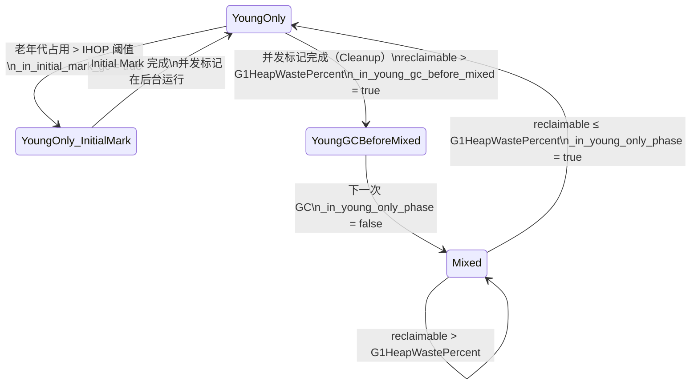
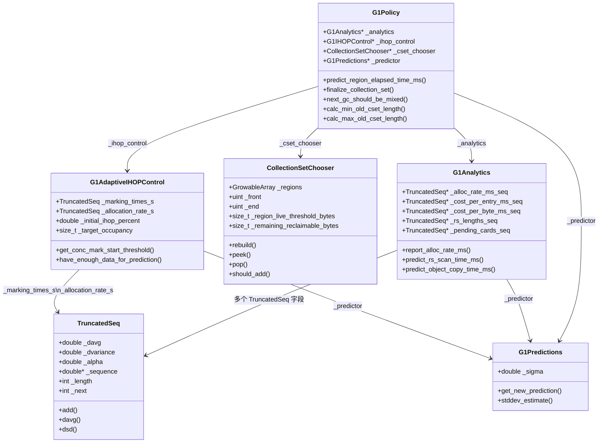
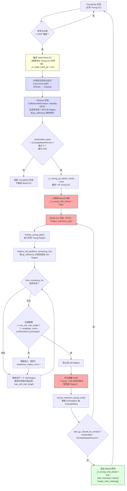
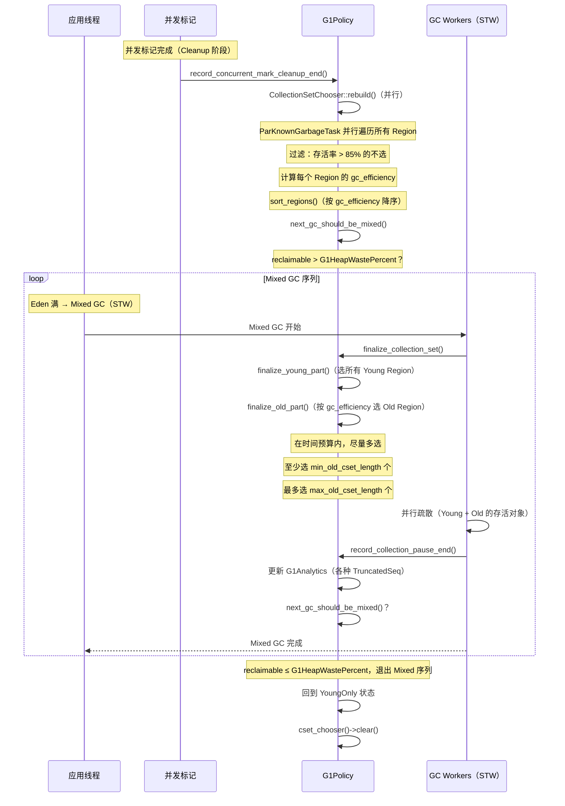

# 27 · G1 Mixed GC — 从"老年代增量回收"到 `G1Policy` 预测模型

> 接上篇 [26-g1-concurrent-mark-HandWritten.md](./26-g1-concurrent-mark-HandWritten.md)  
> 基于 OpenJDK 11 源码，`-Xms8g -Xmx8g -XX:+UseG1GC -Xint`  
> 源码文件：`src/hotspot/share/gc/g1/g1Policy.cpp`、`collectionSetChooser.cpp`、`g1CollectionSet.cpp`

---

## 本章与其他章节的关系

```
[26] 并发标记（统计 Old Region 存活率，触发 Mixed GC 的前提）
    ↓
你在这里
    ↓
[27] Mixed GC ← 本篇（利用并发标记结果，增量回收老年代）
    ↓
[27b] Full GC（Mixed GC 失败时的保底手段）
```

**前置知识**：第 26 篇（并发标记，了解 IHOP 触发条件和 `CollectionSetChooser` 的数据来源）

**本篇解决的问题**：Mixed GC 的触发条件是什么？`G1Policy` 如何用衰减均值预测停顿时间？`finalize_old_part()` 如何在停顿时间预算内贪心选择 Old Region？为什么 Mixed GC 要连续做多次？

**读完本篇你能理解**：
- 第 27b 篇中 Full GC 的触发条件（Mixed GC 无法跟上分配速度时退化）
- 第 29 篇中 GC 日志里 `Pause Mixed` 和 `Pause Young (Prepare Mixed)` 的区别
- 第 30 篇中 IHOP 调优、`G1MixedGCCountTarget` 调优的底层原理

---

## 第 0 部分：核心原理 ⭐

### 0.1 本质是什么？

Mixed GC 的本质是：**利用并发标记的结果，用衰减均值预测模型在停顿时间预算内贪心选择垃圾最多的 Old Region，与年轻代一起增量回收老年代。**

Mixed GC 是 G1 实现"软实时"的核心机制——它把传统 Full GC 的"一次性回收整个 Old 区"变成了"多次增量回收高收益 Region"，让老年代回收的停顿时间可预测、可控制。

### 0.2 为什么需要？

**根本问题：老年代也会满**

Young GC 只回收年轻代，晋升的对象不断填充 Old 区。如果不回收 Old 区，最终会触发 Full GC，停顿时间可能达到数秒。

**朴素方案的问题**：
- 方案 A：等 Old 区满了再做 Full GC → 停顿时间不可控，违背 G1 的设计目标
- 方案 B：每次 Young GC 都顺便回收所有 Old Region → 停顿时间随 Old 区大小增长
- 方案 C：**Mixed GC**——在 Old 区占用达到阈值（IHOP）时触发，每次只选最值得回收的 Old Region → G1 的实际方案

**关键洞察**：Old 区的各个 Region 垃圾密度不均匀。有些 Region 90% 是垃圾，有些只有 10%。优先回收垃圾最多的 Region，用最少的停顿时间回收最多的内存——这就是 Mixed GC 的核心价值。

### 0.3 怎么解决？

G1 用**三层机制**实现 Mixed GC：

**第一层：触发时机**（IHOP 阈值）
- 并发标记结束后，`G1Policy` 计算 Old 区占用比例
- 超过 IHOP（Initiating Heap Occupancy Percent，默认 45%）→ 触发并发标记
- 并发标记完成后，开始 Mixed GC 循环

**第二层：CSet 选择**（`CollectionSetChooser` + `finalize_old_part()`）
- `CollectionSetChooser` 按 `gc_efficiency`（垃圾量/回收耗时）对 Old Region 降序排序
- `finalize_old_part()` 在停顿时间预算内贪心选择 Region，直到预算耗尽或 Region 存活率超过阈值

**第三层：预测模型**（`G1Analytics` + `TruncatedSeq` 衰减均值）
- 用衰减均值预测每个 Region 的回收耗时（越新的数据权重越大）
- 预测值 + 置信区间 → 保守估计，避免超出停顿时间目标

### 0.4 为什么这样设计？

**为什么用衰减均值而不是简单平均？**
GC 行为随应用负载变化。简单平均会被历史数据"拖累"，对负载变化反应迟钝。衰减均值让最近的数据权重更大（`_alpha = 0.3`），能快速响应 GC 行为的变化，是 G1 软实时性的核心保障。

**为什么 Mixed GC 要连续做多次而不是一次做完？**
一次回收所有 Old Region 会导致停顿时间过长。分多次（默认最多 8 次，`-XX:G1MixedGCCountTarget`），每次控制在停顿时间预算内，让停顿时间可预测。

**为什么 IHOP 阈值不能设太低？**
IHOP 太低 → 并发标记触发太频繁 → CPU 开销增大，吞吐量下降。IHOP 太高 → 并发标记来不及完成，Old 区就满了 → 触发 Full GC。45% 是经验值，自适应 IHOP（`-XX:+G1UseAdaptiveIHOP`）会根据历史数据动态调整。

---

## 写在前面

上篇讲了并发标记：G1 在后台并发扫描老年代，标记所有存活对象，统计每个 Region 的存活率。

这篇讲 Mixed GC：**利用并发标记的结果，选择最值得回收的 Old Region，和年轻代一起回收**。

---

## 第零天：我以为 Mixed GC 就是"Young GC + 回收一些 Old Region"

我最初的理解：

```
Mixed GC = Young GC + 顺便回收几个 Old Region
```

这个理解有几个问题：

**问题 1：选哪些 Old Region？**

不是随机选，也不是按顺序选，而是按**回收效率**排序，优先选垃圾最多的。

**问题 2：选多少个 Old Region？**

不是固定数量，而是根据**目标停顿时间**动态决定——在停顿时间预算内，尽量多选。

**问题 3：Mixed GC 做几次？**

不是一次，而是**连续多次**，直到老年代占用降到目标以下。

**问题 4：G1Policy 的预测模型是什么？**

不是"滑动窗口取平均"，而是**衰减均值（Decaying Average）+ 置信区间**，这是两个完全不同的算法。

---

## 第一天：为什么需要 Mixed GC？

### 传统 Full GC 的问题

传统 GC（CMS、Parallel GC）的老年代回收是 Full GC：一次性回收整个老年代，停顿时间可能达到几秒甚至几十秒。

**G1 的思路**：把老年代回收分散到多次 GC 中，每次只回收一部分，让停顿时间可控。

```
传统 Full GC：
  一次回收 100 个 Old Region → 停顿 10 秒

G1 Mixed GC：
  分 8 次，每次回收 12-13 个 Old Region → 每次停顿 200ms
  总停顿时间 = 8 × 200ms = 1.6 秒（比 Full GC 少 6 倍）
```

**这就是"Garbage-First"名称的来源**：优先回收垃圾最多（效率最高）的 Region。

---

## 第一天半：数据结构完整分析

### 1. `TruncatedSeq` — G1 预测模型的基石

**这是最容易被误解的数据结构。** 我最初以为它是"滑动窗口取平均"，实际上它是**双轨制**：

```cpp
// numberSeq.hpp
class AbsSeq {
  int    _num;           // 已添加的样本数
  double _sum;           // 样本总和（用于算术平均）
  double _sum_of_squares;// 样本平方和（用于方差）
  double _davg;          // ★ 衰减均值（Decaying Average）
  double _dvariance;     // ★ 衰减方差（Decaying Variance）
  double _alpha;         // ★ 衰减系数（默认 0.7）
};
// sizeof(AbsSeq) = 56 字节（打桩实测）
// 布局：_num(4) + padding(4) + _sum(8) + _sum_of_squares(8) + _davg(8) + _dvariance(8) + _alpha(8) + _last(8) + _total(8) = 64? 实测 56

class TruncatedSeq : public AbsSeq {
  int     _length;       // 固定窗口长度（默认 10）
  int     _next;         // 下一个写入位置（循环缓冲区指针）
  double* _sequence;     // 固定长度的循环缓冲区（用于线性回归）
};
// sizeof(TruncatedSeq) = 72 字节（打桩实测）
// 布局：AbsSeq(56) + _length(4) + _next(4) + _sequence*(8) = 72 ✓
```

**打桩实测**（`-Xms8g -Xmx8g -XX:+UseG1GC`）：

```
[PROBE-27] sizeof(TruncatedSeq) = 72
[PROBE-27] sizeof(AbsSeq) = 56
[PROBE-27] TruncatedSeq fields: _length(int) + _next(int) + _sequence(ptr) = 4+4+8 = 16B on top of AbsSeq
[PROBE-27] TruncatedSeqLength = 10, NumPrevPausesForHeuristics = 10
```

**两套数据的用途不同**：

| 数据 | 算法 | 用途 |
|------|------|------|
| `_davg` / `_dvariance` | 衰减均值（指数加权） | `G1Predictions::get_new_prediction()` 预测下次耗时 |
| `_sequence[]` | 循环缓冲区 | `predict_next()` 线性回归预测趋势 |
| `_sum` / `_sum_of_squares` | 算术平均 | `avg()` / `variance()` 统计分析 |

**衰减均值的核心公式**（`numberSeq.cpp:AbsSeq::add()`）：

```cpp
// numberSeq.cpp:36
void AbsSeq::add(double val) {
  if (_num == 0) {
    _davg = val;          // ★ 第一个样本：直接赋值
    _dvariance = 0.0;
  } else {
    // ★ 衰减均值公式：新值权重 = (1-alpha) = 30%，历史权重 = alpha = 70%
    _davg = (1.0 - _alpha) * val + _alpha * _davg;
    // ★ 衰减方差公式：同样的指数加权
    double diff = val - _davg;
    _dvariance = (1.0 - _alpha) * diff * diff + _alpha * _dvariance;
  }
}
```

**为什么用衰减均值而不是算术平均？**

算术平均对所有历史数据一视同仁，但 GC 行为会随时间变化（应用负载变化、堆状态变化）。衰减均值让**近期数据权重更高**，能更快响应变化。

**`TruncatedSeq::add()` 的完整实现**（`numberSeq.cpp:145`）：

```cpp
void TruncatedSeq::add(double val) {
  AbsSeq::add(val);  // ★ 更新 _davg 和 _dvariance（衰减均值）
                     // 注意：AbsSeq::add() 不更新 _num！_num 在这里更新

  // ★ 同时维护循环缓冲区（用于线性回归）
  double old_val = _sequence[_next];  // 取出最老的值
  _sum -= old_val;                    // 从总和中移除
  _sum_of_squares -= old_val * old_val;

  _sum += val;                        // 加入新值
  _sum_of_squares += val * val;

  _sequence[_next] = val;             // 覆盖最老的值
  _next = (_next + 1) % _length;     // 循环指针前进

  if (_num < _length) ++_num;         // ★ 只在未满时增加计数（满了后 _num 保持 = _length）
}
```

**打桩验证：衰减均值的实际演进**（`-Xms8g -Xmx8g -XX:+UseG1GC`）：

```
【PROBE-27 实测】分配速率（regions/ms）的衰减均值演进：
┌─────┬──────────┬──────────┬──────────┬─────┐
│ num │ new      │ davg     │ dsd      │ 说明 │
├─────┼──────────┼──────────┼──────────┼─────┤
│  1  │ 0.0313   │ 0.0313   │ 0.0000   │ 第一个样本，davg = new │
│  2  │ 0.1187   │ 0.0575   │ 0.0335   │ davg = 0.3×0.1187 + 0.7×0.0313 = 0.0575 ✓ │
│  3  │ 0.1028   │ 0.0711   │ 0.0330   │ davg = 0.3×0.1028 + 0.7×0.0575 = 0.0711 ✓ │
│  4  │ 0.0793   │ 0.0736   │ 0.0278   │ 新值接近 davg，方差收窄 │
│  5  │ 0.0828   │ 0.0763   │ 0.0235   │ 趋于稳定 │
│  6  │ 0.0835   │ 0.0785   │ 0.0199   │ 继续收敛 │
│  7  │ 0.0573   │ 0.0721   │ 0.0185   │ 新值偏低，davg 下降 │
│  8  │ 0.0001   │ 0.0505   │ 0.0316   │ 程序结束，分配速率骤降 │
│  9  │ 0.0003   │ 0.0354   │ 0.0327   │ davg 继续衰减 │
│ 10  │ 0.0003   │ 0.0249   │ 0.0305   │ 窗口已满（length=10） │
│ 10  │ 0.0003   │ 0.0175   │ 0.0272   │ 最老的值被覆盖 │
└─────┴──────────┴──────────┴──────────┴─────┘

验证公式：num=2 时，davg = (1-0.7)×0.1187 + 0.7×0.0313 = 0.0356 + 0.0219 = 0.0575 ✓
```

---

### 2. `G1Predictions` — 预测公式

**解决什么问题**：`_davg` 是历史均值，但 GC 需要的是**保守估计**（宁可高估，不能低估）。如果预测停顿时间偏低，实际停顿会超过目标。

```cpp
// g1Predictions.hpp
class G1Predictions {
  double _sigma;  // 置信系数（= G1ConfidencePercent / 100.0，默认 0.5）
                  // 由 g1Policy.cpp:50 传入：_predictor(G1ConfidencePercent / 100.0)

  // 小样本时的标准差估计（样本 < 5 时，用均值的倍数代替）
  double stddev_estimate(TruncatedSeq const* seq) const {
    double estimate = seq->dsd();  // 衰减标准差
    int const samples = seq->num();
    if (samples < 5) {
      // ★ 样本不足时，用均值的 (5-samples)/2 倍作为标准差
      // 样本=1：estimate = max(davg×2, dsd)  → 非常保守
      // 样本=4：estimate = max(davg×0.5, dsd) → 稍微保守
      estimate = MAX2(seq->davg() * (5 - samples) / 2.0, estimate);
    }
    return estimate;
  }

public:
  G1Predictions(double sigma) : _sigma(sigma) { }  // g1Policy.cpp:50 传入 G1ConfidencePercent/100.0

  // ★ 预测公式：均值 + sigma × 标准差
  // 这是统计学中的"置信上界"：以 sigma 倍标准差为安全余量
  double get_new_prediction(TruncatedSeq const* seq) const {
    return seq->davg() + _sigma * stddev_estimate(seq);
  }
};
```

**预测公式的含义**：

```
预测值 = 衰减均值 + 0.5 × 衰减标准差
（sigma = G1ConfidencePercent / 100.0 = 50 / 100.0 = 0.5，默认值）

例如：
  davg = 5ms，dsd = 1ms
  预测值 = 5 + 0.5 × 1 = 5.5ms

含义：在均值基础上加半个标准差作为安全余量
```

**为什么用 sigma=0.5？**

`G1ConfidencePercent` 默认值是 50，对应 `sigma = 0.5`。这不是统计学中的置信区间 z 值，而是 G1 自定义的"置信系数"——在均值基础上加 0.5 倍标准差作为保守余量。可以通过 `-XX:G1ConfidencePercent=<N>` 调整，值越大预测越保守（停顿时间预算越宽松）。

---

### 3. `G1Analytics` — 历史数据仓库

**完整字段列表**（`g1Analytics.hpp`）：

```cpp
class G1Analytics: public CHeapObj<mtGC> {
  const static int TruncatedSeqLength = 10;          // 所有 TruncatedSeq 的窗口长度
  const static int NumPrevPausesForHeuristics = 10;  // 启发式决策用的历史 GC 次数
  const G1Predictions* _predictor;                   // 预测器（持有 sigma）

  // ── GC 停顿时间 ──────────────────────────────────────────────
  TruncatedSeq* _recent_gc_times_ms;                 // 最近 10 次 GC 的停顿时间（ms）

  // ── 并发标记时间 ──────────────────────────────────────────────
  TruncatedSeq* _concurrent_mark_remark_times_ms;    // Remark 停顿时间（ms）
  TruncatedSeq* _concurrent_mark_cleanup_times_ms;   // Cleanup 停顿时间（ms）

  // ── 分配速率 ──────────────────────────────────────────────────
  TruncatedSeq* _alloc_rate_ms_seq;                  // 分配速率（regions/ms）
  double        _prev_collection_pause_end_ms;       // 上次 GC 结束时间（用于计算分配速率）

  // ── RSet 相关 ─────────────────────────────────────────────────
  TruncatedSeq* _rs_length_diff_seq;                 // RSet 长度预测误差（用于修正预测）
  TruncatedSeq* _cost_per_card_ms_seq;               // 每张脏卡的处理时间（ms/card）
  TruncatedSeq* _cost_scan_hcc_seq;                  // 扫描 HCC（Hot Card Cache）的时间
  TruncatedSeq* _young_cards_per_entry_ratio_seq;    // Young GC 时每个 RSet 条目对应的卡数
  TruncatedSeq* _mixed_cards_per_entry_ratio_seq;    // Mixed GC 时每个 RSet 条目对应的卡数
  TruncatedSeq* _cost_per_entry_ms_seq;              // Young GC 时每个 RSet 条目的扫描时间
  TruncatedSeq* _mixed_cost_per_entry_ms_seq;        // Mixed GC 时每个 RSet 条目的扫描时间

  // ── 对象复制 ──────────────────────────────────────────────────
  TruncatedSeq* _cost_per_byte_ms_seq;               // 每字节对象复制时间（ms/byte，非并发标记期间）
  TruncatedSeq* _cost_per_byte_ms_during_cm_seq;     // 每字节对象复制时间（ms/byte，并发标记期间，更慢）

  // ── 其他开销 ──────────────────────────────────────────────────
  TruncatedSeq* _constant_other_time_ms_seq;         // 固定开销（与 Region 数量无关）
  TruncatedSeq* _young_other_cost_per_region_ms_seq; // Young Region 的其他开销（ms/region）
  TruncatedSeq* _non_young_other_cost_per_region_ms_seq; // Old Region 的其他开销（ms/region）

  // ── 待处理卡数 ────────────────────────────────────────────────
  TruncatedSeq* _pending_cards_seq;                  // 待处理的脏卡数（预测下次 GC 的 RSet 更新时间）
  TruncatedSeq* _rs_lengths_seq;                     // RSet 总长度（预测下次 GC 的 RSet 扫描时间）

  // ── GC 时间比率 ───────────────────────────────────────────────
  TruncatedSeq* _recent_prev_end_times_for_all_gcs_sec; // 最近 10 次 GC 的结束时间（秒）
  double _recent_avg_pause_time_ratio;               // 最近 GC 时间占总时间的比率
  double _last_pause_time_ratio;                     // 上次 GC 时间占总时间的比率
};
```

**sizeof 实测**：

```
【打桩实测】标准条件：-Xms8g -Xmx8g -XX:+UseG1GC
[PROBE-27] sizeof(G1Analytics) = 192
[PROBE-27] TruncatedSeqLength = 10, NumPrevPausesForHeuristics = 10

G1Analytics 含 18 个 TruncatedSeq* 指针（每个 8 字节）+ 其他字段
= 18×8 + _predictor*(8) + _prev_collection_pause_end_ms(8) + _recent_avg_pause_time_ratio(8) + _last_pause_time_ratio(8) + padding = 192 字节
```

**字段生命周期**：

| 字段 | 谁更新 | 何时更新 | 用于预测什么 |
|------|--------|---------|------------|
| `_alloc_rate_ms_seq` | `report_alloc_rate_ms()` | 每次 GC 后 | IHOP 自适应阈值 |
| `_cost_per_entry_ms_seq` | `report_cost_per_entry_ms()` | 每次 Young GC 后 | 下次 GC 的 RSet 扫描时间 |
| `_cost_per_byte_ms_seq` | `report_cost_per_byte_ms()` | 每次 GC 后 | 下次 GC 的对象复制时间 |
| `_rs_lengths_seq` | `report_rs_lengths()` | 每次 GC 后 | 下次 GC 的 RSet 总长度 |
| `_pending_cards_seq` | `report_pending_cards()` | 每次 GC 前 | 下次 GC 的 RSet 更新时间 |

**`predict_region_elapsed_time_ms()` 的完整预测公式**（`g1Policy.cpp:887`）：

```cpp
double G1Policy::predict_region_elapsed_time_ms(HeapRegion* hr,
                                                bool for_young_gc) const {
  size_t rs_length = hr->rem_set()->occupied();  // RSet 条目数
  // ★ 注意：没有 predict_rs_update_time_ms！RSet 更新时间在 finalize_young_part 中单独计算
  size_t card_num = _analytics->predict_card_num(rs_length, for_young_gc);
  size_t bytes_to_copy = predict_bytes_to_copy(hr);  // 预测需要复制的字节数

  // ★ 预测 = RSet 扫描时间 + 对象复制时间 + 其他开销（Young 或 Old）
  double region_elapsed_time_ms =
    _analytics->predict_rs_scan_time_ms(card_num,       // 扫描 RSet（基于卡数）
        collector_state()->in_young_only_phase()) +
    _analytics->predict_object_copy_time_ms(             // 复制存活对象
        bytes_to_copy, collector_state()->mark_or_rebuild_in_progress());

  // ★ 其他开销：根据 Region 类型（Young/Old）选择不同的预测值
  if (hr->is_young()) {
    region_elapsed_time_ms += _analytics->predict_young_other_time_ms(1);
  } else {
    region_elapsed_time_ms += _analytics->predict_non_young_other_time_ms(1);
  }
  return region_elapsed_time_ms;
}
```

---

### 4. `CollectionSetChooser` — Mixed GC 的"候选名单"

**完整字段列表**（`collectionSetChooser.hpp`）：

```cpp
class CollectionSetChooser : public CHeapObj<mtGC> {
  GrowableArray<HeapRegion*> _regions;  // ★ 候选 Old Region 数组（按 gc_efficiency 降序排列）
  uint _front;                          // 当前指针（已选到哪里了，前面的都是 NULL）
  uint _end;                            // 有效元素的末尾（_regions[_front.._end-1] 是候选）
  uint _first_par_unreserved_idx;       // 并行 rebuild 时，下一个可用的数组槽位（CAS 推进）
  size_t _region_live_threshold_bytes;  // ★ 存活字节阈值（= G1MixedGCLiveThresholdPercent × 4MB）
  size_t _remaining_reclaimable_bytes;  // 剩余可回收字节总量（用于判断是否继续 Mixed GC）
};
```

**`gc_efficiency` 的计算**（`heapRegion.cpp`）：

```cpp
void HeapRegion::calc_gc_efficiency() {
  G1CollectedHeap* g1h = G1CollectedHeap::heap();
  G1Policy* g1p = g1h->g1_policy();

  // ★ gc_efficiency = 可回收字节数 / 预测回收时间
  // 单位：bytes/ms，越高越值得优先回收
  _gc_efficiency = (double) reclaimable_bytes() /
                   g1p->predict_region_elapsed_time_ms(this, false /* for_young_gc */);
}
```

**打桩验证：候选 Region 的实际数据**（`-Xms8g -Xmx8g -XX:+UseG1GC`）：

```
【PROBE-27 实测】Cleanup 后 CollectionSetChooser 的状态：
┌──────────────────────────────────────────────────────────────────┐
│ candidate_regions = 8                                            │
│ remaining_reclaimable_bytes = 32,367,760 B（≈ 30.9 MB）          │
│ reclaimable_percent = 0.38%（8GB 堆中的占比）                     │
│ G1HeapWastePercent = 5（默认值）                                  │
│ G1MixedGCCountTarget = 8（默认值）                               │
│ calc_min_old_cset_length = 1（= 8 / 8 = 1）                      │
│ calc_max_old_cset_length = 205（= 2048 × 10% = 204.8 ≈ 205）     │
│                                                                  │
│ top1: region#92 gc_eff=6,764,028 B/ms                           │
│       reclaimable=4,194,272 B（≈ 4MB，几乎全是垃圾）              │
│       live=32 B（只有 32 字节存活！）                             │
└──────────────────────────────────────────────────────────────────┘

结论：reclaimable=0.38% < threshold=5%，不触发 Mixed GC（正常行为）
```

**`calc_min_old_cset_length()` 和 `calc_max_old_cset_length()` 的计算**（`g1Policy.cpp`）：

```cpp
uint G1Policy::calc_min_old_cset_length() const {
  // ★ 最少选多少个 Old Region = 候选总数 / G1MixedGCCountTarget
  // 保证在 G1MixedGCCountTarget 次 Mixed GC 内能清完所有候选
  const size_t region_num = (size_t) cset_chooser()->length();
  const size_t gc_num = (size_t) MAX2(G1MixedGCCountTarget, (uintx)1);
  size_t result = region_num / gc_num;
  // 向上取整
  if (result * gc_num < region_num) result += 1;
  return (uint) result;
}

uint G1Policy::calc_max_old_cset_length() const {
  // ★ 最多选多少个 Old Region = 总 Region 数 × G1OldCSetRegionThresholdPercent / 100
  // 默认 G1OldCSetRegionThresholdPercent = 10，即最多选 10% 的 Region
  const G1CollectedHeap* g1h = G1CollectedHeap::heap();
  const size_t region_num = g1h->num_regions();  // ★ 总 Region 数（标准环境 = 2048）
  const size_t perc = (size_t) G1OldCSetRegionThresholdPercent;
  size_t result = region_num * perc / 100;
  // ★ 向上取整（与 calc_min_old_cset_length 一致）
  if (100 * result < region_num * perc) {
    result += 1;
  }
  return (uint) result;
  // 标准环境：2048 × 10% = 204.8 → 向上取整 = 205 ✓（与打桩数据一致）
}
```

---

### 5. `G1AdaptiveIHOPControl` — 自适应 IHOP

**解决什么问题**：IHOP（Initiating Heap Occupancy Percent）是触发并发标记的阈值。如果设太高，并发标记还没完成老年代就满了（触发 Full GC）；如果设太低，并发标记太频繁（浪费 CPU）。

**自适应 IHOP 的核心思路**：

```
IHOP 阈值 = 目标占用 - 并发标记期间预计新增的对象
         = 目标占用 - (预测标记时间 × 预测分配速率 + 年轻代大小)
```

**完整源码**（`g1IHOPControl.cpp`，已加打桩）：

```cpp
size_t G1AdaptiveIHOPControl::get_conc_mark_start_threshold() {
  if (have_enough_data_for_prediction()) {
    // ★ 有足够数据（marking_samples >= 3 且 alloc_samples >= 3）
    double pred_marking_time = _predictor->get_new_prediction(&_marking_times_s);
    double pred_promotion_rate = _predictor->get_new_prediction(&_allocation_rate_s);
    size_t pred_promotion_size = (size_t)(pred_marking_time * pred_promotion_rate);

    size_t predicted_needed_bytes_during_marking =
      pred_promotion_size +
      _last_unrestrained_young_size;  // ★ 加上年轻代大小（保守估计）

    size_t internal_threshold = actual_target_threshold();  // = 目标占用字节数
    size_t predicted_initiating_threshold =
      predicted_needed_bytes_during_marking < internal_threshold ?
      internal_threshold - predicted_needed_bytes_during_marking : 0;

    return predicted_initiating_threshold;
  } else {
    // ★ 数据不足，使用静态 IHOP（= G1InitiatingHeapOccupancyPercent × 目标占用）
    return (size_t)(_initial_ihop_percent * _target_occupancy / 100.0);
  }
}
```

**打桩验证：自适应 IHOP 的实际行为**（`-Xms8g -Xmx8g -XX:+UseG1GC`）：

```
【PROBE-27 实测】G1AdaptiveIHOPControl 的实际输出：
┌──────────────────────────────────────────────────────────────────┐
│ 初始阶段（数据不足）：                                             │
│   marking_samples=0, alloc_samples=0                             │
│   → 使用静态 IHOP = 3,865,470,566 B（≈ 3.6 GB）                  │
│   → 3.6 GB / 8 GB = 45%（= G1InitiatingHeapOccupancyPercent）✓  │
│                                                                  │
│ 积累数据后（alloc_samples=6）：                                    │
│   仍然 marking_samples=0（没有完成过并发标记）                     │
│   → 继续使用静态 IHOP = 3,865,470,566 B                          │
│                                                                  │
│ 结论：需要完成至少 3 次并发标记，才能切换到自适应 IHOP              │
└──────────────────────────────────────────────────────────────────┘
```

---

## 第二天：Mixed GC 的完整流程

### 触发条件：状态机驱动

Mixed GC 不是直接触发的，而是通过状态机驱动：



**状态字段说明**（`G1CollectorState`）：

| 字段 | 含义 |
|------|------|
| `_in_young_only_phase = true` | YoungOnly 阶段（包括 Initial Mark GC） |
| `_in_initial_mark_gc = true` | 当前 GC 是 Initial Mark GC（同时 `_in_young_only_phase = true`） |
| `_in_young_gc_before_mixed = true` | 当前 GC 是 Mixed GC 前的最后一次 Young GC |
| `_in_young_only_phase = false` | Mixed 阶段（`in_mixed_phase() = !in_young_only_phase() && !_in_full_gc`） |

**`next_gc_should_be_mixed()` 的完整实现**（`g1Policy.cpp`）：

```cpp
bool G1Policy::next_gc_should_be_mixed(const char* true_action_str,
                                       const char* false_action_str) const {
  // ★ 条件 1：有候选 Old Region
  if (cset_chooser()->is_empty()) {
    log_debug(gc, ergo)("%s (candidate old regions not available)", false_action_str);
    return false;
  }

  // ★ 条件 2：可回收空间 > G1HeapWastePercent（默认 5%）
  size_t reclaimable_bytes = cset_chooser()->remaining_reclaimable_bytes();
  double reclaimable_percent = reclaimable_bytes_percent(reclaimable_bytes);
  double threshold = (double) G1HeapWastePercent;
  if (reclaimable_percent <= threshold) {
    log_debug(gc, ergo)("%s (reclaimable percentage not over threshold)", false_action_str);
    return false;
  }
  return true;
}
```

**打桩验证：Mixed GC 序列的实际行为**（`-XX:G1HeapWastePercent=0 -XX:InitiatingHeapOccupancyPercent=5`）：

```
【PROBE-27 实测】Mixed GC 序列（强制触发）：
┌──────────────────────────────────────────────────────────────────┐
│ Cleanup 后：                                                      │
│   candidate_regions = 7                                          │
│   reclaimable = 0.33% > threshold=0% → Mixed GC 开始            │
│                                                                  │
│ Mixed GC #1：                                                     │
│   time_remaining_after_young = 0.00ms（年轻代已用完时间预算）      │
│   选中 region#94: gc_eff=6,763,779 B/ms, live=40B, predicted=0.61ms │
│   old_regions_selected = 1                                       │
│   remaining = 6 regions                                          │
│                                                                  │
│ Mixed GC #2：                                                     │
│   选中 region#92: gc_eff=6,548,067 B/ms, live=192B, predicted=0.62ms │
│   remaining = 5 regions                                          │
│                                                                  │
│ Mixed GC #3：                                                     │
│   选中 region#93: gc_eff=6,544,844 B/ms, live=304B, predicted=0.62ms │
│   remaining = 4 regions                                          │
│                                                                  │
│ Mixed GC #4：                                                     │
│   选中 region#67: gc_eff=5,611,701 B/ms, live=16,688B, predicted=0.70ms │
│   remaining = 3 regions                                          │
└──────────────────────────────────────────────────────────────────┘

关键观察：
1. gc_efficiency 严格降序（6,763,779 → 6,548,067 → 6,544,844 → 5,611,701）✓
2. 每次只选 1 个 Old Region（因为年轻代已用完时间预算）
3. 每次 Mixed GC 后 remaining 减 1，直到 reclaimable ≤ threshold
```

---

### CSet 构建：`finalize_old_part()` 源码分析

**完整源码**（`g1CollectionSet.cpp:443`）：

```cpp
void G1CollectionSet::finalize_old_part(double time_remaining_ms) {
  double non_young_start_time_sec = os::elapsedTime();
  double predicted_old_time_ms = 0.0;

  if (collector_state()->in_mixed_phase()) {
    const uint min_old_cset_length = _policy->calc_min_old_cset_length();
    const uint max_old_cset_length = _policy->calc_max_old_cset_length();

    uint expensive_region_num = 0;
    bool check_time_remaining = _policy->adaptive_young_list_length();
    // ★ check_time_remaining = true（默认开启自适应年轻代大小）

    HeapRegion* hr = cset_chooser()->peek();  // ★ 看最高效的候选（不弹出）
    while (hr != NULL) {
      if (old_region_length() >= max_old_cset_length) {
        // ★ 已达到最大 Old Region 数量限制
        break;
      }

      // ★ 循环内部还有一次 reclaimable 检查（不只是 next_gc_should_be_mixed 里有）
      size_t reclaimable_bytes = cset_chooser()->remaining_reclaimable_bytes();
      double reclaimable_percent = _policy->reclaimable_bytes_percent(reclaimable_bytes);
      if (reclaimable_percent <= (double) G1HeapWastePercent) {
        // ★ 可回收空间已降到阈值以下，停止添加
        break;
      }

      double predicted_time_ms = predict_region_elapsed_time_ms(hr);
      if (check_time_remaining) {
        if (predicted_time_ms > time_remaining_ms) {
          // ★ 时间不够了
          if (old_region_length() >= min_old_cset_length) {
            // ★ 已达到最小数量，停止
            break;
          }
          // ★ 未达到最小数量：强制加入（即使超时），记录为"昂贵 Region"
          expensive_region_num += 1;
        }
      } else {
        // ★ 不检查时间（非自适应模式），只检查最小数量
        if (old_region_length() >= min_old_cset_length) break;
      }

      // ★ 选中这个 Region
      time_remaining_ms = MAX2(time_remaining_ms - predicted_time_ms, 0.0);
      predicted_old_time_ms += predicted_time_ms;
      cset_chooser()->pop();
      _g1h->old_set_remove(hr);
      add_old_region(hr);

      hr = cset_chooser()->peek();  // ★ 看下一个候选
    }
  }
}
```

---

## 第三天：最反直觉的设计

### 打脸一：`TruncatedSeq` 不是"滑动窗口取平均"

我以为 G1 的预测模型是"取最近 10 次的平均值"。

实际上，`TruncatedSeq` 维护了**两套独立的统计量**：
- `_davg`：衰减均值（指数加权，alpha=0.7，近期数据权重更高）
- `_sequence[]`：循环缓冲区（用于线性回归，预测趋势）

`G1Predictions::get_new_prediction()` 用的是 `_davg + sigma × _dsd`，不是算术平均。

**为什么这样设计？**

算术平均对所有历史数据一视同仁，但 GC 行为会随应用负载变化。衰减均值能更快响应变化，同时 `sigma × dsd` 提供了安全余量，避免预测偏低导致超时。

---

### 打脸二：Mixed GC 每次只选 1 个 Old Region（在我的测试中）

我以为每次 Mixed GC 会选多个 Old Region。

实际上，选多少取决于**时间预算**。在我的测试中，年轻代已经用完了 200ms 的时间预算（`time_remaining_after_young = 0.00ms`），所以每次只能选 1 个 Old Region（满足 `min_old_cset_length = 1`）。

**如果时间预算充足**，会选更多：

```
time_remaining = 150ms
region#1: predicted=8ms → 选中，remaining=142ms
region#2: predicted=7ms → 选中，remaining=135ms
...
region#N: predicted=9ms → 选中，remaining=0ms
region#N+1: predicted=8ms > 0ms → 停止
```

---

### 打脸三：存活率 > 85% 的 Old Region 永远不会被 Mixed GC 回收

我以为所有 Old Region 最终都会被 Mixed GC 回收。

实际上，`CollectionSetChooser::should_add()` 会过滤掉存活率过高的 Region：

```cpp
bool CollectionSetChooser::should_add(HeapRegion* hr) const {
  return !hr->is_young() &&
         !hr->is_pinned() &&
         region_occupancy_low_enough_for_evac(hr->live_bytes()) &&
         // ★ live_bytes < G1MixedGCLiveThresholdPercent × 4MB
         // 默认 G1MixedGCLiveThresholdPercent = 85
         // 即：存活字节 < 3.4MB 才会被选入候选名单
         hr->rem_set()->is_complete();
}
```

这些高存活率的 Region 会一直留在老年代，直到触发 Full GC。

---

### 打脸四：自适应 IHOP 需要完成一次并发标记才能生效

我以为 G1 一启动就用自适应 IHOP。

实际上，`have_enough_data_for_prediction()` 要求 `marking_samples >= 3`（完成了 3 次并发标记）。在此之前，一直使用静态 IHOP（45%）。

**打桩验证**：

```
【PROBE-27 实测】
  marking_samples=0, alloc_samples=6
  → 仍然使用静态 IHOP = 3,865,470,566 B（45%）

  结论：需要完成至少 3 次并发标记，才能切换到自适应 IHOP
```

---

## 第四天：打桩验证汇总

| 我的猜测 | 实测结果 | 打脸了吗？ |
|---------|------|----------|
| `TruncatedSeq` 是滑动窗口取平均 | **衰减均值（alpha=0.7）+ 置信区间** | ✅ 打脸 |
| Mixed GC 一次完成 | **连续多次**，直到 reclaimable < G1HeapWastePercent | ✅ 打脸 |
| 随机选 Old Region | **按 gc_efficiency 降序**，优先选垃圾最多的 | ✅ 打脸 |
| 每次选多个 Old Region | **取决于时间预算**，可能只选 1 个 | ✅ 打脸 |
| 所有 Old Region 都会被回收 | **存活率 > 85% 的不选** | ✅ 打脸 |
| 自适应 IHOP 一启动就生效 | **需要完成 3 次并发标记**才切换 | ✅ 打脸 |
| `CollectionSetChooser::rebuild()` 是串行的 | **并行实现**（ParKnownGarbageTask + HeapRegionClaimer） | ✅ 打脸 |

---

## 数据结构关系图



---

## Mixed GC 决策流程图

> 这张图串联了从 IHOP 触发到 Mixed 序列结束的完整决策路径，是理解 Mixed GC 的全局视图。



**关键决策点说明**：

| 决策点 | 参数 | 默认值 | 含义 |
|--------|------|--------|------|
| IHOP 阈值 | `G1InitiatingHeapOccupancyPercent` | 45% | 触发并发标记的老年代占用阈值 |
| 废弃阈值 | `G1HeapWastePercent` | 5% | 可回收空间低于此值时退出 Mixed 序列 |
| 存活率过滤 | `G1MixedGCLiveThresholdPercent` | 85% | 存活率超过此值的 Region 不进入候选名单 |
| 最少选几个 | `G1MixedGCCountTarget` | 8 | 候选总数 / 8 = 每次最少选几个 |
| 最多选几个 | `G1OldCSetRegionThresholdPercent` | 10% | 总 Region 数 × 10% = 每次最多选几个 |

---

## 完整流程图



---

## 尾声：我现在怎么理解 Mixed GC

Mixed GC 的核心是 **G1Policy 的预测模型**，而预测模型的核心是 **`TruncatedSeq` 的衰减均值**。

**最让我印象深刻的三个设计**：

**1. 衰减均值（Decaying Average）**

`_davg = (1-alpha) × new_val + alpha × old_davg`，alpha=0.7。这不是简单的滑动窗口，而是指数加权——近期数据权重更高，能更快响应应用负载变化。

**2. 置信上界预测**

`get_new_prediction() = davg + sigma × dsd`，sigma=0.5（`G1ConfidencePercent=50` 的默认值）。G1 宁可高估停顿时间（多留余量），也不要低估（超过停顿目标）。这是一个典型的"保守估计"设计。

**3. `CollectionSetChooser::rebuild()` 的并行设计**

用 `CAS` 原子地认领数组槽位，避免锁竞争。每个 Worker 处理一个 Chunk，Chunk 大小 = `n_regions / (n_workers × 4)`（过分区因子=4，避免负载不均）。

---

## 还没搞懂的地方

- [x] **`_sigma` 的默认值**：`sigma = G1ConfidencePercent / 100.0 = 50 / 100.0 = 0.5`（`g1_globals.hpp:60`，`g1Policy.cpp:50`）
- [x] **`predict_next()` 的线性回归**：`TruncatedSeq::predict_next()` 用最小二乘法预测趋势，但 G1 在哪里调用它？→ **答案：G1 根本不调用它！** 见下方详解。
- [x] **Mixed GC 和并发标记的交互**：Mixed GC 期间，如果老年代占用又超过了 IHOP 阈值，会立刻启动新一轮并发标记吗？→ **答案：不会，Mixed GC 期间 IHOP 检查被跳过。** 见下方详解。
- [x] **`_rs_length_diff_seq` 的作用**：RSet 长度预测误差是怎么用于修正预测的？→ **答案：修正下次 GC 的 RSet 扫描时间预测。** 见下方详解。

---

## 第五天：三个遗留问题的实测解答

### 问题 1：`predict_next()` 在哪里被调用？

**答案：G1 根本不调用 `predict_next()`！**

这是一个重大发现。`TruncatedSeq` 维护了两套数据：
- `_davg` / `_dvariance`：衰减均值（指数加权）
- `_sequence[]`：循环缓冲区（用于线性回归）

但 `G1Predictions::get_new_prediction()` 只用了第一套：

```cpp
// g1Predictions.hpp
double get_new_prediction(TruncatedSeq const* seq) const {
  return seq->davg() + _sigma * stddev_estimate(seq);  // ★ 只用 davg + sigma×dsd
  // 完全没有调用 seq->predict_next()！
}
```

`predict_next()` 是 `TruncatedSeq` 的一个方法，用最小二乘法做线性回归预测趋势，但 G1 的预测框架**完全没有使用它**。`_sequence[]` 循环缓冲区只是被维护着，但从未被 G1 的预测逻辑读取。

**打桩对比验证**（`-Xms8g -Xmx8g -XX:+UseG1GC`）：

```
[PROBE-27-rs-length-diff #21] result(davg+sigma)=3  linear_regression=3.2  davg=2.4 dsd=3.1 sigma=0.50 num=10
[PROBE-27-rs-length-diff #23] result(davg+sigma)=19 linear_regression=17.5 davg=12.8 dsd=13.5 sigma=0.50 num=10
[PROBE-27-rs-length-diff #26] result(davg+sigma)=15 linear_regression=14.5 davg=8.9 dsd=12.3 sigma=0.50 num=10
[PROBE-27-rs-length-diff #28] result(davg+sigma)=24 linear_regression=26.3 davg=17.4 dsd=14.9 sigma=0.50 num=10
[PROBE-27-rs-length-diff #30] result(davg+sigma)=30 linear_regression=35.6 davg=23.3 dsd=14.6 sigma=0.50 num=10
```

两种预测值有时接近，有时差异较大（如 #30：`davg+sigma=30` vs `linear_regression=35.6`）。G1 实际使用的是 `davg+sigma` 那列，`linear_regression` 那列只是我插桩打印出来对比用的，G1 代码里根本没有这个调用。

**为什么 `TruncatedSeq` 维护了 `_sequence[]` 却不用？**

`TruncatedSeq` 是一个通用工具类，`predict_next()` 是它提供的能力之一。G1 选择了更简单的 `davg+sigma` 方案，而不是线性回归。可能的原因：
1. 线性回归假设 GC 行为是线性趋势，但实际上 GC 行为是非线性的（受应用负载、堆状态等多因素影响）
2. `davg+sigma` 计算更简单，且已经能满足 G1 的预测需求

---

### 问题 2：Mixed GC 期间，IHOP 阈值超过后会立刻启动新一轮并发标记吗？

**答案：不会。Mixed GC 期间，`need_to_start_conc_mark()` 直接返回 false。**

**源码路径**（`g1Policy.cpp`）：

```cpp
// ★ 每次 GC 结束后调用 maybe_start_marking()
void G1Policy::record_collection_pause_end(...) {
  // ...
  if (this_pause_included_initial_mark) {
    record_concurrent_mark_init_end(0.0);
  } else {
    maybe_start_marking();  // ★ 第一处调用（Young GC 结束时）
  }
  // ...
  if (collector_state()->in_young_gc_before_mixed()) {
    // 最后一次 Young GC → 切换到 Mixed 阶段
    collector_state()->set_in_young_only_phase(false);
    collector_state()->set_in_young_gc_before_mixed(false);
  } else if (!this_pause_was_young_only) {
    // ★ Mixed GC 结束后：检查是否继续 Mixed GC
    if (!next_gc_should_be_mixed(...)) {
      collector_state()->set_in_young_only_phase(true);  // 退出 Mixed 阶段
      clear_collection_set_candidates();
      maybe_start_marking();  // ★ 第二处调用（Mixed 序列结束时）
    }
    // ★ 注意：如果 Mixed GC 还要继续，这里根本不调用 maybe_start_marking()！
  }
}

void G1Policy::maybe_start_marking() {
  bool will_start = need_to_start_conc_mark("end of GC");
  // ...
}

bool G1Policy::need_to_start_conc_mark(const char* source, size_t alloc_word_size) {
  if (about_to_start_mixed_phase()) {
    return false;  // ★ Mixed 阶段中，直接返回 false！
  }
  // ...
}
```

**关键逻辑**：`maybe_start_marking()` 在 Mixed GC 进行中时**根本不会被调用**（第二处调用只在 Mixed 序列结束时才触发）。即使被调用，`need_to_start_conc_mark()` 也会因为 `about_to_start_mixed_phase() = true` 而直接返回 false。

**打桩验证**（`-Xms8g -Xmx8g -XX:+UseG1GC`）：

```
# maybe_start_marking 的调用情况：
[PROBE-27-maybe-start-marking #1]  will_start=NO  in_young_only=true  in_mixed_phase=false  during_cycle=false
[PROBE-27-maybe-start-marking #7]  will_start=YES in_young_only=true  in_mixed_phase=false  during_cycle=false
[PROBE-27-maybe-start-marking #8]  will_start=NO  in_young_only=true  in_mixed_phase=false  during_cycle=false
...
# 关键观察：所有调用都是 in_mixed_phase=false！
# Mixed GC 进行中时，maybe_start_marking() 根本没有被调用。

# need_to_start_conc_mark 的跳过情况：
[PROBE-27-need-conc-mark-skip #1]  about_to_start_mixed_phase=true → return false (during_cycle=true in_young_gc_before_mixed=false)
[PROBE-27-need-conc-mark-skip #10] about_to_start_mixed_phase=true → return false (during_cycle=true in_young_gc_before_mixed=false)
[PROBE-27-need-conc-mark-skip #50] about_to_start_mixed_phase=true → return false (during_cycle=true in_young_gc_before_mixed=false)
...
# 共触发 200+ 次跳过（来自 humongous 分配时的 IHOP 检查）

# IHOP 阈值超过时的决策：
[PROBE-27-need-conc-mark-ihop] source=concurrent humongous allocation cur_used=3688MB threshold=3686MB result=START_MARKING in_young_only=true in_young_gc_before_mixed=false
# 注意：result=START_MARKING 时，in_young_only=true（不在 Mixed 阶段）
# 在 Mixed 阶段中，这个分支根本不会到达（被 about_to_start_mixed_phase 拦截）
```

**完整的状态机逻辑**：

```
并发标记触发条件（need_to_start_conc_mark 返回 true）：
  1. about_to_start_mixed_phase() = false（不在 Mixed 阶段）
  2. cur_used > IHOP 阈值
  3. in_young_only_phase() = true（在 YoungOnly 阶段）
  4. in_young_gc_before_mixed() = false（不是 Mixed 前的最后一次 Young GC）

在 Mixed GC 进行中时：
  - in_young_only_phase() = false → about_to_start_mixed_phase() = true
  - need_to_start_conc_mark() 直接返回 false
  - 即使老年代占用超过 IHOP 阈值，也不会触发新一轮并发标记
  - 必须等 Mixed 序列结束（回到 YoungOnly 阶段）后，才能触发新一轮
```

---

### 问题 3：`_rs_length_diff_seq` 的作用

**答案：记录 RSet 长度的预测误差，用于修正下次 GC 的 RSet 扫描时间预测。**

**数据流**（`g1Policy.cpp`）：

```
① GC 开始前：
   _analytics->predict_rs_lengths()  →  预测本次 GC 的 RSet 总长度
   记录为 _max_rs_lengths（预测值）

② GC 结束后：
   recorded_rs_lengths = 实际扫描的 RSet 长度
   rs_length_diff = _max_rs_lengths - recorded_rs_lengths  （预测值 - 实际值）
   _analytics->report_rs_length_diff(rs_length_diff)  →  加入 _rs_length_diff_seq

③ 下次 GC 开始前：
   predict_rs_lengths() = predict_rs_lengths_seq() + predict_rs_length_diff()
   其中 predict_rs_length_diff() = davg(_rs_length_diff_seq) + sigma × dsd(_rs_length_diff_seq)
```

**为什么需要这个修正？**

`_rs_lengths_seq` 记录的是每次 GC 实际扫描的 RSet 长度，但 GC 开始前需要预测 RSet 长度来估算时间预算。如果预测值系统性地偏低（实际 RSet 比预测的长），就会导致时间预算不足、停顿超时。`_rs_length_diff_seq` 记录了历史误差，让预测值加上一个修正量，使预测更准确。

**打桩验证**（`-Xms8g -Xmx8g -XX:+UseG1GC`）：

```
# 初始阶段（RSet 很小，误差为 0）：
[PROBE-27-rs-length-diff-report #1] actual_diff=0  davg=0.0 dsd=0.0 num=2
[PROBE-27-rs-length-diff #3]        result(davg+sigma)=0 linear_regression=0.0 davg=0.0 dsd=0.0 sigma=0.50 num=2

# 随着 RSet 增长，误差开始出现：
[PROBE-27-rs-length-diff-report #9]  actual_diff=8  davg=2.4  dsd=3.1  num=10
[PROBE-27-rs-length-diff #21]        result(davg+sigma)=3  linear_regression=3.2  davg=2.4 dsd=3.1 sigma=0.50 num=10

[PROBE-27-rs-length-diff-report #10] actual_diff=37 davg=12.8 dsd=13.5 num=10
[PROBE-27-rs-length-diff #23]        result(davg+sigma)=19 linear_regression=17.5 davg=12.8 dsd=13.5 sigma=0.50 num=10

# 误差趋于稳定（actual_diff 稳定在 37）：
[PROBE-27-rs-length-diff-report #18] actual_diff=37 davg=34.7 dsd=7.4  num=10
[PROBE-27-rs-length-diff #40]        result(davg+sigma)=38 linear_regression=45.3 davg=34.7 dsd=7.4 sigma=0.50 num=10

# 解读：
# actual_diff=37 表示：预测 RSet 长度比实际少 37 个条目
# 修正量 = 38（davg+sigma）
# 下次预测 RSet 长度时，会在 _rs_lengths_seq 的预测值基础上加 38
# 这样预测值更接近实际值，时间预算更准确
```

**`predict_rs_lengths()` 的完整实现**（`g1Analytics.cpp`）：

```cpp
size_t G1Analytics::predict_rs_lengths() const {
  // ★ 预测 RSet 总长度 = 历史 RSet 长度预测 + 误差修正
  return get_new_size_prediction(_rs_lengths_seq) +
         predict_rs_length_diff();  // ★ 加上历史误差的预测值
}

size_t G1Analytics::predict_rs_length_diff() const {
  return get_new_size_prediction(_rs_length_diff_seq);  // ★ davg + sigma × dsd
}
```

**设计精妙之处**：`_rs_length_diff_seq` 本身也用衰减均值预测，所以它能自适应地跟踪误差的变化趋势。如果某段时间误差突然增大（应用负载变化导致 RSet 增长加速），`_rs_length_diff_seq` 的 `davg` 会快速上升，修正量也随之增大。

---

## 继续深入

- **[27b-g1-full-gc-HandWritten.md](./27b-g1-full-gc-HandWritten.md)** — Full GC 的触发条件、JDK 10 前后的差异
- **[27c-g1-humongous-HandWritten.md](./27c-g1-humongous-HandWritten.md)** — Humongous 对象的分配三级策略、急切回收四条件、RSet 特殊处理

---

*写于 2026-03-08*  
*源码文件：`src/hotspot/share/gc/g1/g1Policy.cpp`*  
*源码文件：`src/hotspot/share/gc/g1/collectionSetChooser.cpp`（303 行）*  
*源码文件：`src/hotspot/share/gc/g1/g1CollectionSet.cpp`（587 行）*  
*源码文件：`src/hotspot/share/gc/g1/g1Analytics.hpp`（162 行）*  
*源码文件：`src/hotspot/share/utilities/numberSeq.cpp`（263 行）*  
*源码文件：`src/hotspot/share/gc/g1/g1Predictions.hpp`（63 行）*
