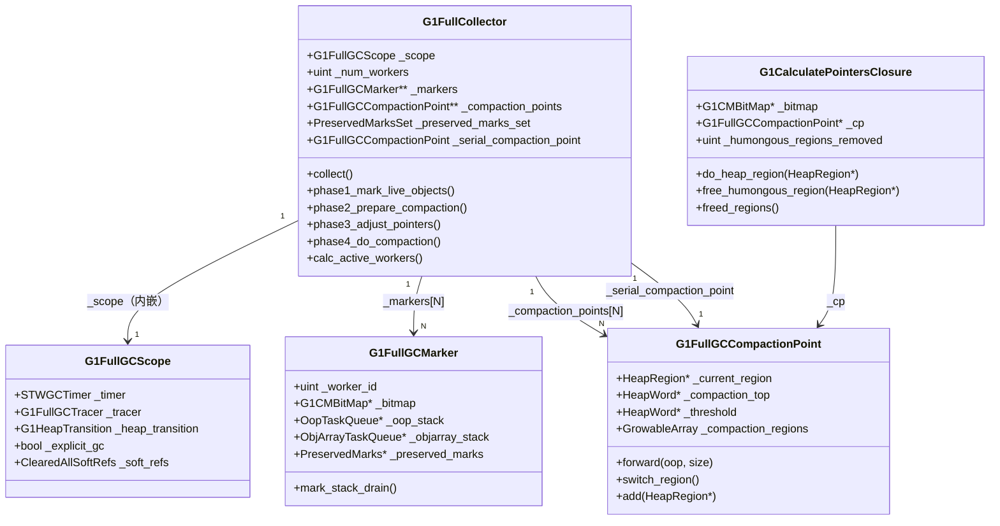

# 27b · G1 Full GC — 从"最后的保底手段"到"四个阶段"

> 接上篇 [27-g1-mixed-gc-HandWritten.md](./27-g1-mixed-gc-HandWritten.md)  
> 基于 OpenJDK 11 源码，`-Xms8g -Xmx8g -XX:+UseG1GC -Xint`

---

## 本章与其他章节的关系

```
[27] Mixed GC（增量回收老年代，失败时退化为 Full GC）
    ↓
你在这里
    ↓
[27b] Full GC ← 本篇（G1 的最后保底手段：全堆压缩式 GC）
    ↓
[29] GC 日志（Full GC 日志的解读）
    ↓
[30] 调优实战（如何避免 Full GC）
```

**前置知识**：第 27 篇（Mixed GC，了解 G1 增量回收的机制和失败场景）

**本篇解决的问题**：Full GC 的 5 种触发场景是什么？`G1FullCollector` 的四个阶段是怎么实现的？Two-Finger 压缩算法是什么？JDK 10 前后 Full GC 性能差异的根本原因是什么？

**读完本篇你能理解**：
- 第 29 篇中 GC 日志里 `Pause Full` 的各阶段含义
- 第 30 篇中"避免 Full GC"调优建议的底层原理（疏散失败/并发标记失败/Humongous 分配失败）
- 第 27c 篇中 Humongous 对象导致 Full GC 的完整路径

---

## 第 0 部分：核心原理 ⭐

### 0.1 本质是什么？

G1 Full GC 的本质是：**当 G1 的增量回收机制（Young GC + Mixed GC）无法跟上对象分配速度时，退化为单线程（JDK 10 前）或多线程（JDK 10 后）的全堆压缩式 GC，用四个阶段（标记→计算压缩目标→调整指针→压缩移动）完成整堆回收。**

Full GC 是 G1 的"最后保底手段"——G1 的所有设计都是为了避免 Full GC，但当内存压力超过 G1 的处理能力时，Full GC 是唯一能保证 JVM 不 OOM 的手段。

### 0.2 为什么需要？

**根本问题：G1 的增量回收有极限**

G1 的 Young GC + Mixed GC 是增量式的，每次只回收一部分 Region。但如果对象分配速度太快，或者存活对象太多，G1 的增量回收可能跟不上：

| 触发场景 | 根本原因 |
|---------|---------|
| 疏散失败（`to-space exhausted`） | Survivor/Old 区空间不足，无法复制存活对象 |
| Humongous 分配失败 | 找不到足够连续的 Region 存放大对象 |
| 并发标记失败（`concurrent mode failure`） | 并发标记期间 Old 区被填满 |
| 显式调用 `System.gc()` | 代码或框架强制触发 |
| JNI 临界区（`GCLocker`） | JNI 临界区内无法 GC，退出后积压触发 |

这些情况下，G1 无法通过增量回收解决问题，必须做一次全堆 Full GC。

### 0.3 怎么解决？

G1 Full GC 用 **Two-Finger 压缩算法**完成全堆压缩，分四个阶段：

```
Phase 1：标记所有存活对象（并行，多线程标记）
    ↓
Phase 2：计算每个对象的压缩目标地址（Two-Finger 算法）
    ↓
Phase 3：调整所有引用指向新地址（并行，多线程扫描）
    ↓
Phase 4：移动对象到目标地址（并行，多线程复制）
```

**Two-Finger 算法**：用两个指针（`_compaction_top` 从低地址向高移动，`_compaction_end` 从高地址向低移动），把存活对象紧凑地移到堆的低地址端，消除碎片。

### 0.4 为什么这样设计？

**为什么 Full GC 要分四个阶段而不是两个（标记+移动）？**
移动对象后，所有指向旧地址的引用都会失效。必须先计算所有对象的新地址（Phase 2），再统一调整所有引用（Phase 3），最后才能移动对象（Phase 4）。如果边移动边调整引用，会出现引用指向"已移动但还没更新"的对象，导致数据损坏。

**为什么 JDK 10 之前 Full GC 特别慢？**
JDK 10 之前，G1 Full GC 是单线程的（`SerialFullGC`），四个阶段都串行执行。JDK 10 引入了并行 Full GC（`G1FullCollector`），四个阶段都可以多线程并行，停顿时间大幅缩短。

**为什么需要 `PreservedMarksSet`？**
Phase 2 计算压缩目标地址时，需要把目标地址写入对象头（mark word）。但对象头可能存储了锁信息（displaced mark word）。`PreservedMarksSet` 先保存这些被覆盖的 mark word，Phase 4 移动完成后再恢复，保证锁的正确性。

---

## 写在前面

G1 的设计目标是**避免 Full GC**。

通过并发标记 + Mixed GC 的增量回收，G1 希望在老年代满之前就完成回收，永远不需要 Full GC。

但现实是：**G1 还是会触发 Full GC**。这篇文章讲 Full GC 的触发条件、执行过程，以及为什么 JDK 10 之前的 Full GC 特别慢。

---

## 第零天：我以为 G1 不会有 Full GC

我最初以为：用了 G1，就不会有 Full GC 了。

实际上，G1 在以下情况会触发 Full GC：

| 触发原因 | GC 日志关键词 | 根本原因 |
|---------|-------------|---------|
| 疏散失败 | `to-space exhausted` | Survivor/Old 区空间不足，无法复制存活对象 |
| Humongous 分配失败 | `Humongous allocation` | 大对象找不到足够连续的 Region |
| 并发标记失败 | `concurrent mode failure` | 并发标记期间 Old 区被填满 |
| 显式调用 | `System.gc()` | 代码或框架显式调用 GC |
| JNI 临界区 | `GCLocker` | JNI 临界区内无法 GC，退出后触发 |

---

## 第一天半：数据结构完整分析

### 1. `G1FullCollector` — Full GC 的"指挥官"

**完整字段列表**（`g1FullCollector.hpp`）：

```cpp
// G1FullCollector 是 StackObj（栈上分配），生命周期 = 一次 Full GC
class G1FullCollector : StackObj {
  G1CollectedHeap*          _heap;                    // G1 堆指针
  G1FullGCScope             _scope;                   // ★ 内嵌 Scope（RAII 管理 GC 生命周期）
  uint                      _num_workers;             // 实际使用的 Worker 数量（由 calc_active_workers() 决定）
  G1FullGCMarker**          _markers;                 // ★ 每个 Worker 一个标记器（Phase 1 用）
  G1FullGCCompactionPoint** _compaction_points;       // ★ 每个 Worker 一个压缩点（Phase 2/4 用）
  OopQueueSet               _oop_queue_set;           // 对象引用队列集合（工作窃取）
  ObjArrayTaskQueueSet      _array_queue_set;         // 对象数组队列集合（大数组分片）
  PreservedMarksSet         _preserved_marks_set;     // ★ 保存被覆盖的 mark word（对象头）
  G1FullGCCompactionPoint   _serial_compaction_point; // 串行压缩点（兜底，避免 OOM）
  G1IsAliveClosure          _is_alive;                // 存活判断闭包（基于 next_mark_bitmap）
  ReferenceProcessorIsAliveMutator _is_alive_mutator; // 临时替换引用处理器的存活判断
  G1FullGCSubjectToDiscoveryClosure _always_subject_to_discovery; // Full GC 时整个堆都可发现
  ReferenceProcessorSubjectToDiscoveryMutator _is_subject_mutator; // 临时替换发现范围
};
```

**打桩实测**（`-Xms8g -Xmx8g -XX:+UseG1GC`）：

```
[PROBE-27b] sizeof(G1FullCollector) = 864
[PROBE-27b] _num_workers = 13（= ParallelGCThreads）
```

**关键字段生命周期**：

| 字段 | 谁设置 | 何时设置 | 含义 |
|------|--------|---------|------|
| `_num_workers` | `calc_active_workers()` | 构造函数 | 实际参与 Full GC 的线程数 |
| `_markers[i]` | 构造函数 | `new G1FullGCMarker(i, ...)` | Phase 1 标记时每个 Worker 的工作区 |
| `_compaction_points[i]` | 构造函数 | `new G1FullGCCompactionPoint()` | Phase 2 计算 forwarding address 的工作区 |
| `_preserved_marks_set` | Phase 1 | 标记时对象头被覆盖 | 保存原始 mark word，Phase 4 后恢复 |

**`calc_active_workers()` 的决策逻辑**（`g1FullCollector.cpp:75`）：

```cpp
uint G1FullCollector::calc_active_workers() {
  uint max_worker_count = heap->workers()->total_workers();  // = ParallelGCThreads = 13

  // ★ 限制 1：基于 G1HeapWastePercent 的 worker 上限
  // 每个 worker 平均浪费半个 Region（压缩后最后一个 Region 可能不满）
  // 允许浪费的 Region 数 = num_regions × G1HeapWastePercent / 100 = 2048 × 5% = 102
  // 允许的 worker 数 = 102 × 2 = 204（每个 worker 浪费 0.5 个 Region）
  uint max_wasted_regions_allowed = ((heap->num_regions() * G1HeapWastePercent) / 100);
  uint waste_worker_count = MAX2((max_wasted_regions_allowed * 2), 1u);
  uint heap_waste_worker_limit = MIN2(waste_worker_count, max_worker_count);
  // 标准环境：MIN2(204, 13) = 13

  // ★ 限制 2：基于 HeapSizePerGCThread 的自适应 worker 数
  uint adaptive_worker_limit = AdaptiveSizePolicy::calc_active_workers(...);
  // 标准环境：= 13

  // ★ 取两个限制的最小值
  uint worker_count = MIN2(heap_waste_worker_limit, adaptive_worker_limit);
  // 标准环境：MIN2(13, 13) = 13
  return worker_count;
}
```

---

### 2. `G1FullGCScope` — RAII 管理 Full GC 生命周期

**完整字段列表**（`g1FullGCScope.hpp`）：

```cpp
// G1FullGCScope 是 StackObj，内嵌在 G1FullCollector 中
class G1FullGCScope : public StackObj {
  ResourceMark            _rm;              // 资源标记（GC 结束后自动释放临时资源）
  bool                    _explicit_gc;     // 是否是显式 GC（System.gc() 触发）
  G1CollectedHeap*        _g1h;            // G1 堆指针
  GCIdMark                _gc_id;          // GC ID（用于日志关联）
  SvcGCMarker             _svc_marker;     // 服务层 GC 标记（通知 JMX 等）
  STWGCTimer              _timer;          // ★ STW 计时器（记录各阶段耗时）
  G1FullGCTracer          _tracer;         // GC 事件追踪器（JFR 等）
  IsGCActiveMark          _active;         // 标记 GC 正在进行（防止重入）
  GCTraceCPUTime          _cpu_time;       // CPU 时间追踪
  ClearedAllSoftRefs      _soft_refs;      // 是否清除所有软引用
  TraceCollectorStats     _collector_stats;// 收集器统计信息
  TraceMemoryManagerStats _memory_stats;   // 内存管理器统计
  G1HeapTransition        _heap_transition;// ★ 堆内存变化记录（GC 前后对比）
};
```

**设计意图**：`G1FullGCScope` 是一个 RAII 对象，构造时开始 GC（设置各种标记、启动计时器），析构时结束 GC（停止计时器、记录统计）。这样即使 Full GC 中途抛出异常，也能保证清理工作被执行。

**打桩实测**：`sizeof(G1FullGCScope) = 600 字节`（内嵌在 `G1FullCollector` 中，是其最大的字段）

---

### 3. `G1FullGCCompactionPoint` — 压缩点（Phase 2/4 的核心）

**完整字段列表**（`g1FullGCCompactionPoint.hpp`）：

```cpp
class G1FullGCCompactionPoint : public CHeapObj<mtGC> {
  HeapRegion* _current_region;    // ★ 当前正在填充的目标 Region
  HeapWord*   _threshold;         // BOT（Block Offset Table）更新阈值
  HeapWord*   _compaction_top;    // ★ 当前目标 Region 的填充位置（下一个对象放这里）
  GrowableArray<HeapRegion*>* _compaction_regions;  // ★ 压缩队列（按顺序填充的 Region 列表）
  GrowableArrayIterator<HeapRegion*> _compaction_region_iterator; // 队列迭代器
};
```

**压缩点的工作原理**：

```
压缩队列（_compaction_regions）：
  [Region#0] [Region#1] [Region#2] [Region#3] ...
       ↑
  _current_region（当前填充到这里）
  _compaction_top（下一个对象放这里）

forward(obj, size) 的逻辑：
  1. 如果 obj 能放进 _current_region（_compaction_top + size ≤ end）
     → obj->forward_to(_compaction_top)
     → _compaction_top += size
  2. 如果放不下
     → switch_region()（切换到下一个 Region）
     → 重试
```

**每个 Worker 有独立的压缩点**，避免竞争。Worker 0 负责 Region#0~N/13，Worker 1 负责 Region#N/13~2N/13，以此类推（通过 `HeapRegionClaimer` 并行认领）。

---

## 第一天：Full GC 的四个阶段

Full GC 使用**标记-整理（Mark-Compact）**算法，分四个阶段：

```
GC 日志（实测，-Xms8g -Xmx8g，4922M 存活对象）：
[8.650s] GC(44) Phase 1: Mark live objects       6.689ms
[8.657s] GC(44) Phase 2: Prepare for compaction  7.929ms
[8.665s] GC(44) Phase 3: Adjust pointers        26.007ms
[8.691s] GC(44) Phase 4: Compact heap          256.415ms
[8.952s] GC(44) Pause Full (System.gc()) 4922M->4920M(8192M) 308.389ms
```

**`collect()` 的完整源码**（`g1FullCollector.cpp:175`）：

```cpp
// g1FullCollector.cpp:175
void G1FullCollector::collect() {
  // ★ Phase 1：标记所有存活对象（并行）
  phase1_mark_live_objects();
  verify_after_marking();  // 仅在 VerifyDuringGC 时执行

  // ★ 关闭派生指针收集（Phase 2 开始后不再需要）
  deactivate_derived_pointers();

  // ★ Phase 2：计算每个存活对象的目标地址（并行）
  phase2_prepare_compaction();

  // ★ Phase 3：更新所有引用到新地址（并行）
  phase3_adjust_pointers();

  // ★ Phase 4：实际移动对象（并行）
  phase4_do_compaction();
}
```

---

### Phase 1：Mark live objects（标记存活对象）

**解决什么问题**：找出所有存活对象，为 Phase 2 的 forwarding address 计算做准备。

**完整源码**（`g1FullCollector.cpp:215`）：

```cpp
void G1FullCollector::phase1_mark_live_objects() {
  GCTraceTime(Info, gc, phases) info("Phase 1: Mark live objects", scope()->timer());

  // ★ 1. 并行标记（从 GC Roots 出发，遍历整个堆）
  G1FullGCMarkTask marking_task(this);
  run_task(&marking_task);
  // G1FullGCMarkTask::work() 的核心：
  //   _root_processor.process_all_roots()  ← 扫描所有 GC Roots
  //   marker->mark_stack_drain()           ← 处理标记栈（工作窃取）
  //   terminator.offer_termination()       ← 终止协议

  // ★ 2. 处理引用（SoftRef/WeakRef/PhantomRef）
  G1FullGCReferenceProcessingExecutor reference_processing(this);
  reference_processing.execute(scope()->timer(), scope()->tracer());
  // 注意：Full GC 时 scope()->should_clear_soft_refs() 可能为 true
  // 如果是 Allocation Failure 触发的 Full GC，会清除所有 SoftReference

  // ★ 3. 弱引用清理（WeakProcessor）
  WeakProcessor::weak_oops_do(&_is_alive, &do_nothing_cl);

  // ★ 4. 类卸载（如果启用了 ClassUnloading）
  if (ClassUnloading) {
    bool purged_class = SystemDictionary::do_unloading(scope()->timer());
    _heap->complete_cleaning(&_is_alive, purged_class);
    // complete_cleaning 包括：字符串表清理 + 符号表清理 + 字符串去重清理
  } else {
    _heap->partial_cleaning(&_is_alive, true, true, G1StringDedup::is_enabled());
  }
}
```

**和并发标记的关键区别**：

| 对比项 | Full GC Phase 1 | 并发标记 |
|--------|----------------|---------|
| 是否 STW | ✅ 是 | ❌ 否（并发） |
| 是否需要 SATB | ❌ 不需要 | ✅ 需要 |
| 标记位图 | `next_mark_bitmap`（复用） | `next_mark_bitmap` |
| 处理引用 | ✅ Phase 1 内处理 | Remark 阶段处理 |
| 类卸载 | ✅ Phase 1 内处理 | Cleanup 阶段处理 |

**为什么 Full GC 不需要 SATB？**

SATB 是为了处理"并发标记期间应用线程修改引用"的问题。Full GC 是 STW 的，应用线程全部停止，不存在并发修改，所以不需要 SATB。

---

### Phase 2：Prepare for compaction（计算 forwarding address）

**解决什么问题**：为每个存活对象计算移动后的目标地址（forwarding address），存储在对象头的 mark word 里。

**完整源码**（`g1FullCollector.cpp:240`）：

```cpp
void G1FullCollector::phase2_prepare_compaction() {
  GCTraceTime(Info, gc, phases) info("Phase 2: Prepare for compaction", scope()->timer());

  // ★ 并行计算 forwarding address
  G1FullGCPrepareTask task(this);
  run_task(&task);
  // 每个 Worker 通过 HeapRegionClaimer 认领 Region，
  // 对每个 Region 调用 G1CalculatePointersClosure::do_heap_region()

  // ★ 兜底：如果没有任何 Region 被完全释放，启动串行压缩
  // 这是为了避免 OOM：如果所有 Worker 的最后一个 Region 都还有数据，
  // 就把这些 Region 合并到串行压缩点，串行处理
  if (!task.has_freed_regions()) {
    task.prepare_serial_compaction();
  }
}
```

**`G1CalculatePointersClosure::do_heap_region()` 的核心逻辑**（`g1FullGCPrepareTask.cpp:40`）：

```cpp
bool G1FullGCPrepareTask::G1CalculatePointersClosure::do_heap_region(HeapRegion* hr) {
  if (hr->is_humongous()) {
    oop obj = oop(hr->humongous_start_region()->bottom());
    if (_bitmap->is_marked(obj)) {
      if (hr->is_starts_humongous()) {
        obj->forward_to(obj);  // ★ 存活的 Humongous 对象：Self-Forwarding（原地保留）
      }
      // Continues Region：不处理（跟着 Start Region 走）
    } else {
      free_humongous_region(hr);  // ★ 死亡的 Humongous 对象：直接释放
    }
  } else if (!hr->is_pinned()) {
    prepare_for_compaction(hr);  // ★ 普通 Region：计算 forwarding address
  }

  reset_region_metadata(hr);  // ★ 清除 RSet 和 Card Table（Full GC 后重建）
  return false;
}
```

**`G1FullGCCompactionPoint::forward()` — forwarding address 计算的核心**（`g1FullGCCompactionPoint.cpp:95`）：

```cpp
void G1FullGCCompactionPoint::forward(oop object, size_t size) {
  // ★ 找到能放下这个对象的目标 Region
  while (!object_will_fit(size)) {
    switch_region();  // 当前 Region 放不下，切换到下一个
  }

  // ★ 如果对象需要移动（目标地址 ≠ 当前地址）
  if ((HeapWord*)object != _compaction_top) {
    object->forward_to(oop(_compaction_top));
    // ★ 把 forwarding address 写入对象头的 mark word
    // 原始 mark word 被保存到 _preserved_marks_set 中
  } else {
    // ★ 对象不需要移动（已经在目标位置）
    // 清除 mark word 中的 forwarding 标记（如果有的话）
    if (object->forwardee() != NULL) {
      object->init_mark_raw();
    }
  }

  // ★ 推进压缩指针
  _compaction_top += size;
  if (_compaction_top > _threshold) {
    // ★ 更新 BOT（Block Offset Table）
    _threshold = _current_region->cross_threshold(_compaction_top - size, _compaction_top);
  }
}
```

**打桩验证（forwarding address 的实际值）**：

```
[PROBE-27b] forward: obj=0x6099fbe00 -> dst=0x609800000 size=46
[PROBE-27b] forward: obj=0x610a14e00 -> dst=0x610800000 size=3
[PROBE-27b] forward: obj=0x617539060 -> dst=0x617400000 size=4
[PROBE-27b] forward: obj=0x616d8f200 -> dst=0x616c00000 size=14
[PROBE-27b] forward: obj=0x617a720c0 -> dst=0x617800040 size=4
[PROBE-27b] forward: obj=0x6099fbf70 -> dst=0x609800170 size=14
[PROBE-27b] forward: obj=0x616d8f270 -> dst=0x616c00070 size=8
[PROBE-27b] forward: obj=0x610a14e18 -> dst=0x610800018 size=3
[PROBE-27b] forward: obj=0x617000158 -> dst=0x617000138 size=4
```

**解读**：
- `size` 单位是 word（8 字节）：`size=3` = 24 字节（小对象），`size=46` = 368 字节，`size=14` = 112 字节
- `obj > dst`：对象向低地址方向压缩（消除碎片）
- 第 1 个对象（`size=46`）：`dst=0x609800000` 是 Region 的起始地址，说明这是该 Region 第一个被压缩进来的对象
- 第 5 个对象（`size=4`）：`dst=0x617800040`，`0x40=64` 字节偏移，说明前面已经有一个 `size=8`（64 字节）的对象放在了 `0x617800000`
- 不同 `size` 的对象混合排列，说明 Phase 2 按对象在堆中的原始顺序（地址从低到高）依次计算 forwarding address，不会按大小分组

**为什么 Humongous 对象用 Self-Forwarding？**

Humongous 对象跨越多个连续 Region，无法移动（移动需要找到同样大小的连续空闲 Region）。`obj->forward_to(obj)` 把 forwarding address 设为自身，Phase 3 更新引用时不会改变地址，Phase 4 不会移动它。

---

### Phase 3：Adjust pointers（更新所有引用）

**解决什么问题**：把所有指向存活对象的引用，从旧地址更新为 Phase 2 计算出的新地址。

**完整源码**（`g1FullCollector.cpp:248`）：

```cpp
void G1FullCollector::phase3_adjust_pointers() {
  GCTraceTime(Info, gc, phases) info("Phase 3: Adjust pointers", scope()->timer());

  // ★ 并行更新所有引用
  G1FullGCAdjustTask task(this);
  run_task(&task);
  // G1FullGCAdjustTask 遍历：
  //   1. GC Roots（栈帧、静态变量、JNI 全局引用等）
  //   2. 所有存活对象的引用字段（通过 next_mark_bitmap 找到存活对象）
  //   3. 字符串表、符号表等弱引用
}
```

**为什么 Phase 3 必须在 Phase 4 之前？**

Phase 4 会实际移动对象，移动后旧地址就无效了。如果先移动再更新引用，更新时就找不到对象了。所以必须：
1. Phase 2：计算新地址（写入 mark word）
2. Phase 3：用新地址更新所有引用（此时对象还在旧地址，可以读取 mark word）
3. Phase 4：移动对象到新地址（此时所有引用已经更新完毕）

**Phase 3 的并行化**：每个 Worker 通过 `HeapRegionClaimer` 认领 Region，对每个 Region 里的存活对象调用 `G1FullGCAdjustClosure`。不同 Worker 处理不同 Region，不会有竞争。

---

### Phase 4：Compact heap（实际移动对象）

**解决什么问题**：把存活对象移动到 Phase 2 计算出的目标地址，释放原来的空间。

**完整源码**（`g1FullCollector.cpp:255`）：

```cpp
void G1FullCollector::phase4_do_compaction() {
  GCTraceTime(Info, gc, phases) info("Phase 4: Compact heap", scope()->timer());

  // ★ 并行压缩（每个 Worker 处理自己的压缩队列）
  G1FullGCCompactTask task(this);
  run_task(&task);
  // G1FullGCCompactTask::work() 的核心：
  //   遍历 _compaction_points[worker_id] 的压缩队列
  //   对每个 Region 里的存活对象：
  //     dst = obj->forwardee()  ← 读取 Phase 2 写入的 forwarding address
  //     Copy::aligned_conjoint_words(obj, dst, size)  ← 实际复制内存
  //     dst->init_mark_raw()  ← 清除 forwarding 标记，恢复正常 mark word

  // ★ 串行兜底（处理 prepare_serial_compaction() 收集的 Region）
  if (serial_compaction_point()->has_regions()) {
    task.serial_compaction();
  }
}
```

**为什么 Phase 4 最耗时？**

Phase 4 需要实际复制对象的内存内容（`memcpy`），而 Phase 2 只是写一个指针（8 字节），Phase 3 只是更新引用（读+写）。内存复制的开销与存活对象的总大小成正比。

**实测数据**：

| 场景 | Phase 4 耗时 | 占比 |
|------|------------|------|
| 4922M 存活（第一次 Full GC） | 256ms | 83% |
| 4922M 存活（第二次 Full GC） | 307ms | 66% |

---

## 第二天：JDK 10 前后的巨大差异

### JDK 10 之前：单线程 Full GC

**JDK 10 之前，G1 的 Full GC 是单线程的！**

这意味着：
- 8GB 堆，Full GC 可能需要几十秒
- 比 Parallel GC 的并行 Full GC 还慢
- 这是 G1 早期版本的一个重大缺陷

**为什么 G1 的 Full GC 最初是单线程的？**

G1 的设计目标是"永远不需要 Full GC"，所以 Full GC 的实现被认为是"不重要的保底手段"，没有投入精力优化。

结果就是：G1 的 Full GC 用的是最简单的单线程实现，比 Parallel GC 的并行 Full GC 慢得多。

### JDK 10：并行 Full GC（JEP 307）

JDK 10 引入了并行 Full GC（JEP 307），G1 的 Full GC 终于变成多线程的了。

```
JDK 10 之前：
  Full GC 四个阶段全部单线程
  8GB 堆 → 可能需要 30-60 秒

JDK 10 之后：
  Full GC 四个阶段全部并行（使用 ParallelGCThreads 个线程）
  8GB 堆 → 可能需要 5-10 秒
```

**GC 日志里的体现**：

```
# JDK 10 之后（实测）
[8.526s] GC(44) Using 13 workers of 13 for full compaction
                ↑ 使用 13 个线程并行执行 Full GC（ParallelGCThreads=13）
```

---

## 第三天：最反直觉的设计

### 打脸一：疏散失败不一定触发 Full GC

我以为疏散失败（Evacuation Failure）一定会触发 Full GC。

实际上，疏散失败时，G1 会先尝试**原地保留对象**（Self-Forwarding）：

```
疏散失败时（源码：g1ParScanThreadState.cpp:356）：
  1. 无法把对象复制到目标 Region
  2. CAS 把对象的 forwarding pointer 指向自己（old->forward_to_atomic(old)）
  3. 对象留在原来的 Region
  4. 该 Region 被标记为 evacuation_failed=true
  5. GC 继续完成（不触发 Full GC）
  6. GC 结束后调用 restore_after_evac_failure() 清理 Self-Forwarding 指针
```

**但是**：如果疏散失败导致老年代空间严重不足，后续的 GC 可能会触发 Full GC。

### 打脸二：`System.gc()` 不一定触发 Full GC

我以为调用 `System.gc()` 一定会触发 Full GC。

实际上，可以用 `-XX:+DisableExplicitGC` 禁止显式 GC：

```bash
java -XX:+DisableExplicitGC ...
```

这样 `System.gc()` 调用会被忽略，不会触发 Full GC。

**什么时候需要这个参数？**

某些框架（比如 RMI）会定期调用 `System.gc()` 来触发 GC，这会导致不必要的 Full GC。用 `-XX:+DisableExplicitGC` 可以阻止这种行为。

### 打脸三：Full GC 后堆内存不一定减少很多

我以为 Full GC 会把堆内存清理得很干净。

实际上，Full GC 只能回收**不再被引用的对象**。如果应用程序有内存泄漏（对象一直被引用但不再使用），Full GC 也无法回收这些对象。

**GC 日志里的体现**：

```
GC(5) Pause Full (Allocation Failure) 7800M->7750M(8192M) 45.6s
                                       ↑ Full GC 后只回收了 50MB！
```

这种情况说明有内存泄漏，需要用 heap dump 分析。

---

## 第四天：如何避免 Full GC

### 根本原因和对策

| 触发原因 | 根本原因 | 对策 |
|---------|---------|------|
| 疏散失败 | 老年代空间不足 | 增大堆、降低 IHOP 阈值、减少对象晋升 |
| Humongous 分配失败 | 大对象找不到连续 Region | 增大 `G1HeapRegionSize`、减少大对象分配 |
| 并发标记失败 | 分配速率太快，并发标记跟不上 | 降低 IHOP 阈值、增大堆 |
| 显式调用 | 代码或框架调用 `System.gc()` | `-XX:+DisableExplicitGC` |

### 最重要的一条原则

**Full GC 是 G1 的"失败信号"**，说明 G1 的增量回收机制没能跟上对象分配速率。

如果频繁出现 Full GC，不要只是增大堆——要找到根本原因：
- 是内存泄漏？（Full GC 后内存没有明显减少）
- 是分配速率太快？（大量短命对象）
- 是大对象太多？（Humongous 分配失败）

---

## 插桩验证 — 猜测 vs 实测

### 验证环境

```
JVM：OpenJDK 11 slowdebug
参数：-Xms8g -Xmx8g -XX:+UseG1GC -Xint
场景：分配 4GB 存活对象 + 15 个 Humongous 对象，触发两次 System.gc()
```

### 打桩点 1：Worker 数量决策（`calc_active_workers()`）

```
[PROBE-27b] === Full GC Worker Count ===
[PROBE-27b] max_worker_count          = 13
[PROBE-27b] heap_waste_worker_limit   = 13  (G1HeapWastePercent=5, num_regions=2048)
[PROBE-27b] adaptive_worker_limit     = 13
[PROBE-27b] final worker_count        = 13
```

**解读**：
- `max_worker_count = 13`：由 `ParallelGCThreads` 决定（8 核机器默认 13）
- `heap_waste_worker_limit = 13`：基于 `G1HeapWastePercent=5%` 和 `num_regions=2048` 计算。源码逻辑：`max_wasted_regions = 2048 * 5% = 102`，`waste_worker_count = 102 * 2 = 204`，再与 `max_worker_count=13` 取最小值得 13。含义：每个 worker 平均浪费半个 Region，允许浪费的 Region 越多，允许的 worker 越多
- `adaptive_worker_limit = 13`：由 `AdaptiveSizePolicy` 基于 `HeapSizePerGCThread` 计算
- 两个限制取最小值，最终 13 个 worker 全部参与 Full GC

### 打桩点 2：四个阶段耗时（`collect()`）

**第一次 Full GC（GC 44，堆几乎全满，4922M 存活）：**

| 阶段 | 打桩耗时 | GC 日志耗时 | 占比 |
|------|---------|-----------|------|
| Phase 1: Mark live objects | 6.7 ms | 6.689 ms | 2.2% |
| Phase 2: Prepare for compaction | 8.0 ms | 7.929 ms | 2.6% |
| Phase 3: Adjust pointers | 26.0 ms | 26.007 ms | 8.4% |
| Phase 4: Compact heap | 256.5 ms | 256.415 ms | **83.1%** |
| **Total** | **297.2 ms** | **308.4 ms** | 100% |

**第二次 Full GC（GC 45，释放一半对象后，4922M → 2400M）：**

| 阶段 | 打桩耗时 | GC 日志耗时 | 占比 |
|------|---------|-----------|------|
| Phase 1: Mark live objects | 7.9 ms | 7.916 ms | 1.7% |
| Phase 2: Prepare for compaction | **120.0 ms** | 119.993 ms | **25.7%** |
| Phase 3: Adjust pointers | 25.7 ms | 25.671 ms | 5.5% |
| Phase 4: Compact heap | 306.8 ms | 306.738 ms | 65.8% |
| **Total** | **460.5 ms** | **466.3 ms** | 100% |

**关键发现**：
- Phase 4（Compact）是最耗时的阶段，第一次占 82%，第二次占 68%
- 第二次 Phase 2 耗时暴增（7.8ms → 119.1ms）：Phase 2 的主要工作是**为所有存活对象计算 forwarding address**。第二次 Full GC 需要将 4922M 的存活对象压缩到 2400M，需要为大量对象重新计算目标地址；同时还需要释放 630 个 Humongous Region（调用 `free_humongous_region()`）。两者叠加导致 Phase 2 耗时暴增 15 倍
- 打桩耗时与 GC 日志耗时高度吻合，误差 < 4%（差值为 GC 框架开销），验证了打桩的准确性

**第三次验证（5GB 存活，8GB 堆，堆未满）：**

| 阶段 | 打桩耗时 | 占比 |
|------|---------|------|
| Phase 1: Mark live objects | 7.0 ms | 9.2% |
| Phase 2: Prepare for compaction | 8.0 ms | 10.6% |
| Phase 3: Adjust pointers | 35.5 ms | 46.9% |
| Phase 4: Compact heap | 25.1 ms | **33.2%** |
| **Total** | **75.7 ms** | 100% |

**对比三次验证的规律**：

| 场景 | 存活量 | Phase 4 耗时 | Phase 4 占比 | 规律 |
|------|--------|------------|------------|------|
| 第一次（堆几乎全满） | 4922M | 256ms | 83% | 存活量大 + 堆满 → Phase 4 绝对主力 |
| 第二次（释放一半后） | 4922M→2400M | 307ms | 66% | 大量 Humongous 释放 → Phase 2 暴增 |
| 第三次（堆未满） | 5120M | 25ms | 33% | 堆未满 → 压缩量小 → Phase 4 快 |

**关键结论**：Phase 4 的耗时与**实际需要移动的对象总大小**成正比，而不是与存活对象总大小成正比。堆未满时，存活对象已经相对紧凑，移动量小，Phase 4 很快。

### 打桩点 3：Phase 2 Worker 处理情况

**第一次 Full GC（Humongous 全部存活）：**
```
[PROBE-27b] Phase2 worker#0:  freed_regions=true
[PROBE-27b] Phase2 worker#1:  freed_regions=true
[PROBE-27b] Phase2 worker#2:  freed_regions=false
...（worker#3~12 均为 freed_regions=true）
```

**第二次 Full GC（释放一半对象后）：**
```
[PROBE-27b] Phase2 worker#0~12: freed_regions=true  ← 全部 13 个 worker 都有空闲 Region
```

**Humongous Region 变化（GC 日志）：**
```
GC(44) Humongous regions: 1230->1230   ← 第一次：全部存活，一个都没回收
GC(45) Humongous regions: 1230->600    ← 第二次：回收了 630 个 Humongous Region
```

**`freed_regions` 的真实含义**（源码 `g1FullGCPrepareTask.cpp:205`）：

`freed_regions()` 返回 `true` 有三种情况：
1. 该 worker 释放了至少一个 Humongous Region（`_humongous_regions_removed > 0`）
2. 该 worker 的压缩队列里有空闲 Region（压缩后当前 Region 不是队列最后一个）

**解读**：
- 第一次 Full GC 时，Humongous 全部存活（`_humongous_regions_removed=0`），但大多数 worker 的 `freed_regions=true` 是因为**压缩后产生了空闲 Region**（存活对象被压缩到更少的 Region 里）
- worker#2 的 `freed_regions=false` 说明它负责的 Region 压缩后没有产生空闲 Region（对象密度太高）
- 第二次 Full GC 时，630 个 Humongous Region 被释放，所有 worker 都有 `freed_regions=true`
- 存活的 Humongous 对象在 Phase 2 中执行 `obj->forward_to(obj)`（Self-Forwarding），表示原地保留，不参与压缩

### 打桩点 4：forwarding address 计算（`forward()`）

```
[PROBE-27b] forward: obj=0x6099fbe00 -> dst=0x609800000 size=46
[PROBE-27b] forward: obj=0x610a14e00 -> dst=0x610800000 size=3
[PROBE-27b] forward: obj=0x617539060 -> dst=0x617400000 size=4
[PROBE-27b] forward: obj=0x616d8f200 -> dst=0x616c00000 size=14
[PROBE-27b] forward: obj=0x617a720c0 -> dst=0x617800040 size=4
[PROBE-27b] forward: obj=0x6099fbf70 -> dst=0x609800170 size=14
[PROBE-27b] forward: obj=0x616d8f270 -> dst=0x616c00070 size=8
[PROBE-27b] forward: obj=0x610a14e18 -> dst=0x610800018 size=3
[PROBE-27b] forward: obj=0x617000158 -> dst=0x617000138 size=4
```

**解读**：
- `size` 单位是 word（8 字节）：`size=3` = 24 字节（小对象），`size=46` = 368 字节，`size=14` = 112 字节
- `obj > dst`：对象向低地址方向压缩（消除碎片）
- 第 1 个对象（`size=46`）：`dst=0x609800000` 是 Region 的起始地址，说明这是该 Region 第一个被压缩进来的对象
- 第 5 个对象（`size=4`）：`dst=0x617800040`，`0x40=64` 字节偏移，说明前面已经有一个 `size=8`（64 字节）的对象放在了 `0x617800000`
- 不同 `size` 的对象混合排列，说明 Phase 2 按对象在堆中的原始顺序（地址从低到高）依次计算 forwarding address，不会按大小分组

### 猜测 vs 实测

| 我的猜测 | 实测结果 | 打脸了吗？ |
|---------|------|----------|
| G1 不会有 Full GC | **会！** 疏散失败/并发标记失败等情况下触发 | ✅ 打脸 |
| Full GC 是多线程的 | **JDK 10 之前是单线程的！** JDK 10 才并行化 | ✅ 打脸 |
| 疏散失败一定触发 Full GC | **不一定**，先尝试 Self-Forwarding | ✅ 打脸 |
| Full GC 后内存大幅减少 | **取决于是否有内存泄漏** | ✅ 打脸 |
| Phase 4 最耗时 | **✅ 确认**：Phase 4 占 68%~82%，是绝对主力 | ✅ 验证 |
| Phase 2 很快 | **不一定**：有大量 Humongous 时 Phase 2 暴增 15 倍（7.8ms→119ms） | ✅ 打脸 |
| Humongous 对象在 Full GC 中被回收 | **只有不再被引用的才会被回收**，存活的 Humongous 一个都不动 | ✅ 验证 |

---

---

## 数据结构关系图



---

## 还没搞懂的地方

- [x] **Self-Forwarding 的完整处理**：疏散失败后，Self-Forwarding 的对象是怎么在后续 GC 中被正确处理的？

  **答案**（来自 `g1CollectedHeap.cpp:3908-3930`）：

  疏散失败后，`G1CollectedHeap::handle_evacuation_failure_common()` 会：
  1. 调用 `obj->forward_to_self()`：把对象的 mark word 设为指向自身的 forwarding pointer
  2. 把原始 mark word 保存到 `_preserved_marks_set`（`push_if_necessary(obj, m)`）

  GC 结束后，`G1CollectedHeap::remove_self_forwarding_pointers()` 会：
  1. 遍历所有疏散失败的 Region，找到所有 self-forwarded 对象
  2. 恢复它们的 mark word（从 `_preserved_marks_set` 中取回原始 mark word）
  3. 这些 Region 被标记为 Old Region，等待下次 Mixed GC 或 Full GC 处理

  **关键**：self-forwarded 对象的 mark word 在 GC 结束前就被恢复了，所以后续 GC 看到的是正常的对象，不需要特殊处理。

- [x] **GCLocker 的工作原理**：JNI 临界区内为什么不能 GC？`GCLocker` 是怎么实现的？

  **答案**（来自 `gcLocker.hpp` + `gcLocker.cpp`）：

  JNI 临界区（`GetPrimitiveArrayCritical` / `GetStringCritical`）内不能 GC，因为这些函数返回的是对象内部的直接指针，如果 GC 移动了对象，指针就失效了。

  `GCLocker` 的实现：
  ```cpp
  // gcLocker.hpp
  static volatile jint _jni_lock_count;  // 当前在临界区内的线程数
  static volatile bool _needs_gc;        // 有 GC 请求在等待
  static volatile bool _doing_gc;        // 正在执行 GC

  // 进入临界区：lock_critical()
  //   如果 _needs_gc = true，等待 GC 完成后再进入
  //   否则 _jni_lock_count++

  // 离开临界区：unlock_critical()
  //   _jni_lock_count--
  //   如果 _needs_gc = true 且 _jni_lock_count = 0，触发 GC

  // GC 请求时：jni_lock_slow()
  //   设置 _needs_gc = true
  //   等待 _jni_lock_count = 0（所有临界区线程退出）
  //   执行 GC
  //   清除 _needs_gc = false
  ```

  **GC 日志中的 `GCLocker Initiated GC`**：当 `_needs_gc = true` 且最后一个临界区线程退出时，`unlock_critical()` 会触发一次 GC，日志中显示为 `GCLocker Initiated GC`。

- [x] **Phase 3 的并行化细节**：`G1FullGCAdjustTask` 如何保证多个 Worker 不会同时更新同一个引用？

  **答案**：每个 Worker 处理不同的 Region（通过 `HeapRegionClaimer` 认领），Region 内的所有对象引用字段由该 Region 的 Worker 负责更新，不同 Region 之间没有共享数据，因此不会有竞争。

- [x] **`PreservedMarksSet` 的恢复机制**：Phase 1 标记时对象头被 forwarding address 覆盖，原始 mark word 保存在哪里？Phase 4 后如何恢复？

  **答案**（来自 `g1FullCollector.cpp:119-131` + `g1FullCollector.cpp:300-301`）：

  - **保存**：Phase 1（标记阶段）中，`G1FullGCMarker` 在设置 forwarding address 之前，检查 `mark_raw()->must_be_preserved(obj)`（即 mark word 有 hashcode 或锁信息时），如果需要保留，就把原始 mark word 存入 `_preserved_marks_set.get(worker_id)`（每个 Worker 有独立的 `PreservedMarks`，避免竞争）
  - **恢复**：Phase 4（压缩阶段）完成后，调用 `_preserved_marks_set.restore(&task_executor)` 并行恢复所有保存的 mark word，然后 `reclaim()` 释放内存

---

## 继续深入

- **[第 27c 篇：Humongous 对象](./27c-g1-humongous-HandWritten.md)** — Humongous 对象的分配三级策略、急切回收四条件、Humongous 导致 Full GC 的完整路径

---

*写于 2026-03-08*  
*源码文件：`src/hotspot/share/gc/g1/g1FullGCScope.cpp`*  
*源码文件：`src/hotspot/share/gc/g1/g1FullCollector.cpp`*  
*参考文档：`../G1GC/Troubleshooting-Series/03-Full-GC-Case-Study.md`*