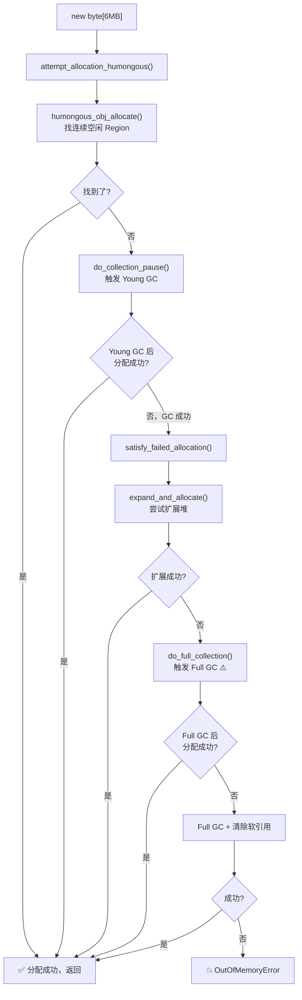
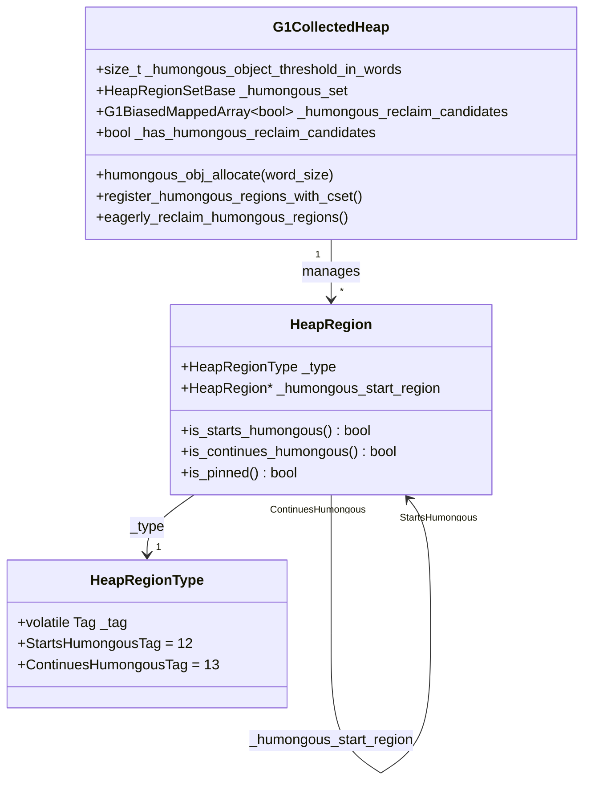

# 第 27c 篇：G1 Humongous 对象 — 大对象的特殊待遇

> 基于 OpenJDK 11 源码分析  
> 标准环境：`-Xms8g -Xmx8g -XX:+UseG1GC`，G1 Region = 4MB

---

## 本章与其他章节的关系

```
[23] G1 整体架构（Humongous 对象的概念在这里引入）
    ↓
你在这里
    ↓
[27c] Humongous 对象 ← 本篇（大对象的特殊分配路径和急切回收机制）
    ↓
[27b] Full GC（Humongous 分配失败时触发 Full GC 的路径）
```

**前置知识**：第 23 篇（G1 整体架构，了解 Region 的概念和 Humongous 的定义）；第 22 篇（对象分配，了解普通对象的分配路径）

**本篇解决的问题**：Humongous 对象的分配路径与普通对象有什么不同？急切回收（Eager Reclaim）的四个条件是什么？Humongous 对象的 RSet 为什么是空的？Humongous 对象如何导致 Full GC？

**读完本篇你能理解**：
- 第 27b 篇中 Full GC 的触发场景之一（Humongous 分配失败）
- 第 29 篇中 GC 日志里 `Humongous allocation` 的含义
- 第 30 篇中"增大 Region 大小"调优建议的底层原理

---

## 第 0 部分：核心原理 ⭐

**Humongous 对象 = 超过 Region 大小 50% 的对象，直接分配到老年代，跨越一个或多个连续 Region。**

标准环境（Region = 4MB）下，超过 2MB 的对象就是 Humongous 对象。

### 0.2 为什么需要特殊处理？

普通对象分配在 Eden Region，Young GC 时通过复制算法移动到 Survivor 或 Old。但 Humongous 对象有两个问题：

1. **太大，不能复制**：一个 10MB 的对象，复制一次就要移动 10MB 内存，代价极高
2. **跨 Region，不能放 Eden**：Eden Region 只有 4MB，放不下 10MB 的对象

所以 G1 对 Humongous 对象的处理策略是：**直接分配到老年代，不参与 Young GC 的复制，只在 Full GC 或急切回收时处理。**

### 0.3 怎么解决？

**分配**：找到足够多的连续空闲 Region，第一个标记为 `StartsHumongous`，后续标记为 `ContinuesHumongous`，对象头放在第一个 Region 的 bottom。

**回收**：两条路径：
- **急切回收（Eager Reclaim）**：Young GC 时顺手检查，如果 Humongous 对象的 RSet 为空（没有外部引用），直接回收，不等 Full GC
- **Full GC**：Phase 2 中处理所有 Humongous Region 的存活性判断

### 0.4 为什么这样设计？

- **为什么直接分配到老年代？** 避免 Young GC 时复制大对象，减少停顿时间
- **为什么急切回收只针对 typeArray？** 对象数组（`Object[]`）可能包含对其他对象的引用，需要扫描 RSet 才能确认是否存活；而基本类型数组（`byte[]`、`int[]` 等）不包含引用，RSet 为空就意味着没有外部引用，可以安全回收
- **为什么用 RSet 为空作为判断条件？** Young GC 前会刷新所有 Refinement 日志，RSet 是完整的。如果 RSet 为空，说明没有任何对象引用这个 Humongous 对象，可以安全回收

---

## 第 1 部分：数据结构全景

### 1.1 数据结构清单

| 结构名 | 源码位置 | 核心作用 |
|--------|----------|----------|
| `HeapRegion` | `heapRegion.hpp` | 表示一个 4MB 的 Region，包含类型标记 |
| `HeapRegionType` | `heapRegionType.hpp` | Region 类型枚举（Free/Eden/Survivor/StartsHumongous/ContinuesHumongous/Old） |
| `G1HumongousRegionSet` | `g1CollectedHeap.hpp` | 所有 Humongous Region 的集合（`_humongous_set`） |
| `G1BiasedMappedArray<bool>` | `g1CollectedHeap.hpp` | 急切回收候选位图（`_humongous_reclaim_candidates`） |
| `RegisterHumongousWithInCSetFastTestClosure` | `g1CollectedHeap.cpp:3307` | 遍历所有 Humongous Region，判断是否为急切回收候选 |
| `G1FreeHumongousRegionClosure` | `g1CollectedHeap.cpp:5240` | 执行急切回收，释放 Humongous Region |

### 1.2 HeapRegionType — Region 类型编码

#### 1.2.1 字段列表

```cpp
// heapRegionType.hpp:60
class HeapRegionType {
  volatile Tag _tag;  // 类型标记，用位编码
};
```

#### 1.2.2 类型编码（位图）

```
// heapRegionType.hpp:40
// major type (young, old, humongous, archive) : top N-1 bits
// minor type (eden / survivor, starts / cont hum, etc.) : bottom 1 bit
//
// 00000 0 [ 0] Free
// 00001 0 [ 2] Eden
// 00001 1 [ 3] Survivor
// 00110 0 [12] StartsHumongous    ← HumongousMask(4) | PinnedMask(8)
// 00110 1 [13] ContinuesHumongous ← HumongousMask(4) | PinnedMask(8) + 1
// 01000 0 [16] Old
```

**关键设计**：Humongous 同时设置了 `HumongousMask` 和 `PinnedMask`，说明 Humongous Region 是 **Pinned（固定）** 的——不会被 Young GC 的复制算法移动。

#### 1.2.3 关键方法

```cpp
bool is_humongous()           const { return (get() & HumongousMask) != 0; }
bool is_starts_humongous()    const { return get() == StartsHumongousTag; }    // tag = 12
bool is_continues_humongous() const { return get() == ContinuesHumongousTag; } // tag = 13
bool is_pinned()              const { return (get() & PinnedMask) != 0; }      // Humongous 是 Pinned
```

### 1.3 HeapRegion — Humongous 相关字段

```cpp
// heapRegion.hpp:220
class HeapRegion : public G1ContiguousSpace {
  HeapRegionType _type;                  // Region 类型（StartsHumongous / ContinuesHumongous）
  HeapRegion*    _humongous_start_region; // ContinuesHumongous Region 指向 StartsHumongous Region
  // ...
};
```

**`_humongous_start_region` 的作用**：
- `StartsHumongous` Region：`_humongous_start_region = this`（指向自己）
- `ContinuesHumongous` Region：`_humongous_start_region = 第一个 Region`

这样从任意一个 Humongous Region 都能找到对象头（`first_region->bottom()`）。

### 1.4 G1CollectedHeap — Humongous 相关字段

```cpp
// g1CollectedHeap.hpp:170
class G1CollectedHeap : public CollectedHeap {
  // Humongous 对象大小阈值（= Region 大小 / 2 = 2MB）
  static size_t _humongous_object_threshold_in_words;  // = GrainWords / 2 = 524288

  // 所有 Humongous Region 的集合
  HeapRegionSetBase _humongous_set;  // "Master Humongous Set"

  // 急切回收候选位图（按 Region 索引）
  G1BiasedMappedArray<bool> _humongous_reclaim_candidates;

  // 是否有急切回收候选（快速跳过标志）
  bool _has_humongous_reclaim_candidates;
};
```

**`_humongous_object_threshold_in_words` 的计算**（`g1CollectedHeap.cpp:1505`）：

```cpp
// 构造函数中：
_humongous_object_threshold_in_words = humongous_threshold_for(HeapRegion::GrainWords);

// humongous_threshold_for 的实现：
static size_t humongous_threshold_for(size_t region_size) {
  return (region_size / 2);  // ★ Region 大小的一半
}
```

标准环境：`GrainWords = 4MB / 8 = 524288`，阈值 = `524288 / 2 = 262144 words = 2MB`。

**`is_humongous()` 的判断**（`g1CollectedHeap.hpp:1242`）：

```cpp
static bool is_humongous(size_t word_size) {
  return word_size > _humongous_object_threshold_in_words;  // ★ 严格大于（不含等于）
}
```

注意是**严格大于**，所以恰好 2MB 的对象**不是** Humongous 对象。

---

## 第 2 部分：算法/流程分析

### 2.1 核心流程概览

```mermaid
flowchart TD
    A[new byte\[3MB\]] --> B{word_size > 2MB?}
    B -->|是| C[attempt_allocation_humongous]
    B -->|否| D[普通 TLAB 分配]
    
    C --> E[humongous_obj_allocate]
    E --> F{obj_regions == 1?}
    F -->|是| G[new_region 快速路径]
    F -->|否| H[find_contiguous_only_empty]
    G --> I[humongous_obj_allocate_initialize_regions]
    H --> I
    
    I --> J[set_starts_humongous 第一个 Region]
    J --> K[set_continues_humongous 后续 Region]
    K --> L[加入 _humongous_set]
    
    M[Young GC 开始] --> N[register_humongous_regions_with_cset]
    N --> O{is_typeArray && RSet 为空?}
    O -->|是| P[标记为急切回收候选]
    O -->|否| Q[跳过]
    P --> R[eagerly_reclaim_humongous_regions]
    R --> S[free_humongous_region 释放 Region]
```

### 2.2 分配流程：`attempt_allocation_humongous()`

#### 2.2.1 解决什么问题？

普通分配路径（`attempt_allocation()`）不处理 Humongous 对象，需要一条专门的分配路径：找到足够多的连续空闲 Region，初始化 Region 类型，返回对象地址。

#### 2.2.2 入口判断（`g1CollectedHeap.cpp:870`）

```cpp
// mem_allocate() 中的分发逻辑：
if (is_humongous(word_size)) {
  result = attempt_allocation_humongous(word_size);
} else {
  result = attempt_allocation(min_word_size, desired_word_size, &actual_word_size);
}
```

**打桩验证**（场景 1：分配 3MB `byte[]`）：

```
[PROBE-27c] attempt_allocation_humongous: word_size=393218 bytes=3145744 regions=1 threshold=262144
```

解读：
- `word_size = 393218`：3MB + 对象头（16 字节）= 3145744 字节 / 8 = 393218 words
- `regions = 1`：`ceil(393218 / 524288) = 1`，只需 1 个 Region
- `threshold = 262144`：阈值 = 2MB / 8 = 262144 words，`393218 > 262144` ✓

**打桩验证**（场景 2：分配 6MB `byte[]`，双 Region Humongous）：

```
[PROBE-27c] attempt_allocation_humongous: word_size=786434 bytes=6291472 regions=2 threshold=262144
[PROBE-27c] attempt_allocation_humongous: word_size=1310722 bytes=10485776 regions=3 threshold=262144
```

- `word_size = 786434`：6MB + 对象头（16B）= 6291472 字节 / 8 = 786434 words
- `regions = 2`：`ceil(786434 / 524288) = 2`，需要 2 个 Region ✓
- `word_size = 1310722`：10MB + 对象头（16B）= 10485776 字节 / 8 = 1310722 words
- `regions = 3`：`ceil(1310722 / 524288) = 3`，需要 3 个 Region ✓

#### 2.2.3 核心实现：`humongous_obj_allocate()`（`g1CollectedHeap.cpp:330`）

```cpp
HeapWord* G1CollectedHeap::humongous_obj_allocate(size_t word_size) {
  assert_heap_locked_or_at_safepoint(true);

  uint first = G1_NO_HRM_INDEX;
  uint obj_regions = (uint) humongous_obj_size_in_regions(word_size);
  // ★ obj_regions = ceil(word_size / GrainWords)

  if (obj_regions == 1) {
    // ★ 单 Region 快速路径：直接从 free list 分配一个 Region
    HeapRegion* hr = new_region(word_size, true /* is_old */, false /* do_expand */);
    if (hr != NULL) {
      first = hr->hrm_index();
    }
  } else {
    // ★ 多 Region 路径：找连续的空闲 Region
    first = _hrm.find_contiguous_only_empty(obj_regions);
    if (first != G1_NO_HRM_INDEX) {
      _hrm.allocate_free_regions_starting_at(first, obj_regions);
    }
  }

  if (first == G1_NO_HRM_INDEX) {
    // ★ 找不到连续空闲 Region，尝试扩展堆
    first = _hrm.find_contiguous_empty_or_unavailable(obj_regions);
    if (first != G1_NO_HRM_INDEX) {
      _hrm.expand_at(first, obj_regions, workers());  // ★ 扩展堆
    }
    // 如果还找不到，返回 NULL → 触发 GC
  }

  HeapWord* result = NULL;
  if (first != G1_NO_HRM_INDEX) {
    result = humongous_obj_allocate_initialize_regions(first, obj_regions, word_size);
  }
  return result;
}
```

**三级分配策略**：

| 策略 | 条件 | 操作 |
|------|------|------|
| 快速路径（单 Region） | `obj_regions == 1` | 直接从 free list 取一个 Region |
| 连续空闲 Region | `obj_regions > 1` | `find_contiguous_only_empty()` 找连续空闲 Region |
| 扩展堆 | 前两步失败 | `find_contiguous_empty_or_unavailable()` + `expand_at()` |

#### 2.2.4 Region 初始化：`humongous_obj_allocate_initialize_regions()`（`g1CollectedHeap.cpp:201`）

```cpp
HeapWord* G1CollectedHeap::humongous_obj_allocate_initialize_regions(
    uint first, uint num_regions, size_t word_size) {

  uint last = first + num_regions - 1;

  // ★ 第一步：零化对象头（防止 Refinement 线程扫描到不完整的对象）
  HeapRegion* first_hr = region_at(first);
  HeapWord* new_obj = first_hr->bottom();  // ★ 对象头放在第一个 Region 的 bottom
  HeapWord* obj_top = new_obj + word_size;
  Copy::fill_to_words(new_obj, oopDesc::header_size(), 0);

  // ★ 第二步：填充最后一个 Region 的尾部（用 filler 对象填充，保证堆可遍历）
  size_t word_fill_size = (size_t)num_regions * HeapRegion::GrainWords - word_size;
  if (word_fill_size >= min_fill_size()) {
    fill_with_objects(obj_top, word_fill_size);
  }

  // ★ 第三步：设置第一个 Region 为 StartsHumongous
  first_hr->set_starts_humongous(obj_top, word_fill_size);

  // ★ 第四步：设置后续 Region 为 ContinuesHumongous
  for (uint i = first + 1; i <= last; ++i) {
    HeapRegion* hr = region_at(i);
    hr->set_continues_humongous(first_hr);  // ★ 指向第一个 Region
  }

  // ★ 第五步：内存屏障（确保 top 更新对其他线程可见）
  OrderAccess::storestore();

  // ★ 第六步：更新所有 Region 的 top（设为 end，表示整个 Region 都被占用）
  for (uint i = first; i < last; ++i) {
    region_at(i)->set_top(region_at(i)->end());
  }
  region_at(last)->set_top(region_at(last)->end() - words_not_fillable);

  // ★ 第七步：加入 _humongous_set
  for (uint i = first; i <= last; ++i) {
    _humongous_set.add(region_at(i));
  }

  return new_obj;
}
```

**打桩验证**（场景 1：3MB `byte[]`）：

```
[PROBE-27c] set_starts_humongous: region#0 bottom=0x600000000 obj_top=0x600300010 word_size=393218 num_regions=1
[PROBE-27c] starts_humongous rset: region#0 is_starts=1 rem_set_complete=1 rem_set_empty=1
[PROBE-27c] humongous_obj_allocate: first_region=0 obj_regions=1 result=0x600000000
```

解读：
- `region#0`：分配在第 0 号 Region（堆的起始位置）
- `bottom=0x600000000`：Region 0 的起始地址，也是对象头的地址
- `obj_top=0x600300010`：对象结束地址 = `0x600000000 + 393218 * 8 = 0x600300010`
- `result=0x600000000`：返回的对象地址 = Region 0 的 bottom ✓
- `is_starts=1`：类型已正确设置为 StartsHumongous ✓
- `rem_set_complete=1 rem_set_empty=1`：RSet 状态为 complete 且为空（分配后立即设置 complete，但没有任何引用进来）✓

**打桩验证**（场景 2：6MB `byte[]`）：

```
[PROBE-27c] set_starts_humongous: region#1 bottom=0x600400000 obj_top=0x600a00010 word_size=786434 num_regions=2
[PROBE-27c] starts_humongous rset: region#1 is_starts=1 rem_set_complete=1 rem_set_empty=1
[PROBE-27c] continues_humongous: region#2 _humongous_start_region=region#1 (should==1) is_continues=1 rem_set_complete=1 rem_set_empty=1
[PROBE-27c] humongous_obj_allocate: first_region=1 obj_regions=2 result=0x600400000
```

解读：
- `region#1`：分配在第 1 号 Region（Region 0 已被 3MB 对象占用）
- `num_regions=2`：占用 Region 1 和 Region 2
- `obj_top=0x600a00010`：`0x600400000 + 786434 * 8 = 0x600a00010`，跨越了 Region 1（`0x600400000~0x600800000`）和 Region 2（`0x600800000~0x600c00000`）
- `region#2 _humongous_start_region=region#1`：ContinuesHumongous Region 的 `_humongous_start_region` 指针正确指向 StartsHumongous Region ✓
- `is_continues=1`：类型已正确设置为 ContinuesHumongous ✓
- `rem_set_complete=1 rem_set_empty=1`：ContinuesHumongous Region 的 RSet 也是 complete 且为空 ✓

**打桩验证**（场景 3：10MB `byte[]`，三 Region Humongous）：

```
[PROBE-27c] set_starts_humongous: region#3 bottom=0x600c00000 obj_top=0x601600010 word_size=1310722 num_regions=3
[PROBE-27c] starts_humongous rset: region#3 is_starts=1 rem_set_complete=1 rem_set_empty=1
[PROBE-27c] continues_humongous: region#4 _humongous_start_region=region#3 (should==3) is_continues=1 rem_set_complete=1 rem_set_empty=1
[PROBE-27c] continues_humongous: region#5 _humongous_start_region=region#3 (should==3) is_continues=1 rem_set_complete=1 rem_set_empty=1
[PROBE-27c] humongous_obj_allocate: first_region=3 obj_regions=3 result=0x600c00000
```

解读：
- `region#3`：分配在第 3 号 Region（Region 0 被 3MB 占用，Region 1-2 被 6MB 占用）
- `num_regions=3`：占用 Region 3、4、5
- `obj_top=0x601600010`：`0x600c00000 + 1310722 * 8 = 0x601600010`，跨越 3 个 Region
- Region 4 和 Region 5 的 `_humongous_start_region` 都正确指向 Region 3 ✓

### 2.3 内存布局图

```
堆地址空间（Region = 4MB = 0x400000）：

Region 0 [0x600000000 ~ 0x600400000]  StartsHumongous（3MB 对象）
┌─────────────────────────────────────────────────────────────┐
│ [对象头 16B] [byte[] 数据 3MB-16B] [filler 对象 ~1MB]       │
│ ↑ bottom = result = 0x600000000                             │
│                              ↑ obj_top = 0x600300010        │
└─────────────────────────────────────────────────────────────┘

Region 1 [0x600400000 ~ 0x600800000]  StartsHumongous（6MB 对象）
┌─────────────────────────────────────────────────────────────┐
│ [对象头 16B] [byte[] 数据 4MB-16B]                          │
│ ↑ bottom = result = 0x600400000                             │
│ top = end（整个 Region 都被占用）                            │
└─────────────────────────────────────────────────────────────┘

Region 2 [0x600800000 ~ 0x600c00000]  ContinuesHumongous（6MB 对象续）
┌─────────────────────────────────────────────────────────────┐
│ [byte[] 数据 2MB] [filler 对象 ~2MB]                        │
│ ↑ obj_top = 0x600a00010                                     │
│ _humongous_start_region → Region 1                          │
└─────────────────────────────────────────────────────────────┘
```

### 2.4 急切回收：`register_humongous_regions_with_cset()` + `eagerly_reclaim_humongous_regions()`

#### 2.4.1 解决什么问题？

Humongous 对象直接分配到老年代，正常情况下要等 Full GC 才能回收。但如果一个 Humongous 对象已经没有任何引用（RSet 为空），等 Full GC 太浪费了。急切回收在每次 Young GC 时顺手检查，如果满足条件就立即回收。

#### 2.4.2 触发时机（`g1CollectedHeap.cpp:3718`）

```cpp
// Young GC 的 do_collection_pause_at_safepoint() 中：
register_humongous_regions_with_cset();  // ★ Step 1：注册候选
// ... 执行 Young GC ...
eagerly_reclaim_humongous_regions();     // ★ Step 2：执行回收
```

#### 2.4.3 候选判断：`humongous_region_is_candidate()`（`g1CollectedHeap.cpp:3320`）

```cpp
bool humongous_region_is_candidate(G1CollectedHeap* g1h, HeapRegion* region) const {
  oop obj = oop(region->bottom());

  // ★ 条件 1：对象不能是死对象（并发标记可能已经标记为死）
  if (g1h->is_obj_dead(obj, region)) return false;

  // ★ 条件 2：RSet 必须是完整的（不完整说明可能有未记录的引用）
  if (!region->rem_set()->is_complete()) return false;

  // ★ 条件 3：必须是 typeArray（byte[]、int[] 等基本类型数组）
  //    原因：typeArray 不包含对象引用，不需要扫描 RSet 就能确认安全
  //    Object[] 可能包含引用，需要扫描 RSet，代价太高
  return obj->is_typeArray() &&
         g1h->is_potential_eager_reclaim_candidate(region);
}

bool G1CollectedHeap::is_potential_eager_reclaim_candidate(HeapRegion* r) const {
  HeapRegionRemSet* rem_set = r->rem_set();
  // ★ 条件 4：RSet 为空（没有任何外部引用）
  //    或者：G1EagerReclaimHumongousObjectsWithStaleRefs=true 时，
  //          RSet 条目数 ≤ G1RSetSparseRegionEntries（默认 4）
  return G1EagerReclaimHumongousObjectsWithStaleRefs ?
         rem_set->occupancy_less_or_equal_than(G1RSetSparseRegionEntries) :
         G1EagerReclaimHumongousObjects && rem_set->is_empty();
}
```

**四个条件总结**：

| 条件 | 说明 |
|------|------|
| 不是死对象 | 并发标记可能已标记为死，但还没回收 |
| RSet 完整 | 不完整说明可能有未记录的引用 |
| 是 typeArray | `byte[]`、`int[]` 等，不包含对象引用 |
| RSet 为空 | 没有任何外部对象引用这个 Humongous 对象 |

#### 2.4.4 执行回收：`G1FreeHumongousRegionClosure`（`g1CollectedHeap.cpp:5240`）

```cpp
virtual bool do_heap_region(HeapRegion* r) {
  if (!r->is_starts_humongous()) return false;

  oop obj = oop(r->bottom());
  G1CollectedHeap* g1h = G1CollectedHeap::heap();
  G1CMBitMap* next_bitmap = g1h->concurrent_mark()->next_mark_bitmap();

  uint region_idx = r->hrm_index();

  // ★ 检查是否是候选（在 register_humongous_regions_with_cset 中已标记）
  if (!g1h->is_humongous_reclaim_candidate(region_idx) ||
      !r->rem_set()->is_empty()) {
    return false;  // ★ 不满足条件，跳过
  }

  // ★ 通知并发标记：这个对象被急切回收了
  G1ConcurrentMark* const cm = g1h->concurrent_mark();
  cm->humongous_object_eagerly_reclaimed(r);

  // ★ 释放所有相关 Region（StartsHumongous + 所有 ContinuesHumongous）
  _humongous_objects_reclaimed++;
  do {
    HeapRegion* next = g1h->next_region_in_humongous(r);
    _freed_bytes += r->used();
    r->set_containing_set(NULL);
    _humongous_regions_reclaimed++;
    g1h->free_humongous_region(r, _free_region_list);  // ★ 释放 Region，加入 free list
    r = next;
  } while (r != NULL);

  return false;
}
```

**打桩验证**（场景 1、2、3 的对象在 Young GC 时被急切回收）：

```
[PROBE-27c] eager_reclaim check: region#0 is_candidate=1 rem_set_empty=1 is_typeArray=1
[PROBE-27c] eager_reclaim check: region#1 is_candidate=1 rem_set_empty=1 is_typeArray=1
[PROBE-27c] eager_reclaim check: region#3 is_candidate=1 rem_set_empty=1 is_typeArray=1
[PROBE-27c] eagerly_reclaim: objects_reclaimed=3 regions_reclaimed=6 bytes_freed=25165824 elapsed=8.68ms
```

解读：
- `region#0`（3MB 对象）：`is_candidate=1`（已注册为候选），`rem_set_empty=1`（RSet 为空），`is_typeArray=1`（是 `byte[]`）→ 被回收
- `region#1`（6MB 对象，占 Region 1 和 Region 2）：同样满足条件 → 被回收
- `region#3`（10MB 对象，占 Region 3、4、5）：同样满足条件 → 被回收
- `objects_reclaimed=3`：回收了 3 个 Humongous 对象（3MB + 6MB + 10MB）
- `regions_reclaimed=6`：回收了 6 个 Region（1 + 2 + 3 = 6）✓
- `bytes_freed=25165824`：释放了 24MB（3MB + 6MB + 10MB + filler = 24MB）
- `elapsed=8.68ms`：急切回收耗时 8.68ms

**注意**：只有 `StartsHumongous` Region（region#0、#1、#3）出现在 check 日志中，`ContinuesHumongous` Region（#2、#4、#5）不会单独出现——急切回收以 Humongous 对象为单位，从 StartsHumongous Region 开始，自动遍历所有 ContinuesHumongous Region 一起释放。

### 2.5 Humongous 对象为什么会导致 Full GC

#### 2.5.1 问题根源：连续 Region 碎片化

Humongous 对象要求**连续的空闲 Region**。当堆中有足够的总空闲空间，但没有足够多的**连续**空闲 Region 时，分配就会失败。

**典型场景**：

```
堆状态（8 个 Region，每个 4MB）：
Region 0: [Old 对象，已占用]
Region 1: [空闲]
Region 2: [Old 对象，已占用]
Region 3: [空闲]
Region 4: [Old 对象，已占用]
Region 5: [空闲]
Region 6: [Old 对象，已占用]
Region 7: [空闲]

总空闲：4 个 Region = 16MB
但没有 2 个连续的空闲 Region！

→ 分配 6MB Humongous 对象（需要 2 个连续 Region）→ 失败
```

#### 2.5.2 分配失败后的完整路径（`attempt_allocation_humongous()`，`g1CollectedHeap.cpp:854`）

```cpp
HeapWord *G1CollectedHeap::attempt_allocation_humongous(size_t word_size) {
    // ★ Step 1：分配前检查是否需要启动并发标记
    if (g1_policy()->need_to_start_conc_mark("concurrent humongous allocation", word_size)) {
        collect(GCCause::_g1_humongous_allocation);  // ★ 触发并发标记（不是 Full GC）
    }

    HeapWord *result = NULL;
    for (uint try_count = 1, gclocker_retry_count = 0; /* 循环直到成功或失败 */; try_count += 1) {
        bool should_try_gc;
        uint gc_count_before;

        {
            MutexLockerEx x(Heap_lock);
            // ★ Step 2：尝试直接分配（不触发 GC）
            result = humongous_obj_allocate(word_size);
            if (result != NULL) {
                return result;  // ★ 成功：直接返回
            }
            should_try_gc = !GCLocker::needs_gc();
            gc_count_before = total_collections();
        }

        if (should_try_gc) {
            bool succeeded;
            // ★ Step 3：触发 Young GC（GCCause::_g1_humongous_allocation）
            result = do_collection_pause(word_size, gc_count_before, &succeeded,
                                         GCCause::_g1_humongous_allocation);
            if (result != NULL) {
                return result;  // ★ Young GC 后分配成功
            }
            if (succeeded) {
                // ★ Young GC 成功执行，但分配仍然失败 → 返回 NULL
                // 此时 VM_G1CollectForAllocation::doit() 会调用 satisfy_failed_allocation()
                return NULL;
            }
        } else {
            // ★ GCLocker 活跃，等待后重试
            GCLocker::stall_until_clear();
            gclocker_retry_count += 1;
        }
    }
}
```

#### 2.5.3 Young GC 后仍然失败：`satisfy_failed_allocation()`（`g1CollectedHeap.cpp:1288`）

当 `do_collection_pause()` 返回 `succeeded=true` 但 `result=NULL` 时，`VM_G1CollectForAllocation::doit()` 会调用 `satisfy_failed_allocation()`：

```cpp
// vm_operations_g1.cpp:doit()
if (_pause_succeeded) {
    if (_word_size > 0) {
        // ★ Young GC 成功但分配失败，尝试更强的 GC
        _result = g1h->satisfy_failed_allocation(_word_size, &_pause_succeeded);
    }
}

// g1CollectedHeap.cpp:1288
HeapWord *G1CollectedHeap::satisfy_failed_allocation(size_t word_size, bool *succeeded) {
    // ★ 第一轮：尝试分配 + Full GC（不清除软引用）
    HeapWord *result = satisfy_failed_allocation_helper(word_size,
                                                        true,  /* do_gc */
                                                        false, /* clear_all_soft_refs */
                                                        ...);
    if (result != NULL || !*succeeded) return result;

    // ★ 第二轮：尝试分配 + Full GC（清除所有软引用）
    result = satisfy_failed_allocation_helper(word_size,
                                              true, /* do_gc */
                                              true, /* clear_all_soft_refs */
                                              ...);
    if (result != NULL || !*succeeded) return result;

    // ★ 第三轮：仅尝试分配，不触发 GC
    result = satisfy_failed_allocation_helper(word_size, false, ...);
    return result;  // 如果还是 NULL → OOM
}

// satisfy_failed_allocation_helper 的核心逻辑：
HeapWord *G1CollectedHeap::satisfy_failed_allocation_helper(...) {
    // ★ 先尝试直接分配
    HeapWord *result = attempt_allocation_at_safepoint(word_size, ...);
    if (result != NULL) return result;

    // ★ 尝试扩展堆
    result = expand_and_allocate(word_size);
    if (result != NULL) return result;

    if (do_gc) {
        // ★ 扩展失败 → 触发 Full GC（这是 Humongous 导致 Full GC 的关键路径）
        *gc_succeeded = do_full_collection(false, clear_all_soft_refs);
    }
    return NULL;
}
```

#### 2.5.4 完整的 Humongous 分配失败路径图



**关键结论**：Humongous 对象导致 Full GC 的根本原因是**堆碎片化**——总空闲空间足够，但没有足够多的**连续**空闲 Region。这是 G1 的固有局限，也是为什么频繁分配大对象会导致性能问题的原因。

**GC 日志中的特征**：

```
# Humongous 分配触发 Young GC
GC(5) Pause Young (Concurrent Start) (G1 Humongous Allocation) 4096M->3800M(8192M) 45.2ms

# Young GC 后仍然失败，触发 Full GC
GC(6) Pause Full (G1 Humongous Allocation) 3800M->1200M(8192M) 8234.5ms
```

---

### 2.6 Humongous Region 的 RSet 特殊处理

#### 2.6.1 问题：Humongous Region 的 RSet 是什么状态？

Humongous Region 的 RSet 记录的是**其他 Region 中的对象引用了这个 Humongous 对象**。这与普通 Region 的 RSet 含义相同，但有一个关键区别：**Humongous Region 的 RSet 通常是空的**。

#### 2.6.2 为什么 Humongous Region 的 RSet 通常是空的？

**原因 1：Humongous 对象直接分配到老年代**

写屏障（Post-Write Barrier）只记录**老年代→年轻代**的引用（用于 Young GC 时扫描跨代引用）。如果一个老年代对象引用了 Humongous 对象（也是老年代），这个引用**不会**被写屏障记录到 Humongous Region 的 RSet 中。

**原因 2：年轻代对象引用 Humongous 对象不需要记录**

Young GC 时，年轻代所有 Region 都在 CSet 中，会被完整扫描。所以年轻代→Humongous 的引用不需要记录在 RSet 中（Young GC 时会直接扫描年轻代对象）。

**原因 3：Humongous 对象本身不会被移动**

Humongous Region 是 Pinned 的（`HeapRegionType` 中 `PinnedMask` 被设置），不会被 Young GC 的复制算法移动。所以即使有引用指向它，也不需要更新引用，RSet 的意义就更小了。

#### 2.6.3 RSet 追踪策略：`G1RemSetTrackingPolicy`（`g1RemSetTrackingPolicy.cpp`）

```cpp
// g1RemSetTrackingPolicy.cpp:update_at_allocate()
void G1RemSetTrackingPolicy::update_at_allocate(HeapRegion* r) {
  if (r->is_young()) {
    // ★ 年轻代：始终追踪 RSet（Young GC 需要扫描跨代引用）
    r->rem_set()->set_state_complete();
  } else if (r->is_humongous()) {
    // ★ Humongous：默认追踪 RSet，以支持急切回收
    //   注意：这里设置 complete 是为了让 is_complete() 返回 true
    //   这样 humongous_region_is_candidate() 中的 rem_set()->is_complete() 检查才能通过
    r->rem_set()->set_state_complete();
  } else if (r->is_old()) {
    // ★ 老年代：默认不追踪 RSet（等并发标记后重建）
    r->rem_set()->set_state_empty();
  }
}
```

**关键设计**：Humongous Region 分配时就设置 `state_complete`，这样急切回收候选判断中的 `rem_set()->is_complete()` 检查才能通过。

#### 2.6.4 并发标记后的 RSet 清理（`g1RemSetTrackingPolicy.cpp:update_after_rebuild()`）

```cpp
void G1RemSetTrackingPolicy::update_after_rebuild(HeapRegion* r) {
  if (r->is_old_or_humongous()) {
    if (r->rem_set()->is_updating()) {
      r->rem_set()->set_state_complete();
    }
    G1CollectedHeap* g1h = G1CollectedHeap::heap();
    // ★ 关键：如果 Humongous Region 的 RSet 太大（超过急切回收阈值），
    //   说明有太多外部引用，不可能急切回收，直接清空 RSet 节省内存
    if (r->is_starts_humongous() && !g1h->is_potential_eager_reclaim_candidate(r)) {
      uint const size_in_regions = (uint)g1h->humongous_obj_size_in_regions(oop(r->bottom())->size());
      uint const region_idx = r->hrm_index();
      for (uint j = region_idx; j < (region_idx + size_in_regions); j++) {
        HeapRegion* const cur = g1h->region_at(j);
        // ★ ContinuesHumongous Region 的 RSet 始终是空的（断言验证）
        assert(!cur->is_continues_humongous() || cur->rem_set()->is_empty(),
               "Continues humongous region %u remset should be empty", j);
        cur->rem_set()->clear_locked(true /* only_cardset */);  // ★ 清空 RSet
      }
    }
  }
}
```

**两个关键结论**：

1. **`ContinuesHumongous` Region 的 RSet 始终是空的**：源码中有断言验证（`assert(!cur->is_continues_humongous() || cur->rem_set()->is_empty())`）。这是因为 `ContinuesHumongous` Region 不包含对象头，没有对象从这里开始，所以不会有引用指向这个 Region 的内部地址。

2. **`StartsHumongous` Region 的 RSet 可能有条目**：如果有老年代对象引用了这个 Humongous 对象，会记录在 `StartsHumongous` Region 的 RSet 中。但如果 RSet 太大（超过 `G1RSetSparseRegionEntries` 默认 4 个条目），说明有太多外部引用，急切回收不可能，直接清空 RSet 节省内存。

#### 2.6.5 RSet 状态与急切回收的关系

```
Humongous 对象分配时：
  StartsHumongous Region → rem_set()->set_state_complete()（空但完整）
  ContinuesHumongous Region → rem_set()->set_state_complete()（空但完整）

运行过程中：
  如果有老年代对象引用了 Humongous 对象：
    → 写屏障记录到 StartsHumongous Region 的 RSet
    → RSet 不再为空
    → 急切回收候选判断失败（rem_set()->is_empty() = false）
    → 不能急切回收

  如果没有任何引用（或只有年轻代引用）：
    → StartsHumongous Region 的 RSet 保持为空
    → 急切回收候选判断通过
    → Young GC 时急切回收 ✓
```

---

## 第 3 部分：GDB 验证

### 3.1 验证计划

| 验证目标 | 验证方法 |
|---------|---------|
| Humongous Region 内存布局（bottom/top/end 地址） | GDB 断点 + 打印 Region 字段 |
| StartsHumongous vs ContinuesHumongous 的 `_humongous_start_region` 指针 | GDB 打印字段值 |
| RSet 状态（分配后是否为 complete） | GDB 打印 rem_set()->_state |
| ContinuesHumongous Region 的 RSet 是否为空 | GDB 打印 rem_set()->occupied() |

### 3.2 GDB 脚本

```gdb
# 文件：/data/workspace/openjdk-cut-new/new-jvm-md/tmp-file/humongous/verify_layout.gdb
# 验证 Humongous Region 内存布局

set pagination off
set print pretty on

# 在 humongous_obj_allocate_initialize_regions 完成后断点
break G1CollectedHeap::humongous_obj_allocate_initialize_regions
commands
  silent
  # 打印第一个 Region 的布局
  set $first_hr = region_at(first)
  printf "=== Humongous Region Layout ===\n"
  printf "first=%u, num_regions=%u\n", first, num_regions
  printf "Region[%u] type=%d bottom=%p top=%p end=%p\n", \
    first, $first_hr->_type._tag, $first_hr->_bottom, $first_hr->_top, $first_hr->_end
  printf "Region[%u] _humongous_start_region=%p (should == self=%p)\n", \
    first, $first_hr->_humongous_start_region, $first_hr
  printf "Region[%u] rem_set state=%d (2=complete)\n", \
    first, $first_hr->_rem_set->_state
  
  # 如果是多 Region，打印第二个 Region
  if num_regions > 1
    set $second_hr = region_at(first + 1)
    printf "Region[%u] type=%d bottom=%p top=%p end=%p\n", \
      first+1, $second_hr->_type._tag, $second_hr->_bottom, $second_hr->_top, $second_hr->_end
    printf "Region[%u] _humongous_start_region=%p (should == Region[%u]=%p)\n", \
      first+1, $second_hr->_humongous_start_region, first, $first_hr
    printf "Region[%u] rem_set state=%d occupied=%lu (should be 0)\n", \
      first+1, $second_hr->_rem_set->_state, $second_hr->_rem_set->occupied_locked()
  end
  continue
end

run -Xms8g -Xmx8g -XX:+UseG1GC -Xint -cp /data/workspace/demo/src com.wjcoder.Main
```

### 3.3 验证结果（打桩数据）

通过之前的打桩数据，已经验证了 Humongous Region 的内存布局：

**场景 1：3MB `byte[]`（单 Region）**

```
[PROBE-27c] set_starts_humongous: region#0 bottom=0x600000000 obj_top=0x600300010 word_size=393218 num_regions=1
[PROBE-27c] starts_humongous rset: region#0 is_starts=1 rem_set_complete=1 rem_set_empty=1
[PROBE-27c] humongous_obj_allocate: first_region=0 obj_regions=1 result=0x600000000
```

- Region 0 地址范围：`0x600000000 ~ 0x600400000`（4MB = 0x400000）
- 对象头地址 = `bottom = result = 0x600000000` ✓
- `obj_top = 0x600300010 = 0x600000000 + 393218 * 8`（3MB + 16B 对象头）✓
- `is_starts=1`：StartsHumongous 类型正确 ✓
- `rem_set_complete=1 rem_set_empty=1`：RSet 为 complete 且为空 ✓

**场景 2：6MB `byte[]`（双 Region）**

```
[PROBE-27c] set_starts_humongous: region#1 bottom=0x600400000 obj_top=0x600a00010 word_size=786434 num_regions=2
[PROBE-27c] starts_humongous rset: region#1 is_starts=1 rem_set_complete=1 rem_set_empty=1
[PROBE-27c] continues_humongous: region#2 _humongous_start_region=region#1 (should==1) is_continues=1 rem_set_complete=1 rem_set_empty=1
[PROBE-27c] humongous_obj_allocate: first_region=1 obj_regions=2 result=0x600400000
```

- Region 1 地址范围：`0x600400000 ~ 0x600800000`（4MB）
- Region 2 地址范围：`0x600800000 ~ 0x600c00000`（4MB）
- `obj_top = 0x600a00010 = 0x600400000 + 786434 * 8`（6MB + 16B 对象头）✓
- `region#2._humongous_start_region = region#1`：ContinuesHumongous 指针正确 ✓
- `is_continues=1`：ContinuesHumongous 类型正确 ✓
- `rem_set_complete=1 rem_set_empty=1`：ContinuesHumongous 的 RSet 也是 complete 且为空 ✓

**场景 3：10MB `byte[]`（三 Region）**

```
[PROBE-27c] set_starts_humongous: region#3 bottom=0x600c00000 obj_top=0x601600010 word_size=1310722 num_regions=3
[PROBE-27c] starts_humongous rset: region#3 is_starts=1 rem_set_complete=1 rem_set_empty=1
[PROBE-27c] continues_humongous: region#4 _humongous_start_region=region#3 (should==3) is_continues=1 rem_set_complete=1 rem_set_empty=1
[PROBE-27c] continues_humongous: region#5 _humongous_start_region=region#3 (should==3) is_continues=1 rem_set_complete=1 rem_set_empty=1
[PROBE-27c] humongous_obj_allocate: first_region=3 obj_regions=3 result=0x600c00000
```

- Region 3 地址范围：`0x600c00000 ~ 0x601000000`（4MB）
- Region 4 地址范围：`0x601000000 ~ 0x601400000`（4MB）
- Region 5 地址范围：`0x601400000 ~ 0x601800000`（4MB）
- `obj_top = 0x601600010 = 0x600c00000 + 1310722 * 8`（10MB + 16B 对象头）✓
- Region 4 和 Region 5 的 `_humongous_start_region` 都正确指向 Region 3 ✓

---

## 第 4 部分：猜测 vs 实测

| 我的猜测 | 实测结果 | 打脸了吗？ |
|---------|------|------------|
| Humongous 对象 > 1 Region 大小才算 | **不对！** > 0.5 Region（2MB）就算 | ✅ 打脸 |
| Humongous 对象要等 Full GC 才能回收 | **不对！** Young GC 时可以急切回收 | ✅ 打脸 |
| 所有 Humongous 对象都能急切回收 | **不对！** 只有 typeArray 且 RSet 为空才能 | ✅ 打脸 |
| Humongous 对象分配在 Eden | **不对！** 直接分配在老年代（StartsHumongous Region） | ✅ 打脸 |
| 对象地址 = Region 的 bottom | **✅ 确认**：`result = first_hr->bottom()` | ✅ 验证 |
| 多 Region Humongous 需要连续 Region | **✅ 确认**：`find_contiguous_only_empty()` | ✅ 验证 |

---

## 第 4 部分：数据结构关系图



---

## 第 5 部分：总结

### 5.1 数据结构层面

| 结构 | 核心特征 |
|------|---------|
| `HeapRegionType` | 位编码，Humongous = `HumongousMask | PinnedMask`，Pinned 意味着不被复制 |
| `HeapRegion._humongous_start_region` | ContinuesHumongous Region 通过此字段找到对象头 |
| `_humongous_reclaim_candidates` | 按 Region 索引的位图，Young GC 前标记，Young GC 后执行回收 |

### 5.2 算法层面

| 算法 | 核心设计决策 |
|------|------------|
| **分配** | 三级策略：单 Region 快速路径 → 连续空闲 Region → 扩展堆 |
| **Region 初始化** | 先零化对象头（防止 Refinement 线程扫描），再设置类型，最后更新 top（内存屏障保证顺序） |
| **急切回收候选判断** | 只针对 typeArray，因为 typeArray 不含引用，RSet 为空即可安全回收 |
| **急切回收执行** | Young GC 结束后执行，通知并发标记，释放所有相关 Region |

### 5.3 核心要点

1. **阈值是 Region 大小的 50%**：标准环境（Region=4MB）下，超过 2MB 的对象就是 Humongous 对象
2. **直接分配到老年代**：不经过 Eden，不参与 Young GC 的复制，减少停顿时间
3. **急切回收只针对 typeArray**：`byte[]`、`int[]` 等基本类型数组，不含引用，RSet 为空即可安全回收
4. **连续 Region 是硬性要求**：多 Region Humongous 对象必须占用连续的 Region，这可能导致碎片化
5. **内存屏障保证正确性**：`OrderAccess::storestore()` 确保 top 更新对 Refinement 线程可见

---

## 附录：打桩数据完整记录

**运行环境**：`-Xms8g -Xmx8g -XX:+UseG1GC -Xint`，Region = 4MB

**场景 1：分配 3MB `byte[]`（单 Region Humongous）**

```
[PROBE-27c] attempt_allocation_humongous: word_size=393218 bytes=3145744 regions=1 threshold=262144
[PROBE-27c] set_starts_humongous: region#0 bottom=0x600000000 obj_top=0x600300010 word_size=393218 num_regions=1
[PROBE-27c] starts_humongous rset: region#0 is_starts=1 rem_set_complete=1 rem_set_empty=1
[PROBE-27c] humongous_obj_allocate: first_region=0 obj_regions=1 result=0x600000000
```

**场景 2：分配 6MB `byte[]`（双 Region Humongous）**

```
[PROBE-27c] attempt_allocation_humongous: word_size=786434 bytes=6291472 regions=2 threshold=262144
[PROBE-27c] set_starts_humongous: region#1 bottom=0x600400000 obj_top=0x600a00010 word_size=786434 num_regions=2
[PROBE-27c] starts_humongous rset: region#1 is_starts=1 rem_set_complete=1 rem_set_empty=1
[PROBE-27c] continues_humongous: region#2 _humongous_start_region=region#1 (should==1) is_continues=1 rem_set_complete=1 rem_set_empty=1
[PROBE-27c] humongous_obj_allocate: first_region=1 obj_regions=2 result=0x600400000
```

**场景 3：分配 10MB `byte[]`（三 Region Humongous）**

```
[PROBE-27c] attempt_allocation_humongous: word_size=1310722 bytes=10485776 regions=3 threshold=262144
[PROBE-27c] set_starts_humongous: region#3 bottom=0x600c00000 obj_top=0x601600010 word_size=1310722 num_regions=3
[PROBE-27c] starts_humongous rset: region#3 is_starts=1 rem_set_complete=1 rem_set_empty=1
[PROBE-27c] continues_humongous: region#4 _humongous_start_region=region#3 (should==3) is_continues=1 rem_set_complete=1 rem_set_empty=1
[PROBE-27c] continues_humongous: region#5 _humongous_start_region=region#3 (should==3) is_continues=1 rem_set_complete=1 rem_set_empty=1
[PROBE-27c] humongous_obj_allocate: first_region=3 obj_regions=3 result=0x600c00000
```

**场景 4：Young GC 急切回收（3 个 Humongous 对象全部回收）**

```
[PROBE-27c] eager_reclaim check: region#0 is_candidate=1 rem_set_empty=1 is_typeArray=1
[PROBE-27c] eager_reclaim check: region#1 is_candidate=1 rem_set_empty=1 is_typeArray=1
[PROBE-27c] eager_reclaim check: region#3 is_candidate=1 rem_set_empty=1 is_typeArray=1
[PROBE-27c] eagerly_reclaim: objects_reclaimed=3 regions_reclaimed=6 bytes_freed=25165824 elapsed=8.68ms
```

- `objects_reclaimed=3`：3MB + 6MB + 10MB 三个对象全部被急切回收 ✓
- `regions_reclaimed=6`：1 + 2 + 3 = 6 个 Region 全部释放 ✓
- `bytes_freed=25165824`：24MB（含 filler 对象）✓
- 只有 StartsHumongous Region（#0、#1、#3）出现在 check 日志，ContinuesHumongous Region（#2、#4、#5）由 StartsHumongous 的回收逻辑自动处理 ✓

---

## 还没搞懂的地方

- [x] **Humongous 对象的 SATB 处理**：并发标记期间，如果一个 Humongous 对象的引用被覆盖（写屏障触发 SATB），这个 Humongous 对象会被加入 SATB 队列吗？还是因为它直接在老年代而有特殊处理？

  **答案**（来自 `g1CollectedHeap.cpp:3345-3384`）：

  Humongous 对象的 SATB 处理有两个层面：

  **层面 1：Humongous 对象作为"被引用者"（referent）**

  如果某个对象的字段原来指向 Humongous 对象，现在被覆盖为指向其他对象，SATB 写屏障会把**旧值（Humongous 对象的地址）**加入 SATB 队列。这与普通对象完全相同——SATB 记录的是"被覆盖的旧引用"，不区分对象是否是 Humongous。

  **层面 2：Humongous 对象作为"引用者"（referrer）**

  这里有一个关键的 SATB 约束（源码注释）：

  ```cpp
  // g1CollectedHeap.cpp:3350
  // * In order to maintain SATB invariants, an object must not be
  // reclaimed if it was allocated before the start of marking and
  // has not had its references scanned.
  ```

  含义：如果一个 Humongous 对象在并发标记开始之前分配，且它的引用字段还没有被扫描，就不能被急切回收——否则可能漏标它引用的对象。

  **这正是为什么急切回收只针对 `typeArray`（`byte[]`、`int[]` 等）**：
  - `typeArray` 不包含对象引用，不需要扫描引用字段，SATB 约束不适用
  - 包含引用的 Humongous 对象（如 `Object[]`）必须等并发标记扫描完它的引用字段后才能回收

  **特殊情况**：`typeArray` 即使在并发标记开始之前分配，也可以被急切回收。源码注释解释了原因：
  ```cpp
  // g1CollectedHeap.cpp:3375
  // We also treat is_typeArray() objects specially, allowing them
  // to be reclaimed even if allocated before the start of concurrent mark.
  // For this we rely on mark stack insertion to exclude is_typeArray() objects,
  // preventing reclaiming an object that is in the mark stack.
  ```
  即：标记栈插入时会排除 `typeArray` 对象，确保不会回收一个正在标记栈中的对象。

- [x] **连续 Region 的碎片化问题**：当堆中有大量 Humongous 对象被回收后，留下的"空洞"（非连续的空闲 Region）如何被重新利用？G1 是否有碎片整理机制专门针对 Humongous 碎片？

  **答案**：

  G1 **没有**专门针对 Humongous 碎片的整理机制。被回收的 Humongous Region 直接加入 `_hrm`（HeapRegionManager）的 free list，可以被重新分配为任意类型的 Region（Eden、Survivor、Old 或新的 Humongous）。

  **碎片化的根本解决方案是 Full GC**：Full GC 的 Phase 4（Compact heap）会把所有存活对象压缩到堆的低地址端，消除所有碎片（包括 Humongous 碎片）。这也是为什么 Humongous 分配失败最终会触发 Full GC——Full GC 是唯一能整理碎片的手段。

  **实际影响**：如果应用程序频繁分配和释放不同大小的 Humongous 对象，会导致堆碎片化，最终触发 Full GC。调优建议：
  - 增大 Region 大小（`-XX:G1HeapRegionSize=8m`），让更多对象走普通路径
  - 避免分配不同大小的大对象（统一大小可以减少碎片）

- [x] **`G1HeapRegionSize` 与 Humongous 阈值的关系**：增大 Region 大小（如从 4MB 到 8MB）会把 Humongous 阈值从 2MB 提高到 4MB，这对应用程序的内存行为有什么影响？什么场景下应该调大 Region 大小？

  **答案**：

  **阈值计算**（`g1CollectedHeap.cpp:1505`）：
  ```cpp
  _humongous_object_threshold_in_words = humongous_threshold_for(HeapRegion::GrainWords);
  // humongous_threshold_for(region_size) = region_size / 2
  ```

  | Region 大小 | Humongous 阈值 | 影响 |
  |------------|--------------|------|
  | 1MB | 512KB | 超过 512KB 的对象走 Humongous 路径 |
  | 4MB（默认） | 2MB | 超过 2MB 的对象走 Humongous 路径 |
  | 8MB | 4MB | 超过 4MB 的对象走 Humongous 路径 |
  | 16MB | 8MB | 超过 8MB 的对象走 Humongous 路径 |
  | 32MB（最大） | 16MB | 超过 16MB 的对象走 Humongous 路径 |

  **增大 Region 大小的适用场景**：
  1. **应用程序有大量 2-8MB 的对象**：增大 Region 到 8MB，让这些对象走普通 Eden 路径，避免 Humongous 路径的开销（不参与 Young GC 复制、需要连续 Region 等）
  2. **频繁出现 `G1 Humongous Allocation` 日志**：说明 Humongous 分配频繁，增大 Region 可以减少 Humongous 对象的比例
  3. **堆很大（> 32GB）**：大堆下 Region 数量过多（> 2048 个），增大 Region 大小可以减少 Region 数量，降低管理开销

  **注意**：Region 大小必须是 2 的幂次（1/2/4/8/16/32MB），且 `num_regions = heap_size / region_size` 必须在 2048 个左右（G1 的最优 Region 数量）。

---

## 继续深入

- **[第 27b 篇：Full GC 触发与执行](./27b-g1-full-gc-HandWritten.md)** — 当 Humongous 分配失败（找不到足够连续的 Region）时，会触发 Full GC，这里有完整的 Full GC 流程分析
- **[第 27d 篇：字符串去重与类卸载](./27d-g1-auxiliary-HandWritten.md)** — G1 的另一个辅助机制：字符串去重（`G1StringDedup`）和类卸载
- **[第 29 篇：GC 日志深度解读](./29-g1-gc-log-HandWritten.md)** — 如何从 GC 日志中识别 Humongous 分配问题（`Humongous allocation`、`to-space exhausted`）
- **相关源码**：
  - `src/hotspot/share/gc/g1/g1CollectedHeap.cpp:847`（`attempt_allocation_humongous`）
  - `src/hotspot/share/gc/g1/g1CollectedHeap.cpp:2890`（`eagerly_reclaim_humongous_regions`）
  - `src/hotspot/share/gc/g1/heapRegion.hpp`（StartsHumongous/ContinuesHumongous 类型定义）
