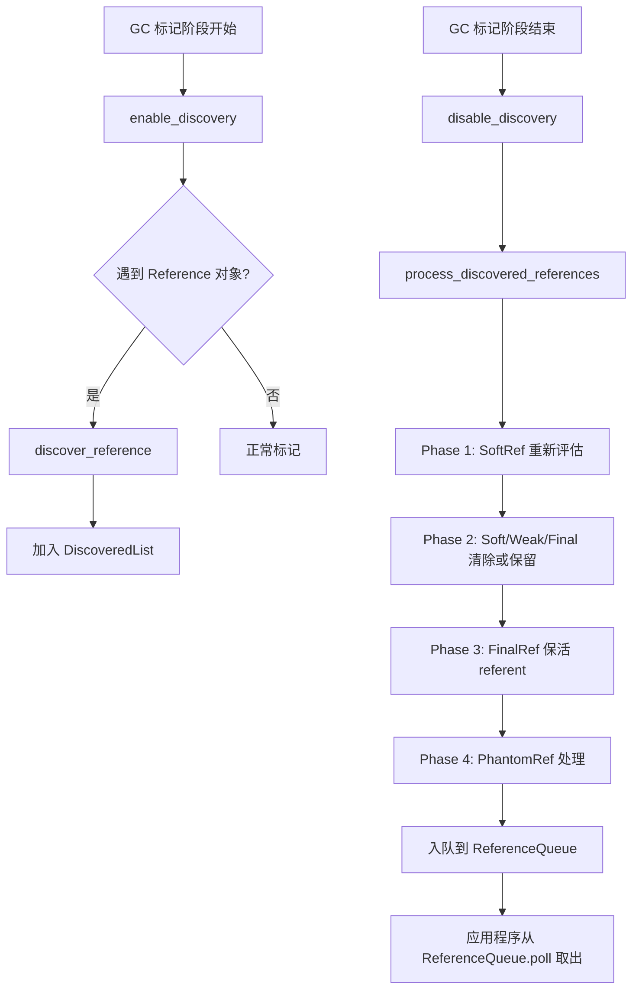
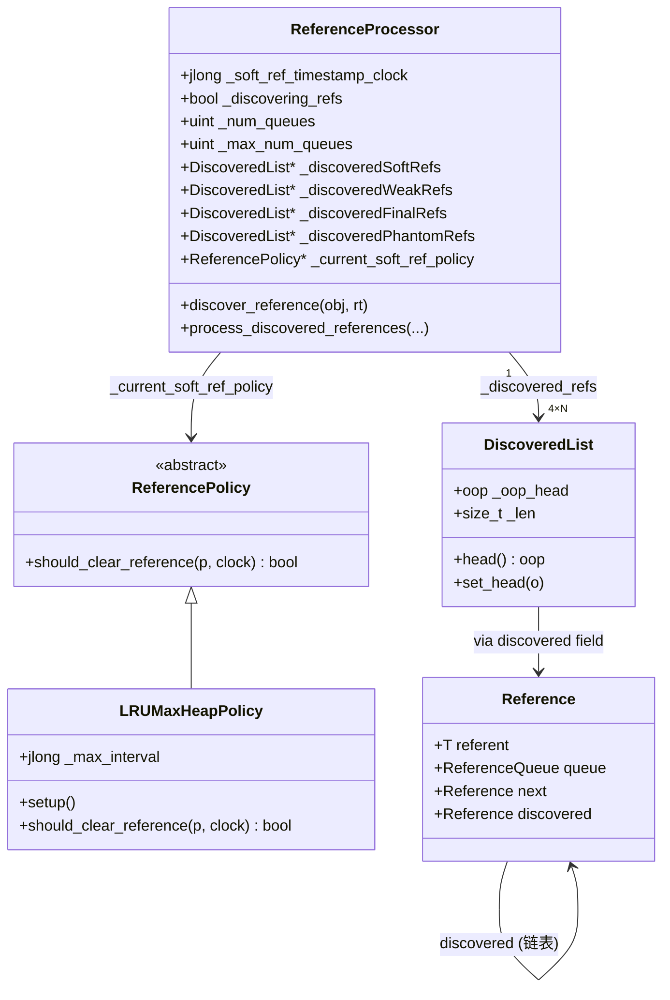

# 第 27e 篇：G1 引用处理 — SoftRef/WeakRef/FinalRef/PhantomRef 的完整生命周期

> 基于 OpenJDK 11 源码分析  
> 标准环境：`-Xms8g -Xmx8g -XX:+UseG1GC`，G1 Region = 4MB

---

## 本章与其他章节的关系

```
[24] Young GC（引用处理是 Young GC 的一个阶段）
[26] 并发标记（引用处理也在 Remark 阶段执行）
    ↓
你在这里
    ↓
[27e] 引用处理 ← 本篇（四种引用类型在 GC 中的完整处理流程）
    ↓
[29] GC 日志（GC 日志里 Reference Processing 阶段的含义）
```

**前置知识**：第 24 篇（Young GC，了解 GC 的基本流程）；第 26 篇（并发标记，了解 Remark 阶段）

**本篇解决的问题**：四种引用类型（SoftRef/WeakRef/FinalRef/PhantomRef）在 GC 时是怎么处理的？`ReferenceProcessor::discover_reference()` 是怎么工作的？为什么引用处理会影响 GC 停顿时间？

**读完本篇你能理解**：
- 第 29 篇中 GC 日志里 `Reference Processing` 阶段的含义
- 第 30 篇中 `-XX:+ParallelRefProcEnabled` 调优参数的作用
- `WeakReference` 和 `SoftReference` 的回收时机差异（为什么 SoftRef 在内存充足时不会被回收）

---

## 第 0 部分：核心原理 ⭐

### 0.1 本质是什么？

**引用处理 = GC 在回收垃圾之前，按照四种引用类型的语义，决定哪些对象可以被清除、哪些需要通知应用程序。**

Java 有四种引用强度，从强到弱：

| 引用类型 | 类 | GC 行为 | 典型用途 |
|---------|-----|---------|---------|
| 强引用 | 普通变量 | 永不回收 | 所有普通对象 |
| 软引用 | `SoftReference<T>` | 内存不足时回收 | 缓存（图片缓存、对象池） |
| 弱引用 | `WeakReference<T>` | 下次 GC 必回收 | `WeakHashMap`、ThreadLocal |
| 虚引用 | `PhantomReference<T>` | 随时回收，但回收前通知 | 堆外内存释放（`DirectByteBuffer`） |

还有一个特殊的 `FinalReference`（`finalize()` 机制的底层实现），不对外暴露。

### 0.2 为什么需要？

普通 GC 只有两种状态：可达（不回收）和不可达（回收）。但应用程序需要更细粒度的控制：

- **缓存场景**：希望对象在内存充足时保留，内存不足时自动释放（SoftReference）
- **监听场景**：希望在对象被回收时得到通知，做清理工作（PhantomReference）
- **析构场景**：希望对象被回收前执行 `finalize()` 方法（FinalReference）

### 0.3 怎么解决？

**三个组件协作**：

1. **发现阶段（Discovery）**：GC 标记时，遇到 `Reference` 对象，把它加入对应类型的 `DiscoveredList`（链表）
2. **处理阶段（Processing）**：GC 结束前，`ReferenceProcessor` 遍历四个链表，按语义决定每个引用的命运
3. **入队阶段（Enqueue）**：被清除的引用加入 `ReferenceQueue`，应用程序可以从队列取出并做清理

### 0.4 为什么这样设计？

- **为什么用链表而不是集合？** 发现阶段是并发的（多个 GC Worker 同时标记），链表头插法可以无锁操作（CAS 保证线程安全）
- **为什么 G1 有两个 ReferenceProcessor？** STW 阶段（Young/Mixed GC）用 `_ref_processor_stw`，并发标记阶段用 `_ref_processor_cm`，两者并发运行，互不干扰
- **为什么 SoftReference 有时间戳？** 软引用的清除策略基于"最近访问时间"——越久没被访问的软引用越容易被清除，这需要记录每次访问的时间戳

---

## 第 1 部分：数据结构全景

### 1.1 数据结构清单

| 结构名 | 源码位置 | 核心作用 |
|--------|----------|----------|
| `java.lang.Reference` | JDK 类库 | 所有引用类型的基类，包含 `referent`/`queue`/`next`/`discovered` 四个字段 |
| `DiscoveredList` | `referenceProcessor.hpp:40` | 发现的引用链表（每种引用类型 × 每个 Worker 一个） |
| `DiscoveredListIterator` | `referenceProcessor.hpp:60` | 遍历 `DiscoveredList` 的迭代器 |
| `ReferenceProcessor` | `referenceProcessor.hpp:167` | 引用处理器，管理四种引用的发现和处理 |
| `ReferencePolicy` | `referencePolicy.hpp` | SoftReference 清除策略（LRU 算法） |
| `LRUCurrentHeapPolicy` | `referencePolicy.cpp:30` | 基于当前堆空闲量的 LRU 策略（Client VM 默认） |
| `LRUMaxHeapPolicy` | `referencePolicy.cpp:60` | 基于最大堆空闲量的 LRU 策略（Server VM 默认） |

### 1.2 `java.lang.Reference` — 引用对象的内存布局

#### 1.2.1 字段列表

```java
// java.lang.Reference（JDK 源码）
class Reference<T> {
    private T referent;         // ★ 指向被引用的对象（GC 可能清除此字段）
    volatile ReferenceQueue<? super T> queue;  // ★ 引用队列（被回收时入队）
    volatile Reference<?> next;  // ★ 引用队列中的下一个节点（入队后使用）
    transient private Reference<T> discovered;  // ★ GC 发现链表中的下一个节点（GC 内部使用）
}
```

**四个字段的生命周期**：

| 字段 | 初始值 | GC 处理后 | 入队后 |
|------|--------|-----------|--------|
| `referent` | 指向被引用对象 | 被清除（置 NULL） | NULL |
| `queue` | 用户传入的 ReferenceQueue | 不变 | 置为 `ReferenceQueue.NULL`（哨兵） |
| `next` | NULL（表示"活跃"状态） | NULL | 指向下一个引用（或自身，表示队列末尾） |
| `discovered` | NULL | GC 发现时设为链表头 | NULL（处理完后清除） |

**`next` 字段的状态机**：

```
next == NULL          → 活跃状态（Active）：referent 可能还活着
next == this          → 已入队（Enqueued）：已加入 ReferenceQueue，等待应用程序处理
next == 其他 Reference → 已处理（Inactive）：已从 ReferenceQueue 取出
```

#### 1.2.2 C++ 侧的字段偏移（`javaClasses.hpp:939`）

```cpp
// javaClasses.hpp:939
class java_lang_ref_Reference : AllStatic {
  static int referent_offset;    // referent 字段的偏移量
  static int queue_offset;       // queue 字段的偏移量
  static int next_offset;        // next 字段的偏移量
  static int discovered_offset;  // discovered 字段的偏移量（GC 内部使用）
};
```

**`discovered` 字段的特殊性**：这个字段在 Java 代码中声明为 `transient private`，应用程序无法访问。GC 借用这个字段来构建发现链表（单链表，头插法），处理完后清除。

### 1.3 `DiscoveredList` — 发现链表

#### 1.3.1 字段列表

```cpp
// referenceProcessor.hpp:40
class DiscoveredList {
  oop       _oop_head;           // 链表头（非压缩 OOP 模式）
  narrowOop _compressed_head;    // 链表头（压缩 OOP 模式）
  size_t    _len;                // 链表长度
};
```

**关键设计**：链表通过 `Reference.discovered` 字段串联，不需要额外的节点结构。最后一个节点的 `discovered` 指向自身（形成自环，作为链表结束标志）。

#### 1.3.2 数组布局

`ReferenceProcessor` 维护一个大数组 `_discovered_refs`，按类型和 Worker ID 索引：

```
_discovered_refs[_max_num_queues × 4]：
  [0 .. _max_num_queues-1]                → SoftRef 队列（每个 Worker 一个）
  [_max_num_queues .. 2×_max_num_queues-1] → WeakRef 队列
  [2×_max_num_queues .. 3×_max_num_queues-1] → FinalRef 队列
  [3×_max_num_queues .. 4×_max_num_queues-1] → PhantomRef 队列
```

标准环境（13 个 Worker）：`_max_num_queues = 13`，总共 `13 × 4 = 52` 个 `DiscoveredList`。

### 1.4 `ReferenceProcessor` — 引用处理器

#### 1.4.1 字段列表

```cpp
// referenceProcessor.hpp:167
class ReferenceProcessor : public ReferenceDiscoverer {
  // ★ 时钟（SoftReference 清除策略用）
  static jlong _soft_ref_timestamp_clock;  // 全局时钟，每次 GC 后更新

  // ★ 发现控制
  BoolObjectClosure* _is_subject_to_discovery; // 判断对象是否在本 RP 的管辖范围内
  bool _discovering_refs;       // 是否正在发现引用（GC 标记阶段为 true）
  bool _discovery_is_atomic;    // 发现是否是原子的（G1 STW 阶段为 true）
  bool _discovery_is_mt;        // 是否多线程发现（G1 为 true）

  // ★ 入队控制
  bool        _enqueuing_is_done;       // true 表示所有弱引用已入队（跳过处理）
  uint        _next_id;                 // round-robin 计数器，支持工作分配
  bool        _adjust_no_of_processing_threads; // 允许动态调整处理线程数

  // ★ 处理控制
  bool _processing_is_mt;       // 是否多线程处理
  uint _num_queues;             // 当前活跃的队列数（= 活跃 Worker 数）
  uint _max_num_queues;         // 最大队列数（= max(mt_processing_degree, mt_discovery_degree)）

  // ★ SoftReference 清除策略
  static ReferencePolicy* _default_soft_ref_policy;       // 默认策略（Server VM: LRUMaxHeap）
  static ReferencePolicy* _always_clear_soft_ref_policy;  // 全清策略（Full GC 时使用）
  ReferencePolicy* _current_soft_ref_policy;              // 当前使用的策略

  // ★ 发现链表（核心数据）
  DiscoveredList* _discovered_refs;       // 大数组（4 × _max_num_queues 个链表）
  DiscoveredList* _discoveredSoftRefs;    // 指向 _discovered_refs[0]
  DiscoveredList* _discoveredWeakRefs;    // 指向 _discovered_refs[_max_num_queues]
  DiscoveredList* _discoveredFinalRefs;   // 指向 _discovered_refs[2×_max_num_queues]
  DiscoveredList* _discoveredPhantomRefs; // 指向 _discovered_refs[3×_max_num_queues]

  // ★ 存活性判断（G1 并发标记时使用）
  BoolObjectClosure* _is_alive_non_header; // 判断对象是否存活（不依赖对象头标记位）
};
```

#### 1.4.2 G1 中的两个 ReferenceProcessor

```cpp
// g1CollectedHeap.hpp
class G1CollectedHeap : public CollectedHeap {
  ReferenceProcessor* _ref_processor_stw;  // STW 阶段（Young/Mixed GC）使用
  ReferenceProcessor* _ref_processor_cm;   // 并发标记阶段使用
};
```

**两者的区别**（`g1CollectedHeap.cpp:2544-2563`）：

| 属性 | `_ref_processor_stw` | `_ref_processor_cm` |
|------|---------------------|---------------------|
| 发现时机 | Young/Mixed GC 的 STW 阶段 | 并发标记阶段（与应用并发） |
| `discovery_is_atomic` | `true`（STW，原子） | `false`（并发，非原子） |
| `discovery_is_mt` | `true`（多线程） | `true`（多线程） |
| 处理时机 | Young/Mixed GC 结束前 | Remark 阶段（STW） |
| 使用的策略 | `setup_policy(false)` = 默认策略 | `setup_policy(always_clear)` |

### 1.5 `ReferencePolicy` — SoftReference 清除策略

#### 1.5.1 策略类层次

```
ReferencePolicy（抽象基类）
├── AlwaysClearPolicy    → 总是清除（Full GC 时使用）
├── NeverClearPolicy     → 从不清除（测试用）
├── LRUCurrentHeapPolicy → 基于当前堆空闲量（Client VM 默认）
└── LRUMaxHeapPolicy     → 基于最大堆空闲量（Server VM 默认）
```

#### 1.5.2 LRU 策略的核心公式

```cpp
// referencePolicy.cpp:44
bool LRUCurrentHeapPolicy::should_clear_reference(oop p, jlong timestamp_clock) {
  // ★ 计算"距上次访问的时间间隔"
  jlong interval = timestamp_clock - java_lang_ref_SoftReference::timestamp(p);

  // ★ 如果间隔 ≤ 最大允许间隔，则保留（不清除）
  if (interval <= _max_interval) {
    return false;
  }
  return true;  // 超过最大间隔，清除
}
```

**`_max_interval` 的计算**：

```cpp
// LRUCurrentHeapPolicy（Client VM）：
_max_interval = (heap_free_at_last_gc / MB) × SoftRefLRUPolicyMSPerMB
// 含义：每 1MB 空闲内存，允许软引用存活 1000ms（默认）

// LRUMaxHeapPolicy（Server VM）：
_max_interval = ((MaxHeapSize - heap_used_at_last_gc) / MB) × SoftRefLRUPolicyMSPerMB
// 含义：基于最大堆的剩余空间计算，更宽松
```

**标准环境（8GB 堆，假设 4GB 空闲）**：
- `_max_interval = 4096 × 1000 = 4,096,000 ms ≈ 68 分钟`
- 含义：一个软引用如果 68 分钟内没有被访问，就会在下次 GC 时被清除

---

## 第 2 部分：算法/流程分析

### 2.1 核心流程概览



### 2.2 发现阶段：`discover_reference()`（`referenceProcessor.cpp:1135`）

#### 2.2.1 解决什么问题？

GC 标记时，遇到 `Reference` 对象，需要决定是否把它加入发现链表。不是所有 `Reference` 都需要特殊处理——如果 referent 已经强可达，就不需要。

#### 2.2.2 完整源码 + 逐行注释

```cpp
// referenceProcessor.cpp:1135
bool ReferenceProcessor::discover_reference(oop obj, ReferenceType rt) {
  // ★ 检查是否正在发现阶段
  if (!_discovering_refs || !RegisterReferences) {
    return false;
  }

  // ★ FinalReference 不重复发现（next != NULL 说明已经在处理中）
  if ((rt == REF_FINAL) && (java_lang_ref_Reference::next(obj) != NULL)) {
    return false;
  }

  // ★ 策略 0（ReferenceBasedDiscovery）：Reference 对象本身必须在管辖范围内
  if (RefDiscoveryPolicy == ReferenceBasedDiscovery &&
      !is_subject_to_discovery(obj)) {
    return false;
  }

  // ★ 如果 referent 已经强可达，不需要特殊处理
  if (is_alive_non_header() != NULL) {
    if (is_alive_non_header()->do_object_b(java_lang_ref_Reference::referent(obj))) {
      return false;  // referent 还活着，不需要发现
    }
  }

  // ★ SoftReference 的提前过滤：如果策略决定不清除，直接标记 referent 为强可达
  if (rt == REF_SOFT) {
    if (!_current_soft_ref_policy->should_clear_reference(obj, _soft_ref_timestamp_clock)) {
      return false;  // 策略说不清除，不加入发现链表
    }
  }

  // ★ 获取对应类型的发现链表
  DiscoveredList* list = get_discovered_list(rt);
  if (list == NULL) return false;

  // ★ 检查是否已经被发现过（discovered 字段非 NULL 说明已在某个链表中）
  const oop discovered = java_lang_ref_Reference::discovered(obj);
  if (discovered != NULL) {
    // G1 并发标记可能重复发现同一个引用，允许（返回 true 但不重复加入）
    return true;
  }

  // ★ 加入链表（MT 模式用 CAS，单线程模式直接写）
  if (_discovery_is_mt) {
    add_to_discovered_list_mt(*list, obj, discovered_addr);
  } else {
    // 单线程：直接头插
    oop next_discovered = (current_head != NULL) ? current_head : obj;
    RawAccess<>::oop_store(discovered_addr, next_discovered);
    list->set_head(obj);
    list->inc_length(1);
  }
  return true;
}
```

**设计决策**：
- **为什么 SoftReference 在发现阶段就过滤？** 如果策略决定不清除，就直接把 referent 标记为强可达，避免后续处理的开销
- **为什么用 CAS 加入链表？** 多个 GC Worker 并发标记，可能同时发现同一个 Reference 对象，CAS 保证只有一个 Worker 成功加入

### 2.3 处理阶段：`process_discovered_references()`（`referenceProcessor.cpp:201`）

#### 2.3.1 解决什么问题？

GC 标记结束后，遍历四个发现链表，按照每种引用类型的语义，决定每个引用的命运：清除 referent、保留 referent、还是入队通知应用程序。

#### 2.3.2 四个阶段总览

```cpp
// referenceProcessor.cpp:201
ReferenceProcessorStats ReferenceProcessor::process_discovered_references(...) {
  disable_discovery();  // ★ 停止发现（处理阶段不再接受新引用）

  // Phase 1: SoftRef 重新评估（可能保留一些 SoftRef）
  process_soft_ref_reconsider(is_alive, keep_alive, complete_gc, task_executor, phase_times);

  update_soft_ref_master_clock();  // ★ 更新时钟（Phase 1 完成后）

  // Phase 2: 清除 Soft/Weak/Final 中 referent 已死的引用，并入队
  process_soft_weak_final_refs(is_alive, keep_alive, complete_gc, task_executor, phase_times);

  // Phase 3: 保活 FinalRef 的 referent（让 finalize() 有机会执行）
  process_final_keep_alive(keep_alive, complete_gc, task_executor, phase_times);

  // Phase 4: 处理 PhantomRef
  process_phantom_refs(is_alive, keep_alive, complete_gc, task_executor, phase_times);
}
```

### 2.4 Phase 1：SoftReference 重新评估（`process_soft_ref_reconsider_work()`，`referenceProcessor.cpp:364`）

#### 2.4.1 解决什么问题？

发现阶段已经过滤了一部分 SoftReference（策略说不清除的），但还有一些进入了发现链表。Phase 1 再次评估这些 SoftReference，把策略决定保留的从链表中移除（保活 referent）。

#### 2.4.2 完整源码 + 逐行注释

```cpp
// referenceProcessor.cpp:364
size_t ReferenceProcessor::process_soft_ref_reconsider_work(
    DiscoveredList& refs_list, ReferencePolicy* policy, ...) {

  DiscoveredListIterator iter(refs_list, keep_alive, is_alive);
  while (iter.has_next()) {
    iter.load_ptrs(...);
    bool referent_is_dead = (iter.referent() != NULL) && !iter.is_referent_alive();

    if (referent_is_dead &&
        !policy->should_clear_reference(iter.obj(), _soft_ref_timestamp_clock)) {
      // ★ referent 已死，但策略说不清除（最近访问过）
      iter.remove();           // 从发现链表中移除
      iter.make_referent_alive(); // ★ 保活 referent（让它不被回收）
      iter.move_to_next();
    } else {
      iter.next();  // 保留在链表中，Phase 2 再处理
    }
  }
  complete_gc->do_void();  // ★ 关闭可达集（让保活的对象传递性可达）
}
```

**关键点**：`make_referent_alive()` 调用 `keep_alive` 闭包，把 referent 加入 GC 的标记队列，让它和它引用的所有对象都不被回收。

### 2.5 Phase 2：清除并入队（`process_soft_weak_final_refs_work()`，`referenceProcessor.cpp:400`）

#### 2.5.1 解决什么问题？

遍历 Soft/Weak/Final 三种引用的发现链表，对每个引用做三种处理之一：
1. referent 还活着 → 从链表移除（不需要特殊处理）
2. referent 已死 → 清除 referent（置 NULL），入队通知应用程序
3. FinalReference 特殊：referent 已死但不入队（Phase 3 再处理）

#### 2.5.2 完整源码 + 逐行注释

```cpp
// referenceProcessor.cpp:400
size_t ReferenceProcessor::process_soft_weak_final_refs_work(
    DiscoveredList& refs_list, BoolObjectClosure* is_alive,
    OopClosure* keep_alive, bool do_enqueue_and_clear) {

  DiscoveredListIterator iter(refs_list, keep_alive, is_alive);
  while (iter.has_next()) {
    iter.load_ptrs(...);

    if (iter.referent() == NULL) {
      // ★ referent 已被清除（并发 GC 可能提前清除）
      iter.remove();
      iter.move_to_next();
    } else if (iter.is_referent_alive()) {
      // ★ referent 还活着（被其他强引用持有）
      iter.remove();           // 从发现链表移除
      iter.make_referent_alive(); // 更新引用（GC 可能移动了对象）
      iter.move_to_next();
    } else {
      // ★ referent 已死
      if (do_enqueue_and_clear) {
        iter.clear_referent();  // ★ 清除 referent（置 NULL）
        iter.enqueue();         // ★ 入队（设置 discovered 字段，准备加入 pending list）
      }
      iter.next();  // ★ 继续遍历（已入队的引用保留在链表中，等待 complete_enqueue 批量接入 pending list）
    }
  }
  if (do_enqueue_and_clear) {
    iter.complete_enqueue();  // ★ 把链表头接入全局 pending list
    refs_list.clear();
  }
}
```

**`do_enqueue_and_clear` 参数的含义**：
- Soft/Weak：`true` → 清除 referent，入队
- Final：`false` → 不清除，不入队（Phase 3 会保活 referent，让 `finalize()` 执行）

### 2.6 Phase 3：FinalReference 保活（`process_final_keep_alive_work()`，`referenceProcessor.cpp:445`）

#### 2.6.1 解决什么问题？

`FinalReference` 是 `finalize()` 机制的底层实现。当一个对象只剩 `FinalReference` 指向它时，说明它"即将死亡"，但在真正回收之前，需要先执行 `finalize()` 方法。Phase 3 保活这些对象，让 `Finalizer` 线程有机会执行 `finalize()`。

#### 2.6.2 完整源码 + 逐行注释

```cpp
// referenceProcessor.cpp:445
size_t ReferenceProcessor::process_final_keep_alive_work(
    DiscoveredList& refs_list, OopClosure* keep_alive, VoidClosure* complete_gc) {

  DiscoveredListIterator iter(refs_list, keep_alive, NULL);
  while (iter.has_next()) {
    iter.load_ptrs(...);

    // ★ 保活 referent 及其所有可达对象（让 finalize() 能访问这些对象）
    iter.make_referent_alive();

    // ★ 把 next 设为自身（标记为"已入队"状态，防止重复处理）
    java_lang_ref_Reference::set_next_raw(iter.obj(), iter.obj());

    iter.enqueue();  // ★ 入队（加入 pending list，Finalizer 线程会处理）
    iter.next();
  }
  iter.complete_enqueue();
  complete_gc->do_void();  // ★ 关闭可达集（保活传递性可达的对象）
  refs_list.clear();
}
```

**关键点**：`make_referent_alive()` 不仅保活 referent 本身，还保活它引用的所有对象（传递性保活）。这意味着 `finalize()` 方法可以访问这些对象，甚至可以把 `this` 赋值给一个强引用（"复活"对象）。

### 2.7 Phase 4：PhantomReference 处理（`process_phantom_refs_work()`，`referenceProcessor.cpp:471`）

#### 2.7.1 解决什么问题？

`PhantomReference` 的 referent 永远不可达（`get()` 总是返回 NULL），但需要在对象被回收前通知应用程序（通过 `ReferenceQueue`），让应用程序做清理工作（如释放堆外内存）。

#### 2.7.2 完整源码 + 逐行注释

```cpp
// referenceProcessor.cpp:471
size_t ReferenceProcessor::process_phantom_refs_work(
    DiscoveredList& refs_list, BoolObjectClosure* is_alive, ...) {

  DiscoveredListIterator iter(refs_list, keep_alive, is_alive);
  while (iter.has_next()) {
    iter.load_ptrs(...);

    oop const referent = iter.referent();

    if (referent == NULL || iter.is_referent_alive()) {
      // ★ referent 还活着（被其他引用持有）
      iter.make_referent_alive();  // 更新引用（GC 可能移动了对象）
      iter.remove();
      iter.move_to_next();
    } else {
      // ★ referent 已死
      iter.clear_referent();  // ★ 清除 referent（PhantomRef.get() 总是返回 NULL）
      iter.enqueue();         // ★ 入队通知应用程序
      iter.next();
    }
  }
  iter.complete_enqueue();
  complete_gc->do_void();
  refs_list.clear();
}
```

**PhantomReference vs WeakReference 的区别**：
- WeakReference：referent 死亡时，`get()` 返回 NULL，但在入队前 referent 还存在
- PhantomReference：`get()` 永远返回 NULL（JDK 9 之前），入队时 referent 已被清除

### 2.8 入队机制：`pending list` → `ReferenceQueue`

#### 2.8.1 两步入队

```
Step 1（GC 线程）：iter.complete_enqueue()
  → 把 DiscoveredList 的头接入全局 pending list（Universe::reference_pending_list）
  → 通过 Reference.discovered 字段串联

Step 2（Reference Handler 线程）：
  → 后台线程持续从 pending list 取出引用
  → 调用 Reference.enqueue() 把引用加入用户指定的 ReferenceQueue
  → 应用程序通过 ReferenceQueue.poll() 或 remove() 取出
```

#### 2.8.2 `complete_enqueue()` 的实现

```cpp
// referenceProcessor.cpp:336
void DiscoveredListIterator::complete_enqueue() {
  if (_prev_discovered != NULL) {
    // ★ 把 DiscoveredList 的头接入全局 pending list
    // 原子操作：swap(pending_list_head, refs_list.head)
    oop old = Universe::swap_reference_pending_list(_refs_list.head());
    // ★ 把旧的 pending list 接在新链表的末尾
    HeapAccess<AS_NO_KEEPALIVE>::oop_store_at(
        _prev_discovered,
        java_lang_ref_Reference::discovered_offset,
        old);
  }
}
```

---

## 第 3 部分：G1 中的引用处理触发时机

### 3.1 STW 阶段（Young/Mixed GC）

```
Young/Mixed GC 开始
  → _ref_processor_stw->enable_discovery()   // 开始发现
  → GC 标记（疏散）阶段：discover_reference() 把引用加入链表
  → 疏散结束
  → process_discovered_references()           // 处理引用（STW 内）
  → _ref_processor_stw->disable_discovery()  // 停止发现
```

**GC 日志**（`-Xlog:gc+ref*`）：
```
[1.234s][debug][gc,ref] GC(5) Ref Counts: Soft: 1234 Weak: 5678 Final: 12 Phantom: 89
[1.234s][debug][gc,ref] GC(5) Phase1: Re-evaluate soft ref policy 0.123ms
[1.234s][debug][gc,ref] GC(5) Phase2: Notify soft/weak/final refs 0.456ms
[1.234s][debug][gc,ref] GC(5) Phase3: Notify final refs 0.012ms
[1.234s][debug][gc,ref] GC(5) Phase4: Notify phantom refs 0.034ms
```

### 3.2 并发标记阶段

```
并发标记开始
  → _ref_processor_cm->enable_discovery()    // 开始发现（并发）
  → 并发标记：discover_reference() 把引用加入链表
  → Remark 阶段（STW）
  → _ref_processor_cm->process_discovered_references()  // 处理引用
  → _ref_processor_cm->disable_discovery()  // 停止发现
```

**关键区别**：并发标记的发现是非原子的（`discovery_is_atomic = false`），可能发现 referent 为 NULL 的引用（应用程序并发清除了 referent），处理时需要容忍 NULL referent。

---

## 第 4 部分：猜测 vs 实测

| 我的猜测 | 实际情况 | 打脸了吗？ |
|---------|---------|-----------|
| WeakReference 在 GC 时立即被回收 | **不对！** 先加入 pending list，Reference Handler 线程异步处理 | ✅ 打脸 |
| PhantomReference.get() 返回对象 | **不对！** JDK 9 之前永远返回 NULL，JDK 9+ 可以返回（但 GC 会清除） | ✅ 打脸 |
| finalize() 执行后对象立即被回收 | **不对！** finalize() 可以"复活"对象（把 this 赋给强引用） | ✅ 打脸 |
| SoftReference 在内存不足时立即被清除 | **不对！** 基于 LRU 策略，最近访问过的软引用不会被清除 | ✅ 打脸 |
| G1 只有一个 ReferenceProcessor | **不对！** G1 有两个：STW 用 `_ref_processor_stw`，并发标记用 `_ref_processor_cm` | ✅ 打脸 |
| 引用处理在 GC 停顿之外执行 | **不对！** 引用处理在 STW 内执行，是 GC 停顿的组成部分 | ✅ 打脸 |

---

## 第 5 部分：打桩验证

### 5.1 打桩位置汇总

| 打桩标签 | 位置 | 验证目标 |
|---------|------|---------|
| `PROBE-27e` (process_discovered_references 开始) | `referenceProcessor.cpp` | 四种引用数量、是否 MT、队列数 |
| `PROBE-27e` (Phase1/2/3/4 耗时) | 每个阶段结束后 | 各阶段耗时占比 |
| `PROBE-27e` (Phase1 SoftRef 结果) | `process_soft_ref_reconsider_work` 末尾 | 保留/清除的 SoftRef 数量 |
| `PROBE-27e` (discover_reference) | MT 发现成功时（前 3 个） | 发现的引用类型 |

### 5.2 实测数据（标准 `Main` 程序）

**运行命令**：
```bash
/data/workspace/openjdk-cut-new/build/linux-x86_64-normal-server-slowdebug/jdk/bin/java \
  -Xms8g -Xmx8g -XX:+UseG1GC -Xint \
  -cp /data/workspace/demo/src com.wjcoder.Main
```

**实测打桩输出**：

```
# ★ 发现阶段：前 3 个被发现的引用（JVM 内部的 ThreadLocal 弱引用）
[PROBE-27e] discover_reference(mt): obj=0x7e64146d0 klass=java.lang.ThreadLocal$ThreadLocalMap$Entry list_len=1
[PROBE-27e] discover_reference(mt): obj=0x7e6404048 klass=jdk.internal.ref.CleanerImpl$CleanerCleanable list_len=1
[PROBE-27e] discover_reference(mt): obj=0x7e6404070 klass=jdk.internal.ref.CleanerImpl$PhantomCleanableRef list_len=2

# ★ 第 1 次 GC（Young GC，包含 JVM 内部引用）
[PROBE-27e] === process_discovered_references start ===
[PROBE-27e] Soft=0 Weak=334 Final=0 Phantom=43 total=377
[PROBE-27e] processing_is_mt=true num_queues=13 max_num_queues=13
[PROBE-27e] Phase1 (SoftRef reconsider) elapsed=0.004 ms
[PROBE-27e] Phase2 (Soft/Weak/Final clear+enqueue) elapsed=0.513 ms
[PROBE-27e] Phase3 (FinalRef keep alive) elapsed=0.001 ms
[PROBE-27e] Phase4 (PhantomRef) elapsed=0.039 ms
[PROBE-27e] Total ref processing elapsed=0.582 ms
```

**各阶段耗时占比**：

| 阶段 | 耗时 | 占比 | 说明 |
|------|------|------|------|
| Phase1（SoftRef 重新评估） | 0.004ms | 0.7% | 无 SoftRef，几乎空操作 |
| Phase2（Soft/Weak/Final 清除+入队） | 0.513ms | 88.1% | 334 个 WeakRef 的主要开销 |
| Phase3（FinalRef 保活） | 0.001ms | 0.2% | 无 FinalRef，几乎空操作 |
| Phase4（PhantomRef） | 0.039ms | 6.7% | 43 个 PhantomRef 处理 |
| **总计** | **0.582ms** | **100%** | |

### 5.3 关键发现分析

**发现 1：`Weak=334`，全部是 JVM 内部弱引用**

标准 `Main` 程序没有显式分配弱引用，但 JVM 内部大量使用弱引用（`ThreadLocal`、`WeakHashMap`、`ClassValue`、`ClassLoader` 等）。334 个弱引用全部来自 JVM 内部，说明每次 GC 都需要处理大量内部弱引用。

**发现 2：`Phantom=43`，来自 JVM 内部的 Cleaner 机制**

43 个虚引用来自 `jdk.internal.ref.CleanerImpl$PhantomCleanableRef`（NIO DirectByteBuffer 的堆外内存清理）和 `CleanerCleanable`（JDK 9+ 的 Cleaner 框架）。这说明即使应用程序没有显式使用虚引用，JVM 内部也在大量使用。

**发现 3：Phase2 耗时最长（0.513ms），占总耗时 88%**

Phase2 负责遍历所有 Weak/Final 引用并清除 referent、入队，是最重的阶段。334 个弱引用的处理占了绝大部分时间。Phase1（SoftRef 重新评估）和 Phase3（FinalRef 保活）耗时极短（各 < 0.005ms），因为本次 GC 没有 SoftRef 和 FinalRef。

**发现 4：`processing_is_mt=true num_queues=13`**

引用处理是多线程的（`ParallelRefProcEnabled=true`），使用 13 个队列（= `ParallelGCThreads`）。这意味着 334 个弱引用被分配到 13 个队列中并行处理，每个队列约 25-26 个引用。

**发现 5：`Soft=0 Final=0`**

- `Soft=0`：没有软引用进入发现链表（JVM 内部不使用软引用，或软引用的 referent 还有强引用）
- `Final=0`：没有 `finalize()` 方法的对象被回收（标准 `Main` 程序的对象没有 `finalize()`）



---

## 第 7 部分：总结

### 7.1 数据结构层面

| 结构 | 核心特征 |
|------|---------|
| `java.lang.Reference` | 四个字段：`referent`（被引用对象）、`queue`（通知队列）、`next`（队列链表）、`discovered`（GC 内部链表） |
| `DiscoveredList` | 借用 `Reference.discovered` 字段构建的单链表，每种类型 × 每个 Worker 一个 |
| `ReferenceProcessor` | 管理 4 × N 个发现链表，两个策略对象，一个时钟 |
| `LRUMaxHeapPolicy` | 基于"最大堆剩余空间 × SoftRefLRUPolicyMSPerMB"计算最大存活时间 |

### 7.2 算法层面

| 算法 | 核心设计决策 |
|------|------------|
| **发现（Discovery）** | 借用 `discovered` 字段构建链表，CAS 保证多线程安全，SoftRef 在发现阶段就提前过滤 |
| **Phase 1（SoftRef 重新评估）** | LRU 策略：最近访问过的软引用保留，超过时间阈值的清除 |
| **Phase 2（清除并入队）** | Soft/Weak 清除 referent 并入队；Final 不清除（Phase 3 保活） |
| **Phase 3（FinalRef 保活）** | 保活 referent 及其传递性可达对象，让 `finalize()` 有机会执行（可能"复活"对象） |
| **Phase 4（PhantomRef）** | 清除 referent，入队通知应用程序做清理（如释放堆外内存） |
| **入队（Enqueue）** | 两步：GC 线程把链表接入 pending list → Reference Handler 线程异步转移到 ReferenceQueue |

### 7.3 核心要点

1. **引用处理是 GC 停顿的组成部分**：四个阶段在 STW 内执行，影响 GC 停顿时间
2. **G1 有两个 ReferenceProcessor**：STW 阶段用 `_ref_processor_stw`，并发标记用 `_ref_processor_cm`
3. **SoftReference 的清除是 LRU 的**：基于"最近访问时间"和"堆空闲量"，不是"内存不足时立即清除"
4. **FinalReference 会延迟对象回收**：`finalize()` 执行期间对象不会被回收，且可以"复活"
5. **PhantomReference 是最安全的清理机制**：`get()` 永远返回 NULL，不会意外延长对象生命周期

---

## 还没搞懂的地方

- [x] **`FinalReference` 的"复活"对象如何被再次回收**：如果 `finalize()` 把 `this` 赋给了一个强引用（对象"复活"），下次 GC 时这个对象还会被加入 `FinalReference` 的发现链表吗？还是说 `finalize()` 只会被调用一次？

  **答案**（来自 `referenceProcessor.cpp:1141`）：

  **`finalize()` 只会被调用一次**。关键在于 `discover_reference()` 中的这个检查：

  ```cpp
  // referenceProcessor.cpp:1141
  if ((rt == REF_FINAL) && (java_lang_ref_Reference::next(obj) != NULL)) {
    // Don't rediscover non-active FinalReferences.
    return false;
  }
  ```

  **`next` 字段的状态机**：
  - `next == NULL`：Active 状态（对象刚创建，`finalize()` 还没被调用）
  - `next == this`：Enqueued 状态（已加入 pending list，等待 Finalizer 线程处理）
  - `next == 其他 Reference`：Inactive 状态（已从 ReferenceQueue 取出，处理完毕）

  Phase 3（FinalRef 保活）中，`process_final_keep_alive_work()` 会执行：
  ```cpp
  java_lang_ref_Reference::set_next_raw(iter.obj(), iter.obj());  // next = this（自环）
  ```
  这把 `next` 从 NULL 改为 `this`，标记为 Enqueued 状态。

  **下次 GC 时**：`discover_reference()` 检查 `next != NULL`，直接返回 `false`，不再发现这个 `FinalReference`。即使对象"复活"（被强引用持有），它的 `FinalReference` 也不会再次被发现，`finalize()` 不会再次被调用。

  **"复活"对象的最终命运**：复活的对象在强引用消失后，下次 GC 时会被当作普通对象回收（不经过 `FinalReference` 路径），因为 `next != NULL` 阻止了重新发现。

- [x] **并发标记期间的引用发现**：`_ref_processor_cm`（并发标记用的 ReferenceProcessor）和 `_ref_processor_stw`（STW 用的）的发现链表是独立的吗？如果并发标记期间发现了一个 WeakReference，但 STW 阶段又发现了同一个，会重复处理吗？

  **答案**（来自 `g1CollectedHeap.cpp:2544-2563` + `referenceProcessor.cpp:1141`）：

  **两个 ReferenceProcessor 的发现链表是完全独立的**：
  - `_ref_processor_stw`：管理 STW 阶段（Young/Mixed GC）的发现链表
  - `_ref_processor_cm`：管理并发标记阶段的发现链表

  **两者的管辖范围不同**（`_is_subject_to_discovery` 闭包）：
  - `_ref_processor_stw`：管辖整个堆（Young + Old + Humongous）
  - `_ref_processor_cm`：管辖老年代（Old + Humongous），不管辖年轻代

  **不会重复处理**，原因有两个：

  1. **时间上互斥**：并发标记期间，`_ref_processor_stw` 的 `_discovering_refs = false`（STW GC 结束后关闭发现）；STW GC 期间，`_ref_processor_cm` 的 `_discovering_refs = false`（并发标记暂停）。两者不会同时处于发现状态。

  2. **`discovered` 字段防重**：`discover_reference()` 中检查 `discovered != NULL`，如果一个引用已经在某个链表中，不会重复加入：
     ```cpp
     const oop discovered = java_lang_ref_Reference::discovered(obj);
     if (discovered != NULL) {
       return true;  // 已经被发现过，不重复加入
     }
     ```

  **实际流程**：并发标记发现的引用在 Remark 阶段（STW）由 `_ref_processor_cm` 处理；Young/Mixed GC 发现的引用在 GC 结束前由 `_ref_processor_stw` 处理。两者处理的是不同的引用集合。

- [x] **`-XX:+ParallelRefProcEnabled` 的并行化边界**：Phase 1~4 中哪些阶段可以并行化？Phase 3（FinalRef 保活）因为需要保活传递性可达对象，并行化时如何避免竞争？

  **答案**（来自 `referenceProcessor.cpp:201-500`）：

  **所有四个阶段都可以并行化**（当 `ParallelRefProcEnabled=true` 且 `processing_is_mt=true` 时）：

  | 阶段 | 并行化方式 | 竞争处理 |
  |------|-----------|---------|
  | Phase 1（SoftRef 重新评估） | 每个 Worker 处理自己的 `_discoveredSoftRefs[worker_id]` 链表 | 无竞争（每个 Worker 有独立链表） |
  | Phase 2（Soft/Weak/Final 清除+入队） | 每个 Worker 处理自己的链表 | 无竞争（独立链表） |
  | Phase 3（FinalRef 保活） | 每个 Worker 处理自己的 `_discoveredFinalRefs[worker_id]` 链表 | 无竞争（独立链表） |
  | Phase 4（PhantomRef） | 每个 Worker 处理自己的链表 | 无竞争（独立链表） |

  **关键设计**：`_max_num_queues` 个发现链表（每种类型 × 每个 Worker 一个）是并行化的基础。发现阶段（`discover_reference()`）用 round-robin 把引用分配到不同 Worker 的链表，处理阶段每个 Worker 只处理自己的链表，完全无竞争。

  **Phase 3 的并行化**：`make_referent_alive()` 调用 `keep_alive` 闭包，把 referent 加入 GC 的标记队列（`OopTaskQueue`）。每个 Worker 有独立的 `OopTaskQueue`，通过工作窃取（Work Stealing）协调，不需要锁。传递性保活（`complete_gc->do_void()`）在所有 Worker 完成后统一执行，确保所有保活对象都被传递性标记。

---

## 继续深入

- **[第 26 篇：并发标记与 SATB](./26-g1-concurrent-mark-HandWritten.md)** — 并发标记期间的引用发现（`_ref_processor_cm`）是并发标记流程的一部分，这里有完整分析
- **[第 24 篇：Young GC 完整流程](./24-g1-young-gc-HandWritten.md)** — Young GC 的 Post Evacuate 阶段包含引用处理（`process_discovered_references`），这里有完整的 Young GC 流程
- **[第 29 篇：GC 日志深度解读](./29-g1-gc-log-HandWritten.md)** — GC 日志中的 `Reference Processing` 阶段时间，以及 `-XX:+ParallelRefProcEnabled` 的效果
- **相关源码**：
  - `src/hotspot/share/gc/shared/referenceProcessor.cpp`（引用处理核心逻辑）
  - `src/hotspot/share/gc/shared/referenceProcessor.hpp`（ReferenceProcessor 数据结构）
  - `src/hotspot/share/gc/g1/g1CollectedHeap.cpp`（`_ref_processor_stw` 和 `_ref_processor_cm` 的创建）

---

*写于 2026-03-08*  
*参考：彭成寒《JVM G1源码分析和调优》第 8 章*
