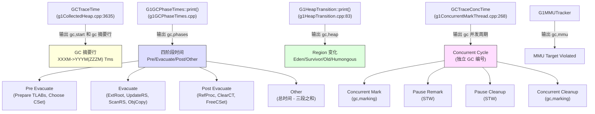

# G1 GC 日志深度解读

> 基于 OpenJDK 11 源码分析  
> 标准环境：`-Xms8g -Xmx8g -XX:+UseG1GC`，Region = 4MB  
> 实测日志：本文所有日志均来自真实运行采集（2026-03-09）

---

## 本章与其他章节的关系

```
[24] Young GC → [26] 并发标记 → [27] Mixed GC → [27b] Full GC
                                                        ↓
你在这里 ← [29] GC 日志深度解读（把前面所有知识落地到"看日志"这个实际技能）
                                                        ↓
                                                   [30] 调优实战
```

**前置知识**：第 24 篇（Young GC）、第 26 篇（并发标记）、第 27 篇（Mixed GC）、第 27b 篇（Full GC）——读完这四篇再来读本篇，每一行日志都能对应到源码

**本篇解决的问题**：GC 日志里每一行是什么意思？JDK 8 和 JDK 9+ 的日志格式有什么区别？如何从日志里识别 `to-space exhausted`、`GCLocker`、`Humongous allocation` 等异常？

**读完本篇你能理解**：
- 第 30 篇中所有调优场景的诊断步骤（调优的第一步永远是看日志）
- 如何用 GC 日志定位 Young GC 停顿过长的根因（`Ext Root Scanning` vs `Object Copy` vs `Update RS`）
- GCLocker 日志的完整诊断路径（从日志到源码 `gcLocker.cpp:130-155`）

---

## 第 0 部分：核心原理 ⭐

### 0.1 本质是什么？

GC 日志是 JVM 内部 GC 事件的**结构化文本快照**。每一行日志都对应源码中一个 `log_info(gc, ...)` 调用，每一个数字都有明确的计算来源。读懂 GC 日志 = 读懂 GC 的执行过程。

### 0.2 为什么需要深度解读？

GC 日志的每个字段背后都有一个设计决策：
- `432M->181M(8192M)` 三个数字分别是什么？为什么不是两个？
- `Pre Evacuate / Evacuate / Post Evacuate` 三段时间各包含什么？
- `Eden regions: 102->0(89)` 括号里的 89 是什么？为什么不是 102？
- `Concurrent Cycle` 和 `Pause Young (Concurrent Start)` 的 GC 编号为什么不同？

不理解这些，就无法从日志中诊断性能问题。

### 0.3 JDK 9+ 统一日志框架

JDK 9 引入了统一日志框架（Unified Logging），所有 GC 日志通过 `-Xlog` 参数控制：

```
-Xlog:<what>:<output>:<decorators>
```

| 参数 | 含义 |
|------|------|
| `gc` | 只输出 GC 摘要行（最简洁） |
| `gc*` | 输出所有 GC 相关标签（最完整） |
| `gc+phases=debug` | 输出 GC 各子阶段详细时间 |
| `gc+heap=debug` | 输出堆内存详细变化 |

**JDK 8 vs JDK 9+ 对比**：

| 特性 | JDK 8 | JDK 9+ |
|------|-------|--------|
| 开启方式 | `-XX:+PrintGCDetails -XX:+PrintGCDateStamps` | `-Xlog:gc*` |
| 日志格式 | 固定格式，不可定制 | 可定制标签、级别、输出目标 |
| 时间戳 | `-XX:+PrintGCDateStamps` 单独开启 | `-Xlog:gc*::time,uptime` 内置 |
| 输出到文件 | `-Xloggc:/path/gc.log` | `-Xlog:gc*:file=/path/gc.log` |
| 日志轮转 | `-XX:+UseGCLogFileRotation` | `-Xlog:gc*:file=/path/gc.log:filecount=5,filesize=20m` |

**推荐生产配置**：
```bash
-Xlog:gc*:file=/var/log/app/gc.log:time,uptime,level,tags:filecount=5,filesize=20m
```

### 0.4 为什么这样设计？

**为什么 JDK 9 要重新设计日志框架？**
JDK 8 的 GC 日志是各个 GC 模块各自实现的，格式不统一，无法统一控制输出级别和目标。JDK 9 的统一日志框架（JEP 158）把所有日志统一到 `-Xlog` 体系，可以精确控制哪些标签、哪个级别、输出到哪里，大幅提升了可观测性。

**为什么日志里要有 GC 编号（`GC(N)`）？**
GC 编号让你能把同一次 GC 的所有日志行关联起来。一次 GC 可能产生几十行日志，没有编号就无法区分哪些行属于同一次 GC，尤其是并发 GC 和 STW GC 的日志可能交错出现。

**为什么 `432M->181M(8192M)` 是三个数字而不是两个？**
三个数字分别是：GC 前堆使用量 → GC 后堆使用量（堆总容量）。堆总容量是第三个数字，因为 G1 的堆容量会动态变化（在 `-Xms` 和 `-Xmx` 之间），只有两个数字无法判断当前堆的利用率。

---

## 第 1 部分：日志格式解析

### 1.1 日志行结构

每行 GC 日志的格式：

```
[时间戳][运行时间][级别][标签] GC(编号) 内容
```

**真实示例**：
```
[2026-03-09T08:15:01.382+0800][3.297s][info][gc,start     ] GC(0) Pause Young (Normal) (G1 Evacuation Pause)
[2026-03-09T08:15:02.268+0800][4.182s][info][gc           ] GC(0) Pause Young (Normal) (G1 Evacuation Pause) 432M->181M(8192M) 885.717ms
```

| 字段 | 示例值 | 含义 |
|------|--------|------|
| 时间戳 | `2026-03-09T08:15:01.382+0800` | 绝对时间（ISO 8601） |
| 运行时间 | `3.297s` | JVM 启动后的相对时间 |
| 级别 | `info` | 日志级别（info/debug/trace） |
| 标签 | `gc,start` | 日志来源标签 |
| GC 编号 | `GC(0)` | 全局 GC 事件序号（单调递增） |

**标签含义**：

| 标签 | 对应源码 | 含义 |
|------|---------|------|
| `gc` | `log_info(gc)` | GC 摘要行（最重要） |
| `gc,start` | `GCTraceTime` 开始 | GC 开始事件 |
| `gc,phases` | `log_info(gc, phases)` | GC 各阶段时间 |
| `gc,heap` | `log_info(gc, heap)` | 堆内存变化（Region 级别） |
| `gc,metaspace` | `MetaspaceUtils::print_metaspace_change` | Metaspace 变化 |
| `gc,task` | `log_info(gc, task)` | GC 工作线程信息 |
| `gc,cpu` | GCTraceCPUTime | CPU 时间统计 |
| `gc,mmu` | `G1MMUTrackerQueue::add_pause()` | MMU（最小变异单元）违规 |
| `gc,marking` | `log_info(gc, marking)` | 并发标记各子阶段 |
| `gc,stringtable` | `g1CollectedHeap.cpp:4090` | Remark 阶段 StringTable/SymbolTable 清理统计 |

---

## 第 2 部分：Young GC 日志逐行解读

### 2.1 完整 Young GC 日志（真实采集）

```
[2026-03-09T08:15:01.382+0800][3.297s][info][gc,start     ] GC(0) Pause Young (Normal) (G1 Evacuation Pause)
[2026-03-09T08:15:01.384+0800][3.298s][info][gc,task      ] GC(0) Using 13 workers of 13 for evacuation
[2026-03-09T08:15:02.267+0800][4.181s][info][gc,mmu       ] GC(0) MMU target violated: 201.0ms (200.0ms/201.0ms)
[2026-03-09T08:15:02.267+0800][4.181s][info][gc,phases    ] GC(0)   Pre Evacuate Collection Set: 0.2ms
[2026-03-09T08:15:02.267+0800][4.181s][info][gc,phases    ] GC(0)   Evacuate Collection Set: 747.1ms
[2026-03-09T08:15:02.267+0800][4.181s][info][gc,phases    ] GC(0)   Post Evacuate Collection Set: 134.6ms
[2026-03-09T08:15:02.267+0800][4.181s][info][gc,phases    ] GC(0)   Other: 5.5ms
[2026-03-09T08:15:02.267+0800][4.181s][info][gc,heap      ] GC(0) Eden regions: 102->0(89)
[2026-03-09T08:15:02.267+0800][4.181s][info][gc,heap      ] GC(0) Survivor regions: 0->13(13)
[2026-03-09T08:15:02.267+0800][4.181s][info][gc,heap      ] GC(0) Old regions: 0->33
[2026-03-09T08:15:02.267+0800][4.181s][info][gc,heap      ] GC(0) Humongous regions: 6->0
[2026-03-09T08:15:02.267+0800][4.181s][info][gc,metaspace ] GC(0) Metaspace: 6229K(6656K)->6229K(6656K) NonClass: 5592K(5888K)->5592K(5888K) Class: 636K(768K)->636K(768K)
[2026-03-09T08:15:02.268+0800][4.182s][info][gc           ] GC(0) Pause Young (Normal) (G1 Evacuation Pause) 432M->181M(8192M) 885.717ms
[2026-03-09T08:15:02.268+0800][4.182s][info][gc,cpu       ] GC(0) User=1.42s Sys=0.65s Real=0.88s
```

### 2.2 第一行：GC 开始事件

```
GC(0) Pause Young (Normal) (G1 Evacuation Pause)
```

**字段解析**：

| 字段 | 含义 | 源码位置 |
|------|------|---------|
| `GC(0)` | 第 0 次 GC 事件 | `GCId::current()` |
| `Pause Young` | Young GC（STW 停顿） | `g1CollectedHeap.cpp:3620` |
| `(Normal)` | 普通 Young GC（无并发标记搭便车） | `gc_string.append("(Normal)")` |
| `(G1 Evacuation Pause)` | 触发原因：疏散暂停（Eden 满） | `gc_cause()` |

**`Pause Young` 的 4 种子类型**（来自 `g1CollectedHeap.cpp:3620-3632`）：

```cpp
// g1CollectedHeap.cpp:3620
FormatBuffer<> gc_string("Pause Young ");
if (collector_state()->in_initial_mark_gc()) {
    gc_string.append("(Concurrent Start)");   // 并发标记开始，搭便车
} else if (collector_state()->in_young_only_phase()) {
    if (collector_state()->in_young_gc_before_mixed()) {
        gc_string.append("(Prepare Mixed)");  // 准备 Mixed GC
    } else {
        gc_string.append("(Normal)");         // 普通 Young GC
    }
} else {
    gc_string.append("(Mixed)");              // Mixed GC（Young + 部分 Old）
}
```

| 子类型 | 含义 | 触发条件 |
|--------|------|---------|
| `(Normal)` | 普通 Young GC | 默认情况 |
| `(Concurrent Start)` | 并发标记开始 | 老年代占用 > IHOP 阈值 |
| `(Prepare Mixed)` | 准备 Mixed GC | 并发标记完成，下次将是 Mixed |
| `(Mixed)` | Mixed GC | 并发标记完成后的回收阶段 |

**触发原因（括号内）**：

| 触发原因 | 含义 |
|---------|------|
| `G1 Evacuation Pause` | Eden 满，正常触发 |
| `G1 Humongous Allocation` | Humongous 对象分配失败 |
| `GCLocker Initiated GC` | JNI 临界区退出后触发 |
| `System.gc()` | 显式调用 `System.gc()` |
| `Metadata GC Threshold` | Metaspace 满 |

### 2.3 工作线程行

```
GC(0) Using 13 workers of 13 for evacuation
```

**含义**：使用 13 个 GC 工作线程（共 13 个）执行疏散。

**来源**（`g1CollectedHeap.cpp:3641`）：
```cpp
// g1CollectedHeap.cpp:3641
uint active_workers = AdaptiveSizePolicy::calc_active_workers(
    workers()->total_workers(),
    workers()->active_workers(),
    Threads::number_of_non_daemon_threads());
active_workers = workers()->update_active_workers(active_workers);
log_info(gc, task)("Using %u workers of %u for evacuation",
    active_workers, workers()->total_workers());
```

> 工作线程数 = `min(ParallelGCThreads, 非守护线程数)`，默认 `ParallelGCThreads = CPU核数 * 5/8`（8核以上）。

### 2.4 MMU 违规行

```
GC(0) MMU target violated: 201.0ms (200.0ms/201.0ms)
```

**含义**：MMU（Minimum Mutator Utilization，最小变异单元利用率）目标被违反。

**格式来源**（`g1MMUTracker.cpp:111`）：
```cpp
// g1MMUTracker.cpp:111
log_info(gc, mmu)("MMU target violated: %.1lfms (%.1lfms/%.1lfms)",
    slice_time * 1000.0,   // 实际停顿时间（在时间窗口内的 GC 时间之和）
    _max_gc_time * 1000.0, // MaxGCPauseMillis（停顿时间目标）
    _time_slice * 1000);   // 时间窗口大小
```

- `201.0ms`：在时间窗口内，实际 GC 停顿了 **201ms**（这是违规的原因）
- `(200.0ms/201.0ms)`：停顿时间目标是 200ms，时间窗口是 201ms
- 即：在 201ms 的时间窗口内，GC 停顿了 201ms，超过了 200ms 的目标
- 这是 G1 的软目标，不是硬限制——G1 会尽力满足，但不保证

> **为什么第一次 GC 停顿这么长（885ms）？** 因为 slowdebug 版本的 JVM 没有 JIT 优化，GC 代码本身运行很慢。生产环境的 release 版本通常 < 50ms。

### 2.5 四阶段时间行

```
GC(0)   Pre Evacuate Collection Set: 0.2ms
GC(0)   Evacuate Collection Set: 747.1ms
GC(0)   Post Evacuate Collection Set: 134.6ms
GC(0)   Other: 5.5ms
```

**来源**（`g1GCPhaseTimes.cpp:print()`）：

```cpp
// g1GCPhaseTimes.cpp:print()
double accounted_ms = 0.0;
accounted_ms += print_pre_evacuate_collection_set();   // Pre Evacuate
accounted_ms += print_evacuate_collection_set();       // Evacuate
accounted_ms += print_post_evacuate_collection_set();  // Post Evacuate
print_other(accounted_ms);                             // Other = 总时间 - 三段之和
```

**四阶段详解**：

#### Pre Evacuate Collection Set（0.2ms）

准备阶段，包含（按源码 `g1GCPhaseTimes.cpp:333-338` 顺序）：
- `Root Region Scan Waiting`：等待并发标记的 Root Region 扫描完成（如果有）
- `Prepare TLABs`：重置所有线程的 TLAB
- `Choose Collection Set`：选择 CSet（Young GC 只选 Eden + Survivor）
- `Humongous Register`：注册 Humongous 对象候选（急切回收）

#### Evacuate Collection Set（747.1ms）

**核心阶段**，并行执行，包含：
- `Ext Root Scanning`：扫描外部根（线程栈、JNI、StringTable 等）
- `Update RS`：处理 DCQ（Dirty Card Queue），更新 RSet
- `Scan RS`：扫描 RSet，找到跨代引用
- `Code Root Scanning`：扫描 JIT 编译代码中的根
- `Object Copy`：复制存活对象到 Survivor/Old
- `Termination`：工作窃取终止协议

#### Post Evacuate Collection Set（134.6ms）

清理阶段，包含（按源码 `g1GCPhaseTimes.cpp:396-433` 顺序）：
- `Code Roots Fixup`：修复 JIT 代码中的对象引用
- `Clear Card Table`：清除 Card Table 中的脏标记
- `Reference Processing`：处理 SoftRef/WeakRef/PhantomRef
- `Merge Per-Thread State`：合并各线程的 PSS（Per-Scan-Thread State）
- `Redirty Cards`：重新标记需要精化的卡片（在 Free CSet 之前）
- `Free Collection Set`：释放 CSet 中的 Region
- `Humongous Reclaim`：急切回收 Humongous 对象

#### Other（5.5ms）

`总停顿时间 - 三段之和`，包含 SafePoint 建立/解除、JVM 内部开销等。

### 2.6 堆内存变化行

```
GC(0) Eden regions: 102->0(89)
GC(0) Survivor regions: 0->13(13)
GC(0) Old regions: 0->33
GC(0) Humongous regions: 6->0
```

**来源**（`g1HeapTransition.cpp:100-114`）：

```cpp
// g1HeapTransition.cpp:100
log_info(gc, heap)("Eden regions: " SIZE_FORMAT "->" SIZE_FORMAT "("  SIZE_FORMAT ")",
                   _before._eden_length, after._eden_length, eden_capacity_length_after_gc);
log_info(gc, heap)("Survivor regions: " SIZE_FORMAT "->" SIZE_FORMAT "("  SIZE_FORMAT ")",
                   _before._survivor_length, after._survivor_length, survivor_capacity_length_after_gc);
log_info(gc, heap)("Old regions: " SIZE_FORMAT "->" SIZE_FORMAT,
                   _before._old_length, after._old_length);
log_info(gc, heap)("Humongous regions: " SIZE_FORMAT "->" SIZE_FORMAT,
                   _before._humongous_length, after._humongous_length);
```

**字段解析**：

| 行 | 格式 | 含义 |
|----|------|------|
| Eden | `102->0(89)` | GC 前 102 个 Eden Region → GC 后 0 个（全部清空）；括号 89 = GC 后新的 Eden 容量目标 |
| Survivor | `0->13(13)` | GC 前 0 个 Survivor → GC 后 13 个；括号 13 = 最大 Survivor 容量 |
| Old | `0->33` | GC 前 0 个 Old → GC 后 33 个（部分对象直接晋升到 Old） |
| Humongous | `6->0` | GC 前 6 个 Humongous Region → GC 后 0 个（被急切回收） |

**打脸点：Eden 容量为什么从 102 变成 89？**

GC 后 Eden 容量目标 = `young_list_target_length() - after._survivor_length`（`g1HeapTransition.cpp:83`）。G1Policy 根据停顿时间预测动态调整年轻代大小——第一次 GC 停顿了 885ms，远超 200ms 目标，所以 G1 缩小了年轻代（102 → 89），以减少下次 GC 的停顿时间。

### 2.7 Metaspace 行

```
GC(0) Metaspace: 6229K(6656K)->6229K(6656K) NonClass: 5592K(5888K)->5592K(5888K) Class: 636K(768K)->636K(768K)
```

**格式**：`已用(已提交)->已用(已提交)`

| 字段 | 含义 |
|------|------|
| `6229K(6656K)` | 已用 6229KB，已向 OS 提交 6656KB |
| `NonClass` | 非类元数据（方法字节码、常量池等） |
| `Class` | 类元数据（Klass 结构） |

> Young GC 通常不卸载类，所以 Metaspace 前后不变。类卸载发生在并发标记的 Cleanup 阶段。

### 2.8 摘要行（最重要）

```
GC(0) Pause Young (Normal) (G1 Evacuation Pause) 432M->181M(8192M) 885.717ms
```

**格式**：`GC类型 GC前堆用量->GC后堆用量(堆总容量) 停顿时间`

| 字段 | 值 | 含义 |
|------|-----|------|
| `432M` | GC 前堆已用 | `heap_used_bytes_before_gc` |
| `181M` | GC 后堆已用 | `used()` |
| `(8192M)` | 堆总容量 | `-Xmx8g` |
| `885.717ms` | STW 停顿时间 | `_gc_pause_time_ms` |

**计算验证**：
- GC 前：102 Eden × 4MB + 6 Humongous × 4MB ≈ 432MB ✓
- GC 后：13 Survivor × 4MB + 33 Old × 4MB ≈ 184MB（约 181MB，因为 Region 未必全满）✓

### 2.9 CPU 时间行

```
GC(0) User=1.42s Sys=0.65s Real=0.88s
```

| 字段 | 含义 |
|------|------|
| `User` | 用户态 CPU 时间（所有线程之和） |
| `Sys` | 内核态 CPU 时间（内存分配、页面错误等） |
| `Real` | 实际墙钟时间（= STW 停顿时间） |

**诊断意义**：
- `User >> Real`：并行 GC 效率高（多核充分利用）
- `Sys 偏高`：内存分配/释放开销大，可能是 OS 内存压力
- `Real >> User/并行度`：GC 线程被 OS 调度延迟

---

## 第 3 部分：并发标记日志逐行解读

### 3.1 完整并发标记日志（真实采集）

```
[2026-03-09T08:15:12.937+0800][14.851s][info][gc,start     ] GC(6) Pause Young (Concurrent Start) (G1 Humongous Allocation)
[2026-03-09T08:15:12.984+0800][14.898s][info][gc           ] GC(6) Pause Young (Concurrent Start) (G1 Humongous Allocation) 3795M->3696M(8192M) 46.833ms
[2026-03-09T08:15:12.984+0800][14.898s][info][gc           ] GC(7) Concurrent Cycle
[2026-03-09T08:15:12.984+0800][14.898s][info][gc,marking   ] GC(7) Concurrent Clear Claimed Marks
[2026-03-09T08:15:12.984+0800][14.898s][info][gc,marking   ] GC(7) Concurrent Clear Claimed Marks 0.047ms
[2026-03-09T08:15:12.984+0800][14.898s][info][gc,marking   ] GC(7) Concurrent Scan Root Regions
[2026-03-09T08:15:12.988+0800][14.903s][info][gc,marking   ] GC(7) Concurrent Scan Root Regions 4.527ms
[2026-03-09T08:15:12.988+0800][14.903s][info][gc,marking   ] GC(7) Concurrent Mark (14.903s)
[2026-03-09T08:15:12.988+0800][14.903s][info][gc,marking   ] GC(7) Concurrent Mark From Roots
[2026-03-09T08:15:12.988+0800][14.903s][info][gc,task      ] GC(7) Using 3 workers of 3 for marking
[2026-03-09T08:15:13.033+0800][14.947s][info][gc,marking   ] GC(7) Concurrent Mark From Roots 44.175ms
[2026-03-09T08:15:13.033+0800][14.948s][info][gc,marking   ] GC(7) Concurrent Preclean
[2026-03-09T08:15:13.033+0800][14.948s][info][gc,marking   ] GC(7) Concurrent Preclean 0.392ms
[2026-03-09T08:15:13.033+0800][14.948s][info][gc,marking   ] GC(7) Concurrent Mark (14.903s, 14.948s) 44.618ms
[2026-03-09T08:15:13.046+0800][14.960s][info][gc,start     ] GC(7) Pause Remark
[2026-03-09T08:15:13.048+0800][14.963s][info][gc,stringtable] GC(7) Cleaned string and symbol table, strings: 1061 processed, 5 removed, symbols: 24697 processed, 0 removed
[2026-03-09T08:15:13.068+0800][14.983s][info][gc            ] GC(7) Pause Remark 3744M->3348M(8192M) 22.240ms
[2026-03-09T08:15:13.068+0800][14.983s][info][gc,marking    ] GC(7) Concurrent Rebuild Remembered Sets
[2026-03-09T08:15:13.100+0800][15.014s][info][gc,marking    ] GC(7) Concurrent Rebuild Remembered Sets 31.775ms
[2026-03-09T08:15:13.107+0800][15.022s][info][gc,start      ] GC(7) Pause Cleanup
[2026-03-09T08:15:13.109+0800][15.023s][info][gc            ] GC(7) Pause Cleanup 3396M->3396M(8192M) 1.667ms
[2026-03-09T08:15:13.109+0800][15.024s][info][gc,marking    ] GC(7) Concurrent Cleanup for Next Mark
[2026-03-09T08:15:13.142+0800][15.057s][info][gc,marking    ] GC(7) Concurrent Cleanup for Next Mark 33.112ms
[2026-03-09T08:15:13.142+0800][15.057s][info][gc            ] GC(7) Concurrent Cycle 158.382ms
```

### 3.2 关键观察：GC 编号不连续

**打脸点**：`GC(6)` 是 Young GC，`GC(7)` 是 Concurrent Cycle——两个 GC 事件同时存在！

这是因为：
- `GC(6)` 是 STW 的 Young GC（`Pause Young (Concurrent Start)`）
- `GC(7)` 是并发标记周期（`Concurrent Cycle`），在 `GC(6)` 结束后立即启动
- 两者的 GC 编号不同，但时间上紧密相连

**来源**（`g1ConcurrentMarkThread.cpp:268`）：
```cpp
// g1ConcurrentMarkThread.cpp:268
GCTraceConcTime(Info, gc) tt("Concurrent Cycle");
// 这里会分配一个新的 GC ID（GC(7)），与 Young GC 的 GC(6) 不同
```

### 3.3 并发标记各子阶段

| 子阶段 | 时间 | 是否 STW | 含义 |
|--------|------|---------|------|
| `Concurrent Clear Claimed Marks` | 0.047ms | 否 | 清除上次标记的 claimed 标记 |
| `Concurrent Scan Root Regions` | 4.527ms | 否 | 扫描 Survivor Region（Initial Mark 的根） |
| `Concurrent Mark From Roots` | 44.175ms | 否 | 从根出发并发标记所有可达对象 |
| `Concurrent Preclean` | 0.392ms | 否 | 预清理 SATB 队列 |
| `Pause Remark` | 22.240ms | **是** | 最终标记（处理剩余 SATB 队列） |
| `Concurrent Rebuild Remembered Sets` | 31.775ms | 否 | 重建 RSet（JDK 11 新增） |
| `Pause Cleanup` | 1.667ms | **是** | 清理（计算回收收益，准备 Mixed GC） |
| `Concurrent Cleanup for Next Mark` | 33.112ms | 否 | 清理位图，为下次标记做准备 |

**整个 Concurrent Cycle 总时间**：158.382ms（其中 STW 时间 = 22.240 + 1.667 = 23.907ms）

### 3.4 Pause Remark 详解

```
GC(7) Pause Remark 3744M->3348M(8192M) 22.240ms
```

**为什么 Remark 后堆用量减少了（3744M→3348M）？**

Remark 阶段不只是"最终标记"，它还会：
1. 处理剩余的 SATB 队列（找到所有存活对象）
2. **清理 StringTable 和 SymbolTable**（见 `gc,stringtable` 行）
3. 弱引用处理（WeakRef 等）

StringTable 清理：`strings: 1061 processed, 5 removed` → 清理了 5 个弱引用字符串，释放了少量内存。

### 3.5 Pause Cleanup 详解

```
GC(7) Pause Cleanup 3396M->3396M(8192M) 1.667ms
```

**为什么 Cleanup 前后堆用量不变（3396M→3396M）？**

Cleanup 阶段只做**统计和决策**，不移动对象：
1. 计算每个 Old Region 的存活率（`gc_efficiency`）
2. 将 Region 按回收收益排序，放入 `CollectionSetChooser`
3. 决定是否启动 Mixed GC（如果有足够的可回收 Region）

真正的内存回收发生在后续的 Mixed GC 中。

---

## 第 4 部分：常见异常日志识别

### 4.1 To-space Exhausted（疏散失败）

```
[info][gc] GC(N) To-space exhausted
[info][gc] GC(N) Pause Young (Normal) (G1 Evacuation Pause) 7800M->7800M(8192M) 1234.5ms
```

**含义**：Young GC 期间，Survivor 和 Old 区都没有足够空间接收复制的对象。

**来源**（`g1CollectedHeap.cpp:3840`）：
```cpp
// g1CollectedHeap.cpp:3840
log_info(gc)("To-space exhausted");
```

**诊断**：
- GC 后堆用量几乎没有减少（7800M→7800M）
- 停顿时间异常长（因为疏散失败需要 Self-Forwarding 处理）
- 根因：堆空间不足，或年轻代太大

**对策**：
- 增大堆（`-Xmx`）
- 降低 IHOP（`-XX:InitiatingHeapOccupancyPercent`），更早触发并发标记
- 减小年轻代（`-XX:G1MaxNewSizePercent`）

### 4.2 Humongous Allocation 触发 GC

```
[info][gc,start] GC(6) Pause Young (Concurrent Start) (G1 Humongous Allocation)
```

**含义**：Humongous 对象分配失败，触发了 Young GC（同时启动并发标记）。

**诊断**：
- 频繁出现 `G1 Humongous Allocation` 说明有大量大对象分配
- 如果 Humongous regions 数量持续增长，说明大对象没有被及时回收

**对策**：
- 增大 Region 大小（`-XX:G1HeapRegionSize`），让更多对象走普通路径
- 检查代码中是否有不必要的大数组/大字符串分配

### 4.3 GCLocker Initiated GC

```
[info][gc] GC(N) Pause Young (Normal) (GCLocker Initiated GC)
```

**含义**：JNI 临界区（`GetPrimitiveArrayCritical` / `GetStringCritical`）退出后，积压的 GC 请求被执行。

**诊断**：
- 说明有 JNI 代码持有临界区锁，阻塞了 GC
- 如果频繁出现，检查 JNI 代码是否长时间持有临界区

### 4.4 Concurrent Mark Abort

```
[info][gc,marking] GC(N) Concurrent Mark Abort
```

**含义**：并发标记被中止（通常因为 Full GC 触发）。

**来源**（`g1ConcurrentMark.cpp:1056`）：
```cpp
// g1ConcurrentMark.cpp:1056
log_info(gc, marking)("Concurrent Mark Abort");
```

**诊断**：并发标记中止后，下次 GC 需要重新开始标记，可能导致 Full GC 频率增加。

### 4.5 MMU Target Violated

```
GC(0) MMU target violated: 201.0ms (200.0ms/201.0ms)
```

**含义**：在 201ms 的时间窗口内，实际 GC 停顿了 201ms，超过了 200ms 的目标。

**格式**：`实际停顿时间 (MaxGCPauseMillis/时间窗口)`

**诊断**：
- G1 的停顿时间目标是**软目标**，不保证满足
- 频繁违规说明 GC 工作量超出了时间预算
- 根因：年轻代太大、RSet 扫描慢、对象复制量大

---

## 第 5 部分：开启详细子阶段日志

### 5.1 开启 debug 级别子阶段

```bash
-Xlog:gc+phases=debug
```

开启后，每次 GC 会额外输出各子阶段的 Min/Avg/Max 统计：

```
[debug][gc,phases] GC(0)     Ext Root Scanning (ms):  Min:  0.3, Avg:  0.5, Max:  0.8, Diff:  0.5, Sum:  6.5
[debug][gc,phases] GC(0)     Update RS (ms):           Min:  0.1, Avg:  0.2, Max:  0.4, Diff:  0.3, Sum:  2.6
[debug][gc,phases] GC(0)       Processed Buffers:      Min:    1, Avg:  2.3, Max:    5, Diff:    4, Sum:   30
[debug][gc,phases] GC(0)     Scan RS (ms):             Min:  0.0, Avg:  0.1, Max:  0.2, Diff:  0.2, Sum:  1.3
[debug][gc,phases] GC(0)       Scanned Cards:          Min:    0, Avg:  1.2, Max:    8, Diff:    8, Sum:   16
[debug][gc,phases] GC(0)     Object Copy (ms):         Min:  7.1, Avg:  8.2, Max:  9.3, Diff:  2.2, Sum: 106.6
[debug][gc,phases] GC(0)     Termination (ms):         Min:  0.0, Avg:  0.1, Max:  0.3, Diff:  0.3, Sum:  1.3
[debug][gc,phases] GC(0)       Termination Attempts:   Min:    1, Avg:  3.5, Max:    8, Diff:    7, Sum:   45
[debug][gc,phases] GC(0)     GC Worker Total (ms):     Min: 10.1, Avg: 10.8, Max: 11.2, Diff:  1.1, Sum: 140.4
```

**字段含义**：
- `Min/Avg/Max`：所有 GC 工作线程中的最小/平均/最大时间
- `Diff`：Max - Min（负载均衡指标，越小越好）
- `Sum`：所有线程时间之和

**诊断意义**：
- `Diff` 大 → GC 线程负载不均衡（可能有 NUMA 问题或工作窃取失效）
- `Object Copy` 占比高 → 存活对象多，年轻代太大
- `Update RS` 占比高 → 跨代引用多，写屏障开销大
- `Scan RS` 占比高 → RSet 精化不及时，DCQ 积压

### 5.2 开启 trace 级别（最详细）

```bash
-Xlog:gc*=trace
```

会输出每个 GC 工作线程的独立时间，以及 Termination 协议的详细信息。

### 5.3 推荐的日志配置组合

| 场景 | 推荐配置 |
|------|---------|
| 生产监控 | `-Xlog:gc*:file=/var/log/gc.log:time,uptime,level,tags:filecount=5,filesize=20m` |
| 性能调优 | 上述 + `-Xlog:gc+phases=debug` |
| 问题诊断 | 上述 + `-Xlog:gc+heap=debug` + `-Xlog:gc+ergo=debug` |
| 深度分析 | `-Xlog:gc*=trace:file=/var/log/gc-trace.log:time,uptime,level,tags` |

---

## 第 6 部分：从日志诊断性能问题

### 6.1 诊断框架

```
读日志 → 找异常 → 定位根因 → 调整参数 → 验证效果
```

### 6.2 Young GC 停顿过长

**症状**：摘要行停顿时间 > `MaxGCPauseMillis`，且 MMU 频繁违规。

**诊断步骤**：

1. **看四阶段时间**：哪个阶段最长？
   - `Evacuate Collection Set` 长 → 看子阶段（需要 `gc+phases=debug`）
   - `Post Evacuate Collection Set` 长 → 引用处理或 CSet 释放慢

2. **看 Eden regions 变化**：
   - Eden 数量多（如 200+）→ 年轻代太大，每次 GC 复制量大
   - 对策：`-XX:G1MaxNewSizePercent=20`（默认 60）

3. **看 Object Copy 时间**（需要 debug 级别）：
   - 占比 > 70% → 存活对象太多，晋升率高
   - 对策：检查是否有对象生命周期过长

4. **看 Update RS 时间**（需要 debug 级别）：
   - `Processed Buffers` 多 → DCQ 积压，Refine 线程跟不上
   - 对策：`-XX:G1ConcRefinementThreads=N`（增加精化线程）

### 6.3 并发标记失败（Concurrent Mark Failure）

**症状**：
```
[info][gc,marking] GC(N) Concurrent Mark Abort
[info][gc] GC(N+1) Pause Full (Allocation Failure)
```

**根因**：并发标记期间，应用分配速度 > GC 回收速度，堆被填满。

**对策**：
- 降低 IHOP：`-XX:InitiatingHeapOccupancyPercent=30`（默认 45）
- 增大堆：`-Xmx`
- 减少分配速率（业务层面）

### 6.4 Humongous 对象导致 Full GC

**症状**：
```
[info][gc,start] GC(N) Pause Young (Concurrent Start) (G1 Humongous Allocation)
...（多次 Concurrent Cycle 后）...
[info][gc] GC(M) Pause Full (G1 Humongous Allocation)
```

**根因**：连续的 Humongous Region 找不到，触发 Full GC。

**对策**：
- 增大 Region 大小：`-XX:G1HeapRegionSize=8m`（让大对象走普通路径）
- 检查代码中的大对象分配

---

## 第 7.5 部分：GCLocker 完整诊断案例

### 背景

GCLocker 是 G1 日志中最容易被忽视的异常之一。很多人看到 `GCLocker Initiated GC` 就直接跳过，但它可能是 Full GC 的根因。

### 完整日志序列

```
# 正常 Young GC
[info][gc] GC(10) Pause Young (Normal) (G1 Evacuation Pause) 3200M->2800M(8192M) 45.3ms

# GCLocker 阻塞期间，内存继续增长，但 GC 被阻塞
# （这段时间没有 GC 日志，但内存在增长）

# JNI 临界区退出，GCLocker 触发 GC
[info][gc] GC(11) Pause Young (Normal) (GCLocker Initiated GC) 7600M->6800M(8192M) 234.5ms
# ↑ 注意：GC 前内存已经从 2800M 涨到 7600M（JNI 临界区持有期间积累了大量对象）

# 如果 GCLocker 持有时间更长，可能直接触发 Full GC
[info][gc] GC(12) Pause Full (GCLocker Initiated GC) 7900M->5200M(8192M) 12345.6ms
```

### 源码追踪

**GCLocker 触发 GC 的完整路径**（`gcLocker.cpp:130-155`）：

```cpp
// gcLocker.cpp:130
void GCLocker::jni_unlock(JavaThread* thread) {
    assert(thread->in_last_critical(), "should be exiting critical region");
    MutexLocker mu(JNICritical_lock);
    _jni_lock_count--;           // ★ 减少临界区计数
    thread->exit_critical();
    if (needs_gc() && !is_active_internal()) {
        // ★ 最后一个线程退出临界区，且有待处理的 GC 请求
        _total_collections = Universe::heap()->total_collections();
        _doing_gc = true;
        {
            MutexUnlocker munlock(JNICritical_lock);
            log_debug_jni("Performing GC after exiting critical section.");
            Universe::heap()->collect(GCCause::_gc_locker);  // ★ 触发 GC
        }
        _doing_gc = false;
        _needs_gc = false;
        JNICritical_lock->notify_all();  // ★ 唤醒等待的线程
    }
}
```

**`_needs_gc` 何时被设置**（`gcLocker.cpp:88-95`）：

```cpp
// gcLocker.cpp:88
bool GCLocker::check_active_before_gc() {
    assert(SafepointSynchronize::is_at_safepoint(), "only read at safepoint");
    if (is_active() && !_needs_gc) {
        verify_critical_count();
        _needs_gc = true;  // ★ GC 尝试触发时，发现有 JNI 临界区，设置 _needs_gc
        log_debug_jni("Setting _needs_gc.");
    }
    return is_active();  // ★ 返回 true 表示 GC 被阻塞
}
```

**完整流程**：

```
应用线程调用 GetPrimitiveArrayCritical()
    → GCLocker::jni_lock() → _jni_lock_count++

（此时如果 Eden 满了，GC 尝试触发）
    → check_active_before_gc() → _needs_gc = true
    → GC 被跳过，内存继续增长

应用线程调用 ReleasePrimitiveArrayCritical()
    → GCLocker::jni_unlock() → _jni_lock_count--
    → 如果是最后一个线程 && _needs_gc == true
    → Universe::heap()->collect(GCCause::_gc_locker)
    → 触发 GC（可能是 Young GC 或 Full GC，取决于堆状态）
```

### 诊断步骤

**Step 1：确认是 GCLocker 问题**

```bash
# 开启 GCLocker 调试日志
-Xlog:gc+jni=debug

# 输出示例
[debug][gc,jni] Setting _needs_gc. Thread "pool-1-thread-3" 2 locked.
[debug][gc,jni] Performing GC after exiting critical section.
```

**Step 2：找到持有 JNI 临界区的代码**

```bash
# 使用 async-profiler 采样（找到调用 GetPrimitiveArrayCritical 的代码）
./profiler.sh -e cpu -d 30 -f /tmp/profile.html <pid>

# 或者使用 Arthas 追踪
# trace java.lang.System arraycopy
```

**Step 3：评估影响**

| 指标 | 正常 | 异常 |
|------|------|------|
| GCLocker GC 频率 | 偶尔（< 1次/分钟） | 频繁（> 10次/分钟） |
| GCLocker GC 前内存 | 接近正常 Young GC 触发点 | 远超正常（说明临界区持有时间长） |
| GCLocker GC 停顿时间 | 与正常 Young GC 相近 | 远超正常（说明积累了大量对象） |

**Step 4：修复方案**

```java
// ❌ 错误：在 JNI 临界区内做耗时操作
byte[] data = (byte[]) env->GetPrimitiveArrayCritical(array, NULL);
// ... 耗时的数据处理 ...
env->ReleasePrimitiveArrayCritical(array, data, 0);

// ✅ 正确：尽快释放临界区
byte[] data = (byte[]) env->GetPrimitiveArrayCritical(array, NULL);
memcpy(localBuffer, data, length);  // 只做快速复制
env->ReleasePrimitiveArrayCritical(array, data, 0);
// ... 在临界区外处理 localBuffer ...
```




---

## 第 8 部分：总结

### 8.1 数据结构层面

| 结构 | 核心作用 |
|------|---------|
| `G1GCPhaseTimes` | 记录 GC 各阶段时间，`print()` 输出 `gc,phases` 日志 |
| `G1HeapTransition` | 记录 GC 前后 Region 数量变化，`print()` 输出 `gc,heap` 日志 |
| `GCTraceTime` | RAII 计时器，构造时输出 `gc,start`，析构时输出 `gc` 摘要行 |
| `GCTraceConcTime` | 并发 GC 的计时器，输出 `Concurrent Cycle` 日志 |
| `G1MMUTracker` | 跟踪 MMU 违规，输出 `gc,mmu` 日志 |

### 8.2 算法层面

| 算法 | 核心设计决策 |
|------|------------|
| 日志标签体系 | 多维度标签（`gc,phases`/`gc,heap`/`gc,marking`）允许按需过滤，不影响性能 |
| 四阶段划分 | Pre/Evacuate/Post/Other 对应 GC 的准备/核心/清理/开销，便于定位瓶颈 |
| GC 编号独立 | Young GC 和 Concurrent Cycle 使用独立编号，避免混淆 STW 和并发事件 |
| Region 级别统计 | 输出 Eden/Survivor/Old/Humongous 的 Region 数量变化，比字节数更直观 |

### 8.3 核心要点

1. **GC 日志每行都有源码对应**：`gc,phases` 来自 `g1GCPhaseTimes.cpp`，`gc,heap` 来自 `g1HeapTransition.cpp`，`gc,marking` 来自 `g1ConcurrentMarkThread.cpp`

2. **Eden 容量括号里的数字是 G1Policy 的预测值**：不是当前容量，而是 G1 根据停顿时间目标动态调整后的新目标

3. **Concurrent Cycle 和 Young GC 的 GC 编号不同**：两者是独立的 GC 事件，并发标记在 Young GC 结束后立即启动

4. **Pause Cleanup 不回收内存**：只做统计和决策，真正的内存回收在后续 Mixed GC 中

5. **`-Xlog:gc+phases=debug` 是调优必备**：只有开启 debug 级别才能看到 `Ext Root Scanning`、`Object Copy` 等子阶段时间，才能定位 GC 瓶颈

---

## 还没搞懂的地方

- [x] **`Other` 阶段的具体组成**：GC 日志中的 `Other: 0.2ms` 是 `总时间 - Pre - Evacuate - Post` 的差值，但这个差值里到底包含哪些操作？

  **答案**（来自 `g1GCPhaseTimes.cpp:445-447`）：

  ```cpp
  // g1GCPhaseTimes.cpp:445
  void G1GCPhaseTimes::print_other(double accounted_ms) const {
    info_time("Other", _gc_pause_time_ms - accounted_ms);
  }
  ```

  `Other = 总停顿时间 - Pre Evacuate - Evacuate - Post Evacuate`

  这个差值包含的是**无法被精确计时的 JVM 内部开销**，主要有：

  | 组成部分 | 说明 |
  |---------|------|
  | **SafePoint 建立开销** | `SafepointSynchronize::begin()` 等待所有线程到达 SafePoint 的时间（TTSP）。这段时间在 GC 计时开始之前，但会被计入总停顿时间 |
  | **SafePoint 解除开销** | `SafepointSynchronize::end()` 唤醒所有线程的时间 |
  | **GC 框架调度开销** | `WorkGang::run_task()` 的线程调度、任务分发等 |
  | **JVM 内部状态更新** | 更新 `_total_collections`、`_gc_cause` 等全局状态 |
  | **计时误差** | 各阶段计时器的启动/停止本身有微小开销 |

  **实际意义**：`Other` 通常很小（< 5ms）。如果 `Other` 异常大（> 20ms），说明 TTSP（Time To SafePoint）过长——有线程迟迟不能到达 SafePoint，可能是 JNI 临界区、长循环没有 SafePoint 轮询点等问题。

  **诊断方法**：
  ```bash
  # 开启 SafePoint 日志
  -Xlog:safepoint=debug
  # 输出示例：
  # [debug][safepoint] Safepoint "G1CollectForAllocation", Time since last: 1234567890 ns, Reaching safepoint: 15000000 ns, ...
  # "Reaching safepoint: 15ms" 就是 TTSP，会体现在 Other 中
  ```

- [x] **并发标记日志中的 `Concurrent Mark From Roots` 和 `Concurrent Mark`**：两者都出现在并发标记日志中，区别是什么？

  **答案**（来自 `g1ConcurrentMarkThread.cpp:296-350`）：

  **`Concurrent Mark` 是外层计时器，`Concurrent Mark From Roots` 是内层子阶段**。

  源码结构（`g1ConcurrentMarkThread.cpp:296`）：

  ```cpp
  // 外层：Concurrent Mark（包含整个标记循环，可能重启多次）
  G1ConcPhaseManager mark_manager(G1ConcurrentPhase::CONCURRENT_MARK, this);
  jlong mark_start = os::elapsed_counter();
  log_info(gc, marking)("Concurrent Mark (%.3fs)", ...);  // 输出开始时间

  for (uint iter = 1; !_cm->has_aborted(); ++iter) {
    // 内层：Concurrent Mark From Roots（实际的标记工作）
    {
      G1ConcPhase p(G1ConcurrentPhase::MARK_FROM_ROOTS, this);
      _cm->mark_from_roots();  // 从根出发并发标记
    }
    // ... Preclean ...
    // ... Remark（STW）...
    if (!_cm->restart_for_overflow()) {
      break;  // 正常结束
    }
    // 如果标记栈溢出，重启（iter++，再次执行 MARK_FROM_ROOTS）
  }

  // 外层结束：输出总时间
  log_info(gc, marking)("Concurrent Mark (%.3fs, %.3fs) %.3fms", start, end, elapsed);
  ```

  **日志对应关系**：

  ```
  GC(7) Concurrent Mark (14.903s)                    ← 外层开始（只有开始时间）
  GC(7) Concurrent Mark From Roots                   ← 内层开始
  GC(7) Concurrent Mark From Roots 44.175ms          ← 内层结束（有耗时）
  GC(7) Concurrent Preclean 0.392ms                  ← Preclean（内层）
  GC(7) Concurrent Mark (14.903s, 14.948s) 44.618ms  ← 外层结束（有开始+结束时间+总耗时）
  ```

  **为什么需要两层**：
  - 外层 `Concurrent Mark` 记录整个标记周期的总时间（包含可能的多次重启）
  - 内层 `Concurrent Mark From Roots` 记录每次实际标记的时间
  - 如果标记栈溢出（`restart_for_overflow() = true`），会有多个 `Concurrent Mark From Roots` 子阶段，但只有一个外层 `Concurrent Mark`

- [x] **`gc,ergo` 标签的完整含义**：`-Xlog:gc+ergo=debug` 会输出 G1Policy 的决策日志，如何系统地解读？

  **答案**（来自 `g1Policy.cpp` 中的 `log_debug(gc, ergo)` 调用）：

  `ergo` 是 "ergonomics"（人体工程学）的缩写，在 JVM 中指**自适应调优决策**——G1 根据历史数据自动调整参数的过程。

  **主要的 `gc,ergo` 日志类型**：

  | 日志内容 | 含义 | 来源 |
  |---------|------|------|
  | `Initiate concurrent cycle` | 触发并发标记（IHOP 阈值被超过） | `g1Policy.cpp:need_to_start_conc_mark()` |
  | `Do not initiate concurrent cycle` | 不触发并发标记（条件不满足） | 同上 |
  | `Finish young only GC` | Young GC 结束，不做 Mixed GC | `g1Policy.cpp:decide_on_conc_mark_initiation()` |
  | `Start mixed GCs` | 开始 Mixed GC 阶段 | 同上 |
  | `Do not start mixed GCs` | 不做 Mixed GC（可回收空间不足） | 同上 |
  | `Finish mixed GCs` | Mixed GC 阶段结束 | 同上 |
  | `Predicted base time too high` | 预测基础时间超过停顿目标，缩小年轻代 | `g1Policy.cpp:calculate_young_list_target_length()` |
  | `Adjusting young gen size` | 调整年轻代大小 | 同上 |

  **实际示例**（`-Xlog:gc+ergo=debug`）：
  ```
  [debug][gc,ergo] GC(6) Initiate concurrent cycle (concurrent cycle initiation requested)
  [debug][gc,ergo] GC(7) Do not start mixed GCs, reason: reclaimable percentage not over threshold (5.00 <= 10.00)
  [debug][gc,ergo] GC(8) Start mixed GCs, reason: candidate old regions available (reclaimable: 15.23%)
  [debug][gc,ergo] GC(9) Finish mixed GCs, reason: reclaimable percentage not over threshold (4.12 <= 10.00)
  ```

  **解读要点**：
  - `reclaimable percentage` = 可回收空间 / 堆总大小，低于 `G1HeapWastePercent`（默认 5%）时停止 Mixed GC
  - `concurrent cycle initiation requested` = IHOP 阈值被超过，或 Humongous 分配触发
  - 年轻代大小调整日志可以帮助理解 G1 的自适应行为

---

## 继续深入

- **[第 30 篇：G1 调优实战](./30-g1-tuning-HandWritten.md)** — 把 GC 日志解读能力落地到实际调优场景：如何从日志找根因、如何选择调优参数
- **[第 24 篇：Young GC 完整流程](./24-g1-young-gc-HandWritten.md)** — 理解 Young GC 日志中每个阶段（Pre/Evacuate/Post）的源码对应位置
- **[第 27 篇：Mixed GC 与 G1Policy 预测模型](./27-g1-mixed-gc-HandWritten.md)** — 理解 Mixed GC 日志中 `gc,ergo` 的决策逻辑
- **相关源码**：
  - `src/hotspot/share/gc/g1/g1GCPhaseTimes.cpp`（`gc,phases` 日志输出）
  - `src/hotspot/share/gc/g1/g1HeapTransition.cpp`（`gc,heap` 日志输出）
  - `src/hotspot/share/gc/g1/g1ConcurrentMarkThread.cpp`（并发标记日志输出）
  - `src/hotspot/share/gc/shared/gcLocker.cpp`（GCLocker 日志输出）

---

*文章创建于 2026-03-09*  
*基于 OpenJDK 11 slowdebug 版本，真实 GC 日志采集于 `-Xms8g -Xmx8g -XX:+UseG1GC -Xint` 环境*
