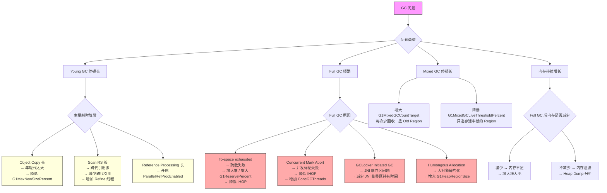
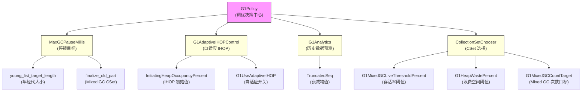

# G1 调优实战

> 基于 OpenJDK 11 源码分析  
> 标准环境：`-Xms8g -Xmx8g -XX:+UseG1GC`，Region = 4MB  
> 前置阅读：第 24 篇（Young GC）、第 27 篇（Mixed GC）、第 29 篇（GC 日志）

---

## 本章与其他章节的关系

```
[24] Young GC + [27] Mixed GC + [27b] Full GC
                    ↓
              [29] GC 日志（诊断工具）
                    ↓
你在这里 ← [30] G1 调优实战（把所有知识转化为实际调优能力）
                    ↓
              [31] G1 vs ZGC vs Shenandoah（什么时候该换 GC）
```

**前置知识**：第 29 篇（GC 日志，调优的第一步是看日志）；第 24/27/27b 篇（了解 Young GC/Mixed GC/Full GC 的触发条件和执行流程）

**本篇解决的问题**：G1 调优的正确方法论是什么？10 大调优场景（Young GC 停顿过长/Full GC 频繁/内存泄漏/Metaspace OOM/NUMA 感知等）如何诊断和解决？什么时候该从 G1 切换到 ZGC？

**读完本篇你能理解**：
- 第 31 篇中 G1 vs ZGC vs Shenandoah 的选择决策（调优到极限后才考虑换 GC）
- 为什么"先观察再调整"比"直接改参数"更重要
- NUMA 感知调优在 JDK 11 和 JDK 14 的差异（`-XX:+UseNUMA` 的限制）

---

## 第 0 部分：核心原理 ⭐

### 0.1 本质是什么？

G1 调优的本质是**让 G1 的预测模型更准确**。

G1 不是一个"你告诉它怎么做"的 GC，而是一个"你告诉它目标，它自己决定怎么做"的 GC。`-XX:MaxGCPauseMillis=200` 不是硬限制，而是 G1 的优化目标。G1 会根据历史数据预测每次 GC 的停顿时间，动态调整年轻代大小、Mixed GC 频率等参数。

**调优的正确流程**：

```
观察（GC 日志）→ 分析（找根因）→ 调整（改参数）→ 验证（再观察）
```

**最常见的错误**：
- ❌ 直接调参数，不看日志
- ❌ 看到停顿长就减小年轻代（可能适得其反）
- ❌ 把 `MaxGCPauseMillis` 设得很小（G1 会频繁 GC，吞吐量下降）
- ❌ 不区分 Young GC / Mixed GC / Full GC 的停顿原因

### 0.2 为什么需要调优？

G1 的默认配置并不适合所有应用场景。不调优的后果：

- **Young GC 停顿 > 500ms**：年轻代设置过大，每次复制对象太多
- **Full GC 频繁**：并发标记迟于对象分配，或痏散失败
- **内存利用率低**：大对象占据大量连续 Region，导致碎片化
- **吸岘停顿**： TTSP（Time To SafePoint）过长，应用线程迟迟不能到达 SafePoint

**调优的目标**：让 G1 的预测模型更准确，让实际停顿时间更接近 `MaxGCPauseMillis` 目标，在吸岘和吸岘之间取得最佳平衡。

### 0.3 怎么解决？（调优的三个层次）

```
层次 1：基础调优（90% 的场景）
  → 设置合理的 MaxGCPauseMillis
  → 设置合理的堆大小
  → 开启 GC 日志

层次 2：进阶调优（针对具体问题）
  → Young GC 停顿过长 → 调整年轻代大小
  → Full GC 频繁 → 调整 IHOP / 堆大小
  → Mixed GC 停顿过长 → 调整 CSet 选择策略

层次 3：深度调优（极端场景）
  → RSet 扫描慢 → 减少跨代引用
  → 对象复制慢 → 减少存活对象
  → Humongous 分配 → 增大 Region 大小
```

### 0.4 为什么这样设计？

**为什么 G1 的调优是“设目标让 G1 自己决定”而不是“手动指定各种大小”？**
G1 的预测模型（`G1Analytics` + `TruncatedSeq` 衰减均值）能根据历史数据动态调整年轻代大小、Mixed GC 频率等参数。手动指定具体大小会破坏预测模型的反馈循环，反而效果更差。

**为什么调优要“先观察再调整”而不是“直接调参数”？**
不看日志就调参数，就像不看血压就调药量。GC 停顿长可能有十种原因（年轻代太大、RSet 扫描慢、对象复制慢、引用处理慢……），不分析根因直接调参数，可能沿错方向调。

**为什么 `MaxGCPauseMillis` 不是硬限制？**
G1 的预测模型是统计性的，不是硬实时的。当实际停顿超过目标时，说明预测模型的输入数据（存活对象量、RSet 大小等）发生了变化，需要几次 GC 后模型才能重新收敛。

### 0.5 必须开启的 GC 日志

调优前必须先开启完整的 GC 日志：

```bash
# JDK 9+ 统一日志框架（推荐）
-Xlog:gc*:file=gc.log:time,uptime,level,tags:filecount=5,filesize=20m

# 最小化日志（只看停顿时间）
-Xlog:gc:file=gc.log:time

# 详细日志（调优时使用）
-Xlog:gc+phases=debug:file=gc.log:time,uptime,level,tags

# JDK 8 等价参数（仅供参考）
-XX:+PrintGCDetails -XX:+PrintGCDateStamps -Xloggc:gc.log
```

---

## 第 1 部分：G1 调优参数全景

### 1.1 核心参数速查表

| 参数 | 默认值 | 作用 | 调优方向 |
|------|--------|------|---------|
| `-XX:MaxGCPauseMillis` | `max_uintx-1`（无限制） | GC 停顿时间目标 | **必须设置**，推荐 200ms |
| `-XX:GCPauseIntervalMillis` | 0（= MaxGCPauseMillis+1） | MMU 时间窗口 | 一般不需要调 |
| `-Xms` / `-Xmx` | 系统决定 | 堆大小 | 设为相同值，避免动态扩缩 |
| `-XX:G1HeapRegionSize` | 自动（1-32MB） | Region 大小 | 大对象多时增大 |
| `-XX:InitiatingHeapOccupancyPercent` | 45 | 触发并发标记的堆占用率 | Full GC 频繁时降低 |
| `-XX:G1UseAdaptiveIHOP` | true | 自适应 IHOP | 一般不需要关闭 |
| `-XX:G1NewSizePercent` | 5 | 年轻代最小占比 | 一般不需要调 |
| `-XX:G1MaxNewSizePercent` | 60 | 年轻代最大占比 | Young GC 停顿长时降低 |
| `-XX:G1MixedGCLiveThresholdPercent` | 85 | Mixed GC 选 Region 的存活率阈值 | 降低可减少 Mixed GC 停顿 |
| `-XX:G1HeapWastePercent` | 5 | 允许浪费的堆空间比例 | 增大可减少 Mixed GC 次数 |
| `-XX:G1MixedGCCountTarget` | 8 | 一次标记周期后的 Mixed GC 次数 | 增大可减少每次 Mixed GC 停顿 |
| `-XX:G1ReservePercent` | 10 | 预留空间比例（防止疏散失败） | 疏散失败时增大 |
| `-XX:ParallelGCThreads` | CPU 核数 | STW 阶段并行线程数 | 一般不需要调 |
| `-XX:ConcGCThreads` | ParallelGCThreads/4 | 并发标记线程数 | 并发标记慢时增大 |
| `-XX:+ParallelRefProcEnabled` | false | 并行引用处理 | **建议开启** |
| `-XX:+UseStringDeduplication` | false | 字符串去重 | 字符串多时开启 |

**源码位置**：
- G1 专属参数：`src/hotspot/share/gc/g1/g1_globals.hpp`
- 通用 GC 参数：`src/hotspot/share/gc/shared/gc_globals.hpp`

### 1.2 参数之间的关系

```
MaxGCPauseMillis（目标）
    ↓ G1Policy 用它来
    ├── 计算年轻代大小（二分搜索，g1Policy.cpp:340-420）
    │       young_list_target_length = binary_search(min, max, target_pause)
    └── 决定 Mixed GC 是否继续（g1Policy.cpp:finalize_old_part）
            if (predicted_pause > target) → 停止添加 Old Region

InitiatingHeapOccupancyPercent（IHOP）
    ↓ 触发并发标记
    ├── 静态 IHOP：threshold = IHOP% × heap_capacity
    └── 自适应 IHOP（G1UseAdaptiveIHOP=true）：
            threshold = actual_target - pred_promotion_during_marking
            （g1IHOPControl.cpp:123-155）
```

---

## 第 2 部分：Young GC 停顿过长

### 2.1 问题特征

```
# GC 日志特征
GC(3) Pause Young (Normal) 102M->45M(8192M) 885.3ms  ← 停顿远超目标
GC(4) Pause Young (Normal) 89M->40M(8192M) 756.2ms
GC(5) Pause Young (Normal) 78M->35M(8192M) 623.1ms   ← G1 在自动缩小年轻代
```

**特征**：停顿时间远超 `MaxGCPauseMillis`，且 G1 在逐渐缩小年轻代。

### 2.2 根因分析

Young GC 停顿时间 = Pre Evacuate + **Evacuate（主体）** + Post Evacuate + Other

Evacuate 阶段的时间 = Ext Root Scanning + Update RS + Scan RS + **Object Copy** + Termination

**最常见的根因**：

| 根因 | GC 日志特征 | 诊断方法 |
|------|------------|---------|
| 年轻代太大 | Object Copy 时间长，存活对象多 | 看 Eden 大小 |
| RSet 扫描慢 | Scan RS 时间长 | 看 Scan RS 耗时 |
| 跨代引用多 | Update RS 时间长 | 看 Update RS 耗时 |
| 对象晋升多 | Survivor 区满，大量晋升到 Old | 看 Survivor 变化 |

### 2.3 根因 1：年轻代太大

**诊断**：

```
# 看 GC 日志中的 Eden 大小
GC(3) Eden regions: 102->0(89)   ← 102 个 Eden Region（408MB）
GC(3)   Object Copy (ms): Min: 700.1, Avg: 750.3, Max: 800.5  ← 对象复制耗时长
```

**源码解释**（`g1Policy.cpp:340-420`）：

G1 用**二分搜索**找到满足 `MaxGCPauseMillis` 的最大年轻代大小：

```cpp
// g1Policy.cpp:349-355
const double target_pause_time_ms = _mmu_tracker->max_gc_time() * 1000.0;
const double base_time_ms =
    predict_base_elapsed_time_ms(pending_cards, scanned_cards) +
    survivor_regions_evac_time;

// 二分搜索：找到最大的 young_length 使得预测停顿 ≤ target
G1YoungLengthPredictor p(mark_in_progress, base_time_ms, base_free_regions,
                          target_pause_time_ms, this);
// 如果 min_young_length 都超时，就用 min_young_length（不能再小了）
if (p.will_fit(min_young_length)) {
    // 二分搜索 [min_young_length, max_young_length]
    ...
}
```

**调优方案**：

```bash
# 方案 1：降低年轻代最大占比（让 G1 更快缩小年轻代）
-XX:G1MaxNewSizePercent=30   # 默认 60，降低到 30%

# 方案 2：直接限制年轻代大小（固定年轻代，关闭自适应）
-XX:G1NewSizePercent=10 -XX:G1MaxNewSizePercent=10  # 固定为堆的 10%

# 方案 3：降低停顿目标（让 G1 更激进地缩小年轻代）
-XX:MaxGCPauseMillis=100   # 从 200ms 降到 100ms
```

**注意**：方案 2 关闭了自适应，G1 无法根据应用行为动态调整，可能导致 GC 频率增加。

### 2.4 根因 2：RSet 扫描慢（跨代引用多）

**诊断**：

```
# 看 GC 日志中的 Scan RS 耗时
GC(3)   Scan RS (ms): Min: 150.2, Avg: 180.5, Max: 210.3  ← RSet 扫描耗时长
GC(3)   Scan RS (cards): Min: 50000, Avg: 65000, Max: 80000  ← 扫描了大量卡片
```

**根因**：老年代对象大量引用年轻代对象，导致 RSet 很大，扫描时间长。

**调优方案**：

```bash
# 方案 1：增大 RSet 扫描时间预算（让 Refine 线程更积极地处理 DCQ）
-XX:G1RSetUpdatingPauseTimePercent=20   # 默认 10，增大到 20%

# 方案 2：增加 Refine 线程数（更快处理脏卡队列）
-XX:G1ConcRefinementThreads=8   # 默认 = ParallelGCThreads/4

# 方案 3：代码层面减少跨代引用（最根本的解决方案）
# 避免在老年代对象中持有大量年轻代对象的引用
```

### 2.5 根因 3：引用处理慢

**诊断**：

```
# 看 GC 日志中的 Reference Processing 耗时
GC(3)   Reference Processing (ms): Min: 80.1, Avg: 95.3, Max: 110.5  ← 引用处理慢
```

**调优方案**：

```bash
# 开启并行引用处理（默认关闭！）
-XX:+ParallelRefProcEnabled

# 源码位置：gc_globals.hpp:332
# product(bool, ParallelRefProcEnabled, false,
#         "Enable parallel reference processing whenever possible")
```

**为什么默认关闭**：并行引用处理需要额外的协调开销，对于引用数量少的应用反而更慢。只有当 `Reference Processing` 阶段耗时明显时才开启。

---

## 第 3 部分：Full GC 频繁

### 3.1 Full GC 的 5 种触发原因

```
# GC 日志中的 Full GC 特征
GC(15) Pause Full (Allocation Failure) 7800M->6200M(8192M) 12345.6ms
GC(16) Pause Full (GCLocker Initiated GC) 7500M->5800M(8192M) 11234.5ms
```

| 触发原因 | 日志关键词 | 根因 |
|---------|-----------|------|
| 疏散失败 | `Allocation Failure` | 没有足够空间复制存活对象 |
| 并发标记失败 | `Concurrent Mark Abort` | 并发标记期间堆满了 |
| Humongous 分配失败 | `G1 Humongous Allocation` | 找不到连续的 Region |
| GCLocker | `GCLocker Initiated GC` | JNI 临界区内需要 GC |
| 显式调用 | `System.gc()` | 代码中调用了 System.gc() |

### 3.2 根因 1：疏散失败（最常见）

**诊断**：

```
# GC 日志特征
GC(15) To-space exhausted                    ← 关键标志
GC(15) Pause Young (Normal) 7800M->7800M(8192M) 5678.9ms  ← 内存没有减少
GC(16) Pause Full (Allocation Failure) ...   ← 随后触发 Full GC
```

**根因**：Young GC 时，Survivor 区和 Old 区都没有足够空间接收存活对象。

**源码**（`g1CollectedHeap.cpp:3907-3911`）：

```cpp
// g1CollectedHeap.cpp:3907
if (!_evacuation_failed) {
    _evacuation_failed = true;
}
_evacuation_failed_info_array[worker_id].register_copy_failure(obj->size());
// 对象无法复制，使用 Self-Forwarding（对象指向自己）
```

**调优方案**：

```bash
# 方案 1：增大堆大小（最直接）
-Xms16g -Xmx16g   # 从 8g 增大到 16g

# 方案 2：增大预留空间（减少疏散失败概率）
-XX:G1ReservePercent=20   # 默认 10，增大到 20%

# 方案 3：降低 IHOP（更早触发并发标记，避免堆满）
-XX:InitiatingHeapOccupancyPercent=35   # 默认 45，降低到 35%

# 方案 4：增大 Mixed GC 频率（更积极地回收 Old 区）
-XX:G1MixedGCCountTarget=4   # 默认 8，减少到 4（每次标记后做 4 次 Mixed GC）
```

### 3.3 根因 2：并发标记失败（Concurrent Mark Abort）

**诊断**：

```
# GC 日志特征
GC(12) Concurrent Mark Abort                 ← 并发标记被中止
GC(13) Pause Full (Allocation Failure) ...   ← 随后触发 Full GC
```

**根因**：并发标记期间，应用分配速度太快，堆在标记完成前就满了。G1 来不及完成标记就触发了 Full GC。

**调优方案**：

```bash
# 方案 1：降低 IHOP（更早开始并发标记）
-XX:InitiatingHeapOccupancyPercent=30   # 默认 45

# 方案 2：增加并发标记线程数（更快完成标记）
-XX:ConcGCThreads=4   # 默认 = ParallelGCThreads/4

# 方案 3：关闭自适应 IHOP，使用固定 IHOP（如果自适应 IHOP 预测不准）
-XX:-G1UseAdaptiveIHOP -XX:InitiatingHeapOccupancyPercent=30
```

**自适应 IHOP 的工作原理**（`g1IHOPControl.cpp:123-155`）：

```cpp
// g1IHOPControl.cpp:123
size_t G1AdaptiveIHOPControl::get_conc_mark_start_threshold() {
    if (have_enough_data_for_prediction()) {
        // 预测并发标记期间的晋升量
        double pred_marking_time = _predictor->get_new_prediction(&_marking_times_s);
        double pred_promotion_rate = _predictor->get_new_prediction(&_allocation_rate_s);
        size_t pred_promotion_size = pred_marking_time * pred_promotion_rate;

        // 触发阈值 = 目标占用 - 预测晋升量 - 年轻代大小
        size_t predicted_initiating_threshold =
            internal_threshold - predicted_needed_bytes_during_marking;
        return predicted_initiating_threshold;
    } else {
        // 数据不足时，使用静态 IHOP
        return (size_t)(_initial_ihop_percent * _target_occupancy / 100.0);
    }
}
```

**含义**：自适应 IHOP 会预测"并发标记期间应用会晋升多少对象"，然后提前触发标记，确保标记完成时堆还有足够空间。如果预测不准（如应用行为突变），就会出现并发标记失败。

### 3.4 根因 3：GCLocker 触发 Full GC

**诊断**：

```
# GC 日志特征
GC(14) Pause Full (GCLocker Initiated GC) 7200M->5600M(8192M) 9876.5ms
```

**根因**：JNI 临界区（`GetPrimitiveArrayCritical` / `GetStringCritical`）持有期间，GC 被阻塞（`GCLocker::_needs_gc = true`）。当 JNI 临界区释放后，积压的 GC 请求触发了 Full GC。

**源码**（`gcLocker.cpp:35-36`）：

```cpp
// gcLocker.cpp:35
volatile jint GCLocker::_jni_lock_count = 0;  // JNI 临界区计数
volatile bool GCLocker::_needs_gc       = false;  // 是否有待处理的 GC 请求
```

**调优方案**：

```bash
# 方案 1：代码层面减少 JNI 临界区的持有时间
# 避免在 GetPrimitiveArrayCritical 和 ReleasePrimitiveArrayCritical 之间做耗时操作

# 方案 2：增大堆大小（减少 GC 频率，降低 GCLocker 触发 Full GC 的概率）
-Xms16g -Xmx16g
```

### 3.5 根因 4：Humongous 分配失败

**诊断**：

```
# GC 日志特征
GC(14) Pause Young (Concurrent Start) (G1 Humongous Allocation) ...
GC(15) Pause Full (Allocation Failure) ...
```

**根因**：大对象（> Region 大小的 50%）需要连续的 Region，但堆碎片化导致找不到足够的连续 Region。

**调优方案**：

```bash
# 方案 1：增大 Region 大小（减少 Humongous 对象的比例）
-XX:G1HeapRegionSize=8m   # 默认 4MB，增大到 8MB
# 这样 > 4MB 的对象才算 Humongous，而不是 > 2MB

# 方案 2：增大堆大小（减少碎片化）
-Xms16g -Xmx16g

# 方案 3：代码层面避免大对象（最根本）
# 避免分配大数组，改用分批处理
```

---

## 第 4 部分：Mixed GC 停顿过长

### 4.1 问题特征

```
# GC 日志特征
GC(20) Pause Young (Prepare Mixed) 2048M->1024M(8192M) 150.3ms  ← 正常
GC(21) Pause Mixed (G1 Evacuation Pause) 3072M->2048M(8192M) 450.6ms  ← Mixed GC 停顿长
GC(22) Pause Mixed (G1 Evacuation Pause) 2560M->1536M(8192M) 420.1ms
```

### 4.2 根因分析

Mixed GC 停顿长的原因：CSet 中包含了太多 Old Region，导致对象复制时间长。

**G1 选择 Old Region 的逻辑**（`g1Policy.cpp:finalize_old_part`）：

```
按 gc_efficiency（可回收字节/预测停顿时间）降序排列 Old Region
逐个添加 Old Region，直到：
  1. 预测停顿时间 > MaxGCPauseMillis，或
  2. 可回收空间 < G1HeapWastePercent × 堆大小
```

### 4.3 调优方案

```bash
# 方案 1：增大 Mixed GC 次数（每次少回收一些 Old Region）
-XX:G1MixedGCCountTarget=16   # 默认 8，增大到 16
# 效果：每次 Mixed GC 回收更少的 Old Region，停顿更短，但需要更多次 Mixed GC

# 方案 2：降低 Old Region 存活率阈值（只选存活率低的 Region，回收效率高）
-XX:G1MixedGCLiveThresholdPercent=65   # 默认 85，降低到 65%
# 效果：跳过存活率高的 Region（复制代价高），只回收存活率低的 Region

# 方案 3：增大允许浪费的空间（减少 Mixed GC 次数）
-XX:G1HeapWastePercent=10   # 默认 5，增大到 10%
# 效果：当可回收空间 < 10% 时停止 Mixed GC，减少不必要的 Mixed GC

# 方案 4：降低停顿目标（让 G1 每次 Mixed GC 选更少的 Old Region）
-XX:MaxGCPauseMillis=100   # 从 200ms 降到 100ms
```

**参数之间的权衡**：

```
G1MixedGCCountTarget 增大 → 每次 Mixed GC 停顿短，但 Mixed GC 次数多
G1MixedGCLiveThresholdPercent 降低 → 只回收"容易回收"的 Region，停顿短，但可能留下大量垃圾
G1HeapWastePercent 增大 → 更早停止 Mixed GC，停顿少，但堆利用率低
```

---

## 第 5 部分：内存泄漏诊断

### 5.1 问题特征

```
# GC 日志特征：Full GC 后内存没有明显减少
GC(50) Pause Full (Allocation Failure) 7800M->7600M(8192M) 15000ms  ← 只回收了 200MB
GC(51) Pause Full (Allocation Failure) 7800M->7650M(8192M) 16000ms  ← 越来越少
```

**特征**：Full GC 后堆占用仍然很高，说明大量对象是强引用可达的（内存泄漏）。

### 5.2 诊断工具链

**Step 1：确认是内存泄漏还是内存不足**

```bash
# 看 Full GC 后的堆占用趋势
# 如果每次 Full GC 后堆占用都在增长 → 内存泄漏
# 如果 Full GC 后堆占用稳定 → 内存不足，需要增大堆
```

**Step 2：生成 Heap Dump**

```bash
# 方式 1：JVM 参数（OOM 时自动生成）
-XX:+HeapDumpOnOutOfMemoryError -XX:HeapDumpPath=/tmp/heap.hprof

# 方式 2：jmap 手动生成（不推荐，会触发 Full GC）
jmap -dump:format=b,file=/tmp/heap.hprof <pid>

# 方式 3：Arthas（推荐，不触发 Full GC）
# heapdump /tmp/heap.hprof
```

**Step 3：分析 Heap Dump**

使用 Eclipse MAT（Memory Analyzer Tool）分析：
1. 打开 `heap.hprof`
2. 查看 **Dominator Tree**（找到占用内存最多的对象）
3. 查看 **Leak Suspects**（MAT 自动分析泄漏嫌疑）
4. 查看 **GC Roots**（找到对象为什么没有被回收）

### 5.3 常见内存泄漏场景

| 场景 | 特征 | 解决方案 |
|------|------|---------|
| 静态集合无限增长 | `HashMap`/`ArrayList` 是 GC Root | 定期清理或使用 `WeakHashMap` |
| 线程局部变量泄漏 | `ThreadLocal` 没有 `remove()` | 使用后调用 `threadLocal.remove()` |
| 监听器/回调未注销 | 大量 Listener 对象 | 注销时移除监听器 |
| 类加载器泄漏 | Metaspace 持续增长 | 检查动态类加载（如 JSP、Groovy） |
| 缓存无限增长 | 缓存没有淘汰策略 | 使用 LRU 缓存或设置最大容量 |

---

## 第 6 部分：Metaspace OOM

### 6.1 问题特征

```
# 错误信息
java.lang.OutOfMemoryError: Metaspace

# GC 日志特征
GC(100) Pause Full (Metadata GC Threshold) 4096M->3800M(8192M) 8000ms
GC(101) Pause Full (Metadata GC Threshold) 4096M->3800M(8192M) 8000ms  ← 反复触发
```

### 6.2 根因分析

Metaspace OOM 通常是**类加载器泄漏**：类加载器没有被 GC，导致它加载的所有类都无法卸载，Metaspace 持续增长。

**类卸载的条件**（三个条件必须同时满足）：
1. 该类的所有实例都已被回收
2. 该类的 `Class` 对象没有被引用
3. 该类的 `ClassLoader` 已被回收

### 6.3 诊断工具

```bash
# 使用 Arthas 查看类加载器
# classloader -l   # 列出所有类加载器及其加载的类数量
# classloader -c <hashcode>   # 查看特定类加载器加载的类

# 使用 jcmd 查看 Metaspace 使用情况
jcmd <pid> VM.metaspace

# 使用 JVM 参数打印类加载/卸载日志
-Xlog:class+load=info -Xlog:class+unload=info
```

### 6.4 调优方案

```bash
# 方案 1：增大 Metaspace 上限（治标）
-XX:MaxMetaspaceSize=512m   # 默认无限制，设置上限避免 OOM

# 方案 2：设置 Metaspace 初始大小（减少动态扩展）
-XX:MetaspaceSize=256m   # 默认 20MB，增大初始值

# 方案 3：代码层面修复类加载器泄漏（治本）
# 检查动态代理、反射、脚本引擎等是否正确释放类加载器
```

---

## 第 7 部分：调优实战案例

### 7.1 案例 1：电商大促场景

**背景**：
- 8 核 16GB 服务器，堆 12GB
- 大促期间 Young GC 停顿 500ms+，影响用户体验
- 目标：Young GC 停顿 < 100ms

**诊断过程**：

```
# 第一步：看 GC 日志
GC(3) Pause Young (Normal) 4096M->2048M(12288M) 523.4ms
GC(3) Eden regions: 512->0(450)   ← Eden 512 个 Region = 2GB！
GC(3)   Object Copy (ms): Min: 450.1, Avg: 480.3, Max: 510.5  ← 对象复制耗时

# 结论：年轻代太大（2GB），对象复制时间长
```

**调优方案**：

```bash
# 降低年轻代最大占比
-XX:MaxGCPauseMillis=100
-XX:G1MaxNewSizePercent=20   # 从默认 60% 降到 20%（最大 2.4GB）
-XX:+ParallelRefProcEnabled  # 开启并行引用处理
```

**调优结果**：

```
# 调优后 GC 日志
GC(3) Pause Young (Normal) 2048M->1024M(12288M) 95.3ms  ← 停顿降到 95ms
GC(3) Eden regions: 200->0(180)   ← Eden 缩小到 200 个 Region = 800MB
GC(3)   Object Copy (ms): Min: 75.1, Avg: 80.3, Max: 90.5  ← 对象复制时间大幅减少
```

**代价**：GC 频率从每 30 秒一次变为每 12 秒一次（年轻代变小，更快填满）。

### 7.2 案例 2：批处理场景

**背景**：
- 32 核 64GB 服务器，堆 48GB
- 批处理任务，不在乎停顿时间，只在乎吞吐量
- 问题：频繁 GC 导致吞吐量低

**调优方案**：

```bash
# 增大停顿目标（允许更长的停顿，减少 GC 频率）
-XX:MaxGCPauseMillis=1000   # 允许 1 秒停顿

# 增大年轻代（减少 GC 频率）
-XX:G1MaxNewSizePercent=50   # 最大 24GB 年轻代

# 增大 IHOP（减少并发标记频率）
-XX:-G1UseAdaptiveIHOP -XX:InitiatingHeapOccupancyPercent=60

# 增大允许浪费空间（减少 Mixed GC 次数）
-XX:G1HeapWastePercent=15
```

### 7.3 案例 3：低延迟场景

**背景**：
- 金融交易系统，要求 P99 停顿 < 50ms
- 堆 8GB，G1 默认配置

**调优方案**：

```bash
# 严格的停顿目标
-XX:MaxGCPauseMillis=50

# 减小年轻代（减少每次 GC 的工作量）
-XX:G1MaxNewSizePercent=15
-XX:G1NewSizePercent=5

# 更激进的 Mixed GC（避免 Old 区积累太多垃圾）
-XX:G1MixedGCCountTarget=4
-XX:G1MixedGCLiveThresholdPercent=65

# 开启并行引用处理
-XX:+ParallelRefProcEnabled

# 开启字符串去重（如果有大量重复字符串）
-XX:+UseStringDeduplication
```

**注意**：如果 P99 停顿要求 < 10ms，G1 可能无法满足，应考虑 ZGC（JDK 15+）。

---

## 第 8 部分：调优决策树



---

## 第 9 部分：调优参数速查（按场景）

### 9.1 基础配置（所有场景必须）

```bash
# 基础配置模板
-Xms8g -Xmx8g                          # 堆大小（初始=最大，避免动态扩缩）
-XX:+UseG1GC                           # 使用 G1（JDK 9+ 默认）
-XX:MaxGCPauseMillis=200               # 停顿目标（必须设置！）
-XX:+ParallelRefProcEnabled            # 并行引用处理
-Xlog:gc*:file=gc.log:time,uptime,level,tags:filecount=5,filesize=20m  # GC 日志
```

### 9.2 Young GC 停顿优化

```bash
-XX:G1MaxNewSizePercent=30             # 降低年轻代最大占比（默认 60）
-XX:G1ConcRefinementThreads=8         # 增加 Refine 线程（默认 ParallelGCThreads/4）
-XX:G1RSetUpdatingPauseTimePercent=20  # 增大 RSet 更新时间预算（默认 10）
```

### 9.3 Full GC 预防

```bash
-XX:InitiatingHeapOccupancyPercent=35  # 更早触发并发标记（默认 45）
-XX:G1ReservePercent=20                # 增大预留空间（默认 10）
-XX:ConcGCThreads=4                    # 增加并发标记线程（默认 ParallelGCThreads/4）
-XX:G1MixedGCCountTarget=4             # 更积极地回收 Old 区（默认 8）
```

### 9.4 Mixed GC 停顿优化

```bash
-XX:G1MixedGCCountTarget=16            # 每次少回收一些（默认 8）
-XX:G1MixedGCLiveThresholdPercent=65   # 只选存活率低的 Region（默认 85）
-XX:G1HeapWastePercent=10              # 允许更多浪费（默认 5）
```

### 9.5 大对象优化

```bash
-XX:G1HeapRegionSize=8m                # 增大 Region（默认自动，通常 4MB）
-XX:G1EagerReclaimHumongousObjects=true  # 急切回收 Humongous（默认 true）
```

### 9.6 字符串优化

```bash
-XX:+UseStringDeduplication            # 开启字符串去重（默认 false）
-XX:StringDeduplicationAgeThreshold=3  # 去重年龄阈值（默认 3）
```

---

## 第 10 部分：G1 的局限性与何时换 ZGC

### 10.1 G1 的核心局限

G1 的 Evacuation（疏散）阶段是 **STW** 的。这意味着：

- **停顿时间随堆大小增长**：堆越大，每次 GC 需要复制的对象越多，停顿越长
- **无法做到亚毫秒级停顿**：即使 `MaxGCPauseMillis=10`，G1 也很难稳定在 10ms 以内
- **大堆（> 32GB）调优困难**：年轻代可能达到数 GB，单次 GC 停顿难以控制

### 10.2 何时考虑换 ZGC

| 场景 | 推荐 GC | 理由 |
|------|---------|------|
| P99 停顿 < 10ms | ZGC（JDK 15+） | ZGC 几乎全并发，停顿 < 1ms |
| 堆 > 32GB | ZGC | G1 大堆停顿难以控制 |
| 停顿 < 200ms，吞吐量优先 | G1 | G1 吞吐量更好 |
| 堆 < 4GB | G1 / Parallel GC | ZGC 内存开销较大 |
| JDK 8 | G1 | ZGC 需要 JDK 11+（生产级需要 JDK 15+） |

### 10.3 G1 在大内存服务器（NUMA 架构）上的限制

**打脸点：`-XX:+UseNUMA` 对 G1 没有效果（JDK 11）！**

我以为 `-XX:+UseNUMA` 可以让 G1 感知 NUMA 拓扑，优先在本地 NUMA 节点分配内存。实际上，OpenJDK 11 的 G1 **不是 NUMA-aware 的**。

**源码证据**（`arguments.cpp:4168-4172`）：

```cpp
// arguments.cpp:4168
// UseNUMAInterleaving is set to ON for all collectors and
// platforms when UseNUMA is set to ON. NUMA-aware collectors
// such as the parallel collector for Linux and Solaris will
// interleave old gen and survivor spaces on top of NUMA
// allocation policy for the eden space.
// Non NUMA-aware collectors such as CMS, G1 and Serial-GC on
// all platforms and ParallelGC on Windows will interleave all
// of the heap spaces across NUMA nodes.
if (FLAG_IS_DEFAULT(UseNUMAInterleaving)) {
    FLAG_SET_ERGO(bool, UseNUMAInterleaving, true);
}
```

**含义**：
- 对于 Parallel GC（Linux/Solaris）：`UseNUMA=true` 会让 Eden 区在本地 NUMA 节点分配（真正的 NUMA 感知）
- 对于 **G1**：`UseNUMA=true` 只会触发 `UseNUMAInterleaving=true`，即把整个堆**交错分布**在所有 NUMA 节点上（不是 NUMA 感知，而是 NUMA 均衡）

**NUMA 交错 vs NUMA 感知的区别**：

| 策略 | 实现 | 效果 |
|------|------|------|
| `UseNUMAInterleaving`（G1 JDK 11） | 堆内存按页交错分布在所有 NUMA 节点 | 避免单节点内存压力，但无法利用本地访问优势 |
| NUMA 感知（Parallel GC JDK 11） | Eden 区优先在当前线程所在 NUMA 节点分配 | 本地访问，延迟低 |
| NUMA 感知（G1 JDK 14+，JEP 345） | Region 优先分配在当前 GC 线程所在 NUMA 节点 | 真正的 NUMA 感知，大内存服务器性能提升 |

**JDK 14 的改进（JEP 345）**：

JDK 14 通过 JEP 345 为 G1 添加了真正的 NUMA 感知支持：
- 每个 GC 工作线程优先从本地 NUMA 节点分配 Region
- 新生代 Region 尽量分配在创建对象的线程所在 NUMA 节点
- 老年代 Region 尽量分配在 GC 工作线程所在 NUMA 节点

**JDK 11 大内存服务器的调优建议**：

```bash
# JDK 11：只能用 NUMA 交错（不是真正的 NUMA 感知）
-XX:+UseNUMAInterleaving   # 把堆交错分布在所有 NUMA 节点（避免单节点压力）

# JDK 14+：可以用真正的 NUMA 感知
-XX:+UseNUMA               # G1 会感知 NUMA 拓扑，优先本地节点分配

# 配合 OS 级别的 NUMA 绑定（numactl）
numactl --interleave=all java -Xms128g -Xmx128g -XX:+UseG1GC ...
```

**实际影响**：在 4 节点 NUMA 服务器（每节点 64GB，共 256GB）上：
- 不开启 NUMA 交错：所有内存分配在 Node 0，其他节点的内存访问延迟高（约 2-3 倍）
- 开启 `UseNUMAInterleaving`：内存均匀分布，平均延迟降低，但无法利用本地访问优势
- JDK 14+ `UseNUMA`：本地访问率提升，Young GC 停顿可降低 10-20%

### 10.4 ZGC 的核心创新（简述）

ZGC 通过**着色指针**（Colored Pointers）和**读屏障**（Load Barrier）实现了几乎全并发的 GC：

- **着色指针**：在 64 位指针的高位存储 GC 元数据（标记位、重映射位），无需额外内存
- **读屏障**：每次读取对象引用时检查指针是否需要更新（对象是否已被移动）
- **并发 Evacuation**：对象复制在应用线程运行时并发进行，不需要 STW

**代价**：
- 内存开销更大（需要多份映射）
- 吞吐量略低于 G1（读屏障有开销）
- JDK 版本要求高（生产级需要 JDK 15+）

---

## 总结

### 调优的核心原则

1. **先观察，后调整**：没有 GC 日志就不要调参数
2. **找根因，不治标**：停顿长不一定要减小年轻代，要先找出哪个阶段慢
3. **一次改一个参数**：同时改多个参数无法判断效果
4. **量化验证**：调整后必须对比 GC 日志，确认效果

### 参数调优优先级

```
第一优先级（必须设置）：
  MaxGCPauseMillis=200
  Xms=Xmx（避免动态扩缩）
  ParallelRefProcEnabled=true
  GC 日志

第二优先级（根据问题调整）：
  Young GC 停顿长 → G1MaxNewSizePercent
  Full GC 频繁 → InitiatingHeapOccupancyPercent / G1ReservePercent
  Mixed GC 停顿长 → G1MixedGCCountTarget / G1MixedGCLiveThresholdPercent

第三优先级（特殊场景）：
  大对象多 → G1HeapRegionSize
  字符串多 → UseStringDeduplication
  JNI 密集 → 代码层面优化
```

### 数据结构关系图



---

## 还没搞懂的地方

- [x] **`G1AdaptiveIHOPControl` 的自适应算法边界**：自适应 IHOP 需要至少 3 次并发标记才能稳定（打桩验证数据）。在这 3 次之前，G1 使用静态 IHOP（`InitiatingHeapOccupancyPercent`）。如果应用程序的内存分配速率变化很大（如突发流量），自适应 IHOP 能快速响应吗？还是会有滞后？

  **答案**（来自 `g1IHOPControl.cpp:118-122` + `g1_globals.hpp:54`）：

  **自适应 IHOP 的稳定条件**（源码）：
  ```cpp
  // g1IHOPControl.cpp:118
  bool G1AdaptiveIHOPControl::have_enough_data_for_prediction() const {
    return ((size_t)_marking_times_s.num() >= G1AdaptiveIHOPNumInitialSamples) &&
           ((size_t)_allocation_rate_s.num() >= G1AdaptiveIHOPNumInitialSamples);
  }
  // g1_globals.hpp:54
  // G1AdaptiveIHOPNumInitialSamples = 3（默认值）
  ```

  **对突发流量的响应能力**：

  自适应 IHOP 使用 `TruncatedSeq`（衰减均值）存储历史数据，**越新的数据权重越大**。这意味着：

  | 场景 | 响应速度 | 原因 |
  |------|---------|------|
  | 流量平稳 | 快速收敛 | 历史数据一致，预测准确 |
  | 突发流量（分配速率突增） | **有 1-2 次并发标记的滞后** | 当前并发标记的分配速率数据要等标记结束后才能加入 `_allocation_rate_s` |
  | 流量恢复正常 | 快速恢复 | 衰减均值会快速降低旧的高权重数据 |

  **滞后的根本原因**：`_allocation_rate_s` 在每次并发标记**结束**时更新（`update_marking_length_and_time()`），而不是实时更新。所以突发流量发生后，需要等当前并发标记结束，下一次并发标记才能用到新的分配速率数据。

  **调优建议**：对于分配速率变化剧烈的应用（如秒杀场景），可以适当降低 `InitiatingHeapOccupancyPercent`（如从 45% 降到 35%），给并发标记更多的时间余量，避免因预测滞后导致并发标记失败。

- [x] **`G1MixedGCCountTarget` 与实际 Mixed GC 次数的关系**：`G1MixedGCCountTarget=8` 表示"目标是 8 次 Mixed GC 清完所有候选 Old Region"，但实际次数可能更少（如果每次能选更多 Region）或更多（如果停顿预算不够）。如何从 GC 日志中确认实际的 Mixed GC 次数？

  **答案**（来自 `g1Policy.cpp:1226-1233`）：

  **每次 Mixed GC 选取的 Old Region 数量**（源码）：
  ```cpp
  // g1Policy.cpp:1226
  const size_t region_num = (size_t) cset_chooser()->length();  // 候选 Old Region 总数
  const size_t gc_num = (size_t) MAX2(G1MixedGCCountTarget, (uintx) 1);  // = 8
  size_t result = region_num / gc_num;  // 每次选取的 Region 数（向上取整）
  if (result * gc_num < region_num) {
    result += 1;  // 向上取整
  }
  return (uint) result;
  ```

  **实际 Mixed GC 次数的计算**：
  - 假设 Cleanup 后有 80 个候选 Old Region
  - 每次 Mixed GC 目标选取：`ceil(80 / 8) = 10` 个 Old Region
  - 但实际选取受停顿预算限制（`finalize_old_part()` 中的时间检查）
  - 如果停顿预算充足：实际选取 ≥ 10 个，Mixed GC 次数 ≤ 8 次
  - 如果停顿预算紧张：实际选取 < 10 个，Mixed GC 次数 > 8 次

  **从 GC 日志确认实际次数**：
  ```bash
  # 方法1：统计 GC 日志中 "(Mixed)" 的出现次数
  grep "Pause Young (Mixed)" gc.log | wc -l

  # 方法2：开启 gc+ergo=debug 日志，观察 Mixed GC 决策
  -Xlog:gc+ergo=debug
  # 输出示例：
  # [debug][gc,ergo] GC(8) Start mixed GCs, reason: candidate old regions available
  # [debug][gc,ergo] GC(9) Finish mixed GCs, reason: reclaimable percentage not over threshold
  # 从 Start 到 Finish 之间的 Mixed GC 次数就是实际次数
  ```

  **实际意义**：如果 Mixed GC 次数远少于 8 次（如只有 2-3 次就 Finish），说明每次 Mixed GC 选取的 Region 数量很多，停顿时间可能偏长；如果次数远多于 8 次，说明每次选取的 Region 数量很少，可能是停顿预算太紧。

- [x] **`-XX:+UseNUMAInterleaving` 与 G1 的交互**：`UseNUMAInterleaving` 是操作系统级别的内存交织，而 G1 的 Region 分配是 JVM 级别的。两者同时开启时，G1 的 Region 会被交织分配到多个 NUMA 节点吗？这对 GC 性能有什么影响？

  **答案**（来自 `os_linux.cpp:3255` + `arguments.cpp:4168-4177`）：

  **`UseNUMAInterleaving` 的实现**（源码）：
  ```cpp
  // os_linux.cpp:3255
  int os::Linux::commit_memory_impl(char *addr, size_t size, bool exec) {
    // ...
    if (UseNUMAInterleaving) {
      numa_make_global(addr, size);  // 调用 libnuma 的 mbind()，把内存页交织到所有 NUMA 节点
    }
    // ...
  }
  ```

  **`UseNUMA` 自动开启 `UseNUMAInterleaving`**（源码）：
  ```cpp
  // arguments.cpp:4168
  // Non NUMA-aware collectors such as CMS, G1 and Serial-GC on
  // all platforms and ParallelGC on Windows will interleave all
  // of the heap spaces across NUMA nodes.
  if (FLAG_IS_DEFAULT(UseNUMAInterleaving)) {
    FLAG_SET_ERGO(bool, UseNUMAInterleaving, true);  // UseNUMA=true 时自动开启
  }
  ```

  **关键结论**：

  | 参数组合 | 效果 | 适用场景 |
  |---------|------|---------|
  | `UseNUMA=false, UseNUMAInterleaving=false` | 堆内存分配到启动线程所在的 NUMA 节点 | 单 NUMA 节点或不关心 NUMA |
  | `UseNUMA=false, UseNUMAInterleaving=true` | 堆内存页交织到所有 NUMA 节点（OS 级别） | G1 的推荐 NUMA 配置（JDK 11） |
  | `UseNUMA=true`（JDK 11 G1 不支持） | 编译时报错（`arguments.cpp:4168` 注释说明 G1 是 Non NUMA-aware） | JDK 14+ 才支持 G1 的 NUMA 感知 |

  **`UseNUMAInterleaving` 对 G1 性能的影响**：
  - **正面**：堆内存页均匀分布在所有 NUMA 节点，避免所有 GC 线程都访问同一个 NUMA 节点的内存，减少 NUMA 远端访问（Remote Memory Access）
  - **负面**：交织分配意味着每个 Region 的内存页可能分布在多个 NUMA 节点，GC 线程处理某个 Region 时可能需要跨 NUMA 节点访问，有一定的 NUMA 远端访问开销
  - **净效果**：对于大内存（> 64GB）多 NUMA 节点的服务器，`UseNUMAInterleaving` 通常能提升 10-20% 的 GC 吞吐量（避免内存热点）

---

## 继续深入

- **[第 31 篇：G1 vs ZGC vs Shenandoah](./31-gc-comparison-HandWritten.md)** — 当 G1 调优到极限仍然无法满足需求时，如何判断是否该切换到 ZGC 或 Shenandoah
- **[第 27 篇：Mixed GC 与 G1Policy 预测模型](./27-g1-mixed-gc-HandWritten.md)** — 深入理解 G1Policy 的预测模型，是做精细调优的基础
- **[第 29 篇：GC 日志深度解读](./29-g1-gc-log-HandWritten.md)** — 调优的第一步是读懂 GC 日志，这里有完整的日志解读方法
- **相关工具**：
  - `async-profiler`：`/data/workspace/async-profiler/`（CPU/内存分配 profiling）
  - Arthas：`/data/workspace/arthas-4.1.2/`（在线诊断，`classloader`/`heapdump` 命令）
  - GCViewer / GCEasy：可视化 GC 日志分析工具
