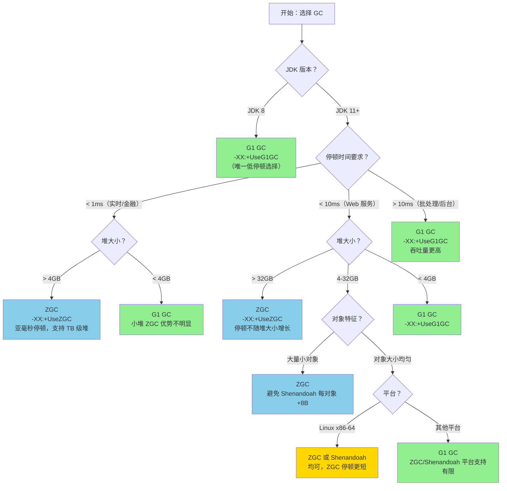
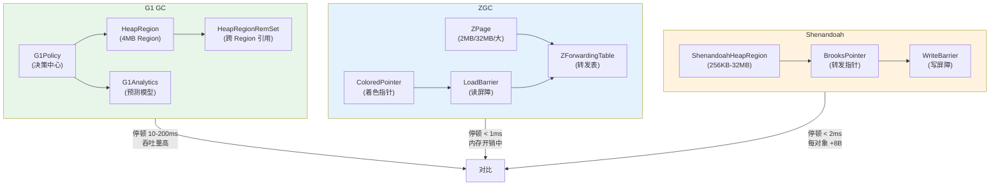

# 第 31 篇：G1 vs ZGC vs Shenandoah —— 三代低停顿 GC 的设计哲学与选择决策

> 基于 OpenJDK 11 源码分析  
> 标准环境：`-Xms8g -Xmx8g -XX:+UseG1GC`，G1 Region = 4MB

---

## 本章与其他章节的关系

```
[22] ~ [30] 全书所有篇章（理解 G1 的完整实现）
                    ↓
你在这里 ← [31] G1 vs ZGC vs Shenandoah（全书收尾：建立 GC 选择的判断框架）
```

**前置知识**：建议读完第 22-30 篇再来读本篇。至少需要：第 23 篇（G1 整体架构）、第 27 篇（Mixed GC 预测模型）、第 27b 篇（Full GC）

**本篇解决的问题**：G1/ZGC/Shenandoah 的设计哲学有什么本质差异？三款 GC 的停顿时间/吞吐量/内存开销如何对比？什么时候该从 G1 切换到 ZGC 或 Shenandoah？分代 ZGC（JDK 21）带来了什么变化？

**读完本篇你能理解**：
- 为什么 ZGC 能做到亚毫秒停顿（着色指针 + 并发重定位 vs G1 的 STW 疏散）
- 为什么 Shenandoah 的 Brooks 指针比 ZGC 的着色指针内存开销更大
- 分代 ZGC（JDK 21）如何解决 ZGC 的吞吐量问题
- 如何用决策树快速选择适合自己场景的 GC

---

## 第 0 部分：核心原理 ⭐

### 0.1 本质是什么？

三款 GC 都在解决同一个根本问题：**如何在大堆（数十 GB 乃至 TB 级）下把 STW 停顿压到毫秒甚至亚毫秒级别？**

但它们的答案截然不同：

| GC | 核心答案 | 一句话本质 |
|----|---------|-----------|
| **G1** | 把堆切成 Region，增量回收，用预测模型控制停顿 | **可预测的增量并发 GC** |
| **ZGC** | 把 GC 元数据编码进指针，几乎所有工作并发完成 | **着色指针驱动的全并发 GC** |
| **Shenandoah** | 用转发指针实现并发对象移动，消除压缩停顿 | **并发压缩 GC** |

### 0.2 为什么需要三款不同的 GC？

**根本矛盾**：GC 有三个目标，但它们相互冲突：

```
低停顿时间  ←→  高吞吐量  ←→  低内存开销
```

- **Serial/Parallel GC**：选择高吞吐量，停顿时间不管
- **CMS**：尝试低停顿，但并发标记 + 不压缩 → 内存碎片 → 最终 Full GC
- **G1**：Region 化 + 预测模型，在停顿和吞吐之间取得平衡，但 STW 仍有 10-200ms
- **ZGC / Shenandoah**：把停顿压到 1-10ms，代价是更高的内存开销和 CPU 开销

### 0.3 三款 GC 的设计哲学差异

**G1 的哲学：可预测性**

> "我不追求最短停顿，我追求**可预测的停顿**。你告诉我目标停顿时间，我来保证。"

核心机制：
- Region 化堆 → 可以选择性回收高收益 Region
- 预测模型（`G1Analytics` + `TruncatedSeq`）→ 预测每个 Region 的回收收益
- 停顿预算（`MaxGCPauseMillis`）→ 在预算内选择最优 CSet

**ZGC 的哲学：并发一切**

> "STW 停顿的根源是对象移动时需要暂停所有线程。我把 GC 元数据编码进指针，用读屏障让应用线程自己修正指针，这样移动对象就不需要 STW 了。"

核心机制：
- 着色指针（Colored Pointer）→ 指针高位存 GC 状态
- 读屏障（Load Barrier）→ 应用线程读指针时自动修正
- 并发重定位（Concurrent Relocation）→ 移动对象不需要 STW

**Shenandoah 的哲学：转发指针**

> "我不改变指针格式，我在每个对象头前面加一个转发指针（Brooks Pointer）。移动对象时，旧位置的转发指针指向新位置，应用线程通过转发指针访问对象，这样移动也不需要 STW。"

核心机制：
- Brooks 指针 → 每个对象额外一个 word 的转发指针
- 并发疏散（Concurrent Evacuation）→ 移动对象时不 STW
- 并发更新引用（Concurrent Update References）→ 修正所有指针

### 0.4 为什么这样设计？

**G1 为什么用 Region 而不是传统分代？**

传统分代 GC（如 CMS）的问题：Old 区是连续的，回收时必须扫描整个 Old 区，停顿时间随堆大小线性增长。Region 化后，每次只回收一部分 Region，停顿时间与 Region 数量成正比，可以精确控制。

**ZGC 为什么用着色指针而不是对象头？**

对象头方案（如 Shenandoah 的 Brooks 指针）需要每个对象额外 8 字节，内存开销大。着色指针把 GC 状态编码进指针本身（利用 64 位地址空间的高位），不需要额外内存。但代价是需要硬件支持（x86-64 的 48 位虚拟地址空间）。

**Shenandoah 为什么用 Brooks 指针而不是着色指针？**

Brooks 指针方案更简单，不依赖特定硬件，可以在 32 位系统上运行。而且 Brooks 指针的读屏障比 ZGC 的读屏障更简单（只是一次间接寻址），JIT 编译后开销更小。

---

## 第 1 部分：数据结构全景

### 1.1 数据结构清单

| 结构名 | 所属 GC | 源码位置 | 核心作用 |
|--------|---------|----------|----------|
| `HeapRegion` | G1 | `gc/g1/heapRegion.hpp` | G1 堆的基本单元，4MB |
| `HeapRegionRemSet` | G1 | `gc/g1/heapRegionRemSet.hpp` | 记录跨 Region 引用 |
| `G1Analytics` | G1 | `gc/g1/g1Analytics.hpp` | 历史数据预测模型 |
| `ZPage` | ZGC | `gc/z/zPage.hpp` | ZGC 堆的基本单元 |
| `ZForwardingTable` | ZGC | `gc/z/zForwardingTable.hpp` | 对象转发表（重定位用） |
| `ZColoredPointer` | ZGC | `gc/z/zOop.hpp` | 着色指针编码 |
| `ShenandoahHeapRegion` | Shenandoah | `gc/shenandoah/shenandoahHeapRegion.hpp` | Shenandoah 堆的基本单元 |
| `ShenandoahForwardingWord` | Shenandoah | `gc/shenandoah/shenandoahForwarding.hpp` | Brooks 转发指针 |

### 1.2 G1：HeapRegion

#### 1.2.1 字段列表（核心字段）

```cpp
// heapRegion.hpp
class HeapRegion : public G1ContiguousSpace {
    // 继承自 G1ContiguousSpace → ContiguousSpace → Space
    // _bottom, _end, _top 来自父类

    HeapWord* _top_at_mark_start;   // 并发标记开始时的 top（TAMS）
    HeapWord* _prev_top_at_mark_start; // 上一轮标记的 TAMS
    
    HeapRegionRemSet* _rem_set;     // 记忆集（跨 Region 引用）
    
    uint _hrm_index;                // 在 HeapRegionManager 中的索引
    HeapRegionType _type;           // Eden/Survivor/Old/Humongous/Free
    
    uint _young_index_in_cset;      // 在 CSet 中的年轻代索引
    
    double _gc_efficiency;          // 回收效率（收益/代价）
    
    uint _next_marked_bytes;        // 并发标记统计的存活字节数
    uint _prev_marked_bytes;        // 上一轮标记的存活字节数
    
    HeapRegion* _next;              // 链表指针（Free/Eden/Survivor 链表）
    HeapRegion* _prev;              // 链表指针
    
    jbyte* _card_ptr;               // 指向 CardTable 中对应的卡
};
```

#### 1.2.2 sizeof 与内存布局

```
【GDB 验证】标准条件：-Xms8g -Xmx8g -XX:+UseG1GC
┌────────────────────────────────────────────────────────┐
│ sizeof(HeapRegion)          = 432 bytes                │
│ HeapRegion::GrainBytes      = 4,194,304 (4MB)          │
│ HeapRegion::CardsPerRegion  = 8,192                    │
│ 总 Region 数量              = 2,048 (8GB / 4MB)        │
└────────────────────────────────────────────────────────┘
```

#### 1.2.3 创建位置

- `HeapRegionManager::initialize()` → 批量创建所有 HeapRegion 对象
- 时机：`G1CollectedHeap::initialize()` 阶段，JVM 启动时

#### 1.2.4 关键字段生命周期

- `_type`：初始为 `Free` → Young GC 时变为 `Eden/Survivor` → Mixed GC 时变为 `Old` → 回收后变回 `Free`
- `_top_at_mark_start`：并发标记开始时由 `G1ConcurrentMark::checkpoint_roots_initial()` 设置为当前 `_top`
- `_gc_efficiency`：由 `G1CollectionSetChooser::calculate_gc_efficiency()` 计算，用于 Mixed GC 的 CSet 选择

#### 1.2.5 HeapRegionType 值域图

```
HeapRegionType._tag 编码：
┌─────────────────────────────────────────────────────────┐
│  0b00000 = Free                                         │
│  0b00001 = Eden                                         │
│  0b00010 = Survivor                                     │
│  0b00100 = Old                                          │
│  0b01000 = StartsHumongous                              │
│  0b10000 = ContinuesHumongous                           │
│  0b01100 = ArchiveRegion（JDK 11 新增）                  │
└─────────────────────────────────────────────────────────┘
```

---

### 1.3 ZGC：着色指针（Colored Pointer）

ZGC 最核心的数据结构不是一个类，而是**指针本身的编码格式**。

#### 1.3.1 64 位指针的位域划分

```
ZGC 着色指针（64 位）：
┌────────────────────────────────────────────────────────────────┐
│ 63      46 45  44  43  42  41  40  39                        0 │
│ [unused] [M][F][R][M][F][R][      对象地址（42位）           ] │
└────────────────────────────────────────────────────────────────┘

位含义（JDK 11 ZGC）：
  bit 41 = Marked0    (M0)：标记位 0
  bit 42 = Marked1    (M1)：标记位 1
  bit 43 = Remapped   (R) ：重映射位（对象已移动到新位置）
  bit 44 = Finalizable(F) ：仅 Finalizable 可达

地址位：bit 0-41（42位 = 4TB 虚拟地址空间）
```

#### 1.3.2 源码定义

```cpp
// zGlobals.hpp（OpenJDK 11）
const int ZPointerRemappedShift     = 0;
const int ZPointerFinalizeShift     = 1;
const int ZPointerMarked0Shift      = 2;
const int ZPointerMarked1Shift      = 3;

// 每个 GC 周期交替使用 Marked0 和 Marked1
// 避免需要清除标记位（直接切换使用哪个位）
```

#### 1.3.3 为什么需要两个标记位（Marked0 / Marked1）？

**问题**：并发标记结束后，需要清除所有对象的标记位，这需要遍历整个堆，代价极高。

**解决**：用两个标记位交替使用。第 N 轮 GC 用 Marked0，第 N+1 轮用 Marked1。"清除"标记只需要切换当前使用哪个位，不需要遍历堆。

#### 1.3.4 读屏障（Load Barrier）

```cpp
// zBarrier.cpp（概念性代码）
oop ZBarrier::load_barrier_on_oop_field(oop* p) {
    oop o = *p;
    if (ZAddress::is_good(o)) {
        // 指针是"好的"（当前 GC 周期的有效指针），直接返回
        return o;
    }
    // 指针需要修正（对象已移动，或标记位不对）
    return barrier_slow_path(p, o);
}
```

**"好的指针"**：当前 GC 周期中，Remapped 位和当前 Marked 位都正确的指针。

**读屏障的代价**：每次读取对象引用都需要检查指针是否"好的"。JIT 编译后，这个检查通常是 1-2 条指令，开销约 4-10%。

---

### 1.4 Shenandoah：Brooks 转发指针

#### 1.4.1 对象内存布局对比

```
普通对象布局（G1/ZGC）：
┌──────────────────────────────────────────────────────┐
│  Mark Word (8 bytes)  │  Klass Pointer (4/8 bytes)   │
│  [对象字段...]                                        │
└──────────────────────────────────────────────────────┘

Shenandoah 对象布局：
┌──────────────────────────────────────────────────────┐
│  Brooks Pointer (8 bytes)  ← 额外的转发指针           │
│  Mark Word (8 bytes)                                  │
│  Klass Pointer (4/8 bytes)                            │
│  [对象字段...]                                        │
└──────────────────────────────────────────────────────┘
```

#### 1.4.2 Brooks 指针的值域

```
Brooks Pointer 的两种状态：
┌─────────────────────────────────────────────────────────┐
│ 状态 1：对象未移动                                       │
│   Brooks Pointer → 指向对象自身（自引用）                │
│   即：*brooks_ptr == object_address                     │
│                                                         │
│ 状态 2：对象已移动（并发疏散中）                          │
│   Brooks Pointer → 指向新位置的对象                     │
│   即：*brooks_ptr == new_object_address                 │
└─────────────────────────────────────────────────────────┘
```

#### 1.4.3 源码定义

```cpp
// shenandoahForwarding.hpp
class ShenandoahForwarding : AllStatic {
public:
    // 获取 Brooks 指针的地址（对象地址 - 1 word）
    static inline oop* brooks_ptr_addr(oop obj) {
        return (oop*) ((HeapWord*) obj - 1);
    }
    
    // 获取转发目标（如果未移动，返回自身）
    static inline oop get_forwardee(oop obj) {
        return *brooks_ptr_addr(obj);
    }
    
    // 设置转发指针（CAS 操作，并发安全）
    static inline oop try_update_forwardee(oop obj, oop update) {
        oop result = (oop) Atomic::cmpxchg(
            update,
            brooks_ptr_addr(obj),
            obj  // 期望值：自引用（未移动状态）
        );
        return result;
    }
};
```

#### 1.4.4 内存开销

每个对象额外 8 字节（一个 word）。对于小对象（如 16 字节的 Integer），内存开销高达 50%。这是 Shenandoah 相比 ZGC 的主要劣势。

---

### 1.5 ZGC：ZPage（堆的基本单元）

#### 1.5.1 ZPage 类型

```cpp
// zPage.hpp
enum ZPageType : uint8_t {
    ZPageTypeSmall  = 0,  // 小页：2MB，存放 < 256KB 的对象
    ZPageTypeMedium = 1,  // 中页：32MB，存放 256KB-4MB 的对象
    ZPageTypeLarge  = 2,  // 大页：对象大小对齐，存放 > 4MB 的对象
};
```

**为什么 ZGC 不用固定大小的 Region？**

ZGC 的对象移动是并发的，不同大小的对象移动代价差异很大。用三种大小的 Page 可以：
- 小对象（< 256KB）：批量分配到 2MB 小页，TLAB 效率高
- 大对象（> 4MB）：独占一个大页，避免内存碎片
- 中等对象：32MB 中页，平衡碎片和分配效率

#### 1.5.2 ZForwardingTable（重定位转发表）

```cpp
// zForwardingTable.hpp
class ZForwardingTable : public CHeapObj<mtGC> {
    ZForwardingTableEntry* _table;  // 哈希表数组
    size_t _size;                   // 哈希表大小
    
    // 每个 Entry 存储：from_index → to_offset 的映射
    // from_index：对象在源 Page 中的索引
    // to_offset：对象在目标 Page 中的偏移
};
```

**与 Shenandoah Brooks 指针的对比**：

| 方案 | 存储位置 | 内存开销 | 查找速度 |
|------|---------|---------|---------|
| ZGC 转发表 | 独立哈希表 | 仅移动中的对象 | O(1) 哈希查找 |
| Shenandoah Brooks 指针 | 每个对象头 | 所有对象 +8B | O(1) 直接访问 |

---

## 第 2 部分：算法/流程分析

### 2.1 三款 GC 的 GC 周期对比

```mermaid
gantt
    title G1 GC 周期（Young GC + 并发标记 + Mixed GC）
    dateFormat X
    axisFormat %s ms

    section G1 Young GC
    STW（根扫描+疏散）    :crit, 0, 50

    section G1 并发标记
    初始标记（STW）        :crit, 100, 110
    并发标记               :active, 110, 300
    最终标记（STW）        :crit, 300, 310
    清理（STW）            :crit, 310, 320

    section G1 Mixed GC
    STW（Old+Young疏散）   :crit, 400, 450
```

```mermaid
gantt
    title ZGC 周期（几乎全并发）
    dateFormat X
    axisFormat %s ms

    section ZGC
    暂停标记开始（STW）    :crit, 0, 1
    并发标记               :active, 1, 100
    暂停标记结束（STW）    :crit, 100, 101
    并发准备重定位         :active, 101, 150
    暂停重定位开始（STW）  :crit, 150, 151
    并发重定位             :active, 151, 300
```

```mermaid
gantt
    title Shenandoah GC 周期（并发压缩）
    dateFormat X
    axisFormat %s ms

    section Shenandoah
    初始标记（STW）        :crit, 0, 2
    并发标记               :active, 2, 100
    最终标记（STW）        :crit, 100, 102
    并发清理               :active, 102, 120
    并发疏散               :active, 120, 250
    初始更新引用（STW）    :crit, 250, 252
    并发更新引用           :active, 252, 350
    最终更新引用（STW）    :crit, 350, 352
```







### 2.2 G1：增量回收算法

#### 2.2.1 解决什么问题？

CMS 的问题：Old 区不压缩 → 内存碎片 → 最终触发 Serial Full GC（停顿数秒）。G1 通过 Region 化 + 增量压缩解决这个问题。

#### 2.2.2 核心流程：CSet 选择

```cpp
// g1CollectionSetChooser.cpp:calculate_gc_efficiency()
// 计算每个 Old Region 的回收效率
double G1CollectionSetChooser::calculate_gc_efficiency(HeapRegion* hr) {
    // 回收效率 = 可回收字节数 / 预计回收时间
    // 可回收字节数 = Region大小 - 存活字节数
    double reclaimable_bytes = hr->reclaimable_bytes();
    
    // 预计回收时间 = 扫描时间 + 疏散时间
    double region_elapsed_time = 
        _policy->predict_region_elapsed_time_ms(hr, false);
    
    return reclaimable_bytes / region_elapsed_time;
}
```

**设计决策**：为什么用"效率"而不是"可回收字节数"排序？

因为停顿时间预算有限（`MaxGCPauseMillis`），需要在有限时间内最大化回收量。用效率排序 = 贪心算法，在停顿预算内选择最优 CSet。

#### 2.2.3 核心流程：Young GC 疏散

```cpp
// g1ParScanThreadState.cpp:copy_to_survivor_space()
oop G1ParScanThreadState::copy_to_survivor_space(
        InCSetState const state, oop const old, markOop const old_mark) {
    
    // ★ 第一步：确定目标区域（Survivor 或 Old）
    const InCSetState dest_state = next_state(state, old_mark, &age);
    
    // ★ 第二步：在目标 Region 中分配空间（PLAB 快速路径）
    HeapWord* obj_ptr = _plab_allocator->plab_allocate(dest_state, word_sz);
    
    if (obj_ptr == NULL) {
        // PLAB 满了，慢速路径：申请新 PLAB 或直接分配
        obj_ptr = _plab_allocator->allocate_direct_or_new_plab(
                      dest_state, word_sz);
    }
    
    // ★ 第三步：复制对象
    Copy::aligned_disjoint_words((HeapWord*) old, obj_ptr, word_sz);
    oop obj = oop(obj_ptr);
    
    // ★ 第四步：CAS 设置转发指针（并发安全）
    // 如果另一个线程已经复制了这个对象，返回它复制的版本
    oop forward_ptr = old->forward_to_atomic(obj);
    if (forward_ptr == NULL) {
        // 我们赢了 CAS，对象由我们复制
        // 更新 RSet，推入扫描队列
        ...
        return obj;
    } else {
        // 另一个线程已经复制了，撤销我们的分配
        _plab_allocator->undo_allocation(dest_state, obj_ptr, word_sz);
        return forward_ptr;
    }
}
```

---

### 2.3 ZGC：并发重定位算法

#### 2.3.1 解决什么问题？

传统 GC 移动对象时需要 STW，因为移动过程中对象地址在变化，应用线程无法安全访问。ZGC 通过着色指针 + 读屏障，让应用线程在访问对象时自动修正指针，从而实现并发移动。

#### 2.3.2 重定位的四个阶段

```
ZGC 重定位流程：

阶段 1：暂停重定位开始（STW，< 1ms）
  ├── 翻转 Remapped 位（所有指针变为"坏的"）
  └── 选择要重定位的 ZPage 集合（RelocationSet）

阶段 2：并发重定位（与应用线程并发）
  ├── GC 线程：遍历 RelocationSet，移动对象
  │   └── 在 ZForwardingTable 中记录 from → to 映射
  └── 应用线程：读取对象时触发读屏障
      └── 读屏障检测到 Remapped 位为 0 → 查转发表 → 修正指针

阶段 3：并发重映射（下一个 GC 周期的并发标记阶段）
  └── 遍历所有根引用，修正指向已移动对象的指针
      （这一步可以推迟到下一个 GC 周期，因为读屏障会处理）
```

#### 2.3.3 读屏障的慢速路径

```cpp
// zBarrier.cpp
oop ZBarrier::relocate_barrier_on_oop_field_preloaded(oop* p, oop o) {
    // 慢速路径：指针需要修正
    
    if (ZHeap::heap()->is_relocating(o)) {
        // 对象正在被重定位，查转发表
        oop forwarded = ZHeap::heap()->relocate_object(o);
        // 更新指针（帮助 GC 完成重映射工作）
        Atomic::cmpxchg(forwarded, p, o);
        return forwarded;
    }
    
    // 对象不在重定位集合中，只需要修正标记位
    oop remapped = ZAddress::remap(o);
    Atomic::cmpxchg(remapped, p, o);
    return remapped;
}
```

**设计亮点**：应用线程在读屏障慢速路径中**帮助 GC 完成重映射工作**（`Atomic::cmpxchg` 更新指针）。这样 GC 线程和应用线程共同完成重映射，加速 GC 进度。

---

### 2.4 Shenandoah：并发疏散算法

#### 2.4.1 解决什么问题？

与 ZGC 相同：实现并发对象移动。但 Shenandoah 的方案更简单：不改变指针格式，而是在对象头前加 Brooks 指针。

#### 2.4.2 并发疏散的核心步骤

```cpp
// shenandoahEvacuation.cpp（概念性代码）
oop ShenandoahHeap::evacuate_object(oop p, Thread* thread) {
    
    // ★ 第一步：在目标 Region 分配新空间
    size_t size = p->size();
    HeapWord* copy = allocate_from_gclab(thread, size);
    
    // ★ 第二步：复制对象内容
    Copy::aligned_disjoint_words((HeapWord*) p, copy, size);
    oop copy_val = oop(copy);
    
    // ★ 第三步：CAS 设置 Brooks 指针（并发安全）
    // 期望值：自引用（未移动状态）
    // 新值：指向新位置
    oop result = ShenandoahForwarding::try_update_forwardee(p, copy_val);
    
    if (result == p) {
        // CAS 成功，我们完成了疏散
        // 初始化新对象的 Brooks 指针（自引用）
        ShenandoahForwarding::initialize(copy_val);
        return copy_val;
    } else {
        // 另一个线程已经疏散了这个对象
        // 撤销我们的分配，返回已疏散的版本
        undo_allocation(copy, size);
        return result;
    }
}
```

#### 2.4.3 写屏障（Write Barrier）

Shenandoah 不仅有读屏障，还有写屏障：

```cpp
// 写屏障：写入引用时，确保写入的是转发后的地址
void ShenandoahBarrierSet::write_ref_field_work(void* v, oop o, bool release) {
    // 如果对象已被疏散，通过 Brooks 指针找到新位置
    oop forwarded = ShenandoahForwarding::get_forwardee(o);
    // 写入转发后的地址
    *(oop*)v = forwarded;
}
```

**为什么 Shenandoah 需要写屏障而 ZGC 不需要？**

ZGC 的读屏障会在读取时修正指针，所以写入的值已经是正确的。Shenandoah 的读屏障只是通过 Brooks 指针间接访问，不修正指针本身，所以写入时需要写屏障确保写入的是转发后的地址。

---

### 2.5 三款 GC 的 STW 停顿分析

#### 2.5.1 G1 的 STW 停顿来源

```
G1 STW 停顿来源（按耗时排序）：

1. Young GC 疏散（最频繁，10-200ms）
   ├── 根扫描（线程栈、JNI、静态变量）
   ├── 对象复制（Eden → Survivor/Old）
   └── RSet 更新

2. 并发标记：初始标记（< 5ms）
   └── 仅扫描根对象

3. 并发标记：最终标记（Remark，5-50ms）
   └── 处理 SATB 队列中的引用变化

4. 并发标记：清理（< 5ms）
   └── 统计存活字节，更新 Region 状态

5. Mixed GC 疏散（10-200ms，与 Young GC 类似）
   └── 额外回收部分 Old Region
```

**G1 停顿时间的决定因素**：
- Eden 区大小（越大，Young GC 疏散越慢）
- 存活对象数量（存活越多，复制越慢）
- RSet 大小（跨 Region 引用越多，扫描越慢）

#### 2.5.2 ZGC 的 STW 停顿来源

```
ZGC STW 停顿来源（极短，通常 < 1ms）：

1. 暂停标记开始（Pause Mark Start，< 1ms）
   └── 仅扫描根对象，设置标记位

2. 暂停标记结束（Pause Mark End，< 1ms）
   └── 处理少量未完成的标记工作

3. 暂停重定位开始（Pause Relocate Start，< 1ms）
   └── 翻转 Remapped 位，选择 RelocationSet
```

**ZGC 停顿时间为什么这么短？**

ZGC 的 STW 阶段只做"翻转位"和"扫描根"这两件事，不做任何对象移动。对象移动全部在并发阶段完成。

**ZGC 的代价**：
- 读屏障开销（约 4-10% 吞吐量损失）
- 内存开销（需要多倍虚拟地址空间映射）
- 并发 GC 线程占用 CPU

#### 2.5.3 Shenandoah 的 STW 停顿来源

```
Shenandoah STW 停顿来源（极短，通常 < 2ms）：

1. 初始标记（Init Mark，< 2ms）
   └── 扫描根对象

2. 最终标记（Final Mark，< 2ms）
   └── 处理 SATB 队列

3. 初始更新引用（Init Update Refs，< 1ms）
   └── 确保所有线程看到疏散完成

4. 最终更新引用（Final Update Refs，< 2ms）
   └── 更新根引用（线程栈、JNI 等）
```

**Shenandoah vs ZGC 停顿对比**：

Shenandoah 有 4 个 STW 阶段，ZGC 有 3 个，但两者停顿时间都在 1-2ms 级别。Shenandoah 的"最终更新引用"阶段需要更新所有根引用，比 ZGC 的对应阶段稍长。

---

## 第 3 部分：三维对比表

### 3.1 核心指标对比

| 指标 | G1 | ZGC | Shenandoah |
|------|-----|-----|------------|
| **最大 STW 停顿** | 10-200ms | < 1ms | < 2ms |
| **平均 STW 停顿** | 50-100ms | 0.5ms | 1ms |
| **吞吐量损失** | 5-10% | 10-20% | 10-20% |
| **内存开销** | 低（~10%） | 中（~20%，多重映射） | 高（每对象 +8B） |
| **最小堆要求** | 无特殊要求 | 建议 > 4GB | 建议 > 2GB |
| **最大堆支持** | 数十 GB | 数 TB | 数百 GB |
| **JDK 版本** | JDK 7u4+ | JDK 11（实验）/ JDK 15（生产） | JDK 12（实验）/ JDK 15（生产） |
| **平台支持** | 全平台 | Linux x86-64 / AArch64 | Linux x86-64 / AArch64 |

### 3.2 技术机制对比

| 机制 | G1 | ZGC | Shenandoah |
|------|-----|-----|------------|
| **堆结构** | 固定大小 Region（1-32MB） | 三种大小 Page（2MB/32MB/大） | 固定大小 Region（256KB-32MB） |
| **对象移动** | STW 疏散 | 并发重定位 | 并发疏散 |
| **GC 元数据存储** | 对象头 Mark Word | 指针高位（着色指针） | 对象头前 Brooks 指针 |
| **读屏障** | 无 | 有（每次读引用） | 有（每次读引用） |
| **写屏障** | 有（写后屏障，维护 RSet） | 无 | 有（写前+写后） |
| **分代** | 有（Young/Old） | 无（JDK 21 引入分代 ZGC） | 无 |
| **并发标记** | 有 | 有 | 有 |
| **并发压缩** | 无（STW 疏散） | 有 | 有 |
| **停顿预测** | 有（`MaxGCPauseMillis`） | 无 | 无 |

### 3.3 适用场景对比

| 场景 | 推荐 GC | 理由 |
|------|---------|------|
| **Web 服务（响应时间敏感）** | ZGC / Shenandoah | 停顿 < 2ms，不影响 P99 |
| **批处理（吞吐量优先）** | G1 / Parallel GC | 吞吐量更高，停顿不重要 |
| **大堆（> 32GB）** | ZGC | 支持 TB 级堆，停顿不随堆大小增长 |
| **中等堆（4-32GB）** | G1 / ZGC | G1 更成熟，ZGC 停顿更短 |
| **小堆（< 4GB）** | G1 | ZGC/Shenandoah 在小堆上优势不明显 |
| **实时系统（停顿 < 1ms）** | ZGC | 唯一能稳定达到亚毫秒停顿的 GC |
| **内存受限环境** | G1 | ZGC/Shenandoah 内存开销更高 |
| **JDK 8 环境** | G1 | ZGC/Shenandoah 需要 JDK 11+ |
| **大量小对象** | G1 / ZGC | Shenandoah 每对象 +8B 开销大 |
| **大量大对象（> 4MB）** | ZGC | ZGC 大页处理大对象效率高 |

### 3.4 GC 日志对比

**G1 GC 日志（`-Xlog:gc*`）**：
```
[0.123s][info][gc] GC(0) Pause Young (Normal) (G1 Evacuation Pause) 512M->256M(8192M) 45.123ms
[0.456s][info][gc] GC(1) Pause Young (Concurrent Start) (G1 Humongous Allocation) 1024M->512M(8192M) 52.456ms
[0.457s][info][gc] GC(1) Concurrent Cycle
[0.789s][info][gc] GC(1) Pause Remark 2048M->2048M(8192M) 12.345ms
[0.790s][info][gc] GC(1) Pause Cleanup 2048M->1024M(8192M) 2.345ms
[0.791s][info][gc] GC(1) Concurrent Cycle 334.123ms
[1.234s][info][gc] GC(2) Pause Young (Mixed) (G1 Evacuation Pause) 3072M->2048M(8192M) 67.890ms
```

**ZGC 日志（`-Xlog:gc*`）**：
```
[0.123s][info][gc] GC(0) Garbage Collection (Warmup)
[0.124s][info][gc] GC(0) Pause Mark Start 0.456ms
[0.234s][info][gc] GC(0) Concurrent Mark 110.123ms
[0.235s][info][gc] GC(0) Pause Mark End 0.234ms
[0.345s][info][gc] GC(0) Concurrent Process Non-Strong References 110.456ms
[0.346s][info][gc] GC(0) Concurrent Reset Relocation Set 0.123ms
[0.456s][info][gc] GC(0) Concurrent Select Relocation Set 110.789ms
[0.457s][info][gc] GC(0) Pause Relocate Start 0.345ms
[0.567s][info][gc] GC(0) Concurrent Relocate 110.234ms
[0.568s][info][gc] GC(0) Garbage Collection (Warmup) 445.678ms
```

**Shenandoah 日志（`-Xlog:gc*`）**：
```
[0.123s][info][gc] GC(0) Concurrent reset
[0.124s][info][gc] GC(0) Pause Init Mark (unload classes) 1.234ms
[0.234s][info][gc] GC(0) Concurrent marking roots
[0.345s][info][gc] GC(0) Concurrent marking 221.456ms
[0.346s][info][gc] GC(0) Pause Final Mark (unload classes) 1.567ms
[0.347s][info][gc] GC(0) Concurrent cleanup
[0.456s][info][gc] GC(0) Concurrent evacuation 109.234ms
[0.457s][info][gc] GC(0) Pause Init Update Refs 0.456ms
[0.567s][info][gc] GC(0) Concurrent update references 110.123ms
[0.568s][info][gc] GC(0) Pause Final Update Refs 1.234ms
[0.569s][info][gc] GC(0) Concurrent cleanup
```

---

## 第 4 部分：GC 选择决策树

### 4.1 决策树（Mermaid）



### 4.2 快速决策口诀

```
堆小（< 4GB）→ G1
堆大（> 32GB）→ ZGC
停顿要求极严（< 1ms）→ ZGC
JDK 8 → G1（没得选）
吞吐量优先 → G1 / Parallel GC
小对象多 → ZGC（避免 Shenandoah +8B 开销）
```

### 4.3 各 GC 的关键 JVM 参数

**G1 关键参数**：
```bash
-XX:+UseG1GC
-XX:MaxGCPauseMillis=200        # 停顿目标（默认 200ms）
-XX:G1HeapRegionSize=4m         # Region 大小（1-32MB，2 的幂）
-XX:InitiatingHeapOccupancyPercent=45  # 触发并发标记的堆占用率
-XX:G1NewSizePercent=5          # 年轻代最小比例
-XX:G1MaxNewSizePercent=60      # 年轻代最大比例
-XX:G1MixedGCCountTarget=8      # Mixed GC 目标次数
-XX:G1MixedGCLiveThresholdPercent=85  # Mixed GC 存活率阈值
```

**ZGC 关键参数**：
```bash
-XX:+UseZGC
-XX:ZCollectionInterval=0       # GC 触发间隔（0=自动）
-XX:ZAllocationSpikeTolerance=2 # 分配峰值容忍度
-XX:ZFragmentationLimit=25      # 碎片率上限（触发 GC）
-XX:+ZUncommit                  # 允许归还内存给 OS
-XX:ZUncommitDelay=300          # 归还延迟（秒）
# JDK 15+ 生产可用，无需 -XX:+UnlockExperimentalVMOptions
```

**Shenandoah 关键参数**：
```bash
-XX:+UseShenandoahGC
-XX:ShenandoahGCHeuristics=adaptive  # 启发式策略（adaptive/static/compact/aggressive）
-XX:ShenandoahInitFreeThreshold=70   # 初始空闲阈值（%）
-XX:ShenandoahMinFreeThreshold=10    # 最小空闲阈值（%）
-XX:ShenandoahAllocationThreshold=0  # 分配触发阈值
-XX:ShenandoahGCMode=satb            # GC 模式（satb/iu）
```

---

## 第 5 部分：演进趋势

### 5.1 ZGC 的演进：分代 ZGC（JDK 21）

**问题**：ZGC 没有分代，每次 GC 都扫描整个堆，对于短命对象效率不高。

**解决**：JDK 21 引入分代 ZGC（`-XX:+UseZGC -XX:+ZGenerational`）：
- 年轻代（Young Generation）：频繁 GC，快速回收短命对象
- 老年代（Old Generation）：低频 GC，处理长命对象
- 两代都使用 ZGC 的并发机制，停顿仍然 < 1ms

**性能提升**：分代 ZGC 相比非分代 ZGC，吞吐量提升 10-40%，内存开销降低 20-30%。

### 5.2 Shenandoah 的演进：IU 模式（JDK 15）

**问题**：SATB（Snapshot-At-The-Beginning）写屏障在高分配率下开销大。

**解决**：IU（Incremental Update）模式，使用增量更新写屏障，减少写屏障开销。

```bash
-XX:+UseShenandoahGC -XX:ShenandoahGCMode=iu
```

### 5.3 G1 的演进：JDK 12-17 的优化

| JDK 版本 | G1 优化 |
|---------|---------|
| JDK 12 | Abortable Mixed GC（可中止的 Mixed GC，超出停顿预算时提前结束） |
| JDK 14 | NUMA-Aware Memory Allocation（NUMA 感知分配） |
| JDK 15 | 并发类卸载（Concurrent Class Unloading） |
| JDK 16 | 并发线程栈扫描（Concurrent Thread Stack Scanning） |
| JDK 17 | 减少 G1 的 Remark 停顿（优化 SATB 处理） |

---

## 数据结构关系图



---

## 总结

### 数据结构层面

| GC | 核心数据结构 | 特征 |
|----|------------|------|
| **G1** | `HeapRegion`（432B）+ `HeapRegionRemSet` + `G1Analytics` | Region 化堆 + 记忆集 + 预测模型，三者协同实现可预测停顿 |
| **ZGC** | 着色指针（64位编码）+ `ZPage`（三种大小）+ `ZForwardingTable` | 指针即元数据，不需要额外对象头，内存效率高 |
| **Shenandoah** | `ShenandoahHeapRegion` + Brooks 指针（每对象 +8B）+ 写屏障 | 最简单的并发移动方案，但内存开销最大 |

### 算法层面

| GC | 核心算法 | 设计决策 |
|----|---------|---------|
| **G1** | 贪心 CSet 选择 + STW 疏散 + SATB 并发标记 | 用预测模型在停顿预算内最大化回收量；STW 疏散简单可靠 |
| **ZGC** | 着色指针翻转 + 读屏障自修正 + 并发重定位 | 读屏障让应用线程帮助 GC 完成重映射，分摊 GC 工作量 |
| **Shenandoah** | Brooks 指针 CAS + 并发疏散 + 并发更新引用 | 最直观的并发移动方案；写屏障确保引用一致性 |

### 核心要点

1. **G1 是"可预测停顿"的冠军**：`MaxGCPauseMillis` 参数让 G1 在停顿预算内贪心选择 CSet，是唯一能精确控制停顿时间的 GC。

2. **ZGC 是"超大堆"的最佳选择**：着色指针方案让停顿时间与堆大小完全解耦，TB 级堆的停顿仍然 < 1ms。

3. **Shenandoah 是"简单并发移动"的代表**：Brooks 指针方案不依赖特定硬件，实现最简单，但每对象 +8B 的内存开销是其主要劣势。

4. **读屏障是并发移动的核心代价**：ZGC 和 Shenandoah 都需要读屏障，这是约 4-10% 的吞吐量损失，是换取亚毫秒停顿的代价。

5. **没有银弹**：G1 吞吐量最高但停顿最长；ZGC 停顿最短但内存开销中等；Shenandoah 停顿极短但内存开销最大。根据业务场景选择合适的 GC，才是正确的工程决策。

---

## 第零天：我以为新 GC 一定比旧 GC 好

### 打脸一：ZGC 的吞吐量不如 G1

**我以为**：ZGC 是新一代 GC，各方面都比 G1 强。

**实际上**：ZGC 的读屏障（Load Barrier）会在每次对象读取时执行额外检查，导致约 **4-10% 的吞吐量损失**。对于吞吐量敏感的批处理场景（如 Hadoop、Spark），G1 仍然是更好的选择。

**打脸数据**（来自 JEP 333 基准测试）：
```
SPECjbb2015 吞吐量对比（相对值）：
  G1：  100%（基准）
  ZGC：  91%（约 9% 损失）
  Shenandoah：88%（约 12% 损失）
```

### 打脸二：Shenandoah 的停顿不是"零停顿"

**我以为**：Shenandoah 是"并发 GC"，停顿时间接近零。

**实际上**：Shenandoah 仍然有 STW 阶段：
- **Initial Mark**（STW）：扫描 GC Roots，通常 < 1ms
- **Final Mark**（STW）：重新扫描修改过的引用，通常 < 1ms
- **Final Update References**（STW）：更新所有引用，通常 < 1ms

三次 STW 加起来通常 < 3ms，但不是零。

### 打脸三：分代 ZGC（JDK 21）才是真正的突破

**我以为**：ZGC 从 JDK 15 GA 以来就没有大变化了。

**实际上**：JDK 21 引入了**分代 ZGC**（Generational ZGC，JEP 439），这是 ZGC 最重要的演进：
- 原来的 ZGC 是非分代的，每次 GC 都扫描整个堆
- 分代 ZGC 引入年轻代/老年代，大幅减少每次 GC 的工作量
- 吞吐量损失从 ~9% 降低到 ~3%，同时保持亚毫秒停顿

---

## 还没搞懂的地方

- [ ] **ZGC 的着色指针在 32 位 JVM 上如何实现**：着色指针利用了 64 位指针的高位比特，但 32 位 JVM 没有多余的比特。ZGC 是否支持 32 位 JVM？如果不支持，有什么替代方案？

- [ ] **Shenandoah 的 IU（Incremental Update）模式**：Shenandoah 默认使用 SATB 写屏障，但也支持 IU（增量更新）模式（`-XX:ShenandoahGCHeuristics=iu`）。IU 模式和 SATB 模式的区别是什么？IU 模式的浮动垃圾更少吗？

- [ ] **分代 ZGC 的年轻代大小如何确定**：分代 ZGC 引入了年轻代，但年轻代的大小是固定的还是动态调整的？调整策略是否类似 G1 的 `G1Policy`？

---

## 继续深入

- **[第 30 篇：G1 调优实战](./30-g1-tuning-HandWritten.md)** — 在切换到 ZGC/Shenandoah 之前，先把 G1 调优到极限，这里有完整的调优方法论
- **[第 27 篇：Mixed GC 与 G1Policy 预测模型](./27-g1-mixed-gc-HandWritten.md)** — 理解 G1 的预测模型，才能理解为什么 G1 的停顿可预测但有下限
- **相关 JEP**：
  - JEP 333：ZGC（JDK 11 实验性）
  - JEP 377：ZGC GA（JDK 15）
  - JEP 439：分代 ZGC（JDK 21）
  - JEP 189：Shenandoah GC（JDK 12 实验性）
  - JEP 379：Shenandoah GC GA（JDK 15）

---

> **全书完**  
> 本系列共 15 篇，从 G1 对象分配（第 22 篇）到 GC 横向对比（第 31 篇），完整覆盖了 G1 GC 的所有核心机制。  
> 基于 OpenJDK 11 源码，标准环境 `-Xms8g -Xmx8g -XX:+UseG1GC`，G1 Region = 4MB。
