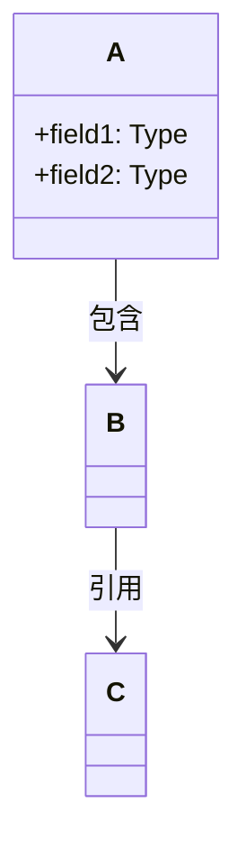

# 源码阅读方法论

> 从 JVM 源码分析实战中沉淀的通用方法论
> 适用于：Java / C++ / Go / Rust / Python 等任何语言，Spring / Netty / Redis / Linux Kernel / gRPC 等任何框架

---

## 核心信念

**程序 = 数据结构 + 算法。**

读懂一个框架，本质上是回答两个问题：
1. 它用什么数据结构存储信息？
2. 它用什么算法处理这些信息？

所有方法论都围绕这两个问题展开。

---

## 目录

- [第一部分：工作模式](#第一部分工作模式)
  - [模式 A：迭代积累（短任务）](#模式-a迭代积累短任务)
  - [模式 B：持续深挖（长任务）](#模式-b持续深挖长任务)
- [第二部分：阅读方法（8 种）](#第二部分阅读方法8-种)
  - [Read-TopDown：自顶向下](#read-topdown自顶向下)
  - [Read-BottomUp：自底向上](#read-bottomup自底向上)
  - [Read-DataFlow：数据流追踪](#read-dataflow数据流追踪)
  - [Read-WhyNot：反面推理](#read-whynot反面推理)
  - [Read-Diff：对比阅读](#read-diff对比阅读)
  - [Read-Layered：分层剥离](#read-layered分层剥离)
  - [Read-Boundary：边界探测](#read-boundary边界探测)
  - [Read-Connector：关联点分析](#read-connector关联点分析)
- [第三部分：分析质量标准](#第三部分分析质量标准)
  - [问题驱动：先问题后结构](#问题驱动先问题后结构)
  - [数据结构优先：先结构后算法](#数据结构优先先结构后算法)
  - [源码级深度：禁止伪代码](#源码级深度禁止伪代码)
- [第四部分：文档输出规范](#第四部分文档输出规范)
- [第五部分：自检清单](#第五部分自检清单)

---

## 第一部分：工作模式

### 模式 A：迭代积累（短任务）

**适用场景**：快速学习零散知识点，每次 1-2 小时，聚焦一个小问题。

#### 执行步骤

**Step 1：确定具体问题**

| 来源 | 示例 |
|------|------|
| 当前正在看的代码 | "这段代码是做什么的？" |
| 已有文档的未完成部分 | "这个模块的初始化流程还没分析" |
| 遇到的 Bug | "为什么这里会 NPE？" |

**Step 2：选择阅读方法（1-2 种）**

| 问题类型 | 推荐方法 |
|----------|---------|
| "这个功能是怎么实现的？" | `Read-TopDown` |
| "这个类是干嘛的？" | `Read-BottomUp` |
| "这个值是怎么算出来的？" | `Read-DataFlow` |
| "为什么要有这个东西？" | `Read-WhyNot` |
| "A 和 B 有什么区别？" | `Read-Diff` |
| "这段代码太复杂看不懂" | `Read-Layered` |
| "这个函数需要深入看吗？" | `Read-Boundary` |
| "这个组件在系统中什么位置？" | `Read-Connector` |

**Step 3：执行分析，产出文档**

**Step 4：更新进度**

---

### 模式 B：持续深挖（长任务）

**适用场景**：选定一个目标，持续分析、反复验证、直到完全搞懂。

#### 核心原则

1. **选定目标后不要换** — 一直分析到完全搞懂
2. **反复验证** — 同一结论用多种方法验证
3. **不断加深** — 每次迭代比上次更深入
4. **不放过任何细节** — 每个疑问都要解决

#### 五轮迭代工作流

```
┌─────────────────────────────────────────────────────────────┐
│                      持续深挖工作流                           │
├─────────────────────────────────────────────────────────────┤
│                                                             │
│  第一轮：宏观理解                                            │
│    入口函数 → 核心调用链 → 阶段划分 → 数据结构清单             │
│     ↓                                                       │
│  第二轮：数据结构全景 ⭐（必须在算法之前完成）                  │
│    逐个完整分析每个数据结构（6 项标准）                        │
│     ↓                                                       │
│  第三轮：算法/流程分析                                        │
│    真实源码 + 逐行注释 + 设计决策                             │
│     ↓                                                       │
│  第四轮：运行时验证                                           │
│    GDB / 日志 / 单元测试 验证关键结论                         │
│     ↓                                                       │
│  第五轮：查漏补缺 + 关系图                                    │
│    回顾疑问 → 画数据结构关系图 → 产出完整文档                  │
│                                                             │
└─────────────────────────────────────────────────────────────┘
```

#### 每轮执行标准

**第一轮：宏观理解**
- 找到入口函数，画出整体调用骨架
- 划分主要阶段（3-7 个）
- **穷举本次涉及的所有数据结构，列出清单**
- 输出：Mermaid 流程图 + 数据结构清单表格

**第二轮：数据结构全景（⭐ 必须在算法之前完成）**
- 逐个完整分析每个数据结构（不允许跳过）
- 每个数据结构必须覆盖 6 项（见[数据结构优先](#数据结构优先先结构后算法)）
- **此轮完成前，禁止进入第三轮**

**第三轮：算法/流程分析**
- 每个算法先讲"解决什么问题"再讲"怎么实现"
- 每步引用第二轮已分析好的数据结构
- 不能只讲查找/使用，还要讲构建/初始化
- 禁止"源码翻译"式描述，每步必须有 why

**第四轮：运行时验证**
- 设计验证计划（验证什么？用什么方法？）
- 实际运行验证关键结论
- 记录验证数据，解释异常值

**第五轮：查漏补缺 + 关系图**
- 回顾所有疑问，确认每个疑问都已解决
- **画数据结构关系图（Mermaid），串联全局**
- 输出：问题清单 + 解答 + 关系图

---

## 第二部分：阅读方法（8 种）

### Read-TopDown：自顶向下

**适用场景**："这个功能是怎么实现的？"、"从 X 入口到最终效果，中间经历了什么？"

**核心原则**：先骨架后细节，先主干后分支，逐层下钻但有节制。

#### 执行步骤

**Step 1：确定入口点**
- 明确要追踪的入口函数/方法
- 确认调用条件（什么时候、被谁调用）
- 记录入口函数的签名、参数含义

**Step 2：第一层展开（骨架）**
- 只看入口函数体内的**直接调用**，不递归进去
- 用编号列表列出主干步骤：
  ```
  入口函数 A() {
    1. B()  → 做了什么（一句话）
    2. C()  → 做了什么（一句话）
    3. if 条件 { D() } else { E() }
    4. F()  → 做了什么（一句话）
  }
  ```
- 标注哪些步骤是关键步骤（★），哪些是辅助/检查步骤
- **此阶段禁止深入任何子函数的实现**

**Step 3：确定下钻优先级**
- **必须下钻**：这是核心逻辑，不看就无法理解整体功能
- **可选下钻**：辅助逻辑，暂时当黑盒，后续按需展开
- **跳过**：日志、断言、调试代码、错误处理（第一遍忽略）

**Step 4：逐层下钻**
- 按优先级依次展开每个"必须下钻"的子函数
- 每个子函数重复 Step 2-3 的过程
- **控制深度**：一般不超过 4-5 层，超过时停下来总结当前认知

**Step 5：绘制调用链全景图**
```
A()
├── B()
│   ├── B1()  ← 关键：创建了 XXX 对象
│   └── B2()  ← 注册到全局 YYY
├── C()       ← 条件判断，标准条件下走这个分支
└── D()       ← 收尾工作
```

**Step 6：输出结论**
1. 一句话总结：这个入口函数整体做了什么
2. 主干流程：编号列表，每步一句话说清楚做了什么、为什么
3. 关键节点深入：对标★的步骤展开详细分析
4. 创建了什么：列出所有新创建的对象/数据结构，说明保存到哪里
5. 调用链全景图
6. 遗留问题：哪些子函数还没展开，标记待分析

**注意事项**
- 不要一上来就贴大段源码，先用自己的话描述骨架
- 遇到条件分支时，先明确在当前标准条件下走哪个分支
- 如果静态阅读无法确定分支走向，切换到运行时验证

---

### Read-BottomUp：自底向上

**适用场景**："这个类/结构体是干嘛的？"、"这个字段为什么存在？"

**核心原则**：不急着看内部实现，先搞清楚外部关系：谁创建它、谁用它、谁销毁它。

#### 执行步骤

**Step 1：基本信息采集**
- 找到类/结构体的定义文件
- 记录：文件位置（属于哪个子系统）、继承关系、类注释、友元类

**Step 2：搜索"谁创建了它"**
- 搜索 `new ClassName`、`ClassName::create`、构造函数调用
- 确定：在哪个流程中被创建、创建时传入了什么参数、创建后保存到了哪里

**Step 3：搜索"谁使用了它"**
- 搜索类型名出现的位置（作为参数类型、局部变量类型、成员变量类型）
- 重点关注：哪些核心函数以它作为参数、哪些类持有它的指针/引用、它的 public 方法被谁调用

**Step 4：搜索"谁销毁了它"**
- 搜索 `delete`、析构函数、`destroy`、`close` 相关
- 确定生命周期：与进程同生命周期？与某个父对象同生命周期？动态创建销毁？

**Step 5：推断角色和职责**
基于 Step 2-4 收集的外部关系，用一段话总结：
- 这个类**是什么**（一句话定义）
- **为什么需要它**（不存在它的话，谁会有问题）
- 在系统中处于**什么位置**
- **生命周期**如何

**Step 6：按需查看内部实现**
- 现在才开始看类的成员变量和方法
- 带着 Step 5 的理解去看，每个字段都要能回答"这个字段服务于什么场景"
- 如果某个字段对不上 Step 5 的理解，说明还有遗漏的使用场景，回到 Step 3 补充

**Step 7：输出结论**
1. 一句话定义：这个类是什么
2. 存在的原因：为什么需要它，解决什么问题
3. 生命周期：在哪创建、保存在哪、何时销毁
4. 外部关系图：与哪些类交互，交互方式
5. 核心字段列表：每个字段的含义和作用场景
6. 核心方法列表：关键方法的职责（一句话）

---

### Read-DataFlow：数据流追踪

**适用场景**："这个值是怎么算出来的？"、"这个指针指向哪里？"、"这个配置参数最终影响了什么？"

**核心原则**：锁定一个具体的数据，像侦探一样追踪它的一生：出生 → 变换 → 传递 → 使用 → 消亡。

#### 执行步骤

**Step 1：锁定目标数据**
- 明确要追踪的数据是什么（一个变量、一个字段、一个返回值）
- 记录它的类型、当前所在位置
- 明确追踪方向：正向（往后被传给谁）还是反向（从哪来的）

**Step 2：反向追踪——溯源**
从目标数据的当前位置往上追：
- 如果是**局部变量**：找赋值语句，看右边是什么
- 如果是**参数**：找调用者传了什么
- 如果是**成员变量**：找构造函数或 setter 在哪赋值
- 如果是**函数返回值**：进入函数看 return 语句
- 如果是**计算结果**：拆解公式，每个操作数递归追踪
- **持续往上追，直到找到"原始来源"**（用户输入、配置参数、硬编码常量）

每一步记录：
```
数据 X
  ← 来自 函数A() 的返回值
    ← 来自 变量B，在第N行赋值
      ← 来自 参数C，由调用者传入
        ← 来自 全局变量D._field
          ← 在初始化阶段由 init() 设置为 常量值 V
```

**Step 3：正向追踪——去向**
从目标数据往下追：
- 被传给了哪些函数（作为参数）
- 被赋值给了哪些变量/字段（保存）
- 参与了哪些计算（变换）
- 影响了哪些条件分支（决策）
- 最终效果是什么

**Step 4：识别关键变换点**
在追踪路径上，标记所有对数据进行**变换**的位置：
- 类型转换（cast）
- 算术运算（移位、掩码、加减）
- 条件修改（if 分支里被修改）
- 包装/解包

每个变换点要回答：**为什么要做这个变换？**

**Step 5：输出数据流图**
```
[源头] 常量/配置/计算
   │
   ▼ 赋值给 A._field
   │
   ▼ 被 B() 读取，作为参数传给 C()
   │
   ▼ 在 C() 中右移3位（÷8，因为 XXX 原因）
   │
   ▼ 作为索引访问 D[index]
   │
   ▼ 结果写入 E._result
   │
   ▼ 最终被 F() 用于决定是否触发某个行为
```

**注意事项**
- 追踪时**只关注目标数据**，不要被其他逻辑带偏
- 遇到分支时，先确定标准条件下走哪个分支
- 追踪深度控制：如果超过 8 层还没到源头/终点，先输出已有路径，标记待续

---

### Read-WhyNot：反面推理

**适用场景**："为什么要有这个东西？"、"为什么要这样设计？"

**核心原则**：理解一个东西为什么存在，最有效的方法是假设它不存在，看会出什么问题。问题就是它存在的理由。

#### 执行步骤

**Step 1：明确目标机制**
- 一句话描述这个机制目前做了什么
- 它属于哪个子系统
- 它的核心操作是什么

**Step 2：构建"没有它"的世界**
假设把这个机制完全删掉：
- **功能上**：原来依赖它的操作怎么办？有没有替代方案？
- **正确性**：会不会产生错误结果？（数据不一致、内存损坏、竞态条件...）
- **性能**：会不会变慢？慢多少？能量化吗？

要具体到场景，例如：
```
假设没有连接池：
- 场景：每次数据库查询都新建连接
- 没有连接池：TCP 握手 + 认证 ≈ 50ms，高并发下连接数爆炸
- 有连接池：复用已有连接，查询延迟 < 1ms
- 性能差距：50 倍以上
```

**Step 3：分析引入的代价**
任何机制都有代价，要分析：
- **空间代价**：占多少内存？
- **时间代价**：维护它需要多少额外操作？
- **复杂性代价**：增加了多少代码复杂度？
- **这些代价和它解决的问题相比，是否值得？**

**Step 4：找到源码中的"证据"**
- 在源码中找到这个机制被使用的关键位置
- 标注如果没有这个机制，这段代码会变成什么样
- 如果有注释说明设计原因，引用出来

**Step 5：输出结论**
1. **问题**：没有这个机制会出什么问题（具体场景 + 量化影响）
2. **方案**：这个机制怎么解决这个问题的（核心思路，2-3 句话）
3. **代价**：引入这个机制付出了什么代价
4. **权衡**：为什么代价是可接受的
5. **源码证据**：关键源码位置 + 注释
6. **一句话总结**："X 的存在是因为如果没有它，Y 场景下会出现 Z 问题，而 X 的代价（W）远小于 Z 的影响"

**思维模板**：对任何机制 X，回答以下问题链：
```
1. X 做了什么？
2. 如果没有 X，会出什么问题？
3. 这个问题有多严重？（量化）
4. X 是怎么解决这个问题的？
5. X 本身有什么代价？
6. 有没有更好的方案？（如果有，为什么没采用？）
```

---

### Read-Diff：对比阅读

**适用场景**："A 和 B 有什么区别？"、"为什么有两种实现？"

**核心原则**：找到相似实现的共同骨架，然后聚焦差异点，每个差异点回答"为什么不同"。

#### 执行步骤

**Step 1：确定对比对象**
- 明确要对比的 2-3 个对象（不要超过 3 个）
- 确认它们确实可比（属于同一类别/解决同一类问题）
- 用一句话描述每个对象的核心定位

**Step 2：提取共同骨架**
- 找到对比对象共享的抽象结构：共同的父类/接口、共同的处理阶段、共同的输入/输出
- 画出这个共同骨架，作为对比的坐标系

**Step 3：逐维度对比**
建立对比表格，**关键：每个差异都要填"为什么不同"这一列**：

```markdown
| 维度 | 对象A | 对象B | 为什么不同 |
|------|-------|-------|-----------|
| 触发条件 | ... | ... | ... |
| 核心数据结构 | ... | ... | ... |
| 时间复杂度 | ... | ... | ... |
| 适用场景 | ... | ... | ... |
```

**Step 4：找到设计权衡**
- 每个差异点背后都有一个设计权衡（trade-off）
- 常见的权衡维度：吞吐量 vs 延迟、内存开销 vs CPU 开销、简单性 vs 通用性、启动速度 vs 峰值性能

**Step 5：源码级验证差异**
- 对每个关键差异点，找到源码中的具体体现
- 贴出对比代码片段（精简到只展示差异部分）

**Step 6：输出结论**
1. 一句话对比："A 是...，B 是...，核心区别在于..."
2. 共同骨架：它们的共同点/共同流程
3. 对比表格：多维度对比
4. 设计权衡总结：为什么要有两种实现
5. 选择指南：什么场景该选 A，什么场景该选 B

---

### Read-Layered：分层剥离

**适用场景**："这段代码太复杂，看不懂"、一个函数几百行，多个关注点交织在一起。

**核心原则**：复杂代码之所以复杂，是因为多个关注点交织在一起。把它们一层层剥开，每次只关注一个层面。

#### 通用的"层"（从外到内依次剥离）

| 层 | 内容 | 处理方式 |
|----|------|---------|
| 第1层 | **日志/Trace** | `log.debug`、`logger.info`、事件通知 → 直接忽略 |
| 第2层 | **断言/检查** | `assert`、`Preconditions.check`、参数校验 → 记下检查条件，然后忽略 |
| 第3层 | **统计/计数** | 计数器、监控埋点、Metrics → 忽略 |
| 第4层 | **错误处理** | try-catch、异常路径、降级逻辑 → 标记后忽略，只看正常路径 |
| 第5层 | **平台/环境分支** | `#ifdef`、`if (isWindows)`、环境判断 → 只看当前环境 |
| 第6层 | **性能优化** | fast path / slow path、缓存、批处理 → 先只看 slow path（完整逻辑），再看 fast path 优化了什么 |
| **剩下的** | **核心逻辑** | 这才是真正要理解的代码 |

#### 执行步骤

**Step 1**：读取目标函数的完整源码，记录总行数

**Step 2**：逐层剥离，每剥一层用注释标记被忽略的部分：`/* [日志] */`、`/* [断言] */`

**Step 3**：理解核心骨干，用自然语言写出伪代码（不超过 20 行），标注每一步的目的

**Step 4**：按需回填，理解了核心逻辑后，根据需要回填被剥离的层

**Step 5**：输出结论
1. 核心逻辑伪代码（≤20行）
2. 各层标注：哪些代码属于哪一层，占比多少
3. 正常路径 vs 异常路径：分别描述

---

### Read-Boundary：边界探测

**适用场景**："这个函数我需要深入看吗？"、追踪流程时遇到一个子调用，需要决定是否下钻。

**核心原则**：不是所有代码都值得深入。先搞清楚黑盒的输入、输出、前置条件、后置条件和副作用，再决定是否要打开它。

#### 执行步骤

**Step 1**：提取函数签名，从签名中提取信息：返回值含义、参数含义（哪些是输入、哪些是输出）、是否修改对象状态、是否可能抛异常

**Step 2**：读取文档注释（函数上方的注释、接口声明处的注释）

**Step 3**：快速扫描函数体（30 秒），不深入理解逻辑，只看：
- 函数长度（行数）→ 感受复杂度
- return 语句 → 确认返回了什么
- 成员变量赋值 → 确认修改了什么状态
- 全局变量/单例访问 → 确认有哪些外部副作用

**Step 4**：建立黑盒模型
```
┌─────────────────────────────────────────┐
│ 函数名：XXX.yyy()                         │
├─────────────────────────────────────────┤
│ 输入：                                    │
│   - 参数A：含义                            │
│   - 隐含输入：this.field（依赖的状态）       │
├─────────────────────────────────────────┤
│ 输出：                                    │
│   - 返回值：含义                           │
│   - 修改 this.field1 为...               │
├─────────────────────────────────────────┤
│ 副作用：                                   │
│   - 分配了资源（连接/内存/文件句柄）          │
│   - 修改了全局状态 XXX                      │
│   - 获取/释放了锁 YYY                      │
├─────────────────────────────────────────┤
│ 前置条件：必须持有锁 ZZZ / 参数A 不能为 null │
│ 后置条件：返回值一定不为 null（或失败时为 null）│
├─────────────────────────────────────────┤
│ 复杂度：XX 行，是否值得深入：是/否            │
└─────────────────────────────────────────┘
```

**Step 5**：做出决策
- **跳过**：黑盒模型已经足够理解上层逻辑
- **浅入**：需要知道大致流程但不需要每行代码 → 只做第一层展开
- **深入**：这是核心逻辑，必须完全理解 → 切换到 Read-TopDown

**判断是否深入的规则**

| 必须深入的信号 | 可以跳过的信号 |
|--------------|--------------|
| 这是当前分析主题的核心逻辑 | 工具函数（align、max、log 等） |
| 返回值/副作用直接影响后续关键流程 | 纯日志/统计函数 |
| 你无法从签名和注释推断出它做了什么 | 已经在其他地方分析过了 |
| 函数名出现在面试高频题中 | 与当前分析主题无关的辅助逻辑 |

---

### Read-Connector：关联点分析

**适用场景**："这个组件在系统中处于什么位置？"、"谁依赖它？它依赖谁？"

**核心原则**：一个组件的价值不在于它自身，而在于它和其他组件的连接。搞清楚所有连接点，就理解了它在系统中的角色。

#### 执行步骤

**Step 1**：确定目标组件的边界（核心类/文件范围、分析粒度）

**Step 2**：搜索所有"入向"连接（谁调用/使用它）
```
入向连接：
├── 被 XXX 模块调用
│   ├── A.java:123 → 调用了 target.methodA()（目的：...）
│   └── B.java:456 → 读取了 target.field（目的：...）
└── 被 YYY 模块调用
    └── C.java:789 → 注册为回调（目的：...）
```

**Step 3**：搜索所有"出向"连接（它调用/使用谁）
```
出向连接：
├── 依赖 XXX 模块
│   └── 调用 P.methodC()（目的：...）
└── 依赖 YYY 模块
    └── 使用 S 类型作为成员变量（目的：...）
```

**Step 4**：识别通信方式
- **直接调用**：A 调用 B 的方法
- **回调/监听**：A 注册回调到 B，B 在某个时机调用
- **共享数据**：A 和 B 通过共享的全局/静态数据通信
- **事件/通知**：A 发事件，B 收到通知

**Step 5**：绘制交互图
```
                    ┌───────────┐
                    │  调用者1   │
                    └─────┬─────┘
                          │ 调用 methodA()
                          ▼
┌───────────┐      ┌─────────────┐      ┌───────────┐
│  依赖组件1  │◄─────│  目标组件    │─────►│  依赖组件2  │
└───────────┘ 调用  └──────┬──────┘ 读取  └───────────┘
                          │
                          │ 注册回调
                          ▼
                    ┌───────────┐
                    │  回调目标   │
                    └───────────┘
```

**Step 6**：输出结论
1. 组件定位：一句话说明它在系统中的角色
2. 入向连接表：谁使用它、怎么用、频率
3. 出向连接表：它依赖谁、怎么用、频率
4. 交互图：可视化关系网络
5. 影响范围评估：如果修改这个组件，会影响哪些地方

---

## 第三部分：分析质量标准

### 问题驱动：先问题后结构

**核心教训**：直接甩数据结构 = 读者一脸懵 = 无效分析。

数据结构不是凭空冒出来的，它是对问题的回答。先给问题，读者才有理解结构的动机和上下文。

#### 5 步流程（不可跳步）

```
Step 1: 提出问题（这个模块/组件要解决什么问题？）
    ↓
Step 2: 推导设计（要解决这个问题，需要什么信息？信息怎么组织？）
    ↓
Step 3: 引出数据结构（所以设计者创建了 XXX 结构来存储这些信息）
    ↓
Step 4: 完整分析数据结构（全部字段 + 含义 + 大小 + 生命周期）
    ↓
Step 5: 分析算法流程（引用已分析好的数据结构）
```

**核心检验标准**：读者在看到真实数据结构之前，应该已经能猜到"大概需要什么样的结构"。如果做不到，说明推导不够。

#### 数据结构引出模板

```markdown
### X.Y <结构名> — <一句话角色>

#### 问题推导

**问题**：<从上层问题自然引出的子问题>

**需要什么信息？**
- <推导过程第一步>
- <推导过程第二步，逐步收紧>
- <推导过程第三步，自然引出结构形状>

**推导出的结构**：<用自然语言描述结构特征>
- <key 是什么、value 是什么、为什么>

#### 真实数据结构

```<language>
// 文件名:行号
<真实源码，带注释>
```

**推导 vs 实际**：<对比推导结果和实际结构，解释差异（如有）>

#### 完整分析
（字段列表 / 大小 / 创建位置 / 生命周期 / 值域图）

#### 设计决策
- **为什么用 X 而不是 Y？** <理由>
```

#### 推导技巧

**技巧 1：从"最朴素方案"开始，逐步加约束**
```
"需要存储线程列表" → List<Thread>?
  → 但需要快速移除 → LinkedList?
  → 但需要从任意位置移除 → 双向链表
  → 但需要首尾相连方便遍历 → 双向循环链表
```

**技巧 2：从"使用场景"反推结构**
```
场景：notify() 取一个，notifyAll() 取所有，wait() 加入，中断线程自我移除
  → 需要头插/头取 → 链表
  → 需要任意位置删除 → 双向
  → 需要遍历所有 → 循环
```

**技巧 3：用"如果不这样会怎样"验证**
```
"为什么用 WeakReference？"
  → 如果用强引用 → 对象永远不会被 GC → 内存泄漏
  → 所以必须 WeakReference
```

**技巧 4：从"边界情况"发现隐藏字段**
```
"为什么有 prev 和 next 两个指针？"
  → 只有 next 能实现单向链表，已经够用了
  → 但中断时需要从任意位置 O(1) 删除
  → 单向链表删除需要找前驱，O(n)
  → 所以必须有 prev，实现 O(1) 删除
```

#### 错误示例（禁止）

❌ **错误 1：上来就甩数据结构**
```markdown
### AdviceListenerManager
#### 全部字段
Map<ClassLoader, Map<String, List<Listener>>> listenerMap
#### 含义
外层是 ClassLoader，内层是方法标识...
```
问题：读者看到第一行就懵了——为什么是双层 Map？没有动机就没有理解。

❌ **错误 2：推导过于敷衍**
```markdown
**问题**：需要管理监听器
**推导**：用一个 Map 存
**真实结构**：Map<ClassLoader, Map<String, List<Listener>>>
```
问题：推导太跳跃，从"用一个 Map"到"双层 WeakKey Map"之间的思考过程全丢了。

---

### 数据结构优先：先结构后算法

**核心教训**：急于输出算法流程、跳过数据结构完整分析 = 必然返工。

#### 硬性规则

**规则 1：先数据结构，后算法（不可逆转）**

```
Step 1：穷举数据结构清单
    ↓
Step 2：逐个完整分析每个数据结构
    ↓
Step 3：分析算法流程（引用已分析好的数据结构）
    ↓
Step 4：画数据结构关系图
```

**禁止**在 Step 2 完成之前写 Step 3。

**规则 2：数据结构分析的完整性标准（6 项必须覆盖）**

| # | 必须项 | 说明 | 反例（禁止） |
|---|--------|------|-------------|
| 1 | **全部字段** | 列出所有字段，不能省略 | "主要字段有 name, id 等" |
| 2 | **每个字段的含义** | 一句话说清楚是什么、用在哪 | 只列字段名不解释 |
| 3 | **大小/内存布局** | sizeof（C++）/ shallow size（Java）/ 估算（Go） | 不提大小 |
| 4 | **创建位置** | 谁创建的、在哪个函数、什么时机 | 不提来源 |
| 5 | **关键字段的生命周期** | 谁设置 → 何时设置 → 设置什么值 → 谁读取 | 只讲"有这个字段" |
| 6 | **值域图（如适用）** | 一个字段有多种编码/状态时画值域图或状态机图 | 只提"可以存两种值" |

**规则 3：算法描述的质量标准**

对每个算法/流程，**必须**按此顺序描述：
1. 解决什么问题（为什么需要这个算法）
2. 核心思路（一句话概括）
3. 输入是什么（引用 Step 2 的数据结构）
4. 输出是什么（引用 Step 2 的数据结构）
5. 步骤分解（每步用自然语言 + 源码关键行）
6. 关键设计决策（为什么这样而不是那样）

**禁止**的算法描述方式：
- ~~"然后调用了 XXX 函数"~~ → 要说"为了解决 Y 问题，调用 XXX 做了 Z"
- ~~贴 50 行源码然后说"如上所示"~~ → 要先自然语言描述，再贴关键 5-10 行
- ~~只讲查找/使用~~ → 还要讲构建/初始化过程

**规则 4：关系图是必须项**

每篇分析文档的最后一节之前，必须有一个 Mermaid 数据结构关系图，展示：
- 所有涉及的数据结构
- 它们之间的包含/引用/继承关系
- 关键字段之间的指向关系

**规则 5：总结必须分两个维度**
- **数据结构层面**：涉及了哪些结构、每个结构的核心特征
- **算法层面**：涉及了哪些算法、每个算法的核心设计决策

---

### 源码级深度：禁止伪代码

**核心教训**：用伪代码/自然语言概括算法流程 = 没有深度 = 必然返工。

#### 深度层级量表

| 层级 | 描述 | 示例 | 是否达标 |
|------|------|------|---------|
| L1 | 自然语言概括 | "wait 释放锁并挂起" | ❌ |
| L2 | 伪代码流程 | `function wait(): save; exit(); park()` | ❌ |
| L3 | 真实源码 + 少量注释 | 贴源码，只注释几个关键行 | ⚠️ 勉强 |
| **L4** | **真实源码 + 逐行注释 + 设计解释** | 每个关键行有注释 + 解释为什么 | **✅ 标准** |
| L5 | L4 + 对比表 + 状态机图 | 完整分析 | ✅✅ 优秀 |

**目标：所有算法描述达到 L4 或 L5。**

#### 硬性规则

**规则 1：算法描述必须使用真实源码（禁止伪代码）**

❌ 禁止：
```
function wait():
    // 保存 recursions, exit, park, 重入
```

✅ 必须：
```java
// AbstractQueuedSynchronizer.java:1497
final boolean parkAndCheckInterrupt() {
    LockSupport.park(this);          // ★ 挂起当前线程，等待 unpark 或中断
    return Thread.interrupted();     // ★ 返回并清除中断标志（注意：清除！）
}
```

**规则 2：每个函数必须包含的 4 个要素**

| # | 要素 | 说明 |
|---|------|------|
| 1 | **源码文件:行号** | 如 `AbstractQueuedSynchronizer.java:1497` |
| 2 | **解决什么问题** | 一句话：为什么需要这个函数 |
| 3 | **真实源码 + 逐行注释** | 关键行全部有中文注释 |
| 4 | **设计决策解释** | 为什么这样而不是那样 |

**规则 3：源码裁剪标准**

| 类别 | 处理方式 |
|------|---------|
| **保留** | 核心逻辑、CAS/atomic 操作、状态转换、内存屏障 |
| **省略**（用 `// ... 省略：XXX` 标注） | 日志输出、监控埋点、纯断言、调试代码 |
| **禁止省略** | 竞态条件处理、内存屏障/ordering、错误分支逻辑 |

**规则 4：长函数的分段描述**

超过 100 行的函数：
1. 先给出**整体阶段划分**（一个表格或编号列表，不超过 10 行）
2. 然后**逐阶段**贴源码 + 注释
3. 阶段与阶段之间说清楚**衔接关系**

**规则 5：多策略时必须画对比表**

```markdown
| 策略 | 目标队列 | 位置 | 特点 | 默认？ |
|------|---------|------|------|--------|
| 策略A | 队列1 | 头部 | 优先竞争 | |
| **策略B** | 队列1/2 | 头部 | 兼顾效率和公平 | **✅** |
```

---

## 第四部分：文档输出规范

### 完整文档结构模板

```markdown
# <模块名> 深度解析

> 基于 <框架名> <版本> 源码分析
> 方法论：程序 = 数据结构 + 算法

---

## 第 0 部分：核心原理 ⭐

### 0.1 本质是什么？（1 句话）
### 0.2 为什么需要？（从根本问题讲起，2-3 段话）
### 0.3 怎么解决？（核心思路 + 关键设计）
### 0.4 为什么这样设计？（"为什么 X 而不是 Y？"格式）

---

## 第 1 部分：数据结构全景 ⭐（必须在算法之前）

### 1.1 数据结构清单

| 结构名 | 源码位置 | 核心作用 |
|--------|----------|----------|

### 1.2 结构 A — <一句话角色>

#### 问题推导
（问题 → 需要什么 → 推导出的结构）

#### 真实数据结构
（源码 + 注释）

#### 完整分析
（全部字段 + 含义 + 大小 + 创建位置 + 关键字段生命周期 + 值域图）

#### 设计决策
（为什么 X 而不是 Y？）

### 1.3 结构 B
（同上）

---

## 第 2 部分：算法/流程分析

### 2.1 核心流程概览（Mermaid 图）

### 2.2 流程 A

#### 解决什么问题？（一句话）
#### 源码位置：`文件名:行号范围`
#### 真实源码 + 逐行注释
#### 设计决策

### 2.3 流程 B
（同上）

---

## 第 3 部分：运行时验证

### 3.1 验证计划
- 验证目标 1：数据结构大小/布局
- 验证目标 2：算法流程走向
- 验证目标 3：关键字段值

### 3.2 验证方法
（GDB 脚本 / 日志分析 / 单元测试 / 压测）

### 3.3 验证结果
（关键输出 + 解释）

---

## 数据结构关系图（Mermaid）



---

## 总结

### 数据结构层面
- 涉及了哪些结构？
- 每个结构的核心特征？

### 算法层面
- 涉及了哪些算法？
- 每个算法的核心设计决策？
```

### 第 0 部分写作规范（核心原理）

| 要点 | 要求 | 反例（禁止） |
|------|------|-------------|
| 本质 | 一句话概括核心问题 | 模糊描述 |
| 为什么需要 | 从根本机制缺陷讲起 | 罗列场景 |
| 怎么解决 | 核心思路 + 关键设计（2-3 段话） | 堆砌代码 |
| 为什么这样设计 | 解释设计决策的理由 | 只说"做了什么" |
| 长度 | 精炼，不凑字数 | 堆砌表格/场景 |

---

## 第五部分：自检清单

### 数据结构分析自检

- [ ] 每个数据结构都有"问题推导"段落？（问题 → 需要什么 → 推导出的结构）
- [ ] 读者看到真实源码前，能猜到大致形状？
- [ ] 推导过程逐步收紧，没有跳跃？
- [ ] 有"推导 vs 实际"对比，解释差异？
- [ ] 每个数据结构都有完整的字段列表？（不是"等"、"主要字段"）
- [ ] 每个字段都有含义说明？
- [ ] 关键数据结构有大小（sizeof / shallow size）？
- [ ] 关键字段有生命周期追踪？（谁设置、何时、什么值）
- [ ] 有多种编码的字段画了值域图？
- [ ] 有"为什么 X 而不是 Y"的设计决策？

### 算法分析自检

- [ ] 算法描述先讲"解决什么问题"？
- [ ] 不存在"源码翻译"式描述？（每步都有 why）
- [ ] 涉及的结构既讲了查找/使用也讲了构建/初始化？
- [ ] 每个函数都标注了源码文件和行号范围？
- [ ] 每个函数都用真实源码（不是伪代码）？
- [ ] 关键行都有逐行注释？
- [ ] CAS/内存屏障/状态转换代码都保留了？
- [ ] 有多种策略时画了对比表？
- [ ] 长函数有阶段划分？

### 文档完整性自检

- [ ] 有数据结构关系图（Mermaid）？
- [ ] 总结分了数据结构和算法两个维度？
- [ ] 每篇文档至少一个 Mermaid 图？
- [ ] 关键结论有运行时验证？

---

## 附录：行号标注规范（No-LineNumber-Verify）

> **核心教训（来自 ParallelGC 02 篇 re-check）**：花大量时间逐一核对源码行号，收益极低，且行号会随版本变化而失效。

### 规则

**行号只标注，不验证，不作为 re-check 项目。**

| 场景 | 做法 |
|------|------|
| 写文档时 | 标注行号（方便读者定位），但不需要精确到个位数 |
| re-check 时 | **跳过行号核对**，只检查逻辑正确性、字段完整性、设计解释 |
| 行号有偏差 | 不修复，除非偏差超过 20 行导致读者找不到代码 |

### re-check 真正应该检查的内容

| 优先级 | 检查项 |
|--------|--------|
| 🔴 必查 | 字段是否遗漏（尤其是条件编译块内的字段） |
| 🔴 必查 | sizeof 估算是否正确（vtable 指针、padding 是否算进去） |
| 🔴 必查 | 关键逻辑是否遗漏（如 `set_covered_region` 两次调用的不同含义） |
| 🔴 必查 | 条件编译（`#if INCLUDE_SERIALGC` 等）是否正确标注 |
| 🟡 次查 | 设计决策解释是否充分（"为什么 X 而不是 Y"） |
| 🟡 次查 | 数据结构关系图是否准确 |
| 🟢 可选 | 行号偏差（仅当偏差 > 20 行时修正） |
| ❌ 跳过 | 行号精确核对（个位数偏差不修复） |

---

## 附录：方法选择速查表

| 用户问的是... | 推荐方法 |
|-------------|---------|
| "XXX 是怎么实现的/流程是什么" | `Read-TopDown` |
| "这个类/结构体是干嘛的" | `Read-BottomUp` |
| "这个值怎么算出来的/这个指针指向哪" | `Read-DataFlow` |
| "A 和 B 有什么区别" | `Read-Diff` |
| "为什么要有这个东西" | `Read-WhyNot` |
| "这段代码太复杂看不懂" | `Read-Layered` |
| "这个函数需要深入看吗" | `Read-Boundary` |
| "这个组件在系统中什么位置" | `Read-Connector` |
| 需要深度分析一个模块 | 五轮迭代（模式 B） |

---

## 附录：三大质量标准的关系

```
问题驱动（Problem-Driven）
  ↓ 推导出结构后
数据结构优先（DataStructure-First）
  ↓ 分析完数据结构后
源码级深度（Source-Code-Depth）
```

三者是递进关系：
- **问题驱动**：管数据结构**怎么引出**（从问题推导到结构）
- **数据结构优先**：管**顺序**（先数据结构后算法）和**完整性**（6 项标准）
- **源码级深度**：管算法**怎么写**（真实源码 + 逐行注释 + 设计解释）
